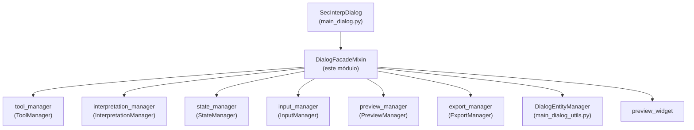

---
tags:
  - secinterp
  - code-walkthrough
  - gui
  - mixins
aliases:
  - dialog_facade_mixin.py
  - DialogFacadeMixin
cssclass: secinterp-note
---

# `gui/dialog_facade_mixin.py`

> [!abstract] Resumen en una línea
> Mixin de fachada que expone la API pública estable del diálogo principal como proxies finos que delegan cada llamada al mánager especializado que la implementa.

**Ruta**: `gui/dialog_facade_mixin.py` (166 líneas)
**Clase principal**: `DialogFacadeMixin`
**Capa**: GUI (capa de presentación · Mixin sin estado propio)
**Tags**: #secinterp #gui #mixins

---

## 🎯 ¿Por qué existe este archivo?

`SecInterpDialog` coordina siete mánagers (`tool`, `interpretation`, `state`,
`input`, `preview`, `export`, `signal`) más la navegación y la factoría de capas.
Sin una fachada, cada consumidor (señales, botones, herramientas de mapa) tendría
que conocer qué mánager resuelve cada operación:

| Problema | Solución |
|----------|----------|
| Los callbacks de señales y map-tools necesitan una API estable del diálogo | El mixin expone `toggle_measure_tool()`, `preview_profile_handler()`, `accept_handler()`… como superficie estable |
| Añadir o dividir un mánager rompería decenas de conexiones | Solo el proxy cambia; las firmas públicas permanecen intactas |
| `main_dialog.py` superaría el límite de 300 líneas por clase de diálogo | Toda la delegación vive aquí; el diálogo solo compone (`DialogLifecycleMixin`, `DialogMessageMixin`, `DialogFacadeMixin`, `SecInterpMainWindow`) |

> [!important] Nota arquitectónica
> **Facade + Proxy**: el mixin no contiene lógica de negocio ni estado propio; cada
> método es un proxy de 1–3 líneas hacia `self.tool_manager`, `self.state_manager`,
> `self.preview_manager`, `self.export_manager`, `self.input_manager`,
> `self.interpretation_manager` o `DialogEntityManager` (métodos estáticos).

---

## 🧬 Diagrama de relaciones



> [!tip] Cómo leer
> Flecha sólida = delega (`self.<manager>.<método>()`); no hay herencia desde los
> mánagers, solo composición instalada por `SecInterpDialog._init_managers()`.

---

## 📦 Imports — lectura arquitectónica

```python
# gui/dialog_facade_mixin.py
from __future__ import annotations
from typing import Any
from qgis.core import Qgis
from sec_interp.core.domain import InterpretationPolygon
from sec_interp.gui.main_dialog_utils import DialogEntityManager
from sec_interp.logger_config import get_logger

logger = get_logger(__name__)
```

| # | Observación |
|---|-------------|
| ① | `from __future__ import annotations` — estándar del proyecto; permite `list[InterpretationPolygon]` en la propiedad sin coste en runtime. |
| ② | `typing.Any` — los proxies de combobox (`source_combobox`, `target_combobox`) y utilidades de iconos se tipan como `Any` porque son widgets Qt heterogéneos. |
| ③ | `qgis.core.Qgis` — solo se usa el enum `Qgis.MessageLevel.Warning` en `preview_profile_handler`; el mixin no crea geometrías ni accede a capas. |
| ④ | `InterpretationPolygon` viene de `sec_interp.core.domain` (DTO del dominio, no un objeto QGIS): la firma `on_interpretation_finished(interpretation)` respeta Extract-then-Compute. |
| ⑤ | `DialogEntityManager` — utilidades **estáticas** de entidades (campos, capas, iconos de tema); el mixin las reexpone para compatibilidad hacia atrás. |
| ⑥ | `get_logger(__name__)` — un único `logger.info` real en el módulo (`clear_cache_handler`); el resto del logging vive en los mánagers. |

---

## 🏗️ Inventario de estructura

**Clases:** 1 — `DialogFacadeMixin` (sin `__init__`, sin atributos propios; todo lo que toca cuelga de `self`, inyectado por `SecInterpDialog`).

**Métodos por grupo de delegación:**

| Grupo | Métodos | Delega a |
|-------|---------|----------|
| Herramientas de mapa | `toggle_measure_tool`, `update_measurement_display`, `toggle_interpretation_tool`, `on_interpretation_finished` | `tool_manager`, `interpretation_manager` |
| Compatibilidad de interpretaciones | `interpretations` (property + setter), `_load_interpretations`, `_save_interpretations` | `interpretation_manager` |
| Estado de la UI | `update_preview_checkbox_states`, `update_button_state` | `state_manager` |
| Lectura de entradas | `get_selected_values`, `get_preview_options` | `input_manager`, `preview_widget` |
| Preview y export | `update_preview_from_checkboxes`, `preview_profile_handler`, `export_preview` | `preview_manager`, `export_manager` |
| Aceptar / rechazar / utilidades | `accept_handler`, `reject_handler`, `clear_cache_handler`, `reset_defaults_handler` | `state_manager`, validación, caché |
| Entidades estáticas | `_populate_field_combobox`, `get_layer_names_by_type`, `get_layer_names_by_geometry`, `getThemeIcon` | `DialogEntityManager` |
| Ajustes de usuario | `_load_user_settings`, `_save_user_settings` | `state_manager` |

---

## 📁 Archivos del paquete

Este módulo es un archivo individual dentro de `gui/`; sus hermanos de composición son:

| Archivo | Rol en la composición |
|---|---|
| `gui/main_dialog.py` | `SecInterpDialog(DialogLifecycleMixin, DialogMessageMixin, DialogFacadeMixin, SecInterpMainWindow)` — raíz de composición |
| `gui/dialog_lifecycle_mixin.py` | `wheelEvent`, `closeEvent`, limpieza determinista |
| `gui/dialog_message_mixin.py` | `push_message`, `handle_error` (barra de mensajes + área de resultados) |
| `gui/main_dialog_utils.py` | `DialogEntityManager` — utilidades estáticas reexpuestas por este mixin |
| `gui/dialog_interpretation_manager.py` | `InterpretationManager` — destino de los proxies de interpretación |

---

## 📖 Recorrido método por método

### `toggle_measure_tool` / `update_measurement_display`

```python
def toggle_measure_tool(self, checked: bool) -> None:
    """Toggle measurement tool via tool_manager."""
    self.tool_manager.toggle_measure_tool(checked)

def update_measurement_display(self, metrics: dict[str, Any]) -> None:
    """Display measurement results from multi-point tool via tool_manager."""
    self.tool_manager.update_measurement_display(metrics)
```

Proxy puro 1:1 hacia `ToolManager`. El segundo es además el **callback** que
`SecInterpDialog._init_managers()` inyecta en `ToolManager(...)` como
`update_measurement_display`, cerrando el bucle herramienta → diálogo sin imports
circulares. Ver [[dialog_tool_manager]] y [[measure_tool]].

### `toggle_interpretation_tool` / `on_interpretation_finished`

```python
def toggle_interpretation_tool(self, checked: bool) -> None:
    """Toggle interpretation tool via tool_manager."""
    self.tool_manager.toggle_interpretation_tool(checked)

def on_interpretation_finished(self, interpretation: InterpretationPolygon) -> None:
    """Handle finalized interpretation polygon."""
    self.interpretation_manager.handle_interpretation_finished(interpretation)
```

El final de un polígono viaja herramienta → fachada → `InterpretationManager`,
que aplica herencia de atributos y abre [[interpretation_properties_dialog]].
La firma usa el DTO `InterpretationPolygon`, nunca `QgsGeometry`. Ver
[[dialog_interpretation_manager]].

### `interpretations` (property + setter)

```python
@property
def interpretations(self) -> list[InterpretationPolygon]:
    """Proxy to interpretations in the manager for backward compatibility."""
    return self.interpretation_manager.interpretations

@interpretations.setter
def interpretations(self, value: list[InterpretationPolygon]) -> None:
    """Set interpretations in the manager."""
    self.interpretation_manager.interpretations = value
```

Alias de compatibilidad: el código heredado lee `dialog.interpretations` mientras
el estado real vive en el mánager. El setter permite rehidratar la lista completa
(p. ej. tras `sync_from_layer`). Ver [[interpretation_persistence_mixin]].

### `update_preview_checkbox_states` / `update_button_state`

```python
def update_preview_checkbox_states(self) -> None:
    """Enable or disable preview checkboxes via state_manager."""
    self.state_manager.update_preview_checkbox_states()

def update_button_state(self) -> None:
    """Enable or disable buttons via state_manager."""
    self.state_manager.update_button_state()
```

Habilitado/deshabilitado de la UI según disponibilidad de datos. Los llama
`StateManager.update_all()` y el cableado de [[dialog_signal_manager]] tras cada
cambio de capa o parámetro. Ver [[dialog_state_manager]].

### `get_selected_values` / `get_preview_options`

```python
def get_selected_values(self) -> dict[str, Any]:
    return self.input_manager.get_all_values()

def get_preview_options(self) -> dict[str, Any]:
    return {
        "show_topo": bool(self.preview_widget.chk_topo.isChecked()),
        ...
        "max_points": self.preview_widget.spin_max_points.value(),
        "auto_lod": self.preview_widget.chk_auto_lod.isChecked(),
        "use_adaptive_sampling": bool(self.preview_widget.chk_adaptive_sampling.isChecked()),
    }
```

Dos sabores de lectura: `get_selected_values` devuelve el formato plano heredado
(`input_manager.get_all_values()`), mientras `get_preview_options` lee el
`preview_widget` programático (6 checkboxes + `spin_max_points` + LOD/sampling).
Es la fase **Extract** del patrón Extract-then-Compute. Ver
[[dialog_input_manager]] y [[preview_page]].

### `update_preview_from_checkboxes` / `preview_profile_handler`

```python
def update_preview_from_checkboxes(self) -> None:
    """Update preview when checkboxes change via PreviewManager."""
    self.preview_manager.update_from_checkboxes()

def preview_profile_handler(self) -> None:
    """Generate a quick preview and auto-save settings on success."""
    success, message = self.preview_manager.generate_preview()
    if success:
        self.state_manager.save_settings()
    if not success and message:
        self.push_message(self.tr("Preview Error"), message, level=Qgis.MessageLevel.Warning)
```

El handler de preview encadena **Compute → Persist → Notify**: genera, autogarda
ajustes solo si hubo éxito y notifica con `push_message` (de
[[dialog_message_mixin]]) usando `self.tr()` para i18n. Ver
[[dialog_preview_manager]].

### `export_preview`

```python
def export_preview(self) -> None:
    """Export the current preview to a file using ExportManager."""
    self.export_manager.export_preview()
```

Delegación directa a [[dialog_export_manager]]; la fachada no conoce formatos ni
rutas, solo el punto de entrada que el botón Export invoca.

### `accept_handler` / `reject_handler`

```python
def accept_handler(self) -> None:
    """Handle the accept button click event."""
    self.state_manager.save_settings()
    if self.iface is None:
        self._cleanup_preview_renderer()
        self.accept()
        return
    if not self.validate_inputs():
        return
    self.interpretation_manager.save_interpretations()
    self._cleanup_preview_renderer()
    self.accept()

def reject_handler(self) -> None:
    """Handle the reject button click event."""
    self._save_on_close = False
    self.close()
```

`accept_handler` implementa el protocolo Aceptar en 4 pasos: persistir ajustes,
atajo headless (`iface is None`, usado en tests), puerta de validación y
persistencia de interpretaciones antes de `self.accept()`. `reject_handler`
desactiva el autoguardado (`_save_on_close = False`, consumido por
`closeEvent` en [[dialog_lifecycle_mixin]]) y cierra.

### `clear_cache_handler` / `reset_defaults_handler`

```python
def clear_cache_handler(self) -> None:
    """Clear cached data and notify user."""
    if hasattr(self, "plugin_instance") and self.plugin_instance:
        self.plugin_instance.controller.data_cache.clear()
        ...
        logger.info("Cache cleared by user")
    else:
        self.preview_widget.results_text.append(self.tr("⚠ Cache not available"))

def reset_defaults_handler(self) -> None:
    """Reset all dialog inputs via state_manager."""
    self.state_manager.reset_to_defaults()
```

Limpieza de caché con guarda `hasattr` (diálogo sin plugin en tests) y
retroalimentación bilingüe en `results_text`; reseteo delegado al estado. El
`reset()` de `measure_tool` evita gomas elásticas huérfanas en el canvas.

### Proxies de entidades (`DialogEntityManager`)

```python
def _populate_field_combobox(self, source_combobox: Any, target_combobox: Any) -> None:
    DialogEntityManager.populate_field_combobox(source_combobox, target_combobox)

def get_layer_names_by_type(self, layer_type) -> list[str]: ...
def get_layer_names_by_geometry(self, geometry_type) -> list[str]: ...
def getThemeIcon(self, name: str) -> Any:
    return DialogEntityManager.get_theme_icon(name)
```

Reexposición de utilidades estáticas para no romper llamantes antiguos. Nótese el
nombre heredado `getThemeIcon` (camelCase): se conserva a propósito por
compatibilidad. Ver [[main_dialog_utils]].

### `_load_interpretations` / `_save_interpretations` / `_load_user_settings` / `_save_user_settings`

```python
def _load_interpretations(self) -> None:
    self.interpretation_manager.load_interpretations()

def _save_user_settings(self) -> None:
    self.state_manager.save_settings()
```

Cuatro envoltorios privados que preservan los nombres históricos que
`SecInterpDialog` y los tests invocaban antes de la extracción a mánagers.

---

## 🔄 Flujo de datos

| Fase | Entrada | Transformación | Salida |
|------|---------|----------------|--------|
| Toggle herramienta | `checked: bool` desde el botón | proxy 1:1 | `tool_manager` activa/desactiva el map-tool |
| Polígono terminado | `InterpretationPolygon` (DTO) | `interpretation_manager.handle_interpretation_finished` | herencia + diálogo de propiedades + persistencia |
| Lectura (Extract) | widgets / páginas | `input_manager` / `preview_widget` | `dict` plano o de opciones de preview |
| Preview | click en Previsualizar | `preview_manager.generate_preview()` → `save_settings()` si éxito | capas de memoria + mensaje localizado si falla |
| Aceptar | click en OK | ajustes → validar → guardar interpretaciones → limpiar renderer | `self.accept()` (diálogo cerrado) |
| Rechazar | click en Cancelar | `_save_on_close = False` → `close()` | `closeEvent` sin persistir |

---

## 🏛️ Patrones de diseño presentes

| Patrón | Dónde | Propósito |
|--------|-------|-----------|
| **Facade** | toda la clase | Superficie estable sobre 6 mánagers + utilidades |
| **Proxy** | cada método | Reenvío sin lógica; el comportamiento vive en el mánager |
| **Callback injection** | `on_interpretation_finished`, `update_measurement_display` | `ToolManager` los recibe en su constructor y los invoca sin conocer el diálogo |
| **Law of Demeter (relajada)** | `self.preview_widget.chk_topo` en `get_preview_options` | Excepción documentada: leer checkboxes es Extract de presentación, no lógica |
| **Template (hooks privados)** | `_load/_save_*` | Nombres históricos preservados como ganchos |

---

## 🧾 Resumen de la API

| Símbolo | Firma | Uso típico |
|---------|-------|------------|
| `DialogFacadeMixin` | `class DialogFacadeMixin:` (sin bases) | Mezclado en `SecInterpDialog` |
| `toggle_measure_tool` | `(checked: bool) -> None` | botón Medir → `tool_manager` |
| `update_measurement_display` | `(metrics: dict[str, Any]) -> None` | callback de la herramienta multipunto |
| `toggle_interpretation_tool` | `(checked: bool) -> None` | botón Interpretar → `tool_manager` |
| `on_interpretation_finished` | `(interpretation: InterpretationPolygon) -> None` | polígono finalizado → mánager |
| `interpretations` | `property list[InterpretationPolygon]` + setter | compatibilidad con lectores heredados |
| `get_selected_values` | `() -> dict[str, Any]` | valores planos heredados |
| `get_preview_options` | `() -> dict[str, Any]` | 9 claves de visibilidad y muestreo |
| `preview_profile_handler` | `() -> None` | preview + autoguardado + aviso |
| `export_preview` | `() -> None` | botón Exportar |
| `accept_handler` / `reject_handler` | `() -> None` | OK / Cancelar |
| `clear_cache_handler` | `() -> None` | botón Clear Cache |
| `reset_defaults_handler` | `() -> None` | botón Reset Defaults |
| `getThemeIcon` | `(name: str) -> Any` | icono del tema (nombre heredado) |

---

## 🛡️ Manejo de errores

El mixin casi no captura excepciones: filtra antes de delegar.

- **Puerta de validación**: `accept_handler` aborta si `validate_inputs()` es falso; el mensaje de validación lo muestra `show_user_message`, no la fachada.
- **Guardas `hasattr`**: `clear_cache_handler` tolera diálogos sin `plugin_instance` (tests headless) con mensaje localizado en vez de `AttributeError`.
- **Rama headless**: `iface is None` acepta directamente tras limpiar el renderer; permite cerrar el diálogo en tests sin QGIS real.
- **Fallo de preview**: `generate_preview()` devuelve `(success, message)` en lugar de lanzar; solo el mensaje viaja a `push_message` con nivel `Warning`.

---

## 🧪 Tests asociados

No existe un archivo dedicado `test_dialog_facade_mixin.py`; la fachada se cubre
a través de los tests del diálogo y de cada mánager destino:

- `tests/gui/test_main_dialog_tools.py` — toggles de medida e interpretación a través de los proxies.
- `tests/gui/test_main_dialog_interpretation.py` — `TestInterpretationManager::test_apply_attribute_inheritance_geology` ejercita la cadena `on_interpretation_finished` → herencia.
- `tests/gui/test_dialog_interpretation_manager.py` — `test_handle_interpretation_finished_accepted/rejected`, `test_save_interpretations`.
- `tests/gui/test_main_dialog_settings.py` — `test_save_and_load_layer_with_name` cubre el camino de ajustes que `accept_handler` persiste.
- `tests/gui/test_main_dialog_validation_manager.py` — puerta `validate_inputs()` que `accept_handler` consulta.

> [!note] Cobertura honesta
> Los proxies 1:1 no se testean uno por uno (sería testear el mock); se verifican
> los efectos en el mánager destino y los caminos `accept/reject` del diálogo.

---

## 🧩 MRO y contrato de atributos

`SecInterpDialog(DialogLifecycleMixin, DialogMessageMixin, DialogFacadeMixin, SecInterpMainWindow)`:
el orden MRO importa porque `DialogLifecycleMixin.closeEvent`/`wheelEvent` usan
`super()` cooperativo, mientras este mixin no define ni `__init__` ni métodos
mágicos, así que nunca intercepta la cadena.

| Contrato implícito | Proveedor | Consumido por |
|---|---|---|
| `self.tool_manager`, `self.interpretation_manager`, `self.state_manager` | `_init_managers()` | todos los proxies |
| `self.preview_widget` (canvas, checkboxes, `results_text`) | `SecInterpMainWindow` | `get_preview_options`, `clear_cache_handler` |
| `self.push_message`, `self.show_dialog` | `DialogMessageMixin` + `main_dialog` | `preview_profile_handler` |
| `self._cleanup_preview_renderer`, `self._save_on_close` | `DialogLifecycleMixin` | `accept_handler`, `reject_handler` |
| `self.validate_inputs` | `main_dialog` → `input_manager` | `accept_handler` |

Si un proxy se invoca antes de `_init_managers()`, falla con `AttributeError`:
es un error de programación, no un caso runtime, y por eso no se protege con
`getattr` salvo en el camino headless documentado.

---

## 🌐 i18n de la fachada

Todas las cadenas visibles nacen con `self.tr()` en el punto de delegación:

| Cadena | Contexto |
|--------|----------|
| `self.tr("Preview Error")` | título del aviso de preview fallido |
| `self.tr("✓ Cache cleared - next preview will re-process data")` | confirmación de caché |
| `self.tr("⚠ Cache not available")` | diálogo sin plugin |
| `self.tr("Clear Cache")`, `self.tr("Reset Defaults")` | botones creados en `main_dialog` cuyos handlers viven aquí |

El mixin nunca concatena fragmentos traducidos con datos salvo el `message` ya
localizado que devuelve el mánager; respeta así la guía de
[[gui_ui_pages_settings]] de traducir en la capa GUI con `self.tr()`.

---

## 👀 Observaciones y notas

> [!success] Fortalezas
> - Proxies de 1–3 líneas: leer el archivo es leer el mapa de responsabilidades del diálogo.
> - La firma con `InterpretationPolygon` (DTO) mantiene la frontera Extract-then-Compute incluso en callbacks de herramientas.
> - `accept_handler` ordena correctamente persistir → validar → persistir interpretaciones → limpiar.

> [!warning] Puntos de atención
> - `get_preview_options` accede a 9 widgets por nombre; si `preview_widget` renombra un checkbox, el proxy rompe en runtime sin ayuda del tipado.
> - `getThemeIcon` conserva camelCase histórico: inconsistente con el snake_case del resto, pero renombrarlo rompería llamantes externos.
> - Los proxies `_load/_save_*` duplican nombres con métodos de los mánagers; un lector nuevo puede confundir qué nivel persiste realmente.

> [!question] Preguntas abiertas
> - ¿Generar `get_preview_options` desde el protocolo `dump()` del `preview_widget` (como hace `DialogSettingsPersistence`) en vez de leer widgets a mano?
> - ¿Merece la fachada un test de contrato (cada proxy existe y delega) con mocks de mánagers?

---

## 🔗 Notas relacionadas

- [[Index]] — índice de la bóveda
- [[main_dialog]] — raíz de composición que instala los mánagers
- [[dialog_lifecycle_mixin]] — limpieza y `_save_on_close` usados por accept/reject
- [[dialog_message_mixin]] — `push_message` usado en `preview_profile_handler`
- [[dialog_interpretation_manager]] — destino de los proxies de interpretación
- [[dialog_state_manager]] — destino de estado, botones y ajustes
- [[dialog_preview_manager]] — destino de preview; [[dialog_export_manager]] de export
- [[dialog_input_manager]] — `get_all_values` tras `get_selected_values`
- [[main_dialog_utils]] — `DialogEntityManager` reexpuesto aquí
- [[interpretations]] — DTO `InterpretationPolygon` que cruza la fachada

---

*Nota de la bóveda SecInterp Code Walkthrough v2 — v3.9.0*
