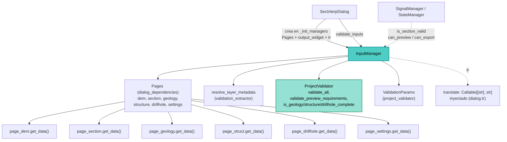

---
tags:
  - secinterp
  - code-walkthrough
  - gui
  - managers
aliases:
  - dialog_input_manager.py
  - InputManager
cssclass: secinterp-note
---

# `gui/dialog_input_manager.py`

> [!abstract] Resumen en una línea
> `InputManager` agrega los valores de las seis páginas de configuración (`Pages`) en un diccionario plano o en `ValidationParams`, aplica reglas UI por sección y delega la validación formal a `ProjectValidator`, exponiendo `can_preview()` / `can_export()` como puertas de la UI.

**Ruta**: `gui/dialog_input_manager.py` (200 líneas)
**Clase principal**: `InputManager`
**Capa**: GUI · Manager de `SecInterpDialog` (agregación y validación de entradas)
**Tags**: #secinterp #gui #managers

---

## 🎯 ¿Por qué existe este archivo?

Leer seis páginas de configuración en cada acción (vista previa, exportar, validar)
repetiría el mismo código de agregación por todo el diálogo. Este manager lo centraliza:

| Problema | Solución |
|----------|----------|
| Cada acción necesita los mismos valores de 6 páginas | `get_all_values()` (dict plano) y `get_validation_params()` (DTO) |
| Validar todo es caro; a veces basta lo mínimo | Dos niveles: `validate_inputs` (completa) y `validate_preview_requirements` (mínima) |
| Habilitar botones exige respuestas sí/no por sección | Reglas `dem/section/output/geology/structure/drillhole` + `can_preview` / `can_export` |
| Las páginas devuelven capas QGIS vivas | `resolve_layer_metadata` las convierte en metadatos antes de validar |

> [!important] Nota arquitectónica
> Agregador del lado GUI que **no importa nada de `qgis.*`**: solo habla con páginas,
> `ProjectValidator` y el extractor de metadatos. Es el primer paso del
> Extract-then-Compute (convierte widgets en datos validables).

---

## 🧬 Diagrama de relaciones



> [!tip] Cómo leer
> Flecha sólida = llama/consume; punteada = función inyectada o consulta de estado.

---

## 📦 Imports — lectura arquitectónica

```python
# gui/dialog_input_manager.py
from __future__ import annotations

from collections.abc import Callable    # ①
from typing import Any                  # ②

from sec_interp.core.exceptions import ValidationError              # ③
from sec_interp.core.validation.project_validator import (          # ④
    ProjectValidator,
    ValidationParams,
)
from sec_interp.gui.adapters.validation_extractor import resolve_layer_metadata  # ⑤

from .dialog_dependencies import Pages  # ⑥
```

| # | Observación |
|---|-------------|
| ① | `Callable[[str], str]` tipa la función de traducción inyectada (`dialog.tr`). |
| ② | `Any` para el widget de salida y el diccionario plano de valores. |
| ③ | Solo captura `ValidationError`: el manager traduce excepciones a tuplas `(bool, str)`. |
| ④ | `ProjectValidator` (lógica formal) + `ValidationParams` (DTO de validación) del core. |
| ⑤ | `resolve_layer_metadata` desacopla capas QGIS → metadatos antes de validar (Extract). |
| ⑥ | Import relativo al contenedor `Pages`: el manager recibe páginas, no el diálogo entero. |

> [!success] Cero `qgis.*`
> Es el único manager del diálogo sin imports QGIS: trabaja sobre `get_data()` de las
> páginas y metadatos. Por eso es trivialmente testeable sin entorno QGIS.

---

## 🏗️ Inventario de estructura

**Clases:** `class InputManager` — 10 métodos.

**Métodos:**

- `__init__(pages, output_widget, translate)` — guarda colaboradores y define reglas.
- `_setup_validation_rules()` — diccionario `rules` con 6 secciones (check + message).
- `get_all_values() -> dict[str, Any]` — dict plano con ~30 claves de las 6 páginas.
- `get_validation_params() -> ValidationParams` — DTO con metadatos resueltos.
- `validate_inputs() -> tuple[bool, str]` — validación completa vía `ProjectValidator.validate_all`.
- `validate_preview_requirements() -> tuple[bool, str]` — mínimo para vista previa.
- `is_section_valid(section) -> bool` — aplica la regla de una sección.
- `get_section_error(section) -> str` — mensaje de la sección o `""`.
- `can_preview() -> bool` — `dem` y `section` válidas.
- `can_export() -> bool` — `can_preview` más `output` válida.

---

## 📖 Recorrido método por método

### `__init__` — Colaboradores estrechos

```python
def __init__(
    self,
    pages: Pages,
    output_widget: Any,
    translate: Callable[[str], str],
) -> None:
    self.pages = pages
    self.output_widget = output_widget
    self.tr = translate
    self._setup_validation_rules()
```

Recibe el contenedor `Pages` (dataclass en `gui/dialog_dependencies.py` con
`dem/section/geology/structure/drillhole/settings`), el widget de ruta de salida y
la función `tr`. No recibe el diálogo: dependencia mínima y testeable.

### `_setup_validation_rules` — Las 6 reglas UI

```python
def _setup_validation_rules(self) -> None:
    self.rules = {
        "dem": {
            "check": lambda p: bool(p.raster_layer),
            "message": self.tr("Raster DEM layer is required"),
        },
        "section": {
            "check": lambda p: bool(p.line_layer),
            "message": self.tr("Cross-section line layer is required"),
        },
        "output": {
            "check": lambda p: bool(p.output_path),
            "message": self.tr("Output directory path is required"),
        },
        "geology": {
            "check": lambda p: (
                ProjectValidator.is_geology_complete(p) if p.outcrop_layer else True
            ),
            "message": self.tr("Geology configuration is incomplete"),
        },
        "structure": {
            "check": lambda p: (
                ProjectValidator.is_structure_complete(p) if p.struct_layer else True
            ),
            "message": self.tr("Structure configuration is incomplete"),
        },
        "drillhole": {
            "check": lambda p: (
                ProjectValidator.is_drillhole_complete(p) if p.collar_layer else True
            ),
            "message": self.tr("Drillhole configuration is incomplete"),
        },
    }
```

| Regla | Semántica |
|-------|-----------|
| `dem`, `section`, `output` | Obligatorias siempre (capas y ruta presentes). |
| `geology`, `structure`, `drillhole` | **Condicionales**: solo se exigen completas si su capa está configurada; si no hay capa, la sección se considera válida (`True`). |

Las opcionales delegan el criterio de "completo" al core
(`is_geology_complete`, etc.), no lo reinventan. Los mensajes se traducen al definir
las reglas (una vez por instancia).

### `get_all_values` — Diccionario plano (~30 claves)

```python
def get_all_values(self) -> dict[str, Any]:
    dem = self.pages.dem.get_data()
    sect = self.pages.section.get_data()
    geol = self.pages.geology.get_data()
    stru = self.pages.structure.get_data()
    dh = self.pages.drillhole.get_data()

    return {
        "raster_layer": dem["raster_layer"],
        "selected_band": dem["selected_band"],
        "scale": dem["scale"],
        "vertexag": dem["vertexag"],
        "crossline_layer": sect["crossline_layer"],
        "buffer_distance": sect["buffer_distance"],
        "outcrop_layer": geol["outcrop_layer"],
        "outcrop_name_field": geol["outcrop_name_field"],
        "structural_layer": stru["structural_layer"],
        "dip_field": stru["dip_field"],
        "strike_field": stru["strike_field"],
        "dip_scale_factor": stru["dip_scale_factor"],
        "collar_layer_obj": dh["collar_layer"],
        ...
        "output_path": self.output_widget.filePath(),
        **(self.pages.settings.get_data() if self.pages.settings is not None else {}),
    }
```

Renombra claves al aplanar (`crossline_layer`, `collar_layer_obj`, …): el dict es
el contrato que consume `get_selected_values` del diálogo y, desde ahí,
`ExportManager.export_data` (p. ej. `values["output_path"]`, `values.get("exp_topo")`).
`page_settings` se fusiona si existe (`None`-tolerante).

### `get_validation_params` — DTO con metadatos resueltos

```python
def get_validation_params(self) -> ValidationParams:
    dem = self.pages.dem.get_data()
    ...
    return ValidationParams(
        raster_layer=resolve_layer_metadata(dem["raster_layer"]),
        band_number=dem["selected_band"],
        line_layer=resolve_layer_metadata(sect["crossline_layer"]),
        output_path=self.output_widget.filePath(),
        scale=dem["scale"],
        vert_exag=dem["vertexag"],
        buffer_dist=sect["buffer_distance"],
        outcrop_layer=resolve_layer_metadata(geol["outcrop_layer"]),
        outcrop_field=geol["outcrop_name_field"],
        struct_layer=resolve_layer_metadata(stru["structural_layer"]),
        struct_dip_field=stru["dip_field"],
        struct_strike_field=stru["strike_field"],
        dip_scale_factor=stru["dip_scale_factor"],
        collar_layer=resolve_layer_metadata(dh["collar_layer"]),
        collar_id=dh["collar_id"],
        collar_use_geom=dh["use_geometry"],
        collar_x=dh["collar_x"],
        collar_y=dh["collar_y"],
        survey_layer=resolve_layer_metadata(dh["survey_layer"]),
        ...
        interval_lith=dh["interval_lith"],
    )
```

Cada capa QGIS pasa por `resolve_layer_metadata` (id, nombre, validez, CRS) antes
de llegar al core: el `ValidationParams` resultante es validable sin QGIS. Ver
[[validation_extractor]] y [[project_validator]].

### `validate_inputs` / `validate_preview_requirements` — Excepción a tupla

```python
def validate_inputs(self) -> tuple[bool, str]:
    params = self.get_validation_params()
    try:
        ProjectValidator.validate_all(params)
        return True, ""
    except ValidationError as e:
        return False, str(e)

def validate_preview_requirements(self) -> tuple[bool, str]:
    params = self.get_validation_params()
    try:
        ProjectValidator.validate_preview_requirements(params)
        return True, ""
    except ValidationError as e:
        return False, str(e)
```

Mismo esquema en dos niveles: la validación completa (exportar/aceptar) y la mínima
(vista previa: basta DEM + línea). Convierten `ValidationError` en `(False, mensaje)`
para que el diálogo muestre el texto sin `try/except`.

### `is_section_valid` / `get_section_error` — Puertas por sección

```python
def is_section_valid(self, section: str) -> bool:
    if section not in self.rules:
        return True
    params = self.get_validation_params()
    return self.rules[section]["check"](params)

def get_section_error(self, section: str) -> str:
    if self.is_section_valid(section):
        return ""
    return self.rules[section]["message"]
```

Sección desconocida → válida (`True`): política permisiva que evita bloquear la UI
ante claves nuevas. `get_section_error` devuelve `""` si todo va bien, de modo que
el llamante puede concatenar mensajes sin comprobar antes.

### `can_preview` / `can_export` — Puertas compuestas

```python
def can_preview(self) -> bool:
    return self.is_section_valid("dem") and self.is_section_valid("section")

def can_export(self) -> bool:
    return self.can_preview() and self.is_section_valid("output")
```

Jerarquía monótona: exportar exige lo mismo que previsualizar más la ruta de
salida. `StateManager`/`UIStatusManager` las usan para habilitar botones y
checkboxes (ver [[dialog_state_manager]] y [[ui_status_manager]]).

---

## 🔄 Flujo de datos

| Fase | Entrada | Transformación | Salida |
|------|---------|----------------|--------|
| Agregar | 6 páginas + `output_widget` | `get_data()` por página | dict plano (~30 claves) |
| Resolver | capas QGIS vivas | `resolve_layer_metadata` | `ValidationParams` sin QGIS |
| Validar | `ValidationParams` | `ProjectValidator.*` | `(True, "")` o `(False, mensaje)` |
| Puerta | reglas por sección | `check(params)` | `can_preview` / `can_export` |

---

## 🏛️ Patrones de diseño presentes

| Patrón | Dónde | Propósito |
|--------|-------|-----------|
| **Manager (descomposición de diálogo)** | clase completa | Centralizar lectura y validación de entradas |
| **Parameter Object** | `Pages`, `ValidationParams` | Agrupar colaboradores y datos de validación |
| **Rule table** | `self.rules` | Reglas declarativas (check + mensaje) por sección |
| **Adapter** | `resolve_layer_metadata` | Capas QGIS → metadatos validables |
| **Exception translation** | `validate_*` | `ValidationError` → `(bool, str)` para la UI |

---

## 🧾 Resumen de la API

| Símbolo | Firma | Uso típico |
|---------|-------|------------|
| `InputManager(pages, output_widget, translate)` | constructor | Creado en `main_dialog._init_managers` |
| `get_all_values()` | `-> dict[str, Any]` | Base de `get_selected_values` (exportación) |
| `get_validation_params()` | `-> ValidationParams` | Entrada de `ProjectValidator` |
| `validate_inputs()` | `-> tuple[bool, str]` | `SecInterpDialog.validate_inputs` |
| `validate_preview_requirements()` | `-> tuple[bool, str]` | Mínimo para previsualizar |
| `is_section_valid(section)` | `-> bool` | Puertas de `StateManager` |
| `can_preview()` / `can_export()` | `-> bool` | Habilitar botones de preview/export |

---

## 🛡️ Manejo de errores

| Situación | Comportamiento |
|-----------|----------------|
| `ValidationError` del core | `(False, str(e))`, sin propagar |
| Sección desconocida en `is_section_valid` | `True` (permisivo) |
| `page_settings` es `None` | Se omite su fusión en `get_all_values` |
| Capa opcional ausente | Su regla devuelve `True` (no bloquea) |

El manager no valida por sí mismo: toda la lógica formal vive en
`ProjectValidator`; aquí solo se agregan datos y se traducen resultados.

---

## 🌐 i18n

Los seis mensajes de regla se traducen en `_setup_validation_rules` con la función
inyectada (`self.tr = translate`, normalmente `dialog.tr`): "Raster DEM layer is
required", "Cross-section line layer is required", "Output directory path is
required" y los tres "… configuration is incomplete". Los mensajes detallados del
core llegan ya localizables vía `str(e)`.

---

## 🧪 Tests asociados

Cobertura real en `tests/gui/test_dialog_input_manager.py` (sin QGIS, páginas mockeadas):

- `test_get_all_values_collects_from_all_pages` — agregación de las 6 páginas en el dict plano.
- `test_validate_inputs_success` / `test_validate_inputs_failure` — traducción de `ValidationError` a tupla (con `ProjectValidator` mockeado).
- `test_is_section_valid_logic` — reglas obligatorias frente a condicionales.
- `test_get_section_error_messages` — mensaje o `""` según validez.

---

## 👀 Observaciones y notas

> [!success] Fortalezas
> - Cero imports QGIS: el manager más puro y testeable del diálogo.
> - Reglas condicionales (`if p.outcrop_layer … else True`) que respetan lo opcional sin código ramificado en la UI.
> - Doble salida (dict plano + DTO) que sirve a consumidores distintos (exportación y validación).
> - `translate` inyectado en vez de `dialog.tr` directo: desacopla de `SecInterpDialog`.

> [!warning] Puntos de atención
> - `get_all_values` y `get_validation_params` repiten las cinco llamadas `get_data()`: si una página cambia su dict, hay que tocar dos métodos.
> - Las lambdas de `rules` reciben `ValidationParams`, pero `validate_*` no las usa: dos caminos de validación que pueden divergir.
> - Sección desconocida → `True` silencioso: un typo (`"demm"`) habilitaría botones indebidamente.
> - `get_section_error` llama dos veces a `get_validation_params` (vía `is_section_valid`): agregación duplicada.

> [!question] Preguntas abiertas
> - ¿Unificar `validate_*` sobre `self.rules` para un solo camino de validación?
> - ¿Registrar claves válidas y lanzar ante sección desconocida en modo debug?
> - ¿Cachear el `ValidationParams` por llamada para evitar la doble agregación?

---

## 🔗 Notas relacionadas

- [[Index]] — índice de la bóveda
- [[main_dialog]] — crea el manager con `Pages` y `output_widget`
- [[dialog_state_manager]] — consume `can_preview` / `can_export` para botones
- [[dialog_export_manager]] — consume `get_selected_values` (derivado del dict plano)
- [[dialog_preview_manager]] — la vista previa exige lo validado aquí
- [[project_validator]] — `validate_all`, `validate_preview_requirements`
- [[validation_extractor]] — `resolve_layer_metadata`
- [[ui_status_manager]] — indicadores que reflejan estas reglas
- [[domain]] — DTOs del dominio cercanos a `ValidationParams`

---

*Nota de la bóveda SecInterp Code Walkthrough v2 — v3.8.0*
