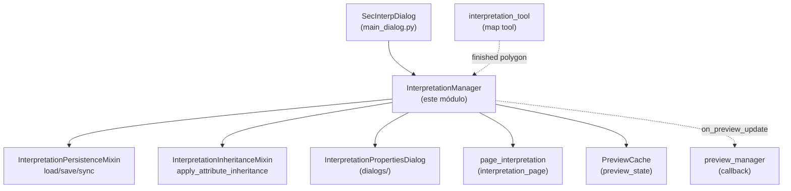
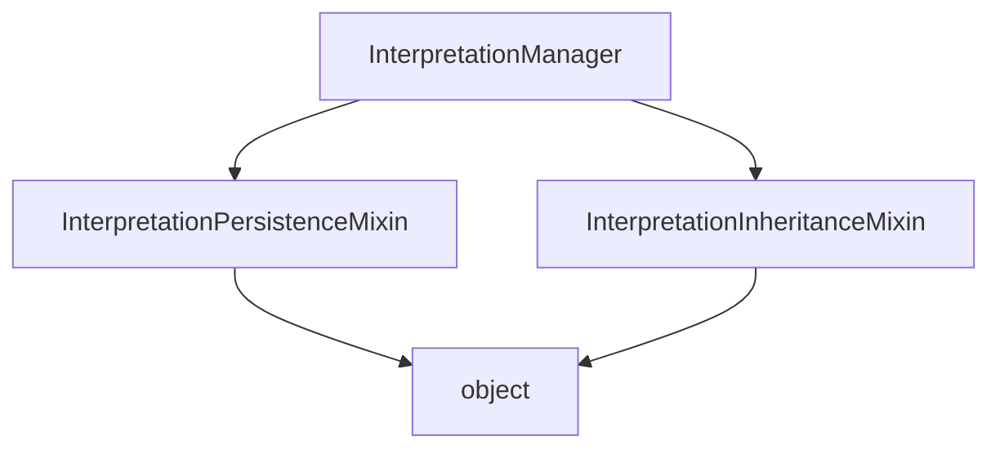

---
tags:
  - secinterp
  - code-walkthrough
  - gui
  - managers
aliases:
  - dialog_interpretation_manager.py
  - InterpretationManager
cssclass: secinterp-note
---

# `gui/dialog_interpretation_manager.py`

> [!abstract] Resumen en una línea
> Orquestador GUI de los polígonos de interpretación: hereda la persistencia y la herencia de atributos de dos mixins y añade el flujo de finalización (herencia → diálogo de propiedades → añadir → persistir → refrescar preview).

**Ruta**: `gui/dialog_interpretation_manager.py` (107 líneas)
**Clase principal**: `InterpretationManager`
**Capa**: GUI (mánager de presentación · compone mixins)
**Tags**: #secinterp #gui #managers

---

## 🎯 ¿Por qué existe este archivo?

Las interpretaciones dibujadas sobre el perfil necesitan un propietario claro que
no sea el diálogo monolítico: alguien debe recibir el polígono de la
herramienta de mapa, enriquecerlo, pedir sus propiedades al usuario, guardarlo y
repintar. Repartir eso entre `main_dialog.py` y la herramienta violaría la regla
de 300 líneas por diálogo y dispersaría el ciclo de vida:

| Problema | Solución |
|----------|----------|
| `SecInterpDialog` ya coordina 6 mánagers; sumarle el ciclo de vida de interpretaciones lo desborda | `InterpretationManager` posee la lista `interpretations` y el flujo `handle_interpretation_finished` |
| Persistencia (JSON de proyecto / capa) y herencia (geología / sondajes) son dos ejes independientes | Viven en [[interpretation_persistence_mixin]] e [[interpretation_inheritance_mixin]]; el mánager los compone por herencia múltiple |
| El preview debe repintarse tras cada interpretación sin acoplar el mánager al renderer | Callback `_on_preview_update` registrado con `set_preview_update_handler` (inyección de callback) |

> [!important] Nota arquitectónica
> **Manager + herencia de mixins**: `InterpretationManager(InterpretationPersistenceMixin, InterpretationInheritanceMixin)`
> no implementa ni persistencia ni herencia; solo orquestación. La persistencia y
> la herencia son capacidades reutilizables que el diálogo también expone vía
> [[dialog_facade_mixin]] (`_load_interpretations`, `on_interpretation_finished`).

---

## 🧬 Diagrama de relaciones



> [!tip] Cómo leer
> Flecha sólida = usa/hereda; punteada = callback o evento (la herramienta emite,
> el preview se refresca) sin dependencia estática.

---

## 📦 Imports — lectura arquitectónica

```python
# gui/dialog_interpretation_manager.py
from __future__ import annotations
from collections.abc import Callable
from typing import TYPE_CHECKING
from sec_interp.core.domain import InterpretationPolygon
from sec_interp.gui.interpretation_inheritance_mixin import InterpretationInheritanceMixin
from sec_interp.gui.interpretation_persistence_mixin import InterpretationPersistenceMixin
from sec_interp.logger_config import get_logger, log_critical_operation
from .preview_state import PreviewCache

if TYPE_CHECKING:
    from .main_dialog import SecInterpDialog
```

| # | Observación |
|---|-------------|
| ① | `Callable` de `collections.abc` (no de `typing`): el callback `_on_preview_update` se tipa moderno (`Callable[[], None] \| None`). |
| ② | `TYPE_CHECKING` + import diferido de `SecInterpDialog`: rompe el ciclo diálogo ↔ mánager; en runtime el diálogo solo se usa como atributo (`self.dialog`). |
| ③ | `InterpretationPolygon` de `core.domain`: el mánager manipula DTOs del dominio, nunca `QgsFeature`; la conversión a capa vive en `save_to_layer` del mixin de persistencia. |
| ④ | Los dos mixins se importan por ruta absoluta (`sec_interp.gui.…`): son capacidades públicas reutilizables, no detalles relativos. |
| ⑤ | `PreviewCache` por import relativo (`.preview_state`): caché compartido **propiedad del diálogo** e inyectado en el constructor — el mánager nunca lo crea en solitario en producción. |
| ⑥ | `log_critical_operation` además de `get_logger`: la finalización de un polígono es operación crítica auditable (id + nº de vértices en el log). |
| ⑦ | `InterpretationPropertiesDialog` se importa **dentro** de `handle_interpretation_finished` (lazy): evita el ciclo `dialogs/ → gui → dialogs/` en tiempo de importación. |

---

## 🏗️ Inventario de estructura

**Clases:** 1 — `InterpretationManager(InterpretationPersistenceMixin, InterpretationInheritanceMixin)`.

**Atributos de instancia** (fijados en `__init__`):

| Atributo | Tipo | Origen |
|----------|------|--------|
| `dialog` | `SecInterpDialog` | inyectado por `SecInterpDialog._init_managers()` |
| `interpretations` | `list[InterpretationPolygon]` | lista viva; el diálogo la reexpone vía la property de [[dialog_facade_mixin]] |
| `_preview_cache` | `PreviewCache` | compartido con `preview_manager`; si no se inyecta se crea uno vacío |
| `_on_preview_update` | `Callable[[], None] \| None` | callback registrado por el diálogo hacia `preview_manager.update_from_checkboxes` |

**Métodos propios:** `__init__`, `set_preview_update_handler`, `clear_interpretations`, `handle_interpretation_finished` (4). Todo lo demás (`load/save/sync`, `apply_attribute_inheritance`, `save_to_layer…`) es heredado de los mixins.

---

## 📁 Archivos del paquete

| Archivo | Rol frente a este mánager |
|---|---|
| `gui/interpretation_persistence_mixin.py` | base 1: `load/save_interpretations`, `sync_from_layer`, `save_to_layer` |
| `gui/interpretation_inheritance_mixin.py` | base 2: `apply_attribute_inheritance` + búsqueda por `QgsSpatialIndex` |
| `gui/dialogs/interpretation_properties_dialog.py` | diálogo modal invocado en el flujo de finalización |
| `gui/main_dialog.py` | `_init_managers()`: `InterpretationManager(self, cache=preview_cache)` + cableado del callback |
| `gui/preview_state.py` | `PreviewCache` compartido (lectura de `geol`/`drillhole` para herencia) |
| `gui/ui/pages/interpretation_page.py` | `page_interpretation.get_data()`: `inherit_geology`, `inherit_drillholes`, `custom_fields`, `source_type` |

---

## 📖 Recorrido método por método

### `__init__`

```python
def __init__(self, dialog: SecInterpDialog, cache: PreviewCache | None = None) -> None:
    self.dialog = dialog
    self.interpretations: list[InterpretationPolygon] = []
    self._preview_cache = cache if cache is not None else PreviewCache()
    self._on_preview_update: Callable[[], None] | None = None
```

Inyección de dependencias explícita: el diálogo (para `page_interpretation`,
`preview_widget`, `project`, `layer_factory` vía los mixins) y el caché
compartido. El valor por defecto `None → PreviewCache()` solo existe para
facilitar tests unitarios sin diálogo real. Nótese que no llama a `super().__init__()`:
los mixins no definen inicializador y el MRO no lo exige.

### `set_preview_update_handler`

```python
def set_preview_update_handler(self, handler: Callable[[], None]) -> None:
    """Register the callback invoked after an interpretation is added."""
    self._on_preview_update = handler
```

Registra el refresco del preview. `main_dialog._init_managers()` conecta aquí
`self.preview_manager.update_from_checkboxes`, de modo que añadir una
interpretación repinta sin que este mánager importe al de preview. Patrón
Observer minimalista de un solo suscriptor.

### `clear_interpretations`

```python
def clear_interpretations(self) -> None:
    """Clear all interpretations and persist the change."""
    self.interpretations = []
    self.save_interpretations()
```

Vacía y persiste en un paso para que JSON de proyecto o capa destino nunca
queden desincronizados. Es además el handler que `preview_manager` invoca vía
`set_interpretations_cleared_handler` (el simétrico del callback anterior).

### `handle_interpretation_finished` — primera mitad (herencia + propiedades)

```python
def handle_interpretation_finished(self, interpretation: InterpretationPolygon) -> None:
    from .dialogs.interpretation_properties_dialog import InterpretationPropertiesDialog
    log_critical_operation(logger, "handle_interpretation_finished",
        polygon_id=interpretation.id, vertices=len(interpretation.vertices_2d))
    interp_config = self.dialog.page_interpretation.get_data()
    if interp_config.get("inherit_geology") or interp_config.get("inherit_drillholes"):
        self.apply_attribute_inheritance(interpretation, interp_config)
    dlg = InterpretationPropertiesDialog(
        interpretation, interp_config.get("custom_fields"), self.dialog)
    if dlg.exec() != 1:
        logger.info(f"Interpretation canceled by user: {interpretation.id}")
        self.dialog.preview_widget.btn_interpret.setChecked(False)
        return
```

Secuencia: auditoría → configuración de la página → herencia condicional (solo si
algún flag está activo, evitando construir el índice espacial en vano) →
edición modal. Si el usuario cancela (`exec() != 1`, es decir, no `Accepted`),
el polígono se descarta, se desmarca `btn_interpret` y **se retorna sin
persistir ni repintar**. Ver [[interpretation_inheritance_mixin]] y
[[interpretation_properties_dialog]].

### `handle_interpretation_finished` — segunda mitad (añadir + notificar)

```python
    self.interpretations.append(interpretation)
    self.save_interpretations()
    logger.info(f"Interpretation polygon added: {interpretation.id} "
        f"({len(interpretation.vertices_2d)} vertices)")
    msg = (f"<b>{self.dialog.tr('Interpretation Finished')}</b><br>"
        f"<b>{self.dialog.tr('Name')}:</b> {interpretation.name}<br>"
        f"<b>{self.dialog.tr('Vertices')}:</b> {len(interpretation.vertices_2d)}<br>"
        f"<b>{self.dialog.tr('ID')}:</b> {interpretation.id[:8]}...")
    self.dialog.preview_widget.results_text.setHtml(msg)
    self.dialog.preview_widget.results_group.setCollapsed(False)
    self.dialog.preview_widget.btn_interpret.setChecked(False)
    if self._on_preview_update:
        self._on_preview_update()
```

Solo se llega aquí si el usuario aceptó: append → persistencia inmediata →
resumen HTML localizado en `results_text` (grupo expandido) → desmarcado del
botón → refresco del preview vía callback. El orden garantiza que un fallo de
persistencia no deja un polígono fantasma en la lista sin guardar… en realidad
el append precede al save: si `save_interpretations` fallara, la lista en memoria
y el destino divergen (ver riesgos).

---

## 🔄 Flujo de datos

| Fase | Entrada | Transformación | Salida |
|------|---------|----------------|--------|
| Finalización | `InterpretationPolygon` desde `interpretation_tool` | `log_critical_operation` + lectura de `page_interpretation.get_data()` | config (`inherit_*`, `custom_fields`) |
| Herencia | polígono + flags | `apply_attribute_inheritance` (índice espacial sobre caché) | nombre/tipo/atributos/color rellenados |
| Edición | polígono heredado | `InterpretationPropertiesDialog.exec()` modal | polígono editado o descarte (cancel) |
| Persistencia | lista + polígono | `append` + `save_interpretations()` (JSON o capa) | proyecto/capa actualizados |
| Notificación | polígono guardado | HTML en `results_text` + `_on_preview_update()` | usuario informado + preview repintado |

---

## 🏛️ Patrones de diseño presentes

| Patrón | Dónde | Propósito |
|--------|-------|-----------|
| **Manager** | la clase | Propietario del ciclo de vida de interpretaciones fuera del diálogo |
| **Mixin composition** | doble herencia | Persistencia y herencia como capacidades ortogonales combinables |
| **Observer (callback)** | `_on_preview_update` / `set_preview_update_handler` | Notificar al preview sin dependencia estática |
| **Lazy import** | `InterpretationPropertiesDialog` dentro del método | Romper el ciclo de imports `gui ↔ dialogs` |
| **Facade delegation** | `dialog.page_interpretation`, `dialog.preview_widget` | El mánager consume la superficie del diálogo sin importarla |

---

## 🧾 Resumen de la API

| Símbolo | Firma / Hereda | Uso típico |
|---------|----------------|------------|
| `InterpretationManager` | `(InterpretationPersistenceMixin, InterpretationInheritanceMixin)` | `InterpretationManager(dialog, cache)` en `_init_managers` |
| `__init__` | `(dialog, cache: PreviewCache \| None = None) -> None` | inyección de diálogo + caché compartido |
| `set_preview_update_handler` | `(handler: Callable[[], None]) -> None` | cablear `preview_manager.update_from_checkboxes` |
| `clear_interpretations` | `() -> None` | vaciar + persistir (también vía preview_manager) |
| `handle_interpretation_finished` | `(interpretation: InterpretationPolygon) -> None` | entrada desde `tool_manager` / fachada |
| heredados de persistencia | `load/save_interpretations`, `sync_from_layer`, `save_to_layer` | ver [[interpretation_persistence_mixin]] |
| heredado de herencia | `apply_attribute_inheritance` | ver [[interpretation_inheritance_mixin]] |

---

## 🛡️ Manejo de errores

- **Cancelación del usuario no es error**: `exec() != 1` se gestiona con `return` temprano + log `info`; no lanza ni notifica.
- **Sin `try/except` propio**: los fallos de persistencia los deja propagar el mixin (que ya captura `Exception` al leer JSON y loguea con `logger.exception`); un fallo de escritura a capa sí subiría hasta el llamante de la herramienta.
- **Herencia condicional**: si ambos flags están apagados no se toca el caché ni se construye ningún `QgsSpatialIndex`; si el caché está vacío, los `_check_*` devuelven `(best_match, min_dist)` sin cambios.
- **Botón huérfano**: tanto en cancel como en éxito se hace `btn_interpret.setChecked(False)`; la herramienta no queda armada tras finalizar.

---

## 🧪 Tests asociados

- `tests/gui/test_dialog_interpretation_manager.py` — `TestDialogInterpretationManager`:
  - `test_handle_interpretation_finished_accepted` / `..._rejected` — ramas aceptar/cancelar del diálogo modal (mock de `InterpretationPropertiesDialog`).
  - `test_apply_attribute_inheritance_geology` / `..._drillholes` — herencia vía caché simulado.
  - `test_load_interpretations_success` / `test_load_interpretations_fail` / `test_save_interpretations` / `test_json_serial_special` / `test_no_project_guards` — persistencia heredada.
  - `test_inheritance_no_cached_data` — sin datos en caché no hereda nada.
  - `test_sync_from_layer_uses_filtered_request` — `sync_from_layer` filtra por extent (índice espacial).
- `tests/gui/test_main_dialog_interpretation.py` — `TestInterpretationManager::test_load_interpretations_empty/valid`, `test_save_interpretations`, `test_apply_attribute_inheritance_geology` (cobertura desde el diálogo).
- `tests/gui/test_attribute_inheritance.py` — `TestAttributeInheritance::test_inheritance_midpoint_bias`.
- `tests/gui/test_interpretation_tool.py` — la herramienta que produce los polígonos (`test_finalize_polygon`, `test_finalize_invalid`).

---

## 🧩 Orden de inicialización en el diálogo

En `SecInterpDialog._init_managers()` el orden es significativo:

1. `preview_cache = PreviewCache()` — el diálogo es propietario del caché.
2. `interpretation_manager = InterpretationManager(self, cache=preview_cache)` — recibe el caché compartido.
3. `interpretation_manager.load_interpretations()` — rehidrata al arrancar (JSON o capa según `source_type`).
4. `preview_manager.set_interpretations_cleared_handler(interpretation_manager.clear_interpretations)` — el preview puede vaciar.
5. `interpretation_manager.set_preview_update_handler(preview_manager.update_from_checkboxes)` — el mánager puede repintar.

Los pasos 4–5 forman un **acoplamiento bidireccional por callbacks**, no por
imports: cada lado conoce una firma `() -> None`, nunca la clase del otro.

---

## 🌐 i18n del flujo

El resumen HTML usa `self.dialog.tr(...)` por fragmento (`"Interpretation
Finished"`, `"Name"`, `"Vertices"`, `"ID"`), de modo que cada etiqueta es
extraíble por `update-strings.sh`. Los valores (nombre, id) no se traducen, como
es correcto. El diálogo de propiedades traduce sus propias etiquetas
(`"Name:"`, `"Color:"`, `"Custom Attributes"`); ver
[[interpretation_properties_dialog]].

Además, `btn_interpret.setChecked(False)` no lleva texto: es estado, no i18n.
Los mensajes de log (`"Interpretation polygon added…"`) quedan en inglés a
propósito: los logs no se traducen, solo la UI visible. Esta separación
log-vs-UI es la convención del proyecto (ver [[gui_utils_py]]).

---

## ⚖️ JSON de proyecto vs capa vectorial como destino

`load/save_interpretations` (heredados) eligen destino según
`interp_config.get("source_type")`. El mánager no decide: lee la página y delega.

| Aspecto | `source_type != "layer"` (JSON) | `source_type == "layer"` (capa) |
|---|---|---|
| Dónde vive | `project.readEntry/writeEntry("SecInterp", "interpretations", json)` | capa vectorial de polígonos (`target_layer_id`) |
| Esquema | lista de dicts (`id`, `name`, `type`, `vertices_2d`, `attributes`, `color`, `created_at`) | campos `id/name/type/color/created_at` + geometría poligonal |
| Cuándo falla | JSON corrupto → `logger.exception` y lista intacta | capa inválida → se ignora y se sigue con JSON |
| Caso de uso | sesiones rápidas sin capa dedicada | interoperabilidad (ver/editar interpretaciones como capa GIS) |

> [!tip] Guarda `if not self.dialog.project: return`
> En diálogos huérfanos (tests sin proyecto) la persistencia es no-op silencioso;
> por eso `test_no_project_guards` existe y debe seguir existiendo.

---

## 🔬 MRO de la herencia múltiple



| Regla | Efecto en este mánager |
|-------|------------------------|
| `InterpretationPersistenceMixin` primera | Si ambas bases definieran el mismo método, ganaría persistencia |
| Ninguna base define `__init__` | `InterpretationManager.__init__` es el único; no hay cadena `super()` que romper |
| Atributos compartidos | `self.dialog`, `self.interpretations`, `self._preview_cache` los crean aquí y los consumen los mixins |
| `self.interpretations = []` reasigna | Los mixins siempre acceden vía atributo, nunca capturan la lista; reasignar es seguro |

> [!warning] Fragilidad documentada
> Si un mixin futuro define `__init__` con parámetros, este `__init__` deberá
> cooperar con `super().__init__()`. Hoy no es necesario y añadirlo sería ruido.

---

## 👀 Observaciones y notas

> [!success] Fortalezas
> - Orquestación legible en un solo método con retorno temprano en cancel.
> - Herencia condicional evita trabajo espacial innecesario.
> - Doble callback con `preview_manager` desacopla refresco y vaciado sin imports cruzados.

> [!warning] Puntos de atención
> - `append` antes de `save_interpretations`: si el guardado a capa falla a mitad, la memoria y el destino divergen.
> - `dlg.exec() != 1` compara con literal mágico; `QDialog.DialogCode.Accepted` sería más expresivo.
> - Sin `super().__init__()`: hoy inocuo (mixins sin estado), pero frágil si un mixin futuro añade inicializador.

> [!question] Preguntas abiertas
> - ¿Envolver `save_interpretations` tras el append para revertir la lista si la escritura falla?
> - ¿Sustituir el literal `1` por `QDialog.DialogCode.Accepted`?

---

## 🔗 Notas relacionadas

- [[Index]] — índice de la bóveda
- [[main_dialog]] — `_init_managers` y cableado de callbacks
- [[dialog_facade_mixin]] — `on_interpretation_finished` y property `interpretations`
- [[interpretation_inheritance_mixin]] — base de herencia de atributos
- [[interpretation_persistence_mixin]] — base de persistencia JSON/capa
- [[interpretation_properties_dialog]] — edición modal del flujo
- [[interpretation_page]] — `get_data()` (`inherit_*`, `custom_fields`, `source_type`)
- [[dialog_preview_manager]] — destino del callback de refresco
- [[preview_state]] — `PreviewCache` compartido
- [[interpretation_tool]] — herramienta que origina el polígono

---

*Nota de la bóveda SecInterp Code Walkthrough v2 — v3.9.1*
