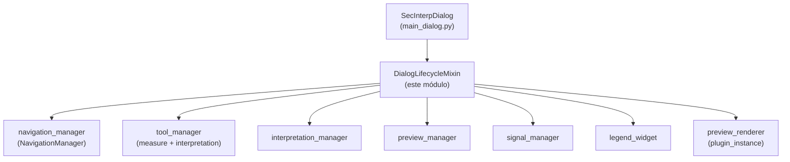

---
tags:
  - secinterp
  - code-walkthrough
  - gui
  - mixins
aliases:
  - dialog_lifecycle_mixin.py
  - DialogLifecycleMixin
cssclass: secinterp-note
---

# `gui/dialog_lifecycle_mixin.py`

> [!abstract] Resumen en una línea
> Mixin de ciclo de vida del diálogo principal: delega la rueda a navegación, autogarda al cerrar y ejecuta una limpieza determinista en 4 fases (map-tools, mánagers, señales/componentes, renderer de preview).

**Ruta**: `gui/dialog_lifecycle_mixin.py` (77 líneas)
**Clase principal**: `DialogLifecycleMixin`
**Capa**: GUI (mixin de presentación · primero en el MRO del diálogo)
**Tags**: #secinterp #gui #mixins

---

## 🎯 ¿Por qué existe este archivo?

Un diálogo QGIS que instala map-tools, conecta decenas de señales y registra
capas temporales de memoria no puede limitarse al `closeEvent` por defecto:
dejaría herramientas armadas, previews huérfanos y el aviso de "capas Lua
temporales" al salir de QGIS:

| Problema | Solución |
|----------|----------|
| Cerrar sin guardar pierde la sesión; cerrar guardando siempre impide Cancelar | Flag `_save_on_close`: `closeEvent` guarda solo si sigue activo (`reject_handler` lo apaga) |
| Cada recurso (tools, mánagers, señales, renderer) necesita su propio orden de limpieza | `_cleanup_resources` en 4 fases con orden fijo y `contextlib.suppress` por fase |
| Las capas de preview registradas en `QgsProject` fugan y provocan el aviso de scratch layers al salir | `_cleanup_preview_renderer` las elimina vía `preview_renderer.cleanup()` |

> [!important] Nota arquitectónica
> **Cooperative multiple inheritance**: `wheelEvent` y `closeEvent` llaman a
> `super()`, por eso `DialogLifecycleMixin` es la **primera** base de
> `SecInterpDialog` — su `closeEvent`/`wheelEvent` lideran la cadena MRO.

---

## 🧬 Diagrama de relaciones



> [!tip] Cómo leer
> El mixin no posee ninguno de estos objetos; los localiza vía `self`/`hasattr` y
> los limpia. Flecha = "limpia a", no "posee a".

---

## 📦 Imports — lectura arquitectónica

```python
# gui/dialog_lifecycle_mixin.py
from __future__ import annotations
import contextlib
from typing import Any
from sec_interp.logger_config import get_logger

logger = get_logger(__name__)
```

| # | Observación |
|---|-------------|
| ① | **Sin imports QGIS**: ni `qgis.core` ni `qgis.gui`; los eventos se tipan como `Any` y `super()` resuelve la clase Qt en runtime. El mixin es portable a cualquier `QDialog`. |
| ② | `contextlib.suppress` es el mecanismo central de robustez: cada fase de limpieza tolera fallos en vez de abortar las siguientes. |
| ③ | `Any` solo para `event` en `wheelEvent`/`closeEvent`: evita importar `QWheelEvent`/`QCloseEvent` de Qt solo para anotar. |
| ④ | Un único logger de módulo con dos niveles: `info` al iniciar el cierre, `debug` por fase completada. |

---

## 🏗️ Inventario de estructura

**Clases:** 1 — `DialogLifecycleMixin` (2 handlers de evento + 5 métodos de limpieza, todos sin retorno).

| Método | Rol |
|--------|-----|
| `wheelEvent(event)` | Zoom en preview vía `navigation_manager`; si no lo consume, `super().wheelEvent(event)` |
| `closeEvent(event)` | Autoguardado condicional → `_cleanup_resources()` → `super().closeEvent(event)` protegido |
| `_cleanup_resources()` | Orquestador: 4 fases en orden fijo |
| `_cleanup_map_tools()` | `measure_tool.cleanup_finalized()` + `interpretation_tool.reset()` |
| `_cleanup_managers()` | `interpretation_manager.save_interpretations()` + `preview_manager.cleanup()` |
| `_cleanup_signals_and_components()` | `signal_manager.disconnect_all()` + `legend_widget.cleanup()` |
| `_cleanup_preview_renderer()` | `plugin_instance.preview_renderer.cleanup()` (capas de memoria) |

---

## 📁 Archivos del paquete

| Archivo | Rol frente a este mixin |
|---|---|
| `gui/main_dialog.py` | `SecInterpDialog(DialogLifecycleMixin, DialogMessageMixin, DialogFacadeMixin, SecInterpMainWindow)`; define `_save_on_close = True` |
| `gui/dialog_facade_mixin.py` | `reject_handler` apaga `_save_on_close`; `accept_handler` invoca `_cleanup_preview_renderer` |
| `gui/dialog_tool_manager.py` | `NavigationManager.handle_wheel_event`, `ToolManager` con `measure_tool`/`interpretation_tool` |
| `gui/dialog_signal_manager.py` | `disconnect_all()` — contrapartida de `connect_all()` |
| `gui/legend_widget.py` | `LegendWidget.cleanup()` desmonta la leyenda del canvas |

---

## 📖 Recorrido método por método

### `wheelEvent`

```python
def wheelEvent(self, event: Any) -> None:
    """Handle mouse wheel for zooming in preview via navigation_manager."""
    if self.navigation_manager.handle_wheel_event(event):
        return
    super().wheelEvent(event)
```

Delegación con fallback cooperativo: si el navegador consume la rueda (zoom del
canvas de preview), se retorna; si no, la cadena Qt sigue vía `super()`. Al ser
la primera base, este `super()` continúa hacia `DialogMessageMixin` (que no lo
define) y finalmente `SecInterpMainWindow/QDialog`. Ver
[[dialog_tool_manager]].

### `closeEvent`

```python
def closeEvent(self, event: Any) -> None:
    """Handle dialog close event to clean up all resources."""
    if self._save_on_close:
        self.state_manager.save_settings()
    self._cleanup_resources()
    with contextlib.suppress(AttributeError, RuntimeError, TypeError):
        super().closeEvent(event)
```

> [!note] El código real suprime `(AttributeError, RuntimeError, TypeError)`
> Tres pasos: (1) autoguardado solo si `_save_on_close` sigue activo — `reject`
> lo desactiva, Accept ya guardó antes; (2) limpieza total **siempre**, incluso si
> el guardado lanzó; (3) `super().closeEvent(event)` protegido porque en
> shutdown de QGIS el objeto Qt subyacente puede estar medio destruido
> (`RuntimeError: wrapped C/C++ object has been deleted`).

### `_cleanup_resources` — orquestador

```python
def _cleanup_resources(self) -> None:
    """Clean up map tools, managers, signals, and components."""
    logger.info("Closing dialog, cleaning up resources...")
    self._cleanup_map_tools()
    self._cleanup_managers()
    self._cleanup_signals_and_components()
    self._cleanup_preview_renderer()
```

Orden fijo y significativo: primero desarmar herramientas (dejan de emitir),
luego persistir managers, después desconectar señales y por último retirar capas.
El `logger.info` marca el inicio del cierre en el log para diagnosticar cierres
colgados.

### `_cleanup_map_tools`

```python
def _cleanup_map_tools(self) -> None:
    if hasattr(self, "tool_manager") and self.tool_manager:
        with contextlib.suppress(Exception):
            if self.tool_manager.measure_tool:
                self.tool_manager.measure_tool.cleanup_finalized()
            if self.tool_manager.interpretation_tool:
                self.tool_manager.interpretation_tool.reset()
    logger.debug("Map tools cleaned up")
```

Doble guarda (`hasattr` + truthiness) porque el cierre puede ocurrir con el
diálogo a medio construir. `cleanup_finalized` retira la goma elástica de medida
y `reset` desarma la digitalización; ambas van en un único `suppress(Exception)`
porque son cosméticas frente al cierre. Ver [[measure_tool]] e
[[interpretation_tool]].

### `_cleanup_managers`

```python
def _cleanup_managers(self) -> None:
    with contextlib.suppress(Exception):
        self.interpretation_manager.save_interpretations()
        self.preview_manager.cleanup()
    logger.debug("Managers cleaned up")
```

Última persistencia de interpretaciones (cubre ediciones que no pasaron por
Accept) y `preview_manager.cleanup()`, que detiene tareas y libera caché. Si el
guardado falla aquí, se suprime: el cierre no debe bloquearse por I/O.

### `_cleanup_signals_and_components`

```python
def _cleanup_signals_and_components(self) -> None:
    if hasattr(self, "signal_manager"):
        self.signal_manager.disconnect_all()
    logger.debug("Signals disconnected")
    if hasattr(self, "legend_widget") and self.legend_widget:
        with contextlib.suppress(Exception):
            self.legend_widget.cleanup()
```

Desconexión total de señales — contrapartida obligatoria de `connect_all()` y
requisito de la guía GUI ("toda señal conectada debe desconectarse"). La leyenda
se limpia aparte con suppress porque su `cleanup()` toca el canvas, que puede no
existir en tests headless. Ver [[dialog_signal_manager]] y [[legend_widget]].

### `_cleanup_preview_renderer`

```python
def _cleanup_preview_renderer(self) -> None:
    renderer = getattr(self.plugin_instance, "preview_renderer", None)
    if renderer and hasattr(renderer, "cleanup"):
        with contextlib.suppress(Exception):
            renderer.cleanup()
```

El renderer registra memory layers en `QgsProject` para un render estable; sin
esta retirada, fugan y QGIS muestra el aviso de scratch layers al salir. Se
resuelve con `getattr(..., None)` porque `plugin_instance` puede ser `None` en
tests. También lo invoca `accept_handler` antes de `self.accept()`.

---

## 🔄 Flujo de datos

| Fase | Entrada | Transformación | Salida |
|------|---------|----------------|--------|
| Rueda | `QWheelEvent` | `navigation_manager.handle_wheel_event` o `super()` | zoom o comportamiento Qt por defecto |
| Cierre | `QCloseEvent` | `_save_on_close` → guardar; siempre limpiar; `super()` protegido | diálogo destruido sin fugas |
| Limpieza 1–2 | herramientas y mánagers | desarmar + persistir + liberar | sin gomas huérfanas, interpretaciones a salvo |
| Limpieza 3–4 | señales, leyenda, renderer | desconectar + retirar capas | sin callbacks colgados ni scratch layers |

---

## 🏛️ Patrones de diseño presentes

| Patrón | Dónde | Propósito |
|--------|-------|-----------|
| **Mixin (cooperativo)** | la clase + `super()` en eventos | Componer ciclo de vida sin herencia rígida |
| **Template Method** | `_cleanup_resources` | Orden fijo de fases; cada fase es un hook |
| **Guarded cleanup** | `hasattr`/`getattr` + `suppress` | Cierre robusto con construcción parcial o Qt medio destruido |
| **Flag protocol** | `_save_on_close` | Cancelar distingue "cerrar" de "cerrar guardando" |

---

## 🧾 Resumen de la API

| Símbolo | Firma | Uso típico |
|---------|-------|------------|
| `DialogLifecycleMixin` | `class DialogLifecycleMixin:` (sin bases) | primera base de `SecInterpDialog` |
| `wheelEvent` | `(event: Any) -> None` | Qt lo invoca; delega a navegación |
| `closeEvent` | `(event: Any) -> None` | Qt lo invoca; guarda + limpia + `super()` |
| `_cleanup_resources` | `() -> None` | orquestador de 4 fases |
| `_cleanup_map_tools` | `() -> None` | desarmar medida e interpretación |
| `_cleanup_managers` | `() -> None` | guardar interpretaciones + liberar preview |
| `_cleanup_signals_and_components` | `() -> None` | `disconnect_all` + leyenda |
| `_cleanup_preview_renderer` | `() -> None` | retirar memory layers (también desde Accept) |

---

## 🛡️ Manejo de errores

Toda la filosofía del módulo es **el cierre nunca falla**:

- `suppress(AttributeError, RuntimeError, TypeError)` en `super().closeEvent`: cubre objeto Qt destruido y MRO sin `closeEvent` (p. ej. en mocks).
- `suppress(Exception)` en fases cosméticas o de I/O: una goma elástica rota o un JSON que no escribe no bloquean la destrucción.
- `hasattr` antes de `tool_manager`, `signal_manager`, `legend_widget`: el cierre puede llegar con `__init__` incompleto si la construcción lanzó.
- `getattr(plugin_instance, "preview_renderer", None)`: diálogo headless sin plugin.

---

## 🧪 Tests asociados

Sin archivo dedicado (`test_dialog_lifecycle_mixin.py` no existe); cobertura
indirecta y honesta:

- `tests/gui/test_multi_session_persistence.py` — `test_signals_restored_after_close_and_reopen`, `test_tool_internal_signals_restored`, `test_idempotent_connection_logic`: cierran y reabren, ejercitando `closeEvent` + `disconnect_all` + reconexión.
- `tests/gui/test_signal_restoration.py` — restauración de señales tras cierre.
- `tests/gui/test_main_dialog_tools.py` — `reset` de herramientas cubierto vía `ToolManager`.
- `tests/gui/test_dialog_preview_manager.py` — `cleanup()` del preview manager invocado en la fase 2.

> [!note] Hueco documentado
> `_cleanup_preview_renderer` (retirada de scratch layers, el motivo original del
> mixin) no tiene test dedicado; requeriría `QgsProject` real o mock de
> `preview_renderer` con `cleanup()`.

---

## 👀 Observaciones y notas

> [!success] Fortalezas
> - Sin imports QGIS: el mixin es testeable y portable por construcción.
> - Orden de limpieza razonado y comentado (herramientas → datos → señales → capas).
> - Autoguardado condicional con flag en vez de dos `closeEvent` distintos.

> [!warning] Puntos de atención
> - `suppress(Exception)` en `_cleanup_managers` puede ocultar un fallo real de persistencia de interpretaciones al cerrar; solo queda el log previo.
> - Si `save_settings` en `closeEvent` lanza, la limpieza sigue (correcto), pero el usuario no recibe aviso: el diálogo ya se está destruyendo.
> - `_save_on_close` es atributo dinámico (creado en `main_dialog`), invisible en este archivo para el lector nuevo.

> [!question] Preguntas abiertas
> - ¿Loguear como `warning` (no suprimir en silencio) un fallo de `save_interpretations` durante el cierre?
> - ¿Declarar `_save_on_close: bool = True` como atributo de clase del mixin para documentar el protocolo?

---

## 🔗 Notas relacionadas

- [[Index]] — índice de la bóveda
- [[main_dialog]] — orden MRO y `_save_on_close = True`
- [[dialog_facade_mixin]] — `reject_handler` (apaga el flag) y `accept_handler`
- [[dialog_message_mixin]] — hermano de composición (mensajes, sin ciclo de vida)
- [[dialog_signal_manager]] — `connect_all`/`disconnect_all`
- [[dialog_tool_manager]] — `NavigationManager` y herramientas limpiadas aquí
- [[dialog_interpretation_manager]] — `save_interpretations` en la fase 2
- [[legend_widget]] — `cleanup()` de la fase 3
- [[preview_renderer]] — `cleanup()` de memory layers de la fase 4
- [[measure_tool]] / [[interpretation_tool]] — herramientas desarmadas

---

*Nota de la bóveda SecInterp Code Walkthrough v2 — v3.9.0*
