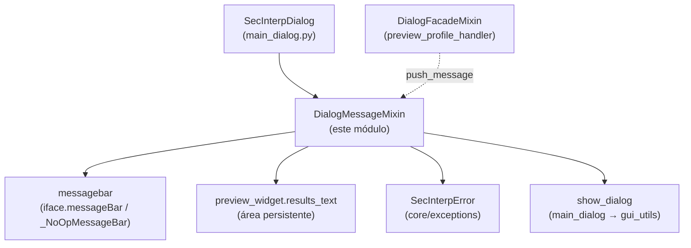

---
tags:
  - secinterp
  - code-walkthrough
  - gui
  - mixins
aliases:
  - dialog_message_mixin.py
  - DialogMessageMixin
cssclass: secinterp-note
---

# `gui/dialog_message_mixin.py`

> [!abstract] Resumen en una línea
> Mixin de mensajería del diálogo principal: publica avisos en la barra de mensajes de QGIS y en el área de resultados del plugin, y centraliza el tratamiento de errores distinguiendo `SecInterpError` de fallos inesperados.

**Ruta**: `gui/dialog_message_mixin.py` (78 líneas)
**Clase principal**: `DialogMessageMixin`
**Capa**: GUI (mixin de presentación · segunda base en el MRO del diálogo)
**Tags**: #secinterp #gui #mixins

---

## 🎯 ¿Por qué existe este archivo?

Cada operación del plugin (preview, exportación, validación) necesita informar al
usuario en dos superficies: la barra de mensajes de QGIS (efímera) y el área de
resultados del propio plugin (persistente). Sin un punto único, cada llamante
inventaría su formato y los errores de dominio se confundirían con bugs:

| Problema | Solución |
|----------|----------|
| Avisos solo en la barra de QGIS se pierden al expirar el `duration` | `push_message` escribe además en `preview_widget.results_text` (HTML con icono y color por nivel) |
| Cada `except` formateaba errores a su manera | `handle_error` centraliza: `SecInterpError` → aviso; resto → crítica + traceback en log |
| Los tests headless no tienen `iface.messageBar()` | Guarda `if self.messagebar` (el diálogo instala `_NoOpMessageBar` sin iface) |

> [!important] Nota arquitectónica
> **Dual-surface notification**: un solo `push_message(title, message, level,
> duration, show_in_plugin)` alimenta la superficie global QGIS y la superficie
> local del plugin. El nivel `Qgis.MessageLevel` decide icono y color en ambas.

---

## 🧬 Diagrama de relaciones



> [!tip] Cómo leer
> Flecha sólida = escribe/muestra; punteada = la fachada invoca `push_message`
> (p. ej. preview fallido con nivel `Warning`).

---

## 📦 Imports — lectura arquitectónica

```python
# gui/dialog_message_mixin.py
from __future__ import annotations
import traceback
from qgis.core import Qgis
from sec_interp.core.exceptions import SecInterpError
from sec_interp.logger_config import get_logger

logger = get_logger(__name__)
```

| # | Observación |
|---|-------------|
| ① | `traceback` solo para `traceback.format_exc()` en la rama inesperada: el diálogo nunca muestra el traceback, solo lo registra. |
| ② | `qgis.core.Qgis` aporta el enum `MessageLevel` (`Info`, `Warning`, `Critical`, `Success`); el mixin no toca geometrías ni capas. |
| ③ | `SecInterpError` de `core.exceptions` es el único import del core: el mixin distingue errores de dominio (esperados) de bugs (inesperados) por tipo, no por texto. |
| ④ | Sin imports de widgets ni de `preview_widget`: ambas superficies se resuelven vía `self`, inyectadas por `SecInterpMainWindow`/`main_dialog`. |
| ⑤ | Dos niveles de log con criterio: `warning` para dominio (esperado, con `details`), `error` + traceback para inesperados. |

---

## 🏗️ Inventario de estructura

**Clases:** 1 — `DialogMessageMixin` (2 métodos públicos, sin `__init__` ni estado).

| Método | Firma | Rol |
|--------|-------|-----|
| `push_message` | `(title, message, level=Info, duration=5, show_in_plugin=True) -> None` | doble superficie: barra QGIS + área del plugin |
| `handle_error` | `(error: Exception, title="Error") -> None` | enrutador central de excepciones del diálogo |

**Mapa nivel → icono/color** (superficie del plugin):

| `Qgis.MessageLevel` | Icono | Color |
|---|---|---|
| `Success` | ✓ | `#28a745` (verde) |
| `Warning` | ⚠ | `#ffc107` (ámbar) |
| `Critical` | ✗ | `#dc3545` (rojo) |
| `Info` (defecto) | ℹ | `#17a2b8` (azul) |

---

## 📁 Archivos del paquete

| Archivo | Rol frente a este mixin |
|---|---|
| `gui/main_dialog.py` | Instala `messagebar` (real o `_NoOpMessageBar`) y define `show_dialog(title, message, level)` usado por `handle_error` |
| `gui/dialog_facade_mixin.py` | `preview_profile_handler` invoca `push_message` en preview fallido |
| `gui/utils.py` | `show_user_message` — el `show_dialog` real tras la delegación |
| `core/exceptions.py` | Jerarquía `SecInterpError` discriminada en `handle_error` (ver [[exceptions]]) |
| `gui/ui/pages/preview_page.py` | `preview_widget.results_text` — superficie persistente |

---

## 📖 Recorrido método por método

### `push_message`

```python
def push_message(self, title: str, message: str,
    level: int = Qgis.MessageLevel.Info, duration: int = 5,
    show_in_plugin: bool = True) -> None:
    if self.messagebar:
        self.messagebar.pushMessage(title, message, level=level, duration=duration)
    if show_in_plugin and hasattr(self, "preview_widget"):
        if level == Qgis.MessageLevel.Success:
            icon, color = "✓", "#28a745"
        elif level == Qgis.MessageLevel.Warning:
            icon, color = "⚠", "#ffc107"
        elif level == Qgis.MessageLevel.Critical:
            icon, color = "✗", "#dc3545"
        else:
            icon, color = "ℹ", "#17a2b8"
        formatted_msg = (
            f'<span style="color: {color}; font-weight: bold;">{icon} {title}:</span> {message}'
        )
        self.preview_widget.results_text.append(formatted_msg)
```

Doble escritura con dos guardas: `if self.messagebar` (siempre truthy en la
práctica — `_NoOpMessageBar` es no-op seguro) y `hasattr(self, "preview_widget")`
para mixins testeados sin widget. `duration` solo afecta a la barra QGIS; el área
del plugin es acumulativa (`append`). `show_in_plugin=False` permite avisos
efímeros que no ensucian los resultados. Nótese `level: int`: el enum
`Qgis.MessageLevel` se anota como int porque es un `IntEnum` Qt.

### `handle_error`

```python
def handle_error(self, error: Exception, title: str = "Error") -> None:
    if isinstance(error, SecInterpError):
        msg = str(error)
        logger.warning(f"{title}: {msg} - Details: {getattr(error, 'details', 'N/A')}")
        self.show_dialog(title, msg, level="warning")
    else:
        msg = self.tr("An unexpected error occurred: {}").format(error)
        details = traceback.format_exc()
        logger.error(f"{title}: {msg}\n{details}")
        self.show_dialog(title,
            self.tr("{}\n\nPlease check the logs for details.").format(msg),
            level="critical")
```

Dos ramas con filosofías opuestas. **Dominio** (`SecInterpError`): mensaje tal
cual (ya es legible y a menudo localizado en origen), log `warning` con `details`
y diálogo `warning` — es un fallo esperado (validación, geometría, datos). **Inesperado**:
mensaje genérico vía `self.tr()` (las únicas dos cadenas traducidas del
módulo), traceback completo solo en log `error`, y diálogo `critical` que remite
a los logs sin exponer la traza al usuario. `getattr(error, 'details', 'N/A')`
tolera subclases que no fijaron `details`.

---

## 🔄 Flujo de datos

| Fase | Entrada | Transformación | Salida |
|------|---------|----------------|--------|
| Aviso | `title`, `message`, `level` | `messagebar.pushMessage` + HTML con icono/color | barra efímera + línea persistente en resultados |
| Error dominio | `SecInterpError` | `warning` con details + `show_dialog(level="warning")` | usuario informado, sin traza |
| Error inesperado | cualquier `Exception` | `self.tr()` genérico + `traceback` en `error` + `show_dialog(level="critical")` | usuario remitido a logs, bug registrado |

---

## 🏛️ Patrones de diseño presentes

| Patrón | Dónde | Propósito |
|--------|-------|-----------|
| **Mixin** | la clase | Capacidad de mensajería compuesta en el diálogo |
| **Dual-surface notification** | `push_message` | Efímero global + persistente local con una llamada |
| **Centralized error handling** | `handle_error` | Un solo punto que clasifica por tipo de excepción |
| **Null Object** | `_NoOpMessageBar` (en `main_dialog`) | Tests sin iface no necesitan ramas especiales aquí |

---

## 🧾 Resumen de la API

| Símbolo | Firma | Uso típico |
|---------|-------|------------|
| `DialogMessageMixin` | `class DialogMessageMixin:` (sin bases) | segunda base de `SecInterpDialog` |
| `push_message` | `(title, message, level=Info, duration=5, show_in_plugin=True) -> None` | preview fallido, caché limpiada, ayuda ausente |
| `handle_error` | `(error, title="Error") -> None` | `except Exception as e: self.handle_error(e, ...)` |
| Iconos/colores | `✓/#28a745`, `⚠/#ffc107`, `✗/#dc3545`, `ℹ/#17a2b8` | coherencia visual de resultados |

---

## 🛡️ Manejo de errores

El módulo **es** el manejador de errores del diálogo; su propia robustez:

- No lanza nunca: ambas ramas terminan en `show_dialog`; `push_message` no valida niveles (un nivel desconocido cae en la rama `Info`).
- `hasattr(self, "preview_widget")`: el mixin sobrevive en tests que lo montan sin widget de preview.
- `getattr(error, 'details', 'N/A')`: tolera excepciones de dominio construidas sin `details`.
- El traceback jamás llega a la UI: `traceback.format_exc()` solo alimenta `logger.error`.

---

## 🧪 Tests asociados

- `tests/gui/test_message_manager.py` — `TestMessageMethods`:
  - `test_push_message` — doble escritura en barra mock + `results_text`.
  - `test_push_message_no_bar` — sin barra no rompe (Null Object).
  - `test_show_dialog` — delegación a `show_user_message` (mock).
  - `test_handle_error_sec_interp_error` — rama dominio (`warning`, sin traceback).
  - `test_handle_error_unexpected` — rama inesperada (`critical` + traceback en log).
- Llamantes cubiertos en `test_main_dialog_*`: `preview_profile_handler` (vía fachada) ejercita `push_message` con `Warning`.

---

## 🌐 i18n del mixin

Solo dos cadenas se traducen, ambas en la rama inesperada (los errores de
dominio llegan ya localizados desde su origen):

| Cadena | Uso |
|--------|-----|
| `self.tr("An unexpected error occurred: {}")` | prefijo genérico con `.format(error)` |
| `self.tr("{}\n\nPlease check the logs for details.")` | remisión a logs con `.format(msg)` |

Los títulos (`title`) los aporta el llamante ya traducidos (p. ej.
`self.tr("Preview Error")` en la fachada). Iconos y colores son universales no
textuales; el HTML usa `<span>` inline sin hojas de estilo externas.

---

## 📐 Contrato de atributos con el diálogo

El mixin no declara `__init__`; todo lo que consume debe existir en el huésped:

| Atributo | Proveedor | Uso |
|----------|-----------|-----|
| `self.messagebar` | `main_dialog.__init__` (`iface.messageBar()` o `_NoOpMessageBar`) | superficie QGIS en `push_message` |
| `self.preview_widget` | `SecInterpMainWindow` | `results_text` en `push_message` |
| `self.show_dialog` | `main_dialog.show_dialog` → `gui_utils.show_user_message` | diálogos modales en `handle_error` |
| `self.tr` | `QObject` (vía `QDialog`) | únicas dos cadenas traducidas |

> [!tip] Orden MRO relevante
> `SecInterpDialog(DialogLifecycleMixin, DialogMessageMixin, DialogFacadeMixin,
> SecInterpMainWindow)`: este mixin nunca intercepta `closeEvent`/`wheelEvent`
> (no los define) y la fachada puede llamar `self.push_message` con seguridad
> porque el MRO lo resuelve aquí.

---

## 👀 Observaciones y notas

> [!success] Fortalezas
> - Clasificación por tipo (`isinstance`), no por texto: robusta a cambios de mensaje.
> - El traceback nunca toca la UI pero siempre el log: equilibrio soporte/usuario.
> - Null Object en la barra elimina ramas `iface is None` en cada llamante.

> [!warning] Puntos de atención
> - `level: int` acepta cualquier entero; un valor fuera del enum cae en `Info` silenciosamente en el plugin pero puede fallar en `pushMessage` real.
> - `results_text.append` acumula sin límite: sesiones largas con muchos avisos engordan el widget.
> - `handle_error` no retorna nada ni relanza: el llamante no puede distinguir si ya se notificó.

> [!question] Preguntas abiertas
> - ¿Validar `level` contra `Qgis.MessageLevel` y degradar a `Info` con `logger.warning`?
> - ¿Limitar el buffer de `results_text` (p. ej. últimas 500 líneas) para sesiones largas?

---

## 🔗 Notas relacionadas

- [[Index]] — índice de la bóveda
- [[main_dialog]] — instala `messagebar`/`_NoOpMessageBar` y define `show_dialog`
- [[dialog_facade_mixin]] — `preview_profile_handler` y `clear_cache_handler` (llamantes)
- [[dialog_lifecycle_mixin]] — hermano de composición (ciclo de vida)
- [[exceptions]] — jerarquía `SecInterpError` discriminada aquí
- [[gui_utils_py]] — `show_user_message` tras `show_dialog`
- [[preview_page]] — `results_text`, superficie persistente
- [[dialog_preview_manager]] — origen del `(success, message)` notificado
- [[dtos]] — validación que produce errores de dominio

---

*Nota de la bóveda SecInterp Code Walkthrough v2 — v3.8.0*
