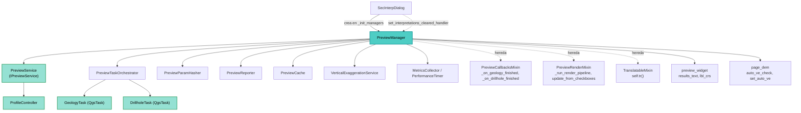

---
tags:
  - secinterp
  - code-walkthrough
  - gui
  - managers
aliases:
  - dialog_preview_manager.py
  - PreviewManager
cssclass: secinterp-note
note_lines: 700
---

# `gui/dialog_preview_manager.py`

> [!abstract] Resumen en una línea
> `PreviewManager` concentra toda la lógica de vista previa del diálogo: valida entradas, genera el `PreviewResult` vía `PreviewService`, mantiene caché por hash de parámetros y delega el trabajo pesado a `PreviewTaskOrchestrator` y a los mixins de render y callbacks.

**Ruta**: `gui/dialog_preview_manager.py` (244 líneas)
**Clase principal**: `PreviewManager(TranslatableMixin, PreviewCallbacksMixin, PreviewRenderMixin)`
**Capa**: GUI · Manager de `SecInterpDialog` (orquestación, sin cálculo geológico propio)
**Tags**: #secinterp #gui #managers

---

## 🎯 ¿Por qué existe este archivo?

`SecInterpDialog` superaría las 300 líneas si generase la vista previa por sí mismo
(límite documentado en `gui/AGENTS.md`: ante ese tamaño hay que extraer managers).
Este módulo aísla la preocupación "preview" completa:

| Problema | Solución |
|----------|----------|
| El diálogo mezcla widgets, herramientas y generación de datos | `PreviewManager` posee el ciclo generar → cachear → renderizar |
| Regenerar todo ante cualquier clic es lento | Caché por hash (`PreviewParamHasher` + `last_result`) |
| El cálculo pesado bloquearía la UI | Delegación a `PreviewTaskOrchestrator` (tareas en segundo plano) |
| El render y los callbacks ensucian el manager | Mixins `PreviewRenderMixin` y `PreviewCallbacksMixin` |
| Borrar interpretaciones al cambiar la geometría se olvida | Detección de cambio geométrico + handler inyectado |

> [!important] Nota arquitectónica
> Manager de orquestación GUI: **extrae** (`_get_and_validate_inputs`, `resolve_layer`,
> `transformContext`) y **delega el cómputo** a `IPreviewService`. Nunca calcula
> geología directamente; respeta el patrón Extract-then-Compute.

---

## 🧬 Diagrama de relaciones



> [!tip] Cómo leer
> Flecha sólida = crea/llama; punteada = herencia, callback inyectado o acceso a widgets.

---

## 📦 Imports — lectura arquitectónica

```python
# gui/dialog_preview_manager.py
from __future__ import annotations

from collections.abc import Callable                      # ①
from typing import Any                                    # ①

from qgis.core import QgsVectorLayer                      # ②
from qgis.PyQt.QtCore import QTimer                       # ③

from sec_interp.core.domain import PreviewParams, PreviewResult       # ④
from sec_interp.core.exceptions import SecInterpError                 # ⑤
from sec_interp.core.interfaces.preview_interface import IPreviewService  # ⑥
from sec_interp.core.performance_metrics import MetricsCollector, PerformanceTimer  # ⑦
from sec_interp.core.services.preview_service import PreviewService   # ⑥
from sec_interp.core.services.vertical_exaggeration_service import VerticalExaggerationService  # ⑧
from sec_interp.core.utils.i18n import TranslatableMixin              # ⑧
from sec_interp.gui.adapters.layer_resolver import resolve_layer      # ⑨
from sec_interp.gui.preview_callbacks_mixin import PreviewCallbacksMixin   # ⑩
from sec_interp.gui.preview_render_mixin import PreviewRenderMixin         # ⑩
from sec_interp.logger_config import get_logger

from .main_dialog_config import DialogConfig                # ⑩
from .preview_param_hasher import PreviewParamHasher        # ⑪
from .preview_reporter import PreviewReporter               # ⑪
from .preview_state import PreviewCache                     # ⑪
from .preview_task_orchestrator import PreviewTaskOrchestrator  # ⑪
```

| # | Observación |
|---|-------------|
| ① | `Callable` tipa el handler de interpretaciones; `Any` tipa el diálogo (evita import circular con `main_dialog`). |
| ② | Único tipo QGIS importado (`QgsVectorLayer`), solo como anotación de `_update_crs_label`. |
| ③ | `QTimer` de debounce de un solo disparo, creado en `__init__` y detenido en `cleanup`. |
| ④ | DTOs del dominio: `PreviewParams` (entrada) y `PreviewResult` (salida). Frontera GUI/core. |
| ⑤ | `SecInterpError` para el primer nivel del `except` escalonado de `generate_preview`. |
| ⑥ | Contrato `IPreviewService` + `PreviewService(controller)` construido por defecto (inyección con fallback). |
| ⑦ | Telemetría: `MetricsCollector` acumulativo + `PerformanceTimer` como contexto. |
| ⑧ | `VerticalExaggerationService` dedicado y `TranslatableMixin` (`self.tr()`). |
| ⑨ | `resolve_layer` convierte el identificador de capa en capa real (fase Extract). |
| ⑩ | Los mixins aportan señales, pipeline de render y slots de tareas; `DialogConfig` conmuta el log de rendimiento. |
| ⑪ | `PreviewParamHasher` (vigencia), `PreviewReporter` (texto de resultados), `PreviewCache` (dict de 4 dominios) y `PreviewTaskOrchestrator(self)` (tareas `QgsTask`). |

---

## 🏗️ Inventario de estructura

**Clases:** `class PreviewManager(TranslatableMixin, PreviewCallbacksMixin, PreviewRenderMixin)` — 15 métodos propios (más los heredados de los mixins).

**Métodos propios (15):** `__init__`, `set_interpretations_cleared_handler`, `cleanup`,
`generate_preview`, `_update_ui_state`, `_process_preview_data`, `_get_transform_context`,
`_update_cache_and_metrics`, `_trigger_async_updates`, `_is_data_unchanged`,
`_handle_geometric_changes`, `_cancel_active_tasks`, `_calculate_params_hash`,
`_handle_invalid_plugin_instance`, `_update_crs_label`.

**Métodos heredados usados por otros managers (vía `SignalManager`):**

| Método | Provisto por | Quién lo conecta |
|--------|--------------|------------------|
| `connect_signals()` / `disconnect_signals()` | `PreviewRenderMixin` | `SignalManager._connect_page_signals` (re-invoca `connect_signals`) |
| `update_from_checkboxes()` | `PreviewRenderMixin` | 9 señales de `preview_widget` (checkboxes, spin, LOD) |
| `_run_render_pipeline(result)` | `PreviewRenderMixin` | Llamado desde `_update_ui_state` |
| `_on_geology_finished` / `_on_drillhole_finished` | `PreviewCallbacksMixin` | Conectados por el orquestador a las `QgsTask` |

---

## 📖 Recorrido método por método

### `__init__` — Composición del manager

```python
def __init__(
    self,
    dialog: Any,
    preview_service: IPreviewService | None = None,
    cache: PreviewCache | None = None,
    ve_service: VerticalExaggerationService | None = None,
) -> None:
    self.dialog = dialog
    self.preview_service = preview_service or PreviewService(
        self.dialog.plugin_instance.controller
    )
    self.metrics = MetricsCollector()
    self.ve_service = ve_service or VerticalExaggerationService()

    self.orchestrator = PreviewTaskOrchestrator(self)
    self.hasher = PreviewParamHasher()

    self.cached_data = cache if cache is not None else PreviewCache()
    self.last_params_hash: str | None = None
    self.last_result: PreviewResult | None = None

    self._on_interpretations_cleared: Callable[[], None] | None = None

    self.debounce_timer = QTimer()
    self.debounce_timer.setSingleShot(True)

    self.connect_signals()
```

`dialog: Any` evita el import circular con `SecInterpDialog`; los tres parámetros
opcionales aceptan dobles de test y construyen los reales por defecto. El `PreviewCache`
lo crea `main_dialog._init_managers` y lo comparte con el `InterpretationManager`.
`connect_signals()` (heredado de `PreviewRenderMixin`) deja el manager escuchando
desde el nacimiento; el `debounce_timer` monodisparo se gestiona desde el mixin de render.

### `set_interpretations_cleared_handler` — Callback inyectado

```python
def set_interpretations_cleared_handler(self, handler: Callable[[], None]) -> None:
    self._on_interpretations_cleared = handler
```

`main_dialog._init_managers` registra `interpretation_manager.clear_interpretations`.
Así el preview ordena limpiar interpretaciones **sin conocer** al otro manager:
desacoplamiento por callback en lugar de referencia cruzada.

### `cleanup` — Apagado ordenado

```python
def cleanup(self) -> None:
    self.orchestrator.cancel_active_tasks()
    self.debounce_timer.stop()
    self.disconnect_signals()
```

Tres pasos en orden: primero cancela tareas en vuelo (seguridad en hilos), luego
detiene el temporizador y finalmente desconecta señales. Lo invoca
`DialogLifecycleMixin._cleanup_managers` al cerrar el diálogo. Simetría
conectar/desconectar exigida por `gui/AGENTS.md`.

### `generate_preview` — Punto de entrada con `except` escalonado

```python
def generate_preview(self) -> tuple[bool, str]:
    self.metrics.clear()
    try:
        with PerformanceTimer("Total Preview Generation", self.metrics):
            params = self.dialog.plugin_instance._get_and_validate_inputs()
            if not params:
                return False, self.tr("Invalid configuration")
            result = self._process_preview_data(params)
            self._update_ui_state(params, result)
    except SecInterpError as e:
        self.dialog.handle_error(e, self.dialog.tr("Preview Error"))
        return False, str(e)
    except (AttributeError, TypeError, ValueError) as e:
        ...
    except Exception as e:
        ...
    else:
        return True, self.tr("Preview generated successfully")
```

| Nivel | Captura | Tratamiento |
|-------|---------|-------------|
| 1.º | `SecInterpError` | Error de dominio esperado → `handle_error` con título "Preview Error". |
| 2.º | `AttributeError, TypeError, ValueError` | Error de UI inesperado → log con traceback + título "Unexpected Preview Error". |
| 3.º | `Exception` | Crítico → log + título "Critical Error". |

Contrato `(bool, str)` estable para el llamante (`preview_profile_handler` del
diálogo): éxito/fracaso más mensaje ya traducido.

### `_process_preview_data` — Núcleo con cortocircuito de caché

```python
def _process_preview_data(self, params: PreviewParams) -> PreviewResult:
    if self._is_data_unchanged(params):
        logger.info("Using cached data (params unchanged)")
        return self.last_result

    self._handle_geometric_changes(params)
    transform_context = self._get_transform_context()

    result = self.preview_service.generate_all(params, transform_context)

    self._update_cache_and_metrics(result)
    self._cancel_active_tasks()
    self._trigger_async_updates(params)

    self.last_result = result
    return result
```

Secuencia: caché → geometría → cómputo síncrono (topo y estructuras) → publicar
caché/métricas → cancelar tareas viejas → lanzar tareas nuevas (geología y sondajes
se refinan en segundo plano vía orquestador).

### `_is_data_unchanged` / `_calculate_params_hash`

```python
def _is_data_unchanged(self, params: PreviewParams) -> bool:
    current_hash = self._calculate_params_hash(params)
    unchanged = current_hash == self.last_params_hash
    self.last_params_hash = current_hash
    return unchanged and self.last_result is not None
```

El hash siempre se actualiza (incluso en miss), de modo que una segunda llamada
idéntica acierta. Exige además `last_result is not None` para el primer uso.

### `_handle_geometric_changes` — Guardián de interpretaciones

```python
def _handle_geometric_changes(self, params: PreviewParams) -> None:
    old_geo_params = getattr(self, "_last_geo_params", None)
    line_lyr = resolve_layer(params.line_layer)
    line_feat = next(line_lyr.getFeatures(), None) if line_lyr else None
    line_geom = line_feat.geometry().asWkt() if line_feat else None

    new_geo_params = (params.line_layer, params.raster_layer, line_geom)
    self._last_geo_params = new_geo_params

    if old_geo_params and old_geo_params != new_geo_params:
        logger.info("Geometric change detected: Clearing interpretations.")
        if self._on_interpretations_cleared:
            self._on_interpretations_cleared()
```

Compara la tupla `(line_layer, raster_layer, line_geom_WKT)`: si la línea de
sección cambió de geometría, las interpretaciones dibujadas quedan obsoletas y se
ordenan limpiar. La primera llamada solo memoriza (`old_geo_params` es `None`).

### `_get_transform_context` — Extracción defensiva del lienzo

Devuelve `iface.mapCanvas().mapSettings().transformContext()` para las
reproyecciones del servicio, o `None` sin `plugin_instance` (entorno de test) en
lugar de lanzar.

### `_update_cache_and_metrics` — Publicación del resultado

```python
def _update_cache_and_metrics(self, result: PreviewResult) -> None:
    self.cached_data.update({
        "topo": result.topo,
        "geol": result.geol,
        "struct": result.struct,
        "drillhole": result.drillhole,
    })
    self.metrics.timings.update(result.metrics.timings)
    self.metrics.counts.update(result.metrics.counts)
```

Vuelca los cuatro dominios al `PreviewCache` compartido y fusiona las métricas del
servicio con las locales (el `PerformanceTimer` de `generate_preview` ya registró
el tiempo total). `_trigger_async_updates` / `_cancel_active_tasks` delegan en el
orquestador pasando **servicios**, no capas QGIS vivas (regla de `QgsTask` sin
objetos QGIS en hilos). Ver [[preview_task_orchestrator]].

### `_update_ui_state` — Presentación tras el cómputo

Resuelve la capa de línea, actualiza `lbl_crs`, ejecuta `_run_render_pipeline(result)`
(mixin), aplica la exageración vertical (`auto_ve_check` → `set_auto_ve`) y publica
`PreviewReporter.format_results_message(...)` en `results_text`; si
`DialogConfig.LOG_DETAILED_METRICS`, registra el resumen de métricas.

Fase Present: etiqueta CRS, pipeline de render (mixin), exageración vertical
automática/manual (`_resolve_vertical_exaggeration` del mixin, vía `ve_service`) y
texto de resultados de `PreviewReporter`. Detalle completo en [[preview_render_mixin]].

### `_update_crs_label` — Etiqueta CRS tolerante a fallos

```python
def _update_crs_label(self, layer: QgsVectorLayer | None) -> None:
    try:
        if layer and layer.isValid():
            auth_id = layer.crs().authid()
            self.dialog.preview_widget.lbl_crs.setText(self.tr("CRS: {}").format(auth_id))
        else:
            self.dialog.preview_widget.lbl_crs.setText(self.tr("CRS: None"))
    except (AttributeError, TypeError, ValueError):
        self.dialog.preview_widget.lbl_crs.setText(self.tr("CRS: Unknown"))
    except Exception:
        logger.exception("Unexpected error updating CRS label")
```

Tres niveles de degradación (`authid` → `None` → `Unknown`); un fallo cosmético
nunca rompe la vista previa. `_handle_invalid_plugin_instance` falla rápido con
`AttributeError` accionable cuando el manager se usa sin plugin.

---

## 🔄 Flujo de datos

| Fase | Entrada | Transformación | Salida |
|------|---------|----------------|--------|
| Validar | Widgets del diálogo | `plugin._get_and_validate_inputs()` | `PreviewParams` o `None` |
| Vigencia | `PreviewParams` | `hasher.calculate_hash` vs `last_params_hash` | `last_result` (hit) o sigue |
| Geometría | capa de línea | WKT de la primera feature | limpieza opcional de interpretaciones |
| Cómputo | `params` + `transformContext` | `preview_service.generate_all` | `PreviewResult` |
| Publicar | `PreviewResult` | `cached_data.update` + fusión de métricas | caché compartido al día |
| Fondo | `params` + servicios | `orchestrator.start_*_task` | `QgsTask` de geología y sondajes |
| Presentar | `PreviewResult` | render pipeline + `PreviewReporter` + VE | lienzo, `lbl_crs`, `results_text` |

---

## 🏛️ Patrones de diseño presentes

| Patrón | Dónde | Propósito |
|--------|-------|-----------|
| **Manager (descomposición de diálogo)** | clase completa | Extraer la preocupación "preview" de `SecInterpDialog` |
| **Mixin (render + callbacks)** | `PreviewRenderMixin`, `PreviewCallbacksMixin` | Separar pipeline de dibujo y slots asíncronos |
| **Dependency Injection con fallback** | `__init__` | Testabilidad sin romper la construcción normal |
| **Cache-aside por hash** | `_is_data_unchanged` + `PreviewParamHasher` | Evitar recomputar con parámetros idénticos |
| **Observer (callback)** | `_on_interpretations_cleared` | Avisar sin acoplar managers entre sí |
| **Facade de tareas** | `PreviewTaskOrchestrator` | Ocultar el ciclo de vida de las `QgsTask` |
| **Template (timing)** | `PerformanceTimer` como contexto | Medir sin ensuciar la lógica |

---

## 🧾 Resumen de la API

| Símbolo | Firma | Uso típico |
|---------|-------|------------|
| `PreviewManager(...)` | `(dialog, preview_service=None, cache=None, ve_service=None)` | Construido en `main_dialog._init_managers` |
| `generate_preview()` | `-> tuple[bool, str]` | Slot de `btn_preview` vía `preview_profile_handler` |
| `cleanup()` | `-> None` | Cierre del diálogo (`DialogLifecycleMixin`) |
| `set_interpretations_cleared_handler(handler)` | `(Callable[[], None]) -> None` | Registro del clearer del `InterpretationManager` |
| `update_from_checkboxes()` | heredado `-> None` | 9 señales de opciones de vista previa |
| `connect_signals()` / `disconnect_signals()` | heredados | Ciclo de vida de señales |

---

## 🛡️ Manejo de errores

| Situación | Comportamiento |
|-----------|----------------|
| `params` es `None` (validación fallida) | `(False, "Invalid configuration")`, sin excepción |
| `SecInterpError` del servicio | `handle_error` + `(False, str(e))` |
| Error de UI (`AttributeError`, `TypeError`, `ValueError`) | Log con traceback + título "Unexpected Preview Error" |
| Cualquier otro error | Log crítico + título "Critical Error" |
| Capa inválida al rotular CRS | Degrada a "CRS: None" / "CRS: Unknown" |
| Sin `plugin_instance` | `None` como `transform_context` (o `AttributeError` en render) |

---

## 🌐 i18n

Todos los mensajes visibles usan `self.tr()` (`TranslatableMixin`) o
`self.dialog.tr()`: "Invalid configuration", "Preview generated successfully",
"Preview Error", títulos de error y la plantilla `"CRS: {}"`. El texto de
resultados lo compone `PreviewReporter` con los mensajes ya traducidos.

---

## 🧪 Tests asociados

Cobertura real en `tests/gui/test_dialog_preview_manager.py` (mock-first, sin QGIS):

- `test_generate_preview_success` / `..._invalid_params` / `..._cached` / `..._exception` / `..._sec_interp_error` — camino feliz, validación, caché y niveles del `except`.
- `test_update_from_checkboxes_no_data` / `..._with_data` — slot del mixin de render.
- `test_on_geology_finished_success` / `test_on_drillhole_finished_success` / `test_on_geology_error` / `test_on_drillhole_error` — callbacks asíncronos.
- `test_handle_geometric_changes` y `test_cleanup` — guardián de geometría y apagado.
- `test_resolve_vertical_exaggeration_auto` / `..._manual` / `..._auto_without_result` — VE.
- `test_run_render_pipeline_error` / `test_update_crs_label_error` — degradación elegante.

---

## 👀 Observaciones y notas

> [!success] Fortalezas
> - Separación nítida: el manager orquesta, el servicio computa, los mixins presentan.
> - Caché por hash evita recomputar; la invalidación geométrica protege las interpretaciones.
> - `except` escalonado con mensajes traducidos y contrato `(bool, str)` estable.
> - Inyección con fallback en el constructor facilita los dobles de test.

> [!warning] Puntos de atención
> - `generate_preview` accede a `dialog.plugin_instance._get_and_validate_inputs()` (método privado del plugin): acoplamiento frágil ante refactors del plugin.
> - `_last_geo_params` se crea con `getattr` diferido en lugar de inicializarse en `__init__`; dificulta ver el estado del objeto.
> - `_update_ui_state` toca cuatro widgets/páginas distintas; un cambio de nombres en la UI rompe aquí sin aviso del tipado (`dialog: Any`).
> - El `debounce_timer` se crea y se detiene, pero su conexión vive en el mixin: la lógica queda partida en dos archivos.

> [!question] Preguntas abiertas
> - ¿Mover `_get_and_validate_inputs` al `InputManager` para eliminar el acceso a un privado del plugin?
> - ¿Inicializar `_last_geo_params = None` en `__init__` para hacer explícito el estado?
> - ¿Tipar `dialog` con `TYPE_CHECKING` + `SecInterpDialog` (como hace `dialog_signal_manager`) en vez de `Any`?

---

## 🔗 Notas relacionadas

- [[Index]] — índice de la bóveda
- [[main_dialog]] — composition root que crea el manager y registra el handler
- [[dialog_signal_manager]] — conecta `update_from_checkboxes` a las opciones del preview
- [[dialog_lifecycle_mixin]] — invoca `cleanup()` al cerrar
- [[preview_service]] — `PreviewService.generate_all`, el cómputo delegado
- [[preview_task_orchestrator]] — tareas `QgsTask` de geología y sondajes
- [[preview_render_mixin]] / [[preview_callbacks_mixin]] — pipeline de render y slots async
- [[preview_state]] — `PreviewCache` compartido con interpretaciones
- [[preview_param_hasher]] / [[preview_reporter]] — hash de vigencia y texto de resultados
- [[controller]] — `ProfileController` detrás del servicio de preview
- [[dialog_interpretation_manager]] — dueño de `clear_interpretations`

---

*Nota de la bóveda SecInterp Code Walkthrough v2 — v3.9.0*
