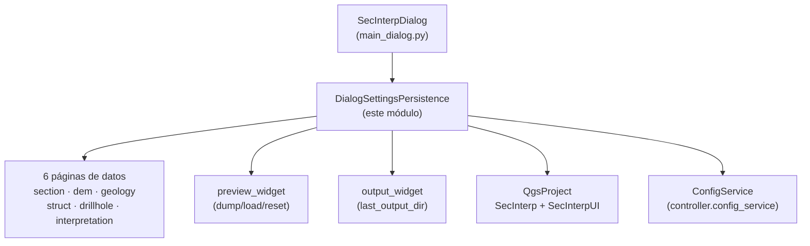

---
tags:
  - secinterp
  - code-walkthrough
  - gui
  - managers
aliases:
  - dialog_settings_persistence.py
  - DialogSettingsPersistence
cssclass: secinterp-note
---

# `gui/dialog_settings_persistence.py`

> [!abstract] Resumen en una línea
> Mánager que persiste el estado del diálogo (páginas, preview y salida) con triple nivel de almacenamiento — proyecto QGIS, `ConfigService` global y resolución de capas por id/nombre — a través del protocolo `dump()`/`load()`/`reset()` de las páginas.

**Ruta**: `gui/dialog_settings_persistence.py` (198 líneas)
**Clase principal**: `DialogSettingsPersistence`
**Capa**: GUI (mánager de presentación · sin widgets propios)
**Tags**: #secinterp #gui #managers

---

## 🎯 ¿Por qué existe este archivo?

Cada reapertura del diálogo debería recordar capas, parámetros y opciones de
preview. El código histórico leía widgets por nombre de atributo desde el
diálogo, lo que acoplaba la persistencia a cada página concreta y rompía con
cada renombrado:

| Problema | Solución |
|----------|----------|
| La persistencia alcanzaba widgets por nombre (`page.page_geology.cbo...`) y se rompía al renombrar | Protocolo `dump()`/`load()`/`reset()`: cada página expone su estado como `dict`; el mánager solo mueve dicts |
| Los ajustes debían sobrevivir a la sesión pero también viajar con el `.qgz` | Triple nivel: `QgsProject` (`SecInterp` + `SecInterpUI` heredado) → `ConfigService` global → valor por defecto |
| Guardar un `QgsVectorLayer` en ajustes es imposible (no es serializable) | Las claves de capa (`layer_keys`) se guardan como id + nombre y se resuelven al cargar |

> [!important] Nota arquitectónica
> **Extract-state, no Extract-widgets**: el mánager nunca importa una página ni un
> widget; solo exige el protocolo `dump/load/reset` más el atributo opcional
> `layer_keys`. Es el mismo desacoplamiento que `PreviewCache` aplica a datos.

---

## 🧬 Diagrama de relaciones



> [!tip] Cómo leer
> Flecha sólida = lee/escribe; el mánager escribe en proyecto **y** config en cada
> `_set_setting`, y lee en cascada proyecto → UI heredada → config.

---

## 📦 Imports — lectura arquitectónica

```python
# gui/dialog_settings_persistence.py
from __future__ import annotations
import contextlib
import json
from typing import TYPE_CHECKING, Any
from sec_interp.logger_config import get_logger

if TYPE_CHECKING:
    from sec_interp.gui.main_dialog import SecInterpDialog
```

| # | Observación |
|---|-------------|
| ① | **Cero imports QGIS y cero imports de páginas**: el módulo solo usa `QgsProject` a través de `self.dialog.project`; ni siquiera importa `QgsSettings`. Máximo desacoplamiento del mánager. |
| ② | `contextlib` se usa una sola vez: `contextlib.suppress(Exception)` alrededor de `controller.reload_settings()` — el refresco post-guardado es best-effort. |
| ③ | `json` tiene doble papel: serializar dicts/listas en `_write_page` y decodificarlos en `_parse_persisted_value`. |
| ④ | `TYPE_CHECKING` para `SecInterpDialog`: el diálogo solo aparece como tipo del constructor; en runtime es un atributo opaco. |
| ⑤ | `get_logger` para un único `logger.warning` (fallo leyendo una clave del config): la persistencia es silenciosa por diseño, el warning es la única traza. |

---

## 🏗️ Inventario de estructura

**Clases:** 1 — `DialogSettingsPersistence` (constructor + 3 métodos públicos + 12 privados).

**Métodos públicos:**

| Método | Rol |
|--------|-----|
| `__init__(dialog)` | Guarda `dialog`; resuelve `self.config` desde `plugin_instance.controller.config_service` si existe (si no, `None` y la cascada se acorta) |
| `load_settings()` | Hidrata las 6 páginas + salida + preview desde lo persistido |
| `save_settings()` | Vuelca las 6 páginas + salida + preview y refresca el controlador |
| `reset_pages()` / `reset_preview()` | Restauran valores por defecto vía protocolo `reset()` |

**Métodos privados por grupo:**

| Grupo | Métodos |
|-------|---------|
| Protocolo de páginas | `_data_pages`, `_write_page`, `_read_page`, `_parse_persisted_value` |
| Capas | `_save_layer_value`, `_resolve_layer_value`, `_find_layer_by_id_or_name`, `_find_layer_by_id`, `_find_layer_by_name` |
| Salida | `_load_output_settings`, `_save_output_settings` (`last_output_dir`) |
| Almacenamiento | `_get_setting`, `_set_setting`, `_parse_setting_value` |

---

## 📁 Archivos del paquete

| Archivo | Rol frente a este mánager |
|---|---|
| `gui/main_dialog.py` | `StateManager` (no este mánager) orquesta `load/save_settings`; la fachada reexpone `_load/_save_user_settings` |
| `gui/dialog_state_manager.py` | `StateManager.save_settings/load_settings` delegan aquí (ver nota) |
| `gui/ui/pages/*.py` | Las 6 páginas implementan `dump/load/reset` + `layer_keys` (`section_page`, `dem_page`, `geology_page`, `structure_page`, `drillhole_page`, `interpretation_page`) |
| `core/config.py` | `ConfigService.get/set` — segundo nivel de la cascada (ver [[settings_model]]) |
| `gui/dialog_settings_persistence.py` | Este módulo (nota actual) |

---

## 📖 Recorrido método por método

### `__init__` / `_data_pages`

```python
def __init__(self, dialog: SecInterpDialog) -> None:
    self.dialog = dialog
    self.config = None
    if hasattr(self.dialog, "plugin_instance") and self.dialog.plugin_instance:
        self.config = self.dialog.plugin_instance.controller.config_service

def _data_pages(self) -> list[Any]:
    return [self.dialog.page_section, self.dialog.page_dem, self.dialog.page_geology,
            self.dialog.page_struct, self.dialog.page_drillhole, self.dialog.page_interpretation]
```

El constructor tolera diálogos sin plugin (tests): `config = None` y la cascada
de lectura/escritura se reduce al proyecto. `_data_pages` fija el orden canónico
de 6 páginas — `page_settings` se excluye a propósito (sus defaults se resetean
por `_reset_export_defaults`, no por `reset()`).

### `load_settings` / `save_settings`

```python
def load_settings(self) -> None:
    for page in self._data_pages():
        page.load(self._read_page(page))
    self._load_output_settings()
    self.dialog.preview_widget.load(self._read_page(self.dialog.preview_widget))

def save_settings(self) -> None:
    if not self.config:
        return
    for page in self._data_pages():
        self._write_page(page, page.dump())
    self._save_output_settings()
    self._write_page(self.dialog.preview_widget, self.dialog.preview_widget.dump())
    if self.config and hasattr(self.dialog, "plugin_instance"):
        with contextlib.suppress(Exception):
            self.dialog.plugin_instance.controller.reload_settings()
```

Asimetría deliberada: **cargar no exige config** (el proyecto basta), **guardar
sí** (`if not self.config: return`). Sin plugin no hay dónde persistir de forma
global, así que guardar es no-op. Tras guardar, `reload_settings()` refresca el
caché del controlador; al ir con `suppress(Exception)`, un controlador a medio
construir nunca rompe el guardado.

### `reset_pages` / `reset_preview`

```python
def reset_pages(self) -> None:
    for page in self._data_pages():
        page.reset()
    self.dialog.output_widget.setFilePath("")
    if hasattr(self.dialog, "page_settings"):
        self.dialog.page_settings._reset_export_defaults()

def reset_preview(self) -> None:
    self.dialog.preview_widget.reset()
```

Reseteo por protocolo, más dos casos especiales: el path de salida se vacía y la
página de ajustes restaura sus defaults de exportación (método protegido, con
guarda `hasattr` porque no todas las variantes del diálogo la montan). Lo invoca
`reset_defaults_handler` de [[dialog_facade_mixin]] vía `state_manager`.

### `_write_page` / `_read_page` / `_parse_persisted_value`

```python
def _write_page(self, page: Any, data: dict[str, Any]) -> None:
    layer_keys = getattr(page, "layer_keys", frozenset())
    for key, value in data.items():
        if key in layer_keys:
            self._save_layer_value(key, value)
        elif isinstance(value, dict | list):
            self._set_setting(key, json.dumps(value))
        else:
            self._set_setting(key, value)

def _read_page(self, page: Any) -> dict[str, Any]:
    layer_keys = getattr(page, "layer_keys", frozenset())
    data = {}
    for key in page.dump():
        if key in layer_keys:
            data[key] = self._resolve_layer_value(key)
        else:
            data[key] = self._parse_persisted_value(key)
    return data
```

Núcleo del protocolo: **las claves las define `page.dump()`**, no el mánager —
`_read_page` itera `page.dump()` para saber qué claves pedir, de modo que añadir
un campo a una página no exige tocar este archivo. Los dicts/listas viajan como
JSON; las capas por id+nombre. `_parse_persisted_value` decodifica JSON solo si
el texto empieza por `[` o `{`, con fallback al string crudo si `json.loads` falla.

### `_save_layer_value` / `_resolve_layer_value` / `_find_layer_by_*`

```python
def _save_layer_value(self, key: str, layer: Any) -> None:
    if layer:
        self._set_setting(key, layer.id())
        self._set_setting(f"{key}_name", layer.name())
    else:
        self._set_setting(key, "")
        self._set_setting(f"{key}_name", "")

def _resolve_layer_value(self, key: str) -> Any:
    layer_id = self._get_setting(key)
    layer_name = self._get_setting(f"{key}_name")
    return self._find_layer_by_id_or_name(layer_id, layer_name)
```

Doble ancla id + nombre: el id es estable dentro de la sesión/proyecto, el nombre
rescata la capa si el id cambió (proyecto recargado). La resolución prueba id
(`project.mapLayer`) y luego nombre (barrido de `mapLayers()`); si ambas fallan
devuelve `None` y la página recibe `None` en esa clave. Ver [[layer_resolver]].

### `_load_output_settings` / `_save_output_settings`

```python
def _load_output_settings(self) -> None:
    last_dir = self._get_setting("last_output_dir")
    if last_dir:
        self.dialog.output_widget.setFilePath(str(last_dir))

def _save_output_settings(self) -> None:
    self._set_setting("last_output_dir", self.dialog.output_widget.filePath())
```

El último directorio de exportación se recuerda entre sesiones. Es la única clave
fuera del protocolo de páginas, porque `output_widget` no es una página.

### `_get_setting` / `_set_setting` / `_parse_setting_value`

```python
def _get_setting(self, key: str, default: Any = None) -> Any:
    val, ok = self.dialog.project.readEntry("SecInterp", key, "")
    if not ok or val in (None, "", "None", "NULL"):
        val, ok = self.dialog.project.readEntry("SecInterpUI", key, "")
    if ok and val not in (None, "", "None", "NULL"):
        parsed = self._parse_setting_value(val)
        if parsed is not None:
            return parsed
    if self.config:
        try:
            val = self.config.get(key, default)
            ...

def _set_setting(self, key: str, value: Any) -> None:
    if value is None:
        value = ""
    self.dialog.project.writeEntry("SecInterp", key, str(value))
    if self.config:
        self.config.set(key, value)
```

Cascada de lectura en 3 niveles: `SecInterp` (formato actual) → `SecInterpUI`
(legado de versiones anteriores, migración transparente) → `ConfigService`
global. Los centinelas `""`, `"None"`, `"NULL"` se tratan como ausentes.
`_parse_setting_value` convierte `"true"/"false"` a bool e intenta int/float
antes de devolver el string. La escritura es dual: proyecto **y** config, con
`None → ""` para no escribir literales `"None"`.

---

## 🔄 Flujo de datos

| Fase | Entrada | Transformación | Salida |
|------|---------|----------------|--------|
| Guardar | `page.dump()` por página | capas → id+nombre; dicts/listas → JSON; resto → string | `writeEntry("SecInterp")` + `config.set` |
| Cargar | claves de `page.dump()` | cascada proyecto → `SecInterpUI` → config; capas por id/nombre | `dict` → `page.load(...)` |
| Reset | — | `page.reset()` + vaciar salida + defaults de export | UI en valores iniciales |
| Post-guardado | ajustes escritos | `controller.reload_settings()` (best-effort) | controlador sincronizado |

---

## 🏛️ Patrones de diseño presentes

| Patrón | Dónde | Propósito |
|--------|-------|-----------|
| **Manager** | la clase | Propietario único de la persistencia de ajustes |
| **Protocol (duck typing)** | `dump/load/reset` + `layer_keys` | Desacoplar el mánager de las páginas concretas |
| **Fallback chain** | `_get_setting` | `SecInterp` → `SecInterpUI` → config → default |
| **Best-effort** | `suppress(Exception)` en `reload_settings` | El refresco nunca rompe el guardado |
| **Surrogate key** | id + nombre de capa | Persistir referencias no serializables |

---

## 🧾 Resumen de la API

| Símbolo | Firma | Uso típico |
|---------|-------|------------|
| `DialogSettingsPersistence` | `class DialogSettingsPersistence:` | instanciado por `StateManager`/diálogo |
| `load_settings` | `() -> None` | arranque y reapertura |
| `save_settings` | `() -> None` | no-op sin `config`; preview OK, Accept, cierre |
| `reset_pages` / `reset_preview` | `() -> None` | botón Reset Defaults |
| `_write_page` / `_read_page` | `(page, data) -> None` / `(page) -> dict` | núcleo del protocolo |
| `_get_setting` / `_set_setting` | `(key, default) -> Any` / `(key, value) -> None` | triple nivel / escritura dual |
| `_parse_setting_value` | `(val) -> Any` | bool → int/float → string |
| `_resolve_layer_value` | `(key) -> Any` | id → nombre → `None` |

---

## 🛡️ Manejo de errores

- **Sin config**: `save_settings` retorna sin hacer nada; `load_settings` sigue funcionando con el proyecto. Diseñado para tests y diálogos huérfanos.
- **JSON corrupto**: `_parse_persisted_value` captura `JSONDecodeError`/`TypeError` y devuelve el string crudo; la página decide.
- **Config que lanza**: `_get_setting` envuelve `config.get` en `try/except` con `logger.warning`; una clave envenenada no aborta la carga.
- **Capas ausentes**: id y nombre desconocidos → `None`; la página muestra "sin capa" en vez de romper.
- **`reload_settings` protegido**: `suppress(Exception)` porque el controlador puede estar a medio construir durante el arranque.

---

## 🧪 Tests asociados

- `tests/gui/test_dialog_settings_persistence.py` — `TestDialogSettingsPersistence`:
  - `test_load_settings` / `test_save_settings` — ciclo completo con páginas simuladas.
  - `test_get_set_setting_fallbacks` — cascada proyecto → config.
  - `test_resolve_layer_value` — resolución id/nombre.
  - `test_reset_pages` — reseteo por protocolo.
  - `test_parse_setting_value` — coerciones bool/int/float.
- `tests/gui/test_main_dialog_settings.py` — `TestMainDialogSettings`:
  - `test_parse_setting_value`, `test_save_and_load_layer_with_name`, `test_load_settings_fallback_to_global_with_parsing`.
- `tests/gui/test_multi_session_persistence.py` — persistencia entre sesiones (cierre y reapertura).

---

## 🧩 Protocolo `dump()`/`load()`/`reset()` — contrato para páginas

Toda página persistible debe cumplir:

| Miembro | Contrato |
|---------|----------|
| `dump() -> dict[str, Any]` | **Define las claves**: lo que no esté aquí no se persiste ni se lee |
| `load(data: dict) -> None` | Aplica valores; debe tolerar claves ausentes o `None` (capas no resueltas) |
| `reset() -> None` | Restaura defaults de la página |
| `layer_keys: frozenset` (opcional) | Claves cuyos valores son capas y viajan como id+nombre |

> [!tip] Añadir un campo persistible
> Basta con incluirlo en `dump()` y leerlo en `load()`; `_read_page` lo pedirá
> solo y `_write_page` lo guardará solo. Este archivo no cambia.

---

## 🌐 i18n y tipos persistidos

El mánager no traduce nada (persiste valores, no etiquetas), pero sus decisiones
de tipos afectan a la UI traducida:

| Detalle | Efecto |
|---------|--------|
| `str(value)` al escribir en proyecto | Los floats usan punto decimal siempre; al leer, `_parse_setting_value` los recupera como float |
| `"true"/"false"` → bool | Los checkboxes persisten su estado real, no `"True"`/`"False"` de Python |
| Capas por id+nombre | El nombre visible en el combo sobrevive aunque cambie el id |
| `last_output_dir` como string | El diálogo de ficheros abre donde el usuario lo dejó |

---

## 👀 Observaciones y notas

> [!success] Fortalezas
> - Cero dependencias de páginas concretas: añadir campos no toca este archivo.
> - Migración transparente `SecInterpUI` → `SecInterp` sin scripts de versionado.
> - Doble ancla id+nombre para capas, robusta a recargas de proyecto.

> [!warning] Puntos de atención
> - `save_settings` no-op sin config puede sorprender: en producción siempre hay plugin, pero un futuro llamante headless perdería ajustes en silencio.
> - `_parse_setting_value` convierte `"3.0"` en float y `"3"` en int, pero `"03"` también en int `3`: los strings con ceros a la izquierda no sobreviven como strings.
> - Escribir todo como `str()` en proyecto pierde el tipo original; la lectura lo re-infiere (heurística, no esquema).

> [!question] Preguntas abiertas
> - ¿Debería `save_settings` sin config al menos escribir en proyecto en vez de no-op total?
> - ¿Tipar las claves con un esquema (`TypedDict` por página) en lugar de re-inferir tipos al leer?

---

## 🔗 Notas relacionadas

- [[Index]] — índice de la bóveda
- [[main_dialog]] — `StateManager` y ciclo guardar/cargar
- [[dialog_state_manager]] — delega `save/load_settings` aquí
- [[dialog_facade_mixin]] — `_load/_save_user_settings` y `reset_defaults_handler`
- [[settings_model]] — `ConfigService` (segundo nivel de la cascada)
- [[section_page]] / [[dem_page]] / [[geology_page]] — páginas con protocolo `dump/load/reset`
- [[structure_page]] / [[drillhole_page]] / [[interpretation_page]] — resto de páginas persistidas
- [[preview_page]] — `preview_widget.dump/load/reset`
- [[layer_resolver]] — resolución de capas por id/nombre
- [[dtos]] — DTOs frente a dicts de ajustes

---

*Nota de la bóveda SecInterp Code Walkthrough v2 — v3.9.1*
