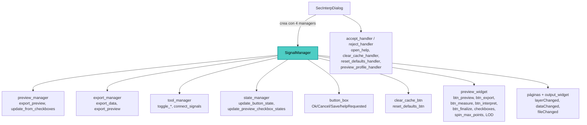

---
tags:
  - secinterp
  - code-walkthrough
  - gui
  - managers
aliases:
  - dialog_signal_manager.py
  - SignalManager
cssclass: secinterp-note
---

# `gui/dialog_signal_manager.py`

> [!abstract] Resumen en una línea
> `SignalManager` es el concentrador de señales del diálogo: conecta en cuatro grupos (botones, vista previa, páginas, herramientas) con idempotencia por desconexión previa, y espeja cada conexión con su desconexión quirúrgica bajo `contextlib.suppress` para un cierre sin fugas.

**Ruta**: `gui/dialog_signal_manager.py` (354 líneas)
**Clase principal**: `SignalManager`
**Capa**: GUI · Hub de señales de `SecInterpDialog` (estilo bus de eventos hacia managers)
**Tags**: #secinterp #gui #managers

---

## 🎯 ¿Por qué existe este archivo?

Un diálogo con ~30 conexiones repartidas por `__init__` es frágil: reconexiones
duplican slots y cierres incompletos fugan objetos Qt. Este hub lo resuelve:

| Problema | Solución |
|----------|----------|
| Conexiones dispersas imposibles de auditar | Cuatro grupos `_connect_*` con su espejo `_disconnect_*` |
| `connect_all` llamado dos veces duplica slots | Idempotencia: cada `connect` empieza con `disconnect` |
| Qt lanza al desconectar lo no conectado | `contextlib.suppress` en cada desconexión individual |
| El analizador reporta señales fugadas | Desconexiones explícitas por widget + barrido secuencial de páginas |
| El diálogo no debe conocer cada slot | Cablea widgets directamente contra los managers (event-bus) |

> [!important] Nota arquitectónica
> Hub estilo event-bus: los widgets del diálogo se conectan **directamente** a métodos
> de los managers inyectados (`preview_manager`, `export_manager`, `tool_manager`,
> `state_manager`); el diálogo solo aporta los widgets y los handlers de orquestación
> (`accept_handler`, `preview_profile_handler`, …). Ver [[main_dialog]].

---

## 🧬 Diagrama de relaciones



> [!tip] Cómo leer
> El hub no contiene lógica: cada flecha hacia un manager es una conexión
> señal→slot documentada en el mapa de conexiones.

---

## 📦 Imports — lectura arquitectónica

```python
# gui/dialog_signal_manager.py
from __future__ import annotations

import contextlib                          # ①
from typing import TYPE_CHECKING, Any       # ②

from qgis.PyQt.QtWidgets import QDialogButtonBox  # ③

from sec_interp.logger_config import get_logger   # ④

logger = get_logger(__name__)


if TYPE_CHECKING:                                # ②
    from .main_dialog import SecInterpDialog
```

| # | Observación |
|---|-------------|
| ① | `contextlib.suppress` es el núcleo del módulo: ~30 desconexiones lo usan. |
| ② | `SecInterpDialog` solo bajo `TYPE_CHECKING` (anotación sin ciclo); `Any` para los cuatro managers (duck typing). |
| ③ | Único import Qt: `QDialogButtonBox` para resolver botones estándar Ok/Cancel/Save. |
| ④ | Logger para los dos `debug` de `disconnect_all` (inicio/fin del barrido). |

> [!note] Sin `core/` ni páginas
> El hub no importa servicios ni páginas: trabaja sobre atributos del diálogo
> (`dialog.button_box`, `dialog.preview_widget`, `dialog.page_dem`, …).

---

## 🏗️ Inventario de estructura

**Clases:** `class SignalManager` — 18 métodos en 4 grupos + 2 públicos.

| Grupo | Conexión | Desconexión (espejo) |
|-------|----------|----------------------|
| Botones | `_connect_button_signals` | `_disconnect_button_signals` → `_disconnect_dialog_buttons` + `_disconnect_custom_buttons` |
| Vista previa | `_connect_preview_signals` | `_disconnect_preview_signals` → `_disconnect_preview_action_buttons` + `_disconnect_preview_options` → `_disconnect_preview_checkboxes` + `_disconnect_preview_misc_options` |
| Páginas | `_connect_page_signals` | `_disconnect_page_signals` → `_disconnect_explicit_page_signals` + `_disconnect_sequential_pages` → `_disconnect_known_page_signals` → `_disconnect_layer_combo_signals` + `_disconnect_data_changed_signals` |
| Herramientas | `_connect_tool_signals` | `_disconnect_tool_signals` |

**Públicos:** `__init__(dialog, preview_manager, export_manager, tool_manager, state_manager)`,
`connect_all()`, `disconnect_all()`.

---

## 🗺️ Mapa de conexiones (contrato del hub)

### Grupo botones — `_connect_button_signals`

| Señal | Slot | Origen del slot |
|-------|------|-----------------|
| Ok `clicked` | `dialog.accept_handler` | diálogo (orquestación) |
| Cancel `clicked` | `dialog.reject_handler` | diálogo |
| Save `clicked` | `export_manager.export_data` | manager |
| `helpRequested` | `dialog.open_help` | diálogo |
| `clear_cache_btn.clicked` | `dialog.clear_cache_handler` | diálogo |
| `reset_defaults_btn.clicked` | `dialog.reset_defaults_handler` | diálogo |

Los botones estándar se resuelven con `button_box.button(StandardButton.Ok/Cancel/Save)`
y se comprueba su existencia (`if ok_btn:`): si el `.ui` no define Save, simplemente
no se conecta.

### Grupo vista previa — `_connect_preview_signals`

| Señal | Slot |
|-------|------|
| `btn_preview.clicked` | `dialog.preview_profile_handler` |
| `btn_export.clicked` | `export_manager.export_preview` |
| `chk_topo/chk_geol/chk_struct/chk_drillholes/chk_interpretations/stateChanged` | `preview_manager.update_from_checkboxes` (×5) |
| `chk_legend.stateChanged` | `preview_manager.update_from_checkboxes` |
| `spin_max_points.valueChanged` | `preview_manager.update_from_checkboxes` |
| `chk_auto_lod.toggled` | `preview_manager.update_from_checkboxes` |
| `chk_adaptive_sampling.toggled` | `preview_manager.update_from_checkboxes` |

Nueve señales convergen en `update_from_checkboxes`: cualquier opción repinta desde
caché. Detalle en [[preview_render_mixin]].

### Grupo páginas — `_connect_page_signals`

| Señal | Slot |
|-------|------|
| `output_widget.fileChanged` | `state_manager.update_button_state` |
| `page_dem.raster_combo.layerChanged` | `update_button_state` **y** `update_preview_checkbox_states` |
| `page_section.line_combo.layerChanged` | `update_button_state` **y** `update_preview_checkbox_states` |
| `page_geology.dataChanged` | `update_preview_checkbox_states` |
| `page_struct.dataChanged` | `update_preview_checkbox_states` |
| `page_drillhole.dataChanged` | `update_preview_checkbox_states` |

Además re-invoca `page.connect_signals()` en las 9 páginas/componentes (dem, section,
geology, struct, drillhole, interpretation, preview_widget, preview_manager,
settings) bajo `suppress(Exception)`: restaura conexiones internas que el barrido
pudo soltar.

### Grupo herramientas — `_connect_tool_signals`

| Señal | Slot |
|-------|------|
| `btn_measure.toggled` | `tool_manager.toggle_measure_tool` |
| `btn_interpret.toggled` | `tool_manager.toggle_interpretation_tool` |
| `btn_finalize.clicked` | `tool_manager.measure_tool.finalize_measurement` |

Y restaura las señales internas con `tool_manager.connect_signals()` (idempotente:
desconecta primero). Comentario `IMPORTANT` en código que conviene conservar.

---

## 📖 Recorrido método por método

### `__init__` — Cinco referencias, cero lógica

```python
def __init__(
    self,
    dialog: SecInterpDialog,
    preview_manager: Any,
    export_manager: Any,
    tool_manager: Any,
    state_manager: Any,
) -> None:
    self.dialog = dialog
    self.preview_manager = preview_manager
    self.export_manager = export_manager
    self.tool_manager = tool_manager
    self.state_manager = state_manager
```

El diálogo se anota con el tipo real (gracias a `TYPE_CHECKING`); los managers con
`Any` para no acoplarse a sus clases. Creado en `SecInterpDialog.__init__` después
de `tool_manager.initialize_tools()`.

### `connect_all` / `disconnect_all` — Idempotencia y barrido

```python
def connect_all(self) -> None:
    """Connect all signals in organized groups.

    This method is idempotent: it disconnects first to avoid double connections.
    """
    self.disconnect_all()

    self._connect_button_signals()
    self._connect_preview_signals()
    self._connect_page_signals()
    self._connect_tool_signals()

def disconnect_all(self) -> None:
    logger.debug("Starting exhaustive signal disconnection")
    self._disconnect_button_signals()
    self._disconnect_preview_signals()
    self._disconnect_page_signals()
    self._disconnect_tool_signals()
    logger.debug("Signal disconnection complete")
```

`connect_all` es idempotente por construcción. `disconnect_all` lo invoca
`DialogLifecycleMixin` al cerrar; los dos `debug` delimitan el barrido en el log.

### Desconexión de botones — `_disconnect_dialog_buttons` + `_disconnect_custom_buttons`

```python
def _disconnect_dialog_buttons(self) -> None:
    ok_btn = self.dialog.button_box.button(QDialogButtonBox.StandardButton.Ok)
    if ok_btn:
        with contextlib.suppress(TypeError, RuntimeError):
            ok_btn.clicked.disconnect()
    ...
    with contextlib.suppress(TypeError, RuntimeError):
        self.dialog.button_box.helpRequested.disconnect()
```

Cada botón se resuelve y se comprueba antes de desconectar; `helpRequested` (señal
del `button_box`, no de un botón) se desconecta directo. Los personalizados
(`clear_cache_btn`, `reset_defaults_btn`) se protegen con `hasattr` porque los crea
`main_dialog` en `__init__`, no el `.ui`.

### Desconexión de vista previa — Tres niveles

`_disconnect_preview_action_buttons` (5 botones con `suppress(Exception)` genérico),
`_disconnect_preview_checkboxes` (5 checkboxes de capas) y
`_disconnect_preview_misc_options` (leyenda, spin, LOD, muestreo adaptativo).
Espejan 1:1 el mapa de conexiones: si se añade una opción al `_connect`, hay que
añadirla aquí (simetría manual, ver riesgos).

### Desconexión de páginas — Explícita + secuencial

```python
def _disconnect_explicit_page_signals(self) -> None:
    with contextlib.suppress(Exception):
        self.dialog.page_dem.raster_combo.layerChanged.disconnect()
    ...
```

Primero las 6 señales que el analizador marcó como fugadas (combos DEM/section,
`dataChanged` de geology/struct/drillhole, `fileChanged` del output). Después el
barrido secuencial: para cada una de las 9 páginas, (1) invoca su
`disconnect_signals()` si existe y (2) desconecta `raster_combo.layerChanged`,
`line_combo.layerChanged`, `dataChanged` y `fileChanged` si existen. Doble red ante
páginas legacy sin método propio.

### Las 9 páginas del barrido secuencial

Tanto `_disconnect_sequential_pages` como `_connect_page_signals` recorren la misma
lista: `page_dem`, `page_section`, `page_geology`, `page_struct`, `page_drillhole`,
`page_interpretation`, `preview_widget`, `preview_manager` y `page_settings`. Cada
entrada `None` se salta (`if not page: continue` en desconexión); en conexión se
invoca `connect_signals()` solo si existe (`hasattr`). La lista está duplicada en
ambos métodos: añadir una página exige tocar los dos.

### `_disconnect_tool_signals` — Delegación

```python
def _disconnect_tool_signals(self) -> None:
    if self.tool_manager:
        with contextlib.suppress(AttributeError, TypeError, RuntimeError):
            self.tool_manager.disconnect_signals()
```

Delega en `ToolManager.disconnect_signals` (que ya es quirúrgico por señal); aquí el
`suppress` añade `AttributeError` por si el manager está a medio construir.

---

## 🔄 Flujo de datos

| Fase | Entrada | Transformación | Salida |
|------|---------|----------------|--------|
| Arranque | diálogo + 4 managers | `SignalManager(...)` + `connect_all()` | ~30 conexiones activas |
| Botones | clic / ayuda | slots de diálogo o `export_data` | aceptar, guardar, ayuda, reset |
| Preview | clic u opción | `preview_profile_handler` / `export_preview` / `update_from_checkboxes` | render, imagen o repintado |
| Páginas | cambio de capa/dato/ruta | `update_button_state` / `update_preview_checkbox_states` | botones y checkboxes al día |
| Herramientas | toggles | `toggle_*` + `finalize_measurement` | herramienta instalada |
| Cierre | `closeEvent` | `disconnect_all()` | cero conexiones colgando |

---

## 🏛️ Patrones de diseño presentes

| Patrón | Dónde | Propósito |
|--------|-------|-----------|
| **Event bus / Hub** | clase completa | Centralizar señal→slot fuera del diálogo |
| **Idempotent connect** | `connect_all` → `disconnect_all` primero | Evitar slots duplicados |
| **Mirror teardown** | cada `_connect_*` tiene su `_disconnect_*` | Cierre sin fugas auditable |
| **Bulkhead (suppress por señal)** | ~30 bloques | Un fallo no aborta el barrido |
| **Dependency Injection** | 4 managers por constructor | Cablear contra abstracciones de uso |

---

## 🧾 Resumen de la API

| Símbolo | Firma | Uso típico |
|---------|-------|------------|
| `SignalManager(dialog, preview, export, tool, state)` | constructor | Creado en `SecInterpDialog.__init__` |
| `connect_all()` | `-> None` | Arranque (idempotente) |
| `disconnect_all()` | `-> None` | Cierre (`DialogLifecycleMixin`) |
| `_connect_*` (4) | privados | Un grupo de conexiones cada uno |
| `_disconnect_*` (10) | privados | Espejos + barridos de páginas |

---

## 🛡️ Manejo de errores

| Situación | Comportamiento |
|-----------|----------------|
| Botón estándar ausente en el `.ui` | `if btn:` lo salta |
| Botón personalizado ausente | `hasattr` lo salta |
| Señal no conectada u objeto destruido | `suppress(TypeError, RuntimeError)` (o `Exception` en preview/páginas) |
| Página sin `connect/disconnect_signals` | `hasattr` + `suppress` la saltan |
| `tool_manager` es `None` | `if self.tool_manager` lo salta |

> [!warning] `suppress(Exception)` genérico
> Los grupos de preview y páginas suprimen `Exception` (no solo Qt): un error real de
> programación en esos bloques quedaría silenciado. Los grupos de botones y
> herramientas usan la tupla precisa (`TypeError, RuntimeError`).

---

## 🌐 i18n

El hub no define cadenas visibles: no hay `tr()` en el módulo. Toda cadena pasa por
los slots destino (diálogo y managers), que ya traducen.

---

## 🧪 Tests asociados

No existe `tests/gui/test_dialog_signal_manager.py` dedicado; la cobertura real vive
en dos archivos de cableado (se indica con honestidad para que la laguna sea visible):

- `tests/gui/test_main_dialog_signals_wiring.py`: `test_preview_signals_wire`, `test_preview_manager_signals_wire`, `test_preview_widget_connect_logic`, `test_page_signals_trigger_status_update`, `test_page_signals_survive_connect_all` (idempotencia), `test_close_saves_settings`.
- `tests/gui/test_signal_restoration.py`: `test_page_signals_survive_connect_all`, `test_settings_reset_button_restores_defaults`, `test_reset_button_triggers_state_manager`.

---

## 👀 Observaciones y notas

> [!success] Fortalezas
> - Mapa señal→slot auditable en cuatro grupos con espejo de desconexión.
> - Idempotencia real (`connect_all` desconecta primero; verificado en tests).
> - Barrido secuencial de páginas con doble red (método propio + señales conocidas).
> - Cableado contra managers, no contra el diálogo: event-bus limpio.

> [!warning] Puntos de atención
> - Complejidad ciclomática alta por diseño (~30 ramas `with suppress`): el mapa de conexiones y su espejo deben mantenerse a mano; olvidar un espejo reintroduce la fuga.
> - `suppress(Exception)` en preview/páginas puede ocultar errores de programación.
> - `_connect_page_signals` re-invoca `connect_signals` de páginas: si una página no es idempotente, duplica sus slots internos.
> - Managers tipados como `Any`: un rename de `update_from_checkboxes` rompería en tiempo de ejecución sin aviso estático.

> [!question] Preguntas abiertas
> - ¿Tabla declarativa `(emisor, señal, slot)` con un solo bucle conectar/desconectar para eliminar el espejo manual?
> - ¿Restringir `suppress(Exception)` a `(TypeError, RuntimeError)` en preview/páginas?
> - ¿Protocolo (`Protocol`) para los 4 managers en vez de `Any`?

---

## 🔗 Notas relacionadas

- [[Index]] — índice de la bóveda
- [[main_dialog]] — crea el hub con los cuatro managers
- [[dialog_lifecycle_mixin]] — `disconnect_all()` al cerrar
- [[dialog_preview_manager]] — `update_from_checkboxes`, `preview_profile_handler`
- [[dialog_export_manager]] — `export_data`, `export_preview` como slots
- [[dialog_tool_manager]] — `toggle_*`, `finalize_measurement`, `connect_signals`
- [[dialog_state_manager]] — `update_button_state`, `update_preview_checkbox_states`
- [[preview_render_mixin]] — destino de las 9 señales de opciones
- [[orchestrator]] — orquestación general del flujo

---

*Nota de la bóveda SecInterp Code Walkthrough v2 — v3.9.1*
