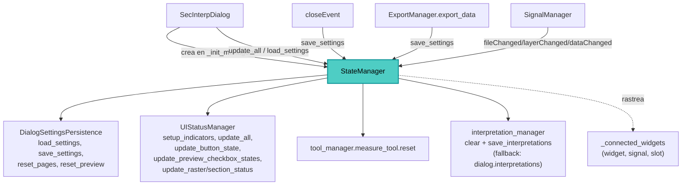

---
tags:
  - secinterp
  - code-walkthrough
  - gui
  - managers
aliases:
  - dialog_state_manager.py
  - StateManager
cssclass: secinterp-note
---

# `gui/dialog_state_manager.py`

> [!abstract] Resumen en una línea
> `StateManager` es el orquestador del estado del diálogo: delega lo visual en `UIStatusManager` (indicadores, botones, checkboxes), la persistencia en `DialogSettingsPersistence` (cargar/guardar reseteo) y rastrea sus propias conexiones vía `connect_checked` para desconectarlas sin fugas.

**Ruta**: `gui/dialog_state_manager.py` (117 líneas)
**Clase principal**: `StateManager`
**Capa**: GUI · Orquestador de estado de `SecInterpDialog` (delegación, sin widgets propios)
**Tags**: #secinterp #gui #managers

---

## 🎯 ¿Por qué existe este archivo?

El "estado" del diálogo mezcla dos preocupaciones distintas: cómo se ve (iconos,
botones habilitados) y qué se recuerda entre sesiones (capas, rutas, opciones).
Este orquestador las separa:

| Problema | Solución |
|----------|----------|
| El diálogo no debe conocer iconos ni `QgsSettings` | Delegación en `UIStatusManager` y `DialogSettingsPersistence` |
| Cargar ajustes deja indicadores desactualizados | `load_settings` termina con `update_all()` |
| Resetear exige tocar páginas, preview y herramientas | `reset_to_defaults` coordina los tres niveles |
| Sus propias conexiones deben limpiarse | `_connected_widgets` + `connect_checked` / `disconnect_signals` |
| Limpiar interpretaciones tiene dos implementaciones | `_reset_tools` con fallback por compatibilidad |

> [!important] Nota arquitectónica
> Fachada de delegación pura: ningún método calcula ni dibuja; todo se reenvía a los
> dos managers especializados. El diálogo ve una sola API (`state_manager.*`) aunque
> por debajo haya dos colaboradores. Ver [[dialog_settings_persistence]] y
> [[ui_status_manager]].

---

## 🧬 Diagrama de relaciones



> [!tip] Cómo leer
> Flecha sólida = delega/llama; punteada = registro interno de conexiones.

---

## 📦 Imports — lectura arquitectónica

```python
# gui/dialog_state_manager.py
from __future__ import annotations

import contextlib                     # ①
from typing import TYPE_CHECKING, Any  # ②

from sec_interp.logger_config import get_logger  # ③

from .dialog_settings_persistence import DialogSettingsPersistence  # ④
from .ui_status_manager import UIStatusManager                      # ⑤

if TYPE_CHECKING:                       # ②
    from sec_interp.gui.main_dialog import SecInterpDialog

logger = get_logger(__name__)
```

| # | Observación |
|---|-------------|
| ① | `contextlib.suppress(TypeError, RuntimeError)` en el barrido de `disconnect_signals`. |
| ② | `SecInterpDialog` solo para anotar bajo `TYPE_CHECKING`; `Any` para la lista de widgets rastreados. |
| ③ | Tres logs de ciclo de vida: desconexión (debug con conteo), carga y reseteo (info). |
| ④ | Persistencia: `QgsSettings` por página más resolución de capas por id/nombre. |
| ⑤ | Estado visual: indicadores de obligatorios, habilitación de botones y checkboxes. |

> [!note] Sin Qt ni QGIS
> Como `InputManager`, este módulo no importa Qt ni QGIS: solo coordina. Toda la
> dependencia visual vive en `UIStatusManager` y toda la de ajustes en la persistencia.

---

## 🏗️ Inventario de estructura

**Clases:** `class StateManager` — 12 métodos en 3 grupos.

| Grupo | Métodos |
|-------|---------|
| Orquestación visual (delegan en `status_manager`) | `setup_indicators`, `update_all`, `update_preview_checkbox_states`, `update_button_state`, `update_raster_status`, `update_section_status` |
| Gestión de señales (propia) | `disconnect_signals`, `connect_checked` |
| Persistencia (delegan en `persistence` + post-pasos) | `load_settings`, `save_settings`, `reset_to_defaults`, `_reset_tools` |

**Estado:** `self.dialog`, `self._connected_widgets: list[Any]` (tuplas
`(widget, signal, slot)`), `self.persistence`, `self.status_manager`.

---

## 📖 Recorrido método por método

### `__init__` — Dos especialistas y una lista de rastreo

```python
def __init__(self, dialog: SecInterpDialog) -> None:
    self.dialog = dialog
    self._connected_widgets: list[Any] = []

    # Specialized Managers
    self.persistence = DialogSettingsPersistence(dialog)
    self.status_manager = UIStatusManager(dialog)
```

Ambos especialistas reciben el mismo diálogo; el `StateManager` es la única vía de
acceso desde fuera. La lista nace vacía: solo se llena vía `connect_checked`.

### Orquestación visual — Seis delegaciones finas

```python
def setup_indicators(self) -> None:
    """Set up required field indicators with warning icons."""
    self.status_manager.setup_indicators()

def update_all(self) -> None:
    """Update all UI status components."""
    self.status_manager.update_all()

def update_preview_checkbox_states(self) -> None:
    """Enable or disable preview checkboxes."""
    self.status_manager.update_preview_checkbox_states()

def update_button_state(self) -> None:
    """Enable or disable buttons based on input validity."""
    self.status_manager.update_button_state()

def update_raster_status(self) -> None:
    """Update raster layer status icon."""
    self.status_manager.update_raster_status()

def update_section_status(self) -> None:
    """Update section line status icon."""
    self.status_manager.update_section_status()
```

Cada método es una línea: el orquestador no añade lógica. `main_dialog` los llama en
`__init__` (`setup_indicators`, `update_all`, `load_settings`) y `SignalManager`
conecta `update_button_state` (ruta/capas) y `update_preview_checkbox_states`
(capas/datos) como slots. Detalle visual en [[ui_status_manager]].

### `connect_checked` / `disconnect_signals` — Rastreo propio

```python
def disconnect_signals(self) -> None:
    """Disconnect all UI signals to prevent memory leaks."""
    logger.debug(f"Disconnecting {len(self._connected_widgets)} UI signals")
    for _widget, signal, slot in self._connected_widgets:
        with contextlib.suppress(TypeError, RuntimeError):
            signal.disconnect(slot)
    self._connected_widgets.clear()

def connect_checked(self, widget: Any, signal: Any, slot: Any) -> None:
    """Connect a signal and track it for later disconnection."""
    signal.connect(slot)
    self._connected_widgets.append((widget, signal, slot))
```

A diferencia del `disconnect()` global de otros managers, aquí se desconecta el
**slot nominal** (`signal.disconnect(slot)`): solo se suelta la conexión registrada,
sin tocar otras conexiones de la misma señal. El widget se guarda aunque no se use
en la desconexión (trazabilidad en depuración). El log incluye el conteo antes de
limpiar.

### `load_settings` — Restaurar y refrescar

```python
def load_settings(self) -> None:
    """Load user settings from previous session."""
    self.persistence.load_settings()
    # Update all status indicators after bulk restoration
    self.update_all()
    logger.info("Settings loaded and UI updated")
```

La restauración masiva deja los widgets con valores que los indicadores desconocen;
`update_all()` los reconcilia. Lo invoca `SecInterpDialog.__init__` después de
`update_all()` inicial (doble refresco barato que garantiza consistencia).

### `save_settings` — Persistencia directa

```python
def save_settings(self) -> None:
    """Save user settings for next session."""
    self.persistence.save_settings()
```

Sin post-pasos: delegación pura. Tres llamantes: `closeEvent` (vía
`DialogLifecycleMixin`), el botón Save indirectamente y `ExportManager.export_data`
(autoguardado antes de exportar datos).

### `reset_to_defaults` — Reseteo en tres niveles

```python
def reset_to_defaults(self) -> None:
    """Reset all dialog inputs to their default values."""
    self.persistence.reset_pages()
    self.persistence.reset_preview()
    self._reset_tools()

    self.dialog.preview_widget.results_text.append(
        self.dialog.tr("✓ Form reset to default values")
    )
    self.update_all()
    logger.info("Dialog reset to defaults by user")
```

Coordina (1) páginas de configuración, (2) opciones del preview y (3) herramientas
más interpretaciones; luego informa en `results_text` (con `append`, sin borrar el
historial) y reconcilia la UI con `update_all()`. Conectado a `reset_defaults_btn`
vía `SignalManager` → `dialog.reset_defaults_handler`.

### `_reset_tools` — Herramientas e interpretaciones con fallback

```python
def _reset_tools(self) -> None:
    """Reset internal tools and interpretations."""
    if hasattr(self.dialog, "tool_manager"):
        self.dialog.tool_manager.measure_tool.reset()

    # Handle interpretations via manager or direct property (backward compat)
    if hasattr(self.dialog, "interpretation_manager") and self.dialog.interpretation_manager:
        self.dialog.interpretation_manager.interpretations = []
        self.dialog.interpretation_manager.save_interpretations()
    elif hasattr(self.dialog, "interpretations"):
        self.dialog.interpretations = []
        if hasattr(self.dialog, "_save_interpretations"):
            self.dialog._save_interpretations()
```

Resetea la herramienta de medición y vacía las interpretaciones persistiendo el
vacío. La rama `elif` cubre diálogos antiguos sin `InterpretationManager`
(comentario `backward compat` en código): propiedad directa más guardado si existe.
Los `hasattr` defensivos evitan romper ante diálogos parcialmente construidos.

---

## 🔬 Colaboradores bajo el capó

### `DialogSettingsPersistence` — Qué persiste y cómo

Métodos públicos verificados en `gui/dialog_settings_persistence.py`:

| Método | Rol |
|--------|-----|
| `load_settings()` / `save_settings()` | Bucle sobre `_data_pages()` + ajustes de salida |
| `reset_pages()` / `reset_preview()` | Valores de fábrica en páginas y opciones del preview |
| `_read_page(page)` / `_write_page(page, data)` | Serialización por página vía `QgsSettings` |
| `_save_layer_value` / `_resolve_layer_value` | Capas como par id + nombre (robusto ante reorden) |
| `_find_layer_by_id_or_name` (+ `_by_id`, `_by_name`) | Resolución tolerante al reabrir el proyecto |
| `_load_output_settings` / `_save_output_settings` | Ruta de salida fuera de las páginas |
| `_parse_setting_value` / `_parse_persisted_value` | Coerción de tipos (`bool`, `int`, `float`, `str`) |

Las capas se guardan por id con fallback a nombre: si el id cambia entre sesiones,
se resuelve por nombre antes de rendirse.

### `UIStatusManager` — Qué muestra

Métodos públicos verificados en `gui/ui_status_manager.py`:

| Método | Rol |
|--------|-----|
| `setup_indicators()` | Iconos de aviso en campos obligatorios |
| `update_all()` | Refresco global (llama a los tres siguientes) |
| `update_preview_checkbox_states()` | Habilita checkboxes según capas configuradas |
| `update_button_state()` | Habilita botones según validez (`can_preview`/`can_export`) |
| `update_raster_status()` / `update_section_status()` | Iconos de estado del DEM y la línea |

El `StateManager` no cachea nada visual: cada llamada atraviesa hasta el especialista,
de modo que lo que se ve siempre refleja el estado actual del diálogo.

---

## 🔄 Flujo de datos

| Fase | Entrada | Transformación | Salida |
|------|---------|----------------|--------|
| Arranque | diálogo | `setup_indicators` + `update_all` + `load_settings` | UI rotulada, actualizada y restaurada |
| Cambio | capa/dato/ruta | `update_button_state` / `update_preview_checkbox_states` | botones/checkboxes coherentes |
| Cierre | `closeEvent` | `save_settings` | ajustes persistidos |
| Export | `export_data` | `save_settings` (autoguardado) | lo visible coincide con lo exportado |
| Reset | `reset_defaults_btn` | `reset_pages` + `reset_preview` + `_reset_tools` | valores de fábrica + aviso |

---

## 🏛️ Patrones de diseño presentes

| Patrón | Dónde | Propósito |
|--------|-------|-----------|
| **Facade** | clase completa | Una API (`state_manager.*`) sobre dos especialistas |
| **Delegation** | 6 métodos visuales + 2 de persistencia | Cero lógica en el orquestador |
| **Tracker (registro de conexiones)** | `_connected_widgets` + `connect_checked` | Desconexión nominal sin fugas |
| **Template (reset)** | `reset_to_defaults` | Secuencia fija páginas → preview → herramientas |
| **Backward-compat branch** | `_reset_tools` | Soportar diálogos sin `InterpretationManager` |

---

## 🧾 Resumen de la API

| Símbolo | Firma | Uso típico |
|---------|-------|------------|
| `StateManager(dialog)` | constructor | Creado en `main_dialog._init_managers` |
| `setup_indicators()` / `update_all()` | `-> None` | Arranque del diálogo |
| `update_button_state()` | `-> None` | Slot de ruta/capas (vía `SignalManager`) |
| `update_preview_checkbox_states()` | `-> None` | Slot de capas/datos |
| `update_raster_status()` / `update_section_status()` | `-> None` | Iconos de DEM y sección |
| `connect_checked(widget, signal, slot)` | `-> None` | Conexión rastreada |
| `disconnect_signals()` | `-> None` | Desconexión nominal del rastreo |
| `load_settings()` / `save_settings()` | `-> None` | Restaurar / persistir sesión |
| `reset_to_defaults()` | `-> None` | Botón Reset Defaults |

---

## 🛡️ Manejo de errores

| Situación | Comportamiento |
|-----------|----------------|
| Slot ya desconectado u objeto destruido | `suppress(TypeError, RuntimeError)` por conexión |
| `tool_manager` ausente en `_reset_tools` | `hasattr` lo salta |
| Sin `interpretation_manager` | Fallback a `dialog.interpretations` (+ `_save_interpretations` si existe) |
| Restauración masiva inconsistente | `update_all()` reconcilia tras `load_settings` y `reset_to_defaults` |

---

## 🌐 i18n

Una sola cadena propia: `"✓ Form reset to default values"` vía `self.dialog.tr()`
(nótese que usa el `tr` del diálogo, no mixin propio). El resto de cadenas viven en
`UIStatusManager` y `DialogSettingsPersistence`.

---

## 🧪 Tests asociados

Cobertura real en `tests/gui/test_dialog_state_manager.py` (diálogo mockeado):

- `test_reset_to_defaults_interacts_with_widgets` — coordinación páginas/preview/herramientas.
- `test_update_button_state_enabled` / `test_update_button_state_disabled` — puertas de botones.
- `test_parse_setting_value_types` — tipos al persistir ajustes.
- `test_reset_button_triggers_state_manager` — cableado del botón Reset.
- `test_close_saves_settings` — persistencia al cerrar.
- `test_page_signals_trigger_status_update` / `test_page_signals_survive_connect_all` — slots vivos tras reconexión.
- `test_settings_reset_button_restores_defaults` — reseteo extremo a extremo.

---

## 👀 Observaciones y notas

> [!success] Fortalezas
> - Fachada mínima: el diálogo ignora que hay dos especialistas por debajo.
> - `disconnect(slot)` nominal en vez de global: no rompe conexiones ajenas.
> - `load_settings` y `reset_to_defaults` reconcilian con `update_all()`: sin indicadores rancios.
> - Fallback de compatibilidad en `_reset_tools` documentado en código.

> [!warning] Puntos de atención
> - `connect_checked` guarda el widget pero nunca lo usa (firma pensada para depurar, no para desconectar).
> - `dialog.preview_widget.results_text.append` en `reset_to_defaults`: si el widget no existe, el reseteo lanza tras haber reseteado.
> - Acceso directo a `tool_manager.measure_tool` sin comprobar `measure_tool`: `initialize_tools` debe haber corrido.
> - La rama legacy de `_reset_tools` duplica lógica del `InterpretationManager`: candidata a deprecación.

> [!question] Preguntas abiertas
> - ¿Mover el `append` informativo antes del reseteo o protegerlo con `hasattr`?
> - ¿Eliminar la rama legacy cuando todos los diálogos usen `InterpretationManager`?
> - ¿Exponer `_connected_widgets` como solo-lectura para depuración de fugas?

---

## 🔗 Notas relacionadas

- [[Index]] — índice de la bóveda
- [[main_dialog]] — crea el orquestador; `reset_defaults_handler`
- [[dialog_signal_manager]] — conecta `update_button_state` y `update_preview_checkbox_states`
- [[dialog_lifecycle_mixin]] — `save_settings` al cerrar
- [[dialog_export_manager]] — autoguardado antes de exportar
- [[dialog_input_manager]] — `can_preview` / `can_export` tras estas puertas
- [[dialog_settings_persistence]] — `load/save/reset_pages/reset_preview`
- [[ui_status_manager]] — indicadores, botones y checkboxes
- [[dialog_interpretation_manager]] — interpretaciones vaciadas en `_reset_tools`

---

*Nota de la bóveda SecInterp Code Walkthrough v2 — v3.9.0*
