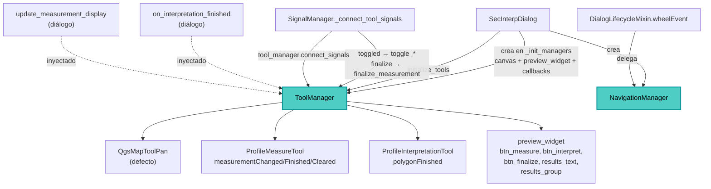

---
tags:
  - secinterp
  - code-walkthrough
  - gui
  - managers
aliases:
  - dialog_tool_manager.py
  - ToolManager
  - NavigationManager
cssclass: secinterp-note
---

# `gui/dialog_tool_manager.py`

> [!abstract] Resumen en una línea
> `ToolManager` posee las herramientas del lienzo de vista previa (pan, medición e interpretación) con conexión idempotente de señales y conmutación exclusiva, mientras `NavigationManager` traduce la rueda del ratón en zoom; ambos reciben colaboradores inyectados para testabilidad.

**Ruta**: `gui/dialog_tool_manager.py` (203 líneas)
**Clases principales**: `ToolManager`, `NavigationManager`
**Capa**: GUI · Managers de `SecInterpDialog` (herramientas `QgsMapTool` del canvas)
**Tags**: #secinterp #gui #managers

---

## 🎯 ¿Por qué existe este archivo?

El lienzo de vista previa necesita tres herramientas excluyentes más zoom con rueda.
Sin este módulo, la gestión de `QgsMapTool` viviría dispersa en el diálogo:

| Problema | Solución |
|----------|----------|
| Solo una herramienta puede estar activa | `toggle_*` conmutan contra la herramienta pan por defecto |
| Reconectar señales duplica los slots | `connect_signals` idempotente (desconecta primero) |
| Reconstruir el diálogo fuga conexiones | `disconnect_signals` con `contextlib.suppress` por señal |
| El zoom con rueda debe delegarse | `NavigationManager.handle_wheel_event` usado por `DialogLifecycleMixin` |
| Probar herramientas exige lienzo real | Herramientas inyectables por constructor |

> [!important] Nota arquitectónica
> Manager de herramientas GUI puras: no toca `core/` ni calcula nada; traduce gestos
> (clics, toggles, rueda) en herramientas del canvas y callbacks. Las herramientas
> reciben el canvas, nunca capas vivas en hilos.

---

## 🧬 Diagrama de relaciones



> [!tip] Cómo leer
> Flecha sólida = crea/conecta; punteada = callback inyectado por el diálogo.

---

## 📦 Imports — lectura arquitectónica

```python
# gui/dialog_tool_manager.py
from __future__ import annotations

import contextlib              # ①
from collections.abc import Callable  # ②
from typing import Any           # ③

from qgis.gui import QgsMapTool, QgsMapToolPan   # ④

from .tools.interpretation_tool import ProfileInterpretationTool  # ⑤
from .tools.measure_tool import ProfileMeasureTool                # ⑤
```

| # | Observación |
|---|-------------|
| ① | `contextlib.suppress(TypeError, RuntimeError)` envuelve cada `disconnect()`: desconectar una señal nunca conectada no debe lanzar. |
| ② | `Callable` tipa los dos callbacks del diálogo y la traducción. |
| ③ | `Any` para canvas, widgets y métricas (sin acoplar a clases Qt concretas). |
| ④ | Único import QGIS: `QgsMapTool` (anotación del pan inyectable) y `QgsMapToolPan` (herramienta por defecto). Nada de `qgis.core`. |
| ⑤ | Herramientas propias del plugin: medición multipunto y digitalización de interpretaciones. Ver [[measure_tool]] e [[interpretation_tool]]. |

> [!note] Sin `core/`
> Este manager no importa ningún servicio: es interacción pura. La medición se
> formatea aquí; la geometría interpretada la consume el `InterpretationManager`.

---

## 🏗️ Inventario de estructura

**Clases:** `class ToolManager` (8 métodos) y `class NavigationManager` (2 métodos).

**`ToolManager`:**

- `__init__(canvas, preview_widget, translate, on_interpretation_finished, update_measurement_display, pan_tool=None, measure_tool=None, interpretation_tool=None)`
- `initialize_tools()` — crea las no inyectadas, conecta y activa pan.
- `connect_signals()` — idempotente: desconecta primero, luego conecta 4 señales.
- `toggle_measure_tool(checked)` — activa medición (con reset) o vuelve a pan.
- `activate_default_tool()` — pan como herramienta por defecto.
- `toggle_interpretation_tool(checked)` — activa interpretación (desmarca medición) o pan.
- `update_measurement_display(metrics)` — formatea el dict de medición en HTML.
- `disconnect_signals()` — desconexión individual con `suppress` por señal.

**`NavigationManager`:**

- `__init__(canvas)` — guarda el lienzo.
- `handle_wheel_event(event) -> bool` — zoom si el cursor está sobre el lienzo.

---

## 📖 Recorrido método por método

### `ToolManager.__init__` — Todo inyectable

```python
def __init__(
    self,
    canvas: Any,
    preview_widget: Any,
    translate: Callable[[str], str],
    on_interpretation_finished: Callable[[Any], None],
    update_measurement_display: Callable[[dict], None],
    pan_tool: QgsMapTool | None = None,
    measure_tool: ProfileMeasureTool | None = None,
    interpretation_tool: ProfileInterpretationTool | None = None,
) -> None:
    self.canvas = canvas
    self.preview_widget = preview_widget
    self.tr = translate
    self.on_interpretation_finished = on_interpretation_finished
    self._update_measurement_display_cb = update_measurement_display
    self.pan_tool = pan_tool
    self.measure_tool = measure_tool
    self.interpretation_tool = interpretation_tool
```

Las tres herramientas aceptan dobles: los tests inyectan mocks sin lienzo real.
Los callbacks (`on_interpretation_finished`, `update_measurement_display`) son
métodos del diálogo pasados como funciones: el manager nunca importa el diálogo.

### `initialize_tools` — Creación perezosa y pan por defecto

```python
def initialize_tools(self) -> None:
    if not self.pan_tool:
        self.pan_tool = QgsMapToolPan(self.canvas)
    if not self.measure_tool:
        self.measure_tool = ProfileMeasureTool(self.canvas)
    if not self.interpretation_tool:
        self.interpretation_tool = ProfileInterpretationTool(self.canvas)

    self.connect_signals()
    self.canvas.setMapTool(self.pan_tool)
```

Solo construye lo no inyectado (patrón null-coalescing por atributo), conecta
señales y deja el pan activo. Lo invoca `SecInterpDialog.__init__` justo después de
crear los botones `clear_cache_btn` / `reset_defaults_btn`.

### `connect_signals` — Idempotencia explícita

```python
def connect_signals(self) -> None:
    # Always disconnect first to ensure we don't have multiple connections
    self.disconnect_signals()

    if self.interpretation_tool:
        self.interpretation_tool.polygonFinished.connect(self.on_interpretation_finished)

    if self.measure_tool:
        self.measure_tool.measurementChanged.connect(self._update_measurement_display_cb)
        self.measure_tool.measurementFinished.connect(
            lambda: self.preview_widget.btn_measure.setChecked(False)
        )
        self.measure_tool.measurementCleared.connect(self.preview_widget.results_text.clear)
```

| Señal | Slot | Efecto |
|-------|------|--------|
| `polygonFinished` | `on_interpretation_finished` (diálogo) | El polígono digitalizado llega al `InterpretationManager` |
| `measurementChanged` | `_update_measurement_display_cb` (diálogo) | Repintado en vivo de la medición |
| `measurementFinished` | lambda → `btn_measure.setChecked(False)` | Al terminar, el botón toggle se desmarca solo |
| `measurementCleared` | `results_text.clear` | Al limpiar, el panel de resultados se vacía |

Desconectar primero hace el método seguro ante llamadas repetidas
(`SignalManager` lo re-invoca en `_connect_tool_signals`).

### `toggle_measure_tool` — Medición exclusiva

```python
def toggle_measure_tool(self, checked: bool) -> None:
    if checked:
        # Reset any previous measurement when starting new one
        self.measure_tool.reset()
        self.canvas.setMapTool(self.measure_tool)
        self.measure_tool.activate()
        # Show finalize button when measurement tool is active
        self.preview_widget.btn_finalize.setVisible(True)
        # Ensure canvas has focus for keyboard events
        self.canvas.setFocus()
    else:
        self.canvas.setMapTool(self.pan_tool)
        self.pan_tool.activate()
        # Hide finalize button when measurement tool is inactive
        self.preview_widget.btn_finalize.setVisible(False)
```

Al activar: resetea la medición anterior, instala la herramienta, la activa, muestra
`btn_finalize` y da foco al lienzo (eventos de teclado). Al desactivar: vuelve a pan
y oculta `btn_finalize`. Conectado a `btn_measure.toggled` por `SignalManager`.

### `toggle_interpretation_tool` — Interpretación exclusiva

```python
def toggle_interpretation_tool(self, checked: bool) -> None:
    if checked:
        # Deactivate measure tool if active
        self.preview_widget.btn_measure.setChecked(False)
        # Reset and activate interpretation tool
        self.interpretation_tool.reset()
        self.canvas.setMapTool(self.interpretation_tool)
        self.interpretation_tool.activate()
        # Ensure canvas has focus for keyboard events
        self.canvas.setFocus()
    else:
        self.canvas.setMapTool(self.pan_tool)
        self.pan_tool.activate()
```

Al activar desmarca `btn_measure` (las herramientas son excluyentes: el toggle de
medición dispara su propio `toggle_measure_tool(False)` y vuelve a pan antes de que
se instale la de interpretación). Conectado a `btn_interpret.toggled`.

### `activate_default_tool` — Refugio pan

```python
def activate_default_tool(self) -> None:
    self.canvas.setMapTool(self.pan_tool)
    self.pan_tool.activate()
```

Restaura navegación neutra; usada al cerrar herramientas y en la limpieza del diálogo.

### `update_measurement_display` — Métricas a HTML

```python
def update_measurement_display(self, metrics: dict[str, Any]) -> None:
    MIN_POINT_COUNT = 2
    if not metrics or metrics.get("point_count", 0) < MIN_POINT_COUNT:
        return

    total_dist = metrics.get("total_distance", 0)
    horiz_dist = metrics.get("horizontal_distance", 0)
    elev_change = metrics.get("elevation_change", 0)
    avg_slope = metrics.get("avg_slope", 0)
    seg_count = metrics.get("segment_count", 0)
    point_count = metrics.get("point_count", 0)

    # Format result text with HTML for better presentation
    msg = (
        f"<b>{self.tr('Multi-Point Measurement')}</b><br>"
        f"<b>{self.tr('Points')}:</b> {point_count} | <b>{self.tr('Segments')}:</b> {seg_count}<br>"
        f"<b>{self.tr('Total Distance')}:</b> {total_dist:.2f} m<br>"
        f"<b>{self.tr('Horizontal Distance')}:</b> {horiz_dist:.2f} m<br>"
        f"<b>{self.tr('Elevation Change')}:</b> {elev_change:+.2f} m<br>"
        f"<b>{self.tr('Average Slope')}:</b> {avg_slope:.1f}°"
    )
    self.preview_widget.results_text.setHtml(msg)
    # Ensure results group is expanded
    self.preview_widget.results_group.setCollapsed(False)
```

Guarda local `MIN_POINT_COUNT = 2`: con menos de 2 puntos no hay segmento y sale sin
tocar la UI. Cada etiqueta pasa por `self.tr()`; el desnivel lleva signo explícito
(`{:+.2f}`). Tras publicar, expande el grupo de resultados.

### `disconnect_signals` — Desconexión quirúrgica

```python
def disconnect_signals(self) -> None:
    if self.interpretation_tool:
        with contextlib.suppress(TypeError, RuntimeError):
            self.interpretation_tool.polygonFinished.disconnect()
    if self.measure_tool:
        with contextlib.suppress(TypeError, RuntimeError):
            self.measure_tool.measurementChanged.disconnect()
        with contextlib.suppress(TypeError, RuntimeError):
            self.measure_tool.measurementFinished.disconnect()
        with contextlib.suppress(TypeError, RuntimeError):
            self.measure_tool.measurementCleared.disconnect()
```

Un bloque `suppress` por señal (no uno global): si una desconexión falla, las demás
se intentan igual. `TypeError` cubre "señal no conectada" y `RuntimeError` el objeto
Qt ya destruido. Simetría conectar/desconectar exigida por `gui/AGENTS.md`.

### `NavigationManager.handle_wheel_event` — Zoom con rueda

```python
def handle_wheel_event(self, event: Any) -> bool:
    if self.canvas.underMouse():
        if event.angleDelta().y() > 0:
            self.canvas.zoomIn()
        else:
            self.canvas.zoomOut()
        event.accept()
        return True
    return False
```

Solo actúa si el cursor está sobre el lienzo (`underMouse`); `angleDelta().y() > 0`
acerca, el resto aleja. Devuelve `True` consumido (el `wheelEvent` del mixin de ciclo
de vida retorna) o `False` (propaga a `super().wheelEvent(event)`).

---

## 🔄 Flujo de datos

| Fase | Entrada | Transformación | Salida |
|------|---------|----------------|--------|
| Init | canvas + callbacks | `initialize_tools` | pan activo, señales conectadas |
| Toggle | `btn_measure` / `btn_interpret` | `toggle_*` excluyentes | herramienta instalada + foco |
| Medir | movimiento del ratón | `measurementChanged` | HTML en `results_text` |
| Finalizar | `btn_finalize` / fin de trazo | `finalize_measurement` / `measurementFinished` | botón desmarcado |
| Interpretar | polígono cerrado | `polygonFinished` | callback del diálogo |
| Zoom | rueda sobre lienzo | `zoomIn` / `zoomOut` | evento consumido |
| Cierre | `closeEvent` | `disconnect_signals` + reset | sin conexiones colgando |

---

## 🏛️ Patrones de diseño presentes

| Patrón | Dónde | Propósito |
|--------|-------|-----------|
| **Manager (descomposición de diálogo)** | ambas clases | Sacar herramientas y navegación del diálogo |
| **State (herramienta activa)** | `toggle_*` + `activate_default_tool` | Una sola herramienta instalada cada vez |
| **Observer** | 4 señales de herramientas | Herramientas → manager → diálogo |
| **Dependency Injection** | constructor (3 herramientas + 2 callbacks) | Testabilidad sin lienzo real |
| **Guard clause** | `MIN_POINT_COUNT`, `underMouse` | No tocar la UI sin datos o foco válidos |

---

## 🧾 Resumen de la API

| Símbolo | Firma | Uso típico |
|---------|-------|------------|
| `ToolManager(canvas, preview_widget, tr, on_interp, on_measure, ...)` | constructor | Creado en `main_dialog._init_managers` |
| `initialize_tools()` | `-> None` | Arranque del diálogo |
| `toggle_measure_tool(checked)` | `(bool) -> None` | Slot de `btn_measure.toggled` |
| `toggle_interpretation_tool(checked)` | `(bool) -> None` | Slot de `btn_interpret.toggled` |
| `activate_default_tool()` | `-> None` | Volver a pan |
| `update_measurement_display(metrics)` | `(dict) -> None` | Medición formateada en la UI |
| `connect_signals()` / `disconnect_signals()` | `-> None` | Ciclo de vida (vía `SignalManager`) |
| `NavigationManager(canvas).handle_wheel_event(event)` | `-> bool` | Zoom con rueda |

---

## 🛡️ Manejo de errores

| Situación | Comportamiento |
|-----------|----------------|
| Herramienta `None` al conectar/desconectar | Bloque `if` la salta (no lanza) |
| Desconectar señal no conectada u objeto destruido | `suppress(TypeError, RuntimeError)` |
| Medición con < 2 puntos o dict vacío/`None` | Retorno temprano sin tocar la UI |
| Rueda fuera del lienzo | `False`: el evento propaga al padre |

---

## 🌐 i18n

Las seis etiquetas de la medición pasan por `self.tr()`: "Multi-Point Measurement",
"Points", "Segments", "Total Distance", "Horizontal Distance", "Elevation Change" y
"Average Slope". Unidades (`m`, `°`) y formato numérico fuera de traducción.

---

## 🧪 Tests asociados

No existe `tests/gui/test_dialog_tool_manager.py` dedicado; la cobertura real vive en
`tests/gui/test_main_dialog_tools.py` (herramientas mockeadas, sin lienzo real):

- `test_initialize_tools_creates_default_tools` / `test_initialize_tools_uses_provided_tools` — creación perezosa frente a inyección.
- `test_toggle_measure_tool_activate` / `test_toggle_measure_tool_deactivate` — instalación, reset, `btn_finalize` visible/oculto.
- `test_activate_default_tool` — vuelta a pan.
- `test_toggle_interpretation_tool_activate` / `test_toggle_interpretation_tool_deactivate` — exclusión con medición.
- `test_update_measurement_display_valid_metrics` / `..._insufficient_points` / `..._empty_metrics` / `..._none_metrics` — guarda `MIN_POINT_COUNT`.
- `test_handle_wheel_event_zoom_in` — zoom consumido sobre el lienzo.

Las herramientas en sí se prueban en `test_measure_tool.py` y `test_interpretation_tool.py`.

---

## 👀 Observaciones y notas

> [!success] Fortalezas
> - Inyección total (herramientas + callbacks + `tr`): testeable sin QGIS real.
> - `connect_signals` idempotente y `disconnect_signals` quirúrgico: sin fugas ni dobles slots.
> - Exclusión mutua explícita (desmarcar medición al interpretar).
> - `NavigationManager` separado: el zoom no contamina la lógica de herramientas.

> [!warning] Puntos de atención
> - La lambda de `measurementFinished` no se puede desconectar nominalmente (se usa `disconnect()` global, correcto aquí pero frágil si se añaden slots).
> - `toggle_*` asumen herramientas no `None`: si `initialize_tools` no corrió, `AttributeError`.
> - `MIN_POINT_COUNT` es constante local: cada llamada la redefine (detalle menor).
> - `update_measurement_display` existe como método y como callback inyectado con el mismo nombre: conviven, pero confunde (el conectado es el del diálogo).

> [!question] Preguntas abiertas
> - ¿Guardar la referencia del slot `measurementFinished` para desconexión nominal?
> - ¿Afirmar herramientas inicializadas al inicio de `toggle_*` con error claro?
> - ¿Unificar el callback de medición en un solo sitio (manager o diálogo)?

---

## 🔗 Notas relacionadas

- [[Index]] — índice de la bóveda
- [[main_dialog]] — crea ambos managers e inyecta los callbacks
- [[dialog_signal_manager]] — `toggled`/`clicked` → `toggle_*`/`finalize_measurement`
- [[dialog_lifecycle_mixin]] — `wheelEvent` delega en `NavigationManager`
- [[measure_tool]] — `ProfileMeasureTool` y sus 3 señales
- [[interpretation_tool]] — `ProfileInterpretationTool` y `polygonFinished`
- [[dialog_interpretation_manager]] — consume los polígonos terminados
- [[dialog_preview_manager]] — dueño del lienzo y `preview_widget`

---

*Nota de la bóveda SecInterp Code Walkthrough v2 — v3.9.1*
