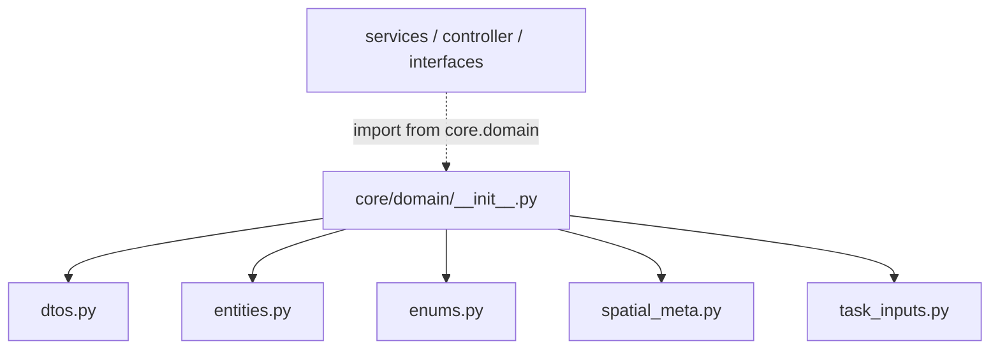

---
tags:
  - secinterp
  - code-walkthrough
  - core
  - domain
aliases:
  - core/domain/__init__.py
  - domain
  - core/domain/
cssclass: secinterp-note
---

# `core/domain/__init__.py`

> [!abstract] Resumen en una línea
> El **facade** del paquete de dominio: re-exporta los 24 símbolos públicos de `dtos.py`, `entities.py`, `enums.py`, `spatial_meta.py` y `task_inputs.py` para que el resto del core importe desde un único punto `core.domain`.

**Ruta**: `core/domain/__init__.py` (68 líneas)
**Clase/Función principal**: re-exports / `__all__`
**Capa**: Core (QGIS-agnóstico)
**Tags**: #secinterp #core #domain

---

## 🎯 ¿Por qué existe este archivo?

`core/domain/` contiene 6 módulos con los tipos del dominio (entidades, DTOs, enums,
metadatos espaciales y contextos). Sin un `__init__` que los re-exporte, cada consumidor
debería importar de cada sub-módulo por separado. El facade resuelve eso:

| Problema | Solución |
|----------|----------|
| Importar de 6 sub-módulos dispersos | Re-export unificado desde `core.domain` |
| API pública no controlada | `__all__` explícito con 24 símbolos |
| Dependencias internas del paquete expuestas | El consumidor no conoce la estructura interna |
| Refactor de sub-módulos sin romper consumidores | El facade es el único punto estable |

> [!important] Nota arquitectónica — Facade + `__all__`
> El `__init__.py` actúa como **fachada** del dominio: importa todos los símbolos y los
> declara en `__all__`, que además controla qué expone `from core.domain import *`. Es
> QGIS-agnóstico: solo re-exporta tipos puros (dataclasses, aliases, un `IntEnum`).

---

## 🧬 Diagrama de relaciones



> [!tip] Cómo leer
> Sólida = importa (el `__init__` agrega los 5 sub-módulos). Punteada = los consumidores
> importan **solo desde el facade** (`from sec_interp.core.domain import GeologyContext`),
> sin conocer la ubicación real de cada tipo.

---

## 📦 Imports — lectura arquitectónica

```python
# core/domain/__init__.py
from __future__ import annotations

from .dtos import (
    PreviewParams,
    PreviewResult,
)
from .entities import (
    DomainGeometry, DrillholeProjection, ExportSettings,
    GeologyData, GeologyPoints, GeologySegment,
    InterpretationPolygon, InterpretationPolygon25D,
    Point2D, Point3D, PointList, ProfileData, ProfilePoints,
    SettingsDict, StructureData, StructureMeasurement, StructurePoints,
    ValidationResult,
)
from .enums import FieldType
from .spatial_meta import SpatialMeta
from .task_inputs import (
    DrillholeContext,
    GeologyContext,
    OutcropSegments,
)
```

| # | Observación |
|---|-------------|
| ① | Importa **relativo** (`.dtos`, `.entities`, …): cohesionado al paquete. |
| ② | Re-exporta por agrupación semántica (DTOs, entidades, enum, meta, inputs). |
| ③ | Sin `from qgis...`: todo lo re-exportado es QGIS-agnóstico. |

---

## 🏗️ Inventario de estructura

**`__all__` (24 símbolos):**

| Sub-módulo | Símbolos re-exportados |
|-----------|------------------------|
| `dtos.py` | `PreviewParams`, `PreviewResult` |
| `entities.py` | `DomainGeometry`, `DrillholeProjection`, `ExportSettings`, `GeologyData`, `GeologyPoints`, `GeologySegment`, `InterpretationPolygon`, `InterpretationPolygon25D`, `Point2D`, `Point3D`, `PointList`, `ProfileData`, `ProfilePoints`, `SettingsDict`, `StructureData`, `StructureMeasurement`, `StructurePoints`, `ValidationResult` |
| `enums.py` | `FieldType` |
| `spatial_meta.py` | `SpatialMeta` |
| `task_inputs.py` | `DrillholeContext`, `GeologyContext`, `OutcropSegments` |

> [!note] `ExportSettings` y `SettingsDict` también son alias
> `ExportSettings` (dict de exportación) y `SettingsDict` vienen de `entities.py` como
> alias de tipo, no como dataclasses. El facade no distingue: re-exporta ambos.

---

## 📁 Archivos del paquete

- `__init__.py` — este archivo (facade). Los demás módulos del paquete tienen nota propia:
  [[dtos]], [[entities]], [[task_inputs]], [[core_domain]] (`enums` + `spatial_meta`).

---

## 📖 Recorrido símbolo por símbolo

El `__init__.py` no define clases ni métodos propios: su único "comportamiento" es
**agregar y exponer**. El recorrido relevante es el de los símbolos re-exportados, que
tienen su detalle en las notas de cada sub-módulo:

| Símbolo | Tipo | Nota con detalle |
|---------|------|------------------|
| `PreviewParams` / `PreviewResult` | dataclass | [[dtos]] |
| `GeologySegment`, `StructureMeasurement`, `DrillholeProjection`, `InterpretationPolygon`, `InterpretationPolygon25D` | dataclass | [[entities]] |
| `Point2D`, `Point3D`, `PointList`, `DomainGeometry`, `ProfileData`, `GeologyData`, `StructureData`, `SettingsDict`, `ExportSettings`, `ValidationResult`, `ProfilePoints`, `GeologyPoints`, `StructurePoints` | alias de tipo | [[entities]] |
| `FieldType` | `IntEnum` | [[core_domain]] |
| `SpatialMeta` | dataclass `frozen` | [[core_domain]] |
| `DrillholeContext`, `GeologyContext`, `OutcropSegments` | dataclass | [[task_inputs]] |

---

## 🔄 Flujo de datos

| Fase | Entrada | Transformación | Salida |
|------|---------|----------------|--------|
| Import | `from sec_interp.core.domain import X` | resolución del facade | símbolo del sub-módulo |
| Uso | tipo importado | construcción/proceso en el consumidor | DTO/entidad |

---

## 🏛️ Patrones de diseño presentes

| Patrón | Dónde | Propósito |
|--------|-------|-----------|
| **Facade** | `__init__.py` | Un único punto de import del dominio |
| **Barrel / Re-export** | imports agrupados | Re-exportar símbolos de sub-módulos |
| **Explicit API (`__all__`)** | lista de 24 símbolos | Controlar la API pública del paquete |

---

## 🧾 Resumen de la API

| Símbolo | Firma / Hereda | Uso típico |
|---------|----------------|------------|
| `PreviewParams` / `PreviewResult` | dataclass | Entrada/salida de generación de perfil |
| `GeologySegment` / `StructureMeasurement` | dataclass | Resultados geológicos/estructurales |
| `DrillholeProjection` / `SpatialMeta` | dataclass | Sondajes proyectados |
| `DrillholeContext` / `GeologyContext` | dataclass | Entradas desacopladas de los servicios |
| `FieldType` | `IntEnum` | Validación de tipos de campo sin PyQt |
| `DomainGeometry` / `Point2D` / `Point3D` | alias | Vocabulario geométrico (WKT, tuplas) |

---

## 🛡️ Manejo de errores

Sin lógica de errores: un `__init__` de re-export no valida ni lanza. El único riesgo es
un `ImportError` si un sub-módulo no existe o tiene un nombre mal escrito en la lista, algo
que los tests de import detectan de inmediato.

---

## 🧪 Tests asociados

No hay un `test_domain.py` dedicado al facade; su corrección se valida **indirectamente**:

- `tests/core/test_entities.py` / `test_dtos.py` — cubren los símbolos re-exportados.
- `tests/core/test_settings_model.py` — usa el alias `ExportSettings`? No; valida `PluginSettings`.
- `tests/core/test_architecture_boundary.py` — verifica que el core no importa QGIS.

> [!note] La lista `__all__` como contrato implícito
> Si se añade un símbolo a un sub-módulo sin añadirlo a `__all__`, no se expone por
> `import *`. Es una decisión de API que conviene revisar en cada cambio.

---

## 👀 Observaciones y notas

> [!success] Fortalezas
> - Un solo punto de import para todo el dominio (`from sec_interp.core.domain import ...`).
> - `__all__` explícito documenta y controla la API pública.
> - Totalmente QGIS-agnóstico.

> [!warning] Puntos de atención
> - `__all__` hay que mantenerlo **a mano**: añadir un tipo en un sub-módulo no lo expone
>   automáticamente (riesgo de olvido).
> - `ExportSettings` (alias de `entities.py`) y `ExportSettings` (dataclass de
>   `settings_model.py`) comparten nombre en dominios distintos — posible confusión.

> [!question] Preguntas abiertas
> - ¿Generar `__all__` automáticamente o mantener la lista manual como "contrato explícito"?
> - ¿Renombrar `ExportSettings` (alias de dominio) para evitar el choque con el de `settings_model`?

---

## 🔢 Ejemplo — import a través del facade

En el código del core, los consumidores importan **desde el facade**, no desde los
sub-módulos:

```python
# ✅ Estilo preferido (facade)
from sec_interp.core.domain import (
    GeologyContext,
    GeologySegment,
    DrillholeContext,
    FieldType,
    SpatialMeta,
)

# ❌ Estilo que el facade pretende evitar (import directo al sub-módulo)
from sec_interp.core.domain.task_inputs import GeologyContext
from sec_interp.core.domain.entities import GeologySegment
```

Ambos funcionan (Python resuelve el sub-módulo igual), pero el facade ofrece un único punto
de import estable: si `GeologyContext` se moviera de `task_inputs.py` a otro módulo, solo
habría que actualizar el `__init__.py`, no todos los consumidores.

> [!note] `from core.domain import *` también funciona
> Gracias a `__all__`, un `from sec_interp.core.domain import *` importaría exactamente los
> 24 símbolos listados. No es el estilo habitual del proyecto (se prefiere importar
> explícito), pero `__all__` garantiza que el wildcard no arrastre `annotations` u otros
> nombres internos.

---

## 📐 Facade vs import directo — criterio

¿Cuándo conviene el facade y cuándo el import directo?

| Criterio | Facade (`from core.domain import X`) | Directo (`from ...task_inputs import X`) |
|----------|--------------------------------------|------------------------------------------|
| Estabilidad del punto de import | Alta (un solo punto) | Baja (atado al archivo) |
| Acoplamiento a la estructura interna | Nulo | Expuesto |
| Claridad de origen | Menor (no ves de qué archivo viene) | Mayor (sabes el módulo exacto) |
| Refactor-friendly | Sí | No |

> [!tip] Regla práctica
> Para tipos **públicos y estables** del dominio (entidades, DTOs, contextos), el facade es
> la elección correcta. Para detalles internos que no deben exponerse, se mantiene el import
> directo dentro del propio paquete.

---

## 🌐 i18n y notas de migración

- **Sin cadenas de usuario**: el `__init__.py` no traduce nada; solo re-exporta tipos.
- **Mantenimiento manual**: `__all__` no se genera; cada símbolo nuevo debe añadirse a la
  lista y al import correspondiente (riesgo de olvido documentado en Observaciones).
- **Estabilidad**: el facade es un contrato *de facto*; renombrar o mover un símbolo sin
  actualizar `__init__.py` rompe `from core.domain import X` para los consumidores.

---

## 📦 Contenido completo de `__all__` (24 símbolos)

Referencia exhaustiva de lo que el facade pone a disposición, agrupado por sub-módulo:

| Símbolo | Sub-módulo | Tipo |
|---------|-----------|------|
| `PreviewParams` | `dtos.py` | dataclass |
| `PreviewResult` | `dtos.py` | dataclass |
| `DomainGeometry` | `entities.py` | alias (`str`, WKT) |
| `Point2D` | `entities.py` | alias (`tuple[float, float]`) |
| `Point3D` | `entities.py` | alias (`tuple[float, float, float]`) |
| `PointList` | `entities.py` | alias (`list[Point2D]`) |
| `ProfileData` | `entities.py` | alias (`list[tuple[float, float]]`) |
| `GeologyData` | `entities.py` | alias (`list[GeologySegment]`) |
| `StructureData` | `entities.py` | alias (`list[StructureMeasurement]`) |
| `SettingsDict` | `entities.py` | alias (`dict[str, Any]`) |
| `ExportSettings` | `entities.py` | alias (`dict[str, Any]`) |
| `ValidationResult` | `entities.py` | alias (`tuple[bool, str]`) |
| `ProfilePoints` / `GeologyPoints` / `StructurePoints` | `entities.py` | alias |
| `GeologySegment` | `entities.py` | dataclass |
| `StructureMeasurement` | `entities.py` | dataclass |
| `InterpretationPolygon` | `entities.py` | dataclass |
| `InterpretationPolygon25D` | `entities.py` | dataclass |
| `DrillholeProjection` | `entities.py` | dataclass |
| `FieldType` | `enums.py` | `IntEnum` |
| `SpatialMeta` | `spatial_meta.py` | dataclass `frozen` |
| `DrillholeContext` | `task_inputs.py` | dataclass |
| `GeologyContext` | `task_inputs.py` | dataclass |
| `OutcropSegments` | `task_inputs.py` | dataclass |

> [!note] 17 símbolos vienen de `entities.py`
> La mayor parte del facade proviene de `entities.py` (17 de 24). Es coherente: las
> entidades y sus alias son el "vocabulario" del dominio; el resto son transportes y enums.

---

## 🔗 Notas relacionadas

- [[Index]] — índice de la bóveda
- [[dtos]] — `PreviewParams` / `PreviewResult`
- [[entities]] — las entidades y alias re-exportados
- [[task_inputs]] — `DrillholeContext` / `GeologyContext`
- [[core_domain]] — `FieldType` y `SpatialMeta`
- [[core_interfaces]] — los contratos que consumen estos tipos
- [[controller]] — consumidor principal del facade

---

*Nota de la bóveda SecInterp Code Walkthrough v2 — v3.9.0*
