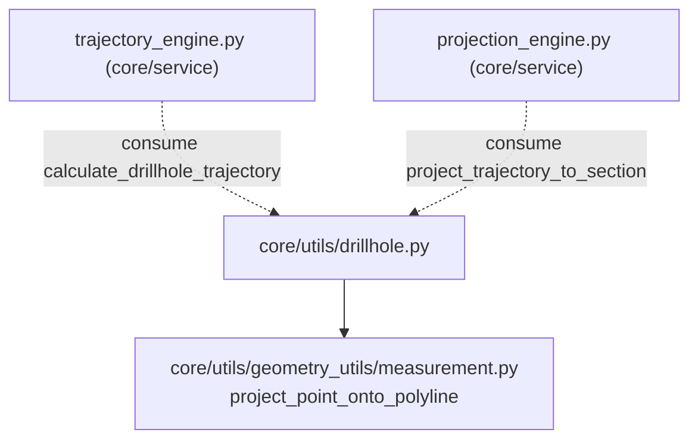

---
tags:
  - secinterp
  - code-walkthrough
  - core
  - utils
aliases:
  - drillhole.py
  - calculate_drillhole_trajectory
  - project_trajectory_to_section
cssclass: secinterp-note
---

# `core/utils/drillhole.py`

> [!abstract] Resumen en una línea
> Utilidades **puras de geometría de sondajes**: calcula la trayectoria 3D a partir de surveys, la proyecta sobre la línea de sección y reparte los intervalos litológicos sobre esa trayectoria, todo sin tocar QGIS.

**Ruta**: `core/utils/drillhole.py` (298 líneas)
**Función principal**: `calculate_drillhole_trajectory`
**Capa**: Core (QGIS-agnóstico)
**Tags**: #secinterp #core #utils

---

## 🎯 ¿Por qué existe este archivo?

Un sondaje no es un punto: es una **polilínea 3D** que serpentea según los datos de
survey (profundidad, azimut, inclinación). Para dibujarlo sobre una sección
vertical necesitamos tres transformaciones independientes:

| Problema | Solución |
|----------|----------|
| Convertir lecturas de survey en coordenadas (x, y, z) | `calculate_drillhole_trajectory` + `_calculate_segment_delta` |
| Aplanar la trayectoria 3D sobre el plano de la sección | `project_trajectory_to_section` |
| Asignar tramos litológicos (from/to) a la trayectoria | `interpolate_intervals_on_trajectory` |

> [!important] QGIS-agnóstico verificado
> El módulo importa solo `math`, `typing` y una utilidad propia
> (`project_point_onto_polyline`). El `collar_point` se consume por **duck typing**
> (`x()`/`y()` o `[0]`/`[1]`), nunca `QgsPoint`. Testeable sin QGIS.

---

## 🧬 Diagrama de relaciones



> [!tip] Cómo leer
> Sólida = importa; punteada = es consumido por. Este módulo es una **hoja** del
> grafo de dependencias: no depende de servicios, solo lo usan.

---

## 📦 Imports — lectura arquitectónica

```python
# core/utils/drillhole.py
from __future__ import annotations

import math
from typing import Any

from sec_interp.core.utils.geometry_utils.measurement import project_point_onto_polyline
```

| # | Observación |
|---|-------------|
| ① | `math` para trigonometría de trayectoria (radianes, cos, sin). |
| ② | `Any` aparece en `collar_point` y `intervals`: el módulo acepta cualquier tipo puntual (duck typing). |
| ③ | Única dependencia interna es `project_point_onto_polyline` — reutiliza la proyección 2D ya probada. |

---

## 🏗️ Inventario de estructura

**Constantes:** `DEPTH_TOLERANCE`, `MIN_INTERVAL_POINTS`

**Funciones/Métodos:**
- `calculate_drillhole_trajectory(...)`
- `project_trajectory_to_section(...)`
- `interpolate_intervals_on_trajectory(...)`
- `_calculate_segment_delta(...)`
- `_initialize_start_point(...)`
- `_process_survey_segment(...)`
- `_calculate_segment_points(...)`
- `_extrapolate_trajectory(...)`
- `_get_points_for_interval(...)`
- `_interpolate_at_depth(...)`

3 funciones **públicas** (la API real), 7 privadas (mecánica interna).

---

## 📖 Recorrido método por método

### `calculate_drillhole_trajectory`

```python
def calculate_drillhole_trajectory(
    collar_point: Any,
    collar_z: float,
    survey_data: list[tuple[float, float, float]],
    section_azimuth: float,
    densify_step: float = 1.0,
    total_depth: float = 0.0,
) -> list[tuple[float, float, float, float, float, float]]:
```

Punto de entrada. Devuelve una lista de tuplas `(depth, x, y, z, 0.0, 0.0)` — los dos
últimos campos quedan en `0.0` porque aún no se ha proyectado sobre la sección.

**Comportamiento:**

1. **Survey vacío** → si `total_depth <= 0` devuelve `[]`; si no, inventa un survey
   vertical `(0.0, 0.0, -90.0)` (inclinación −90° = vertical hacia abajo).
2. Inicializa `(x, y)` con `_initialize_start_point` y `z = collar_z`.
3. Itera cada survey llamando `_process_survey_segment`, acumulando `last_azim`,
   `last_incl`, `last_survey_depth`.
4. Si `total_depth > last_survey_depth`, **extrapola** la trayectoria con
   `_extrapolate_trajectory` usando el último azimut/inclinación conocidos.

> [!warning] `section_azimuth` no se usa aquí
> El parámetro `section_azimuth` se recibe pero **no participa** en el cálculo.
> La trayectoria se calcula en coordenadas absolutas (x, y); el azimut de sección
> solo importa en la proyección posterior. Es un parámetro candidato a eliminar
> o a documentar explícitamente.

### `_calculate_segment_delta`

```python
def _calculate_segment_delta(interval, azimuth, inclination) -> tuple[float, float, float]:
```

El corazón trigonométrico. Convierte un segmento de survey en desplazamientos:

```python
azim_rad = math.radians(azimuth)
standard_incl_rad = math.radians(90 + inclination)
dz = -interval * math.cos(standard_incl_rad)
dx = interval * math.sin(standard_incl_rad) * math.sin(azim_rad)
dy = interval * math.sin(standard_incl_rad) * math.cos(azim_rad)
```

| Detalle | Razón |
|---------|-------|
| `90 + inclination` | Convierte "inclinación desde la horizontal" a "ángulo cenital" (desde la vertical) |
| `-interval * cos(...)` | `cos(90°) = 0` (horizontal) → `dz = 0`; `cos(0°) = 1` (vertical) → `dz = -interval` |
| `sin(azim)` en `dx`, `cos(azim)` en `dy` | Azimut medido desde el norte (eje +y) |

> [!note] Docstring vs. implementación
> El docstring del módulo menciona "minimum curvature", pero **solo se implementa la
> aproximación tangencial** (segmentos rectos entre surveys). No hay curvatura mínima.

### `_initialize_start_point`

```python
def _initialize_start_point(collar_point: Any) -> tuple[float, float]:
```

Duck-typing puro: si el objeto tiene `.x()`/`.y()` lo trata como `QgsPointXY`; si no,
indexa `[0]`/`[1]` como tupla. Ante `AttributeError`/`TypeError`/`IndexError`
devuelve `(0.0, 0.0)` en lugar de propagar.

### `_process_survey_segment`

```python
def _process_survey_segment(depth, azimuth, inclination, x, y, z, prev_depth, densify_step, trajectory) -> tuple:
```

- Guarda `depth <= prev_depth` → no avanza (protege contra surveys desordenados).
- Calcula `dx, dy, dz` y **densifica** el tramo con `_calculate_segment_points`.
- Devuelve el nuevo `(x, y, z, depth)` acumulado.

### `_calculate_segment_points`

```python
num_steps = max(1, int(interval / step))
```

Genera `num_steps` puntos interpolados linealmente (fracción `i/num_steps`) para que
la trayectoria tenga un vértice cada ~`densify_step` metros, incluso en tramos cortos.

### `_extrapolate_trajectory`

```python
def _extrapolate_trajectory(x, y, z, last_depth, total_depth, azim, incl, step) -> list:
```

Extiende la trayectoria desde el último survey hasta `total_depth` con el **último**
azimut/inclinación (asume tramo recto final). Necesario cuando el survey no llega a la
profundidad total declarada.

### `project_trajectory_to_section`

```python
def project_trajectory_to_section(trajectory, line_points) -> list[tuple]:
```

```python
for depth, x, y, z, _, _ in trajectory:
    dist_along, nearest = project_point_onto_polyline((x, y), line_points)
    offset = math.hypot(x - nearest[0], y - nearest[1])
    projected.append((depth, x, y, z, dist_along, offset, nearest[0], nearest[1]))
```

Convierte cada punto 3D en un 8-tupla `(depth, x, y, z, dist_along, offset, proj_x, proj_y)`:
- `dist_along`: distancia recorrida **sobre la sección** (coordenada X del perfil).
- `offset`: distancia **perpendicular** a la sección (para filtrar sondajes lejanos).
- `proj_x/proj_y`: punto proyectado sobre la línea (el "pie" de la perpendicular).

### `interpolate_intervals_on_trajectory`

```python
def interpolate_intervals_on_trajectory(trajectory, intervals, buffer_width) -> list:
```

Reparte atributos litológicos sobre la trayectoria proyectada:

1. Ordena la trayectoria por profundidad (`sorted(..., key=lambda p: p[0])`).
2. Para cada `(from_val, to_val, attr)` obtiene los puntos del intervalo.
3. Si hay ≥ `MIN_INTERVAL_POINTS` (2), construye tres listas de coordenadas:
   `p_2d = (dist_along, z)`, `p_3d = (x, y, z)`, `p_3d_proj = (proj_x, proj_y, z)`.

### `_get_points_for_interval`

```python
p_from = _interpolate_at_depth(traj, from_val)
```

Une tres fuentes de puntos: un punto **interpolado en `from_val`**, todos los vértices
**estrictamente interiores**, y un punto **interpolado en `to_val`** — descartando
duplicados con tolerancia `DEPTH_TOLERANCE`. Cada punto se incluye solo si su
`offset ≤ buffer_width` (el sondaje está lo bastante cerca de la sección).

### `_interpolate_at_depth`

```python
frac = (target_depth - d1) / (d2 - d1)
return tuple(p1[j] + (p2[j] - p1[j]) * frac for j in range(len(p1)))
```

Interpolación lineal de **todos los campos** de la tupla (no solo x/y/z) entre los dos
vértices `p1, p2` que encierran la profundidad objetivo. Maneja coincidencia exacta y
objetivos fuera de rango (devuelve `None`).

---

## 🔄 Flujo de datos

| Fase | Entrada | Transformación | Salida |
|------|---------|----------------|--------|
| Trayectoria | surveys `(depth, azim, incl)` | trigonometría + densificación | 6-tupla `(depth, x, y, z, 0, 0)` |
| Proyección | 6-tupla + `line_points` | `project_point_onto_polyline` + hipotenusa | 8-tupla `(depth, x, y, z, dist, offset, nx, ny)` |
| Intervalos | 8-tupla + `(from, to, attr)` | interpolación por profundidad + filtro `offset` | `(attr, p_2d, p_3d, p_3d_proj)` |

> [!tip] Encadenamiento canónico
> `calculate_drillhole_trajectory` → `project_trajectory_to_section` →
> `interpolate_intervals_on_trajectory` es la cadena que un servicio consumidor
> (`DrillholeService`) usa para pasar del survey a segmentos geológicos dibujables.

---

## 📐 Esquema de las tuplas de trayectoria

El módulo encadena **dos esquemas posicionales** de tupla:

| Índice | 6-tupla (`calculate_drillhole_trajectory`) | 8-tupla (`project_trajectory_to_section`) |
|:---:|---|---|
| 0 | `depth` | `depth` |
| 1 | `x` | `x` |
| 2 | `y` | `y` |
| 3 | `z` | `z` |
| 4 | `0.0` (reservado) | `dist_along` (X del perfil) |
| 5 | `0.0` (reservado) | `offset` (perpendicular) |
| 6 | — | `proj_x` (pie de perpendicular) |
| 7 | — | `proj_y` (pie de perpendicular) |

> [!warning] Fragilidad posicional
> Al ser tuplas anónimas, un cambio de orden rompe silenciosamente a los consumidores.
> Ver "Preguntas abiertas" (migrar a `NamedTuple`/dataclass).

---

## 🔢 Ejemplo numérico — sondaje vertical

Dado un collar en `(100, 200, z=50)`, `survey_data = [(10.0, 0.0, -90.0)]` (10 m,
vertical) y `densify_step=5.0`:

1. `_calculate_segment_delta(10, 0, -90)`:
   - `standard_incl = 90 + (-90) = 0°` → `cos(0)=1`, `sin(0)=0`
   - `dz = -10 · 1 = -10`, `dx = 10 · 0 · sin(0) = 0`, `dy = 10 · 0 · cos(0) = 0`
2. `_calculate_segment_points` con `num_steps = max(1, int(10/5)) = 2`:
   - punto en `frac=0.5`: `(5, 100, 200, 45, 0, 0)`
   - punto en `frac=1.0`: `(10, 100, 200, 40, 0, 0)`
3. Resultado: `[(0,100,200,50,0,0), (5,100,200,45,0,0), (10,100,200,40,0,0)]`

El sondaje "cae" recto: `x` e `y` constantes, solo `z` decrece. Es la prueba canónica
de que la trigonometría respeta la vertical.

---

## ⚡ Rendimiento y complejidad

| Aspecto | Análisis |
|---------|----------|
| **Complejidad** | `O(n)` por punto generado; `project_trajectory_to_section` es `O(n · m)` (n puntos × m vértices de línea) |
| **Densificación** | `densify_step` controla el nº de vértices; un paso menor ⇒ más puntos y más memoria |
| **Filtro de buffer** | `_get_points_for_interval` descarta puntos con `offset > buffer_width`, reduciendo segmentos |

---

## 🏛️ Patrones de diseño presentes

| Patrón | Dónde | Propósito |
|--------|-------|-----------|
| **Pipeline** | 3 funciones públicas | Encadenar transformaciones independientes y componibles |
| **Duck typing** | `_initialize_start_point` | Aceptar `QgsPointXY` o tupla sin importar QGIS |
| **Tolerancia numérica** | `DEPTH_TOLERANCE` | Evitar fallos por error de coma flotante en comparaciones de profundidad |
| **Guard clause** | `_process_survey_segment`, `interpolate_*` | Salida temprana ante datos vacíos/desordenados |
| **Default parameter object** | `densify_step=1.0`, `total_depth=0.0` | Valores por defecto sensatos para el caso común |

---

## 🧾 Resumen de la API

| Símbolo | Firma / Hereda | Uso típico |
|---------|----------------|------------|
| `calculate_drillhole_trajectory` | `(collar_point, collar_z, survey_data, section_azimuth, densify_step=1.0, total_depth=0.0)` | Trayectoria 3D del sondaje |
| `project_trajectory_to_section` | `(trajectory, line_points)` | Proyección sobre la línea de sección |
| `interpolate_intervals_on_trajectory` | `(trajectory, intervals, buffer_width)` | Segmentos litológicos sobre la trayectoria |

---

## 🛡️ Manejo de errores

No lanza excepciones propias; prefiere **degradación segura**:

| Caso | Comportamiento |
|------|----------------|
| `survey_data` vacío y sin `total_depth` | `calculate_drillhole_trajectory` → `[]` |
| `collar_point` no legible | `_initialize_start_point` → `(0.0, 0.0)` |
| Survey con `depth <= prev_depth` | `_process_survey_segment` no avanza (ignora) |
| Intervalo fuera de la trayectoria | `_interpolate_at_depth` → `None` (se omite) |

---

## 🧪 Tests asociados

Mapeo a `tests/core/` (los tests consumen estas utilidades de forma indirecta vía
`DrillholeService` / `TrajectoryEngine`). Casos clave a cubrir por la utilidad pura:

- `test_trajectory_vertical_hole` — survey vertical `-90°` produce `dx = dy = 0`.
- `test_trajectory_empty_survey` — `[]` ante survey vacío sin `total_depth`.
- `test_project_trajectory_offset` — `offset = 0` para un punto sobre la línea.
- `test_interval_short_segment` — intervalo corto igualmente genera ≥ 2 puntos.

---

## 🌐 i18n y notas de migración

- **Sin cadenas de usuario**: el módulo no emite mensajes traducibles; todo error se
  degrada a valores por defecto. No requiere `TranslatableMixin`.
- **Migración v3.x**: el esquema de tuplas (6 → 8 campos) es histórico; un refactor a
  `NamedTuple` mantendría compatibilidad si se conserva el orden de campos.
- **Thread-safety**: funciones puras sin estado compartido ⇒ seguras para `QgsTask`.

---

## 👀 Observaciones y notas

> [!success] Fortalezas
> - 100 % QGIS-agnóstico y determinista (pura trigonometría).
> - Funciones pequeñas y componibles; sin estado compartido.
> - Tolerancia numérica explícita (`DEPTH_TOLERANCE`) en comparaciones.

> [!warning] Puntos de atención
> - `section_azimuth` es un parámetro muerto en `calculate_drillhole_trajectory`.
> - Docstring promete "minimum curvature" pero solo hay aproximación tangencial.
> - Duplicidad de estructura de tuplas (6 vs 8 elementos) frágil a refactors.

> [!question] Preguntas abiertas
> - ¿Vale la pena implementar mínima curvatura (mejor fidelidad) o el tangencial basta?
> - ¿Reemplazar las tuplas por `NamedTuple`/dataclass para claridad posicional?

---

## 🔗 Notas relacionadas

- [[Index]] — índice de la bóveda
- [[trajectory_engine]] — consumidor principal de `calculate_drillhole_trajectory`
- [[projection_engine]] — consume `project_trajectory_to_section`
- [[drillhole_service]] — orquesta el pipeline de sondajes
- [[geometry_utils]] — subcapa de la que importa `project_point_onto_polyline`

---

*Nota de la bóveda SecInterp Code Walkthrough v2 — v3.8.0*
