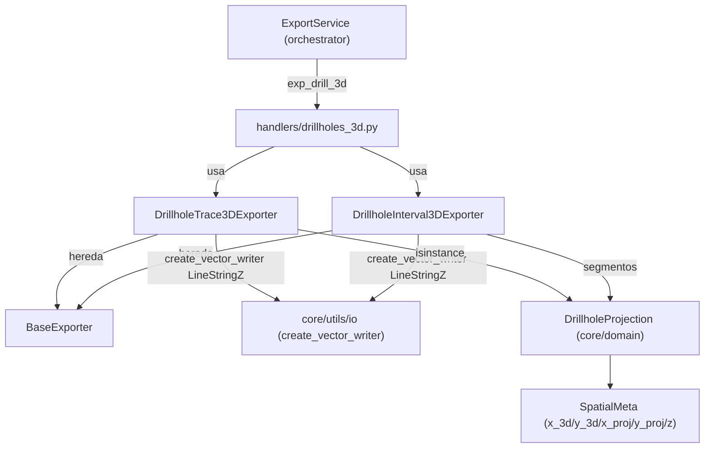

---
tags:
  - secinterp
  - code-walkthrough
  - exporters
  - drillholes
  - 3d
aliases:
  - drillhole_3d_exporter.py
  - DrillholeTrace3DExporter
  - DrillholeInterval3DExporter
cssclass: secinterp-note
---

# `exporters/drillhole_3d_exporter.py`

> [!abstract] Resumen en una línea
> Exporta sondajes a 3D (trazas `LineStringZ` e intervalos `LineStringZ`) aceptando `DrillholeProjection`, tuplas nuevas de 3 elementos y tuplas legacy de 5 elementos, con conmutador `use_projected`.

**Ruta**: `exporters/drillhole_3d_exporter.py` (243 líneas)
**Clases principales**: `DrillholeTrace3DExporter`, `DrillholeInterval3DExporter`
**Capa**: Exporters (GUI · QGIS-dependiente, hereda de `BaseExporter`)
**Tags**: #secinterp #exporters #drillholes #3d

---

## 🎯 ¿Por qué existe este archivo?

El `drillhole_service` del core ya proyectó los sondajes sobre el plano de sección
(ver [[drillhole_service]]). Falta el último paso: **persistir esa proyección en 3D**
para verla en la vista 3D de QGIS o en un SIG externo:

| Problema | Solución |
|----------|----------|
| La traza 2D del perfil pierde la coordenada real del collar | `DrillholeTrace3DExporter` escribe `LineStringZ` con `(x, y, z)` reales |
| Los intervalos litológicos deben conservar `from/to/unit` en 3D | `DrillholeInterval3DExporter` escribe un `LineStringZ` por segmento con 4 campos |
| Conviven tres formas de `drillhole_data` (objetos, tuplas nuevas, tuplas legacy) | `_extract_hole_spatial_data` / `_process_hole_intervals` aceptan las tres sin romper tests viejos |
| A veces se quiere la traza desplazada al plano de sección | Flag `use_projected` que conmuta entre `points_3d` y `points_3d_projected` |

> [!important] Nota arquitectónica — Adapter de escritura, no renderer
> Este módulo **no** implementa `IRenderer3D` (`render_3d`/`clear`, ver [[core_interfaces]]):
> no dibuja una escena, **escribe ficheros** con geometría Z. El render 3D en vivo lo hace
> la GUI; aquí solo se persiste el resultado para el path `exp_drill_3d` del [[orchestrator]].

---

## 🧬 Diagrama de relaciones



> [!tip] Cómo leer
> Ambos exporters heredan de `BaseExporter` (ver [[base_exporter]]) y delegan la creación
> del writer en `sec_interp.core.utils.io` (ver [[io]]). El handler `drillholes_3d`
> (ver [[drillholes_3d]]) los instancia desde el [[orchestrator]].

---

## 📦 Imports — lectura arquitectónica

```python
# exporters/drillhole_3d_exporter.py
from __future__ import annotations

from typing import Any

from qgis.core import (
    QgsFeature,
    QgsField,
    QgsFields,
    QgsGeometry,
    QgsLineString,
    QgsPoint,
    QgsWkbTypes,
)
from qgis.PyQt.QtCore import QMetaType

import sec_interp.core.utils.io as scu_io
from sec_interp.core.domain import DrillholeProjection
from sec_interp.logger_config import get_logger

from .base_exporter import BaseExporter
```

| # | Observación |
|---|-------------|
| ① | `QgsLineString` + `QgsPoint(x, y, z)` + `QgsWkbTypes.Type.LineStringZ` → geometría **Z real**, no 2.5D simulada. |
| ② | `QMetaType` (vía `qgis.PyQt`) para tipar campos: `QString` para `hole_id`, `Double` para profundidades. |
| ③ | `DrillholeProjection` del dominio como **primera opción** de `isinstance`; las tuplas son compatibilidad. |
| ④ | `scu_io.create_vector_writer` centraliza SHP/GPKG/DXF (mismo helper que el resto de exporters). |
| ⑤ | `get_logger(__name__)` en cada exporter: errores con `logger.exception` (con traceback). |

---

## 🏗️ Inventario de estructura

**Clases:** 2 (`DrillholeTrace3DExporter`, `DrillholeInterval3DExporter`).

**Constantes de validación:**

| Constante | Valor | Uso |
|-----------|------:|-----|
| `NEW_DATA_LENGTH` | 3 | Tupla nueva `(hole_id, spatial_points, segments)` |
| `LEGACY_DATA_LENGTH` | 5 | Tupla legacy `(hole_id, traces, traces_3d, traces_3d_proj, segments)` |
| `MIN_POINTS_FOR_INTERVAL` | 2 | Mínimo de puntos para construir un `QgsLineString` |

**Métodos de `DrillholeTrace3DExporter`:** `get_supported_extensions`, `export`,
`_process_hole_trace` (pipeline extraer → convertir → validar → escribir),
`_extract_hole_spatial_data` (objeto / tupla-3 / tupla-5), `_get_trace_points`
(conmutador `use_projected`), `_prepare_fields` (`hole_id`).

**Métodos de `DrillholeInterval3DExporter`:** `get_supported_extensions`, `export`,
`_process_hole_intervals` (segmentos = último elemento), `_write_segment` (un feature
por intervalo), `_prepare_fields` (`hole_id`, `from_depth`, `to_depth`, `unit`).

---

## 📁 Archivos del paquete `exporters/`

| Archivo | Rol respecto a esta nota |
|---|---|
| `drillhole_3d_exporter.py` | Esta nota: trazas e intervalos 3D (`LineStringZ`) |
| [[drillhole_exporters]] | Gemelo 2D: `DrillholeTraceVectorExporter` / `DrillholeIntervalVectorExporter` en `(dist, elev)` |
| [[base_exporter]] | `BaseExporter`: contrato `export()` + `get_supported_extensions()` |
| [[interpretation_3d_exporter]] | El otro writer 3D: polígonos `PolygonZ` + estilo QML |
| [[exporters]] | Fachada del paquete + `get_exporter()` por extensión |

---

## 📖 Recorrido método por método

### `DrillholeTrace3DExporter.export`

```python
def export(self, output_path: Any, data: dict[str, Any], layer_name: str | None = None) -> bool:
    drillhole_data = data.get("drillhole_data")
    crs = data.get("crs")
    use_projected = data.get("use_projected", False)
    if not drillhole_data or not crs:
        return False

    try:
        fields = self._prepare_fields()
        writer = scu_io.create_vector_writer(
            str(output_path),
            crs,
            fields,
            QgsWkbTypes.Type.LineStringZ,
            layer_name=layer_name,
        )

        for hole_data in drillhole_data:
            self._process_hole_trace(writer, fields, hole_data, use_projected)

        del writer
    except Exception as e:
        logger.exception(f"Error exporting 3D traces to {output_path}: {e}")
        return False
    return True
```

| Paso | Comportamiento |
|------|----------------|
| 1. Guardas | Sin `drillhole_data` o sin `crs` retorna `False` (no escribe fichero vacío) |
| 2. Writer | Tipo fijo `LineStringZ`; `layer_name` permite reutilizarlo dentro de un GPKG |
| 3. Bucle | Un feature por sondaje vía `_process_hole_trace` (los agujeros inválidos se saltan en silencio) |
| 4. Cierre | `del writer` vuelca y cierra el fichero; cualquier excepción → `False` con traceback |

El tipo es explícito (`LineStringZ`) con puntos `(x, y, z)` geográficos.

### `_process_hole_trace` — descomposición en 4 pasos

```python
def _process_hole_trace(
    self, writer: Any, fields: QgsFields, hole_data: Any, use_projected: bool
) -> None:
    extracted = self._extract_hole_spatial_data(hole_data)
    if not extracted:
        return

    hole_id, spatial_points = extracted
    points = self._get_trace_points(spatial_points, use_projected)

    if not points or len(points) < MIN_POINTS_FOR_INTERVAL:
        return

    geom = QgsGeometry(QgsLineString(points))
    if geom and not geom.isNull():
        feat = QgsFeature(fields)
        feat.setGeometry(geom)
        feat.setAttribute("hole_id", str(hole_id))
        writer.addFeature(feat)
```

La cadena es **extraer → convertir → validar → escribir**: cada etapa puede abortar
con `return` sin ensuciar el writer. Un `QgsLineString` necesita al menos 2 puntos;
con 0–1 puntos el sondaje se omite (típico en collares sin desviación calculada).

### `_extract_hole_spatial_data` — triple formato de entrada

```python
def _extract_hole_spatial_data(self, hole_data: Any) -> tuple[Any, Any] | None:
    if isinstance(hole_data, DrillholeProjection):
        return hole_data.hole_id, hole_data.points_3d

    if isinstance(hole_data, list | tuple):
        hole_id = hole_data[0]
        if len(hole_data) == NEW_DATA_LENGTH:
            # New format with SpatialMeta objects
            return hole_id, hole_data[1]
        if len(hole_data) == LEGACY_DATA_LENGTH:
            # Legacy/Integration Test format
            return hole_id, hole_data
        logger.warning(
            f"Unexpected hole data format (length {len(hole_data)}) for hole {hole_id}"
        )
    return None
```

| Entrada | Qué devuelve |
|---------|--------------|
| `DrillholeProjection` | `(hole_id, points_3d)` — lista de `SpatialMeta` |
| Tupla de 3 | `(hole_id, hole_data[1])` — puntos `SpatialMeta` en posición 1 |
| Tupla de 5 (legacy) | `(hole_id, hole_data)` — la tupla completa; `_get_trace_points` la desempaqueta |
| Otra longitud | `warning` con el `hole_id` y `None` (el llamante lo salta) |

En formato legacy los puntos reales y los proyectados viven en las posiciones 2 y 3,
así que `_get_trace_points` necesita la tupla entera para elegir según `use_projected`.

### `_get_trace_points` — conmutador `use_projected`

```python
def _get_trace_points(self, spatial_data: Any, use_projected: bool) -> list[QgsPoint]:
    if isinstance(spatial_data, list | tuple) and len(spatial_data) == LEGACY_DATA_LENGTH:
        # Legacy/Integration Test format
        _, _, traces_3d, traces_3d_proj, _ = spatial_data
        points_source = traces_3d_proj if use_projected else traces_3d
        return [QgsPoint(x, y, z) for x, y, z in points_source]

    # Standard SpatialMeta objects
    if use_projected:
        return [
            QgsPoint(p.x_proj or 0.0, p.y_proj or 0.0, p.z)
            for p in spatial_data
            if p.x_proj is not None
        ]
    return [
        QgsPoint(p.x_3d or 0.0, p.y_3d or 0.0, p.z) for p in spatial_data if p.x_3d is not None
    ]
```

Dos ramas simétricas: legacy desempaqueta `(x, y, z)` crudos; estándar lee `SpatialMeta`
(`x_3d`/`y_3d` reales frente a `x_proj`/`y_proj` sobre el plano). Los puntos sin
coordenada (`None`) se filtran antes de construir el `QgsPoint`.

### `_prepare_fields` (trazas): un solo campo `hole_id` (`QString`); la traza 3D es
geometría pura y la litología vive en los intervalos (`_prepare_fields` de intervalos:
`hole_id`, `from_depth`/`to_depth` como `Double`, `unit` como `QString`).

### `DrillholeInterval3DExporter.export`

```python
def export(self, output_path: Any, data: dict[str, Any], layer_name: str | None = None) -> bool:
    drillhole_data = data.get("drillhole_data")
    crs = data.get("crs")
    use_projected = data.get("use_projected", False)
    if not drillhole_data or not crs:
        return False

    try:
        fields = self._prepare_fields()
        writer = scu_io.create_vector_writer(
            str(output_path),
            crs,
            fields,
            QgsWkbTypes.Type.LineStringZ,
            layer_name=layer_name,
        )

        for hole_data in drillhole_data:
            self._process_hole_intervals(writer, fields, hole_data, use_projected)

        del writer
    except Exception as e:
        logger.exception(f"Error exporting 3D intervals to {output_path}: {e}")
        return False
    return True
```

Estructura idéntica a la de trazas: mismas guardas, mismo `LineStringZ`, distinto
procesador por agujero (`_process_hole_intervals`, con segmentos en el último elemento
de la tupla) y 4 campos en vez de 1.

### `_process_hole_intervals` — los segmentos son el último elemento

```python
if isinstance(hole_data, DrillholeProjection):
    hole_id = hole_data.hole_id
    segments = hole_data.segments
elif isinstance(hole_data, list | tuple):
    # segments are always the last element in both 3 and 5 element formats
    hole_id = hole_data[0]
    segments = hole_data[-1]
else:
    return
```

`hole_data[-1]` normaliza ambos formatos de tupla de un plumazo; si `segments` no es
lista, el agujero se salta. Cada segmento se escribe vía `_write_segment`.

### `_write_segment` — un feature por intervalo

```python
def _write_segment(
    self,
    writer: Any,
    fields: QgsFields,
    hole_id: Any,
    segment: Any,
    use_projected: bool,
) -> None:
    points_source = segment.points_3d_projected if use_projected else segment.points_3d
    if not points_source or len(points_source) < MIN_POINTS_FOR_INTERVAL:
        return

    points = [QgsPoint(x, y, z) for x, y, z in points_source]
    geom = QgsGeometry(QgsLineString(points))

    if geom and not geom.isNull():
        feat = QgsFeature(fields)
        feat.setGeometry(geom)
        feat.setAttribute("hole_id", str(hole_id))
        attrs = segment.attributes
        feat.setAttribute("from_depth", attrs.get("from", 0.0))
        feat.setAttribute("to_depth", attrs.get("to", 0.0))
        feat.setAttribute("unit", segment.unit_name)
        writer.addFeature(feat)
```

El segmento aporta `points_3d` / `points_3d_projected` (listas de `Point3D`), sus
`attributes` (`from`/`to`, con default `0.0`) y `unit_name`; con menos de 2 puntos o
geometría nula no se escribe.

### `_prepare_fields` (intervalos): `hole_id` (`QString`), `from_depth`/`to_depth`
(`Double`), `unit` (`QString`): 4 campos que replican el gemelo 2D para que ambos SHP
sean intercambiables por atributo.

---

## 🔄 Flujo de datos

| Fase | Entrada | Transformación | Salida |
|------|---------|----------------|--------|
| Guardas | `data` (`drillhole_data`, `crs`, `use_projected`) | `not drillhole_data or not crs` → `False` | Nada (sin fichero parcial) |
| Writer | `output_path`, `crs`, fields | `create_vector_writer(..., LineStringZ)` | Writer SHP/GPKG/DXF |
| Trazas | `DrillholeProjection` / tupla 3 / tupla 5 | extraer → puntos `QgsPoint` → `QgsLineString` | 1 feature `hole_id` por sondaje |
| Intervalos | `segments` (último elemento) | 1 `QgsLineString` por segmento + `from/to/unit` | N features por sondaje |
| Cierre | writer con features | `del writer` | Fichero cerrado y visible |

---

## 🏛️ Patrones de diseño presentes

| Patrón | Dónde | Propósito |
|--------|-------|-----------|
| **Template Method** | `BaseExporter.export` → implementaciones | Contrato común, escritura específica |
| **Adapter** | `_extract_hole_spatial_data` | Normaliza 3 formatos a `(hole_id, puntos)` |
| **Strategy** | `use_projected` | Conmuta fuente real vs proyectada sin duplicar clases |
| **Guard clauses** | `export`, `_process_*`, `_write_segment` | Salidas tempranas en vez de `if` anidados |
| **Boolean status** | `-> bool` | El handler acumula mensajes sin excepciones de control |

---

## 🧾 Resumen de la API

| Símbolo | Firma / Hereda | Uso típico |
|---------|----------------|------------|
| `DrillholeTrace3DExporter` | `(BaseExporter)` | 1 `LineStringZ` por sondaje, campo `hole_id` |
| `DrillholeTrace3DExporter.export` | `(output_path, data, layer_name=None) -> bool` | `data = {"drillhole_data": ..., "crs": ..., "use_projected": ...}` |
| `_process_hole_trace` | `(writer, fields, hole_data, use_projected) -> None` | Pipeline extraer → convertir → validar → escribir |
| `_extract_hole_spatial_data` | `(hole_data) -> tuple \| None` | Acepta objeto, tupla-3 o tupla-5 |
| `_get_trace_points` | `(spatial_data, use_projected) -> list[QgsPoint]` | `SpatialMeta` o `(x, y, z)` → `QgsPoint` |
| `DrillholeInterval3DExporter` | `(BaseExporter)` | N `LineStringZ` por sondaje + `from_depth/to_depth/unit` |
| `_process_hole_intervals` / `_write_segment` | `(...) -> None` | Segmentos (último elemento) → un feature por intervalo |

---

## 🛡️ Manejo de errores

| Situación | Comportamiento |
|-----------|----------------|
| `drillhole_data` vacío o `crs` ausente | `return False` (no se crea el fichero) |
| Formato de tupla inesperado | `logger.warning` con `hole_id`; ese sondaje se omite |
| Traza con < 2 puntos / geometría nula | `return` silencioso (collar sin trayectoria) |
| `segments` ausente o no-lista | `return` silencioso |
| Excepción de QGIS/IO en `export` | `logger.exception` con traceback → `False` |
| `attrs` sin `from`/`to` | Defaults `0.0` (no `KeyError`) |

> [!note] Sin `ExportError` aquí
> A diferencia de [[interpretation_3d_exporter]] (que sí lanza `ExportError`), este módulo
> comunica fallos con `bool`. El handler `drillholes_3d` decide si ese `False` aborta
> la exportación o solo añade un aviso (ver [[orchestrator]] y [[exceptions]]).

---

## 🧪 Tests asociados

**Unit (mock-first)** en `tests/exporters/test_drillhole_3d_exporter.py`:

- `test_trace_exporter_real` — trazas con coordenadas reales (`use_projected=False`).
- `test_trace_exporter_projected` — trazas con `use_projected=True`.
- `test_interval_exporter_real` — intervalos con coordenadas reales.
- `test_interval_exporter_projected` — intervalos proyectados.

**Objetos de dominio** en `tests/exporters/test_drillhole_export_objects.py`:

- `test_export_3d_traces_with_objects` — trazas a partir de `DrillholeProjection`.
- `test_export_3d_intervals_with_objects` — intervalos a partir de `DrillholeProjection`.
- `test_export_traces_success` / `test_export_intervals_success` — gemelos 2D.

**Integración** (proyección 3D real):

- `tests/integration/test_export_workflow.py::test_3d_projection_logic` y `test_3d_projection_north` — lógica de proyección al plano de sección.
- `tests/integration/test_3d_projections.py` — proyecciones 3D de punta a punta.

> [!tip] Patrón `mock_writer_factory`
> Los tests unitarios inyectan un writer mockeado vía fixture (`mock_writer_factory`)
> parcheando `scu_io.create_vector_writer`: verifican features y atributos sin tocar disco.

---

## 👀 Observaciones y notas

> [!success] Fortalezas
> - Triple formato de entrada sin romper compatibilidad (objeto + tupla-3 + legacy-5).
> - Pipeline por sondaje con salidas tempranas: un agujero malo no aborta el fichero.
> - `use_projected` como flag de datos, no como clase distinta: cero duplicación.
> - Esquema de intervalos 3D idéntico al 2D: ambos SHP se pueden unir por atributo.

> [!warning] Puntos de atención
> - No lanza `ExportError`: un `False` silencioso puede pasar desapercibido si el handler no lo reporta.
> - Sin simplificación de vértices: trazas desviadas muy densas se escriben punto a punto.
> - El writer se cierra con `del writer` (idiomático en PyQGIS pero frágil si una excepción ocurre antes).

> [!question] Preguntas abiertas
> - ¿Unificar el reporte de errores a `ExportError` como en `Interpretation3DExporter`?
> - ¿Tipar `data` con un `TypedDict` en vez de `dict[str, Any]`?

---

## 🔗 Notas relacionadas

- [[Index]] — índice de la bóveda
- [[exporters]] — fachada del paquete `exporters/`
- [[base_exporter]] — `BaseExporter`, clase base de ambos exporters
- [[drillhole_exporters]] — gemelos 2D (`(dist, elev)`, `fromPolylineXY`)
- [[interpretation_3d_exporter]] — el otro writer 3D (`PolygonZ` + QML)
- [[drillholes_3d]] — handler `exp_drill_3d` que los invoca
- [[orchestrator]] — `ExportService`, dispatch de opciones de exportación
- [[drillhole_service]] — produce los `DrillholeProjection` que aquí se escriben
- [[dtos]] — `DrillholeProjection`, `SpatialMeta` y demás DTOs del dominio

---

*Nota de la bóveda SecInterp Code Walkthrough v2 — v3.9.1*
