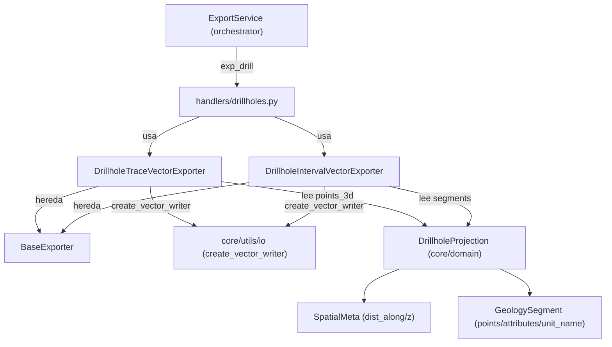

---
tags:
  - secinterp
  - code-walkthrough
  - exporters
  - drillholes
aliases:
  - drillhole_exporters.py
  - DrillholeTraceVectorExporter
  - DrillholeIntervalVectorExporter
cssclass: secinterp-note
---

# `exporters/drillhole_exporters.py`

> [!abstract] Resumen en una línea
> Exporta sondajes en coordenadas 2D del perfil (`distancia, elevación`): trazas como polilíneas con `hole_id` e intervalos como polilíneas con `from_depth/to_depth/unit`.

**Ruta**: `exporters/drillhole_exporters.py` (239 líneas)
**Clases principales**: `DrillholeTraceVectorExporter`, `DrillholeIntervalVectorExporter`
**Capa**: Exporters (GUI · QGIS-dependiente, hereda de `BaseExporter`)
**Tags**: #secinterp #exporters #drillholes

---

## 🎯 ¿Por qué existe este archivo?

La sección geológica vive en un sistema 2D propio: eje X = distancia a lo largo de la
línea, eje Y = elevación. Los sondajes proyectados (`DrillholeProjection`, ver
[[drillhole_service]]) deben dibujarse en ese mismo plano para que coincidan con la
topografía, la geología y las estructuras:

| Problema | Solución |
|----------|----------|
| La traza del sondaje debe superponerse al perfil topográfico | `DrillholeTraceVectorExporter`: polilínea `(dist, elev)` con `hole_id` |
| Cada tramo litológico necesita sus atributos de profundidad | `DrillholeIntervalVectorExporter`: un feature por segmento con `from_depth`, `to_depth`, `unit` |
| Conviven objetos de dominio y tuplas legacy de 5 elementos | `_write_traces` / `_write_intervals` aceptan `DrillholeProjection` y tuplas (3 o 5) |
| Los puntos pueden venir como `SpatialMeta` o como pares `(d, e)` | `_create_feature` detecta `dist_along`/`z` frente a tupla por `hasattr` |

> [!important] Nota arquitectónica — gemelo 2D del exporter 3D
> Este módulo es el espejo 2D de [[drillhole_3d_exporter]]: misma entrada
> (`drillhole_data` + `crs`), mismo esquema de campos, pero geometría plana
> (`fromPolylineXY`) en vez de `LineStringZ`. El [[orchestrator]] usa este path para
> `exp_drill` y el 3D para `exp_drill_3d`.

---

## 🧬 Diagrama de relaciones



> [!tip] Cómo leer
> A diferencia del exporter 3D, aquí **no** se fija `geometry_type`: el writer por defecto
> escribe polilíneas 2D. Los puntos `SpatialMeta` aportan `dist_along`/`z` (coordenadas
> de sección); los segmentos aportan `points` (`(d, e)`), `attributes` y `unit_name`.

---

## 📦 Imports — lectura arquitectónica

```python
# exporters/drillhole_exporters.py
from __future__ import annotations

from typing import Any

from qgis.core import (
    QgsFeature,
    QgsField,
    QgsFields,
    QgsGeometry,
    QgsPointXY,
)
from qgis.PyQt.QtCore import QMetaType

import sec_interp.core.utils.io as scu_io
from sec_interp.core.domain import DrillholeProjection
from sec_interp.logger_config import get_logger

from .base_exporter import BaseExporter
```

| # | Observación |
|---|-------------|
| ① | `QgsPointXY` + `QgsGeometry.fromPolylineXY` → geometría **plana** en `(dist, elev)`; sin `QgsPoint` ni `QgsLineString` Z. |
| ② | Sin `QgsWkbTypes` en imports: el writer infiere polilínea 2D (contraste directo con el módulo 3D). |
| ③ | `DrillholeProjection` es el tipo preferente; las tuplas se desempaquetan por longitud (`NEW_DATA_LENGTH` / `LEGACY_DATA_LENGTH`). |
| ④ | Constantes con nombre (`MIN_REQUIRED_TRACE_POINTS`, `COORD_PAIR_LENGTH`) en vez de literales mágicos. |
| ⑤ | `logger.exception` sin interpolación del error en el mensaje (el traceback ya lo incluye). |

---

## 🏗️ Inventario de estructura

**Clases:** 2 (`DrillholeTraceVectorExporter`, `DrillholeIntervalVectorExporter`).

**Constantes de validación:**

| Constante | Valor | Uso |
|-----------|------:|-----|
| `MIN_REQUIRED_TRACE_POINTS` | 2 | Trazas con menos puntos se omiten |
| `LEGACY_DATA_LENGTH` | 5 | Tupla legacy `(hole_id, traces, traces_3d, traces_3d_proj, segments)` |
| `NEW_DATA_LENGTH` | 3 | Tupla nueva `(hole_id, traces, segments)` |
| `MIN_POINTS_FOR_INTERVAL` | 2 | Segmentos con menos puntos → `None` |
| `COORD_PAIR_LENGTH` | 2 | Pares `(d, e)` mínimos en `_create_feature` de trazas |

**Métodos de `DrillholeTraceVectorExporter`:** `get_supported_extensions`, `export`
(`try/except/else`), `_write_traces` (normaliza objeto/tupla-3/tupla-5),
`_create_feature` (`SpatialMeta` por `hasattr` o pares → polilínea o `None`),
`_prepare_fields` (`hole_id`).

**Métodos de `DrillholeIntervalVectorExporter`:** `get_supported_extensions`, `export`,
`_write_intervals` (segmentos = último elemento), `_create_feature` (pares `(d, e)`
estrictos + `from/to/unit`), `_prepare_fields` (4 campos).

---

## 📁 Archivos del paquete `exporters/`

| Archivo | Rol respecto a esta nota |
|---|---|
| `drillhole_exporters.py` | Esta nota: trazas e intervalos 2D del perfil |
| [[drillhole_3d_exporter]] | Gemelo 3D: mismos datos en `LineStringZ` + flag `use_projected` |
| [[base_exporter]] | `BaseExporter`: contrato `export()` + `get_supported_extensions()` |
| [[profile_exporters]] | Trazas hermanas: topografía, geología, estructuras y ejes del perfil |
| [[exporters]] | Fachada del paquete + `get_exporter()` por extensión |

---

## 📖 Recorrido método por método

### `DrillholeTraceVectorExporter.export`

```python
def export(self, output_path: Any, data: dict[str, Any], layer_name: str | None = None) -> bool:
    drillhole_data = data.get("drillhole_data")
    crs = data.get("crs")
    if not drillhole_data or not crs:
        return False

    try:
        fields = self._prepare_fields()
        writer = scu_io.create_vector_writer(
            str(output_path), crs, fields, layer_name=layer_name
        )

        self._write_traces(writer, drillhole_data, fields)
        del writer
    except Exception:
        logger.exception(f"Failed to export drillhole traces to {output_path}")
        return False
    else:
        return True
```

Estructura `try/except/else`: el `True` vive en el `else`, así que solo se retorna
éxito si **todo** el bloque `try` terminó (incluido `del writer`). Sin `data` o sin
`crs` → `False` inmediato, sin crear fichero.

### `_write_traces` — normalización objeto/tupla

```python
def _write_traces(self, writer: Any, drillhole_data: list, fields: QgsFields) -> None:
    for item in drillhole_data:
        if isinstance(item, DrillholeProjection):
            hole_id = item.hole_id
            traces = item.points_3d
        elif isinstance(item, list | tuple):
            # Handle variable tuple length (legacy 5 vs new 3)
            if len(item) == NEW_DATA_LENGTH:
                hole_id, traces, _ = item
            elif len(item) >= LEGACY_DATA_LENGTH:
                hole_id, traces, _traces_3d, _traces_3d_proj, _ = item
            else:
                continue
        else:
            continue

        if not traces or len(traces) < MIN_REQUIRED_TRACE_POINTS:
            continue

        feat = self._create_feature(hole_id, traces, fields)
        if feat:
            writer.addFeature(feat)
```

| Entrada | Desempaquetado |
|---------|----------------|
| `DrillholeProjection` | `hole_id`, `points_3d` (segundo elemento ignorado en tuplas: `_`) |
| Tupla de 3 | `(hole_id, traces, _)` |
| Tupla de ≥ 5 | `(hole_id, traces, ...)` — se usan los puntos **2D de sección**, no los 3D |
| Otra cosa | `continue` (se salta sin ruido) |

En 2D siempre se extrae `traces` (posición 1); las coordenadas 3D se ignoran aquí.

### `_create_feature` (trazas) — `SpatialMeta` o pares

```python
def _create_feature(self, hole_id: str, traces: list, fields: QgsFields) -> QgsFeature | None:
    points = []
    for p in traces:
        # Handle SpatialMeta object or tuple/list
        if hasattr(p, "dist_along") and hasattr(p, "z"):
            points.append(QgsPointXY(p.dist_along, p.z))
        elif isinstance(p, list | tuple) and len(p) >= COORD_PAIR_LENGTH:
            points.append(QgsPointXY(p[0], p[1]))

    if not points:
        return None

    geom = QgsGeometry.fromPolylineXY(points)

    if not geom or geom.isNull():
        return None

    feat = QgsFeature(fields)
    feat.setGeometry(geom)
    feat.setAttribute("hole_id", hole_id)
    return feat
```

Duck typing con `hasattr` en vez de `isinstance(SpatialMeta)`: acepta cualquier objeto
con `dist_along`/`z` (incluidos mocks de tests). Los puntos que no cumplen ninguna
rama se **descartan**; si no queda ninguno, o la geometría es nula, retorna `None`
y `_write_traces` no escribe nada para ese sondaje.

### `_prepare_fields` (trazas)

```python
def _prepare_fields(self) -> QgsFields:
    fields = QgsFields()
    fields.append(QgsField("hole_id", QMetaType.Type.QString))
    return fields
```

Un único campo `hole_id` (`QString`): la traza es contexto geométrico, los atributos
viven en los intervalos.

### `DrillholeIntervalVectorExporter.export`

```python
def export(self, output_path: Any, data: dict[str, Any], layer_name: str | None = None) -> bool:
    drillhole_data = data.get("drillhole_data")
    crs = data.get("crs")
    if not drillhole_data or not crs:
        return False

    try:
        fields = self._prepare_fields()
        writer = scu_io.create_vector_writer(
            str(output_path), crs, fields, layer_name=layer_name
        )

        self._write_intervals(writer, drillhole_data, fields)
        del writer
    except Exception:
        logger.exception(f"Failed to export drillhole intervals to {output_path}")
        return False
    else:
        return True
```

Idéntico esqueleto al de trazas; cambia el escritor delegado (`_write_intervals`) y
el esquema de campos (4 en vez de 1).

### `_write_intervals` — segmentos = último elemento

```python
def _write_intervals(self, writer: Any, drillhole_data: list, fields: QgsFields) -> None:
    for item in drillhole_data:
        if isinstance(item, DrillholeProjection):
            hole_id = item.hole_id
            segments = item.segments
        elif isinstance(item, list | tuple):
            # Handle variable tuple length (legacy 5 vs new 3)
            # Segments are always the last element
            if len(item) == NEW_DATA_LENGTH or len(item) >= LEGACY_DATA_LENGTH:
                hole_id = item[0]
                segments = item[-1]
            else:
                continue
        else:
            continue
        if not segments:
            continue

        for segment in segments:
            feat = self._create_feature(hole_id, segment, fields)
            if feat:
                writer.addFeature(feat)
```

`item[-1]` unifica tupla-3 y legacy-5: los segmentos siempre cierran la tupla. Un
sondaje sin segmentos (`None` o lista vacía) se salta con `continue` antes del bucle
interior.

### `_create_feature` (intervalos) — puntos `(d, e)` estrictos

```python
def _create_feature(self, hole_id: str, segment: Any, fields: QgsFields) -> QgsFeature | None:
    if not segment.points or len(segment.points) < MIN_POINTS_FOR_INTERVAL:
        return None

    points = [QgsPointXY(d, e) for d, e in segment.points]
    geom = QgsGeometry.fromPolylineXY(points)

    if not geom or geom.isNull():
        return None

    feat = QgsFeature(fields)
    feat.setGeometry(geom)
    feat.setAttribute("hole_id", hole_id)

    attrs = segment.attributes
    feat.setAttribute("from_depth", attrs.get("from", 0.0))
    feat.setAttribute("to_depth", attrs.get("to", 0.0))
    feat.setAttribute("unit", segment.unit_name)

    return feat
```

Aquí no hay duck typing: `segment.points` son pares `(d, e)` de sección y se
desempaquetan de forma estricta. Los atributos `from`/`to` usan default `0.0` y
`unit_name` viaja tal cual (puede ser `None` si el segmento no está clasificado).

### `_prepare_fields` (intervalos)

```python
def _prepare_fields(self) -> QgsFields:
    fields = QgsFields()
    fields.append(QgsField("hole_id", QMetaType.Type.QString))
    fields.append(QgsField("from_depth", QMetaType.Type.Double))
    fields.append(QgsField("to_depth", QMetaType.Type.Double))
    fields.append(QgsField("unit", QMetaType.Type.QString))
    return fields
```

Esquema fijo de 4 campos, idéntico al del exporter 3D: ambos SHP son unibles por
atributo (`hole_id`, `from_depth`, `to_depth`, `unit`).

Ambas clases devuelven `[".shp", ".gpkg", ".dxf"]` en `get_supported_extensions`;
`scu_io.create_vector_writer` resuelve el driver (ver [[io]] y [[exporters]]).

---

## 🔄 Flujo de datos

| Fase | Entrada | Transformación | Salida |
|------|---------|----------------|--------|
| Guardas | `data` (`drillhole_data`, `crs`) | vacíos → `False` | Nada |
| Writer | `output_path`, `crs`, fields | `create_vector_writer` (polilínea 2D) | Writer SHP/GPKG/DXF |
| Trazas | objeto / tupla-3 / tupla-5 | `traces` → `QgsPointXY(dist_along, z)` → `fromPolylineXY` | 1 feature `hole_id` por sondaje |
| Intervalos | `segments` (último elemento) | `(d, e)` → polilínea + `from/to/unit` | N features por sondaje |
| Cierre | writer con features | `del writer` en `try` | `True`; excepción → `False` |

---

## 🏛️ Patrones de diseño presentes

| Patrón | Dónde | Propósito |
|--------|-------|-----------|
| **Template Method** | `BaseExporter.export` → ambas clases | Mismo esqueleto, distinta geometría |
| **Adapter** | `_write_traces` / `_write_intervals` | Normalizan objeto y tuplas a `(hole_id, datos)` |
| **Duck typing** | `hasattr(p, "dist_along")` | Acepta `SpatialMeta`, mocks y tuplas sin importar el tipo |
| **Null Object (skip)** | `return None` / `continue` | Datos degenerados se omiten sin abortar el fichero |
| **Try/except/else** | `export` | `True` solo si el `try` completo terminó |

---

## 🧾 Resumen de la API

| Símbolo | Firma / Hereda | Uso típico |
|---------|----------------|------------|
| `DrillholeTraceVectorExporter` | `(BaseExporter)` | Trazas 2D `(dist, elev)`, campo `hole_id` |
| `DrillholeTraceVectorExporter.export` | `(output_path, data, layer_name=None) -> bool` | `data = {"drillhole_data": ..., "crs": ...}` |
| `_write_traces` | `(writer, drillhole_data, fields) -> None` | Normaliza formatos y escribe trazas |
| `_create_feature` (trazas) | `(hole_id, traces, fields) -> QgsFeature \| None` | `SpatialMeta` o pares → polilínea |
| `DrillholeIntervalVectorExporter` | `(BaseExporter)` | Intervalos 2D + `from_depth/to_depth/unit` |
| `_write_intervals` | `(writer, drillhole_data, fields) -> None` | Itera segmentos (último elemento) |
| `_create_feature` (intervalos) | `(hole_id, segment, fields) -> QgsFeature \| None` | `(d, e)` estrictos → polilínea |

---

## 🛡️ Manejo de errores

| Situación | Comportamiento |
|-----------|----------------|
| `drillhole_data` vacío o `crs` ausente | `return False` |
| Tupla de longitud inesperada / tipo desconocido | `continue` silencioso |
| Traza con < 2 puntos / sin puntos convertibles | Se omite (`None` de `_create_feature`) |
| Geometría nula | Se omite |
| `segments` vacío / `None` | `continue` antes del bucle interior |
| `attrs` sin `from`/`to` | Defaults `0.0` |
| Excepción en `export` | `logger.exception` → `False` (sin `ExportError`) |

> [!note] `try/except/else` en vez de `return True` final
> El `else` garantiza que `True` solo se retorna si `del writer` (el volcado real)
> también tuvo éxito. Un `return True` al final del `try` sería equivalente aquí,
> pero el `else` documenta la intención.

---

## 🧪 Tests asociados

**Unit (mock-first)** en `tests/exporters/test_drillhole_export_objects.py`:

- `test_export_traces_success` — trazas 2D desde objetos de dominio.
- `test_export_intervals_success` — intervalos 2D desde objetos de dominio.
- `test_export_3d_traces_with_objects` / `test_export_3d_intervals_with_objects` — gemelos 3D.

**Genéricos de exporter** en `tests/exporters/test_exporters.py`:

- `test_export_valid_data`, `test_export_empty_data` — contrato `export() -> bool`.
- `test_export_missing_headers` / `test_export_missing_rows` — guardas de datos.
- `test_get_setting_with_default` / `test_get_setting_no_default` — `BaseExporter.get_setting`.
- `test_get_supported_extensions` — extensiones soportadas.

**Integración** en `tests/integration/test_export_service_e2e.py`:

- `test_export_geology_creates_csv_and_shp` — patrón e2e aplicable a writers vectoriales.
- `test_export_nothing_when_all_options_disabled` — guardia de opciones del [[orchestrator]].

> [!tip] Dónde añadir tests específicos
> No hay `test_drillhole_exporters.py` dedicado a las clases 2D: los casos viven en
> `test_drillhole_export_objects.py` (objetos) con writer mockeado. Un test de tupla
> legacy-5 para `_write_traces` sería una adición natural.

---

## 👀 Observaciones y notas

> [!success] Fortalezas
> - Simetría total trazas/intervalos y 2D/3D: aprender uno es aprender los cuatro.
> - Duck typing en trazas: tolera `SpatialMeta`, tuplas y mocks sin acoplarse al tipo.
> - `item[-1]` para segmentos: normalización elegante de ambos formatos de tupla.
> - `try/except/else`: el `True` certifica el volcado, no solo la ausencia de error.

> [!warning] Puntos de atención
> - Asimetría: trazas aceptan `SpatialMeta` por `hasattr`, intervalos exigen pares `(d, e)` estrictos.
> - Sin `ExportError`: el fallo se resume en `False` y el detalle queda solo en el log.

> [!question] Preguntas abiertas
> - ¿Unificar la detección de puntos (una sola función para trazas e intervalos)?
> - ¿Crear `tests/exporters/test_drillhole_exporters.py` dedicado al path 2D?

---

## 🔗 Notas relacionadas

- [[Index]] — índice de la bóveda
- [[exporters]] — fachada del paquete `exporters/`
- [[base_exporter]] — `BaseExporter`, clase base de ambos exporters
- [[drillhole_3d_exporter]] — gemelos 3D (`LineStringZ`, flag `use_projected`)
- [[profile_exporters]] — resto de writers 2D del perfil (topografía, geología, estructuras, ejes)
- [[drillholes]] — handler `exp_drill` que los invoca
- [[orchestrator]] — `ExportService`, dispatch de opciones de exportación
- [[drillhole_service]] — produce los `DrillholeProjection` que aquí se escriben

---

*Nota de la bóveda SecInterp Code Walkthrough v2 — v3.8.0*
