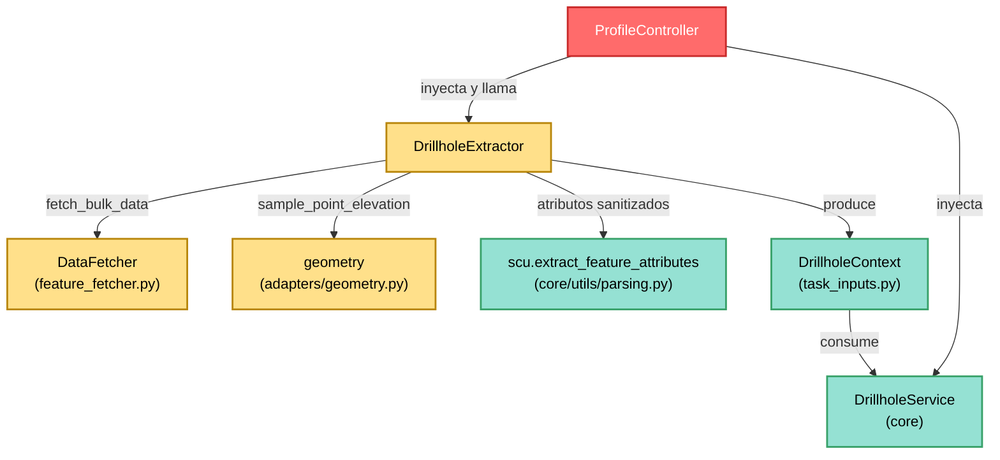

---
tags:
  - secinterp
  - code-walkthrough
  - gui
  - adapters
aliases:
  - drillhole_extractor.py
  - DrillholeExtractor
cssclass: secinterp-note
---

# `gui/adapters/drillhole_extractor.py`

> [!abstract] Resumen en una línea
> Adaptador **Extract** de sondajes que lee la línea de sección y las capas de collares, surveys e intervalos desde QGIS y devuelve un `DrillholeContext` totalmente desacoplado para que `DrillholeService` nunca toque objetos QGIS.

**Ruta**: `gui/adapters/drillhole_extractor.py` (369 líneas)
**Clase principal**: `DrillholeExtractor`
**Capa**: GUI · Adapter (lado Extract, depende de QGIS)
**Tags**: #secinterp #gui #adapters

---

## 🎯 ¿Por qué existe este archivo?

Proyectar sondajes sobre una sección exige leer cuatro capas QGIS heterogéneas
(línea, collares, surveys, intervalos) más un DEM opcional, y convertirlas a
primitivos. Esa lectura no puede vivir en el core (que es QGIS-agnóstico) ni
mezclada en un diálogo:

| Problema | Solución |
|----------|----------|
| El core no puede importar `qgis.core` ni leer `QgsVectorLayer` | El extractor lee las capas y produce un `DrillholeContext` puro |
| Cuatro capas + DEM con distintos campos y CRS deben combinarse | `extract_context` orquesta línea → collares → surveys/intervalos → Z |
| Leer surveys/intervalos pozo a pozo sería N+1 consultas | Delega en `DataFetcher.fetch_bulk_data` (una pasada por capa hija) |
| La elevación del collar puede faltar en el atributo Z | Pre-muestreo desde DEM (`_pre_sample_z` / `_sample_elevation`) |

> [!important] Nota arquitectónica
> **Adapter Extract** del patrón Extract-then-Compute. Todo lo que toca
> `QgsVectorLayer`, `QgsFeatureRequest`, `QgsProject` o `QgsRasterLayer` vive aquí,
> en el hilo principal; el resultado (`DrillholeContext` con tuplas, dicts y
> `Point2D`) es lo único que cruza al core y a los `QgsTask` de fondo.

---

## 🧬 Diagrama de relaciones



> [!tip] Cómo leer
> Flecha sólida = importa/delega; `DrillholeExtractor` es el único que conoce
> QGIS en esta cadena. `DrillholeService` solo ve el `DrillhopeContext`.

---

## 📦 Imports — lectura arquitectónica

```python
# gui/adapters/drillhole_extractor.py
from __future__ import annotations

import math
from typing import Any

from qgis.core import (
    QgsCoordinateReferenceSystem,
    QgsFeatureRequest,
    QgsGeometry,
    QgsProject,
    QgsRasterLayer,
    QgsVectorLayer,
)
from qgis.PyQt.QtCore import QCoreApplication

from sec_interp.core import utils as scu
from sec_interp.core.domain.task_inputs import DrillholeContext
from sec_interp.core.exceptions import DataMissingError, ValidationError
from sec_interp.gui.adapters import geometry
from sec_interp.logger_config import get_logger
```

| # | Observación |
|---|-------------|
| ① | Seis clases de `qgis.core`: es declaradamente lado GUI; el core jamás los importa. |
| ② | `qgis.PyQt.QtCore.QCoreApplication` (no `PyQt5` directo): importación agnóstica lista para QGIS 4.x. |
| ③ | Importa el DTO `DrillholeContext` y las excepciones de dominio: la frontera Extract→Compute queda tipada. |
| ④ | Reutiliza `scu.extract_feature_attributes` (sanitiza `QVariant` a primitivos, seguro en hilos) y el helper `geometry.sample_point_elevation`. |
| ⑤ | `math` solo se usa para el azimut de sección (`atan2` + `degrees`). |

---

## 🏗️ Inventario de estructura

**Constante de módulo:**
- `DEFAULT_BUFFER_SEGMENTS = 8` — segmentos del `buffer()` sobre la línea de sección.

**Clase:** `class DrillholeExtractor` — 14 métodos (1 público principal + 1 `__init__` + 1 `tr` + 11 privados).

**Métodos públicos:**
- `__init__(data_fetcher=None)` — inyección opcional del `DataFetcher`.
- `tr(message)` — traducción con `QCoreApplication.translate("DrillholeExtractor", ...)`.
- `extract_context(line_layer, buffer_width, collar_layer, collar_id_field, use_geometry, collar_x_field, collar_y_field, collar_z_field, collar_depth_field, survey_layer, survey_fields, interval_layer, interval_fields, dem_layer=None, band_num=1)` — orquestador que devuelve `DrillholeContext | None`.

**Métodos privados:**
- `_read_line_geometry(line_lyr)` — primera feature de la línea; `None` si geometría nula.
- `_validate_fields(...)` / `_validate_collar_fields(...)` / `_validate_child_fields(...)` / `_check_field(...)` — validación de nivel 3 (mapeo de campos).
- `_extract_line_points(geometry)` — tuplas `(x, y)` desde línea simple o multipart; `_calculate_azimuth(points)` — rumbo compass desde los dos primeros vértices.
- `_detach_collars(...)` — buffer + request espacial + desconexión de collares.
- `_create_line_buffer(line_geom, buffer_width)` — `buffer()` tolerante a fallos (`None` si falla).
- `_prepare_feature_request(...)` — `QgsFeatureRequest` con bbox y CRS destino.
- `_extract_point(feat, attrs, use_geom, x_field, y_field)` — punto desde geometría o campos X/Y.
- `_pre_sample_z(...)` / `_sample_elevation(dem_layer, point)` — Z de respaldo desde DEM.

---

## 📁 Archivos del paquete

El extractor vive en el paquete `gui/adapters/` (fase Extract completa):

| Archivo | Líneas | Rol |
|---|--:|---|
| `__init__.py` | 7 | Docstring del paquete: contrato Extract-then-Compute |
| `drillhole_extractor.py` | 369 | `DrillholeExtractor` → `DrillholeContext` (esta nota) |
| `geology_extractor.py` | 235 | `GeologyExtractor` → `GeologyContext` |
| `geometry.py` | 226 | Helpers QGIS de geometría y muestreo DEM |
| `layer_resolver.py` | 113 | `LayerResolver` + `resolve_layer` (caché de capas) |
| `structure_extractor.py` | 226 | `SectionContext` + `StructureExtractor` |
| `validation_extractor.py` | 176 | `resolve_layer_metadata`, `build_validation_params` |
| `feature_fetcher.py` | 84 | `DataFetcher` (lecturas bulk de hijas) |
| `profile_extractor.py` | 86 | `ProfileExtractor` → `ProfileData` |

---

## 📖 Recorrido método por método

### `__init__` — inyección del fetcher de hijas

```python
def __init__(self, data_fetcher: Any | None = None) -> None:
    self.data_fetcher = data_fetcher
```

El `DataFetcher` es opcional: sin él, el contexto sale con `survey_data` e
`interval_data` vacíos (útil en tests y en perfiles sin desviaciones). El
`ProfileController` lo inyecta desde la raíz de composición.

### `tr` — i18n del adaptador

```python
def tr(self, message: str) -> str:
    return QCoreApplication.translate("DrillholeExtractor", message)
```

Todos los mensajes de error pasan por aquí con contexto `"DrillholeExtractor"`,
de modo que `update-strings.sh` los recoge para Qt Linguist.

### `extract_context` — orquestador Extract

```python
def extract_context(
    self, line_layer, buffer_width, collar_layer, collar_id_field,
    use_geometry, collar_x_field, collar_y_field, collar_z_field,
    collar_depth_field, survey_layer, survey_fields, interval_layer,
    interval_fields, dem_layer=None, band_num=1,
) -> DrillholeContext | None:
    if buffer_width <= 0:
        raise ValidationError(self.tr("Buffer width must be positive"))
    self._validate_fields(...)  # nivel 3: aborta antes del I/O caro
    line_geom = self._read_line_geometry(line_layer)
    if line_geom is None:
        return None
    line_points = self._extract_line_points(line_geom)
    section_azimuth = self._calculate_azimuth(line_points)
    ...
```

| Paso | Detalle |
|------|---------|
| **Guarda de buffer** | `buffer_width <= 0` → `ValidationError` antes de tocar capas. |
| **Validación nivel 3** | `_validate_fields` comprueba cada mapeo de campo; falla rápido. |
| **Línea** | `_read_line_geometry` puede devolver `None` (geometría nula) → el método retorna `None`, no contexto vacío. |
| **Collares** | `_detach_collars` con `target_crs=line_layer.crs()`; si no hay `collar_layer`, listas vacías. |
| **Hijas** | Solo si `collar_ids` no está vacío **y** hay `data_fetcher`: dos llamadas `fetch_bulk_data` (survey, intervalos). |
| **Salida** | `DrillholeContext` con 10 campos, todos primitivos. |

### `_read_line_geometry` — primera feature de la línea

```python
def _read_line_geometry(self, line_lyr: QgsVectorLayer) -> QgsGeometry | None:
    line_feat = next(line_lyr.getFeatures(), None)
    if not line_feat:
        raise DataMissingError(self.tr("Line layer has no features"))
    line_geom = line_feat.geometry()
    if not line_geom or line_geom.isNull():
        return None
    return line_geom
```

Capa vacía → `DataMissingError`; geometría nula → `None` (el llamador decide).
Solo se lee la **primera** feature: la sección es una única polilínea.

### `_validate_fields` / `_validate_collar_fields` / `_validate_child_fields` / `_check_field`

Cadena de validación en tres niveles: `_validate_fields` reparte a collares
(`_validate_collar_fields`: ID siempre; X/Y solo si `use_geometry` es falso; Z
y profundidad solo si el nombre no está vacío) e hijas (`_validate_child_fields`
para cada valor del mapping con etiqueta `"Survey"` / `"Interval"`).
`_check_field(field_name, fields, label)` ignora nombres vacíos (`""` = campo
opcional no usado) y lanza `ValidationError("{Etiqueta} field '{x}' not found")`
si el campo falta.

### `_extract_line_points` — vértices a tuplas

```python
def _extract_line_points(self, geometry: QgsGeometry) -> list[tuple[float, float]]:
    if geometry.isMultipart():
        parts = geometry.asMultiPolyline()
        polyline = parts[0] if parts else []
    else:
        polyline = geometry.asPolyline()
    return [(p.x(), p.y()) for p in polyline]
```

Toma la primera parte en multilíneas. El resultado es `list[tuple[float, float]]`,
el tipo `Point2D` que espera `DrillholeContext.line_points`.

### `_calculate_azimuth` — rumbo de la sección

```python
def _calculate_azimuth(self, points: list[tuple[float, float]]) -> float:
    MIN_REQUIRED_POINTS = 2
    if len(points) < MIN_REQUIRED_POINTS:
        return 0.0
    p1, p2 = points[0], points[1]
    azimuth = math.degrees(math.atan2(p2[0] - p1[0], p2[1] - p1[1]))
    if azimuth < 0:
        azimuth += 360
    return azimuth
```

`atan2(dx, dy)` da el rumbo compass (0° = norte, horario), normalizado a
`[0, 360)`. Con menos de 2 vértices devuelve `0.0` en lugar de fallar.

### `_detach_collars` — buffer y desconexión

```python
def _detach_collars(self, collar_layer, line_geom, buffer_width, id_field,
                    use_geom, x_field, y_field, z_field, dem_layer,
                    target_crs=None):
    line_buffer = self._create_line_buffer(line_geom, buffer_width)
    req = self._prepare_feature_request(line_geom, line_buffer, collar_layer, target_crs)
    ...
    for feat in collar_layer.getFeatures(req):
        if line_buffer and not feat.geometry().intersects(line_buffer):
            continue
        hid = feat[id_field]
        ...
        collar_data.append({"id": hid, "point": point, "attributes": attrs})
        ...
    return collar_ids, collar_data, pre_sampled_z
```

Doble filtro: primero bbox en el `QgsFeatureRequest` (barato, usa índice
espacial), luego `intersects` exacto contra el buffer (caro pero preciso). Los
atributos se sanitizan con `scu` (convierte `QVariant` a primitivos, seguro para
hilos). Un collar sin punto extraíble se omite sin abortar el resto.

### `_create_line_buffer` — buffer tolerante

```python
def _create_line_buffer(self, line_geom, buffer_width):
    try:
        return line_geom.buffer(buffer_width, DEFAULT_BUFFER_SEGMENTS)
    except (AttributeError, TypeError, ValueError):
        return None
```

Si el buffer falla, devuelve `None` y `_detach_collars` degrada con gracia (sin
filtro exacto, solo bbox). `DEFAULT_BUFFER_SEGMENTS = 8` equilibra suavidad y coste.

### `_prepare_feature_request` — request con CRS destino

```python
def _prepare_feature_request(self, line_geom, line_buffer, layer, target_crs):
    bbox = line_buffer.boundingBox() if line_buffer else line_geom.boundingBox()
    req = QgsFeatureRequest().setFilterRect(bbox)
    if target_crs and target_crs.isValid() and layer.crs() != target_crs:
        transform_context = QgsProject.instance().transformContext()
        req.setDestinationCrs(target_crs, transform_context)
    return req
```

Reproyecta al vuelo solo cuando el CRS del collar difiere del de la línea, usando
el `transformContext()` del proyecto. Es la única llamada a `QgsProject` del módulo.

### `_extract_point` — punto desde geometría o campos

```python
def _extract_point(self, feat, attrs, use_geom, x_field, y_field):
    if use_geom:
        geom = feat.geometry()
        if geom and not geom.isNull() and not geom.isEmpty():
            pt = geom.asPoint()
            return (pt.x(), pt.y())
    try:
        x = float(attrs.get(x_field, 0.0))
        y = float(attrs.get(y_field, 0.0))
        return (x, y)
    except (ValueError, TypeError):
        return None
```

`use_geometry=True` es el camino preferido; los campos X/Y son el respaldo para
capas de collares tabulares sin geometría puntual. Coordenadas no numéricas →
`None` (el collar se omite).

### `_pre_sample_z` / `_sample_elevation` — Z de respaldo desde DEM

```python
def _pre_sample_z(self, feat, attrs, hid, z_field, point, dem_layer):
    z_val = 0.0
    if z_field:
        try:
            z_val = float(attrs.get(z_field, 0.0) or 0.0)
        except (ValueError, TypeError):
            z_val = 0.0
    if z_val == 0.0 and dem_layer:
        elev = self._sample_elevation(dem_layer, point)
        if elev:
            return elev
    return None
```

`_sample_elevation` verifica `dem_layer.isValid()` y delega en
`geometry.sample_point_elevation(dem_layer, point)` (banda 1 por defecto).

Solo muestrea el DEM cuando el atributo Z falta o es cero (el cero se interpreta
como "sin dato", convención del dominio). `pre_sampled_z` mapea
`hole_id → elevación` y el core lo usa como `pre_sampled_z` del contexto.

---

## 🔄 Flujo de datos

| Fase | Entrada | Transformación | Salida |
|------|---------|----------------|--------|
| Guarda | `buffer_width` | `<= 0` → `ValidationError` | — |
| Validación L3 | capas + mappings | `_validate_fields` | nada (o excepción) |
| Línea | `line_layer` (1ª feature) | `_read_line_geometry`, `_extract_line_points`, `_calculate_azimuth` | `line_points`, `section_azimuth` |
| Collares | `collar_layer` + buffer | bbox → `intersects` → `scu` + `_extract_point` | `collar_ids`, `collar_data` |
| Z previo | `point` + `dem_layer` | `_pre_sample_z` si Z es 0 | `pre_sampled_z` |
| Hijas | `collar_ids` + mappings | `DataFetcher.fetch_bulk_data` × 2 | `survey_map`, `interval_map` |
| Contexto | todo lo anterior | constructor `DrillholeContext` | DTO puro al core |

---

## 🏛️ Patrones de diseño presentes

| Patrón | Dónde | Propósito |
|--------|-------|-----------|
| **Adapter (Extract)** | todo el módulo | Traduce QGIS → primitivos sin lógica de negocio |
| **Dependency Injection** | `__init__(data_fetcher)` | Fetcher opcional, mockeable en tests |
| **Fail-fast validation** | `_validate_*` antes de leer | Campos mal mapeados abortan antes del I/O caro |
| **Degradación con gracia** | `_create_line_buffer`, collar sin punto | Un dato malo no tumba la extracción |
| **Bulk fetch** | vía `DataFetcher` | Dos pasadas en lugar de N consultas por pozo |

---

## 🧾 Resumen de la API

| Símbolo | Firma / Hereda | Uso típico |
|---------|----------------|------------|
| `DrillholeExtractor` | clase GUI | `DrillholeExtractor(data_fetcher)` |
| `extract_context` | `(line_layer, buffer_width, collar_layer, collar_id_field, use_geometry, collar_x_field, collar_y_field, collar_z_field, collar_depth_field, survey_layer, survey_fields, interval_layer, interval_fields, dem_layer=None, band_num=1) -> DrillholeContext \| None` | Punto de entrada Extract |
| `tr` | `(message: str) -> str` | i18n de mensajes |
| `_detach_collars` | `(collar_layer, line_geom, buffer_width, id_field, use_geom, x_field, y_field, z_field, dem_layer, target_crs=None) -> tuple[set, list, dict]` | Núcleo de la desconexión |
| `DEFAULT_BUFFER_SEGMENTS` | `= 8` | Suavidad del buffer de línea |

---

## 🛡️ Manejo de errores

| Situación | Comportamiento |
|-----------|----------------|
| `buffer_width <= 0` | `ValidationError` inmediata |
| Campo mapeado inexistente | `ValidationError("{Etiqueta} field '{x}' not found")` |
| Capa de línea vacía | `DataMissingError("Line layer has no features")` |
| Geometría de línea nula | `return None` (no es error fatal) |
| `buffer()` falla | `None` → solo filtro por bbox |
| Collar sin punto | se omite, continúa el bucle |
| Z no numérico | se trata como `0.0` → intenta DEM |

---

## 🧪 Tests asociados

El módulo **no tiene tests unitarios dedicados** en `tests/gui/` (no existe
`test_drillhole_extractor.py`); se cubre indirectamente a través de sus
consumidores y del core:

- `tests/gui/tasks/test_drillhole_task.py` — la tarea que consume el contexto extraído.
- `tests/integration/test_geology_structure_workflow.py` — flujo Extract→Compute integrado.
- `tests/integration/test_async_orchestrators.py` — orquestación con extractores inyectados.
- `tests/core/test_drillhole_service.py` — el consumidor core con `DrillholeContext` mockeado.
- `tests/core/test_drillhole_service_optional.py` — servicio sin componentes opcionales.
- `tests/base_test.py` — `BaseTestCase` con mocks QGIS para probar el extractor sin QGIS real.

---

## 🧵 Thread-safety e i18n

| Aspecto | Detalle |
|---------|---------|
| **Hilo** | Todo el extractor corre en el hilo principal (lee `QgsVectorLayer`/`QgsProject` vivos); solo el `DrillholeContext` resultante viaja al `QgsTask`. |
| **Atributos** | `scu.extract_feature_attributes` convierte `QVariant` a primitivos para evitar problemas de hilos en QGIS 4/Qt6. |
| **i18n** | `self.tr()` con contexto `"DrillholeExtractor"` vía `qgis.PyQt` (agnóstico Qt5/Qt6); sin `tr` quedarían cadenas fuera de Linguist. |

---

## 👀 Observaciones y notas

> [!success] Fortalezas
> - Frontera Extract nítida: el core recibe 10 campos primitivos, cero QGIS.
> - Doble filtro espacial (bbox + `intersects`) con degradación si el buffer falla.
> - Reproyección al vuelo solo cuando los CRS difieren.
> - Z de respaldo desde DEM con convención explícita (0.0 = sin dato).

> [!warning] Puntos de atención
> - `band_num` se acepta pero **no se usa** en este módulo (el DEM se muestrea con banda 1 por defecto en `geometry.sample_point_elevation`): parámetro dormido.
> - Solo se lee la primera feature de la línea; una capa con varias secciones se procesa parcialmente en silencio.
> - El `0.0` como "sin dato" colisiona con una elevación real de 0 m sobre el nivel del mar.
> - `_detach_collars` itera todas las features del bbox en el hilo principal: capas enormes pueden congelar la GUI (candidato a `QgsTask` con paginación).

> [!question] Preguntas abiertas
> - ¿Propagar `band_num` hasta `sample_point_elevation` o eliminarlo de la firma?
> - ¿Avisar al usuario si la línea tiene más de una feature en lugar de ignorarlas?
> - ¿Un sentinel `None` en vez de `0.0` para "Z ausente"?

---

## 🔗 Notas relacionadas

- [[Index]] — índice de la bóveda
- [[gui_adapters]] — nota de paquete de los adapters Extract
- [[feature_fetcher]] — `DataFetcher` usado para surveys e intervalos
- [[geometry]] — `sample_point_elevation` para el Z de respaldo
- [[task_inputs]] — DTO `DrillholeContext` producido aquí
- [[drillhole_service]] — consumidor core del contexto
- [[controller]] — `ProfileController` que inyecta y orquesta el extractor
- [[structure_extractor]] — extractor hermano (misma forma: línea + buffer + detach)
- [[validation_extractor]] — validación previa de las capas de sondajes

---

*Nota de la bóveda SecInterp Code Walkthrough v2 — v3.8.0*
