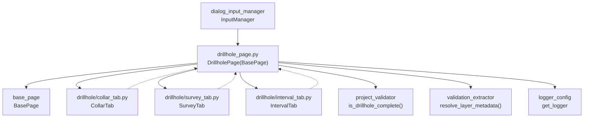

---
tags:
  - secinterp
  - code-walkthrough
  - gui
  - pages
aliases:
  - drillhole_page.py
  - DrillholePage
cssclass: secinterp-note
---

# `gui/ui/pages/drillhole_page.py`

> [!abstract] Resumen en una línea
> Página coordinadora de sondajes: contenedor con `QTabWidget` (Collars/Survey/Intervals) que fusiona lectura, persistencia, reseteo y señales de los tres tabs hacia el diálogo.

**Ruta**: `gui/ui/pages/drillhole_page.py` (130 líneas)
**Clase principal**: `DrillholePage(BasePage)`
**Capa**: GUI (coordinación de tabs · Extract hacia `ValidationParams`)
**Tags**: #secinterp #gui #pages

---

## 🎯 ¿Por qué existe este archivo?

Un sondaje necesita tres tablas (collar, desviaciones, intervalos) con una docena
de campos entre capas y columnas. Sin coordinador, el diálogo tendría que conocer
los tres formularios y fusionar sus dicts a mano en cada operación.

| Problema | Solución |
|----------|----------|
| Tres formularios independientes (collar/survey/interval) con el mismo protocolo | `DrillholePage` los hospeda en un `QTabWidget` y fusiona `get_data/dump` con `dict.update` |
| El diálogo debe enterarse de cualquier cambio en cualquier tab | Reemisión: `tab.dataChanged → DrillholePage.dataChanged` |
| Conectar/desconectar 3 tabs × N señales es repetitivo y propenso a fugas | Bucle en `connect_signals` / `disconnect_signals` con `contextlib.suppress` |

> [!important] Nota arquitectónica
> Coordinator del patrón Manager: la página no tiene widgets propios de datos, solo
> el contenedor de tabs. Delega todo en `CollarTab`, `SurveyTab` e `IntervalTab`
> (`gui/ui/pages/drillhole/`), igual que [[settings_page]] delega en sus tabs.

---

## 🧬 Diagrama de relaciones



> [!tip] Cómo leer
> Flecha sólida = importa/delega; punteada = el tab emite `dataChanged` y la página lo reemite.

---

## 📦 Imports — lectura arquitectónica

```python
# gui/ui/pages/drillhole_page.py
from __future__ import annotations

import contextlib
from typing import Any

from qgis.PyQt.QtCore import QCoreApplication, pyqtSignal
from qgis.PyQt.QtWidgets import QTabWidget, QVBoxLayout, QWidget

from sec_interp.core.validation.project_validator import ProjectValidator, ValidationParams
from sec_interp.gui.adapters.validation_extractor import resolve_layer_metadata
from sec_interp.logger_config import get_logger

from .base_page import BasePage
from .drillhole import CollarTab, IntervalTab, SurveyTab
```

| # | Observación |
|---|-------------|
| ① | `contextlib.suppress(TypeError, RuntimeError)` para desconexiones idempotentes, igual que [[geology_page]] y [[structure_page]]. |
| ② | `pyqtSignal` define `dataChanged`: es una de las dos páginas simples con señal propia (la otra es [[geology_page]]; [[structure_page]] también). |
| ③ | Solo widgets contenedores (`QTabWidget`, `QVBoxLayout`): los combos de capa viven dentro de cada tab, no aquí. |
| ④ | `ProjectValidator` + `ValidationParams` + `resolve_layer_metadata`: `is_complete()` traduce 3 capas vivas a metadatos antes del core. |
| ⑤ | `get_logger(__name__)` a nivel de módulo, aunque el archivo actual no emite logs: infraestructura preparada para el coordinador. |
| ⑥ | Import relativo `.drillhole` del sub-paquete con los tres formularios: la página es la fachada del paquete. |

---

## 🏗️ Inventario de estructura

**Clase `DrillholePage(BasePage)`:**

- Señal `dataChanged = pyqtSignal()` y `layer_keys = frozenset({"dh_collar_layer", "dh_survey_layer", "dh_interval_layer"})`
- `__init__(self, parent: QWidget | None = None) -> None`
- `_setup_ui(self) -> None` — tabs Collars/Survey/Intervals
- `get_data(self) -> dict[str, Any]` — fusión de los 3 tabs
- `dump(self) -> dict[str, Any]` — fusión de los 3 tabs
- `load(self, data: dict[str, Any]) -> None` — reparte a los 3 tabs
- `reset(self) -> None` — resetea los 3 tabs
- `is_complete(self) -> bool` — `ValidationParams` completo → `is_drillhole_complete`
- `connect_signals(self) / disconnect_signals(self) -> None` — bucle sobre tabs

**Tabs hijas (nombres exactos):**

| Atributo | Clase | Pestaña visible | Claves que aporta |
|----------|-------|-----------------|-------------------|
| `collar_tab` | `CollarTab` | Collars | `collar_layer/use_geometry/collar_id/collar_x/collar_y/collar_z/collar_depth` |
| `survey_tab` | `SurveyTab` | Survey | `survey_layer/survey_id/survey_depth/survey_azim/survey_incl` |
| `interval_tab` | `IntervalTab` | Intervals | `interval_layer/interval_id/interval_from/interval_to/interval_lith` |

---

## 📖 Recorrido método por método

### `__init__` — solo título

```python
def __init__(self, parent: QWidget | None = None) -> None:
    super().__init__(QCoreApplication.translate("DrillholePage", "Drillhole Data"), parent)
```

Sin `iface` (a diferencia de [[dem_page]]): los tabs resuelven capas del proyecto
por sí mismos. Toda la construcción ocurre en `_setup_ui` vía la base.

### `_setup_ui` — tab widget sobre el grupo heredado

```python
def _setup_ui(self) -> None:
    super()._setup_ui()

    layout = self.group_box.layout()
    if layout is None:
        layout = QVBoxLayout(self.group_box)
        self.group_box.setLayout(layout)

    self.tab_widget = QTabWidget()
    layout.addWidget(self.tab_widget)

    self.collar_tab = CollarTab()
    self.tab_widget.addTab(self.collar_tab, self.tr("Collars"))
    # ... SurveyTab → "Survey", IntervalTab → "Intervals" ...
    layout.addStretch()
```

Reutiliza el layout del `group_box` si existe o crea un `QVBoxLayout`; añade el
`QTabWidget` con los tres formularios (títulos vía `self.tr()`) y un stretch
final. El mismo esqueleto contenedor lo usa [[settings_page]] (tabs Default /
Advanced / información). Los tabs se construyen sin `parent` explícito: el
`QTabWidget` adopta su propiedad al añadirlos.

### `get_data` / `dump` — fusión con `update`

```python
def get_data(self) -> dict[str, Any]:
    data: dict[str, Any] = {}
    data.update(self.collar_tab.get_data())
    data.update(self.survey_tab.get_data())
    data.update(self.interval_tab.get_data())
    return data
# dump() es idéntico pero llamando a .dump() en cada tab.
```

Fusión plana en orden collar → survey → interval; los namespaces de los tabs no
colisionan por diseño (prefijos `collar_/survey_/interval_`). `get_data` mezcla
capas vivas y campos; `dump` mezcla capas persistibles y primitivos. `InputManager`
consume 17 claves de sondajes (`collar_layer_obj`, `collar_id_field`, …,
`interval_lith_field`) desde este dict fusionado.

### `load` / `reset` — reparto a los tabs

```python
def load(self, data: dict[str, Any]) -> None:
    self.collar_tab.load(data)
    self.survey_tab.load(data)
    self.interval_tab.load(data)
# reset() es idéntico pero sin argumentos.
```

Cada tab extrae sus propias claves con `.get()` defensivo, así `load`/`reset` de
la página son puro fan-out sin conocimiento de campos. Nótese que `load` reparte
el dict completo (no sub-dicts): cada tab ignora lo que no le concierne.

### `is_complete` — el `ValidationParams` más grande del diálogo

```python
def is_complete(self) -> bool:
    data = self.get_data()
    params = ValidationParams(
        collar_layer=resolve_layer_metadata(data["collar_layer"]),
        collar_id=data["collar_id"],
        collar_use_geom=data["use_geometry"],
        collar_x=data["collar_x"],
        collar_y=data["collar_y"],
        # ... survey_* (5) e interval_* (5) ...
    )
    return ProjectValidator.is_drillhole_complete(params)
```

Construye el `ValidationParams` de 14 campos (3 capas desacopladas + 11
identificadores de campo) y delega en `is_drillhole_complete`, que exige collar +
id y valida cada bloque con `DrillholeValidator`. Es el chequeo de completitud
más estricto de las páginas: compárese con [[section_page]], que solo comprueba
`bool(currentLayer())`.

### `connect_signals` / `disconnect_signals` — reemisión en bucle

```python
def connect_signals(self) -> None:
    for tab in (self.collar_tab, self.survey_tab, self.interval_tab):
        tab.dataChanged.connect(self.dataChanged.emit)
        tab.connect_signals()

def disconnect_signals(self) -> None:
    for tab in (self.collar_tab, self.survey_tab, self.interval_tab):
        tab.disconnect_signals()
        with contextlib.suppress(TypeError, RuntimeError):
            tab.dataChanged.disconnect(self.dataChanged.emit)

    with contextlib.suppress(TypeError, RuntimeError):
        self.dataChanged.disconnect()
```

Conecta la reemisión **antes** de delegar en cada tab, y desconecta en orden
inverso (primero el tab, luego el puente). El `self.dataChanged.disconnect()` sin
argumentos rompe todos los suscriptores externos de golpe (el diálogo re-suscribe
en cada reconexión). Cada tab, por dentro, ya conecta sus `layerChanged` /
`fieldChanged` / `toggled` a su propio `dataChanged` (ver [[collar_tab]],
[[survey_tab]], [[interval_tab]]).

---

## 🗂️ Claves de lectura frente a claves de sesión

`get_data` y `dump` no usan los mismos nombres: el primero habla el idioma del
validador y el segundo el del almacén de sesiones (`layer_keys` por bloque).

| Tab | `get_data` (lectura) | `dump` (sesión) |
|-----|----------------------|-----------------|
| Collar | `collar_layer` (viva) | `dh_collar_layer` |
| Collar | `use_geometry, collar_id, collar_x, collar_y, collar_z, collar_depth` | mismas claves (primitivos) |
| Survey | `survey_layer` (viva) | `dh_survey_layer` |
| Survey | `survey_id, survey_depth, survey_azim, survey_incl` | mismas claves (primitivos) |
| Interval | `interval_layer` (viva) | `dh_interval_layer` |
| Interval | `interval_id, interval_from, interval_to, interval_lith` | mismas claves (primitivos) |

> [!note] Solo las capas se renombran
> Los nombres de campo (`collar_id`, `survey_azim`, `interval_lith`…) son idénticos
> en lectura y sesión; únicamente las tres capas cambian de `*_layer` a `dh_*_layer`.
> `InputManager` además los re-mapea a `collar_layer_obj`, `collar_id_field`, etc.

---

## 🧩 Ciclo de vida en el diálogo

Cómo participa la página en la vida del diálogo principal (`SecInterpDialog`):

| Momento | Quién | Qué hace con la página |
|---------|-------|------------------------|
| Construcción | [[main_window]] / diálogo | `DrillholePage()` en el `QStackedWidget`, entrada "Drillholes" en [[sidebar]] |
| Cableado | `SignalManager` | `page.connect_signals()` + suscribe `dataChanged` para refrescar validez y botones |
| Edición | usuario | cualquier cambio en un tab sube como `dataChanged`; el diálogo revalida |
| Preview | `InputManager.can_preview` | exige DEM + sección; sondajes opcionales pero validados si hay collar |
| Validación total | `InputManager.validate_inputs` | `get_validation_params()` incluye los 14 campos de sondajes |
| Export | gestores de export | `get_data()` aporta capas y campos al pipeline |
| Sesión | persistencia multi-sesión | `dump()` guarda `dh_*`; `load()` restaura por fan-out |
| Cierre | `SignalManager` | `page.disconnect_signals()` rompe puentes y suscripciones |

---

## 🔄 Flujo de datos

| Fase | Entrada | Transformación | Salida |
|------|---------|----------------|--------|
| Edición | usuario en cualquier tab | `fieldChanged/layerChanged → tab.dataChanged → page.dataChanged` | el diálogo refresca su estado |
| Lectura | 3 tabs | `update` encadenado | dict plano de 17 claves |
| Agregación | dict fusionado | `InputManager.get_all_values()` | `collar_*_field/survey_*_field/interval_*_field` |
| Completitud | capas vivas + campos | 3× `resolve_layer_metadata` + `is_drillhole_complete` | `bool` |
| Persistencia | 3 tabs | `dump()` fusionado | claves `dh_*_layer` + campos |
| Restauración | dict de sesión | fan-out `load()` a cada tab | formularios restaurados |

---

## 🏛️ Patrones de diseño presentes

| Patrón | Dónde | Propósito |
|--------|-------|-----------|
| **Coordinator / Facade** | página sobre 3 tabs | El diálogo ve una sola página de sondajes |
| **Fan-out / Fan-in** | `load/reset` reparten; `get_data/dump` fusionan | Simetría lectura/escritura |
| **Signal relay** | `tab.dataChanged → dataChanged.emit` | Un único punto de suscripción externa |
| **Extract-then-Compute** | `is_complete` desacopla 3 capas | El core valida sin QGIS |

---

## 🧾 Resumen de la API

| Símbolo | Firma / Hereda | Uso típico |
|---------|----------------|------------|
| `DrillholePage` | `(BasePage)` | pestaña "Drillholes" del `QStackedWidget` |
| `dataChanged` | `pyqtSignal()` | el diálogo refresca validez al emitir |
| `layer_keys` | `dh_collar_layer/dh_survey_layer/dh_interval_layer` | persistencia por bloque |
| `get_data/dump` | fusión collar+survey+interval | lectura y sesión |
| `load/reset` | fan-out a los 3 tabs | restauración y defecto |
| `is_complete` | vía `is_drillhole_complete` | puerta de preview/export |

---

## 🛡️ Manejo de errores

- `is_drillhole_complete` devuelve `False` si falta `collar_layer` o `collar_id` antes de invocar al validador: sin collar no hay nada que validar.
- `load` tolera dicts parciales porque cada tab usa `.get()` por clave; una sesión sin bloque survey restaura collar e intervalos sin romper.
- Desconexiones blindadas con `suppress(TypeError, RuntimeError)` por puente y global: reconectar el diálogo y cerrar después no lanza.
- Sin `validate()` propio (hereda `(True, "")` de la base): la puerta real es `is_complete` + `InputManager.validate_inputs`, que sí reporta el mensaje del core.

---

## 🧪 Tests asociados

Cobertura directa real en `tests/gui/test_drillhole_page.py` (importa
`DrillholePage` más `CollarTab`, `IntervalTab`, `SurveyTab`):

- Claves de `get_data` (17: `collar_layer/use_geometry/collar_id/collar_x/…/interval_lith`) y de `dump`.
- Coordinación `load/reset` sobre los tres tabs y reemisión de `dataChanged`.
- `is_complete` con capas mockeadas vía `tests/base_test.py`.

Cobertura indirecta:

- `tests/gui/test_dialog_input_manager.py` — reglas `drillhole` (`is_drillhole_complete(p) if p.collar_layer else True`).
- `tests/gui/test_main_dialog_validation_manager.py` — mensaje `"Drillhole configuration is incomplete"`.
- `tests/gui/test_multi_session_persistence.py` — round-trip con claves `dh_*`.
- `tests/gui/test_signal_restoration.py` — los puentes `dataChanged` sobreviven a reconexiones.

| Método de test | Qué verifica en esta página |
|----------------|-----------------------------|
| `test_get_data_keys` | las 17 claves de lectura existen tras construir los tabs |
| `test_dump_keys` | `dump()` usa `dh_*_layer` para capas y conserva campos |
| `test_load_roundtrip` | `load(dump())` deja los combos en el mismo estado |
| `test_dataChanged_relay` | un cambio en un tab emite `DrillholePage.dataChanged` |
| `test_is_complete` | sin collar → `False`; collar + campos → `True` |

---

## 🌐 i18n y notas de migración

- Títulos de pestaña vía `self.tr("Collars"/"Survey"/"Intervals")` y título de grupo con contexto `"DrillholePage"`: todo el texto visible entra al catálogo.
- Sin formato numérico propio: los tabs formatean sus campos; la página no toca `tr()` salvo títulos.
- Solo `QTabWidget/QVBoxLayout` de `qgis.PyQt`: sin riesgo de migración a QGIS 4.x.

---

## 👀 Observaciones y notas

> [!success] Fortalezas
> - Fan-in/fan-out simétrico: imposible que `load` olvide un campo que `dump` guardó, porque ambos delegan en los mismos tabs.
> - Reemisión en bucle de 3 líneas: añadir un cuarto tab (p. ej. assays) es trivial.
> - `is_complete` con desacoplado explícito de las 3 capas: ejemplo de libro del Extract-then-Compute.

> [!warning] Puntos de atención
> - `logger` definido pero sin uso en el archivo: o se usa (p. ej. en `load` parcial) o sobra el import.
> - `self.dataChanged.disconnect()` sin argumentos rompe **todas** las suscripciones externas; si otro componente además del diálogo se suscribe, también lo pierde.
> - Sin `validate()` propio: un collar sin id pasa el Nivel 1 y falla recién en el validador core (mensaje menos contextual).

> [!question] Preguntas abiertas
> - ¿Añadir `validate()` con mensajes por bloque (collar/survey/interval) para errores más cercanos al campo?
> - ¿Retirar el `logger` sin uso o registrar restauraciones parciales en `load`?

---

## 🔗 Notas relacionadas

- [[Index]] — índice de la bóveda
- [[base_page]] — protocolo coordinado por esta página
- [[collar_tab]] / [[survey_tab]] / [[interval_tab]] — los tres formularios delegados
- [[gui_ui_pages_drillhole]] — nota del sub-paquete `drillhole/`
- [[main_window]] — pestaña "Drillholes" del `QStackedWidget`
- [[sidebar]] — entrada "Drillholes" (`mActionDataSourceManager.svg`)
- [[dialog_input_manager]] — fusiona las 17 claves en `get_all_values()`
- [[project_validator]] — `is_drillhole_complete` / `DrillholeValidator`
- [[validation_extractor]] — `resolve_layer_metadata` por bloque
- [[settings_page]] — la otra página coordinadora (tabs de ajustes)

---

*Nota de la bóveda SecInterp Code Walkthrough v2 — v3.9.1*
