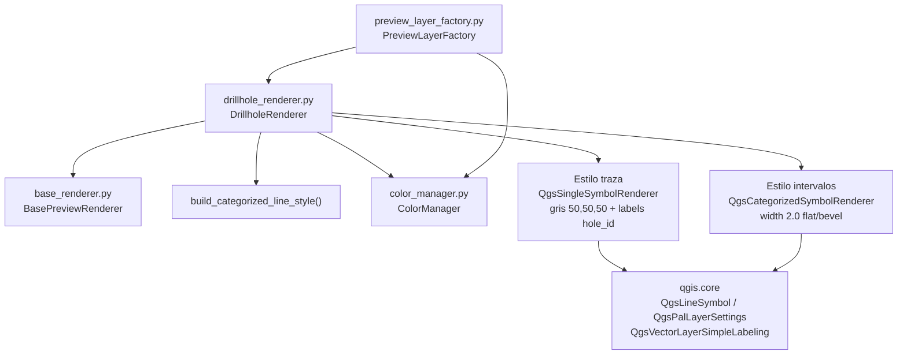

---
tags:
  - secinterp
  - code-walkthrough
  - gui
  - renderers
aliases:
  - drillhole_renderer.py
  - DrillholeRenderer
cssclass: secinterp-note
---

# `gui/renderers/drillhole_renderer.py`

> [!abstract] Resumen en una línea
> Renderer de sondajes con doble rol: trazas grises finas etiquetadas con `hole_id` y tramos litológicos categorizados por unidad con los colores estables de `ColorManager`.

**Ruta**: `gui/renderers/drillhole_renderer.py` (71 líneas)
**Clase principal**: `DrillholeRenderer(BasePreviewRenderer)`
**Capa**: GUI · Present (estiliza memory layers creadas por `PreviewLayerFactory`)
**Tags**: #secinterp #gui #renderers

---

## 🎯 ¿Por qué existe este archivo?

El preview muestra dos capas de sondajes con necesidades visuales opuestas: la traza debe ser neutra y legible, los intervalos deben gritar la litología con el mismo color que la geología.

| Problema | Solución |
|----------|----------|
| Las trazas necesitan identificarse (qué sondaje es cada línea) | Estilo de traza con etiquetado PAL a lo largo de la línea por campo `hole_id` |
| Los intervalos deben usar los mismos colores que las unidades geológicas | Estilo de intervalos vía `build_categorized_line_style()` + `ColorManager` compartido |
| La factory debe pedir ambos estilos con una sola interfaz | `apply_style(layer, role=..., unique_units=...)` con despacho por `role` |

> [!important] Nota arquitectónica
> Hijo **Strategy** de `BasePreviewRenderer`. El `ColorManager` se inyecta por constructor desde `PreviewLayerFactory`, así que sondajes y geología comparten la misma caché `_active_units` y un `unit_name` idéntico recibe el mismo color en ambas capas. Lado **Present** puro: no toca DTOs ni servicios.

---

## 🧬 Diagrama de relaciones



> [!tip] Cómo leer
> Flecha sólida = importa/delega. La factory crea el `ColorManager` una vez y lo comparte entre `DrillholeRenderer` y `GeologyRenderer`: esa es la línea que garantiza colores consistentes.

---

## 📦 Imports — lectura arquitectónica

```python
# gui/renderers/drillhole_renderer.py
from __future__ import annotations

from qgis.core import (
    QgsLineSymbol,
    QgsPalLayerSettings,
    QgsSingleSymbolRenderer,
    QgsTextFormat,
    QgsVectorLayer,
    QgsVectorLayerSimpleLabeling,
)
from qgis.PyQt.QtGui import QColor

from sec_interp.gui.renderers.base_renderer import (
    BasePreviewRenderer,
    build_categorized_line_style,
)
from sec_interp.gui.renderers.color_manager import ColorManager
```

| # | Observación |
|---|-------------|
| ① | Seis clases de `qgis.core` centradas en simbología y etiquetado PAL: el módulo solo **presenta**. |
| ② | `QColor` viene de `qgis.PyQt.QtGui` (import agnóstico Qt5/Qt6, listo para QGIS 4.x), no de `PyQt5` directo. |
| ③ | Importa tanto la ABC (`BasePreviewRenderer`) como el helper: es el único hijo que combina ambos mundos (estilo propio + helper). |
| ④ | `ColorManager` se importa para el tipado del constructor; la instancia real la provee la factory. Inyección por constructor, no singleton. |
| ⑤ | Cero imports de `core/`: coherente con su rol Present. Los datos ya llegan convertidos en capas. |

---

## 🏗️ Inventario de estructura

**Clases (1):**

| Clase | Hereda | Métodos |
|-------|--------|---------|
| `DrillholeRenderer` | `BasePreviewRenderer` | `__init__`, `apply_style`, `_apply_trace_style`, `_apply_interval_style` |

**Métodos:**

| Método | Firma | Rol |
|--------|-------|-----|
| `__init__` | `(color_manager: ColorManager) -> None` | Guarda el manager compartido |
| `apply_style` | `(layer: QgsVectorLayer, **kwargs) -> None` | Despacha por `role` (`"trace"` por defecto) |
| `_apply_trace_style` | `(layer: QgsVectorLayer) -> None` | Línea gris + etiquetas `hole_id` |
| `_apply_interval_style` | `(layer: QgsVectorLayer, unique_units: set[str]) -> None` | Categorizado por `unit` vía helper |

---

## 📁 Archivos del paquete

| Archivo | Líneas | Rol |
|---|--:|---|
| `drillhole_renderer.py` | 71 | Esta nota: doble rol traza / intervalos |
| `base_renderer.py` | 60 | ABC + `build_categorized_line_style()` (contrato y helper) |
| `color_manager.py` | 48 | Paleta determinista + caché `_active_units` compartida |
| `geology_renderer.py` | 29 | Hermano que reutiliza el helper con defaults |
| `structure_renderer.py` | 18 | Hermano de línea simple (no usa el helper) |
| `topo_renderer.py` | 32 | Hermano graduado por `elev` (no usa el helper) |
| `interpretation_renderer.py` | 43 | Hermano de relleno por `id` (no usa el helper) |

---

## 📖 Recorrido método por método

### `__init__`

```python
def __init__(self, color_manager: ColorManager) -> None:
    self.color_manager = color_manager
```

Guarda la referencia sin copiar: factory, geología y sondajes comparten el **mismo** objeto, y por tanto la misma caché de colores. Crear un `ColorManager` propio por renderer rompería la consistencia cromática.

### `apply_style`

```python
def apply_style(self, layer: QgsVectorLayer, **kwargs) -> None:
    """Apply styling based on layer role (trace or interval)."""
    role = kwargs.get("role", "trace")
    if role == "trace":
        self._apply_trace_style(layer)
    else:
        self._apply_interval_style(layer, kwargs.get("unique_units", set()))
```

Despacho por rol con default `"trace"`: cualquier `role` distinto de `"trace"` (en la práctica `"interval"`) cae en la rama categorizada. `unique_units` cae a `set()` vacío si el llamador lo omite, produciendo un renderer sin categorías (capa invisible pero sin excepción).

### `_apply_trace_style`

```python
def _apply_trace_style(self, layer: QgsVectorLayer) -> None:
    symbol = QgsLineSymbol.createSimple(
        {"color": "50,50,50", "width": "0.3", "capstyle": "round"}
    )
    layer.setRenderer(QgsSingleSymbolRenderer(symbol))

    settings = QgsPalLayerSettings()
    settings.fieldName = "hole_id"
    settings.placement = QgsPalLayerSettings.Placement.Line

    txt_format = QgsTextFormat()
    txt_format.setColor(QColor(0, 0, 0))
    txt_format.setSize(8)
    settings.setFormat(txt_format)

    layer.setLabeling(QgsVectorLayerSimpleLabeling(settings))
    layer.setLabelsEnabled(True)
```

Traza deliberadamente neutra: gris oscuro `50,50,50`, fina (`0.3`), extremos redondos. El etiquetado PAL coloca el `hole_id` **sobre la línea** (`Placement.Line`) en negro tamaño 8. Requiere que la memory layer tenga el campo `hole_id`, que la factory garantiza al crear la capa de trazas.

> [!note] Tres llamadas para activar etiquetas
> `setLabeling()` solo instala la configuración; `setLabelsEnabled(True)` es lo que realmente enciende el motor de etiquetas. Omitir la segunda es un error clásico que deja trazas sin identificar. El test `test_apply_trace_style` verifica las tres llamadas.

### `_apply_interval_style`

```python
def _apply_interval_style(self, layer: QgsVectorLayer, unique_units: set[str]) -> None:
    """Styling for lithological intervals."""
    layer.setRenderer(
        build_categorized_line_style(
            self.color_manager,
            unique_units,
            width="2.0",
            capstyle="flat",
            joinstyle="bevel",
        )
    )
```

Delega en el helper con el `field` por defecto (`"unit"`) pero con geometría visual propia: líneas **gruesas** (`2.0`) con extremos planos y uniones en bisel, pensadas para que los tramos litológicos se lean como bandas de color sobre la traza fina. Requiere el campo `unit`, también creado por la factory.

### Contrato de campos con la factory

El renderer no crea campos: los **exige**. Este es el acoplamiento real con `PreviewLayerFactory`:

| Rama | Campo exigido | Quién lo crea | Si falta |
|------|---------------|---------------|----------|
| Traza | `hole_id` (texto) | `create_drillhole_trace_layer()` | etiquetas vacías, línea visible |
| Intervalos | `unit` (texto) | `create_drillhole_interval_layer()` | categorías sin match, capa vacía |

> [!tip] Cómo auditar el contrato
> Si las trazas aparecen sin etiqueta o los intervalos en blanco, el primer sospechoso no es este renderer sino la factory: verifica que la memory layer exponga `hole_id`/`unit` antes de mirar el estilo.

---

## 🔄 Flujo de datos

| Fase | Entrada | Transformación | Salida |
|------|---------|----------------|--------|
| Despacho | `role` + `layer` | `kwargs.get("role", "trace")` | rama traza o rama intervalos |
| Traza | capa con `hole_id` | símbolo gris + PAL `Line` | traza etiquetada |
| Intervalos | capa con `unit` + `unique_units` | helper + `ColorManager` | bandas categorizadas por unidad |

---

## 🏛️ Patrones de diseño presentes

| Patrón | Dónde | Propósito |
|--------|-------|-----------|
| **Strategy** | `DrillholeRenderer(BasePreviewRenderer)` | Un renderer intercambiable más dentro de la familia |
| **Dispatcher por rol** | `apply_style()` | Dos estilos con una sola firma polimórfica |
| **Dependency Injection** | `__init__(color_manager)` | Compartir caché cromática con geología |
| **Delegación** | `_apply_interval_style` → helper | Reutilizar categorizado sin duplicar |

---

## 🧾 Resumen de la API

| Símbolo | Firma / Hereda | Uso típico |
|---------|----------------|------------|
| `DrillholeRenderer` | `BasePreviewRenderer` | `DrillholeRenderer(color_manager)` (lo hace la factory) |
| `apply_style` | `(layer, role="trace", unique_units=set()) -> None` | `apply_style(trace_layer)` / `apply_style(iv_layer, role="interval", unique_units=units)` |

---

## 🛡️ Manejo de errores

Sin `try/except` propio; los casos límite son silenciosos por diseño QGIS:

| Situación | Comportamiento |
|-----------|----------------|
| `role` desconocido (p. ej. `"collar"`) | Cae en la rama de intervalos; si además falta `unique_units`, capa sin símbolos |
| Capa de traza sin campo `hole_id` | Etiquetas vacías, la línea gris sí se dibuja |
| Capa de intervalos sin campo `unit` | Categorías sin coincidencias: capa vacía visualmente |
| `unique_units` vacío | Renderer categorizado sin categorías, sin excepción |

---

## 🧪 Tests asociados

Cobertura directa con mocks en `tests/gui/renderers/test_renderers.py`:

- `TestDrillholeRenderer::test_apply_trace_style` — con `role="trace"` verifica `setRenderer` (1 vez), `setLabeling` (1 vez) y `setLabelsEnabled(True)`. El `ColorManager` mockeado ni se usa en esta rama.
- `TestDrillholeRenderer::test_apply_interval_style` — con `role="interval"` y `{"LithA", "LithB"}` verifica `setRenderer` (1 vez) y `get_color` exactamente 2 veces, probando de paso el helper heredado.

Sin cobertura en `tests/core/` (módulo GUI con imports `qgis.core`). No hay test del despacho con `role` omitido (default `"trace"`) ni de `unique_units` vacío.

---

## 👀 Observaciones y notas

> [!success] Fortalezas
> - Un solo `ColorManager` compartido: la misma unidad tiene el mismo color en geología e intervalos.
> - Contraste visual intencionado: traza fina neutra + bandas gruesas de color.
> - Etiquetado PAL sobre la línea: el `hole_id` viaja con la geometría sin capa extra.

> [!warning] Puntos de atención
> - El `else` captura cualquier `role` no `"trace"`: un typo (`"intervals"`) no falla, solo produce un categorizado quizá vacío.
> - Acoplado a los nombres de campo `hole_id` y `unit` que crea la factory; renombrarlos allí rompe el estilo aquí sin error explícito.
> - Las etiquetas siempre se encienden; no hay flag para ocultarlas en secciones densas.

> [!question] Preguntas abiertas
> - ¿Validar `role` con un literal (`"trace" | "interval"`) y fallar alto ante valores inesperados?
> - ¿Parametrizar el tamaño de etiqueta (8 fijo) para pantallas HiDPI?

---

## 🔗 Notas relacionadas

- [[Index]] — índice de la bóveda
- [[gui_renderers]] — nota de familia de renderers
- [[base_renderer]] — contrato ABC y helper que este renderer consume
- [[preview_layer_factory]] — crea las capas (`hole_id`, `unit`) e instancia este renderer
- [[drillhole_service]] — calcula en el core los datos que aquí solo se visten
- [[drillhole_task]] — trae esos datos al hilo principal antes del render
- [[preview_legend_renderer]] — dibuja la leyenda con los mismos `active_units`

---

*Nota de la bóveda SecInterp Code Walkthrough v2 — v3.9.1*
