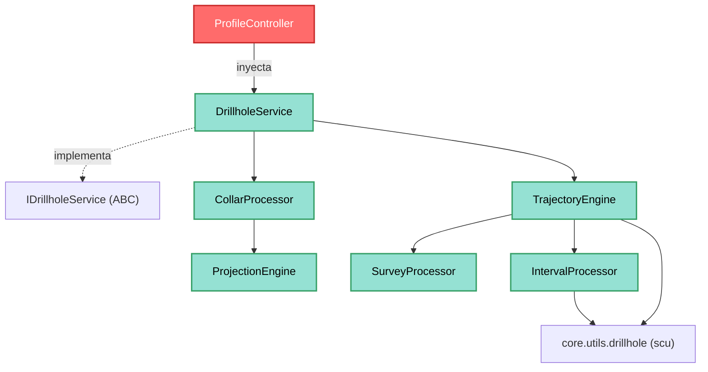

---
tags:
  - secinterp
  - code-walkthrough
  - core
  - services
aliases:
  - drillhole_service.py
  - DrillholeService
  - IDrillholeService
cssclass: secinterp-note
note_lines: 700
---

# `core/services/drillhole_service.py`

> [!abstract] Resumen en una línea
> Servicio **orquestador** de sondajes que, a partir de un `DrillholeContext` ya desacoplado, coordina cuatro procesadores puros (collar, survey, intervalo, trayectoria) para devolver `(geol_data, drillhole_data)` sin tocar QGIS.

**Ruta**: `core/services/drillhole_service.py` (113 líneas)
**Clase principal**: `DrillholeService(IDrillholeService, TranslatableMixin)`
**Capa**: Core (QGIS-agnóstico)
**Tags**: #secinterp #core #services

---

## 🎯 ¿Por qué existe este archivo?

Proyectar un sondaje sobre una sección es una cadena de cálculos (collar → profundidad
final → trayectoria → interpolación de intervalos) que no debe vivir en la GUI. Este
servicio centraliza esa orquestación sobre datos **desacoplados**:

| Problema | Solución |
|----------|----------|
| Coordinar 4 subsistemas de cálculo en un solo punto | `DrillholeService` como fachada sobre `CollarProcessor`, `SurveyProcessor`, `IntervalProcessor` y `TrajectoryEngine` |
| No acoplar el core a capas QGIS | Recibe `DrillholeContext` (salida del `DrillholeExtractor`), no `QgsVectorLayer` |
| Propagar progreso/cancelación en tareas de fondo | Parámetro `feedback: Any | None` (duck-typed `isCanceled()`/`setProgress()`) |
| Mantener compatibilidad de construcción | `data_fetcher` se conserva en el constructor aunque no se usa |

> [!important] Nota arquitectónica
> **QGIS-agnóstico verificado**: ni un solo `import qgis.*`. El patrón es
> **Extract-then-Compute**: la GUI produce el contexto (Extract) y este servicio lo
> computa (Compute). Además actúa como **Facade** sobre el subsistema `drillhole/`.

---

## 🧬 Diagrama de relaciones



> [!tip] Cómo leer
> Flecha sólida = importa/delega; punteada = implementa contrato. `TrajectoryEngine`
> es el motor central que consume `SurveyProcessor` e `IntervalProcessor`; el servicio
> solo orquesta el bucle sobre collares y delega en él.

---

## 📦 Imports — lectura arquitectónica

```python
# core/services/drillhole_service.py
from typing import Any

from sec_interp.core.domain import DrillholeProjection, GeologySegment
from sec_interp.core.domain.task_inputs import DrillholeContext
from sec_interp.core.exceptions import SecInterpError
from sec_interp.core.interfaces.drillhole_interface import IDrillholeService
from sec_interp.core.services.drillhole.collar_processor import CollarProcessor
from sec_interp.core.services.drillhole.interval_processor import IntervalProcessor
from sec_interp.core.services.drillhole.survey_processor import SurveyProcessor
from sec_interp.core.services.drillhole.trajectory_engine import TrajectoryEngine
from sec_interp.core.utils.i18n import TranslatableMixin
from sec_interp.logger_config import get_logger
```

| # | Observación |
|---|-------------|
| ① | **Cero `qgis.*`**: solo `typing`, dominio, interfaces y el subsistema `drillhole/`. |
| ② | Importa el contrato `IDrillholeService` y lo **implementa** (herencia nominal). |
| ③ | Los 4 colaboradores (`CollarProcessor`, `SurveyProcessor`, `IntervalProcessor`, `TrajectoryEngine`) vienen de `core/services/drillhole/`. |
| ④ | `TranslatableMixin` aporta `self.tr()` para mensajes localizados sin importar Qt. |
| ⑤ | `DrillholeContext` es el DTO de entrada (producido por el `DrillholeExtractor` de la GUI). |

---

## 🏗️ Inventario de estructura

**Clases:** `class DrillholeService(IDrillholeService, TranslatableMixin)` — 2 métodos

**Atributos (inyectados/compuestos):**
- `self.collar_processor` — `CollarProcessor` (proyección de collares)
- `self.survey_processor` — `SurveyProcessor` (profundidad final)
- `self.interval_processor` — `IntervalProcessor` (interpolación de intervalos)
- `self.data_fetcher` — `Any | None` (conservado por compatibilidad, sin uso)
- `self.trajectory_engine` — `TrajectoryEngine` (trayectoria + resultado)

**Métodos:**
- `__init__(collar_processor, survey_processor, interval_processor, data_fetcher, trajectory_engine)`
- `process_context(context, feedback=None) -> tuple[list[GeologySegment], list[DrillholeProjection]] | None`

---

## 📖 Recorrido método por método

### `__init__` — Inyección de dependencias (Facade)

```python
def __init__(
    self,
    collar_processor: CollarProcessor | None = None,
    survey_processor: SurveyProcessor | None = None,
    interval_processor: IntervalProcessor | None = None,
    data_fetcher: Any | None = None,
    trajectory_engine: TrajectoryEngine | None = None,
) -> None:
    self.collar_processor = collar_processor or CollarProcessor()
    self.survey_processor = survey_processor or SurveyProcessor()
    self.interval_processor = interval_processor or IntervalProcessor()
    self.data_fetcher = data_fetcher
    self.trajectory_engine = trajectory_engine or TrajectoryEngine()
```

Cada colaborador es **inyectable** y, si es `None`, se instancia su implementación por
defecto (`or CollarProcessor()`). Esto permite tests con mocks y composición flexible.

> [!note] `data_fetcher` es un residuo de compatibilidad
> El docstring lo declara explícitamente *"Kept for backward-compatible construction
> (unused)"*. El `ProfileController` lo pasa por constructor, pero el servicio ya no lo
> consulta: el contexto llega **pre-extraído**.

### `process_context` — Cálculo principal

```python
def process_context(
    self, context: DrillholeContext, feedback: Any | None = None
) -> tuple[list[GeologySegment], list[DrillholeProjection]] | None:
    geol_data_all: list[GeologySegment] = []
    drillhole_data_all: list[DrillholeProjection] = []
    total = len(context.collar_data)

    for i, collar in enumerate(context.collar_data):
        if feedback and feedback.isCanceled():
            return None

        proj = self.collar_processor.extract_and_project_detached(
            collar, context.line_points, context.buffer_width,
            context.collar_id_field, context.collar_z_field,
            context.collar_depth_field, context.pre_sampled_z,
        )
        if proj:
            hole_id = proj.hole_id
            point = collar.get("point")
            surveys = context.survey_data.get(hole_id, [])
            intervals = context.interval_data.get(hole_id, [])
            try:
                hole_geol, hole_tuple = self.trajectory_engine.process_single_hole(
                    hole_id, point, proj.elevation, proj.total_depth,
                    surveys, intervals, context.line_points,
                    context.buffer_width, context.section_azimuth,
                )
                geol_data_all.extend(hole_geol)
                drillhole_data_all.append(hole_tuple)
            except (ValueError, TypeError, KeyError) as e:
                logger.exception(self.tr("Data error in hole {0}: {1}").format(hole_id, e))
            except SecInterpError as e:
                logger.exception(self.tr("Processing error in hole {0}: {1}").format(hole_id, e))

        if feedback:
            feedback.setProgress((i / total) * 100)

    return geol_data_all, drillhole_data_all
```

| Paso | Detalle |
|------|---------|
| **Cancelación** | `feedback.isCanceled()` al inicio de cada collar → `return None` (cooperativa) |
| **Proyección collar** | `extract_and_project_detached` devuelve `None` si el collar queda fuera del buffer |
| **Datos por pozo** | `survey_data` / `interval_data` indexados por `hole_id` (`dict.get(..., [])`) |
| **Trayectoria** | `process_single_hole` devuelve `(hole_geol, hole_tuple)` |
| **Tolerancia a fallos** | Un pozo malo **no aborta** el bucle: se loguea y se continúa |
| **Progreso** | `setProgress((i/total)*100)` tras cada collar |

> [!important] Fallo por-pozo, no por-lote
> Los `except` están **dentro** del bucle: un collar corrupto o una trayectoria inválida
> se registran con `logger.exception` y no interrumpen el procesamiento del resto. Es
> robustez ante datos geológicos sucios.

---

## 🔄 Flujo de datos

| Fase | Entrada | Transformación | Salida |
|------|---------|----------------|--------|
| Contexto | `DrillholeContext` (collars, surveys, intervals) | — | — |
| Collar | `collar` + `line_points` + `buffer_width` | `extract_and_project_detached` | `DrillholeProjection` (o `None`) |
| Trayectoria | `hole_id`, punto, elev, profundidad, surveys | `process_single_hole` | `(hole_geol, hole_tuple)` |
| Agregación | listas parciales | `extend` / `append` | `(geol_data_all, drillhole_data_all)` |

---

## 🏛️ Patrones de diseño presentes

| Patrón | Dónde | Propósito |
|--------|-------|-----------|
| **Facade** | `DrillholeService` | Oculta el subsistema `drillhole/` (4 clases) tras `process_context` |
| **Dependency Injection** | `__init__` | Colaboradores inyectables con defaults (`or ...()`) |
| **Template (contrato)** | `IDrillholeService` | Fija la firma `process_context` |
| **Extract-then-Compute** | `DrillholeContext` | El contexto es puro; el core solo computa |
| **Fault tolerance (por ítem)** | `try/except` en bucle | Un pozo fallido no tumba el lote |

---

## 🧾 Resumen de la API

| Símbolo | Firma / Hereda | Uso típico |
|---------|----------------|------------|
| `DrillholeService` | `IDrillholeService, TranslatableMixin` | Servicio de sondajes |
| `__init__` | `(collar_processor, survey_processor, interval_processor, data_fetcher, trajectory_engine)` | DI |
| `process_context` | `(context: DrillholeContext, feedback=None) -> tuple[...] | None` | Cálculo principal |

---

## 🛡️ Manejo de errores

| Situación | Comportamiento |
|-----------|----------------|
| Cancelación (`feedback.isCanceled()`) | `return None` inmediato |
| Dato inválido (`ValueError`, `TypeError`, `KeyError`) | `logger.exception` + continúa |
| Error de dominio (`SecInterpError`) | `logger.exception` + continúa |
| Collar fuera de buffer | `extract_and_project_detached` → `None`, se salta |

> [!tip] No se relanzan excepciones
> El servicio decide **degradar con gracia**: registra el error de cada pozo y sigue.
> Solo la cancelación provoca un retorno temprano (`None`), nunca una excepción.

---

## 🧪 Tests asociados

Mapeo a `tests/core/test_drillhole_service.py` y complementos (mock-first, sin QGIS):

- `test_drillhole_service.py` — orquestación del bucle y agregación de resultados.
- `test_drillhole_service_optional.py` — comportamiento con componentes opcionales.
- `tests/core/services/test_drillhole_engine_crash.py` — robustez ante `SecInterpError`/datos corruptos.
- `tests/core/services/drillhole/` — tests del subsistema (collar, survey, intervalo, trayectoria).

---

## 👀 Observaciones y notas

> [!success] Fortalezas
> - **Cero QGIS**: testeable sin entorno QGIS; cumple la frontera del core al 100%.
> - Fallo por-pozo: datos sucios no abortan el lote completo.
> - DI limpia con defaults, fácil de mockear.
> - Feedback cooperativo (`isCanceled`/`setProgress`) sin acoplar a `QgsTask`.

> [!warning] Puntos de atención
> - `data_fetcher` se conserva pero no se usa: candidato a eliminación en v4.
> - `logger.exception` en `except` imprime traceback aunque sea un error de *dato* (ruido de log).
> - El retorno `tuple[...] | None` mezcla "cancelado" (`None`) con "sin datos" (listas vacías): semántica ambigua.
> - `process_context` crece linealmente con el nº de collares; sin progreso ponderado por coste real.

> [!question] Preguntas abiertas
> - ¿Eliminar `data_fetcher` del constructor al romper la compatibilidad?
> - ¿Diferenciar "cancelado" de "vacío" con un resultado tipado en lugar de `None`?
> - ¿Reducir a `logger.warning` (sin traceback) los `ValueError/TypeError/KeyError` esperados?

---

## 📐 Contexto y DTOs del dominio

`process_context` firma su entrada con el DTO `DrillholeContext` (`core/domain/task_inputs.py`),
producido por el `DrillholeExtractor` de la GUI. Cada campo es un tipo primitivo o
contenedor de primitivos:

| Campo | Tipo | Significado |
|-------|------|-------------|
| `line_points` | `list[Point2D]` | Vértices de la sección `(x, y)` |
| `section_azimuth` | `float` | Orientación de la sección en grados |
| `buffer_width` | `float` | Buffer máximo de proyección horizontal |
| `collar_id_field` | `str` | Campo de ID del collar |
| `collar_z_field` | `str` | Campo de elevación del collar |
| `collar_depth_field` | `str` | Campo de profundidad total |
| `collar_data` | `list[dict]` | Collares desacoplados `{"id", "point", "attributes"}` |
| `survey_data` | `dict[Any, list[tuple]]` | `hole_id -> [(depth, azim, incl)]` |
| `interval_data` | `dict[Any, list[tuple]]` | `hole_id -> [(from, to, lith)]` |
| `pre_sampled_z` | `dict[Any, float]` | `hole_id -> elevación de collar pre-muestreada` |

> [!important] La frontera Extract-then-Compute
> Ningún campo es un `QgsFeature` ni una `QgsVectorLayer`. Todo llega ya convertido por el
> extractor: el servicio solo consume tuplas, dicts y `Point2D`.

## 🧩 El subsistema `drillhole/`

`DrillholeService` delega en 4 colaboradores que viven en `core/services/drillhole/`:

| Colaborador | Responsabilidad | Detalle |
|-------------|-----------------|---------|
| `CollarProcessor` | Proyección de collares | `extract_and_project_detached` usa `ProjectionEngine.project_point_to_line` y filtra por `offset <= buffer_width` |
| `SurveyProcessor` | Profundidad final | `determine_final_depth = max(given_depth, max survey, max interval)` |
| `TrajectoryEngine` | Trayectoria + resultado | `process_single_hole` orquesta survey, trayectoria (`scu`) e intervalos |
| `IntervalProcessor` | Interpolación de intervalos | `interpolate_hole_intervals` convierte tuplas en `GeologySegment` |

> [!tip] Cadena de responsabilidades
> El flujo completo por pozo es: `CollarProcessor` (¿está dentro del buffer?) →
> `SurveyProcessor` (¿qué profundidad?) → `TrajectoryEngine` (¿dónde va la trayectoria?) →
> `IntervalProcessor` (¿qué litología en cada tramo?).

## 📊 Rendimiento y escalado

| Aspecto | Análisis |
|---------|----------|
| **Complejidad** | `O(collars × survey_points × intervals)` por pozo |
| **Progress** | `setProgress((i/total)*100)` lineal en nº de collares, sin ponderar coste |
| **Memoria** | Acumula `geol_data_all` (lista de `GeologySegment`) y `drillhole_data_all` |
| **Thread-safety** | Sin estado compartido mutable entre pozos; `feedback` solo se consulta |

> [!warning] Sin chunking
> Para miles de collares el bucle es secuencial y sin ventana de proceso; el feedback se
> actualiza por collar, no por trabajo real. Un candidato a paralelizar en v4.

## 🔄 Feedback y cancelación cooperativa

El contrato `IDrillholeService.process_context(context, feedback=None)` recibe un
`feedback` tipado `Any` (duck-typed):

| Método del feedback | Uso en este servicio |
|---------------------|----------------------|
| `isCanceled()` | chequeo al inicio de cada collar → `return None` |
| `setProgress(int)` | avance `(i/total)*100` tras cada collar |

> [!note] Por qué `Any` y no `QgsTask`
> Tipar `QgsTask` obligaría a importar `qgis.core` en el servicio, rompiendo la regla del
> core. `Any` + duck typing mantiene la frontera limpia (ver [[core_interfaces]]).

## 🔄 Ciclo de vida y composición

El servicio lo instancia el `ProfileController` vía `SafeLoader.lazy_load` con los 4
colaboradores inyectados (ver [[controller]]):

```python
self.drillhole_service = SafeLoader.lazy_load(
    "...drillhole_service", "DrillholeService",
    collar_processor=self.collar_processor,
    survey_processor=self.survey_processor,
    interval_processor=self.interval_processor,
    data_fetcher=self.data_fetcher,
    trajectory_engine=self.trajectory_engine,
)
```

| Fase | Detalle |
|------|---------|
| **Composition root** | la GUI/controller resuelve los colaboradores |
| **Carga** | `SafeLoader.lazy_load` falla suave si el módulo no está disponible |
| **Ejecución** | `process_context` se llama desde `_process_drillholes` |
| **Retorno** | solo se usa el segundo elemento: `_, drillhole_data = ...` |

> [!note] Carga lazy
> `SafeLoader.lazy_load` permite que el servicio sea opcional: si el módulo falta, no
> revienta el plugin. El `controller` lo trata como servicio opcional.

## 🔗 Notas relacionadas

- [[Index]] — índice de la bóveda
- [[controller]] — instancia el servicio vía `SafeLoader.lazy_load` e inyecta los 4 colaboradores
- [[core_interfaces]] — contrato `IDrillholeService`
- [[task_inputs]] — DTO `DrillholeContext`
- [[entities]] — `DrillholeProjection`, `GeologySegment`
- [[collar_processor]] / [[trajectory_engine]] — subsistemas delegados
- [[drillhole]] — utilidades de trayectoria (`scu`)
- [[core_services_drillhole]] — nota de grupo del subsistema `drillhole/`
- [[exceptions]] — `SecInterpError`

---

*Nota de la bóveda SecInterp Code Walkthrough v2 — v3.8.0*
