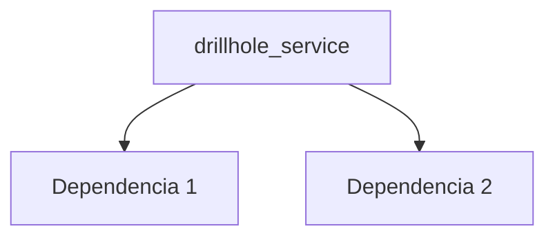

---
tags:
  - secinterp
  - code-walkthrough
  - core      # core | gui | exporters
  - services     # services | managers | renderers | adapters | validation | etc.
aliases:
  - drillhole_service.py  # ej. path_resolver.py
  - drillhole_service     # ej. resolve_export_path
cssclass: secinterp-note
note_lines: 700
---

# `core/services/drillhole_service.py`

> [!abstract] Resumen en una línea
> Drillhole Data Processing Service (pure computation). — qué hace este módulo en una frase, sin tocar QGIS si es core.

**Ruta**: `core/services/drillhole_service.py` (113 líneas)
**Clase/Función principal**: `drillhole_service`
**Capa**: core (QGIS-agnóstico / GUI · Tipo)
**Tags**: #secinterp #core #services

---

## 🎯 ¿Por qué existe este archivo?

| Problema | Solución |
|----------|----------|
| (pendiente) | (pendiente) |
| (pendiente) | (pendiente) |

> [!important] Nota arquitectónica
> QGIS-agnóstico (p. ej. "QGIS-agnóstico", "Adapter Extract", "Factory").

---

## 🧬 Diagrama de relaciones



> [!tip] Cómo leer
> Flecha sólida = importa/delega; punteada = callback/injectado.

---

## 📦 Imports — lectura arquitectónica

```python
# drillhole_service.py
from __future__ import annotations
from typing import Any
from sec_interp.core.domain import DrillholeProjection, GeologySegment
from sec_interp.core.domain.task_inputs import DrillholeContext
from sec_interp.core.exceptions import SecInterpError
from sec_interp.core.interfaces.drillhole_interface import IDrillholeService
from sec_interp.core.services.drillhole.collar_processor import CollarProcessor
from sec_interp.core.services.drillhole.interval_processor import IntervalProcessor
```

| # | Observación |
|---|-------------|
| ① | (pendiente) |
| ② | (pendiente) |

---

## 🏗️ Inventario de estructura

**Clases:** `class DrillholeService` — 2 métodos
**Funciones/Métodos:**
- `DrillholeService.__init__(def __init__(self, collar_processor: CollarProcessor | None=None, survey_processor: SurveyProcessor | None=None, interval_processor: IntervalProcessor | None=None, data_fetcher: Any | None=None, trajectory_engine: TrajectoryEngine | None=None) -> None:)`
- `DrillholeService.process_context(def process_context(self, context: DrillholeContext, feedback: Any | None=None) -> tuple[list[GeologySegment], list[DrillholeProjection]] | None:)`

---

## 📁 Archivos del paquete

- `drillhole_service.py` — nota individual de este archivo.

---

## 📖 Recorrido método por método

### `método_1`

```python
# (enriquecer)
```

_(enriquecer leyendo el fuente)_

### `método_2`

```python
# (enriquecer)
```

_(enriquecer leyendo el fuente)_

<!-- Añade una subsección por cada método público del módulo -->

---

## 🔄 Flujo de datos

| Fase | Entrada | Transformación | Salida |
|------|---------|----------------|--------|
| - | - | - | - |
| - | - | - | - |

---

## 🏛️ Patrones de diseño presentes

| Patrón | Dónde | Propósito |
|--------|-------|-----------|
| - | - | - |

---

## 🧾 Resumen de la API

| Símbolo | Firma / Hereda | Uso típico |
|---------|----------------|------------|
| (no symbols) | `-` | - |

---

## 🛡️ Manejo de errores

_(pendiente)_

---

## 🧪 Tests asociados

_(pendiente)_

---

## 👀 Observaciones y notas

> [!success] Fortalezas
> - (skeleton)

> [!warning] Puntos de atención
> - (skeleton)

> [!question] Preguntas abiertas
> - (skeleton)

---

## 🔗 Notas relacionadas

- [[Index]] — índice de la bóveda
- [[Index]] — índice
- [[controller]] — orquestador

---

*Nota de la bóveda SecInterp Code Walkthrough v2 — v3.8.0*
