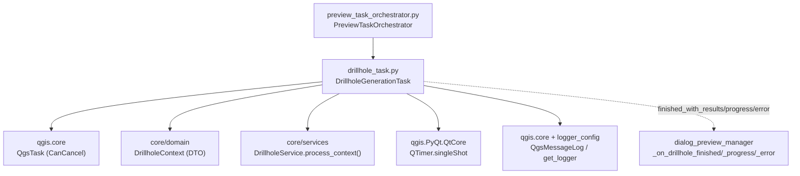
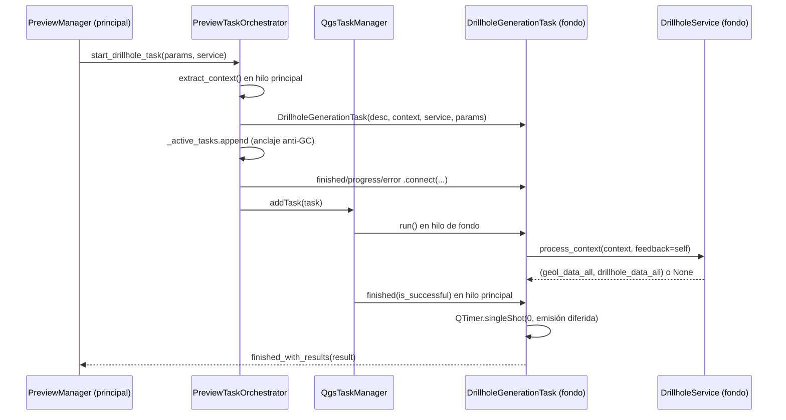

---
tags:
  - secinterp
  - code-walkthrough
  - gui
  - tasks
aliases:
  - drillhole_task.py
  - DrillholeGenerationTask
cssclass: secinterp-note
---

# `gui/tasks/drillhole_task.py`

> [!abstract] Resumen en una línea
> `QgsTask` cancelable que proyecta sondajes en segundo plano con DTOs desconectados (`DrillholeContext` + `DrillholeService`), emite resultados diferidos al hilo principal y nunca toca objetos QGIS vivos en el worker.

**Ruta**: `gui/tasks/drillhole_task.py` (107 líneas)
**Clase principal**: `DrillholeGenerationTask(QgsTask)`
**Capa**: GUI · Tasks (puente hilo de fondo → hilo principal; cómputo en `core/`)
**Tags**: #secinterp #gui #tasks

---

## 🎯 ¿Por qué existe este archivo?

Proyectar sondajes (collares, surveys, tramos, intersección con la sección) puede tardar segundos: hacerlo en el hilo principal congelaría QGIS y violaría la regla de > 100 ms en `QgsTask`.

| Problema | Solución |
|----------|----------|
| El cálculo de sondajes bloquea la UI | `run()` en hilo de fondo con `DrillholeService.process_context()` |
| Pasar `QgsVectorLayer` al hilo revienta (objetos QGIS no son thread-safe) | El task solo recibe el DTO desconectado `DrillholeContext` + servicio stateless |
| La UI necesita progreso, cancelación, resultados y errores | `feedback=self` (el task es su propio feedback), 3 señales, `finished()` en hilo principal |
| Emitir la señal en `finished()` puede colisionar con el render de geología | Emisión diferida con `QTimer.singleShot(0, ...)` al siguiente ciclo del event loop |

> [!important] Nota arquitectónica
> Patrón **Extract-then-Compute en dos hilos**: `PreviewTaskOrchestrator.start_drillhole_task()` extrae el contexto en el hilo principal (vía `drillhole_extractor`), el task computa en fondo, y `finished()` devuelve la tupla `(geol_data_all, drillhole_data_all)` al manager. Ver [[preview_task_orchestrator]] y [[drillhole_service]].

---

## 🧬 Diagrama de relaciones



> [!tip] Cómo leer
> Flecha sólida = importa/delega; punteada = señales Qt hacia el manager. El orquestador crea el task, lo ancla contra el GC y lo registra en `QgsApplication.taskManager()`.

---

## 📦 Imports — lectura arquitectónica

```python
# gui/tasks/drillhole_task.py
from __future__ import annotations

from typing import TYPE_CHECKING, Any

from qgis.core import Qgis, QgsMessageLog, QgsTask
from qgis.PyQt.QtCore import QTimer, pyqtSignal

from sec_interp.core.domain import DrillholeContext
from sec_interp.logger_config import get_logger

if TYPE_CHECKING:
    from sec_interp.core.services.drillhole_service import DrillholeService
```

| # | Observación |
|---|-------------|
| ① | `TYPE_CHECKING` para `DrillholeService`: el servicio solo existe como anotación; en runtime el task lo trata como objeto con `process_context()`. Cero import circular GUI↔core. |
| ② | `DrillholeContext` sí se importa en runtime (el DTO viaja de verdad en el constructor). |
| ③ | `Qgis` + `QgsMessageLog`: los errores del worker también quedan en el panel de mensajes de QGIS (`"SecInterp"`, nivel `Critical`). |
| ④ | `QTimer.singleShot(0, ...)` — emisión diferida: el `finished()` programa el `emit` para el próximo ciclo en vez de emitir en caliente. |
| ⑤ | `Any` para `params` (compatibilidad histórica) y `result`: la tupla resultado no tiene DTO con nombre en esta versión. |

---

## 🏗️ Inventario de estructura

**Clases (1):** `DrillholeGenerationTask(QgsTask)` — 3 señales + 4 métodos.

**Señales:**

| Señal | Payload | Quién conecta (orquestador) |
|-------|---------|-----------------------------|
| `finished_with_results` | `object` (tupla `(geol_data_all, drillhole_data_all)`) | `manager._on_drillhole_finished` |
| `error_occurred` | `str` | `manager._on_drillhole_error` |
| `progress_changed` | `float` | `manager._on_drillhole_progress` |

**Estado:**

| Atributo | Tipo | Rol |
|----------|------|-----|
| `service` | `DrillholeService` | Lógica stateless inyectada |
| `context` | `DrillholeContext` | DTO desconectado (único dato del worker) |
| `params` | `Any` | Params originales (compatibilidad) |
| `result` | `Any \| None` | Tupla resultado o `None` |
| `exception` | `Exception \| None` | Excepción capturada en `run()` |

**Métodos:**

| Método | Firma | Hilo | Rol |
|--------|-------|------|-----|
| `__init__` | `(description: str, context: DrillholeContext, service: DrillholeService, params: Any) -> None` | Principal | Registra `CanCancel`, guarda DTO + servicio |
| `run` | `() -> bool` | **Fondo** | `process_context(context, feedback=self)`; `True`/`False` |
| `finished` | `(is_successful: bool) -> None` | Principal | Normaliza, emite diferido o reporta error |
| `setProgress` | `(progress: float) -> None` | Fondo→Principal | Puentea a `progress_changed` para la barra de progreso |

---

## 📁 Archivos del paquete

| Archivo | Líneas | Rol |
|---|--:|---|
| `drillhole_task.py` | 107 | Esta nota: task de sondajes |
| `geology_task.py` | 101 | Hermano: task de geología (`build_segments`, lista de segmentos) |
| `__init__.py` | — | Marcador de paquete |

---

## 📖 Recorrido método por método

### `__init__`

```python
def __init__(
    self,
    description: str,
    context: DrillholeContext,
    service: DrillholeService,
    params: Any,
) -> None:
    super().__init__(description, QgsTask.Flag.CanCancel)
    self.service = service
    self.context = context
    self.params = params
    self.result: Any | None = None
    self.exception: Exception | None = None
```

El flag `CanCancel` habilita la cancelación cooperativa: el servicio consulta `feedback.isCanceled()` durante la proyección. Nada de QGIS vivo entra aquí: `context` son listas/dicts/WKT ya extraídos, `service` es stateless y thread-safe.

### `run` (hilo de fondo)

```python
def run(self) -> bool:
    try:
        logger.info("DrillholeGenerationTask started (Background Thread)")
        self.result = self.service.process_context(self.context, feedback=self)

        count = 0
        if self.result and len(self.result) > 1:
            # result[1] is drillhole_data_list
            count = len(self.result[1])

        logger.info(f"DrillholeGenerationTask finished with {count} holes")
        return True

    except Exception as e:
        logger.error(f"Error in DrillholeGenerationTask: {e}", exc_info=True)
        self.exception = e
        return False
```

Se pasa a sí mismo como `feedback`: expone `isCanceled()` y `setProgress()` al core sin importar nada de Qt en el servicio (duck typing sobre `Any`). El conteo defensivo (`len(self.result) > 1`) evita `IndexError` si el servicio devuelve una tupla corta; `count` es solo para el log. Cualquier excepción se guarda y convierte en `False`: **nunca** se propaga cruda desde el worker.

> [!warning] Nada de GUI en `run()`
> Ni `iface`, ni widgets, ni `layer.setRenderer()`, ni siquiera `QgsMessageLog` aquí (ese vive en `finished()`). Violarlo cuelga o crashea QGIS. La guía del `gui/AGENTS.md` lo marca como condición de parada.

### `finished` (hilo principal)

```python
def finished(self, is_successful: bool) -> None:
    try:
        if is_successful:
            if self.result is None:
                self.result = ([], [])

            res_type = type(self.result)
            res_len = len(self.result) if isinstance(self.result, tuple | list) else "N/A"
            # Defer emission to next event loop cycle to avoid race conditions with geology render
            QTimer.singleShot(0, lambda: self.finished_with_results.emit(self.result))
        elif self.exception:
            error_msg = str(self.exception)
            QgsMessageLog.logMessage(
                f"Drillhole Task Failed: {error_msg}",  # no-i18n: developer log tag
                "SecInterp",
                Qgis.MessageLevel.Critical,
            )
            self.error_occurred.emit(error_msg)
    except Exception as e:
        logger.exception(f"Critical error in DrillholeGenerationTask.finished: {e}")
```

Tres ramas: éxito (normaliza `None` a `([], [])` para que el manager siempre reciba tupla), fallo con excepción (log + mensaje QGIS + señal de error), y red de seguridad que captura hasta fallos del propio handler. La emisión diferida evita la carrera con el render de geología: sin el `singleShot`, el slot de sondajes podía pisar capas mientras el task de geología aún gestionaba las suyas.

> [!note] Cancelación silenciosa
> Si el usuario cancela (`is_successful=False` sin `exception`), ninguna rama emite: el orquestador ya limpió los anclajes en `cancel_active_tasks()`. Correcto, pero el manager no recibe notificación explícita de cancelación.

### `setProgress`

```python
def setProgress(self, progress: float) -> None:
    """Override to emit signal for UI progress bar."""
    super().setProgress(progress)
    self.progress_changed.emit(progress)
```

Puentea el progreso nativo del `QgsTask` (que el core actualiza vía `feedback.setProgress()`) a la señal que la barra del diálogo escucha. Llamar a `super()` primero mantiene el estado interno que `taskManager()` y `isCanceled()` necesitan.

## ⏱️ Ciclo de vida completo



| Fase | Hilo | Responsable | Detalle |
|------|------|-------------|---------|
| Extracción | Principal | `drillhole_extractor` | Capas → `DrillholeContext` (listas, dicts, tuplas) |
| Construcción | Principal | `PreviewTaskOrchestrator` | Task + anclaje + 3 conexiones + `addTask()` |
| Cómputo | Fondo | `DrillholeService` | Bucle por collar con `isCanceled()` y `setProgress()` |
| Entrega | Principal | `finished()` | Normaliza, difiere con `singleShot(0)`, emite |
| Presentación | Principal | `PreviewManager` | `_on_drillhole_finished` → factory → capas |

> [!note] Dos cancelaciones distintas
> La **cooperativa** (el usuario pulsa cancelar y el core la detecta vía `feedback.isCanceled()`) hace que `process_context()` devuelva `None`: `run()` retorna `True` y `finished()` emite `([], [])` como "éxito vacío". La **QGIS** (`cancel_active_tasks()` → `task.cancel()`) llega a `finished(is_successful=False)` sin excepción y no emite nada. El manager no distingue "cancelado" de "vacío" en el primer caso.

## 📡 Feedback: cancelación y progreso reales

El `feedback=self` no es decorativo: el core lo usa en cada iteración del bucle por collar (`core/services/drillhole_service.py`, líneas 70–111):

```python
for i, collar in enumerate(context.collar_data):
    if feedback and feedback.isCanceled():
        return None
    # ... extract_and_project_detached + trajectory_engine.process_single_hole ...
    if feedback:
        feedback.setProgress((i / total) * 100)
```

| Mecanismo | Cómo viaja | Efecto |
|-----------|-----------|--------|
| `isCanceled()` | core → task (nativo `QgsTask`) | Aborta entre collares, devuelve `None` |
| `setProgress(0–100)` | core → `setProgress()` override → `progress_changed` | Barra del diálogo vía `_on_drillhole_progress` |
| `CanCancel` | constructor → `taskManager` | El botón cancelar de QGIS habilitado |

Cada sondaje problemático **no** aborta el lote: `process_single_hole()` está envuelto en `except (ValueError, TypeError, KeyError)` y `except SecInterpError`, ambos con `logger.exception` incluyendo el `hole_id`. El collar malo se salta y el resto continúa; el progreso sigue contando collares, no éxitos.

## ❌ Catálogo de rutas de error

| Ruta | Origen | Lo que ve el usuario |
|------|--------|----------------------|
| Excepción en `process_context()` | bug, memoria, contexto corrupto | Log con `exc_info` + panel QGIS `Critical` + `error_occurred` |
| Sondaje con datos malos | `ValueError/TypeError/KeyError` por collar | Solo log con `hole_id`; el sondaje se omite |
| `SecInterpError` por collar | validación/procesamiento del dominio | Solo log con `hole_id`; el lote continúa |
| Cancelación cooperativa | `isCanceled()` → `None` | Éxito vacío `([], [])`, sin error |
| Cancelación QGIS | `task.cancel()` | Silencio (sin emisión) |
| `finished()` lanza | bug en el handler | `logger.exception`, sin propagación |

### Contexto vacío y progreso 0–100

Si `context.collar_data` está vacío (`total = 0`), el bucle no itera: sin división por cero (el `(i / total)` solo se evalúa dentro del bucle), sin progreso emitido y resultado `([], [])` como éxito vacío.
El manager dibuja cero sondajes sin error: indistinguible de una cancelación cooperativa, y correcto en ambos casos.

| `total` | Iteraciones | `setProgress` | Resultado |
|---|---|---|---|
| 0 | ninguna | nunca | `([], [])` éxito vacío |
| N > 0 | N collares | `(i / N) * 100` por collar | tupla con N intentos |

---

## 🔄 Flujo de datos

| Fase | Hilo | Entrada | Transformación | Salida |
|------|------|---------|----------------|--------|
| Extracción | Principal | capas QGIS (collar, survey, interval, línea, ráster) | `drillhole_extractor.extract_context()` | `DrillholeContext` |
| Lanzamiento | Principal | contexto + servicio | `DrillholeGenerationTask(...)` + anclaje + `addTask()` | task encolado cancelable |
| Cómputo | Fondo | `DrillholeContext`, `feedback=self` | `process_context()` con progreso/cancelación | `(geol_data_all, drillhole_data_all)` o `exception` |
| Entrega | Principal | `result` / `exception` | normalización + `singleShot(0)` / `QgsMessageLog` | señales al `PreviewManager` |
| Presentación | Principal | tupla resultado | factory → capas → `DrillholeRenderer` | sondajes dibujados |

---

## 🏛️ Patrones de diseño presentes

| Patrón | Dónde | Propósito |
|--------|-------|-----------|
| **Background Task (QGIS)** | `QgsTask` + `taskManager().addTask()` | No bloquear la UI en cómputos largos |
| **DTO desconectado** | `DrillholeContext` | Thread-safety: el worker no ve QGIS |
| **Feedback como self** | `process_context(ctx, feedback=self)` | Progreso/cancelación sin acoplar el core a Qt |
| **Emisión diferida** | `QTimer.singleShot(0, ...)` | Evitar carreras con el render de geología |
| **Observer** | 3 señales al manager | Resultados, progreso y errores observables |
| **Anclaje anti-GC** | `_active_tasks` del orquestador | El task no muere a mitad de `run()` (Qt6) |

---

## 🧾 Resumen de la API

| Símbolo | Firma / Hereda | Uso típico |
|---------|----------------|------------|
| `DrillholeGenerationTask` | `QgsTask` (`CanCancel`) | `DrillholeGenerationTask("Drillhole Preview (Async)", context, service, params)` |
| `finished_with_results` | `pyqtSignal(object)` | Tupla `(geol_data_all, drillhole_data_all)` |
| `error_occurred` | `pyqtSignal(str)` | Mensaje de `str(exception)` |
| `progress_changed` | `pyqtSignal(float)` | Barra de progreso del diálogo |
| `run` / `finished` / `setProgress` | `() -> bool` / `(bool) -> None` / `(float) -> None` | Ciclo de vida `QgsTask` |

---

## 🛡️ Manejo de errores

| Situación | Comportamiento |
|-----------|----------------|
| Excepción en `run()` | Log con `exc_info`, `exception` guardada, retorno `False` |
| `result is None` con éxito | Normalizado a `([], [])` antes de emitir |
| `finished()` lanza | `logger.exception` (red de seguridad, no propaga) |
| Cancelación por usuario | Sin emisión; el orquestador desengancha señales y anclajes |
| Error visible | `QgsMessageLog` (`SecInterp`, `Critical`) + `error_occurred` |

---

## 🧪 Tests asociados

Cobertura GUI sin QGIS real (Mock-first, `BaseTestCase`) en `tests/gui/tasks/test_drillhole_task.py` (`TestDrillholeGenerationTask`):

- `test_initialization` — `description()`, `context`, `service`, `result`/`exception` a `None`.
- `test_run_success` — `process_context` devuelve `(["geol"], ["hole1", "hole2"])`; verifica `True`, `result` idéntico y llamada `process_context(mock_input, feedback=task)` (el task como feedback).
- `test_run_error` — `side_effect = ValueError`; verifica `False` y `exception` guardada.
- Tests de `finished()`: emisión diferida (con `QTimer.singleShot` parcheado o real) y rama de error con `QgsMessageLog`.

Relacionados: `tests/gui/test_preview_task_orchestrator.py` (lanzamiento, anclaje, cancelación), `tests/core/test_drillhole_service.py` + `test_async_drillhole.py` (el cómputo que el worker invoca), `tests/core/test_drillhole_service_optional.py`.

---

## 👀 Observaciones y notas

> [!success] Fortalezas
> - Worker 100 % QGIS-agnóstico: solo DTO + servicio stateless + feedback duck-typed.
> - Cancelación cooperativa real vía `CanCancel` + `feedback.isCanceled()` en el core.
> - Emisión diferida que elimina la carrera sondajes-vs-geología.
> - Doble reporte de error (log + panel QGIS + señal): nada se pierde en silencio.

> [!warning] Puntos de atención
> - `result` tipado `Any`: la tupla `(geol_data_all, drillhole_data_all)` merecería un DTO con nombre.
> - La cancelación no emite señal: el manager no distingue "cancelado" de "nunca lanzado".
> - `params` viaja sin usarse en el worker (compatibilidad histórica): peso muerto en el constructor.
> - El `lambda` del `singleShot` captura `self`: si el task se destruye antes del tick, el `emit` cae al vacío (el anclaje del orquestador lo mitiga).

> [!question] Preguntas abiertas
> - ¿Tipar `result` como `tuple[GeologyData, list[DrillholeProjection]]`?
> - ¿Emitir una señal explícita de cancelación para que el manager restaure la UI?

---

## 🔗 Notas relacionadas

- [[Index]] — índice de la bóveda
- [[gui_tasks]] — nota de familia de tasks en segundo plano
- [[geology_task]] — task hermano (misma forma, distinto servicio/resultado)
- [[preview_task_orchestrator]] — crea, ancla, cancela y conecta este task
- [[drillhole_service]] — `process_context()`: el cómputo que corre en fondo
- [[drillhole_extractor]] — produce el `DrillholeContext` en el hilo principal
- [[drillhole_renderer]] — viste los resultados una vez entregados
- [[controller]] — orquesta servicios y caché en el core

---

*Nota de la bóveda SecInterp Code Walkthrough v2 — v3.9.1*
