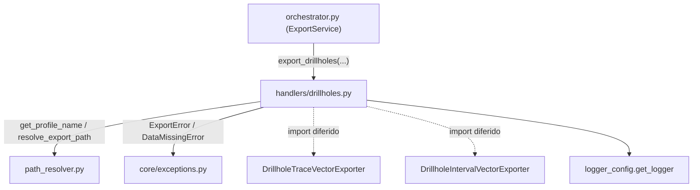

---
tags:
  - secinterp
  - code-walkthrough
  - core
  - export
  - handlers
aliases:
  - drillholes.py
  - export_drillholes
cssclass: secinterp-note
---

# `core/services/export/handlers/drillholes.py`

> [!abstract] Resumen en una línea
> Handler de exportación **2D** de sondajes: trazas (polilíneas) e intervalos (litología) como capas vectoriales, resolviendo rutas por perfil y traduciendo fallos a `ExportError`.

**Ruta**: `core/services/export/handlers/drillholes.py` (70 líneas)
**Función principal**: `export_drillholes`
**Capa**: Core (QGIS-agnóstico)
**Tags**: #secinterp #core #export #handlers

---

## 🎯 ¿Por qué existe este archivo?

Los sondajes proyectados sobre la sección deben persistirse como dos capas
distintas (la **traza** de la perforación y los **intervalos** litológicos) para
que el usuario pueda consumirlos en un GIS. Ese trabajo de composición de rutas,
instanciación de exporters y reporte de resultados no debe vivir en el orquestador.

| Problema | Solución |
|----------|----------|
| Dos capas por exportar (traza + intervalos) | Dos bloques de exportación encadenados |
| Nomenclatura uniforme de archivos | `resolve_export_path` con `base_name` lógico |
| Fallos de escritura heterogéneos | `try/except` que los normaliza a `ExportError` |

> [!important] Nota arquitectónica
> QGIS-agnóstico: recibe `data` y `crs` ya desacoplados (tipados `Any`). Importa los
> exporters de forma **diferida** y delega en `path_resolver` para la nomenclatura.

---

## 🧬 Diagrama de relaciones



> [!tip] Cómo leer
> Sólida = import estático; punteada = import diferido dentro de la función. El
> handler se apoya en `path_resolver` (hoja) y en la jerarquía de excepciones.

---

## 📦 Imports — lectura arquitectónica

```python
# core/services/export/handlers/drillholes.py
from __future__ import annotations

from pathlib import Path
from typing import Any

from sec_interp.core.exceptions import DataMissingError, ExportError
from sec_interp.core.services.export.path_resolver import get_profile_name, resolve_export_path
from sec_interp.logger_config import get_logger
```

```python
# imports diferidos (dentro de export_drillholes)
from sec_interp.exporters import (
    DrillholeIntervalVectorExporter,
    DrillholeTraceVectorExporter,
)
```

| # | Observación |
|---|-------------|
| ① | `DataMissingError` y `ExportError` llegan de `core.exceptions` — jerarquía propia. |
| ② | Ninguna importación de `qgis.*`: el `crs` viaja como `Any`. |
| ③ | `DataMissingError` se captura para envolverlo como `ExportError` (normalización). |
| ④ | Import diferido de exporters: se cargan solo si hay datos que exportar. |

---

## 🏗️ Inventario de estructura

**Funciones/Métodos:**
- `export_drillholes(folder, data, crs, msg, controller, settings, ext) -> None`

**Dependencias de dominio:**
- `DrillholeTraceVectorExporter`, `DrillholeIntervalVectorExporter` (de `sec_interp.exporters`)

Una función pública. Estructura lineal: guard → resolver traza → exportar → resolver
intervalos → exportar → normalizar errores.

---

## 📖 Recorrido método por método

### `export_drillholes`

```python
def export_drillholes(
    folder: Path,
    data: list[Any] | None,
    crs: Any,
    msg: list[str],
    controller: Any | None,
    settings: Any | None,
    ext: str,
) -> None:
    """Export drillhole data (2D traces + intervals)."""
    if not data:
        return
    from sec_interp.exporters import (
        DrillholeIntervalVectorExporter,
        DrillholeTraceVectorExporter,
    )

    logger.info("✓ Saving drillhole data...")
```

**Guard + import diferido**: si no hay sondajes (`data` vacío/`None`) sale de
inmediato. El import de exporters se hace aquí para no pagar su coste en rutas sin
sondajes. El `logger.info` marca el inicio de la fase en el log.

```python
    try:
        profile_name = get_profile_name(controller)
        pattern = getattr(settings, "naming_pattern", None) if settings else None

        traces_path, traces_layer = resolve_export_path(
            folder, "drillhole_traces", profile_name, pattern, ext
        )
        traces_exporter = DrillholeTraceVectorExporter({})
        traces_ok = traces_exporter.export(
            traces_path,
            {"drillhole_data": data, "crs": crs},
            layer_name=traces_layer,
        )
        if traces_ok:
            msg.append(f"  - {traces_path.relative_to(folder)}")
        else:
            logger.warning(f"Failed to write drillhole traces to {traces_path}")
```

**Traza 2D**: resuelve ruta con `base_name="drillhole_traces"`, instancia
`DrillholeTraceVectorExporter({})` y exporta el payload `{"drillhole_data", "crs"}`.
El nombre lógico de capa (`traces_layer`) se separa del path físico.

```python
        intervals_path, intervals_layer = resolve_export_path(
            folder, "drillhole_intervals", profile_name, pattern, ext
        )
        intervals_exporter = DrillholeIntervalVectorExporter({})
        intervals_ok = intervals_exporter.export(
            intervals_path,
            {"drillhole_data": data, "crs": crs},
            layer_name=intervals_layer,
        )
        if intervals_ok:
            msg.append(f"  - {intervals_path.relative_to(folder)}")
        else:
            logger.warning(f"Failed to write drillhole intervals to {intervals_path}")
```

**Intervalos 2D**: el mismo patrón con `base_name="drillhole_intervals"` y el
mismo payload. El handler **no** usa `use_projected` (eso es exclusivo del 3D).

```python
    except (OSError, ValueError, TypeError, DataMissingError) as e:
        logger.exception(f"Drillhole export failed: {e}")
        raise ExportError(f"Drillhole export failed: {e!s}") from e
    except Exception as e:
        logger.exception("Unexpected system error during drillhole export")
        raise ExportError(f"Critical error exporting drillholes: {e}") from e
```

**Normalización de errores**: un `except` específico para fallos esperados
(`OSError`, `ValueError`, `TypeError`, `DataMissingError`) y otro genérico para
todo lo demás. Ambos convierten cualquier fallo en `ExportError` preservando la
causa (`from e`) y registrando el traceback vía `logger.exception`.

---

## 🔄 Flujo de datos

| Fase | Entrada | Transformación | Salida |
|------|---------|----------------|--------|
| Guard | `data` (`None`/vacío) | early return | — |
| Traza | `data`, `crs` | `DrillholeTraceVectorExporter.export` | capa de trazas + `msg` |
| Intervalos | `data`, `crs` | `DrillholeIntervalVectorExporter.export` | capa de intervalos + `msg` |
| Errores | excepción cruda | `except → ExportError` | excepción de dominio |

---

## 🏛️ Patrones de diseño presentes

| Patrón | Dónde | Propósito |
|--------|-------|-----------|
| **Guard clause** | `if not data: return` | salida temprana sin anidamiento |
| **Lazy import (deferred)** | exporters dentro de la función | ahorrar carga sin datos |
| **Facade** | función única | ocultar la orquestación de 2 capas |
| **Exception translation** | `except → ExportError` | homogeneizar fallos al dominio |
| **Builder (payload dict)** | `{"drillhole_data", "crs"}` | transportar datos desacoplados |

---

## 🧾 Resumen de la API

| Símbolo | Firma / Hereda | Uso típico |
|---------|----------------|------------|
| `export_drillholes` | `(folder, data, crs, msg, controller, settings, ext) -> None` | Exportar traza + intervalos 2D |
| `DrillholeTraceVectorExporter` | `BaseExporter` (import diferido) | Escribir la traza como vectorial |
| `DrillholeIntervalVectorExporter` | `BaseExporter` (import diferido) | Escribir intervalos como vectorial |

---

## 📐 Contrato de firma del handler

Siete parámetros, la silueta mínima de un handler del paquete (sin `csv_exporter` ni
`options`):

| Parámetro | Tipo | Rol |
|-----------|------|-----|
| `folder` | `Path` | Directorio base de salida |
| `data` | `list[Any] \| None` | Proyecciones de sondaje desacopladas |
| `crs` | `Any` | CRS de la sección (objeto QGIS tipado `Any`) |
| `msg` | `list[str]` | Acumulador de mensajes (mutado in-place) |
| `controller` | `Any \| None` | Fuente del nombre de perfil |
| `settings` | `Any \| None` | Ajustes de exportación (`naming_pattern`) |
| `ext` | `str` | Extensión de salida |

> [!note] Sin `csv_exporter`
> A diferencia de `geology.py`/`structures.py`, este handler no exporta CSV; solo dos
> capas vectoriales. Por eso su firma es más corta.

## 🔁 Invocación desde el orquestador

```python
"exp_drill": lambda: dh_h.export_drillholes(
    folder, drillhole_data, line_crs, msg,
    self.controller, export_settings, format_ext,
),
```

El `drillhole_data` es el mismo que recibe el handler 3D, pero aquí se exporta **solo**
la vista 2D (traza + intervalos vectoriales), sin variantes real/proyectado.

---

## 🛡️ Manejo de errores

Dos niveles de captura:

| Tipo capturado | Acción | Resultado |
|----------------|--------|-----------|
| `OSError`, `ValueError`, `TypeError`, `DataMissingError` | `logger.exception` + `raise ExportError(...) from e` | error de dominio con causa |
| `Exception` (resto) | `logger.exception` + `raise ExportError(...) from e` | error crítico con causa |

> [!tip] `from e` preserva la traza
> El encadenamiento `raise ExportError(...) from e` conserva la excepción original en
> `__cause__`, clave para el diagnóstico en el `QgsTask` de la GUI.

---

## 🧪 Tests asociados

- `tests/core/test_export_service.py::test_export_data_all_types` — llama a
  `DrillholeTraceVectorExporter`/`DrillholeIntervalVectorExporter` vía el orquestador.
- `tests/core/test_export_service.py::test_export_drillholes_error` — verifica que un
  fallo del exporter se traduce a `ExportError`.
- `tests/exporters/test_drillhole_export_objects.py` — objetos de datos de sondaje.
- `tests/integration/test_export_service_e2e.py` — exportación real de sondajes end-to-end.

---

## 👀 Observaciones y notas

> [!success] Fortalezas
> - Contrato de errores uniforme: todo fallo sale como `ExportError` con causa.
> - Import diferido y guard clause: coste mínimo cuando no hay sondajes.
> - Payload desacoplado, sin tipos QGIS en las firmas.

> [!warning] Puntos de atención
> - Dos bloques casi idénticos (traza/intervalos): podrían unificarse en un bucle.
> - `data: list[Any]` no documenta qué entidad espera (debería ser `DrillholeProjection`).
> - Duplica la lógica de `drillholes_3d.py` en cuanto a resolución de rutas.

> [!question] Preguntas abiertas
> - ¿Extraer un helper compartido `_export_layer(base_name, ExporterClass, payload)`?
> - ¿Tipar `data` con `list[DrillholeProjection]` para documentar el contrato real?

---

## 🔗 Notas relacionadas

- [[Index]] — índice de la bóveda
- [[core_services_export_handlers]] — paquete `handlers/` al que pertenece
- [[orchestrator]] — delega en `export_drillholes` bajo el flag `exp_drill`
- [[drillholes_3d]] — handler 3D hermano (trazas/intervalos real + proyectado)
- [[path_resolver]] — `get_profile_name` / `resolve_export_path`
- [[compat]] — `_export_drillholes` wrapper de compatibilidad
- [[drillhole]] — dominio del sondaje proyectado (`DrillholeProjection`)

---

*Nota de la bóveda SecInterp Code Walkthrough v2 — v3.9.1*
