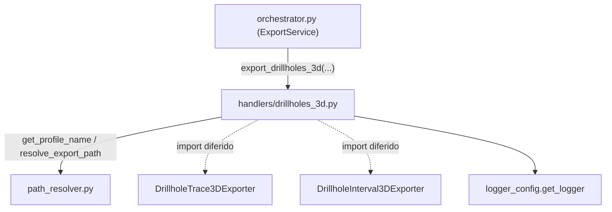

---
tags:
  - secinterp
  - code-walkthrough
  - core
  - export
  - handlers
aliases:
  - drillholes_3d.py
  - export_drillholes_3d
cssclass: secinterp-note
---

# `core/services/export/handlers/drillholes_3d.py`

> [!abstract] Resumen en una línea
> Handler de exportación **3D** de sondajes: trazas e intervalos, cada uno en dos variantes (real y proyectado), dirigidos por una tabla declarativa de tareas y activados por flags de opciones.

**Ruta**: `core/services/export/handlers/drillholes_3d.py` (82 líneas)
**Función principal**: `export_drillholes_3d`
**Capa**: Core (QGIS-agnóstico)
**Tags**: #secinterp #core #export #handlers

---

## 🎯 ¿Por qué existe este archivo?

El par 2D/3D de sondajes no cabe en un solo exporter: los datos 3D necesitan
trazas (polilíneas con Z) e intervalos (prismas litológicos), y además cada uno
admite una variante **real** y otra **proyectada** sobre el plano de sección.

| Problema | Solución |
|----------|----------|
| Cuatro salidas 3D distintas (2 tipos × 2 variantes) | Una **tabla de tareas** declarativa que las describe |
| Activar/desactivar cada salida según opciones del usuario | Doble gate por flags: `drill_3d_*` y `drill_3d_original/projected` |
| Evitar acoplar el handler a los exporters concretos | Import diferido (`from sec_interp.exporters import ...`) dentro de la función |

> [!important] Nota arquitectónica
> QGIS-agnóstico: los objetos QGIS (`crs`) viajan tipados como `Any`; el handler
> solo compone rutas y delega en los exporters. A diferencia de otros handlers,
> **no** envuelve el flujo en `try/except ExportError` (ver Manejo de errores).

---

## 🧬 Diagrama de relaciones



> [!tip] Cómo leer
> Flecha sólida = importa/delega en tiempo de importación; punteada = import
> diferido dentro de la función (evita el coste de cargar exporters si no hay datos).

---

## 📦 Imports — lectura arquitectónica

```python
# core/services/export/handlers/drillholes_3d.py
from __future__ import annotations

from pathlib import Path
from typing import Any

from sec_interp.core.services.export.path_resolver import get_profile_name, resolve_export_path
from sec_interp.logger_config import get_logger
```

```python
# imports diferidos (dentro de export_drillholes_3d)
from sec_interp.exporters import (
    DrillholeInterval3DExporter,
    DrillholeTrace3DExporter,
)
```

| # | Observación |
|---|-------------|
| ① | Solo `pathlib`, `typing` y utilidades internas: **cero** importación de `qgis.*`. |
| ② | `path_resolver` es la única dependencia interna real; el resto son exporters y logging. |
| ③ | Los exporters se importan **dentro** de la función: si no hay datos, no se cargan. |
| ④ | `Any` domina las firmas (`crs`, `controller`, `settings`, `options`) — tipado defensivo. |

---

## 🏗️ Inventario de estructura

**Funciones/Métodos:**
- `export_drillholes_3d(folder, data, crs, msg, options, controller, settings, ext) -> None`

**Datos internos:**
- `tasks: list[tuple[str, str, Any, str, bool, str]]` — tabla declarativa de 4 tareas.

Una sola función pública, sin clases ni constantes. La "estructura" real es la
lista `tasks`, que convierte 4 variantes de exportación en datos iterables.

---

## 📖 Recorrido método por método

### `export_drillholes_3d`

```python
def export_drillholes_3d(
    folder: Path,
    data: list[Any] | None,
    crs: Any,
    msg: list[str],
    options: dict[str, Any],
    controller: Any | None,
    settings: Any | None,
    ext: str,
) -> None:
    """Export 3D drillhole traces and intervals."""
    if not data:
        return
```

**Guard clause**: `if not data: return` — salida temprana silenciosa. Si el
orquestador pasó una lista vacía o `None`, el handler no hace nada (el mensaje de
"sin datos" lo gestiona el propio orquestador o el handler 2D).

```python
    tasks: list[tuple[str, str, Any, str, bool, str]] = [
        ("drill_3d_traces", "drill_3d_original", DrillholeTrace3DExporter,
         "drillhole_traces_3d_real", False, "3D Real"),
        ("drill_3d_traces", "drill_3d_projected", DrillholeTrace3DExporter,
         "drillhole_traces_3d_projected", True, "3D Proj"),
        ("drill_3d_intervals", "drill_3d_original", DrillholeInterval3DExporter,
         "drillhole_intervals_3d_real", False, "3D Real"),
        ("drill_3d_intervals", "drill_3d_projected", DrillholeInterval3DExporter,
         "drillhole_intervals_3d_projected", True, "3D Proj"),
    ]
```

La **tabla de tareas** es el corazón del módulo. Cada tupla codifica:

| Índice | Campo | Ejemplo | Significado |
|:--:|---|---------|-------------|
| 0 | `type_flag` | `drill_3d_traces` | flag de categoría (trazas vs intervalos) |
| 1 | `proj_flag` | `drill_3d_original` | flag de variante (real vs proyectado) |
| 2 | `ExporterClass` | `DrillholeTrace3DExporter` | clase a instanciar |
| 3 | `base_name` | `drillhole_traces_3d_real` | nombre lógico para `resolve_export_path` |
| 4 | `use_proj` | `False`/`True` | si usa la proyección sobre la sección |
| 5 | `label` | `"3D Real"` | sufijo legible para el mensaje |

```python
    profile_name = get_profile_name(controller)
    pattern = getattr(settings, "naming_pattern", None) if settings else None
    for type_flag, proj_flag, ExporterClass, base_name, use_proj, label in tasks:
        if options.get(type_flag, False) and options.get(proj_flag, False):
            path, path_layer = resolve_export_path(folder, base_name, profile_name, pattern, ext)
            exporter = ExporterClass({})
            ok = exporter.export(
                path,
                {"drillhole_data": data, "crs": crs, "use_projected": use_proj},
                layer_name=path_layer,
            )
            if ok:
                msg.append(f"  - {path.relative_to(folder)} ({label})")
            else:
                logger.warning(f"Failed to write 3D drillhole data to {path} ({label})")
```

**Bucle de exportación**:

1. Resuelve `profile_name` y el `naming_pattern` (mismo patrón que el resto de handlers).
2. Itera `tasks` y solo exporta cuando **ambos** flags están activos
   (`options.get(type_flag)` **y** `options.get(proj_flag)`).
3. `ExporterClass({})` instancia el exporter con un settings dict vacío.
4. El payload `{"drillhole_data", "crs", "use_projected"}` transporta los datos ya
   desacoplados; `use_projected` decide entre geometría real y proyectada.
5. `exporter.export(...)` devuelve `bool`; si es `True`, se anota el archivo en
   `msg`; si es `False`, solo se registra un `warning` (no se lanza excepción).

---

## 🔄 Flujo de datos

| Fase | Entrada | Transformación | Salida |
|------|---------|----------------|--------|
| Guard | `data` (`None`/vacío) | early return | — |
| Configuración | `options`, `controller`, `settings` | gate de flags + `get_profile_name` | `profile_name`, `pattern` |
| Iteración | `tasks` (4 tuplas) | filtro por flags | tareas activas |
| Escritura | `data`, `crs`, `use_proj` | `ExporterClass({}).export(...)` | archivos 3D + entradas en `msg` |

---

## 🏛️ Patrones de diseño presentes

| Patrón | Dónde | Propósito |
|--------|-------|-----------|
| **Table-driven / declarativo** | lista `tasks` | 4 variantes descritas como datos, no como 4 `if` |
| **Guard clause** | `if not data: return` | salida temprana sin anidamiento |
| **Lazy import (deferred)** | imports dentro de la función | evitar coste si no hay datos |
| **Strategy (clase inyectada)** | `ExporterClass` en cada tupla | elegir el exporter en tiempo de ejecución |
| **Facade** | función única | ocultar la orquestación de 4 salidas tras una firma |

---

## 🧾 Resumen de la API

| Símbolo | Firma / Hereda | Uso típico |
|---------|----------------|------------|
| `export_drillholes_3d` | `(folder, data, crs, msg, options, controller, settings, ext) -> None` | Exportar trazas e intervalos 3D |
| `tasks` (interno) | `list[tuple[str, str, Any, str, bool, str]]` | Declarar las 4 variantes de salida |

---

## 📐 Contrato de firma del handler

Todos los handlers del subpaquete comparten una "silueta" de firma. La de este módulo
tiene 8 parámetros, dos de ellos específicos (`options` para el doble gate y `settings`):

| Parámetro | Tipo | Rol |
|-----------|------|-----|
| `folder` | `Path` | Directorio base de salida |
| `data` | `list[Any] \| None` | Proyecciones de sondaje ya desacopladas |
| `crs` | `Any` | CRS de la capa de sección (objeto QGIS tipado `Any`) |
| `msg` | `list[str]` | Acumulador de mensajes de reporte (se muta in-place) |
| `options` | `dict[str, Any]` | Flags `drill_3d_traces`, `drill_3d_intervals`, `drill_3d_original/projected` |
| `controller` | `Any \| None` | Fuente del nombre de perfil (introspección defensiva) |
| `settings` | `Any \| None` | Ajustes de exportación (`naming_pattern`) |
| `ext` | `str` | Extensión de salida (`.shp`, `.gpkg`, `.dxf`) |

> [!note] `msg` se muta por referencia
> Ningún handler devuelve la lista de mensajes; todos la **rellenan** in-place. El
> orquestador la inicializa una sola vez y la propaga entre handlers.

## 🔁 Invocación desde el orquestador

`orchestrator.py` registra este handler en el diccionario `handlers` bajo la clave
`"exp_drill_3d"`:

```python
"exp_drill_3d": lambda: dh3_h.export_drillholes_3d(
    folder, drillhole_data, line_crs, msg, options,
    self.controller, export_settings, format_ext,
),
```

Se ejecuta solo si `options.get("exp_drill_3d", True)` es verdadero. El `drillhole_data`
proviene del `PreviewResult.drillhole` (lista de `DrillholeProjection`), ya proyectado
por el servicio de sondajes.

---

## 🛡️ Manejo de errores

A diferencia de `drillholes.py`, `geology.py`, `structures.py` y `topography.py`,
este handler **no** envuelve el cuerpo en `try/except` ni re-lanza `ExportError`:

| Caso | Comportamiento |
|------|----------------|
| `data` es `None`/vacío | `return` silencioso |
| `exporter.export` devuelve `False` | `logger.warning(...)`; **no** lanza |
| Excepción inesperada del exporter | **se propaga** sin envolver en `ExportError` |

> [!warning] Inconsistencia de contrato
> El resto de handlers traduce cualquier fallo a `ExportError`. Este no, de modo que
> un error de escritura 3D puede subir como excepción cruda hasta el `QgsTask`. Es un
> candidato a homogeneizar (ver Observaciones).

---

## 🧪 Tests asociados

Los tests no ejercitan este módulo de forma aislada: lo atraviesan a través del
`ExportService` en `tests/core/test_export_service.py`, mockeando los exporters 3D:

- `tests/core/test_export_service.py::test_export_data_all_types` — verifica que se
  llama a `DrillholeTrace3DExporter`/`DrillholeInterval3DExporter` con los flags.
- `tests/core/test_export_service.py::test_export_data_3d_restricted` — el gate de
  `access_control` restringe la salida 3D de interpretaciones (paralelo conceptual).
- `tests/exporters/test_drillhole_3d_exporter.py` — cubre la lógica real de
  `DrillholeTrace3DExporter` y `DrillholeInterval3DExporter` que aquí se invoca.
- `tests/integration/test_export_workflow.py` — lógica de proyección 3D end-to-end.

---

## 👀 Observaciones y notas

> [!success] Fortalezas
> - La tabla `tasks` convierte 4 variantes repetitivas en datos mantenibles.
> - Import diferido: no se carga nada de `exporters` si no hay sondajes.
> - Payload desacoplado (`drillhole_data`, `crs`, `use_projected`): sin tipos QGIS.

> [!warning] Puntos de atención
> - No traduce fallos a `ExportError`: rompe la uniformidad con los demás handlers.
> - Doble gate (`type_flag` **y** `proj_flag`) exige coherencia en las claves de `options`.
> - `ExporterClass` tipado como `Any` pierde verificación estática de que sea un exporter.

> [!question] Preguntas abiertas
> - ¿Envolver el bucle en `try/except → ExportError` como el resto de handlers?
> - ¿Tipar `tasks` con un `NamedTuple`/`dataclass` en lugar de una tupla anónima?

---

## 🔗 Notas relacionadas

- [[Index]] — índice de la bóveda
- [[core_services_export_handlers]] — paquete `handlers/` al que pertenece
- [[orchestrator]] — delega en `export_drillholes_3d` bajo el flag `exp_drill_3d`
- [[drillholes]] — handler 2D de sondajes (traza + intervalo vectoriales)
- [[path_resolver]] — `get_profile_name` / `resolve_export_path`
- [[compat]] — wrappers de compatibilidad `_export_*` (no cubre el 3D)
- [[drillhole]] — entidad/dominio del sondaje proyectado (`DrillholeProjection`)

---

*Nota de la bóveda SecInterp Code Walkthrough v2 — v3.9.0*
