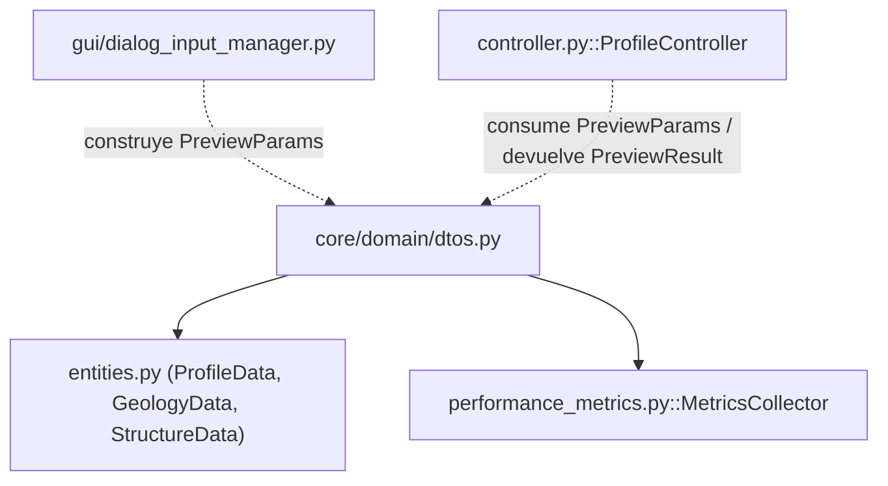
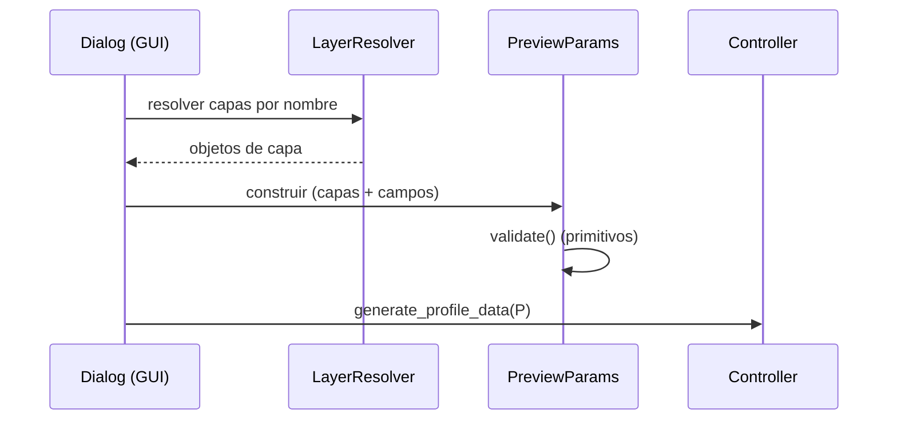

---
tags:
  - secinterp
  - code-walkthrough
  - core
  - domain
  - dto
aliases:
  - dtos.py
  - PreviewParams
  - PreviewResult
cssclass: secinterp-note
---

# `core/domain/dtos.py`

> [!abstract] Resumen en una línea
> Define los **DTOs complejos** que cruzan la frontera GUI→Core: `PreviewParams` (entrada consolidada de generación) y `PreviewResult` (salida consolidada con helpers de rango de elevación/distancia).

**Ruta**: `core/domain/dtos.py` (199 líneas)
**Clase principal**: `PreviewParams`, `PreviewResult`
**Capa**: Core (QGIS-agnóstico)
**Tags**: #secinterp #core #domain #dto

---

## 🎯 ¿Por qué existe este archivo?

Los servicios y el `controller` necesitan un contrato de datos **único y tipado** para
pasar decenas de parámetros (capas, campos, LOD) sin listas posicionales frágiles. Dos
dataclasses resuelven el problema:

| Problema | Solución |
|----------|----------|
| Agrupar ~30 parámetros de entrada en un solo objeto | `PreviewParams` (dataclass) |
| Consolidar la salida de 4 dominios + métricas | `PreviewResult` (dataclass) |
| Derivar los límites verticales del perfil | `PreviewResult.get_elevation_range()` |
| Derivar los límites horizontales (distancia) | `PreviewResult.get_distance_range()` |

> [!important] QGIS-agnóstico con `Any`
> Las capas (`raster_layer`, `line_layer`, …) se tipan como `Any` para **no importar
> QGIS**. El DTO no conoce el tipo concreto; solo transporta la referencia a la fase
> Compute, que la consume vía los extractors/adapters.

---

## 🧬 Diagrama de relaciones



> [!tip] Cómo leer
> Sólida = importa; punteada = es construido/consumido por. `dtos.py` es el **contrato
> de datos** entre la GUI (que llena los campos) y el core (que los procesa).

---

## 📦 Imports — lectura arquitectónica

```python
# core/domain/dtos.py
from dataclasses import dataclass, field
from typing import Any

from sec_interp.core.performance_metrics import MetricsCollector
from .entities import GeologyData, ProfileData, StructureData
```

| # | Observación |
|---|-------------|
| ① | `dataclasses` — los DTOs son dataclasses inmutables-simples (no `frozen`). |
| ② | `MetricsCollector` — el resultado transporta métricas de rendimiento. |
| ③ | Importa los **alias** de `entities.py` (`ProfileData`, `GeologyData`, `StructureData`). |

---

## 🏗️ Inventario de estructura

**Clases:** `class PreviewParams` (1 método), `class PreviewResult` (5 métodos)

**Funciones/Métodos:**
- `PreviewParams.validate()`
- `PreviewResult.get_elevation_range()`
- `PreviewResult.get_distance_range()`
- `PreviewResult._get_geol_elevations()`, `_get_struct_elevations()`, `_get_drillhole_elevations()`

---

## 📖 Recorrido clase por clase

### `PreviewParams` — Entrada consolidada

```python
@dataclass
class PreviewParams:
    raster_layer: Any
    line_layer: Any
    band_num: int
    buffer_dist: float = 100.0

    # Geology params
    outcrop_layer: Any | None = None
    outcrop_name_field: str | None = None

    # Structure params
    struct_layer: Any | None = None
    dip_field: str | None = None
    strike_field: str | None = None
    dip_scale_factor: float = 1.0

    # Drillhole params
    collar_layer: Any | None = None
    collar_id_field: str | None = None
    ...
    # LOD Params
    max_points: int = 1000
    canvas_width: int = 800
    auto_lod: bool = True
```

Agrupa **~30 campos** en bloques comentados (geología, estructura, sondajes, LOD). Los
campos opcionales (`None`) indican dominios que el usuario no configuró.

| Bloque | Campos clave | Nota |
|--------|--------------|------|
| Core | `raster_layer`, `line_layer`, `band_num`, `buffer_dist` | Obligatorios |
| Geología | `outcrop_layer`, `outcrop_name_field` | Opcionales |
| Estructura | `struct_layer`, `dip_field`, `strike_field`, `dip_scale_factor` | Opcionales |
| Sondajes | `collar_*`, `survey_*`, `interval_*` (14 campos) | Opcionales |
| LOD | `max_points`, `canvas_width`, `auto_lod` | Con default |

### Referencia completa de campos

| Campo | Tipo | Default | Rol |
|-------|------|---------|-----|
| `raster_layer` | `Any` | — | DEM raster para muestreo de elevación |
| `line_layer` | `Any` | — | Línea de sección |
| `band_num` | `int` | — | Banda del raster a muestrear |
| `buffer_dist` | `float` | `100.0` | Buffer de proyección |
| `outcrop_layer` | `Any \| None` | `None` | Capa de afloramientos |
| `outcrop_name_field` | `str \| None` | `None` | Campo de unidad geológica |
| `struct_layer` | `Any \| None` | `None` | Capa de mediciones estructurales |
| `dip_field` | `str \| None` | `None` | Campo de buzamiento |
| `strike_field` | `str \| None` | `None` | Campo de azimut/rumbo |
| `dip_scale_factor` | `float` | `1.0` | Escala visual del dip |
| `collar_layer` | `Any \| None` | `None` | Capa de collares |
| `collar_id_field` | `str \| None` | `None` | Campo ID del collar |
| `collar_use_geometry` | `bool` | `True` | ¿Coordenadas desde geometría? |
| `collar_x_field` | `str \| None` | `None` | Campo X |
| `collar_y_field` | `str \| None` | `None` | Campo Y |
| `collar_z_field` | `str \| None` | `None` | Campo Z |
| `collar_depth_field` | `str \| None` | `None` | Campo de profundidad total |
| `survey_layer` | `Any \| None` | `None` | Capa de surveys |
| `survey_id_field` | `str \| None` | `None` | Campo ID de survey |
| `survey_depth_field` | `str \| None` | `None` | Campo profundidad |
| `survey_azim_field` | `str \| None` | `None` | Campo azimut |
| `survey_incl_field` | `str \| None` | `None` | Campo inclinación |
| `interval_layer` | `Any \| None` | `None` | Capa de intervalos |
| `interval_id_field` | `str \| None` | `None` | Campo ID de intervalo |
| `interval_from_field` | `str \| None` | `None` | Campo "desde" |
| `interval_to_field` | `str \| None` | `None` | Campo "hasta" |
| `interval_lith_field` | `str \| None` | `None` | Campo litología |
| `max_points` | `int` | `1000` | Máx. puntos para LOD |
| `canvas_width` | `int` | `800` | Ancho del canvas (px) |
| `auto_lod` | `bool` | `True` | Ajuste automático de LOD |

> [!note] `collar_use_geometry`
> Si `True`, las coordenadas del collar salen de la **geometría** de la capa; si
> `False`, de los campos `collar_x_field`/`collar_y_field`/`collar_z_field`.

### `PreviewParams.validate()` — Validación nativa de primitivos

```python
def validate(self) -> None:
    if not isinstance(self.buffer_dist, int | float) or self.buffer_dist < 0:
        raise ValueError("Buffer distance must be a non-negative number")
    if not isinstance(self.band_num, int) or self.band_num < 1:
        raise ValueError("Band number must be a positive integer")
```

| Validación | Regla |
|-----------|-------|
| `buffer_dist` | numérico y `>= 0` |
| `band_num` | `int` y `>= 1` |

> [!important] Validación en dos niveles
> Solo se validan **primitivos**. La validación de **capas** (existencia, campos) la
> hace la GUI vía `ProjectValidator` con `LayerMetadata` desacoplado. El core no toca
> QGIS ni en la validación.

### `PreviewResult` — Salida consolidada

```python
@dataclass
class PreviewResult:
    topo: ProfileData | None = None
    geol: GeologyData | None = None
    struct: StructureData | None = None
    drillhole: Any | None = None
    metrics: MetricsCollector = field(default_factory=MetricsCollector)
    buffer_dist: float = 0.0
```

Consolida los 4 dominios + métricas. `metrics` usa `default_factory` (un
`MetricsCollector` fresco por resultado, no compartido).

### `get_elevation_range()` — Rango vertical

```python
def get_elevation_range(self) -> tuple[float, float]:
    elevations: list[float] = []
    if self.topo:
        elevations.extend(p[1] for p in self.topo)
    elevations.extend(self._get_geol_elevations())
    elevations.extend(self._get_struct_elevations())
    elevations.extend(self._get_drillhole_elevations())
    if not elevations:
        return 0.0, 0.0
    return min(elevations), max(elevations)
```

Escanea **los 4 dominios** en busca del mínimo y máximo absolutos de elevación. Es la
base del auto-escalado vertical del perfil y del cálculo de exageración vertical
(`VerticalExaggerationService`).

### Helpers privados de elevación

| Método | Fuente de elevaciones |
|--------|-----------------------|
| `_get_geol_elevations` | `segment.points` → `p[1]` (dist, elev) |
| `_get_struct_elevations` | `m.elevation` (campo explícito) |
| `_get_drillhole_elevations` | `points_3d` → `p.z` + `segments` → `p[1]` |

### `get_distance_range()` — Rango horizontal

```python
def get_distance_range(self) -> tuple[float, float]:
    if not self.topo:
        return 0.0, 0.0
    return self.topo[0][0], self.topo[-1][0]
```

Usa el **primer y último punto de la topografía** como límites horizontales
autoritativos (la topografía es obligatoria, así que siempre existe si hay perfil).

---

## 🔄 Flujo de datos

| Fase | Entrada | Transformación | Salida |
|------|---------|----------------|--------|
| Construcción | capas/campos desde la GUI | empaquetado en `PreviewParams` | `PreviewParams` |
| Generación | `PreviewParams` | `controller.generate_profile_data` | `PreviewResult` |
| Escalado | `PreviewResult` | `get_elevation_range` / `get_distance_range` | `(min, max)` |

---

## 🔢 Ejemplo — rango de elevación

Dado un `PreviewResult` con:

```python
result = PreviewResult(
    topo=[(0.0, 100.0), (50.0, 120.0), (100.0, 90.0)],   # dist, elev
    struct=[StructureMeasurement(..., elevation=140.0, ...)],
    geol=[GeologySegment(..., points=[(10.0, 95.0), (20.0, 105.0)], ...)],
)
```

`get_elevation_range()`:

1. `topo` → `[100.0, 120.0, 90.0]`
2. `_get_geol_elevations` → `[95.0, 105.0]`
3. `_get_struct_elevations` → `[140.0]`
4. `_get_drillhole_elevations` → `[]` (sin sondajes)

Resultado: `(min=90.0, max=140.0)`. El pico de 140 (estructura) y el valle de 90
(topo) definen el auto-escalado vertical completo.

---

## 🔌 Construcción desde la GUI

`PreviewParams` no se construye en el core: lo arma la GUI (vía
`dialog_input_manager` y los resolvers de capa), que **resuelve** las capas por nombre
y rellena los campos. El core solo recibe el objeto ya poblado:



> [!note] Resolución de capas fuera del core
> Convertir nombres → objetos de capa es responsabilidad de la GUI (`layer_resolver`).
> El core recibe referencias (`Any`) y nunca busca capas por sí mismo.

---

## 🏛️ Patrones de diseño presentes

| Patrón | Dónde | Propósito |
|--------|-------|-----------|
| **DTO** | ambas clases | Transportar datos a través de la frontera GUI/Core |
| **Default object** | valores por defecto | Dominios opcionales sin configuración explícita |
| **Convenience methods** | `get_*_range` | Derivar límites sin repetir el barrido en consumidores |
| **Any-typed port** | campos de capa | Evitar importar QGIS en el dominio |

---

## 🧾 Resumen de la API

| Símbolo | Firma / Hereda | Uso típico |
|---------|----------------|------------|
| `PreviewParams.validate` | `() -> None` | Validar primitivos antes de procesar |
| `PreviewResult.get_elevation_range` | `() -> (float, float)` | Auto-escalado vertical |
| `PreviewResult.get_distance_range` | `() -> (float, float)` | Límites horizontales del perfil |

---

## 🛡️ Manejo de errores

| Situación | Comportamiento |
|-----------|----------------|
| `buffer_dist < 0` o no numérico | `ValueError` (en `validate`) |
| `band_num < 1` o no entero | `ValueError` (en `validate`) |
| Sin datos (todas las capas vacías) | `get_elevation_range` → `(0.0, 0.0)` |
| `topo` ausente | `get_distance_range` → `(0.0, 0.0)` |

> [!warning] `ValueError` no `ValidationError`
> `validate()` lanza `ValueError` (builtin), no `ValidationError` de `exceptions.py`.
> Inconsistencia menor con la jerarquía de errores propia del proyecto.

---

## 🧪 Tests asociados

Casos puros (sin QGIS), mapeados a `tests/core/test_dtos.py`:

- `test_preview_params_validate_ok` — `buffer_dist`/`band_num` válidos no lanzan.
- `test_preview_params_validate_negative_buffer` — `buffer_dist < 0` → `ValueError`.
- `test_preview_params_validate_band_zero` — `band_num = 0` → `ValueError`.
- `test_get_elevation_range_all_domains` — incluye topo/geol/struct/drillhole.
- `test_get_elevation_range_empty` — sin datos → `(0.0, 0.0)`.
- `test_get_distance_range` — usa topo primero/último.

---

## 🌐 i18n y notas de migración

- **Sin cadenas de usuario**: los DTOs no emiten mensajes; los errores de `validate()`
  son `ValueError` con texto fijo (sin `TranslatableMixin`).
- **Thread-safety**: dataclasses simples; `MetricsCollector` por instancia vía
  `default_factory` (sin estado compartido entre resultados).
- **Migración**: `drillhole` tipado `Any` es candidato a `list[DrillholeProjection]`.

---

## 👀 Observaciones y notas

> [!success] Fortalezas
> - Contrato único y tipado para toda la generación de perfil.
> - `Any` mantiene el core QGIS-agnóstico pese a transportar capas.
> - `get_elevation_range` centraliza la lógica de auto-escalado.

> [!warning] Puntos de atención
> - `validate()` lanza `ValueError` en vez de la jerarquía `SecInterpError`.
> - `drillhole` se tipa `Any` (no `list[DrillholeProjection]`) — tipado laxo.
> - ~30 campos en un solo dataclass: candidato a agrupar en sub-objetos (structs anidados).

> [!question] Preguntas abiertas
> - ¿Migrar `PreviewParams` a dataclasses anidados (p. ej. `DrillholeParams`)?
> - ¿Cambiar `ValueError` → `ValidationError` para consistencia con `exceptions.py`?

---

## 🔗 Notas relacionadas

- [[Index]] — índice de la bóveda
- [[entities]] — alias y entidades que importa (`ProfileData`, `GeologyData`, …)
- [[performance_metrics]] — `MetricsCollector`
- [[controller]] — consume `PreviewParams` y produce `PreviewResult`
- [[vertical_exaggeration_service]] — usa `get_elevation_range`
- [[domain]] — índice del paquete `domain/`

---

*Nota de la bóveda SecInterp Code Walkthrough v2 — v3.9.0*
