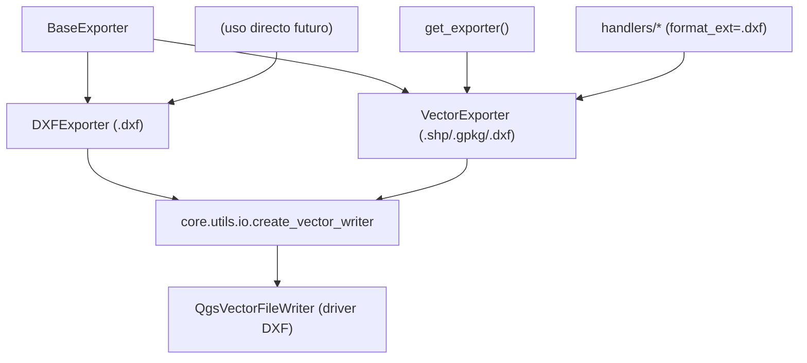

---
tags:
  - secinterp
  - code-walkthrough
  - exporters
  - cad
aliases:
  - dxf_exporter.py
  - DXFExporter
cssclass: secinterp-note
---

# `exporters/dxf_exporter.py`

> [!abstract] Resumen en una línea
> Exporter CAD dedicado: escribe `.dxf` con el mismo pipeline OGR que `VectorExporter` pero con `_prepare_fields` defensivo (valida lista, dict y clave `attributes`) y mensajes de log propios.

**Ruta**: `exporters/dxf_exporter.py` (126 líneas)
**Clase principal**: `DXFExporter(BaseExporter)`
**Capa**: Exporters (acoplado a `qgis.core` vía `QgsVectorFileWriter`, driver DXF)
**Tags**: #secinterp #exporters #cad

---

## 🎯 ¿Por qué existe este archivo?

El DXF es el formato de intercambio con CAD (AutoCAD, BricsCAD) que usan los equipos
de mina y consultoras. Aunque `VectorExporter` ya escribe `.dxf`, este módulo ofrece
una ruta dedicada con validación de entrada más estricta:

| Problema | Solución |
|----------|----------|
| Intercambio con CAD externo | Salida `.dxf` legible por AutoCAD/BricsCAD |
| `features_data` malformado rompe la inferencia de campos | `_prepare_fields` defensivo: valida `list`, `dict` y presencia de `attributes` |
| Diagnóstico ambiguo cuando falla el driver DXF | Logs con prefijo `DXF` (`"Failed to create DXF writer"`, `"DXF export failed"`) |
| Simbología CAD opcional | Setting `symbology_export` propagado al writer |

> [!important] Nota arquitectónica
> `DXFExporter` hereda **directamente** de `BaseExporter`, no de `VectorExporter`: es
> una duplicación consciente del pipeline para poder evolucionar el path CAD (capas
> DXF, bloques, estilos) sin afectar al path SHP/GPKG. Ver el diagrama y las
> preguntas abiertas.

---

## 🧬 Diagrama de relaciones



> [!tip] Cómo leer
> Hoy la factoría enruta `.dxf` a `VectorExporter` (ver `__init__.py`), no a esta
> clase: `DXFExporter` es una ruta dedicada disponible para uso directo o para una
> futura conmutación de la factoría. Ambos comparten `create_vector_writer`.

---

## 📦 Imports — lectura arquitectónica

```python
# exporters/dxf_exporter.py
from __future__ import annotations

from pathlib import Path
from typing import Any

from qgis.core import (
    QgsCoordinateReferenceSystem,
    QgsFeature,
    QgsField,
    QgsFields,
    QgsVectorFileWriter,
    QgsWkbTypes,
)
from qgis.PyQt.QtCore import QMetaType

from sec_interp.core.utils import io as scu_io
from sec_interp.logger_config import get_logger

from .base_exporter import BaseExporter
```

| # | Observación |
|---|-------------|
| ① | Bloque idéntico al de `vector_exporter.py`: mismo driver OGR, misma inferencia de tipos. |
| ② | Sin `noqa: E402` (a diferencia de vector/csv): los imports ya están ordenados tras `__future__`. |
| ③ | `scu_io.create_vector_writer` abstrae el driver: cambiar opciones DXF (versión, capas) se haría en [[io]], no aquí. |
| ④ | Herencia de `BaseExporter` directa: no reutiliza `_write_features` de `VectorExporter` aunque sea idéntico. |
| ⑤ | `get_logger(__name__)`: los mensajes de error llevan prefijo DXF para filtrar en el log. |

---

## 🏗️ Inventario de estructura

**Clases:** `class DXFExporter(BaseExporter)` — 1 clase, 4 métodos.

**Métodos:**

- `get_supported_extensions() -> list[str]` — `[".dxf"]` (solo CAD)
- `export(output_path: Path, features_data: list[dict[str, Any]], layer_name: str | None = None) -> bool`
- `_write_features(writer: QgsVectorFileWriter, features_data: list[dict[str, Any]], fields: QgsFields) -> None`
- `_prepare_fields(features_data: list[dict[str, Any]]) -> QgsFields` — versión defensiva

**Settings consumidos:** `geometry_type` (defecto `LineString`), `crs` (defecto
`EPSG:4326`), `symbology_export` (defecto `NoSymbology`) — igual que `VectorExporter`.

---

## 📁 Archivos del paquete

| Archivo | Líneas | Rol |
|---|--:|---|
| `__init__.py` | 81 | `get_exporter()`: `.dxf` → `VectorExporter` (no a esta clase, hoy) |
| `base_exporter.py` | 137 | Contrato heredado (ver [[base_exporter]]) |
| `vector_exporter.py` | 122 | Gemelo genérico que también escribe `.dxf` |
| `dxf_exporter.py` | 126 | `DXFExporter` — ruta CAD dedicada (esta nota) |
| `csv_exporter.py` | 58 | Gemelo tabular que acompaña a cada DXF en los handlers |

> [!note] ¿Por qué dos clases que escriben DXF?
> `VectorExporter` cubre el caso general (el orquestador lo usa con `format_ext=".dxf"`).
> `DXFExporter` existe para endurecer la entrada y dejar espacio a opciones CAD
> específicas (nombres de capa DXF, versión R2007/R2010, `symbology_export`) sin
> contaminar el path SHP/GPKG.

---

## 📖 Recorrido método por método

### `get_supported_extensions`

```python
def get_supported_extensions(self) -> list[str]:
    """Get supported vector format extensions."""
    return [".dxf"]
```

Solo `.dxf`: a diferencia de `VectorExporter`, esta clase no acepta SHP ni GPKG ni
siquiera por error de configuración. `validate_path()` heredado rechaza cualquier otra
extensión.

### `export` — escritura DXF

```python
def export(
    self,
    output_path: Path,
    features_data: list[dict[str, Any]],
    layer_name: str | None = None,
) -> bool:
    if not features_data:
        return False

    try:
        geometry_type = self.get_setting("geometry_type", QgsWkbTypes.Type.LineString)
        crs = self.get_setting("crs", QgsCoordinateReferenceSystem("EPSG:4326"))
        symb_mode = self.get_setting(
            "symbology_export", QgsVectorFileWriter.SymbologyExport.NoSymbology
        )

        fields = self._prepare_fields(features_data)
        writer = scu_io.create_vector_writer(
            output_path,
            crs,
            fields,
            geometry_type,
            layer_name=layer_name,
            symbology_export=symb_mode,
        )

        if writer.hasError() != QgsVectorFileWriter.WriterError.NoError:
            logger.error(f"Failed to create DXF writer: {writer.errorMessage()}")
            return False

        self._write_features(writer, features_data, fields)

        # Note: writer is closed when object is deleted or goes out of scope
        del writer

    except Exception:
        logger.exception(f"DXF export failed for {output_path}")
        return False
    else:
        return True
```

| Paso | Detalle |
|------|---------|
| Guardia | `features_data` vacío → `False` sin crear archivo |
| Settings | Mismos defectos que `VectorExporter`; `layer_name` llega al writer (nombre de capa conceptual) |
| Writer | `create_vector_writer` selecciona el driver por extensión (`.dxf` → driver DXF de OGR) |
| Chequeo | `hasError()` con mensaje OGR en el log, etiquetado como DXF |
| Cierre | `del writer` fuerza el flush, igual que en el gemelo genérico |

### `_write_features` — idéntico al genérico

```python
def _write_features(
    self,
    writer: QgsVectorFileWriter,
    features_data: list[dict[str, Any]],
    fields: QgsFields,
) -> None:
    for data in features_data:
        feature = QgsFeature(fields)
        if "geometry" in data:
            feature.setGeometry(data["geometry"])
        if "attributes" in data:
            attrs = data["attributes"]
            feature.setAttributes([attrs.get(field.name()) for field in fields])
        writer.addFeature(feature)
```

Mapeo por nombre de campo, tolerante a claves extra y a items sin geometría. La
diferencia con `VectorExporter._write_features` es solo el propietario: el día que el
path CAD necesite transformar atributos (truncar anchos, sanear nombres de capa),
este es el punto de intervención sin tocar SHP/GPKG.

### `_prepare_fields` — la diferencia real

```python
def _prepare_fields(self, features_data: list[dict[str, Any]]) -> QgsFields:
    """Create fields based on first feature's attributes."""
    fields = QgsFields()
    if not features_data or not isinstance(features_data, list):
        return fields

    first_item = features_data[0]
    if not isinstance(first_item, dict) or "attributes" not in first_item:
        return fields

    first_attrs = first_item["attributes"]
    for key, value in first_attrs.items():
        if isinstance(value, int):
            fields.append(QgsField(key, QMetaType.Type.Int))
        elif isinstance(value, float):
            fields.append(QgsField(key, QMetaType.Type.Double))
        else:
            fields.append(QgsField(key, QMetaType.Type.QString))
    return fields
```

| Guardia extra | Qué evita |
|---------------|-----------|
| `not isinstance(features_data, list)` | Un dict suelto o `None` que pasara la guardia `not features_data` |
| `not isinstance(first_item, dict)` | Items escalares que romperían `in` / `.items()` |
| `"attributes" not in first_item` | Items solo-geometría: devuelve esquema vacío en vez de `KeyError` |

Con esquema vacío, el writer DXF crea una capa sin tabla de atributos: el dibujo sale,
los datos no. Es degradación graceful pensada para CAD, donde la geometría manda.

---

## 🆚 DXFExporter frente a VectorExporter

Las dos clases escriben `.dxf` con el mismo driver OGR, pero solo una está enrutada en la factoría. Comparativa verificada contra el fuente:

| Aspecto | `VectorExporter` | `DXFExporter` (este) |
|---------|------------------|----------------------|
| Hereda de | `BaseExporter` | `BaseExporter` (no del gemelo) |
| `get_supported_extensions` | `[".shp", ".gpkg", ".dxf"]` | `[".dxf"]` |
| `export()` | guardia + settings + writer + `_write_features` + `del writer` | idéntico paso a paso |
| `_write_features` | mapeo por nombre de campo | copia exacta, otro propietario |
| `_prepare_fields` | `if features_data and "attributes" in features_data[0]` | triple guardia `isinstance` + clave |
| Logs de fallo | `"Failed to create writer"` / `"Vector export failed"` | `"Failed to create DXF writer"` / `"DXF export failed"` |
| Enrutado en `get_exporter(".dxf")` | sí (ruta activa) | no (ruta disponible) |

> [!tip] Regla práctica
> El `.dxf` que entrega la GUI hoy sale de `VectorExporter` con `format_ext=".dxf"`.
> Usa `DXFExporter` directamente cuando necesites su inferencia defensiva o cuando el
> path CAD empiece a divergir; hasta entonces, todo fix OGR va en ambas clases.

### `symbology_export` — la palanca CAD

Ambas clases leen el mismo setting y lo propagan sin transformarlo:

```python
symb_mode = self.get_setting(
    "symbology_export", QgsVectorFileWriter.SymbologyExport.NoSymbology
)
writer = scu_io.create_vector_writer(
    output_path, crs, fields, geometry_type,
    layer_name=layer_name,
    symbology_export=symb_mode,
)
```

| Valor | Efecto en el DXF |
|-------|------------------|
| `NoSymbology` (defecto) | Geometría plana en una capa; atributos según el driver |
| `PerSymbolLayer` / `PerFeature` | El writer intenta mapear simbología QGIS a capas y estilos DXF |

---

## 🔄 Flujo de datos

| Fase | Entrada | Transformación | Salida |
|------|---------|----------------|--------|
| DTOs | datos del dominio + `crs` de la línea | handlers arman `features_data` | `list[dict]` |
| Esquema defensivo | primer item | triple guardia + inferencia `int/float/str` | `QgsFields` (quizá vacío) |
| Escritura | `(writer, features_data, fields)` | un `QgsFeature` por dict | archivo `.dxf` |
| Resultado | éxito/fracaso | `bool` (+ `ExportError` en el handler) | mensaje en `result_msg` |

---

## 🧩 Limitaciones del formato DXF

| Limitación | Detalle | Implicación |
|------------|---------|-------------|
| **2D esencial** | El driver DXF de OGR aplana la Z | Las secciones 3D se exportan por `drillhole_3d_exporter` / `interpretation_3d_exporter`, no aquí |
| **Ancho de campos** | Los atributos de texto se truncan según el driver | Nombres y códigos largos pueden recortarse al abrir en CAD |
| **Tipos pobres** | Sin `Double` de alta precisión garantizada ni `NULL` real | Cotas críticas viajan también en el CSV gemelo |
| **Capas** | El mapeo atributo→capa DXF depende de `symbology_export` | Por defecto `NoSymbology`: todo en una capa |
| **Versión** | La versión DXF la fija el driver OGR del entorno | Ver `tests/integration/test_vector_drivers_integration.py` |

> [!tip] CSV como respaldo
> Los handlers escriben **siempre** el CSV tabular junto al vectorial: si el DXF
> trunca un campo, el valor exacto sobrevive en el `.csv` hermano.

---

## 🏛️ Patrones de diseño presentes

| Patrón | Dónde | Propósito |
|--------|-------|-----------|
| **Template Method** | `export()` sobre el contrato de [[base_exporter]] | Mismo esqueleto que el gemelo genérico |
| **Defensive programming** | Triple guardia en `_prepare_fields` | Degradar a esquema vacío en vez de `KeyError` |
| **Duplicación consciente** | Pipeline copiado de `VectorExporter` | Evolucionar CAD sin riesgo SHP/GPKG |
| **Fail-soft** | `except Exception → False` + logs etiquetados | Diagnóstico filtrable por "DXF" |
| **Graceful degradation** | Esquema vacío permitido | Geometría sin atributos antes que nada |

---

## 🧾 Resumen de la API

| Símbolo | Firma / Hereda | Uso típico |
|---------|----------------|------------|
| `DXFExporter` | `(BaseExporter)` | `DXFExporter({"crs": line_crs})` |
| `export` | `(output_path: Path, features_data: list[dict[str, Any]], layer_name: str \| None = None) -> bool` | Escritura `.dxf` |
| `get_supported_extensions` | `() -> list[str]` | `[".dxf"]` |
| `_write_features` | `(writer, features_data, fields) -> None` | Bucle interno |
| `_prepare_fields` | `(features_data) -> QgsFields` | Inferencia defensiva |

---

## 🛡️ Manejo de errores

| Situación | Comportamiento |
|-----------|----------------|
| `features_data` vacío | `return False` sin tocar disco |
| `features_data` no-lista o items sin `attributes` | Esquema vacío → DXF solo-geometría |
| `writer.hasError()` | `logger.error("Failed to create DXF writer: …")` + `False` |
| Excepción cualquiera | `logger.exception("DXF export failed for …")` + `False` |
| `False` aguas arriba | El handler lanza `ExportError` (ver [[compat]]) |

---

## 🧪 Tests asociados

No existe un `test_dxf_exporter.py` dedicado: la cobertura DXF llega por dos vías
que hay que conocer:

- `tests/exporters/test_vector_exporter.py` — ejercita el **mismo pipeline OGR**
  (`test_export_success`, `test_export_writer_error`, `test_export_exception_handling`)
  con `QgsVectorFileWriter` mockeado; aplica por simetría de implementación.
- `tests/exporters/test_exporters.py` — contrato `BaseExporter` (`test_get_supported_extensions`, guardias de `data` vacío).
- `tests/integration/test_vector_drivers_integration.py` — verifica que el entorno QGIS trae el driver DXF de OGR.
- `tests/integration/test_export_service_e2e.py` — flujo orquestador con `format_ext=".dxf"` (vía `VectorExporter`).
- `tests/integration/test_export_workflow.py` — flujo completo de exportación.

> [!warning] Hueco de cobertura honesto
> `DXFExporter._prepare_fields` defensivo (las tres guardias `isinstance`) no tiene
> test directo. Un `test_dxf_exporter.py` con items no-dict y dicts sin `attributes`
> sería la adición natural.

---

## 👀 Observaciones y notas

> [!success] Fortalezas
> - `_prepare_fields` defensivo: la única inferencia de esquema del paquete que no puede lanzar `KeyError`/`AttributeError`.
> - Logs etiquetados DXF: filtrado trivial en sesiones con múltiples formatos.
> - Extensión única declarada: imposible configurarlo por error para SHP/GPKG.
> - Espacio de evolución CAD reservado sin riesgo para el path principal.

> [!warning] Puntos de atención
> - **Duplicación real**: `export` y `_write_features` son copias de `VectorExporter`; cualquier fix OGR debe aplicarse dos veces.
> - La factoría **no** lo usa (`.dxf` → `VectorExporter`): hoy es código disponible pero no enrutado.
> - Esquema vacío silencioso: un DXF sin atributos puede pasar por éxito total (`True`) aunque se perdieran datos.
> - Mismos defectos arriesgados que el gemelo (`EPSG:4326` si falta `crs`).

> [!question] Preguntas abiertas
> - ¿Heredar de `VectorExporter` y solo sobrescribir `_prepare_fields`, eliminando la duplicación?
> - ¿Enrutar `.dxf` a `DXFExporter` en `get_exporter()` o mantenerlo como ruta manual?
> - ¿Avisar (log `warning`) cuando el esquema sale vacío en vez de éxito silencioso?

---

## 🔗 Notas relacionadas

- [[Index]] — índice de la bóveda
- [[base_exporter]] — contrato heredado
- [[vector_exporter]] — gemelo genérico (compara `_prepare_fields`)
- [[exporters]] — nota de capa del paquete
- [[io]] — `create_vector_writer`, driver DXF real
- [[csv_exporter]] — respaldo tabular exacto del DXF
- [[orchestrator]] — decide `format_ext=".dxf"` según settings
- [[compat]] — traduce `False` a `ExportError`
- [[drillhole_exporters]] / [[profile_exporters]] — entidades que terminan en DXF
- [[dialog_export_manager]] — la GUI expone DXF como `default_format`
- [[exceptions]] — `ExportError`

---

*Nota de la bóveda SecInterp Code Walkthrough v2 — v3.8.0*
