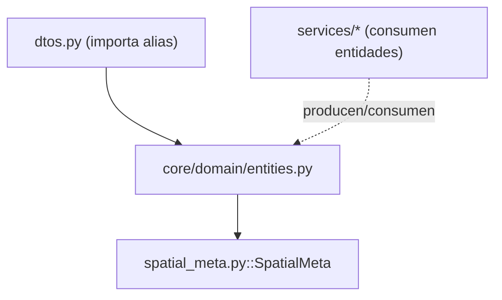

---
tags:
  - secinterp
  - code-walkthrough
  - core
  - domain
  - entities
aliases:
  - entities.py
  - GeologySegment
  - StructureMeasurement
  - DrillholeProjection
cssclass: secinterp-note
---

# `core/domain/entities.py`

> [!abstract] Resumen en una línea
> Define las **entidades del dominio** (dataclasses) y los **alias de tipo** que dan nombre y forma a los datos procesados: mediciones estructurales, segmentos geológicos, polígonos de interpretación y proyecciones de sondaje.

**Ruta**: `core/domain/entities.py` (161 líneas)
**Clase principal**: `GeologySegment`, `StructureMeasurement`, `DrillholeProjection`
**Capa**: Core (QGIS-agnóstico)
**Tags**: #secinterp #core #domain #entities

---

## 🎯 ¿Por qué existe este archivo?

El core procesa geometría, pero **sin QGIS**. Necesita tipos propios que expresen los
resultados geológicos/estructurales con primitivos (tuplas, WKT, dicts). `entities.py`
es el vocabulario del dominio:

| Problema | Solución |
|----------|----------|
| Representar una medición estructural proyectada | `StructureMeasurement` |
| Representar un tramo geológico sobre el perfil | `GeologySegment` |
| Representar un polígono de interpretación (2D y 2.5D) | `InterpretationPolygon` / `InterpretationPolygon25D` |
| Representar un sondaje proyectado | `DrillholeProjection` |
| Nombres cortos y estables para tipos repetidos | Alias (`Point2D`, `ProfileData`, …) |

> [!important] `DomainGeometry = str` (WKT)
> Toda geometría se transporta como **WKT** (`DomainGeometry`), nunca `QgsGeometry`.
> Esto es la pieza clave del patrón Extract-then-Compute: la GUI extrae WKT, el core
> computa sobre texto.

---

## 🧬 Diagrama de relaciones



> [!tip] Cómo leer
> `entities.py` es la **base del dominio**: `dtos.py` y los servicios lo importan. Solo
> depende de `spatial_meta.py` (para `DrillholeProjection.points_3d`).

---

## 📦 Imports — lectura arquitectónica

```python
# core/domain/entities.py
from dataclasses import dataclass, field
from typing import TYPE_CHECKING, Any

if TYPE_CHECKING:
    from .spatial_meta import SpatialMeta
```

| # | Observación |
|---|-------------|
| ① | `TYPE_CHECKING` evita el import circular en runtime (`SpatialMeta` solo para tipado). |
| ② | `dataclass` para las entidades; `field(default_factory=...)` para colecciones. |
| ③ | Sin imports de QGIS; tipos primitivos + `Any`. |

---

## 🏗️ Inventario de estructura

**Alias de tipo:** `ProfilePoints`, `GeologyPoints`, `StructurePoints`, `SettingsDict`,
`ExportSettings`, `ValidationResult`, `Point2D`, `Point3D`, `DomainGeometry`,
`PointList`, `StructureData`, `GeologyData`, `ProfileData`

**Clases:** `StructureMeasurement`, `GeologySegment`, `InterpretationPolygon`,
`InterpretationPolygon25D`, `DrillholeProjection` — 5 dataclasses

---

## 📖 Recorrido por entidades y alias

### Alias de tipo (vocabulario del dominio)

| Alias | Definición | Uso |
|-------|-----------|-----|
| `Point2D` | `tuple[float, float]` | punto (x, y) o (distancia, elevación) |
| `Point3D` | `tuple[float, float, float]` | punto (x, y, z) |
| `PointList` | `list[Point2D]` | lista de puntos 2D |
| `DomainGeometry` | `str` | geometría en **WKT** |
| `ProfileData` | `list[tuple[float, float]]` | perfil topográfico `(dist, elev)` |
| `GeologyData` | `list[GeologySegment]` | segmentos geológicos |
| `StructureData` | `list[StructureMeasurement]` | mediciones estructurales |
| `SettingsDict` / `ExportSettings` | `dict[str, Any]` | configuraciones |
| `ValidationResult` | `tuple[bool, str]` | `(is_valid, error)` |

> [!tip] `DomainGeometry = str` es WKT
> Es el contrato más importante del core: la geometría es texto WKT, no objetos QGIS.

### `StructureMeasurement` — medición estructural proyectada

```python
@dataclass
class StructureMeasurement:
    distance: float
    elevation: float
    apparent_dip: float
    original_dip: float
    original_strike: float
    attributes: dict[str, Any]
```

| Campo | Significado |
|-------|-------------|
| `distance` | distancia horizontal desde el inicio del perfil |
| `apparent_dip` | buzamiento **aparente** (relativo al plano de sección) |
| `original_dip` / `original_strike` | dip/strike **reales** medidos en campo |
| `attributes` | atributos originales del feature |

### `GeologySegment` — tramo geológico

```python
@dataclass
class GeologySegment:
    unit_name: str
    geometry_wkt: DomainGeometry | None
    attributes: dict[str, Any]
    points: list[Point2D]
    points_3d: list[Point3D] = field(default_factory=list)
    points_3d_projected: list[Point3D] = field(default_factory=list)
```

Un segmento describe un afloramiento de una **unidad geológica** a lo largo del perfil:

- `points`: perfil 2D `(dist, elev)`.
- `points_3d`: coordenadas 3D reales (para export 3D).
- `points_3d_projected`: proyección sobre la sección en 3D.
- `geometry_wkt`: geometría opcional (WKT) para exportación vectorial.

### `InterpretationPolygon` — interpretación 2D

```python
@dataclass
class InterpretationPolygon:
    id: str
    name: str
    type: str
    vertices_2d: list[tuple[float, float]]
    attributes: dict[str, Any] = field(default_factory=dict)
    color: str = "#FF0000"
    created_at: str = ""
```

Polígono digitalizado por el usuario sobre el perfil. `type` clasifica (lithology,
fault, alteration); `color` es HEX; `created_at` es timestamp ISO.

### `InterpretationPolygon25D` — interpretación georreferenciada

```python
@dataclass
class InterpretationPolygon25D:
    id: str
    name: str
    type: str
    geometry_wkt: DomainGeometry
    attributes: dict[str, Any]
    crs_authid: str
```

Versión georreferenciada (con CRS): añade `geometry_wkt` y `crs_authid` (p. ej.
`EPSG:4326`) para exportar la interpretación al espacio geográfico real.

### `DrillholeProjection` — sondaje proyectado

```python
@dataclass
class DrillholeProjection:
    hole_id: str
    distance: float
    elevation: float
    offset: float
    total_depth: float
    points_3d: list[SpatialMeta] = field(default_factory=list)
    segments: list[GeologySegment] = field(default_factory=list)
```

| Campo | Significado |
|-------|-------------|
| `offset` | distancia ortogonal a la línea de sección |
| `points_3d` | lista de `SpatialMeta` a lo largo de la trayectoria |
| `segments` | segmentos geológicos a lo largo del sondaje |

> [!note] `DrillholeProjection` reusa `GeologySegment` y `SpatialMeta`
> Compone entidades existentes en lugar de duplicar campos: un sondaje proyectado
> contiene sus propios segmentos litológicos.

---

## 🔄 Flujo de datos

| Fase | Entidad | Transformación | Salida |
|-------|---------|----------------|--------|
| Extracción | geometría QGIS | GUI → WKT/tuplas | `DomainGeometry`, `Point2D` |
| Cómputo | WKT/tuplas | servicios puros | `GeologySegment`, `StructureMeasurement`, `DrillholeProjection` |
| Export | entidades | exporters → formato | SHP/GPKG/DXF/3D |

---

## 📐 Referencia campo a campo (completa)

### `StructureMeasurement`

| Campo | Tipo | Rol |
|-------|------|-----|
| `distance` | `float` | distancia desde el inicio del perfil |
| `elevation` | `float` | elevación (Z) en el punto proyectado |
| `apparent_dip` | `float` | dip aparente respecto al plano |
| `original_dip` | `float` | dip real de campo |
| `original_strike` | `float` | rumbo real de campo |
| `attributes` | `dict[str, Any]` | atributos originales |

### `GeologySegment`

| Campo | Tipo | Rol |
|-------|------|-----|
| `unit_name` | `str` | nombre de la unidad |
| `geometry_wkt` | `DomainGeometry \| None` | geometría WKT (opcional) |
| `attributes` | `dict[str, Any]` | atributos originales |
| `points` | `list[Point2D]` | perfil 2D `(dist, elev)` |
| `points_3d` | `list[Point3D]` | coordenadas 3D reales |
| `points_3d_projected` | `list[Point3D]` | proyección 3D sobre la sección |

### `InterpretationPolygon`

| Campo | Tipo | Rol |
|-------|------|-----|
| `id` | `str` | identificador único |
| `name` | `str` | nombre del polígono |
| `type` | `str` | clasificación (lithology/fault/alteration) |
| `vertices_2d` | `list[tuple[float, float]]` | vértices `(dist, elev)` |
| `attributes` | `dict[str, Any]` | metadatos |
| `color` | `str` | color HEX (`#FF0000`) |
| `created_at` | `str` | timestamp ISO |

### `InterpretationPolygon25D`

| Campo | Tipo | Rol |
|-------|------|-----|
| `id` / `name` / `type` | `str` | heredados de la interpretación |
| `geometry_wkt` | `DomainGeometry` | geometría WKT georreferenciada |
| `attributes` | `dict[str, Any]` | atributos heredados/calculados |
| `crs_authid` | `str` | CRS (p. ej. `EPSG:4326`) |

### `DrillholeProjection`

| Campo | Tipo | Rol |
|-------|------|-----|
| `hole_id` | `str` | identificador del sondaje |
| `distance` | `float` | distancia desde el inicio |
| `elevation` | `float` | elevación del collar |
| `offset` | `float` | distancia ortogonal a la sección |
| `total_depth` | `float` | longitud total |
| `points_3d` | `list[SpatialMeta]` | trayectoria 3D |
| `segments` | `list[GeologySegment]` | segmentos litológicos |

---

## 🔢 Ejemplos de instancias

```python
# Segmento geológico sobre el perfil
seg = GeologySegment(
    unit_name="Cuarcita",
    geometry_wkt="LINESTRING(10 100, 20 105)",
    attributes={"code": "QC"},
    points=[(10.0, 100.0), (20.0, 105.0)],
)

# Medición estructural proyectada
meas = StructureMeasurement(
    distance=15.0, elevation=102.0,
    apparent_dip=42.0, original_dip=60.0, original_strike=90.0,
    attributes={"dip": 60},
)

# Sondaje proyectado (compone SpatialMeta y GeologySegment)
hole = DrillholeProjection(
    hole_id="DH-01", distance=8.0, elevation=95.0,
    offset=2.5, total_depth=120.0,
    segments=[seg],
)
```

> [!tip] Todas son instanciables sin QGIS
> Ninguna entidad exige un objeto QGIS: tuplas, `str` (WKT) y `dict`. Por eso el core es
> testeable con `unittest` puro.

---

## 🏛️ Patrones de diseño presentes

| Patrón | Dónde | Propósito |
|--------|-------|-----------|
| **Value Object** | dataclasses | Entidades inmutables-simples con campos tipados |
| **Type Alias** | `Point2D`, `DomainGeometry`… | Vocabulario estable y legible |
| **WKT-as-string** | `DomainGeometry` | Desacoplar geometría de QGIS |
| **Composition** | `DrillholeProjection` | Reusar `SpatialMeta` y `GeologySegment` |

---

## 🧾 Resumen de la API

| Símbolo | Tipo | Uso típico |
|---------|------|------------|
| `StructureMeasurement` | dataclass | Mediciones proyectadas |
| `GeologySegment` | dataclass | Tramos geológicos |
| `InterpretationPolygon` | dataclass | Interpretación 2D |
| `InterpretationPolygon25D` | dataclass | Interpretación georreferenciada |
| `DrillholeProjection` | dataclass | Sondajes proyectados |
| `DomainGeometry` | alias `str` | Geometría WKT |

---

## 🛡️ Manejo de errores

Sin lógica de validación propia: son contenedores de datos. La validación ocurre en
los servicios y en `PreviewParams.validate()`. Los `default_factory` evitan el clásico
bug de **lista compartida** entre instancias.

---

## 🧪 Tests asociados

Casos puros mapeados a `tests/core/test_entities.py`:

- `test_geology_segment_default_lists` — `points_3d`/`points_3d_projected` vacíos por defecto.
- `test_drillhole_projection_defaults` — `points_3d`/`segments` vacíos (no compartidos).
- `test_structure_measurement_roundtrip` — construcción y lectura de campos.
- `test_domain_geometry_is_str` — `DomainGeometry` es `str` (WKT).

---

## 🌐 i18n y notas de migración

- **Sin cadenas de usuario**: entidades puras, sin `TranslatableMixin`; los nombres de
  unidad (`unit_name`) son datos, no mensajes.
- **`attributes` sin esquema**: `dict[str, Any]` transporta metadatos originales del
  feature; los consumidores conocen las claves por convención.
- **Thread-safety**: dataclasses con `default_factory`; seguras para `QgsTask`.
- **Migración**: `InterpretationPolygon25D` duplica `id/name/type` — candidato a
  heredar de `InterpretationPolygon`.

---

## 👀 Observaciones y notas

> [!success] Fortalezas
> - Vocabulario rico y estable para todo el dominio geológico.
> - `DomainGeometry = str` (WKT) es la clave del desacoplamiento QGIS.
> - `field(default_factory=...)` previene el bug de estado mutable compartido.

> [!warning] Puntos de atención
> - `InterpretationPolygon25D` duplica `id/name/type` respecto a `InterpretationPolygon`
>   (candidato a herencia/composición).
> - `attributes: dict[str, Any]` (laxo) se repite en casi todas las entidades.

> [!question] Preguntas abiertas
> - ¿Heredar `InterpretationPolygon25D` de `InterpretationPolygon`?
> - ¿Tipar `attributes` como `dict[str, str | float]` en vez de `Any`?

---

## 🔗 Notas relacionadas

- [[Index]] — índice de la bóveda
- [[spatial_meta]] — `SpatialMeta` (referencia en `DrillholeProjection`)
- [[dtos]] — importa los alias (`ProfileData`, `GeologyData`, …)
- [[domain]] — índice del paquete `domain/`
- [[geology_service]] / [[structure_service]] / [[drillhole_service]] — producen estas entidades

---

*Nota de la bóveda SecInterp Code Walkthrough v2 — v3.8.0*
