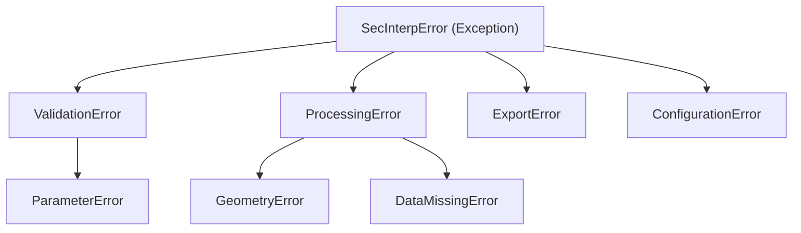

---
tags:
  - secinterp
  - code-walkthrough
  - core
  - exceptions
aliases:
  - exceptions.py
  - SecInterpError
  - ValidationError
  - ProcessingError
cssclass: secinterp-note
---

# `core/exceptions.py`

> [!abstract] Resumen en una línea
> Define la **jerarquía de excepciones** del dominio SecInterp, con un base común `SecInterpError(message, details)` que distingue validación, procesamiento, geometría, export y configuración.

**Ruta**: `core/exceptions.py` (65 líneas)
**Clase principal**: `SecInterpError`
**Capa**: Core (QGIS-agnóstico)
**Tags**: #secinterp #core #exceptions

---

## 🎯 ¿Por qué existe este archivo?

Capturar `Exception` genérica impide que el código distinga un error de validación de
uno de procesamiento o de exportación. Una jerarquía propia permite:

| Problema | Solución |
|----------|----------|
| Distinguir tipos de error sin cadenas mágicas | Jerarquía de subclases |
| Adjuntar contexto técnico a un error | `SecInterpError(message, details)` |
| Manejar errores esperados vs inesperados | Captura selectiva (`except ValidationError`) |

> [!important] Base con `message` + `details`
> `SecInterpError` guarda `self.message` y `self.details` (dict). Así el log y la UI
> pueden mostrar el mensaje legible y, opcionalmente, el contexto técnico.

---

## 🧬 Jerarquía completa



| Rama | Subclases | Dominio |
|------|-----------|---------|
| `ValidationError` | `ParameterError` | Validación de entrada |
| `ProcessingError` | `GeometryError`, `DataMissingError` | Fallos de procesamiento |
| `ExportError` | — | Exportación |
| `ConfigurationError` | — | Configuración |

---

## 📦 Imports — lectura arquitectónica

```python
# core/exceptions.py
from __future__ import annotations
```

| # | Observación |
|---|-------------|
| ① | **Cero imports**: depende solo de `Exception` builtin. Máxima portabilidad. |

---

## 🏗️ Inventario de estructura

**Clases:** 8 (1 base + 7 subclases)

- `SecInterpError` (base, con `__init__`)
- `ValidationError`, `ParameterError`, `ProcessingError`, `GeometryError`, `DataMissingError`, `ExportError`, `ConfigurationError`

Todas las subclases usan `pass`: **no añaden comportamiento**, solo identidad de tipo.

---

## 📖 Recorrido clase por clase

### `SecInterpError` — Base

```python
class SecInterpError(Exception):
    def __init__(self, message: str, details: dict | None = None) -> None:
        super().__init__(message)
        self.message = message
        self.details = details or {}
```

| Miembro | Rol |
|---------|-----|
| `message` | Mensaje legible (lo que muestra la UI) |
| `details` | Dict opcional con contexto técnico (p. ej. `{"layer": "geology"}`) |

> [!tip] `details or {}` garantiza dict no-None
> Evita comprobaciones `if details is not None` en los consumidores.

### `ValidationError` / `ParameterError` — Entrada

```python
class ValidationError(SecInterpError):
    """Raised when input validation fails."""

class ParameterError(ValidationError):
    """Raised when an invalid parameter is provided to a service or tool."""
```

`ParameterError` es un caso específico de `ValidationError` (un parámetro concreto, no
una validación general). Capturar `ValidationError` atrapa ambos.

### `ProcessingError` / `GeometryError` / `DataMissingError` — Proceso

```python
class ProcessingError(SecInterpError):
    """Raised when data processing fails."""

class GeometryError(ProcessingError):
    """Raised for geometry-related errors (invalid, null, etc.)."""

class DataMissingError(ProcessingError):
    """Raised when required data (e.g. from a layer) is missing."""
```

La sub-rama más rica: `GeometryError` (geometría inválida/nula) y `DataMissingError`
(datos ausentes) son dos formas concretas de fallo de procesamiento.

### `ExportError` / `ConfigurationError` — Infraestructura

```python
class ExportError(SecInterpError):
    """Raised when data export fails."""

class ConfigurationError(SecInterpError):
    """Raised for configuration-related issues."""
```

Errores de infraestructura (exportación y configuración), separados del procesamiento
de datos. Permiten a los exporters fallar sin confundirse con el core geológico.

---

## 🔄 Flujo de datos

| Fase | Quién lanza | Quién captura |
|------|-------------|---------------|
| Validación | `ProjectValidator`, `PreviewParams.validate` | GUI (muestra error) |
| Procesamiento | servicios core (`ProcessingError`) | `controller` / tareas |
| Export | exporters (`ExportError`) | `dialog_export_manager` |
| Config | `ConfigService` (`ConfigurationError`) | GUI |

---

## 🏛️ Patrones de diseño presentes

| Patrón | Dónde | Propósito |
|--------|-------|-----------|
| **Exception hierarchy** | todo el módulo | Tipado de errores por dominio |
| **Marker classes** | subclases `pass` | Identidad de tipo sin comportamiento |
| **Error context object** | `details` dict | Adjuntar contexto técnico |

---

## 🧾 Resumen de la API

| Símbolo | Hereda de | Uso típico |
|---------|-----------|------------|
| `SecInterpError` | `Exception` | Base para todo error del dominio |
| `ValidationError` | `SecInterpError` | Validación fallida |
| `ParameterError` | `ValidationError` | Parámetro inválido |
| `ProcessingError` | `SecInterpError` | Procesamiento fallido |
| `GeometryError` | `ProcessingError` | Geometría inválida/nula |
| `DataMissingError` | `ProcessingError` | Datos ausentes |
| `ExportError` | `SecInterpError` | Exportación fallida |
| `ConfigurationError` | `SecInterpError` | Configuración errónea |

---

## 🛡️ Manejo de errores

Uso recomendado en el core:

```python
try:
    result = service.process(context)
except DataMissingError as e:
    logger.warning(f"Datos insuficientes: {e.message}")
    return None
except ProcessingError as e:
    logger.error(f"Fallo de proceso: {e.message} ({e.details})")
    raise
```

> [!tip] Capturar de lo específico a lo general
> `DataMissingError` (específico) antes que `ProcessingError` (general), antes que
> `SecInterpError` (base). Así cada capa maneja solo lo que le compete.

---

## 🧭 Qué excepción lanzar

Tabla de decisión rápida para elegir la excepción correcta:

| Situación | Excepción |
|-----------|-----------|
| Entrada de usuario inválida | `ValidationError` |
| Un parámetro concreto erróneo | `ParameterError` |
| Fallo genérico de cómputo | `ProcessingError` |
| Geometría inválida o nula | `GeometryError` |
| Datos de capa ausentes | `DataMissingError` |
| Fallo al escribir archivo | `ExportError` |
| Configuración incorrecta | `ConfigurationError` |

> [!important] Regla de oro
> Lanza la excepción **más específica** que describa el fallo. Los consumidores
> capturan la más general que les interese; la jerarquía hace el resto.

---

## 📝 Convenciones de logging

```python
except DataMissingError as e:
    logger.warning("Datos ausentes: %s", e.message)   # esperado, no traceback
except ProcessingError as e:
    logger.error("Fallo de proceso: %s (%s)", e.message, e.details)
    raise                                             # inesperado, re-lanzar
```

| Tipo de error | Nivel de log | Traceback |
|---------------|--------------|-----------|
| `ValidationError` / `DataMissingError` | `warning` | no |
| `ProcessingError` / `GeometryError` | `error` | sí (re-lanzar) |
| `ExportError` / `ConfigurationError` | `error` | sí |

---

## 🧪 Tests asociados

Casos puros mapeados a `tests/core/test_exceptions.py`:

- `test_base_error_message` — `message` se propaga a `str(exc)`.
- `test_base_error_details_default` — `details` por defecto `{}`.
- `test_hierarchy_isinstance` — `ParameterError` es `ValidationError` y `SecInterpError`.
- `test_geometry_error_is_processing` — `GeometryError` es `ProcessingError`.

---

## 🌐 i18n y notas de migración

- **Mensajes**: los mensajes se pasan al lanzar (`raise ProcessingError(self.tr(...))`),
  no se traducen dentro de `exceptions.py`.
- **Extensión**: añadir una excepción es una subclase `pass` de 2 líneas.
- **Estabilidad**: la jerarquía es estable; capturar `SecInterpError` es compatible hacia
  atrás ante nuevas subclases.

---

## 👀 Observaciones y notas

> [!success] Fortalezas
> - Jerarquía limpia y sin dependencias (solo `Exception`).
> - `message` + `details` separa lo legible del contexto técnico.
> - Subclases `pass` = identidad de tipo pura, fácil de extender.

> [!warning] Puntos de atención
> - `details` tipado como `dict` sin esquema: los consumidores deben conocer las claves.
> - `PreviewParams.validate()` (en `dtos.py`) lanza `ValueError` en vez de `ValidationError`.
> - Sin excepción específica para *cancelación* (usa el `feedback` en servicios).

> [!question] Preguntas abiertas
> - ¿Migrar `ValueError` de `dtos.validate()` a `ValidationError`?
> - ¿Añadir un `details` tipado (`TypedDict`) para documentar las claves esperadas?

---

## 🔗 Notas relacionadas

- [[Index]] — índice de la bóveda
- [[controller]] — lanza `ProcessingError` en topografía
- [[core_validation]] — `ValidationError` desde el framework de validación
- [[geology_service]] / [[drillhole_service]] — consumen/lanzan estas excepciones
- [[dtos]] — `PreviewParams.validate()` (usa `ValueError` por ahora)

---

*Nota de la bóveda SecInterp Code Walkthrough v2 — v3.9.1*
