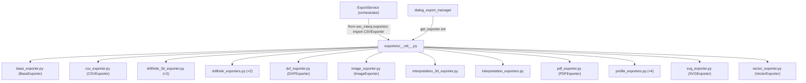

---
tags:
  - secinterp
  - code-walkthrough
  - exporters
aliases:
  - __init__.py
  - exporters
  - get_exporter
cssclass: secinterp-note
---

# `exporters/__init__.py`

> [!abstract] Resumen en una línea
> Fachada del paquete `exporters/`: re-exporta las 16 clases writer y ofrece `get_exporter()` como factory por extensión de archivo.

**Ruta**: `exporters/__init__.py` (81 líneas)
**Símbolos principales**: `get_exporter`, `__all__` (17 nombres)
**Capa**: Exporters (GUI · QGIS-dependiente; el `__init__` en sí no importa QGIS)
**Tags**: #secinterp #exporters

---

## 🎯 ¿Por qué existe este archivo?

El paquete tiene 12 módulos writer. Sin fachada, cada consumidor memorizaría rutas
internas (`from sec_interp.exporters.profile_exporters import GeologyVectorExporter`).
Con fachada, un solo punto de importación y una factory que elige clase por extensión:

| Problema | Solución |
|----------|----------|
| 12 módulos con rutas internas inestables | Re-exports + `__all__` de 17 nombres: `from sec_interp.exporters import X` |
| Elegir writer por extensión en cada llamada | `get_exporter(extension, settings)` centraliza el dispatch |
| Imports circulares entre writers y paquete | Los writers importan `.base_exporter` relativo; el `__init__` solo re-exporta hojas |

> [!important] Nota arquitectónica — Facade + Factory mínima
> Este `__init__` es **puro re-export** (sin lógica salvo `get_exporter`). No registra
> los writers 2D/3D de perforaciones e interpretaciones en la factory: esos los eligen
> los handlers del core (`exp_drill`, `exp_interp`) por entidad, no por extensión.

---

## 🧬 Diagrama de relaciones



> [!tip] Cómo leer
> Las 12 flechas salientes son re-exports (el `__init__` no envuelve nada). El
> [[orchestrator]] importa `CSVExporter` desde aquí con import lazy; la GUI puede pedir
> un writer genérico con `get_exporter()`.

---

## 📦 Imports — lectura arquitectónica

```python
# exporters/__init__.py
from __future__ import annotations

"""Exporters package for Sec Interp plugin.

Provides specialized exporters for different file formats.
"""

from .base_exporter import BaseExporter
from .csv_exporter import CSVExporter
from .drillhole_3d_exporter import (
    DrillholeInterval3DExporter,
    DrillholeTrace3DExporter,
)
from .drillhole_exporters import (
    DrillholeIntervalVectorExporter,
    DrillholeTraceVectorExporter,
)
from .dxf_exporter import DXFExporter
from .image_exporter import ImageExporter
from .interpretation_3d_exporter import Interpretation3DExporter
from .interpretation_exporters import Interpretation2DExporter
from .pdf_exporter import PDFExporter
from .profile_exporters import (
    AxesVectorExporter,
    GeologyVectorExporter,
    ProfileLineVectorExporter,
    StructureVectorExporter,
)
from .svg_exporter import SVGExporter
from .vector_exporter import VectorExporter
```

| # | Observación |
|---|-------------|
| ① | `from __future__ import annotations` antes del docstring: orden inusual pero válido (el future-import debe ir primero). |
| ② | Imports relativos (`from .x import Y`): el paquete es autocontenido y reubicable. |
| ③ | Solo importa **hojas** (clases concretas), nunca submódulos entre sí: sin ciclos. |
| ④ | Orden alfabético por módulo (`base_`, `csv_`, `drillhole_`, `dxf_`, `image_`, `interpretation_`, `pdf_`, `profile_`, `svg_`, `vector_`). |
| ⑤ | El `__init__` no toca `qgis.*`: importar el paquete es barato; QGIS se carga al instanciar writers. |

---

## 🏗️ Inventario de estructura

**Símbolos:** 1 función (`get_exporter`) + `__all__` con 17 nombres (16 clases + `get_exporter`).

| Nombre en `__all__` | Módulo origen | Nota |
|---|---|---|
| `AxesVectorExporter` | `profile_exporters` | Ejes del perfil |
| `BaseExporter` | `base_exporter` | Clase base abstracta |
| `CSVExporter` | `csv_exporter` | Tablas CSV |
| `DXFExporter` | `dxf_exporter` | CAD DXF |
| `DrillholeInterval3DExporter` | `drillhole_3d_exporter` | Intervalos `LineStringZ` |
| `DrillholeIntervalVectorExporter` | `drillhole_exporters` | Intervalos 2D |
| `DrillholeTrace3DExporter` | `drillhole_3d_exporter` | Trazas `LineStringZ` |
| `DrillholeTraceVectorExporter` | `drillhole_exporters` | Trazas 2D |
| `GeologyVectorExporter` | `profile_exporters` | Tramos geológicos |
| `ImageExporter` | `image_exporter` | PNG/JPG del canvas |
| `Interpretation2DExporter` | `interpretation_exporters` | Polígonos 2D |
| `Interpretation3DExporter` | `interpretation_3d_exporter` | Polígonos `PolygonZ` + QML |
| `PDFExporter` | `pdf_exporter` | Informe PDF |
| `ProfileLineVectorExporter` | `profile_exporters` | Línea topográfica |
| `SVGExporter` | `svg_exporter` | Vectorial SVG |
| `StructureVectorExporter` | `profile_exporters` | Ticks estructurales |
| `VectorExporter` | `vector_exporter` | Genérico SHP/GPKG/DXF |

> [!note] `__all__` ordenado alfabéticamente
> Con una excepción aparente: `get_exporter` cierra la lista (las funciones van tras las
> clases). El orden alfabético facilita detectar duplicados y ausencias a simple vista.

---

## 📁 Archivos del paquete `exporters/`

| Archivo | Líneas | Rol |
|---|--:|---|
| `__init__.py` | 81 | Esta nota: fachada + `get_exporter()` |
| `base_exporter.py` | 137 | `BaseExporter` (contrato `export()` + validación de rutas) |
| `csv_exporter.py` | — | `CSVExporter` (tablas de perfil) |
| `drillhole_3d_exporter.py` | 243 | Trazas e intervalos `LineStringZ` |
| `drillhole_exporters.py` | 239 | Trazas e intervalos 2D |
| `dxf_exporter.py` | — | Salida CAD |
| `image_exporter.py` | — | PNG/JPG |
| `interpretation_3d_exporter.py` | 465 | `PolygonZ` + estilo QML |
| `interpretation_exporters.py` | 146 | Polígonos 2D |
| `pdf_exporter.py` | — | Informe PDF |
| `profile_exporters.py` | 362 | Topografía, geología, estructuras, ejes |
| `svg_exporter.py` | — | Salida SVG |
| `vector_exporter.py` | — | Genérico SHP/GPKG/DXF |

Las notas con línea exacta se leyeron como fuente de esta fase; el resto se documenta
en sus notas propias (`[[csv_exporter]]`, `[[dxf_exporter]]`, `[[image_exporter]]`,
`[[pdf_exporter]]`, `[[svg_exporter]]`, `[[vector_exporter]]`, [[base_exporter]]).

---

## 📖 Recorrido función por función

### `get_exporter` — factory por extensión

```python
def get_exporter(extension: str, settings: dict) -> BaseExporter:
    """Get the appropriate exporter instance for the file extension.

    Args:
        extension: File extension (e.g., '.png', '.svg', '.dxf')
        settings: Export settings dictionary

    Returns:
        Appropriate exporter instance

    Raises:
        ValueError: If extension is not supported

    """
    extension = extension.lower()

    if extension in [".png", ".jpg", ".jpeg"]:
        return ImageExporter(settings)
    if extension == ".svg":
        return SVGExporter(settings)
    if extension == ".pdf":
        return PDFExporter(settings)
    if extension == ".csv":
        return CSVExporter(settings)
    if extension in [".shp", ".gpkg", ".dxf"]:
        return VectorExporter(settings)

    raise ValueError(f"Unsupported file extension: {extension}")
```

| Rama | Writer | Observación |
|------|--------|-------------|
| `.png` / `.jpg` / `.jpeg` | `ImageExporter(settings)` | Único con 3 alias (normaliza con `.lower()`) |
| `.svg` | `SVGExporter(settings)` | Salida vectorial para informes |
| `.pdf` | `PDFExporter(settings)` | Documento, no capa |
| `.csv` | `CSVExporter(settings)` | El que usa el [[orchestrator]] (`CSVExporter({})`) |
| `.shp` / `.gpkg` / `.dxf` | `VectorExporter(settings)` | Genérico; los writers por entidad **no** pasan por aquí |
| Otra | `ValueError` | `ValueError` estándar, no `ExportError` del dominio |

> [!important] Alcance limitado de la factory
> `get_exporter` cubre formatos de **archivo**, no entidades geológicas: no hay rama para
> "sondajes" o "interpretaciones" porque esos writers necesitan `data` con forma
> específica y los eligen los handlers (`drillholes`, `interpretations`, …). Es una
> factory de conveniencia para la GUI, no el dispatch principal (ese vive en el
> [[orchestrator]]).

---

## 🔄 Flujo de datos

| Fase | Entrada | Transformación | Salida |
|------|---------|----------------|--------|
| Re-export | `from sec_interp.exporters import X` | `__all__` expone 16 clases | Clase lista para instanciar |
| Factory | `extension` + `settings` | `lower()` + cadena de `if` | Writer configurado |
| Extensión desconocida | `".tif"`, `""`, … | sin rama coincidente | `ValueError` |
| Consumo | writer + `data` por entidad | `writer.export(path, data)` | `bool` (contrato `BaseExporter`) |

---

## 🏛️ Patrones de diseño presentes

| Patrón | Dónde | Propósito |
|--------|-------|-----------|
| **Facade** | Re-exports + `__all__` | Un punto de importación para 12 módulos |
| **Factory (simple)** | `get_exporter` | Elegir writer por extensión |
| **Registry implícito** | Cadena de `if` por extensión | Mapa extensión → clase sin dict separado |
| **Fail fast** | `ValueError` final | Extensión inválida detectada al pedir, no al escribir |

---

## 🧾 Resumen de la API

| Símbolo | Firma | Uso típico |
|---------|-------|------------|
| `get_exporter` | `(extension: str, settings: dict) -> BaseExporter` | `get_exporter(".pdf", settings).export(path, data)` |
| `__all__` | 17 nombres | `from sec_interp.exporters import *` controlado |
| Re-exports | 16 clases | `from sec_interp.exporters import GeologyVectorExporter` |

---

## 🛡️ Manejo de errores

| Situación | Comportamiento |
|-----------|----------------|
| Extensión en mayúsculas (`".SHP"`) | Normalizada con `.lower()` → funciona |
| Extensión desconocida | `ValueError(f"Unsupported file extension: {extension}")` |
| `settings` sin claves | Se propaga al writer (`get_setting` con defaults en `BaseExporter`) |
| Import del paquete | Sin efectos laterales: no instancia nada, no toca QGIS ni disco |

> [!note] `ValueError`, no `ExportError`
> La factory falla **antes** de exportar (mala petición del llamante), así que usa el
> error estándar de Python. `ExportError` (ver [[exceptions]]) se reserva para fallos
> durante la escritura.

---

## 🧪 Tests asociados

**Unitarios del paquete** (ver `tests/exporters/`):

- `tests/exporters/test_exporters.py::test_get_supported_extensions` — contrato de extensiones.
- `tests/exporters/test_exporters.py::test_export_valid_data` / `test_export_empty_data` — contrato `export() -> bool`.
- `tests/exporters/test_vector_exporter.py`, `test_svg_exporter.py`, `test_pdf_exporter.py`, `test_image_exporter.py` — writers de la factory.
- `tests/exporters/test_drillhole_3d_exporter.py`, `test_drillhole_export_objects.py` — writers por entidad.
- `tests/exporters/test_interpretation_exporters.py`, `test_interpretation_3d_exporter.py` — writers por entidad.

**Integración**:

- `tests/integration/test_export_service_e2e.py` — el [[orchestrator]] consumiendo `CSVExporter` vía este paquete.
- `tests/integration/test_vector_drivers_integration.py` — drivers SHP/GPKG/DXF reales.

> [!tip] Hueco de cobertura
> No hay test dedicado a `get_exporter()` (ramas por extensión + `ValueError`): es el
> test más barato de añadir para este archivo (sin QGIS, solo `settings` dict).

---

## 👀 Observaciones y notas

> [!success] Fortalezas
> - Un solo import para todo el paquete; `__all__` alfabético y completo.
> - El `__init__` no importa QGIS: importar el paquete nunca rompe tests sin QGIS.
> - Factory normalizando case (`lower()`), con error claro para lo desconocido.

> [!warning] Puntos de atención
> - La factory ignora a 9 de las 16 clases (toda la familia por entidad 2D/3D).
> - `settings: dict` sin parametrizar (`dict[str, Any]` sería coherente con `BaseExporter`).
> - `from __future__` antes del docstring: válido pero contrario a la convención.
> - Sin `__all__` dinámico: añadir un writer exige tocar imports + lista (olvidable).

> [!question] Preguntas abiertas
> - ¿Ampliar `get_exporter` con dispatch por entidad (`kind="drillholes_3d"`) o mantenerla de archivos?
> - ¿Test unitario de `get_exporter` (todas las ramas + `ValueError`)?
> - ¿Tipar `settings` como `dict[str, Any]`?

---

## 🔗 Notas relacionadas

- [[Index]] — índice de la bóveda
- [[base_exporter]] — `BaseExporter`, contrato que comparten los 16 writers
- [[drillhole_exporters]] / [[drillhole_3d_exporter]] — writers de sondajes
- [[interpretation_exporters]] / [[interpretation_3d_exporter]] — writers de interpretaciones
- [[profile_exporters]] — writers del perfil (topografía, geología, estructuras, ejes)
- [[csv_exporter]] / [[vector_exporter]] / [[dxf_exporter]] — writers de la factory
- [[image_exporter]] / [[svg_exporter]] / [[pdf_exporter]] — writers de documento/imagen
- [[orchestrator]] — consumidor principal (`CSVExporter` + handlers por entidad)
- [[dialog_export_manager]] — GUI que usa la factory y los handlers

---

*Nota de la bóveda SecInterp Code Walkthrough v2 — v3.9.0*
