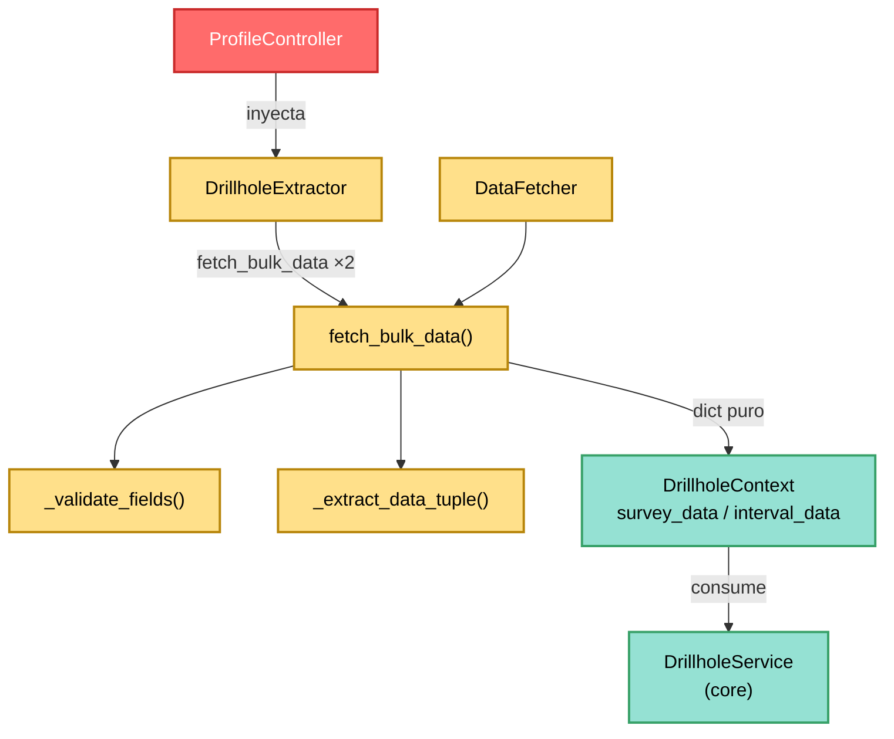

---
tags:
  - secinterp
  - code-walkthrough
  - gui
  - adapters
aliases:
  - feature_fetcher.py
  - DataFetcher
cssclass: secinterp-note
---

# `gui/adapters/feature_fetcher.py`

> [!abstract] Resumen en una línea
> Adaptador **Extract** minimalista (`DataFetcher`, 84 líneas) que lee las capas hijas de sondajes (surveys e intervalos) en una sola pasada por capa con expresión `IN` y devuelve tuplas planas ordenadas por profundidad, para que el core nunca vea un `QgsFeatureRequest`.

**Ruta**: `gui/adapters/feature_fetcher.py` (84 líneas)
**Clase principal**: `DataFetcher`
**Capa**: GUI · Adapter (lado Extract, depende de QGIS)
**Tags**: #secinterp #gui #adapters

---

## 🎯 ¿Por qué existe este archivo?

Los surveys (desviaciones) y los intervalos (litologías) cuelgan de los collares
por `hole_id`. Leerlos pozo a pozo sería una consulta por collar (patrón N+1);
este fetcher invierte la lectura: una pasada por capa hija con filtro `IN`:

| Problema | Solución |
|----------|----------|
| N collares × 2 capas hijas = 2N consultas | `fetch_bulk_data` hace 2 consultas totales (una por hija) con `"id" IN (...)` |
| El core no puede importar `QgsFeatureRequest` | El fetcher devuelve `dict[hole_id, list[tuple]]` puro |
| Surveys desordenados rompen la trayectoria | Ordena cada lista survey por profundidad (`sort(key=x[0])`) |
| Filas corruptas (texto en profundidad) no deben tumbar el lote | `_extract_data_tuple` devuelve `None` y la fila se omite |

> [!important] Nota arquitectónica
> Es el **sub-adapter de hijas** de `DrillholeExtractor`: no lo llama ningún
> diálogo directamente, sino `extract_context` (vía el `data_fetcher` inyectado
> por el `ProfileController`). Su salida alimenta `DrillholeContext.survey_data`
> e `interval_data` tal cual.

---

## 🧬 Diagrama de relaciones



> [!tip] Cómo leer
> `DataFetcher` solo existe para servir a `DrillholeExtractor`: dos llamadas por
> extracción (survey + intervalos). El `QgsFeatureRequest` con filtro `IN` es el
> corazón del ahorro de consultas.

---

## 📦 Imports — lectura arquitectónica

```python
# gui/adapters/feature_fetcher.py
from __future__ import annotations

from typing import Any

from qgis.core import QgsFeature, QgsFeatureRequest, QgsVectorLayer
```

| # | Observación |
|---|-------------|
| ① | Tres clases `qgis.core` y nada más: el módulo más pequeño del paquete (sin `math`, sin `QgsGeometry`, sin raster). |
| ② | Sin `qgis.PyQt`, sin `tr()`, sin logger, sin imports del core: extracción silenciosa; el fracaso se expresa como `{}` o `None`. |
| ③ | `QgsFeature` solo anota `_extract_data_tuple`; `QgsFeatureRequest` construye el filtro `IN`; `QgsVectorLayer` anota las capas hijas. |
| ④ | `Any` cubre `hole_id` (puede ser `int` o `str` según la capa) y los elementos de tupla. |

---

## 🏗️ Inventario de estructura

**Clase:** `class DataFetcher` — 3 métodos (1 público + 2 privados), sin `__init__` ni estado.

**Métodos:**
- `fetch_bulk_data(layer, hole_ids, fields)` — una pasada con filtro `IN`; ordena surveys por profundidad; devuelve `dict[Any, list[tuple]]`.
- `_validate_fields(layer, fields)` — capa válida + campo `id` + campos requeridos según rol (`depth/azim/incl` o `from/to/lith`).
- `_extract_data_tuple(feat, fields, is_survey)` — `(depth, azim, incl)` numérico o `(from, to, lith)` mixto; `None` si la fila es corrupta.

**Convención de `fields`:**
- Clave `"id"` siempre (enlace con el collar).
- Presencia de clave `"depth"` → rol **survey**; ausencia → rol **intervalo**.
- Survey exige `depth/azim/incl`; intervalo exige `from/to/lith`.

---

## 📁 Archivos del paquete

El fetcher vive en el paquete `gui/adapters/` (fase Extract completa):

| Archivo | Líneas | Rol |
|---|--:|---|
| `__init__.py` | 7 | Docstring del paquete: contrato Extract-then-Compute |
| `drillhole_extractor.py` | 369 | `DrillholeExtractor` → `DrillholeContext` (cliente de esta nota) |
| `geology_extractor.py` | 235 | `GeologyExtractor` → `GeologyContext` |
| `geometry.py` | 226 | Helpers QGIS de geometría y muestreo DEM |
| `layer_resolver.py` | 113 | `LayerResolver` + `resolve_layer` (caché de capas) |
| `structure_extractor.py` | 226 | `SectionContext` + `StructureExtractor` |
| `validation_extractor.py` | 176 | `resolve_layer_metadata`, `build_validation_params` |
| `feature_fetcher.py` | 84 | `DataFetcher` (esta nota) |
| `profile_extractor.py` | 86 | `ProfileExtractor` → `ProfileData` |

---

## 📖 Recorrido método por método

### `fetch_bulk_data` — una pasada por capa hija

```python
def fetch_bulk_data(
    self, layer: QgsVectorLayer, hole_ids: set[Any], fields: dict[str, str]
) -> dict[Any, list[tuple[Any, ...]]]:
    if not self._validate_fields(layer, fields):
        return {}
    result_map: dict[Any, list[tuple]] = {}
    if not hole_ids:
        return {}
    id_f = fields["id"]
    is_survey = "depth" in fields
    ids_str = ", ".join([f"'{hid!s}'" for hid in hole_ids])
    request = QgsFeatureRequest().setFilterExpression(f'"{id_f}" IN ({ids_str})')
    for feat in layer.getFeatures(request):
        hole_id = feat[id_f]
        data = self._extract_data_tuple(feat, fields, is_survey)
        if data:
            result_map.setdefault(hole_id, []).append(data)
    # Sort surveys by depth
    if is_survey:
        for h_id in result_map:
            result_map[h_id].sort(key=lambda x: x[0])
    return result_map
```

| Paso | Detalle |
|------|---------|
| **Validación** | Campos mal mapeados → `{}` inmediato (sin consultar la capa). |
| **Guarda vacía** | `hole_ids` vacío → `{}` (evita un `IN ()` inválido). |
| **Filtro** | Expresión `"<id>" IN ('a', 'b', ...)` con cada id entrecomillado como string (`'{hid!s}'`). |
| **Agregación** | `setdefault(hole_id, [])` agrupa por pozo; filas corruptas (`None`) se omiten. |
| **Orden** | Solo surveys: `sort` por `x[0]` (profundidad) — el `TrajectoryEngine` asume desviaciones ordenadas. |

> [!note] Detección de rol por clave
> `is_survey = "depth" in fields` decide el esquema de tupla y el orden. Es una
> convención implícita entre el diálogo (que construye `survey_fields` /
> `interval_fields` desde `PreviewParams`) y este método: documentada aquí y en
> `_validate_fields`, pero sin constante ni enum que la respalde.

### `_validate_fields` — campos según rol

```python
def _validate_fields(self, layer: QgsVectorLayer, fields: dict[str, str]) -> bool:
    if not layer or not layer.isValid():
        return False
    id_f = fields.get("id")
    if not id_f or layer.fields().indexFromName(id_f) == -1:
        return False
    is_survey = "depth" in fields
    required = ["depth", "azim", "incl"] if is_survey else ["from", "to", "lith"]
    for field_key in required:
        f_name = fields.get(field_key)
        if not f_name or layer.fields().indexFromName(f_name) == -1:
            return False
    return True
```

Tres chequeos en cascada (capa → `id` → campos del rol) con `indexFromName == -1`
como "campo ausente". Devuelve `bool`, no excepción: el llamador traduce `False`
en `{}`. Nótese que valida **nombres de campo de capa** (`fields.get("depth")`
→ nombre real), no las claves del mapping.

### `_extract_data_tuple` — fila a tupla

```python
def _extract_data_tuple(
    self, feat: QgsFeature, fields: dict[str, str], is_survey: bool
) -> tuple[float, float, Any] | None:
    try:
        if is_survey:
            return (
                float(feat[fields["depth"]]),
                float(feat[fields["azim"]]),
                float(feat[fields["incl"]]),
            )
        else:
            return (
                float(feat[fields["from"]]),
                float(feat[fields["to"]]),
                str(feat[fields["lith"]]),
            )
    except (ValueError, TypeError, KeyError):
        return None
```

Survey: triple numérico `(prof, azimut, inclinación)`. Intervalo: `(desde, hasta,
litología)` con la litología como `str` (códigos alfanuméricos válidos).
Cualquier celda no convertible o clave ausente → `None` (fila descartada, resto
del pozo intacto).

---

## 🔄 Flujo de datos

| Fase | Entrada | Transformación | Salida |
|------|---------|----------------|--------|
| Validación | capa + mapping | `_validate_fields` | `True` o `{}` |
| Filtro | `hole_ids` | `"id" IN (...)` | `QgsFeatureRequest` |
| Lectura | features hijas | `_extract_data_tuple` por fila | tuplas (o descarte) |
| Agregación | tuplas | `setdefault(hole_id, [])` | `dict[hole_id, list]` |
| Orden | listas survey | `sort(key=profundidad)` | desviaciones ordenadas |
| Entrega | dict puro | (vía `DrillholeExtractor`) | `DrillholeContext.survey_data` / `interval_data` |

---

## 🏛️ Patrones de diseño presentes

| Patrón | Dónde | Propósito |
|--------|-------|-----------|
| **Bulk fetch (anti N+1)** | `fetch_bulk_data` | 2 consultas en vez de 2N |
| **Rol por convención** | `"depth" in fields` | un método para survey e intervalo |
| **Fila tolerante** | `_extract_data_tuple → None` | filas corruptas no tumban el pozo |
| **Validador booleano** | `_validate_fields` | fallar sin excepciones |

---

## 🧾 Resumen de la API

| Símbolo | Firma | Uso típico |
|---------|-------|------------|
| `DataFetcher` | clase sin estado | `DataFetcher()` (inyectado en `DrillholeExtractor`) |
| `fetch_bulk_data` | `(layer, hole_ids: set, fields: dict) -> dict[Any, list[tuple]]` | surveys o intervalos de N pozos |
| `_validate_fields` | `(layer, fields) -> bool` | guarda de mapping |
| `_extract_data_tuple` | `(feat, fields, is_survey) -> tuple \| None` | una fila hija |

---

## 🛡️ Manejo de errores

| Situación | Comportamiento |
|-----------|----------------|
| Capa inválida / ausente | `{}` |
| Campo `id` o del rol ausente | `{}` |
| `hole_ids` vacío | `{}` (sin consultar) |
| Fila con valores no numéricos | fila omitida (`None`) |
| Clave de mapping ausente (`KeyError`) | fila omitida |

> [!tip] Fracaso silencioso pero acotado
> El `{}` se propaga como `survey_data={}` en el contexto y el core lo trata como
> "pozo vertical sin desviaciones" — degradación con sentido geológico, no un
> error enmascarado cualquiera.

---

## 🧪 Tests asociados

Sin tests dedicados (no existe `test_feature_fetcher.py` ni
`test_data_fetcher.py`); cobertura indirecta:

- `tests/gui/tasks/test_drillhole_task.py` — la tarea que consume surveys/intervalos extraídos.
- `tests/core/test_drillhole_service.py` — el core con `survey_data`/`interval_data` ya agregados (el formato que aquí se produce).
- `tests/core/test_drillhole_service_optional.py` — servicio con hijas vacías (`{}`).
- `tests/integration/test_async_orchestrators.py` — orquestación con `DataFetcher` real inyectado.
- `tests/base_test.py` — mocks QGIS para un futuro test mock-first del filtro `IN`.

> [!warning] Hueco de cobertura
> El filtro `IN` (ids con comillas, nombres de campo con espacios), el `sort` por
> profundidad y el descarte de filas corruptas son tres casos ideales para un
> `test_feature_fetcher.py` con capa falsa.

---

## 🧵 Thread-safety e i18n

| Aspecto | Detalle |
|---------|---------|
| **Hilo** | `getFeatures` con `QgsFeatureRequest` vivo → hilo principal, dentro de `DrillholeExtractor.extract_context`. El dict resultante (primitivos) es lo único que viaja al `QgsTask`. |
| **Expresión `IN`** | Se construye por interpolación de strings: los `hole_id` con comilla simple (`O'Brien`) romperían la expresión — ver observaciones. |
| **i18n** | Nada que traducir: sin mensajes de usuario. |

---

## 📐 Formato de salida (contrato con el core)

| Rol | Tupla | Ejemplo |
|-----|-------|---------|
| Survey | `(depth: float, azim: float, incl: float)` ordenada por `depth` | `(30.0, 145.0, 62.5)` |
| Intervalo | `(from: float, to: float, lith: str)` en orden de lectura | `(0.0, 12.5, "AND")` |
| Clave | `hole_id` tal cual (`feat[id_f]`, sin normalizar) | `101` o `"DH-01"` |

> [!note] Los ids no se normalizan
> `feat[id_f]` conserva el tipo de la capa (`int` vs `str`): el core agrupa por
> igualdad directa con los ids de `collar_data`. Mezclar tipos entre capas
> (collar `101` int vs survey `"101"` str) rompería el enlace en silencio.

---

## 👀 Observaciones y notas

> [!success] Fortalezas
> - Elimina el N+1 con una sola expresión `IN` por hija.
> - Orden de surveys garantizado para el `TrajectoryEngine`.
> - Sin estado: thread-safe por construcción (si los objetos QGIS lo fueran).
> - Degradación geológicamente sensata (`{}` = pozo vertical).

> [!warning] Puntos de atención
> - Interpolación cruda de ids en la expresión: comillas en el id rompen el filtro (usar `QgsExpression.quotedString` sería robusto).
> - Capas con miles de collares generan un `IN (...)` gigante: sin paginación ni límite.
> - Rol implícito por `"depth" in fields`: sin enum ni validación de mapping desconocido.
> - `hole_id` sin normalizar entre collar/survey/intervalo (riesgo `int` vs `str`).

> [!question] Preguntas abiertas
> - ¿Escapar ids con `QgsExpression.quotedString` o parámetros ligados?
> - ¿Paginar el `IN` en bloques (p. ej. 500 ids) para capas masivas?
> - ¿Normalizar `hole_id` a `str` al agregar para blindar el enlace?

---

## 🔗 Notas relacionadas

- [[Index]] — índice de la bóveda
- [[gui_adapters]] — nota de paquete de los adapters Extract
- [[drillhole_extractor]] — cliente directo (inyecta y llama `fetch_bulk_data` ×2)
- [[task_inputs]] — `DrillholeContext.survey_data` / `interval_data` (formato producido)
- [[drillhole_service]] — consumidor core de las tuplas ordenadas
- [[controller]] — `ProfileController` (raíz de composición del fetcher)
- [[dtos]] — `PreviewParams` (origen de `survey_fields` / `interval_fields`)

---

*Nota de la bóveda SecInterp Code Walkthrough v2 — v3.9.1*
