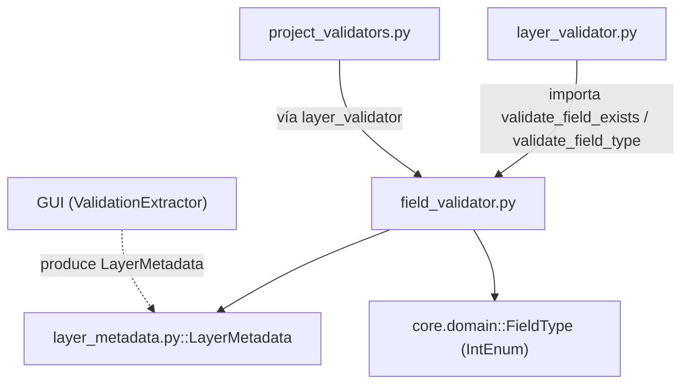

---
tags:
  - secinterp
  - code-walkthrough
  - core
  - validation
aliases:
  - field_validator.py
  - validate_numeric_input
  - validate_integer_input
  - validate_angle_range
  - validate_field_exists
  - validate_field_type
cssclass: secinterp-note
---

# `core/validation/field_validator.py`

> [!abstract] Resumen en una línea
> Conjunto de validadores **QGIS-agnósticos** de nivel 1 para campos y atributos de capa: convierten cadenas de entrada a números/enteros y comprueban existencia y tipo de campos sobre un `LayerMetadata` desacoplado.

**Ruta**: `core/validation/field_validator.py` (184 líneas)
**Clase/Función principal**: `validate_numeric_input`, `validate_integer_input`, `validate_angle_range`, `validate_field_exists`, `validate_field_type`
**Capa**: Core (QGIS-agnóstico)
**Tags**: #secinterp #core #validation

---

## 🎯 ¿Por qué existe este archivo?

La validación de campos es el primer muro de contención antes de que un dato mal
formado llegue al cómputo geológico. Este módulo agrupa los validadores **atómicos**
que no dependen de QGIS ni de estado global:

| Problema | Solución |
|----------|----------|
| Convertir cadenas de un QLineEdit a número sin romper | `validate_numeric_input` / `validate_integer_input` devuelven `(bool, str, valor)` |
| Verificar que un campo existe en una capa | `validate_field_exists` sobre `LayerMetadata.field_names` |
| Verificar que un campo es del tipo esperado | `validate_field_type` contra una lista de `FieldType` |
| Validar ángulos (dip/strike) en rango | `validate_angle_range` con límites por defecto `0..360` |

> [!important] Nota arquitectónica
> **QGIS-agnóstico total.** No importa `qgis.core` ni `PyQt`. Trabaja con
> `LayerMetadata` (DTO desacoplado producido por la GUI) y `FieldType` (un `IntEnum`
> que mapea valores `QVariant.Type` sin importar Qt). Esto permite testear con
> `unittest` puro en `tests/core/`.

---

## 🧬 Diagrama de relaciones



> [!tip] Cómo leer
> Flecha sólida = importa; punteada = es producido por. `field_validator` es la capa
> más baja de validación: otros validadores (`layer_validator`) la reutilizan como
> ladrillos, y la GUI solo entrega `LayerMetadata` sin exponer objetos QGIS.

---

## 📦 Imports — lectura arquitectónica

```python
# core/validation/field_validator.py
from __future__ import annotations

from sec_interp.core.domain import FieldType
from sec_interp.core.validation.layer_metadata import LayerMetadata
```

| # | Observación |
|---|-------------|
| ① | `from __future__ import annotations` — anotaciones diferidas, obligatorio en el proyecto. |
| ② | `FieldType` — `IntEnum` del dominio que reemplaza a `QVariant.Type`; evita importar Qt. |
| ③ | `LayerMetadata` — DTO de metadatos desacoplado; **nunca** se importa `QgsVectorLayer`. |
| ④ | Solo 2 imports locales + el builtin: mínima superficie de dependencia y máxima testabilidad. |

---

## 🏗️ Inventario de estructura

**Funciones (5, todas públicas de nivel módulo):**

- `validate_numeric_input(value, min_val, max_val, field_name, allow_empty) -> (bool, str, float|None)`
- `validate_integer_input(value, min_val, max_val, field_name, allow_empty) -> (bool, str, int|None)`
- `validate_angle_range(value, field_name, min_angle, max_angle) -> (bool, str)`
- `validate_field_exists(metadata, field_name) -> (bool, str)`
- `validate_field_type(metadata, field_name, expected_types) -> (bool, str)`

**Constantes locales (no de módulo):**

- `MAX_FIELDS_TO_SHOW = 5` — dentro de `validate_field_exists`, trunca la lista de campos disponibles.
- `type_names` — dict interno de `validate_field_type` que traduce `FieldType` a nombre legible.

> [!note] Sin clases ni estado
> El módulo es 100% funcional: cinco funciones puras sin estado compartido ⇒
> thread-safe y sin efectos laterales (salvo la construcción de mensajes de error).

---

## 📁 Archivos del paquete

`field_validator.py` pertenece al paquete `core/validation/`; junto a sus vecinos
compone la cadena de validación de 3 niveles:

| Archivo | Rol |
|---------|-----|
| `field_validator.py` | Validación atómica de campos y atributos (este archivo) |
| `layer_validator.py` | Validación espacial (geometría, bandas, CRS) que reutiliza este módulo |
| `path_validator.py` | Validación segura de rutas de salida |
| `validation_helpers.py` | `ValidationContext`, `RichValidationError`, `DependencyRule` |
| `project_validator.py` | Orquestador `ProjectValidator` + DTO `ValidationParams` |
| `project_validators.py` | Validadores especializados por componente (Section/DEM/…) |
| `validators.py` | Fábricas reutilizables para campos de dataclass |
| `layer_metadata.py` | DTO `LayerMetadata` + constantes de geometría/kind |
| `base_validator.py` | Interfaz `IValidator` (ABC) |
| `pipeline.py` | `ValidationPipeline` (ejecución secuencial) |

---

## 📖 Recorrido método por método

### `validate_numeric_input`

```python
def validate_numeric_input(
    value: str,
    min_val: float | None = None,
    max_val: float | None = None,
    field_name: str = "Value",
    allow_empty: bool = False,
) -> tuple[bool, str, float | None]:
    if not value or value.strip() == "":
        if allow_empty:
            return True, "", None
        return False, f"{field_name} is required", None

    try:
        num_value = float(value)
    except (ValueError, TypeError):
        return False, f"{field_name} must be a valid number", None

    if min_val is not None and num_value < min_val:
        return False, f"{field_name} must be at least {min_val}", None
    if max_val is not None and num_value > max_val:
        return False, f"{field_name} must be at most {max_val}", None
    return True, "", num_value
```

Convierte una cadena a `float` y opcionalmente aplica cotas `min_val`/`max_val`. El
flujo de decisión es: vacío → parseo → rango → éxito. Devuelve el número parseado en
la tercera posición de la tupla, evitando que el llamador vuelva a hacer `float()`.

| Parámetro | Rol |
|-----------|-----|
| `allow_empty` | Si `True`, la cadena vacía es válida y devuelve `(True, "", None)` |
| `min_val`/`max_val` | Cotas inclusivas; `None` las desactiva |
| `field_name` | Nombre para personalizar los mensajes de error |

### `validate_integer_input`

```python
def validate_integer_input(
    value: str,
    min_val: int | None = None,
    max_val: int | None = None,
    field_name: str = "Value",
    allow_empty: bool = False,
) -> tuple[bool, str, int | None]:
    if not value or value.strip() == "":
        if allow_empty:
            return True, "", None
        return False, f"{field_name} is required", None

    try:
        int_value = int(value)
    except (ValueError, TypeError):
        return False, f"{field_name} must be a valid integer", None
    ...
    return True, "", int_value
```

Espejo de `validate_numeric_input` pero con `int()`. Una cadena como `"123.45"` falla
aquí (a diferencia del caso numérico), lo que es el comportamiento deseado para
campos que exigen enteros (p. ej. número de banda, identificadores).

### `validate_angle_range`

```python
def validate_angle_range(
    value: float, field_name: str, min_angle: float = 0.0, max_angle: float = 360.0
) -> tuple[bool, str]:
    if value < min_angle or value > max_angle:
        return (
            False,
            f"{field_name} must be between {min_angle} and {max_angle} degrees",
        )
    return True, ""
```

Valida un ángulo (dip, strike) ya **numérico**. Los límites por defecto `0.0..360.0`
cubren azimut/rumbo; un dip puede llamarse con `max_angle=90.0`. Nota: los límites son
inclusivos, así que `360.0` es válido.

### `validate_field_exists`

```python
def validate_field_exists(metadata: LayerMetadata, field_name: str | None) -> tuple[bool, str]:
    if not metadata or not metadata.is_valid:
        return False, "Layer is not valid"
    if not field_name:
        return False, "Field name is required"
    if metadata.kind != "vector":
        return False, f"Layer '{metadata.name}' is not a vector layer"

    if field_name not in metadata.field_names:
        MAX_FIELDS_TO_SHOW = 5
        return False, (
            f"Field '{field_name}' not found in layer '{metadata.name}'. "
            f"Available fields: {', '.join(metadata.field_names[:MAX_FIELDS_TO_SHOW])}"
            f"{', ...' if len(metadata.field_names) > MAX_FIELDS_TO_SHOW else ''}"
        )
    return True, ""
```

Comprueba que un campo existe en el `LayerMetadata`. El mensaje de error es **útil**:
lista hasta 5 campos disponibles y añade `, ...` si hay más. Primero valida el
prerequisito (capa válida, nombre presente, capa vectorial) antes de mirar los campos.

### `validate_field_type`

```python
def validate_field_type(
    metadata: LayerMetadata, field_name: str, expected_types: list[FieldType]
) -> tuple[bool, str]:
    if not metadata or not metadata.is_valid:
        return False, "Layer is not valid"
    if metadata.kind != "vector":
        return False, f"Layer '{metadata.name}' is not a vector layer"
    if field_name not in metadata.field_types:
        return False, f"Field '{field_name}' not found in layer '{metadata.name}'"

    actual = metadata.field_types[field_name]
    if actual not in expected_types:
        type_names = {
            FieldType.INT: "Integer",
            FieldType.DOUBLE: "Double",
            FieldType.STRING: "String",
            FieldType.LONG_LONG: "Long Integer",
            FieldType.DATE: "Date",
            FieldType.DATE_TIME: "DateTime",
        }
        expected_names = [type_names.get(t, str(t)) for t in expected_types]
        actual_name = type_names.get(actual, f"Type ID {actual}")
        return False, (
            f"Invalid data type for field '{field_name}' in layer '{metadata.name}'. "
            f"Found: {actual_name}. Expected one of: {', '.join(expected_names)}. "
            f"Please check your attribute table."
        )
    return True, ""
```

Comprueba que el tipo real del campo (`metadata.field_types[field_name]`) está en
`expected_types`. Traduce los enums a nombres legibles ("Integer", "Double", …) para
un mensaje de error accionable. El `type_names` solo cubre 6 de los 8 `FieldType`
(omite `NULL` y `BOOL`), cayendo a `str(t)` / `Type ID {actual}` para el resto.

| `FieldType` | Nombre legible |
|-------------|----------------|
| `INT` | Integer |
| `DOUBLE` | Double |
| `STRING` | String |
| `LONG_LONG` | Long Integer |
| `DATE` | Date |
| `DATE_TIME` | DateTime |

---

## 🔄 Flujo de datos

| Fase | Entrada | Transformación | Salida |
|------|---------|----------------|--------|
| Numérico | `str` desde un campo de texto | `float()` + cotas | `(bool, str, float\|None)` |
| Entero | `str` desde un campo de texto | `int()` + cotas | `(bool, str, int\|None)` |
| Ángulo | `float` ya parseado | comparación de rango | `(bool, str)` |
| Existencia | `LayerMetadata` + `field_name` | búsqueda en `field_names` | `(bool, str)` |
| Tipo | `LayerMetadata` + `field_name` + `list[FieldType]` | comparación de enums | `(bool, str)` |

> [!tip] Convención de retorno uniforme
> Todos devuelven `(bool, str, valor_opcional)` o `(bool, str)`. `bool=True` significa
> válido; la cadena vacía `""` es el "mensaje de éxito". Esto permite composición en
> cascada sin excepciones.

---

## 🏛️ Patrones de diseño presentes

| Patrón | Dónde | Propósito |
|--------|-------|-----------|
| **Función pura** | las 5 funciones | Sin estado ni efectos laterales ⇒ thread-safe |
| **Result tuple** | todos los retornos | Señal de éxito + mensaje + valor, sin lanzar excepciones |
| **DTO como frontera** | `LayerMetadata` | Desacoplar la validación de QGIS |
| **Enum de dominio** | `FieldType` | Validar tipos sin depender de `QVariant.Type` |
| **Mensaje accionable** | `validate_field_exists` | Mostrar campos disponibles reales al usuario |

---

## 🧾 Resumen de la API

| Símbolo | Firma / Hereda | Uso típico |
|---------|----------------|------------|
| `validate_numeric_input` | `(value, min_val=None, max_val=None, field_name="Value", allow_empty=False) -> (bool, str, float\|None)` | Validar buffer, escala, exageración |
| `validate_integer_input` | `(value, min_val=None, max_val=None, field_name="Value", allow_empty=False) -> (bool, str, int\|None)` | Validar nº de banda, enteros |
| `validate_angle_range` | `(value, field_name, min_angle=0.0, max_angle=360.0) -> (bool, str)` | Validar dip/strike/azimut |
| `validate_field_exists` | `(metadata, field_name) -> (bool, str)` | Comprobar campo de capa |
| `validate_field_type` | `(metadata, field_name, expected_types) -> (bool, str)` | Comprobar tipo de campo |

---

## 🛡️ Manejo de errores

Este módulo **no lanza excepciones** en la validación normal: usa el patrón de tupla
`(bool, str, valor)`. Solo deja pasar los errores de `float()`/`int()` que él mismo
captura (`ValueError`, `TypeError`). Puntos clave:

| Situación | Comportamiento |
|-----------|----------------|
| Cadena vacía y `allow_empty=False` | `(False, "... is required", None)` |
| Cadena vacía y `allow_empty=True` | `(True, "", None)` |
| No parseable a número/entero | `(False, "... must be a valid number/integer", None)` |
| Fuera de `min_val`/`max_val` | `(False, "... at least/at most ...", None)` |
| Capa no válida / no vectorial | `(False, "Layer is not valid" / "not a vector layer", ...)` |
| Campo no encontrado | `(False, "Field 'X' not found...", ...)` |

> [!note] Sin `ValidationError` aquí
> A diferencia de `validators.py`, este módulo usa tuplas en vez de lanzar
> `ValidationError`. Es la convención de la validación de **proyecto** (nivel 1/2),
> donde acumular varios errores es preferible a fallar rápido. El `ValidationContext`
> de `validation_helpers.py` es quien finalmente agrupa y lanza si hace falta.

---

## 🧪 Tests asociados

Casos puros mapeados a `tests/core/test_field_validator.py` (y a `test_validation.py` /
`test_validation_refactor.py`, que prueban los re-exports desde `core.validation`):

- `test_validate_numeric_input` — parseo, vacío con/sin `allow_empty`, cotas min/max.
- `test_validate_integer_input` — entero válido, `"123.45"` inválido, cota `max_val`.
- `test_validate_angle_range` — `45.0` válido, `400.0` inválido con mensaje `"between 0.0 and 360.0"`.
- `test_validate_field_exists` — campo `id` encontrado, `missing_field` → `"not found"`.
- `test_validate_field_type` — tipo correcto vs incorrecto (`"Invalid data type"`).
- `test_validate_field_type_not_found` — campo ausente → `"not found"`.

---

## 🔢 Ejemplo de uso compuesto

En la práctica, `validate_field_exists` + `validate_field_type` se encadenan para
validar un campo antes de usarlo:

```python
metadata = LayerMetadata(
    name="outcrops",
    is_valid=True,
    kind=KIND_VECTOR,
    field_names=["unit", "age"],
    field_types={"unit": FieldType.STRING, "age": FieldType.INT},
)

ok, msg = validate_field_exists(metadata, "unit")
# ok -> True, msg -> ""

ok, msg = validate_field_type(metadata, "unit", [FieldType.STRING])
# ok -> True, msg -> ""

ok, msg = validate_field_type(metadata, "age", [FieldType.STRING])
# ok -> False
# msg -> "Invalid data type for field 'age' in layer 'outcrops'. Found: Integer. Expected one of: String. ..."
```

Nótese que `validate_field_type` traduce `FieldType.INT` a `"Integer"` en el mensaje
gracias al `type_names` interno, ofreciendo un diagnóstico legible en vez de un valor
numérico de enum.

## 🎚️ Defaults vs validación explícita

Los parámetros por defecto hacen que las funciones sean útiles sin configuración, pero
conviene conocerlos:

| Función | Defaults relevantes | Efecto |
|---------|---------------------|--------|
| `validate_numeric_input` | `field_name="Value"`, `allow_empty=False`, `min_val/max_val=None` | mensaje genérico, vacío inválido, sin cotas |
| `validate_integer_input` | ídem | ídem para enteros |
| `validate_angle_range` | `min_angle=0.0`, `max_angle=360.0` | rango de azimut/rumbo |
| `validate_field_exists` | — | sin defaults sensibles, exige `field_name` |
| `validate_field_type` | — | exige `expected_types` explícito |

> [!tip] `allow_empty` y `field_name` son las dos palancas más usadas
> En formularios opcionales se pasa `allow_empty=True`; en mensajes de UI se pasa
> `field_name` con la etiqueta legible del campo ("Distancia de buffer", etc.).

---

## 👀 Observaciones y notas

> [!success] Fortalezas
> - 100% QGIS-agnóstico: `FieldType` + `LayerMetadata` sustituyen a Qt/QGIS.
> - Funciones puras y sin estado: trivialmente thread-safe y testables.
> - Mensajes de error orientados al usuario (lista de campos disponibles, tipos legibles).

> [!warning] Puntos de atención
> - `type_names` de `validate_field_type` omite `FieldType.NULL` y `FieldType.BOOL`.
> - Código duplicado entre `validate_numeric_input` e `validate_integer_input` (difieren solo en `float`/`int`).
> - Los mensajes son cadenas fijas en inglés (no usan `TranslatableMixin`), a diferencia de `project_validators.py`.

> [!question] Preguntas abiertas
> - ¿Unificar los dos validadores numéricos con un helper parametrizado por `float`/`int`?
> - ¿Mover `type_names` a un mapa de módulo para reutilizarlo en `layer_validator`?

---

## 🔗 Notas relacionadas

- [[Index]] — índice de la bóveda
- [[core_validation]] — nota de paquete del directorio `validation/`
- [[core_validation]] — paquete que incluye `layer_metadata.py` (DTO `LayerMetadata`)
- [[layer_validator]] — reutiliza `validate_field_exists`/`validate_field_type`
- [[domain]] — `FieldType` (IntEnum) importado del dominio
- [[project_validators]] — consumidor final vía los validadores de capa
- [[validators]] — fábricas de validación para dataclasses (estilo alternativo con excepciones)

---

*Nota de la bóveda SecInterp Code Walkthrough v2 — v3.9.1*
