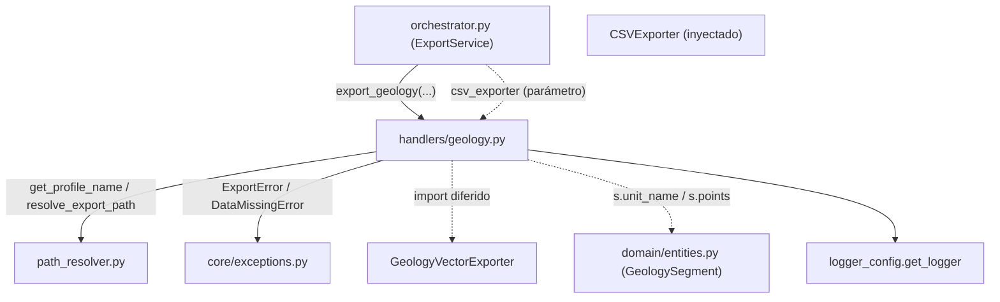

---
tags:
  - secinterp
  - code-walkthrough
  - core
  - export
  - handlers
aliases:
  - geology.py
  - export_geology
cssclass: secinterp-note
---

# `core/services/export/handlers/geology.py`

> [!abstract] Resumen en una línea
> Handler de exportación de **geología**: vuelca los segmentos litológicos a CSV (dist, elev, unidad) y a capa vectorial, derivando las filas de un `GeologySegment` y normalizando errores a `ExportError`.

**Ruta**: `core/services/export/handlers/geology.py` (66 líneas)
**Función principal**: `export_geology`
**Capa**: Core (QGIS-agnóstico)
**Tags**: #secinterp #core #export #handlers

---

## 🎯 ¿Por qué existe este archivo?

El perfil geológico (lista de `GeologySegment`) se exporta en **dos formatos**: un
CSV tabular para análisis (dist, elev, unidad) y una capa vectorial para el GIS. El
handler aísla esa transformación dominio→formato del resto del core.

| Problema | Solución |
|----------|----------|
| Generar filas CSV a partir de segmentos anidados (`segment.points`) | Lista de comprensión `[(p[0], p[1], s.unit_name) ...]` |
| Exportar el mismo dataset en dos formatos | CSV (via `csv_exporter` inyectado) + vector (`GeologyVectorExporter`) |
| Normalizar fallos de ambos formatos | `try/except → ExportError` |

> [!important] Nota arquitectónica
> QGIS-agnóstico: los `data` son `GeologySegment` desacoplados (vía `Any` en la firma).
> El `csv_exporter` se **inyecta** como parámetro desde el orquestador (lo crea una sola
> vez y lo comparte entre varios handlers), mientras el exporter vectorial se importa
> de forma diferida.

---

## 🧬 Diagrama de relaciones



> [!tip] Cómo leer
> `csv_exporter` llega **inyectado** (el orquestador lo crea y lo comparte), mientras
> `GeologyVectorExporter` se importa de forma diferida. `s.points`/`s.unit_name` son
> campos reales de `GeologySegment`.

---

## 📦 Imports — lectura arquitectónica

```python
# core/services/export/handlers/geology.py
from __future__ import annotations

from pathlib import Path
from typing import Any

from sec_interp.core.exceptions import DataMissingError, ExportError
from sec_interp.core.services.export.path_resolver import get_profile_name, resolve_export_path
from sec_interp.logger_config import get_logger
```

```python
# import diferido (dentro de export_geology)
from sec_interp.exporters import GeologyVectorExporter
```

| # | Observación |
|---|-------------|
| ① | `DataMissingError`/`ExportError` de la jerarquía propia; sin importación de `qgis.*`. |
| ② | `csv_exporter` no se importa aquí: llega como parámetro `Any` (compartido). |
| ③ | `GeologyVectorExporter` import diferido: se carga solo si hay segmentos. |
| ④ | El `data: list[Any]` oculta que realmente es `GeologyData` (`list[GeologySegment]`). |

---

## 🏗️ Inventario de estructura

**Funciones/Métodos:**
- `export_geology(folder, data, crs, csv_exporter, msg, controller, settings, ext) -> None`

**Dependencias de dominio:**
- `GeologySegment` (campos `points`, `unit_name`) — accedido por duck-typing vía `Any`.
- `GeologyVectorExporter` (de `sec_interp.exporters`)

Una función pública. La transformación clave es la comprensión de lista que aplana
`segment.points` a tuplas `(dist, elev, unit_name)`.

---

## 📖 Recorrido método por método

### `export_geology`

```python
def export_geology(
    folder: Path,
    data: list[Any] | None,
    crs: Any,
    csv_exporter: Any,
    msg: list[str],
    controller: Any | None,
    settings: Any | None,
    ext: str,
) -> None:
    """Export geological data."""
    if not data:
        return
    from sec_interp.exporters import GeologyVectorExporter

    logger.info("✓ Saving geological profile...")
```

**Guard + import diferido**: sin segmentos no hay nada que hacer. El import del
exporter vectorial se retrasa hasta confirmar que hay datos.

```python
    try:
        profile_name = get_profile_name(controller)
        pattern = getattr(settings, "naming_pattern", None) if settings else None
        rows = [(p[0], p[1], s.unit_name) for s in data for p in s.points]

        csv_path, csv_layer = resolve_export_path(
            folder, "geol_profile", profile_name, pattern, ".csv"
        )
        csv_ok = csv_exporter.export(
            csv_path,
            {"headers": ["dist", "elev", "geology"], "rows": rows},
            layer_name=csv_layer,
        )
        if csv_ok:
            msg.append(f"  - {csv_path.relative_to(folder)}")
```

**CSV tabular**: la comprensión `[(p[0], p[1], s.unit_name) for s in data for p in
s.points]` aplana cada segmento en sus puntos, asociando a cada punto la unidad
litológica. El payload CSV es `{"headers": [...], "rows": rows}` con extensión fija
`.csv`.

```python
        vec_path, vec_layer = resolve_export_path(
            folder, "geol_profile", profile_name, pattern, ext
        )
        vector_exporter = GeologyVectorExporter({})
        vec_ok = vector_exporter.export(
            vec_path, {"geology_data": data, "crs": crs}, layer_name=vec_layer
        )
        if vec_ok:
            msg.append(f"  - {vec_path.relative_to(folder)}")
        else:
            logger.warning(
                f"Failed to write vector geology to {vec_path} (likely no intersections)"
            )
```

**Vectorial**: mismo `base_name="geol_profile"` pero con la extensión del usuario
(`ext`). El payload `{"geology_data": data, "crs": crs}` pasa los segmentos completos.
El `warning` específico sugiere que un `False` aquí suele significar "sin
intersecciones" más que un error de escritura.

```python
    except (OSError, ValueError, TypeError, DataMissingError) as e:
        logger.exception(f"Geology export failed: {e}")
        raise ExportError(f"Geology export failed: {e!s}") from e
    except Exception as e:
        logger.exception("Unexpected system error during geology export")
        raise ExportError(f"Critical error exporting geology: {e}") from e
```

**Normalización**: idéntico contrato de errores al de `drillholes.py` — dos niveles
de `except` que convierten a `ExportError` con causa.

---

## 🔄 Flujo de datos

| Fase | Entrada | Transformación | Salida |
|------|---------|----------------|--------|
| Guard | `data` (`None`/vacío) | early return | — |
| Aplanado | `list[GeologySegment]` | `[(p[0], p[1], s.unit_name) ...]` | `rows` |
| CSV | `rows`, headers | `csv_exporter.export` | `geol_profile.csv` + `msg` |
| Vector | `data`, `crs` | `GeologyVectorExporter.export` | capa geológica + `msg` |

---

## 🏛️ Patrones de diseño presentes

| Patrón | Dónde | Propósito |
|--------|-------|-----------|
| **Guard clause** | `if not data: return` | salida temprana |
| **Lazy import (deferred)** | `GeologyVectorExporter` | ahorrar carga sin datos |
| **Dependency injection** | `csv_exporter` como parámetro | compartir un exporter entre handlers |
| **Exception translation** | `except → ExportError` | normalizar fallos |
| **Data mapping** | comprensión de listas | dominio (`GeologySegment`) → filas CSV |

---

## 🧾 Resumen de la API

| Símbolo | Firma / Hereda | Uso típico |
|---------|----------------|------------|
| `export_geology` | `(folder, data, crs, csv_exporter, msg, controller, settings, ext) -> None` | Exportar geología CSV + vectorial |
| `rows` (interno) | `list[tuple[float, float, str]]` | Filas `(dist, elev, geology)` para CSV |
| `GeologyVectorExporter` | `BaseExporter` (import diferido) | Escribir segmentos como vectorial |

---

## 📐 Contrato de firma del handler

Ocho parámetros; se distingue por recibir el `csv_exporter` **inyectado** (compartido
por el orquestador entre varios handlers):

| Parámetro | Tipo | Rol |
|-----------|------|-----|
| `folder` | `Path` | Directorio base de salida |
| `data` | `list[Any] \| None` | `GeologyData` (`list[GeologySegment]`) desacoplado |
| `crs` | `Any` | CRS de la sección |
| `csv_exporter` | `Any` | Instancia `CSVExporter` inyectada por el orquestador |
| `msg` | `list[str]` | Acumulador de mensajes |
| `controller` | `Any \| None` | Fuente del nombre de perfil |
| `settings` | `Any \| None` | Ajustes de exportación (`naming_pattern`) |
| `ext` | `str` | Extensión de salida |

> [!note] Inyección de dependencia
> `csv_exporter` no se crea aquí: el orquestador lo instancia una vez
> (`CSVExporter({})`) y lo comparte con `topography.py` y `structures.py`. Así se evita
> reconstruir el objeto en cada handler.

## 🔁 Invocación desde el orquestador

```python
"exp_geol": lambda: geo_h.export_geology(
    folder, geol_data, line_crs, csv_exporter, msg,
    self.controller, export_settings, format_ext,
),
```

El `geol_data` proviene de `PreviewResult.geol` (`GeologyData`), la lista de
`GeologySegment` calculada por `GeologyService.build_segments`.

---

## 🛡️ Manejo de errores

| Tipo capturado | Acción | Resultado |
|----------------|--------|-----------|
| `OSError`, `ValueError`, `TypeError`, `DataMissingError` | `logger.exception` + `raise ExportError(...) from e` | error de dominio |
| `Exception` (resto) | `logger.exception` + `raise ExportError(...) from e` | error crítico |

> [!note] `False` del vector no es excepción
> Si `GeologyVectorExporter.export` devuelve `False`, el handler **no** lanza: solo
> registra un `warning` indicando "likely no intersections". Es un resultado esperado,
> no un fallo de escritura.

---

## 🧪 Tests asociados

- `tests/core/test_export_service.py::test_export_geology_error` — un fallo del
  exporter se traduce a `ExportError`.
- `tests/core/test_profile_exporters.py::test_geology_exporter_success` — lógica real
  de `GeologyVectorExporter`.
- `tests/core/test_profile_exporters.py::test_geology_exporter_short_segment` — segmentos
  cortos (edge case).
- `tests/integration/test_export_service_e2e.py::test_export_geology_creates_csv_and_shp` —
  exportación real CSV + shapefile.

---

## 👀 Observaciones y notas

> [!success] Fortalezas
> - Transformación dominio→CSV en una sola expresión declarativa y legible.
> - `csv_exporter` inyectado evita recrear el objeto en cada handler.
> - Contrato de errores uniforme (`ExportError` con causa).

> [!warning] Puntos de atención
> - `data: list[Any]` oculta el tipo real `GeologyData`; pierde documentación del contrato.
> - `rows` usa `p[0]`/`p[1]` (tupla posicional) en lugar de campos nombrados del punto.
> - El `warning` "likely no intersections" es una heurística, no una certeza.

> [!question] Preguntas abiertas
> - ¿Tipar `data` como `GeologyData` y `csv_exporter` como `CSVExporter`?
> - ¿Distinguir "sin intersecciones" de "error de escritura" con un resultado tipado?

---

## 🔗 Notas relacionadas

- [[Index]] — índice de la bóveda
- [[core_services_export_handlers]] — paquete `handlers/` al que pertenece
- [[orchestrator]] — delega en `export_geology` bajo el flag `exp_geol`
- [[geology_service]] — servicio que produce los `GeologySegment` que aquí se exportan
- [[path_resolver]] — `get_profile_name` / `resolve_export_path`
- [[compat]] — `_export_geology` wrapper de compatibilidad
- [[entities]] — `GeologySegment` (`.points`, `.unit_name`)

---

*Nota de la bóveda SecInterp Code Walkthrough v2 — v3.9.0*
