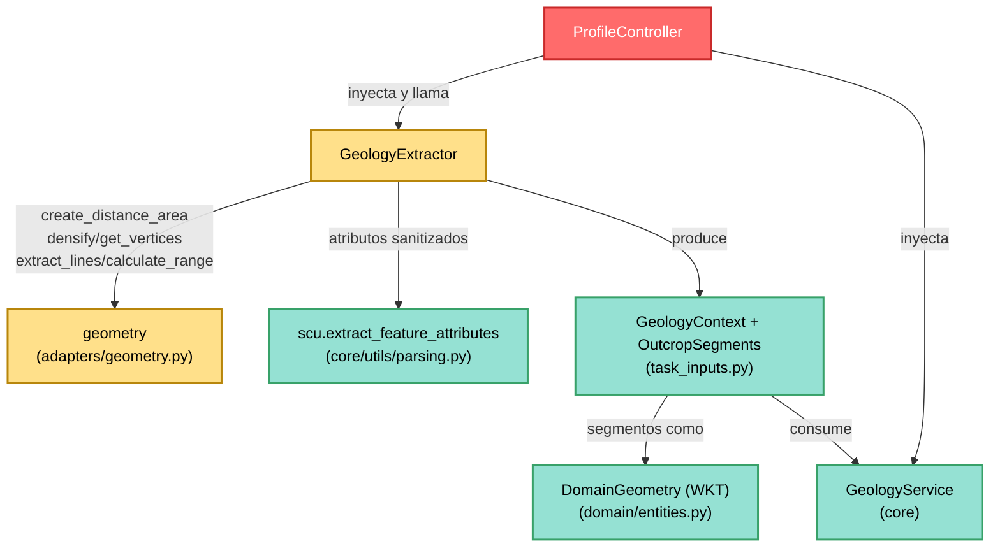

---
tags:
  - secinterp
  - code-walkthrough
  - gui
  - adapters
aliases:
  - geology_extractor.py
  - GeologyExtractor
cssclass: secinterp-note
---

# `gui/adapters/geology_extractor.py`

> [!abstract] Resumen en una línea
> Adaptador **Extract** de geología que densifica la línea de sección sobre el DEM, muestrea el perfil maestro topográfico e intersecta la línea con los polígonos de afloramiento para devolver un `GeologyContext` desacoplado a `GeologyService`.

**Ruta**: `gui/adapters/geology_extractor.py` (235 líneas)
**Clase principal**: `GeologyExtractor`
**Capa**: GUI · Adapter (lado Extract, depende de QGIS)
**Tags**: #secinterp #gui #adapters

---

## 🎯 ¿Por qué existe este archivo?

Construir los segmentos geológicos de una sección combina tres mundos QGIS
(línea, raster DEM, polígonos de afloramiento) que el core no puede leer. Sin un
adaptador, esa lectura quedaría esparcida entre el diálogo y el servicio:

| Problema | Solución |
|----------|----------|
| El core no puede densificar líneas ni muestrear rasters | `_generate_master_profile` lo hace aquí con `QgsDistanceArea` y `dataProvider().sample` |
| La intersección línea↔polígono necesita `QgsGeometry` viva | `_intersect_outcrop` intersecta y convierte cada tramo a WKT desacoplado |
| Leer afloramientos sin filtro espacial escanea toda la capa | `_extract_outcrop_data` pre-filtra por bbox de la línea (`QgsFeatureRequest`) |
| El core debe recibir distancias acumuladas, no geometrías | `master_profile_data` y `OutcropSegments` viajan en `(dist, elev)` y WKT |

> [!important] Nota arquitectónica
> **Adapter Extract** puro: produce `GeologyContext(master_profile_data,
> master_grid_dists, outcrops, tolerance)`. La nota clave es que
> `master_grid_dists` convierte cada `QgsPointXY` a tupla `(x, y)` antes de
> cruzar la frontera — ningún objeto QGIS vivo sale de este módulo.

---

## 🧬 Diagrama de relaciones



> [!tip] Cómo leer
> `GeologyExtractor` es el mayor consumidor del helper `geometry`: usa cinco de
> sus funciones. Todo lo que sale hacia el core son tuplas, WKT y dicts.

---

## 📦 Imports — lectura arquitectónica

```python
# gui/adapters/geology_extractor.py
from __future__ import annotations

from typing import Any

from qgis.core import (
    QgsDistanceArea,
    QgsFeatureRequest,
    QgsGeometry,
    QgsPointXY,
    QgsRasterLayer,
    QgsVectorLayer,
)
from qgis.PyQt.QtCore import QCoreApplication

from sec_interp.core import utils as scu
from sec_interp.core.domain import DomainGeometry
from sec_interp.core.domain.task_inputs import GeologyContext, OutcropSegments
from sec_interp.core.exceptions import DataMissingError, GeometryError, ValidationError
from sec_interp.gui.adapters import geometry
from sec_interp.logger_config import get_logger
```

| # | Observación |
|---|-------------|
| ① | Seis clases `qgis.core` incluyendo `QgsDistanceArea` y `QgsPointXY`: medición elipsoidal y muestreo viven en la GUI. |
| ② | `qgis.PyQt.QtCore.QCoreApplication` para `self.tr()` (agnóstico Qt5/Qt6). |
| ③ | Importa **tres** símbolos del dominio (`DomainGeometry`, `GeologyContext`, `OutcropSegments`): el contrato de salida está tipado al completo. |
| ④ | Tres excepciones de dominio cubren los tres fallos posibles: capa inválida (`DataMissingError`), línea inválida (`GeometryError`), parámetros (`ValidationError`). |
| ⑤ | `geometry` aporta el toolkit (densificar, vértices, rangos); `scu` sanitiza atributos. |

---

## 🏗️ Inventario de estructura

**Clase:** `class GeologyExtractor` — 6 métodos (1 público principal + `tr` + 4 privados).

**Métodos públicos:**
- `tr(message)` — traducción con `QCoreApplication.translate("GeologyExtractor", ...)`.
- `extract_context(line_lyr, raster_lyr, outcrop_lyr, outcrop_name_field, band_number=1)` — orquestador que devuelve `GeologyContext`.

**Métodos privados:**
- `_validate_inputs(line_lyr, raster_lyr, outcrop_lyr, outcrop_name_field, band_number)` — capas válidas, banda en rango, campo de unidad existente.
- `_extract_line_info(line_lyr)` — `(line_geom, line_start)` desde la primera feature.
- `_generate_master_profile(line_geom, raster_lyr, band_number, da, line_start)` — densifica, acumula distancias y muestrea elevaciones; devuelve `(master_profile_data, master_grid_dists_raw)`.
- `_extract_outcrop_data(line_geom, outcrop_lyr, outcrop_name_field)` — features candidatas como `{"wkt", "attrs", "unit_name"}`.
- `_intersect_outcrop(line_geom, line_start, da, item)` — intersección de un afloramiento → `list[tuple[float, float, DomainGeometry]]`.

---

## 📁 Archivos del paquete

El extractor vive en el paquete `gui/adapters/` (fase Extract completa):

| Archivo | Líneas | Rol |
|---|--:|---|
| `__init__.py` | 7 | Docstring del paquete: contrato Extract-then-Compute |
| `drillhole_extractor.py` | 369 | `DrillholeExtractor` → `DrillholeContext` |
| `geology_extractor.py` | 235 | `GeologyExtractor` → `GeologyContext` (esta nota) |
| `geometry.py` | 226 | Helpers QGIS de geometría y muestreo DEM |
| `layer_resolver.py` | 113 | `LayerResolver` + `resolve_layer` (caché de capas) |
| `structure_extractor.py` | 226 | `SectionContext` + `StructureExtractor` |
| `validation_extractor.py` | 176 | `resolve_layer_metadata`, `build_validation_params` |
| `feature_fetcher.py` | 84 | `DataFetcher` (lecturas bulk de hijas) |
| `profile_extractor.py` | 86 | `ProfileExtractor` → `ProfileData` |

---

## 📖 Recorrido método por método

### `tr` — i18n del adaptador

```python
def tr(self, message: str) -> str:
    return QCoreApplication.translate("GeologyExtractor", message)
```

Contexto `"GeologyExtractor"` para Qt Linguist. Todos los `raise` del módulo
formatean ya traducido (`self.tr("...").format(...)`).

### `extract_context` — orquestador Extract

```python
def extract_context(
    self,
    line_lyr: QgsVectorLayer,
    raster_lyr: QgsRasterLayer,
    outcrop_lyr: QgsVectorLayer,
    outcrop_name_field: str,
    band_number: int = 1,
) -> GeologyContext:
    self._validate_inputs(line_lyr, raster_lyr, outcrop_lyr, outcrop_name_field, band_number)
    line_geom, line_start = self._extract_line_info(line_lyr)
    crs = line_lyr.crs()
    da = geometry.create_distance_area(crs)
    master_profile_data, master_grid_dists_raw = self._generate_master_profile(
        line_geom, raster_lyr, band_number, da, line_start
    )
    master_grid_dists = [(d, (pt.x(), pt.y()), e) for d, pt, e in master_grid_dists_raw]
    outcrops: list[OutcropSegments] = []
    if outcrop_lyr:
        for item in self._extract_outcrop_data(line_geom, outcrop_lyr, outcrop_name_field):
            segments = self._intersect_outcrop(line_geom, line_start, da, item)
            outcrops.append(
                OutcropSegments(
                    unit_name=item["unit_name"],
                    attributes=item["attrs"],
                    segments=segments,
                )
            )
    return GeologyContext(
        master_profile_data=master_profile_data,
        master_grid_dists=master_grid_dists,
        outcrops=outcrops,
        tolerance=0.001,
    )
```

| Paso | Detalle |
|------|---------|
| **Validación** | `_validate_inputs` antes de cualquier lectura. |
| **Datum de medida** | `QgsDistanceArea` creado con el CRS de la línea (distancias elipsoidales). |
| **Des-QGIS-ificación** | La comprensión `[(d, (pt.x(), pt.y()), e) ...]` elimina los `QgsPointXY` antes de construir el contexto. |
| **Afloramientos opcionales** | Si `outcrop_lyr` es `None`/falsy, `outcrops` queda vacío sin error. |
| **Tolerancia fija** | `tolerance=0.001` se fija aquí (unidades de mapa); el core la consume tal cual. |

### `_validate_inputs` — capas, banda y campo

```python
def _validate_inputs(self, line_lyr, raster_lyr, outcrop_lyr, outcrop_name_field, band_number):
    for lyr, name in [(line_lyr, "Line layer"), (raster_lyr, "Raster layer")]:
        if not lyr or not lyr.isValid():
            raise DataMissingError(
                self.tr("Invalid layer: {0}. Please check input layers.").format(name),
                {"layer": name},
            )
    if outcrop_lyr and not outcrop_lyr.isValid():
        raise DataMissingError(
            self.tr("Invalid layer: Outcrop layer. Please check input layers."),
            {"layer": "Outcrop layer"},
        )
    if band_number < 1:
        raise ValidationError(self.tr("Band number must be positive."))
    if band_number > raster_lyr.bandCount():
        raise ValidationError(
            self.tr("Band number {0} exceeds raster band count ({1}).").format(
                band_number, raster_lyr.bandCount()
            )
        )
    if outcrop_lyr:
        idx = outcrop_lyr.fields().indexFromName(outcrop_name_field)
        if idx == -1:
            raise ValidationError(
                self.tr("Field '{0}' not found in outcrop layer.").format(outcrop_name_field)
            )
```

La línea y el raster son **obligatorios**; el afloramiento es **opcional** (pero si
se pasa, debe ser válido y contener el campo de unidad). Nótese que los
`DataMissingError` viajan con `details={"layer": ...}` para que la GUI destaque
la capa problemática.

### `_extract_line_info` — geometría y punto inicial

```python
def _extract_line_info(self, line_lyr: QgsVectorLayer) -> tuple[QgsGeometry, QgsPointXY]:
    line_feat = next(line_lyr.getFeatures(), None)
    if not line_feat:
        raise DataMissingError(
            self.tr("Line layer has no features"), {"layer": line_lyr.name()}
        )
    line_geom = line_feat.geometry()
    if not line_geom or line_geom.isNull():
        raise GeometryError(self.tr("Line geometry is not valid"), {"layer": line_lyr.name()})
    if line_geom.isMultipart():
        line_start = line_geom.asMultiPolyline()[0][0]
    else:
        line_start = line_geom.asPolyline()[0]
    return line_geom, line_start
```

A diferencia del extractor de sondajes (que devuelve `None`), aquí la línea
nula es `GeometryError`: sin línea no hay perfil maestro posible. El
`line_start` es el origen de todas las distancias acumuladas.

### `_generate_master_profile` — densificar y muestrear

```python
def _generate_master_profile(self, line_geom, raster_lyr, band_number, da, line_start):
    try:
        interval = raster_lyr.rasterUnitsPerPixelX()
        master_densified = geometry.densify_line_by_interval(line_geom, interval)
        grid_points = geometry.get_line_vertices(master_densified)
    except (AttributeError, ValueError, TypeError) as e:
        logger.warning(f"Failed to densify line, using original vertices: {e}")
        grid_points = geometry.get_line_vertices(line_geom)
    master_profile_data: list[tuple[float, float]] = []
    master_grid_dists: list[tuple[float, QgsPointXY, float]] = []
    current_dist = 0.0
    for i, pt in enumerate(grid_points):
        if i > 0:
            current_dist += da.measureLine(grid_points[i - 1], pt)
        val, ok = raster_lyr.dataProvider().sample(pt, band_number)
        elev = val if ok else 0.0
        master_profile_data.append((current_dist, elev))
        master_grid_dists.append((current_dist, pt, elev))
    return master_profile_data, master_grid_dists
```

El intervalo de densificado es la resolución del raster
(`rasterUnitsPerPixelX`): un vértice por píxel aproximadamente. Si densificar
falla, degrada a los vértices originales con `logger.warning` (no excepción).
Cada punto se muestrea con `dataProvider().sample(pt, band)`; `ok=False` →
elevación `0.0`. Las distancias se acumulan con `da.measureLine` (elipsoidal).

### `_extract_outcrop_data` — candidatas por bbox

```python
def _extract_outcrop_data(self, line_geom, outcrop_lyr, outcrop_name_field):
    outcrop_data: list[dict[str, Any]] = []
    line_bbox = line_geom.boundingBox()
    request = QgsFeatureRequest().setFilterRect(line_bbox)
    for feature in outcrop_lyr.getFeatures(request):
        if not feature.hasGeometry():
            continue
        attrs = scu.extract_feature_attributes(feature)
        try:
            unit_name = str(feature[outcrop_name_field])
        except KeyError:
            unit_name = "Unknown"
        outcrop_data.append({"wkt": feature.geometry().asWkt(), "attrs": attrs, "unit_name": unit_name})
    return outcrop_data
```

Pre-filtro barato por bbox; la geometría viaja como **WKT** (`asWkt()`), que es
el tipo `DomainGeometry` del core. Un campo de unidad ausente en una feature
concreta da `"Unknown"` en lugar de abortar (la validación de existencia del
campo ya ocurrió en `_validate_inputs`).

### `_intersect_outcrop` — intersección desacoplada

```python
def _intersect_outcrop(self, line_geom, line_start, da, item):
    outcrop_geom = QgsGeometry.fromWkt(item["wkt"])
    intersection = line_geom.intersection(outcrop_geom)
    if intersection.isEmpty():
        return []
    segments: list[tuple[float, float, DomainGeometry]] = []
    for seg_geom in geometry.extract_lines_from_geometry(intersection):
        rng = geometry.calculate_segment_range(seg_geom, line_start, da)
        if not rng:
            continue
        dist_start, dist_end = rng
        segments.append((dist_start, dist_end, seg_geom.asWkt()))
    return segments
```

Reconstruye la geometría desde su WKT (round-trip que garantiza que lo
almacenado es serializable), intersecta con la línea y convierte cada tramo a
`(dist_start, dist_end, wkt)`. Los tramos sin rango medible se descartan en
silencio (`continue`).

---

## 🔄 Flujo de datos

| Fase | Entrada | Transformación | Salida |
|------|---------|----------------|--------|
| Validación | 3 capas + banda + campo | `_validate_inputs` | nada (o excepción) |
| Línea | 1ª feature | `_extract_line_info` | `line_geom`, `line_start` |
| Perfil maestro | línea + DEM | densificar → acumular → `sample` | `master_profile_data`, `master_grid_dists` |
| Candidatas | bbox de la línea | `QgsFeatureRequest` + WKT | `{"wkt", "attrs", "unit_name"}` |
| Intersección | línea × WKT | `intersection` → rangos → WKT | `OutcropSegments` |
| Contexto | todo lo anterior | constructor + `tolerance=0.001` | `GeologyContext` puro |

---

## 🏛️ Patrones de diseño presentes

| Patrón | Dónde | Propósito |
|--------|-------|-----------|
| **Adapter (Extract)** | todo el módulo | QGIS entra, primitivos salen |
| **Fail-fast validation** | `_validate_inputs` primero | Ni un `sample` antes de validar |
| **Degradación con gracia** | densificado, `ok=False`, `"Unknown"` | Datos imperfectos no abortan |
| **WKT como moneda** | `asWkt()` / `fromWkt()` | Geometrías serializables y thread-safe |

---

## 🧾 Resumen de la API

| Símbolo | Firma / Hereda | Uso típico |
|---------|----------------|------------|
| `GeologyExtractor` | clase GUI | `GeologyExtractor()` (sin dependencias) |
| `extract_context` | `(line_lyr, raster_lyr, outcrop_lyr, outcrop_name_field, band_number=1) -> GeologyContext` | Punto de entrada Extract |
| `tr` | `(message: str) -> str` | i18n de mensajes |
| `_generate_master_profile` | `(line_geom, raster_lyr, band_number, da, line_start) -> tuple[list, list]` | Perfil topográfico |
| `_intersect_outcrop` | `(line_geom, line_start, da, item) -> list[tuple[float, float, DomainGeometry]]` | Tramos por afloramiento |

---

## 🛡️ Manejo de errores

| Situación | Comportamiento |
|-----------|----------------|
| Línea o raster inválido/ausente | `DataMissingError` con `details={"layer": ...}` |
| Afloramiento inválido (si se pasa) | `DataMissingError` |
| `band_number < 1` o mayor que `bandCount()` | `ValidationError` |
| Campo de unidad inexistente | `ValidationError("Field '{x}' not found...")` |
| Línea sin features / geometría nula | `DataMissingError` / `GeometryError` |
| Densificado falla | `logger.warning` + vértices originales |
| `sample` con `ok=False` | elevación `0.0` |
| Intersección vacía | `[]` (el afloramiento no toca la sección) |

---

## 🧪 Tests asociados

Sin tests unitarios dedicados en `tests/gui/` (no existe
`test_geology_extractor.py`); cobertura indirecta:

- `tests/gui/tasks/test_geology_task.py` — la tarea que consume el `GeologyContext`.
- `tests/integration/test_geology_structure_workflow.py` — flujo geología→estructura integrado.
- `tests/integration/test_async_orchestrators.py` — orquestación con extractores inyectados.
- `tests/core/test_geology_service.py` — consumidor core con contexto mockeado.
- `tests/core/test_geology_service_optional.py` — servicio sin opcionales.
- `tests/core/test_geometry_utils.py` — utilidades espejo de las usadas aquí (densificado, distancias).

> [!warning] Hueco de cobertura
> `_generate_master_profile` (densificar + `sample` + acumulación) y
> `_intersect_outcrop` (rangos WKT) merecerían un `test_geology_extractor.py`
> mock-first con capas falsas de `tests/base_test.py`.

---

## 🧵 Thread-safety e i18n

| Aspecto | Detalle |
|---------|---------|
| **Hilo** | Corre en el hilo principal: `dataProvider().sample`, `intersection` y `QgsFeatureRequest` usan objetos QGIS vivos. Solo el `GeologyContext` viaja al `QgsTask`. |
| **Atributos** | `scu.extract_feature_attributes` sanitiza `QVariant` → primitivos (seguro Qt6). |
| **i18n** | `self.tr()` con contexto `"GeologyExtractor"` vía `qgis.PyQt`; distancias y WKT no se traducen (datos, no mensajes). |

---

## 📐 El `GeologyContext` producido

| Campo | Tipo | Origen en este módulo |
|-------|------|----------------------|
| `master_profile_data` | `list[Point2D]` = `(dist, elev)` | `_generate_master_profile` (distancias elipsoidales acumuladas) |
| `master_grid_dists` | `list[tuple[float, Point2D, float]]` | idem, con `(x, y)` ya convertidos en `extract_context` |
| `outcrops` | `list[OutcropSegments]` | `_extract_outcrop_data` + `_intersect_outcrop` |
| `tolerance` | `float = 0.001` | constante fijada en `extract_context` |

> [!tip] Doble representación del perfil
> `master_profile_data` (solo dist/elev) alimenta el render; `master_grid_dists`
> (con coordenadas) alimenta la interpolación de `GeologyService`. Ver
> [[task_inputs]] y [[geology_service]].

---

## 👀 Observaciones y notas

> [!success] Fortalezas
> - Des-QGIS-ificación explícita en una sola línea (comprensión de `QgsPointXY` → tupla).
> - WKT como formato de intercambio: serializable, thread-safe, testeable sin QGIS.
> - Afloramiento opcional sin ramas de error: `if outcrop_lyr` y listo.
> - Validación rica con `details` por capa para mensajes GUI precisos.

> [!warning] Puntos de atención
> - `tolerance=0.001` hardcodeada: no es configurable desde la GUI ni el proyecto.
> - `elev = 0.0` cuando `sample` falla contamina el perfil (un void del DEM parece nivel del mar).
> - `asMultiPolyline()[0][0]` asume multilínea no vacía: una geometría multipart vacía daría `IndexError` no capturado.
> - Solo la primera feature de línea; varias secciones en una capa se ignoran en silencio.

> [!question] Preguntas abiertas
> - ¿Exponer `tolerance` como parámetro con default `0.001`?
> - ¿Distinguir "void DEM" (`None`/`NaN`) de elevación `0.0` en el perfil maestro?
> - ¿Proteger `asMultiPolyline()[0][0]` con guarda de parte vacía?

---

## 🔗 Notas relacionadas

- [[Index]] — índice de la bóveda
- [[gui_adapters]] — nota de paquete de los adapters Extract
- [[geometry]] — toolkit usado (densificar, vértices, rangos, `QgsDistanceArea`)
- [[task_inputs]] — DTOs `GeologyContext` y `OutcropSegments`
- [[geology_service]] — consumidor core del contexto
- [[controller]] — `ProfileController` que inyecta y orquesta el extractor
- [[drillhole_extractor]] — extractor hermano (validación nivel 3 análoga)
- [[dtos]] — `PreviewParams` que aporta `band_num` y `outcrop_name_field`

---

*Nota de la bóveda SecInterp Code Walkthrough v2 — v3.9.1*
