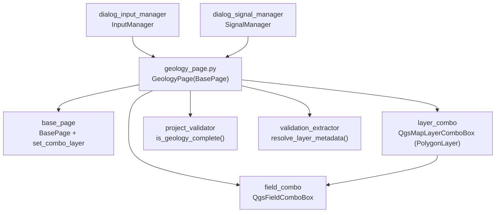

---
tags:
  - secinterp
  - code-walkthrough
  - gui
  - pages
aliases:
  - geology_page.py
  - GeologyPage
cssclass: secinterp-note
---

# `gui/ui/pages/geology_page.py`

> [!abstract] Resumen en una línea
> Página de afloramientos geológicos: combo de capa poligonal con filtro moderno/clásico, combo de campo de nombre de unidad con refresco automático y señal `dataChanged` para el diálogo.

**Ruta**: `gui/ui/pages/geology_page.py` (120 líneas)
**Clase principal**: `GeologyPage(BasePage)`
**Capa**: GUI (presentación programática · Extract hacia `ValidationParams`)
**Tags**: #secinterp #gui #pages

---

## 🎯 ¿Por qué existe este archivo?

Los polígonos de afloramiento aportan los nombres de unidad que la sección
interseca y que la interpretación puede heredar. La página reduce esa
configuración a dos controles: capa y campo de nombre.

| Problema | Solución |
|----------|----------|
| El usuario debe elegir la capa de polígonos y qué campo contiene el nombre de unidad | `layer_combo` (polígonos) + `field_combo` (campo de nombre) |
| Al cambiar de capa, el campo seleccionado puede no existir en la nueva | `layerChanged → field_combo.setLayer` refresca los campos automáticamente |
| El diálogo debe revalidar cuando cambia capa o campo | Señal propia `dataChanged` emitida desde ambas selecciones |

> [!important] Nota arquitectónica
> Extract mínimo: `get_data()` entrega capa viva + nombre de campo; `is_complete()`
> desacopla con `resolve_layer_metadata` y delega en
> `ProjectValidator.is_geology_complete`. La geología es opcional (si no hay capa,
> el diálogo la omite), pero si hay capa el campo es obligatorio.

---

## 🧬 Diagrama de relaciones



> [!tip] Cómo leer
> Flecha sólida = importa/delega; `LC → FC` es la cascada `layerChanged → setLayer`.

---

## 📦 Imports — lectura arquitectónica

```python
# gui/ui/pages/geology_page.py
from __future__ import annotations

import contextlib
from typing import Any

from qgis.core import QgsMapLayerProxyModel
from qgis.gui import QgsFieldComboBox, QgsMapLayerComboBox
from qgis.PyQt.QtCore import QCoreApplication, pyqtSignal
from qgis.PyQt.QtWidgets import QGridLayout, QLabel, QWidget

from sec_interp.core.validation.project_validator import ProjectValidator, ValidationParams
from sec_interp.gui.adapters.validation_extractor import resolve_layer_metadata

from .base_page import BasePage, set_combo_layer
```

| # | Observación |
|---|-------------|
| ① | `QgsMapLayerProxyModel` es el plan B del filtro de capa (ver `_setup_ui`): compatibilidad con QGIS < 3.32. |
| ② | Dúo clásico capa→campo: `QgsMapLayerComboBox` + `QgsFieldComboBox`, el mismo que usan [[structure_page]] (dos campos) y los tabs de sondaje. |
| ③ | `pyqtSignal` para `dataChanged`; `contextlib` para desconexiones blindadas una por una. |
| ④ | Sin `DialogDefaults`: esta página no tiene valores numéricos que persistir por defecto (capa vacía + campo vacío es el defecto). |
| ⑤ | Frontera Extract en dos imports: validador core + extractor de metadatos; ningún servicio geológico aquí. |

---

## 🏗️ Inventario de estructura

**Clase `GeologyPage(BasePage)`:**

- Señal `dataChanged = pyqtSignal()` y `layer_keys = frozenset({"geol_layer"})`
- `__init__(self, parent: QWidget | None = None) -> None`
- `_setup_ui(self) -> None` — rejilla de 2 filas (capa + campo)
- `get_data(self) -> dict[str, Any]` — `outcrop_layer / outcrop_name_field`
- `dump(self) -> dict[str, Any]` — `geol_layer / geol_field`
- `load(self, data: dict[str, Any]) -> None`
- `reset(self) -> None`
- `is_complete(self) -> bool` — vía `is_geology_complete`
- `connect_signals(self) / disconnect_signals(self) -> None`

**Widgets:**

| Widget | Tipo | Rol |
|--------|------|-----|
| `layer_combo` | `QgsMapLayerComboBox` | Capa de polígonos (filtro moderno o clásico, permite vacía) |
| `field_combo` | `QgsFieldComboBox` | Campo con el nombre de unidad |
| `group_layout` | `QGridLayout` (espaciado 6) | Rejilla de 2 filas sobre el `group_box` heredado |

---

## 📖 Recorrido método por método

### `__init__` — título de afloramientos

```python
def __init__(self, parent: QWidget | None = None) -> None:
    super().__init__(QCoreApplication.translate("GeologyPage", "Geological Outcrops"), parent)
```

Sin `iface` ni estado propio: todo lo construye `_setup_ui`. El contexto de
traducción `"GeologyPage"` agrupa el título y las etiquetas de sus dos filas.

### `_setup_ui` — filtro moderno con fallback clásico

```python
def _setup_ui(self) -> None:
    super()._setup_ui()

    self.group_layout = QGridLayout(self.group_box)
    self.group_layout.setSpacing(6)

    # Row 0: Outcrop Layer
    self.group_layout.addWidget(QLabel(self.tr("Outcrops Layer")), 0, 0)

    self.layer_combo = QgsMapLayerComboBox()

    # Use modern flags if available (QGIS 3.32+)
    try:
        from qgis.core import Qgis  # noqa: PLC0415

        self.layer_combo.setFilters(Qgis.LayerFilters(Qgis.LayerFilter.PolygonLayer))
    except (ImportError, AttributeError, TypeError):
        self.layer_combo.setFilters(QgsMapLayerProxyModel.Filter.PolygonLayer)

    self.layer_combo.setAllowEmptyLayer(True)
    # ... tooltip, índice 0, fila 1: "Name Field" + field_combo ...
```

El `try/except` importa `Qgis` en diferido (con `noqa: PLC0415` para ruff) y usa
las flags modernas `Qgis.LayerFilter.PolygonLayer`; si falla (QGIS antiguo o
entorno de test sin ese símbolo), cae al filtro clásico
`QgsMapLayerProxyModel.Filter.PolygonLayer`. [[section_page]] (líneas) y
[[structure_page]] (puntos) repiten el mismo idioma con su geometría. La fila 1
añade `"Name Field"` + `field_combo` con tooltip del campo de nombres.

### `get_data` — dos claves

```python
def get_data(self) -> dict[str, Any]:
    return {
        "outcrop_layer": self.layer_combo.currentLayer(),
        "outcrop_name_field": self.field_combo.currentField(),
    }
```

El `get_data` más pequeño del diálogo junto al de [[section_page]]. `currentField()`
devuelve `""` si no hay selección: `is_complete` lo trata como incompleto cuando
hay capa. `InputManager` los re-mapea a `outcrop_layer` / `outcrop_name_field`
del `ValidationParams` global.

### `dump` / `load` — renombrado `outcrop_` → `geol_`

```python
def dump(self) -> dict[str, Any]:
    return {
        "geol_layer": self.layer_combo.currentLayer(),
        "geol_field": self.field_combo.currentField(),
    }

def load(self, data: dict[str, Any]) -> None:
    geol_layer = data.get("geol_layer")
    if geol_layer is not None:
        set_combo_layer(self.layer_combo, geol_layer)
        self.field_combo.setLayer(geol_layer)
    field = data.get("geol_field")
    if field:
        self.field_combo.setField(field)
```

Como en [[dem_page]] y [[structure_page]], la sesión usa claves `geol_*` mientras
la lectura usa `outcrop_*`. `load` fija la capa en silencio, propaga al combo de
campos **en el mismo paso** (no espera a `layerChanged`, que está bloqueada) y
solo aplica el campo si es no vacío: una sesión sin campo deja el combo intacto
en vez de seleccionar basura.

### `reset` — vaciar ambos combos

```python
def reset(self) -> None:
    self.layer_combo.setLayer(None)
    self.field_combo.setField("")
```

`setLayer(None)` dispara `layerChanged` a propósito (limpia los campos del combo
asociado) y `setField("")` deja el campo sin selección. Sin `DialogDefaults`: el
defecto es "sin geología", coherente con que el bloque sea opcional.

### `is_complete` — opcional pero coherente

```python
def is_complete(self) -> bool:
    data = self.get_data()
    params = ValidationParams(
        outcrop_layer=resolve_layer_metadata(data["outcrop_layer"]),
        outcrop_field=data["outcrop_name_field"],
    )
    return ProjectValidator.is_geology_complete(params)
```

`is_geology_complete` devuelve `False` si falta capa o campo, y si hay capa
valida el bloque con `GeologyValidator`. La regla de [[dialog_input_manager]] lo
refleja: `is_geology_complete(p) if p.outcrop_layer else True` — sin capa, el
bloque se omite sin error.

### `connect_signals` / `disconnect_signals` — cascada + doble emisión

```python
def connect_signals(self) -> None:
    self.layer_combo.layerChanged.connect(self.field_combo.setLayer)
    self.layer_combo.layerChanged.connect(self.dataChanged.emit)
    self.field_combo.fieldChanged.connect(self.dataChanged.emit)
# disconnect_signals revierte las tres + self.dataChanged.disconnect(),
# cada una bajo contextlib.suppress(TypeError, RuntimeError).
```

`layerChanged` alimenta dos slots (refresco de campos y aviso al diálogo) y
`fieldChanged` alimenta el aviso. Tres conexiones, tres desconexiones con
`suppress` individual, más `self.dataChanged.disconnect()` global — el patrón más
completo de las páginas simples; [[structure_page]] lo replica con dos campos.

---

## 🗂️ Claves de lectura frente a claves de sesión

| Origen | Capa | Campo de nombre |
|--------|------|-----------------|
| `get_data` | `outcrop_layer` (viva) | `outcrop_name_field` |
| `dump` / `load` | `geol_layer` | `geol_field` |
| `layer_keys` | `{"geol_layer"}` | — (los campos viajan como primitivos) |
| `InputManager` | `outcrop_layer` | `outcrop_field` (en `ValidationParams`) |

Las claves de campo no se renombran entre lectura y sesión: solo la capa cambia
de namespace (`outcrop_layer → geol_layer`), igual que `raster_layer → dem_layer`
en [[dem_page]] y `structural_layer → struct_layer` en [[structure_page]].

---

## 🧩 Ciclo de vida en el diálogo

| Momento | Quién | Qué hace con la página |
|---------|-------|------------------------|
| Construcción | [[main_window]] / diálogo | `GeologyPage()` en el `QStackedWidget`, entrada "Geology" en [[sidebar]] |
| Cableado | `SignalManager` | `connect_signals()` + suscribe `dataChanged` para refrescar validez |
| Edición | usuario | cambio de capa o campo → `dataChanged` → el diálogo revalida |
| Preview | `InputManager` | bloque opcional: sin capa se omite del pipeline |
| Validación total | `validate_inputs` | `outcrop_layer/outcrop_field` entran al `ValidationParams` global |
| Sesión | persistencia | `dump()` guarda `geol_*`; `load()` restaura en silencio |
| Cierre | `SignalManager` | `disconnect_signals()` con `suppress` individual + global |

---

## 🔄 Flujo de datos

| Fase | Entrada | Transformación | Salida |
|------|---------|----------------|--------|
| Selección | proyecto QGIS | filtro poligonal + vacía permitida | `layer_combo.currentLayer()` |
| Cascada | `layerChanged` | `field_combo.setLayer` + `dataChanged.emit` | campos frescos + diálogo avisado |
| Campo | capa activa | `fieldChanged → dataChanged.emit` | diálogo revalida |
| Lectura | combos | `get_data()` | `outcrop_layer/outcrop_name_field` |
| Completitud | capa viva + campo | `resolve_layer_metadata` + `is_geology_complete` | `bool` (omite si no hay capa) |
| Persistencia | combos | `dump()` | `geol_layer/geol_field` |
| Restauración | dict + capa resuelta | `set_combo_layer` + `setLayer/setField` | combos restaurados en silencio |

---

## 🏛️ Patrones de diseño presentes

| Patrón | Dónde | Propósito |
|--------|-------|-----------|
| **Observer (Qt signals)** | `layerChanged` → campo + aviso | Cascada y notificación en una señal |
| **Compat / fallback** | filtro moderno → clásico | Soportar QGIS < 3.32 sin bifurcar código |
| **Signal relay** | `dataChanged.emit` como slot | Reemisión sin método intermedio |
| **Extract-then-Compute** | `is_complete` desacopla la capa | El core valida sin QGIS |

---

## 🧾 Resumen de la API

| Símbolo | Firma / Hereda | Uso típico |
|---------|----------------|------------|
| `GeologyPage` | `(BasePage)` | pestaña "Geology" del `QStackedWidget` |
| `dataChanged` | `pyqtSignal()` | el diálogo revalida al emitir |
| `layer_keys` | `frozenset({"geol_layer"})` | namespace de persistencia |
| `get_data` | `outcrop_layer/outcrop_name_field` | lectura para `InputManager` |
| `dump` | `geol_layer/geol_field` | sesión multi-sesión |
| `is_complete` | vía `is_geology_complete` | opcional-pero-coherente |

---

## 🛡️ Manejo de errores

- Sin capa: `validate` heredado `(True, "")` (bloque opcional); `is_complete` es `False` solo si se consulta con capa a medio configurar; la regla del diálogo omite el bloque si `outcrop_layer` es nula.
- `load` con campo vacío (`""` o ausente): no toca `field_combo`, evitando selecciones fantasma.
- Filtro moderno ausente: fallback a `QgsMapLayerProxyModel` sin que el usuario note nada.
- Desconexiones con `suppress` individual + global: reconexiones y cierre repetidos no lanzan.

---

## 🧪 Tests asociados

No existe un `tests/gui/test_geology_page.py` dedicado; la cobertura es indirecta
pero real:

- `tests/gui/test_dialog_input_manager.py` — `get_validation_params()` incluye `outcrop_layer/outcrop_name_field`; regla `geology` (`… if p.outcrop_layer else True`).
- `tests/gui/test_main_dialog_validation_manager.py` — mensaje `"Geology configuration is incomplete"`.
- `tests/gui/test_main_dialog_core.py` — construcción del diálogo con la página de geología.
- `tests/gui/test_multi_session_persistence.py` — round-trip `dump/load` con `geol_layer/geol_field`.
- `tests/gui/test_signal_restoration.py` — `test_page_signals_survive_connect_all` cubre la cascada capa→campo.

| Aspecto a testear | Estado |
|-------------------|--------|
| `get_data/dump/load/reset` | sin test dedicado; cubierto vía diálogo |
| Fallback de filtro clásico | sin test (requiere simular `ImportError` de `Qgis`) |
| `is_complete` sin campo | cubierto vía `GeologyValidator` en `tests/core/` |
| `dataChanged` en `layerChanged/fieldChanged` | cubierto vía `test_signal_restoration.py` |
| `validate` heredado | `(True, "")`: el bloque es opcional por diseño |
| Renombrado `outcrop_*` → `geol_*` | solo los tests de diálogo lo fijan; candidato a test de contrato |

---

## 🌐 i18n y notas de migración

- Etiquetas con `self.tr("Outcrops Layer"/"Name Field")`, tooltips traducidos y título con contexto `"GeologyPage"`.
- El fallback de filtro es precisamente una medida de migración: funciona en QGIS 3.22–3.42 y no usa API marcada obsoleta para 4.x.
- `QgsFieldComboBox`/`QgsMapLayerComboBox` de `qgis.gui` son estables entre versiones.

---

## 👀 Observaciones y notas

> [!success] Fortalezas
> - La página más pequeña del diálogo que funciona de punta a punta (120 líneas: filtro, cascada, protocolo, validación).
> - `load` propaga la capa al combo de campos en el mismo paso: no depende de señales bloqueadas para quedar consistente.
> - Patrón de filtro moderno/clásico reutilizado en 3 páginas: consistencia de codebase.
> - Sin valores numéricos ni toggles: el `reset()` es total con dos líneas.

> [!warning] Puntos de atención
> - Sin `validate()` propio: una capa sin campo pasa el Nivel 1; el error aparece en `is_complete`/validador core con menos contexto visual.
> - `setCurrentIndex(0)` con capa vacía permitida selecciona la entrada vacía: correcto, pero acoplado al orden del combo.
> - Sin test dedicado: la regresión más probable (cambio de claves `geol_*`) solo la cazan tests de diálogo.

> [!question] Preguntas abiertas
> - ¿Añadir `tests/gui/test_geology_page.py` espejo de `test_dem_page.py` (contrato de claves + cascada + toggle)?
> - ¿Validar en Nivel 1 "capa sin campo" con mensaje junto al combo, como hace [[dem_page]] con el ráster?
> - ¿Compartir el helper de filtro moderno/clásico entre geología, sección y estructura para no triplicarlo?

---

## 🔗 Notas relacionadas

- [[Index]] — índice de la bóveda
- [[base_page]] — protocolo y `set_combo_layer` usado en `load`
- [[gui_ui_pages]] — paquete de páginas
- [[main_window]] — pestaña "Geology" del `QStackedWidget`
- [[sidebar]] — entrada "Geology" (`mIconPolygonLayer.svg`)
- [[dialog_input_manager]] — regla `geology` y `ValidationParams`
- [[project_validator]] — `is_geology_complete` / `GeologyValidator`
- [[validation_extractor]] — `resolve_layer_metadata`
- [[layer_validator]] — validación de Nivel 3 sobre la capa viva
- [[structure_page]] — página hermana (puntos + dos campos + `dataChanged`)
- [[section_page]] — el otro `get_data` mínimo del diálogo

---

*Nota de la bóveda SecInterp Code Walkthrough v2 — v3.8.0*
