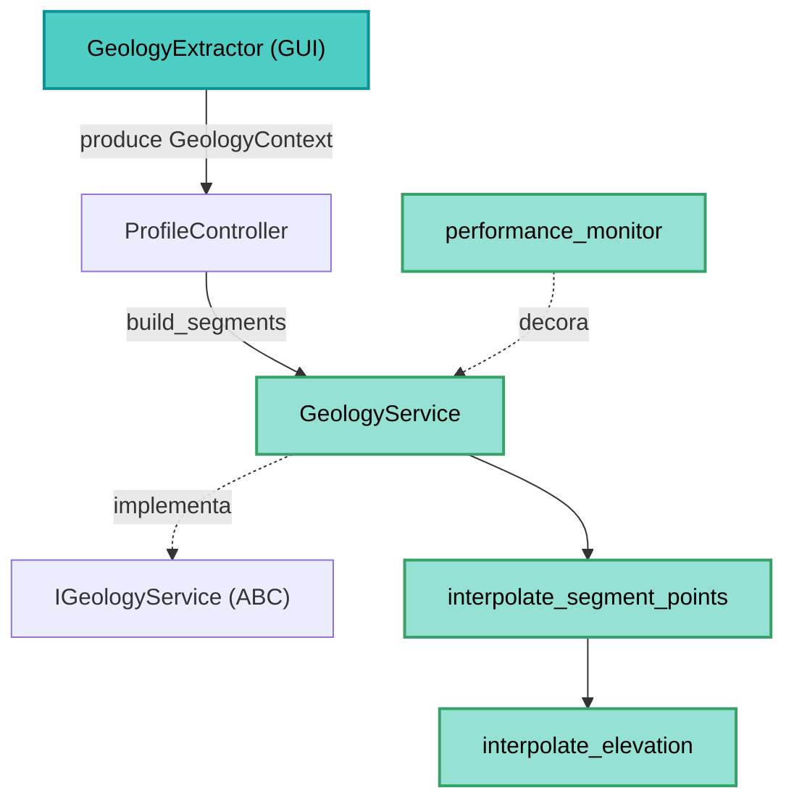

---
tags:
  - secinterp
  - code-walkthrough
  - core
  - services
aliases:
  - geology_service.py
  - GeologyService
  - IGeologyService
cssclass: secinterp-note
---

# `core/services/geology_service.py`

> [!abstract] Resumen en una línea
> Servicio de **cómputo puro** que construye los segmentos geológicos (`GeologySegment`) de una sección a partir de un `GeologyContext` desacoplado, interpolando elevaciones sobre el perfil maestro.

**Ruta**: `core/services/geology_service.py` (87 líneas)
**Clase principal**: `GeologyService(IGeologyService)`
**Capa**: Core (QGIS-agnóstico)
**Tags**: #secinterp #core #services

---

## 🎯 ¿Por qué existe este archivo?

Los afloramientos que cruzan una sección deben convertirse en segmentos con elevaciones
muestreadas a lo largo del perfil. Ese cálculo no depende de QGIS y se concentra aquí:

| Problema | Solución |
|----------|----------|
| Convertir intersecciones (dist_start, dist_end, WKT) en segmentos con elevación | `interpolate_segment_points` + `GeologySegment` |
| Mantener el core libre de QGIS | Recibe `GeologyContext` (salida del `GeologyExtractor`), no capas |
| Reportar progreso sin Qt | `feedback: Any | None` (duck-typed) |
| Medir rendimiento del punto caliente | Decorador `@performance_monitor` |

> [!important] Nota arquitectónica
> **QGIS-agnóstico**: cero `qgis.*`. Es el ejemplo canónico del patrón
> **Extract-then-Compute**: `build_segments` es Compute puro sobre un contexto ya
> extraído. El decorador `@performance_monitor` introduce telemetría sin romper la firma.

---

## 🧬 Diagrama de relaciones



> [!tip] Cómo leer
> Flecha sólida = importa/delega; punteada = implementa/decora. La GUI produce el
> `GeologyContext`; el servicio solo lee `outcrops`, `master_grid_dists` y
> `master_profile_data` para interpolar.

---

## 📦 Imports — lectura arquitectónica

```python
# core/services/geology_service.py
from typing import Any

from sec_interp.core.domain import GeologyData, GeologySegment
from sec_interp.core.domain.task_inputs import GeologyContext
from sec_interp.core.interfaces.geology_interface import IGeologyService
from sec_interp.core.performance_metrics import performance_monitor
from sec_interp.core.utils.geometry_utils.processing import interpolate_segment_points
from sec_interp.logger_config import get_logger
```

| # | Observación |
|---|-------------|
| ① | **Cero `qgis.*`**: solo `typing`, dominio, interfaces y utilidades puras. |
| ② | Importa el contrato `IGeologyService` y lo **implementa** (herencia nominal). |
| ③ | `performance_monitor` es el decorador de telemetría de `core/performance_metrics.py`. |
| ④ | `interpolate_segment_points` vive en `geometry_utils/processing.py` (math pura). |
| ⑤ | `GeologyContext` y `GeologySegment`/`GeologyData` definen entrada y salida del dominio. |

---

## 🏗️ Inventario de estructura

**Clases:** `class GeologyService(IGeologyService)` — 1 método

**Métodos:**
- `build_segments(context: GeologyContext, feedback: Any | None = None) -> GeologyData`

> [!note] Sin estado
> La clase no define `__init__`: es **stateless**, por lo que es trivialmente thread-safe
> y apta para `QgsTask` en segundo plano.

---

## 📖 Recorrido método por método

### `build_segments` — Cálculo principal

```python
@performance_monitor
def build_segments(self, context: GeologyContext, feedback: Any | None = None) -> GeologyData:
    segments: list[GeologySegment] = []
    total = len(context.outcrops)

    for i, outcrop in enumerate(context.outcrops):
        if feedback and feedback.isCanceled():
            return []

        for dist_start, dist_end, wkt in outcrop.segments:
            segment_points = interpolate_segment_points(
                dist_start,
                dist_end,
                context.master_grid_dists,
                context.master_profile_data,
                context.tolerance,
            )
            segments.append(
                GeologySegment(
                    unit_name=outcrop.unit_name,
                    geometry_wkt=wkt,
                    attributes=outcrop.attributes,
                    points=[(float(d), float(e)) for d, e in segment_points],
                )
            )

        if feedback:
            feedback.setProgress((i / total) * 100)

    segments.sort(key=lambda x: x.points[0][0] if x.points else 0)
    return segments
```

| Paso | Detalle |
|------|---------|
| **Cancelación** | `feedback.isCanceled()` al inicio de cada afloramiento → `return []` |
| **Iteración** | Dos bucles: afloramientos → segmentos de intersección (`(dist_start, dist_end, wkt)`) |
| **Interpolación** | `interpolate_segment_points` combina grid interior + elevaciones en los bordes |
| **DTO** | `GeologySegment` con `points=[(dist, elev)]` (float puro) |
| **Orden** | `sort` por `points[0][0]` (distancia inicial), con guarda para segmentos vacíos |
| **Progreso** | `setProgress((i/total)*100)` |

> [!tip] El `wkt` se conserva como `geometry_wkt`
> El DTO `GeologySegment` guarda la geometría WKT original además de los puntos
> muestreados: permite render/export tanto del borde exacto como del perfil simplificado.

---

## 🔄 Flujo de datos

| Fase | Entrada | Transformación | Salida |
|------|---------|----------------|--------|
| Contexto | `GeologyContext` | — | — |
| Por afloramiento | `outcrop.segments` | `interpolate_segment_points` | `list[(dist, elev)]` |
| DTO | `unit_name`, `wkt`, `attributes`, puntos | constructor | `GeologySegment` |
| Ordenación | lista de segmentos | `sort` por distancia | `GeologyData` |

---

## 🏛️ Patrones de diseño presentes

| Patrón | Dónde | Propósito |
|--------|-------|-----------|
| **Template (contrato)** | `IGeologyService` | Fija la firma `build_segments` |
| **Extract-then-Compute** | `GeologyContext` | Contexto puro, cómputo puro |
| **Stateless service** | `GeologyService` | Sin `__init__`, thread-safe |
| **Decorator (telemetría)** | `@performance_monitor` | Medir sin alterar la lógica |

---

## 🧾 Resumen de la API

| Símbolo | Firma / Hereda | Uso típico |
|---------|----------------|------------|
| `GeologyService` | `IGeologyService` | Servicio de geología |
| `build_segments` | `(context: GeologyContext, feedback=None) -> GeologyData` | Segmentos geológicos |

---

## 🛡️ Manejo de errores

| Situación | Comportamiento |
|-----------|----------------|
| Cancelación (`feedback.isCanceled()`) | `return []` (lista vacía) |
| Afloramiento sin segmentos | el bucle interno no itera; nada se añade |
| Segmento sin puntos | la clave de orden usa `if x.points else 0` (no revienta) |

> [!note] Casi sin manejo explícito
> A diferencia de `drillhole_service`, aquí no hay `try/except`: el contexto llega ya
> validado por el `GeologyExtractor`. El único flujo alternativo es la cancelación.

---

## 🧪 Tests asociados

Mapeo a `tests/core/test_geology_service.py` (mock-first, sin QGIS):

- `test_geology_service.py` — construcción y ordenación de segmentos.
- `test_geology_service_optional.py` — comportamiento con afloramientos opcionales.
- Se inyecta un `GeologyContext` **mock** (nunca una capa QGIS real).

---

## 👀 Observaciones y notas

> [!success] Fortalezas
> - **Cero QGIS** y sin estado: trivialmente testeable y thread-safe.
> - Separación limpia de responsabilidades con el extractor.
> - `@performance_monitor` da visibilidad del punto caliente sin acoplar.
> - La ordenación por distancia garantiza un perfil geológico consistente.

> [!warning] Puntos de atención
> - La cancelación devuelve `[]` en lugar de `None`: ambigüedad "cancelado" vs "sin datos".
> - `interpolate_segment_points` importa `interpolate_elevation` **dentro** de la función (import diferido).
> - `total = len(context.outcrops)` puede dividir por cero si no hay afloramientos (aunque el bucle no itera).

> [!question] Preguntas abiertas
> - ¿Devolver `None` al cancelar para distinguirlo de "sin segmentos"?
> - ¿Mover el `import` de `interpolate_elevation` al módulo para evitar la carga perezosa?

---

## 📐 Contexto y DTOs del dominio

`build_segments` recibe un `GeologyContext` (`core/domain/task_inputs.py`), producido por
el `GeologyExtractor` de la GUI:

| Campo | Tipo | Significado |
|-------|------|-------------|
| `master_profile_data` | `list[Point2D]` | Elevaciones de topografía muestreadas `(dist, elev)` |
| `master_grid_dists` | `list[tuple[float, Point2D, float]]` | Grid `(dist, (x, y), elev)` para interpolar |
| `outcrops` | `list[OutcropSegments]` | Intersecciones de afloramientos |
| `tolerance` | `float` (default `0.001`) | Tolerancia de muestreo de intersección |

Cada `OutcropSegments` agrupa `unit_name`, `attributes` y `segments`
(`list[(dist_start, dist_end, wkt)]`).

> [!important] Sin objetos QGIS
> El contexto es 100% primitivo/WKT. El servicio nunca ve una capa de afloramientos real.

## 🔬 La cadena de interpolación

`interpolate_segment_points` (en `geometry_utils/processing.py`) es el núcleo matemático:

```python
inner_points = [
    (d, e) for d, _, e in master_grid_dists
    if dist_start + tolerance < d < dist_end - tolerance
]
elev_start = interpolate_elevation(master_profile_data, dist_start)
elev_end = interpolate_elevation(master_profile_data, dist_end)
return [(dist_start, elev_start), *inner_points, (dist_end, elev_end)]
```

| Paso | Detalle |
|------|---------|
| **Puntos interiores** | grid con distancia en `(start+tol, end-tol)` |
| **Borde inicial** | `interpolate_elevation` sobre el perfil maestro |
| **Borde final** | idem en `dist_end` |
| **Resultado** | `[(dist_start, e), ..., (dist_end, e)]` ordenado |

> [!note] `interpolate_elevation` importado de forma diferida
> El `import` está **dentro** de `interpolate_segment_points` (ver nota en observaciones).

## 🔄 Comparación con otros servicios

| Aspecto | `GeologyService` | `DrillholeService` |
|---------|------------------|--------------------|
| Estado | stateless (sin `__init__`) | con DI de 4 colaboradores |
| Manejo de errores | sin `try/except` | `try/except` por pozo |
| Cancelación | `return []` | `return None` |
| Telemetría | `@performance_monitor` | sin decorador |
| Feedback | `isCanceled`/`setProgress` | `isCanceled`/`setProgress` |

> [!note] Dos estilos de servicio
> La geología es el caso "mínimo" (cómputo puro, sin colaboradores); los sondajes son el
> caso "orquestador" (fachada sobre un subsistema). Ambos cumplen la regla QGIS-agnóstico.

## 🔗 Notas relacionadas

- [[Index]] — índice de la bóveda
- [[controller]] — llama `geology_service.build_segments(context)` tras extraer el contexto
- [[core_interfaces]] — contrato `IGeologyService`
- [[task_inputs]] — DTO `GeologyContext` y `OutcropSegments`
- [[entities]] — `GeologySegment`, `GeologyData`
- [[geology]] — notas del dominio geológico
- [[performance_metrics]] — `performance_monitor`
- [[core_utils_geometry_utils]] — `interpolate_segment_points`

---

*Nota de la bóveda SecInterp Code Walkthrough v2 — v3.9.1*
