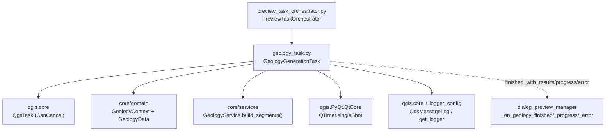
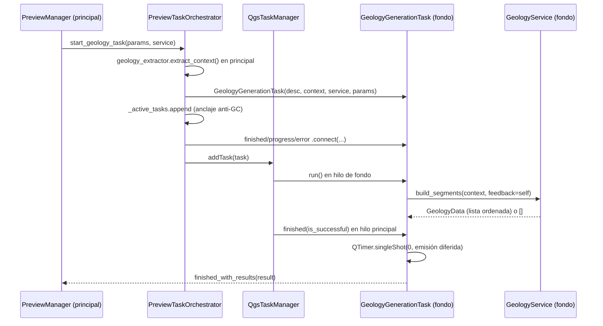

---
tags:
  - secinterp
  - code-walkthrough
  - gui
  - tasks
aliases:
  - geology_task.py
  - GeologyGenerationTask
cssclass: secinterp-note
---

# `gui/tasks/geology_task.py`

> [!abstract] Resumen en una línea
> `QgsTask` cancelable que construye segmentos geológicos en segundo plano (`GeologyContext` + `GeologyService.build_segments()`), con entrega diferida al hilo principal y worker libre de objetos QGIS vivos.

**Ruta**: `gui/tasks/geology_task.py` (101 líneas)
**Clase principal**: `GeologyGenerationTask(QgsTask)`
**Capa**: GUI · Tasks (puente fondo → principal; intersecciones en `core/`)
**Tags**: #secinterp #gui #tasks

---

## 🎯 ¿Por qué existe este archivo?

La intersección de la línea de sección con los afloramientos y el muestreo del ráster es el cómputo más pesado del preview: en el hilo principal congelaría el canvas.

| Problema | Solución |
|----------|----------|
| `build_segments()` tarda y bloquea la UI | `run()` en fondo con `GeologyService.build_segments()` |
| QGIS no es thread-safe: ni capas ni features al worker | Solo viaja `GeologyContext` (DTO) + servicio stateless |
| Progreso, cancelación, resultados y errores observables | `feedback=self`, 3 señales, `finished()` en hilo principal |
| La entrega en caliente compite con la gestión de tasks de sondajes | `QTimer.singleShot(0, ...)` difiere la emisión un ciclo |

> [!important] Nota arquitectónica
> Gemelo de [[drillhole_task]] con tres diferencias: servicio (`GeologyService`), entrada (`GeologyContext` con línea, ráster y afloramientos) y salida (`GeologyData`: lista de segmentos, no tupla). El lanzador es el mismo: `PreviewTaskOrchestrator.start_geology_task()`. Ver [[preview_task_orchestrator]] y [[geology_service]].

---

## 🧬 Diagrama de relaciones



> [!tip] Cómo leer
> Flecha sólida = importa/delega; punteada = señales al manager. El orquestador extrae el contexto con `geology_extractor`, ancla el task y lo encola en `QgsApplication.taskManager()`.

---

## 📦 Imports — lectura arquitectónica

```python
# gui/tasks/geology_task.py
from __future__ import annotations

from typing import TYPE_CHECKING, Any

from qgis.core import Qgis, QgsMessageLog, QgsTask
from qgis.PyQt.QtCore import QTimer, pyqtSignal

from sec_interp.core.domain import GeologyContext, GeologyData
from sec_interp.logger_config import get_logger

if TYPE_CHECKING:
    from sec_interp.core.services.geology_service import GeologyService
```

| # | Observación |
|---|-------------|
| ① | Idéntico esqueleto de imports que `drillhole_task.py`: simetría deliberada entre gemelos. |
| ② | `GeologyData` sí se importa en runtime para anotar `self.result`: a diferencia del task de sondajes (`Any`), aquí el resultado **tiene** tipo (`list` de segmentos). |
| ③ | `GeologyService` bajo `TYPE_CHECKING`: sin ciclo GUI↔core; el worker solo exige `build_segments()`. |
| ④ | `QTimer` + `pyqtSignal` + `QgsMessageLog`: mismo trío de entrega diferida, observación y reporte visible. |
| ⑤ | `Any` reducido a `params`: el resultado ya está tipado, solo los params históricos quedan laxos. |

---

## 🏗️ Inventario de estructura

**Clases (1):** `GeologyGenerationTask(QgsTask)` — 3 señales + 4 métodos.

**Señales:**

| Señal | Payload | Quién conecta (orquestador) |
|-------|---------|-----------------------------|
| `finished_with_results` | `object` (`GeologyData`: lista de segmentos) | `manager._on_geology_finished` |
| `error_occurred` | `str` | `manager._on_geology_error` |
| `progress_changed` | `float` | `manager._on_geology_progress` |

**Estado:**

| Atributo | Tipo | Rol |
|----------|------|-----|
| `service` | `GeologyService` | Lógica stateless inyectada |
| `context` | `GeologyContext` | DTO desconectado (línea, ráster, afloramientos) |
| `params` | `Any` | Params originales (compatibilidad) |
| `result` | `GeologyData \| None` | Lista de segmentos o `None` |
| `exception` | `Exception \| None` | Excepción de `run()` |

**Métodos:**

| Método | Firma | Hilo | Rol |
|--------|-------|------|-----|
| `__init__` | `(description: str, context: GeologyContext, service: GeologyService, params: Any) -> None` | Principal | `CanCancel` + guarda DTO/servicio |
| `run` | `() -> bool` | **Fondo** | `build_segments(context, feedback=self)` |
| `finished` | `(is_successful: bool) -> None` | Principal | Normaliza a `[]`, emite diferido o reporta |
| `setProgress` | `(progress: float) -> None` | Fondo→Principal | Puentea a `progress_changed` |

---

## 📁 Archivos del paquete

| Archivo | Líneas | Rol |
|---|--:|---|
| `geology_task.py` | 101 | Esta nota: task de geología |
| `drillhole_task.py` | 107 | Gemelo: task de sondajes (tupla resultado) |
| `__init__.py` | — | Marcador de paquete |

---

## 📖 Recorrido método por método

### `__init__`

```python
def __init__(
    self,
    description: str,
    context: GeologyContext,
    service: GeologyService,
    params: Any,
) -> None:
    super().__init__(description, QgsTask.Flag.CanCancel)
    self.service = service
    self.context = context
    self.params = params

    self.result: GeologyData | None = None
    self.exception: Exception | None = None
```

Calco del gemelo salvo el tipo de `result`: `GeologyData | None` en vez de `Any | None`. Esa sola anotación documenta el contrato de salida (lista de segmentos) y permite al manager tratar el payload sin adivinar.

### `run` (hilo de fondo)

```python
def run(self) -> bool:
    try:
        logger.info("GeologyGenerationTask started (Background Thread)")
        # Passing self as feedback object (has isCanceled and setProgress)
        self.result = self.service.build_segments(self.context, feedback=self)
        logger.info(f"GeologyGenerationTask finished with {len(self.result)} segments")
        return True

    except Exception as e:
        logger.error(f"Error in GeologyGenerationTask: {e}", exc_info=True)
        self.exception = e
        return False
```

El comentario del fuente explicita el truco `feedback=self`. A diferencia del gemelo, el log cuenta directamente `len(self.result)`: al ser lista garantizada por el servicio, no necesita el defensivo `len(...) > 1`. Si el servicio devolviera `None` aquí, el `len()` lanzaría dentro del `try` y caería en la rama de error: comportamiento aceptable (falla alto en vez de entregar `None` silencioso).

> [!warning] Nada de GUI en `run()`
> Misma prohibición que el gemelo: ni `iface`, ni widgets, ni capas. Todo lo visual espera a `finished()` y al `PreviewManager`.

### `finished` (hilo principal)

```python
def finished(self, is_successful: bool) -> None:
    try:
        if is_successful:
            if self.result is None:
                self.result = []

            res_type = type(self.result)
            res_len = len(self.result) if isinstance(self.result, list) else "N/A"
            # Defer emission to avoid race conditions during task management overhead
            QTimer.singleShot(0, lambda: self.finished_with_results.emit(self.result))
        elif self.exception:
            error_msg = str(self.exception)
            QgsMessageLog.logMessage(
                f"Geology Task Failed: {error_msg}",  # no-i18n: developer log tag
                "SecInterp",
                Qgis.MessageLevel.Critical,
            )
            self.error_occurred.emit(error_msg)
    except Exception as e:
        logger.exception(f"Critical error in GeologyGenerationTask.finished: {e}")
```

Normaliza `None` a `[]` (el manager siempre itera lista), registra tipo/longitud para diagnóstico y difiere la emisión: el comentario cita las carreras "durante la gestión de tasks", es decir, contra el task de sondajes que corre en paralelo. Rama de error idéntica al gemelo con su tag `no-i18n` (los tags de log de desarrollador no se traducen).

### `setProgress`

```python
def setProgress(self, progress: float) -> None:
    """Override to emit signal."""
    super().setProgress(progress)
    self.progress_changed.emit(progress)
```

Idéntico al gemelo: `super()` primero (estado interno del `QgsTask`), luego la señal que alimenta `_on_geology_progress` y la barra del diálogo.

## ⏱️ Ciclo de vida completo



| Fase | Hilo | Responsable | Detalle |
|------|------|-------------|---------|
| Extracción | Principal | `geology_extractor` | Línea, ráster y afloramientos → `GeologyContext` |
| Construcción | Principal | `PreviewTaskOrchestrator` | Task + anclaje + 3 conexiones + `addTask()` |
| Cómputo | Fondo | `GeologyService` | Bucle por afloramiento con `isCanceled()` y `setProgress()` |
| Entrega | Principal | `finished()` | `None` → `[]`, difiere con `singleShot(0)`, emite |
| Presentación | Principal | `PreviewManager` | `_on_geology_finished` → factory → `GeologyRenderer` |

> [!note] La cancelación devuelve lista vacía, no `None`
> A diferencia del gemelo de sondajes (cuyo core devuelve `None` cancelado), `build_segments()` retorna `[]` al detectar `isCanceled()`. El `finished()` normaliza de todos modos (`if self.result is None`), así que ambas cancelaciones cooperativas terminan en `[]` emitido como éxito vacío.

## 📡 Feedback: qué hace el core con `self`

El bucle vive en `core/services/geology_service.py` (líneas 62–86), decorado con `@performance_monitor` e implementando `IGeologyService`:

```python
for i, outcrop in enumerate(context.outcrops):
    if feedback and feedback.isCanceled():
        return []

    for dist_start, dist_end, wkt in outcrop.segments:
        segment_points = interpolate_segment_points(
            dist_start, dist_end,
            context.master_grid_dists,
            context.master_profile_data,
            context.tolerance,
        )
        segments.append(
            GeologySegment(
                unit_name=outcrop.unit_name,
                geometry_wkt=wkt,
                attributes=outcrop.attributes,
                points=[(float(d), float(e)) for d, e in segment_points],
            )
        )

    if feedback:
        feedback.setProgress((i / total) * 100)

segments.sort(key=lambda x: x.points[0][0] if x.points else 0)
return segments
```

| Detalle | Lectura |
|---------|---------|
| Granularidad de cancelación/progreso | por afloramiento (no por segmento): lotes con un afloramiento gigante reportan poco |
| `interpolate_segment_points()` | Eleva cada tramo `(dist_start, dist_end)` sobre el perfil maestro con `tolerance` |
| `GeologySegment` | `unit_name` + `geometry_wkt` + `attributes` heredados del afloramiento; `points` como tuplas planas |
| `sort` final | Ordenados por distancia (`points[0][0]`); segmentos sin puntos van primero (clave 0) |
| `@performance_monitor` | Mide el cómputo en fondo sin tocar la UI |

## 📦 El `GeologyContext` campo a campo

El DTO que el task transporta (`core/domain/task_inputs.py`, líneas 29–46), con sus piezas:

| Campo | Tipo | Contenido |
|-------|------|-----------|
| `master_profile_data` | `list[Point2D]` | Elevaciones `(dist, elev)` del perfil maestro muestreado |
| `master_grid_dists` | `list[tuple[float, Point2D, float]]` | Malla `(dist, (x, y), elev)` para interpolar |
| `outcrops` | `list[OutcropSegments]` | Tramos por afloramiento: `unit_name` + `attributes` + `segments` |
| `tolerance` | `float = 0.001` | Tolerancia de muestreo de intersecciones |

Cada `OutcropSegments` aporta `segments: list[tuple[float, float, DomainGeometry]]` = `(dist_start, dist_end, wkt)` por tramo. Nada vivo de QGIS: el worker solo ve tuplas, WKT y dicts.

### Gemelo de sondajes: diferencias que importan

| Aspecto | `geology_task` | `drillhole_task` |
|---------|----------------|------------------|
| Servicio | `build_segments()` | `process_context()` |
| Cancelación del core | `[]` | `None` |
| Normalización en `finished()` | `None` → `[]` | `None` → `([], [])` |
| Tipo de `result` | `GeologyData` (lista) | `Any` (tupla) |
| Log de conteo | `len(result)` directo | defensivo `len(...) > 1` |
| Errores por entidad | no hay (el core no captura por afloramiento) | por collar (`ValueError/TypeError/KeyError`, `SecInterpError`) |

La última fila es la asimetría real: un afloramiento corrupto aborta todo el task de geología, mientras un collar corrupto solo salta ese sondaje. El gemelo es más resiliente por entidad.

---

## 🔄 Flujo de datos

| Fase | Hilo | Entrada | Transformación | Salida |
|------|------|---------|----------------|--------|
| Extracción | Principal | capas (línea, ráster, afloramientos + campo nombre, banda) | `geology_extractor.extract_context()` | `GeologyContext` |
| Lanzamiento | Principal | contexto + servicio | `GeologyGenerationTask("Geology Preview (Async)", ...)` + anclaje + `addTask()` | task encolado |
| Cómputo | Fondo | `GeologyContext`, `feedback=self` | intersecciones + muestreo con progreso/cancelación | `GeologyData` o `exception` |
| Entrega | Principal | `result` / `exception` | `[]` si `None` + `singleShot(0)` / `QgsMessageLog` | señales al `PreviewManager` |
| Presentación | Principal | lista de segmentos | factory → capa → `GeologyRenderer` | unidades dibujadas |

---

## 🏛️ Patrones de diseño presentes

| Patrón | Dónde | Propósito |
|--------|-------|-----------|
| **Background Task (QGIS)** | `QgsTask` + `taskManager()` | UI fluida durante intersecciones |
| **DTO desconectado** | `GeologyContext` | Thread-safety del worker |
| **Feedback como self** | `build_segments(ctx, feedback=self)` | Progreso/cancelación sin Qt en el core |
| **Emisión diferida** | `QTimer.singleShot(0, ...)` | Sin carreras con el task de sondajes |
| **Observer** | 3 señales | Resultados, progreso, errores |
| **Simetría de gemelos** | Misma forma que `drillhole_task.py` | Un solo modelo mental para ambos tasks |

---

## 🧾 Resumen de la API

| Símbolo | Firma / Hereda | Uso típico |
|---------|----------------|------------|
| `GeologyGenerationTask` | `QgsTask` (`CanCancel`) | `GeologyGenerationTask("Geology Preview (Async)", context, service, params)` |
| `finished_with_results` | `pyqtSignal(object)` | `GeologyData` (lista de segmentos) |
| `error_occurred` | `pyqtSignal(str)` | `str(exception)` |
| `progress_changed` | `pyqtSignal(float)` | Barra de progreso |
| `run` / `finished` / `setProgress` | `() -> bool` / `(bool) -> None` / `(float) -> None` | Ciclo `QgsTask` |

---

## 🛡️ Manejo de errores

| Situación | Comportamiento |
|-----------|----------------|
| Excepción en `run()` (incluido `len(None)`) | Log con `exc_info`, `exception` guardada, `False` |
| `result is None` con éxito | Normalizado a `[]` |
| `finished()` lanza | `logger.exception`, no propaga |
| Cancelación | Sin emisión; el orquestador desengancha y limpia |
| Error visible | `QgsMessageLog` + `error_occurred` |

---

## 🧪 Tests asociados

En `tests/gui/tasks/test_geology_task.py` (`TestGeologyGenerationTask`, Mock-first) y el espejo histórico `tests/gui/test_geology_task.py`:

- `test_initialization` — `description()`, `context`, `service`, `result`/`exception` a `None`.
- `test_run_success` — `build_segments` devuelve `["segment1", "segment2"]`; verifica `True`, `result` y la llamada `build_segments(mock_input, feedback=task)`.
- `test_run_error` — `side_effect = RuntimeError("Database connection failed")`; verifica `False` y `exception` guardada.
- `test_finished_success` y rama de error: emisión (diferida) y `QgsMessageLog`.

Relacionados: `tests/gui/test_preview_task_orchestrator.py` (lanzamiento y cancelación), `tests/core/test_geology_service.py` + `test_geology_service_optional.py` (el cómputo del worker), `tests/core/test_algorithms.py` (intersecciones).

---

## 👀 Observaciones y notas

> [!success] Fortalezas
> - `result` tipado (`GeologyData`): mejor contrato que el `Any` del gemelo de sondajes.
> - Simetría total con `drillhole_task.py`: aprender uno es aprender los dos.
> - Cancelación cooperativa y emisión diferida contra carreras.
> - Triple reporte de error sin excepciones fugadas del worker.

> [!warning] Puntos de atención
> - El `len(self.result)` del log asume lista: un `None` del servicio se convierte en error (falla alto; discutible pero visible).
> - Cancelación sin señal explícita, igual que el gemelo.
> - `params` sin uso en el worker: lastre histórico compartido.
> - Duplicación casi literal con `drillhole_task.py`: una base común `BaseGenerationTask` eliminaría ~80 líneas gemelas.

> [!question] Preguntas abiertas
> - ¿Extraer `BaseGenerationTask` con `run`/`finished`/`setProgress` y parametrizar servicio, normalización (`[]` vs `([], [])`) y tag de log?
> - ¿Señal de cancelación explícita para restaurar la UI del preview?

---

## 🔗 Notas relacionadas

- [[Index]] — índice de la bóveda
- [[gui_tasks]] — nota de familia de tasks
- [[drillhole_task]] — task gemelo (tupla resultado, misma forma)
- [[preview_task_orchestrator]] — lanza, ancla y conecta este task
- [[geology_service]] — `build_segments()`: intersecciones en fondo
- [[geology_extractor]] — produce el `GeologyContext` en el hilo principal
- [[preview_layer_factory]] — convierte segmentos en capa estilizada
- [[controller]] — orquestación y caché en el core

---

*Nota de la bóveda SecInterp Code Walkthrough v2 — v3.9.0*
