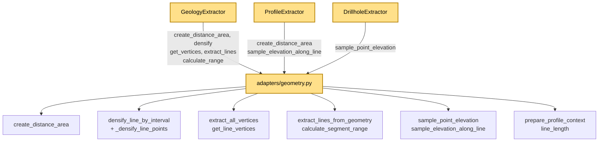

---
tags:
  - secinterp
  - code-walkthrough
  - gui
  - adapters
aliases:
  - geometry.py
  - create_distance_area
  - densify_line_by_interval
  - sample_point_elevation
  - sample_elevation_along_line
  - prepare_profile_context
cssclass: secinterp-note
---

# `gui/adapters/geometry.py`

> [!abstract] Resumen en una línea
> Toolkit QGIS de geometría de la fase Extract (sin clases): `QgsDistanceArea`, densificado de líneas, extracción de vértices, rangos de segmentos y muestreo de elevaciones DEM que antes vivía en `core/utils` y se movió aquí para mantener el core QGIS-agnóstico.

**Ruta**: `gui/adapters/geometry.py` (226 líneas)
**Función principal**: `sample_elevation_along_line` (la más compuesta); módulo de funciones puras de apoyo
**Capa**: GUI · Adapter / toolkit (depende de QGIS por diseño)
**Tags**: #secinterp #gui #adapters

---

## 🎯 ¿Por qué existe este archivo?

El docstring lo dice sin rodeos: estos helpers *antes estaban en `core/utils`*
y se trasladaron a `gui/adapters` porque ataban el core a QGIS. Centralizarlos
aquí deja la frontera arquitectónica en un solo sitio:

| Problema | Solución |
|----------|----------|
| El core importaba `QgsDistanceArea`/`QgsGeometry` vía `core/utils` | Todo lo QGIS-dependiente vive ahora en este módulo GUI |
| Tres extractores repetían densificar + vértices + muestrear | Funciones compartidas: `densify_line_by_interval`, `get_line_vertices`, `sample_*` |
| Medir distancias exige elipsoide y `transformContext` | `create_distance_area(crs)` lo configura en un solo punto |
| `QgsTask` no puede recibir geometrías vivas | Los extractores convierten aquí y pasan tuplas/WKT al core |

> [!important] Nota arquitectónica
> Módulo **sin clases**: 10 funciones públicas + 1 privada (`_densify_line_points`,
> matemática pura). Es el "toolkit Extract" que `GeologyExtractor`,
> `ProfileExtractor` y `DrillholeExtractor` comparten. La única matemática sin
> QGIS (`_densify_line_points`) es candidata natural a volver al core si algún día
> se quiere reutilizar sin QGIS.

---

## 🧬 Diagrama de relaciones



> [!tip] Cómo leer
> Tres consumidores, un toolkit. `GeologyExtractor` es el cliente más intensivo
> (5 funciones); `DrillholeExtractor` solo usa `sample_point_elevation`.

---

## 📦 Imports — lectura arquitectónica

```python
# gui/adapters/geometry.py
from __future__ import annotations

import math
from typing import Any

from qgis.core import (
    QgsCoordinateReferenceSystem,
    QgsDistanceArea,
    QgsGeometry,
    QgsPointXY,
    QgsProject,
    QgsRaster,
    QgsRasterLayer,
    QgsVectorLayer,
    QgsWkbTypes,
)
from qgis.PyQt.QtCore import QCoreApplication

from sec_interp.core.exceptions import GeometryError
```

| # | Observación |
|---|-------------|
| ① | Nueve clases `qgis.core`: el módulo más QGIS-acoplado del paquete, deliberadamente. |
| ② | `QgsWkbTypes` solo se usa para el chequeo `LineGeometry` en `get_line_vertices`. |
| ③ | `QgsRaster.IdentifyFormat.IdentifyFormatValue` (en `sample_point_elevation`) vs `dataProvider().sample` (en `sample_elevation_along_line`): dos APIs de muestreo distintas conviven. |
| ④ | Único import del core: `GeometryError` (excepciones, sin dependencias QGIS). |
| ⑤ | `QCoreApplication.translate` se usa directamente con contexto `"GeometryExtraction"` (no hay clase `tr` porque no hay clases). |
| ⑥ | `math` (hipotenusa, techo) y `Any` (el `point` polimórfico de `sample_point_elevation`) completan el bloque. |

---

## 🏗️ Inventario de estructura

**Funciones públicas (10):**
- `create_distance_area(crs)` — `QgsDistanceArea` configurado (CRS + elipsoide).
- `extract_all_vertices(geometry)` — todos los vértices de cualquier geometría (`[]` si nula).
- `get_line_vertices(geometry)` — vértices exigiendo `LineGeometry` (lanza `ValueError`).
- `extract_lines_from_geometry(geometry)` — lista de `QgsGeometry` lineales desde simple/multi.
- `densify_line_by_interval(geometry, interval)` — densifica una línea cada `interval`.
- `calculate_segment_range(seg_geom, line_start, da)` — `(dist_start, dist_end)` o `None`.
- `sample_point_elevation(raster_layer, point, band_number=1)` — elevación puntual (`QgsPointXY` o tupla).
- `sample_elevation_along_line(geometry, raster_layer, band_number, distance_area, reference_point=None, interval=None)` — perfil `list[QgsPointXY]` en coords `(dist, elev)`.
- `prepare_profile_context(line_lyr)` — `(line_geom, line_start, da)` con validación completa.
- `line_length(line_lyr)` — longitud de la primera feature o `None`.

**Función privada (1):**
- `_densify_line_points(points, interval)` — interpolación lineal pura entre vértices.

---

## 📁 Archivos del paquete

El toolkit vive en el paquete `gui/adapters/` (fase Extract completa):

| Archivo | Líneas | Rol |
|---|--:|---|
| `__init__.py` | 7 | Docstring del paquete: contrato Extract-then-Compute |
| `drillhole_extractor.py` | 369 | `DrillholeExtractor` → `DrillholeContext` |
| `geology_extractor.py` | 235 | `GeologyExtractor` → `GeologyContext` |
| `geometry.py` | 226 | Toolkit QGIS de geometría (esta nota) |
| `layer_resolver.py` | 113 | `LayerResolver` + `resolve_layer` (caché de capas) |
| `structure_extractor.py` | 226 | `SectionContext` + `StructureExtractor` |
| `validation_extractor.py` | 176 | `resolve_layer_metadata`, `build_validation_params` |
| `feature_fetcher.py` | 84 | `DataFetcher` (lecturas bulk de hijas) |
| `profile_extractor.py` | 86 | `ProfileExtractor` → `ProfileData` |

---

## 📖 Recorrido función por función

### `create_distance_area` — el datum de medida

```python
def create_distance_area(crs: QgsCoordinateReferenceSystem) -> QgsDistanceArea:
    da = QgsDistanceArea()
    da.setSourceCrs(crs, QgsProject.instance().transformContext())
    da.setEllipsoid(crs.ellipsoidAcronym())
    return da
```

Tres líneas que evitan el error clásico de medir en grados: fija CRS origen y
elipsoide del propio CRS. Todos los `measureLine` del plugin usan este objeto.
Única llamada a `QgsProject` del módulo (vía `transformContext()`).

### `extract_all_vertices` — vértices de cualquier geometría

```python
def extract_all_vertices(geometry: QgsGeometry) -> list[QgsPointXY]:
    if not geometry or geometry.isNull():
        return []
    return [QgsPointXY(v) for v in geometry.vertices()]
```

Tolerante: geometría nula → `[]`. Itera `geometry.vertices()` (API unificada que
funciona para punto, línea y polígono) envolviendo cada vértice en `QgsPointXY`.

### `get_line_vertices` — vértices exigiendo línea

```python
def get_line_vertices(geometry: QgsGeometry) -> list[QgsPointXY]:
    if not geometry or geometry.isNull():
        raise ValueError(... "Geometry is null or invalid")  # traducido
    if geometry.type() != QgsWkbTypes.GeometryType.LineGeometry:
        raise ValueError(f"Expected LineGeometry, got {geometry.type()}")
    vertices = extract_all_vertices(geometry)
    if not vertices:
        raise ValueError(... "Line geometry has no vertices")  # traducido
    return vertices
```

Estricta al contrario que la anterior: tres guardas (`nula`, `no-lineal`, `sin
vértices`) con `ValueError`. Los dos mensajes de usuario van por
`QCoreApplication.translate("GeometryExtraction", ...)`; el de tipo mezcla
f-string sin traducir (detalle a pulir para i18n). La usan `densify_*`,
`calculate_segment_range` y `sample_elevation_along_line`.

### `extract_lines_from_geometry` — des-multiplicar

```python
def extract_lines_from_geometry(geometry: QgsGeometry) -> list[QgsGeometry]:
    geometries: list[QgsGeometry] = []
    if not geometry or geometry.isNull():
        return geometries
    if geometry.isMultipart():
        for part in geometry.asGeometryCollection():
            geometries.append(QgsGeometry(part))
    else:
        geometries.append(QgsGeometry(geometry))
    return geometries
```

Descompone multi-geometrías vía `asGeometryCollection()` envolviendo cada parte
en un `QgsGeometry` nuevo (copia, no vista). La usa `_intersect_outcrop` de
geología: una intersección línea↔polígono suele devolver multilitneas.

### `densify_line_by_interval` + `_densify_line_points` — densificado

```python
def densify_line_by_interval(geometry: QgsGeometry, interval: float) -> QgsGeometry:
    if not geometry or geometry.isNull():
        return QgsGeometry()
    verts = get_line_vertices(geometry)
    points = [(p.x(), p.y()) for p in verts]
    densified = _densify_line_points(points, interval)
    return QgsGeometry.fromPolylineXY([QgsPointXY(x, y) for x, y in densified])

def _densify_line_points(points, interval):
    if not points or interval <= 0:
        return points
    result = [points[0]]
    for i in range(len(points) - 1):
        p1, p2 = points[i], points[i + 1]
        ...  # interpola t=j/num_segments; segmentos de longitud 0 se saltan
        result.append(p2)
    return result
```

El patrón es extraer→matemática pura→reconstruir: los vértices salen a tuplas,
`_densify_line_points` interpola linealmente (`t = j/num_segments`) y el
resultado vuelve a `QgsGeometry.fromPolylineXY`. Segmentos de longitud cero se
saltan; `interval <= 0` devuelve los puntos intactos. `_densify_line_points` no
importa nada QGIS: es la única pieza reintegrable al core.

### `calculate_segment_range` — rango de un tramo

```python
def calculate_segment_range(seg_geom, line_start, da):
    try:
        verts = get_line_vertices(seg_geom)
        ...  # measureLine a cada extremo desde line_start + normaliza orden
        return dist_start, dist_end
    except ValueError:
        return None
```

Mide desde el origen de sección a cada extremo y normaliza el orden (el tramo
intersectado puede venir invertido). Cualquier `ValueError` de `get_line_vertices`
→ `None`, y el llamador descarta el tramo.

### `sample_point_elevation` — elevación puntual polimórfica

```python
def sample_point_elevation(raster_layer, point, band_number=1):
    if not raster_layer or not raster_layer.isValid():
        return 0.0
    try:
        pt = point if isinstance(point, QgsPointXY) else QgsPointXY(point[0], point[1])
        ...  # identify(pt, IdentifyFormatValue) → float(val) o 0.0
    except (AttributeError, ValueError, TypeError):
        pass
    return 0.0
```

Acepta `QgsPointXY` o tupla `(x, y)` (la usa `_sample_elevation` de sondajes con
tuplas). Usa la API `identify` (no `sample`): devuelve `0.0` ante raster
inválido, `identify` inválido, valor `None` o excepción. Nótese la asimetría con
`sample_elevation_along_line`, que usa `sample(pt, band) → (val, ok)`.

### `sample_elevation_along_line` — perfil completo

```python
def sample_elevation_along_line(
    geometry, raster_layer, band_number, distance_area,
    reference_point=None, interval=None,
) -> list[QgsPointXY]:
    if interval is None:
        interval = raster_layer.rasterUnitsPerPixelX()
    try:
        densified_geom = densify_line_by_interval(geometry, interval)
    except (ValueError, RuntimeError):
        densified_geom = geometry
    vertices = get_line_vertices(densified_geom)
    points = []
    current_dist = 0.0
    if reference_point:
        current_dist = distance_area.measureLine(reference_point, vertices[0])
    for i, pt in enumerate(vertices):
        ...  # acumula current_dist + sample(pt, band) → QgsPointXY(dist, elev)
    return points
```

La función más compuesta: intervalo por defecto = resolución del raster,
densificado con degradación, offset inicial opcional (`reference_point`) y bucle
de acumulación + `sample`. Devuelve puntos en el **espacio perfil**
(`x=distancia`, `y=elevación`), no geográficos — `ProfileExtractor` los
redondea a `(dist, elev)`.

### `prepare_profile_context` — contexto común validado

```python
def prepare_profile_context(line_lyr):
    line_feat = next(line_lyr.getFeatures(), None)
    if not line_feat:
        raise GeometryError("Line layer has no features", {"layer": line_lyr.name()})
    line_geom = line_feat.geometry()
    ...  # geometría nula / sin vértices → GeometryError con details
    if line_geom.isMultipart():
        line_start = line_geom.asMultiPolyline()[0][0]
    else:
        polyline = line_geom.asPolyline()
        line_start = polyline[0] if polyline else QgsPointXY(0, 0)
    da = create_distance_area(line_lyr.crs())
    return line_geom, line_start, da
```

Empaqueta el trío `(line_geom, line_start, da)` que todo perfil necesita, con
`GeometryError` + `details={"layer": ...}` en cada fallo. Nótese: sus mensajes
**no** pasan por `QCoreApplication.translate` (a diferencia de
`get_line_vertices`): inconsistencia i18n a corregir.

### `line_length` — longitud rápida

```python
def line_length(line_lyr: QgsVectorLayer) -> float | None:
    line_feat = next(line_lyr.getFeatures(), None)
    if not line_feat:
        return None
    line_geom = line_feat.geometry()
    if not line_geom or line_geom.isNull():
        return None
    return line_geom.length()
```

Lectura barata sin densificar (`QgsGeometry.length()`, unidades del CRS). La usa
`ProfileExtractor.calculate_lod_interval` para el nivel de detalle.

---

## 🔄 Flujo de datos

| Fase | Entrada | Transformación | Salida |
|------|---------|----------------|--------|
| Datum | `crs` | elipsoide + `transformContext` | `QgsDistanceArea` |
| Vértices | `QgsGeometry` | `vertices()` / chequeo de tipo | `list[QgsPointXY]` |
| Densificado | línea + `interval` | tuplas → interpolación → `fromPolylineXY` | línea densa |
| Rango | tramo + origen + `da` | dos `measureLine` + orden | `(dist_start, dist_end)` |
| Muestreo puntual | raster + punto | `identify` | `float` (0.0 si falla) |
| Perfil | línea + raster + `da` | densificar → acumular → `sample` | `list[QgsPointXY(dist, elev)]` |
| Contexto | `line_lyr` | validación + `create_distance_area` | `(geom, start, da)` |

---

## 🏛️ Patrones de diseño presentes

| Patrón | Dónde | Propósito |
|--------|-------|-----------|
| **Módulo toolkit (funciones puras)** | todo el archivo | Utilidades sin estado compartido |
| **Extract-then-Compute (lado Extract)** | muestreo y medición | QGIS aquí; el core recibe primitivos |
| **Degradación con gracia** | densificado, muestreo, rangos | `None`/`0.0`/`[]` en vez de excepciones |
| **Parámetro polimórfico** | `sample_point_elevation(point)` | Acepta `QgsPointXY` o tupla |

---

## 🧾 Resumen de la API

| Símbolo | Firma | Uso típico |
|---------|-------|------------|
| `create_distance_area` | `(crs) -> QgsDistanceArea` | datum de medida |
| `extract_all_vertices` | `(geometry) -> list[QgsPointXY]` | vértices tolerantes |
| `get_line_vertices` | `(geometry) -> list[QgsPointXY]` (lanza `ValueError`) | vértices estrictos |
| `extract_lines_from_geometry` | `(geometry) -> list[QgsGeometry]` | des-multiplicar intersecciones |
| `densify_line_by_interval` | `(geometry, interval) -> QgsGeometry` | densificado |
| `calculate_segment_range` | `(seg_geom, line_start, da) -> tuple \| None` | rango de tramo |
| `sample_point_elevation` | `(raster_layer, point, band_number=1) -> float` | Z puntual (sondajes) |
| `sample_elevation_along_line` | `(geometry, raster_layer, band_number, distance_area, reference_point=None, interval=None) -> list[QgsPointXY]` | perfil (topografía) |
| `prepare_profile_context` | `(line_lyr) -> tuple[QgsGeometry, QgsPointXY, QgsDistanceArea]` | trío validado |
| `line_length` | `(line_lyr) -> float \| None` | longitud para LOD |

---

## 🛡️ Manejo de errores

| Situación | Comportamiento |
|-----------|----------------|
| Geometría nula en `extract_all_vertices` / `extract_lines_*` | `[]` |
| Geometría nula / no-lineal / sin vértices en `get_line_vertices` | `ValueError` (2 mensajes traducidos, 1 sin traducir) |
| `densify` con geometría nula | `QgsGeometry()` vacía |
| `interval <= 0` en `_densify_line_points` | puntos intactos |
| `calculate_segment_range` con `ValueError` | `None` |
| Raster inválido / `identify` inválido / valor `None` | `0.0` |
| `sample(..., ok=False)` en perfil | elevación `0.0` |
| `prepare_profile_context` sin features / geometría nula / sin vértices | `GeometryError` con `details` |

---

## 🧪 Tests asociados

Sin tests GUI dedicados para este módulo; la cobertura viene del espejo core y
la integración:

- `tests/core/test_geometry_utils.py` — utilidades core análogas (densificado, distancias puras).
- `tests/gui/tasks/test_geology_task.py` y `test_drillhole_task.py` — ejercitan densificado y muestreo vía extractores.
- `tests/integration/test_geology_structure_workflow.py` — perfil + intersecciones de extremo a extremo.
- `tests/base_test.py` — mocks QGIS (`mock_core`, `mock_gui`) para probar estas funciones sin QGIS real.

> [!warning] Hueco de cobertura
> `_densify_line_points` es matemática pura testeable sin QGIS y aun así no tiene
> test directo. `sample_point_elevation` (tupla vs `QgsPointXY`) y
> `calculate_segment_range` (tramo invertido) son casos ideales para un
> `test_geometry_adapter.py` mock-first.

---

## 🧵 Thread-safety e i18n

| Aspecto | Detalle |
|---------|---------|
| **Hilo** | Todo el módulo exige objetos QGIS vivos → hilo principal. Los extractores llaman aquí y solo los resultados (tuplas, WKT, floats) viajan al `QgsTask`. |
| **Excepción** | `_densify_line_points` es thread-safe por construcción (solo `math` + tuplas). |
| **i18n** | Mixto: `get_line_vertices` traduce 2 de 3 mensajes vía `QCoreApplication.translate("GeometryExtraction", ...)`; `prepare_profile_context` no traduce ninguno. Ver observaciones. |

---

## 👀 Observaciones y notas

> [!success] Fortalezas
> - Frontera core/GUI en un solo módulo documentado (migración desde `core/utils` completada).
> - `_densify_line_points` pura y testeable aislada del resto.
> - `calculate_segment_range` normaliza tramos invertidos (detalle que evita segmentos negativos).
> - `prepare_profile_context` concentra la validación repetida en los tres extractores.

> [!warning] Puntos de atención
> - i18n inconsistente: `prepare_profile_context` no traduce; `get_line_vertices` traduce 2 de 3 mensajes.
> - Dos APIs de muestreo (`identify` vs `sample`) sin justificación documentada en código.
> - `0.0` como elevación de fallo contamina perfiles (void DEM = nivel del mar).
> - `asMultiPolyline()[0][0]` sin guarda de parte vacía (también en extractores que lo duplican).

> [!question] Preguntas abiertas
> - ¿Mover `_densify_line_points` al core (`core/utils`) y reutilizarla desde aquí?
> - ¿Unificar `identify`/`sample` bajo una sola función con flag?
> - ¿Traducir los `GeometryError` de `prepare_profile_context` con `QCoreApplication.translate`?

---

## 🔗 Notas relacionadas

- [[Index]] — índice de la bóveda
- [[gui_adapters]] — nota de paquete de los adapters Extract
- [[geology_extractor]] — cliente principal (5 funciones de este toolkit)
- [[profile_extractor]] — cliente de `sample_elevation_along_line` y `line_length`
- [[drillhole_extractor]] — cliente de `sample_point_elevation`
- [[controller]] — orquesta los extractores que usan este toolkit
- [[exceptions]] — `GeometryError` usado por `prepare_profile_context`
- [[core_validation]] — validación QGIS-agnóstica espejo de estas guardas GUI

---

*Nota de la bóveda SecInterp Code Walkthrough v2 — v3.9.1*
