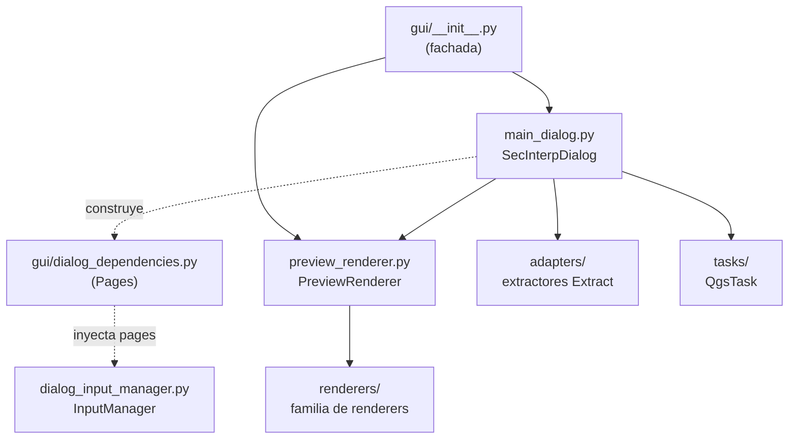

---
tags:
  - secinterp
  - code-walkthrough
  - gui
  - general
aliases:
  - gui/
  - SecInterpDialog
  - PreviewRenderer
  - Pages
cssclass: secinterp-note
---

# `gui/` — Paquete raíz de la capa GUI (Extract + Presentación)

> [!abstract] Resumen en una línea
> Package `gui/` (2 files): la fachada pública del plugin (`__init__.py`, que re-exporta `SecInterpDialog` y `PreviewRenderer`) más `dialog_dependencies.py`, que aporta el contenedor `Pages` con el que los managers del diálogo reciben solo las dependencias que necesitan (composition-root).

**Ruta**: `gui/` (2 archivos, 37 líneas)
**Símbolos principales**: `SecInterpDialog`, `PreviewRenderer`, `Pages`
**Capa**: GUI (lado Extract + Presentación; ningún cómputo geológico vive aquí)
**Tags**: #secinterp #gui #general

---

## 🎯 ¿Por qué existe este paquete?

`gui/` es el punto de entrada de toda la interacción con QGIS: diálogos,
páginas de configuración, extractores (adapters), renderers de preview, tareas
`QgsTask` y herramientas de mapa. Los dos archivos agrupados en esta nota son
la "puerta" del paquete y su "contrato de composición":

| Problema | Solución |
|----------|----------|
| Los consumidores (`sec_interp_plugin.py`, tests) no deberían conocer la ubicación interna de cada clase | `__init__.py` re-exporta la superficie mínima: `SecInterpDialog` + `PreviewRenderer` |
| Los managers del diálogo (`InputManager`, `PreviewManager`, …) tienden a acoplarse a todo el `QDialog` | `dialog_dependencies.py` define `Pages`: un dataclass estrecho solo con las páginas de configuración |
| Añadir un manager nuevo no debería obligar a reescribir firmas | El composition-root (`main_dialog.py`) construye un `Pages` y lo inyecta; cada manager declara qué necesita |

> [!important] Nota arquitectónica
> Este paquete es el lado **Extract + Present** del patrón Extract-then-Compute:
> extrae primitivas/DTOs desde objetos QGIS vivos, delega el cómputo a `core/`
> y convierte los resultados de vuelta a capas y simbología. `gui/AGENTS.md`
> prohíbe lógica de negocio, I/O directa y `QgsTask` con objetos QGIS vivos.

---

## 🧬 Diagrama de relaciones



> [!tip] Cómo leer
> Flecha sólida = importa/delega; punteada = construye/inyecta. `Pages` nunca
> importa nada de QGIS: solo transporta referencias a páginas ya creadas.

---

## 📦 Imports — lectura arquitectónica

```python
# gui/__init__.py
"""GUI module for SecInterp plugin.

Contains dialogs, widgets, and rendering components.
"""

from __future__ import annotations

from .main_dialog import SecInterpDialog
from .preview_renderer import PreviewRenderer

__all__ = [
    "PreviewRenderer",
    "SecInterpDialog",
]
```

```python
# gui/dialog_dependencies.py
"""Narrow dependency containers injected into dialog managers. ... """

from __future__ import annotations

from dataclasses import dataclass
from typing import Any
```

| # | Observación |
|---|-------------|
| ① | `from __future__ import annotations` en ambos archivos: convención global del repo (evaluación perezosa de anotaciones, ver skill coding-standards). |
| ② | `__init__.py` importa exactamente dos símbolos y los publica vía `__all__` ordenado: superficie pública mínima y deliberada. |
| ③ | `dialog_dependencies.py` solo depende de `dataclasses` + `typing`: cero acoplamiento con QGIS, Qt o el propio diálogo. |
| ④ | Los campos de `Pages` se tipan como `Any` a propósito: las páginas son widgets Qt heterogéneos y el contenedor no debe conocer sus clases concretas. |
| ⑤ | Import relativo (`.main_dialog`) en la fachada frente a absoluto (`sec_interp.gui…`) en el resto del paquete: la fachada habla de hermanos; los módulos internos usan ruta canónica. |

---

## 🏗️ Inventario de estructura

**Módulos del paquete raíz (agrupados en esta nota):**

- `gui/__init__.py` — 14 líneas: docstring + 2 re-exports + `__all__`
- `gui/dialog_dependencies.py` — 23 líneas: `@dataclass Pages` con 6 campos

**Subpaquetes y módulos hermanos (con nota propia o documentados aparte):**

- `adapters/` — extractores de la fase Extract (ver [[gui_adapters]])
- `renderers/` — familia de renderers de preview (ver [[gui_renderers]])
- `services/` — namespace reservado para servicios GUI (ver [[gui_services]])
- `tasks/` — `QgsTask` de generación en segundo plano (ver [[gui_tasks]])
- `tools/` — `QgsMapTool` interactivas (ver [[gui_tools]])
- `dialog_*_manager.py`, `dialog_*_mixin.py` — managers y mixins del diálogo (ver [[main_dialog]])
- `preview_*.py` — fábrica de capas, ejes, leyenda, orquestador (ver [[preview_renderer]])

---

## 📁 Archivos del paquete

| Archivo | Líneas | Rol |
|---|--:|---|
| [[#__init__\|__init__.py]] | 14 | Fachada pública: re-exporta `SecInterpDialog` y `PreviewRenderer` |
| [[#Pages\|dialog_dependencies.py]] | 23 | Contenedor estrecho `Pages` para inyección en managers (composition-root) |

---

## 📖 Recorrido archivo por archivo

### `__init__`

```python
from .main_dialog import SecInterpDialog
from .preview_renderer import PreviewRenderer

__all__ = [
    "PreviewRenderer",
    "SecInterpDialog",
]
```

La fachada hace exactamente tres cosas y ninguna más: documenta el módulo
(`GUI module… dialogs, widgets, and rendering components`), importa los dos
símbolos que el exterior necesita y los declara en `__all__`. Quien carga el
plugin (`sec_interp_plugin.py`) puede hacer
`from sec_interp.gui import SecInterpDialog` sin saber en qué submódulo vive
la clase real.

| Decisión | Detalle |
|----------|---------|
| Solo dos símbolos | El resto (managers, extractores, renderers) se importa por ruta completa; no forman parte del contrato público |
| `__all__` ordenado alfabéticamente | `PreviewRenderer` antes que `SecInterpDialog`; convención de estilo del repo |
| Sin lógica, sin estado | Un `__init__` con efectos laterales rompería la importación en tests con mocks QGIS |

> [!note] Por qué no se re-exportan los managers
> Los managers (`InputManager`, `PreviewManager`, …) son detalles de
> composición interna del diálogo. Exponerlos en la fachada invitaría a
> acoplamientos externos y dificultaría refactors como la extracción a mixins
> ya documentada en [[main_dialog]].

### `Pages`

```python
@dataclass
class Pages:
    """Configuration pages consumed by the input manager."""

    dem: Any = None
    section: Any = None
    geology: Any = None
    structure: Any = None
    drillhole: Any = None
    settings: Any = None
```

`Pages` es un **contenedor estrecho de dependencias**: agrupa las seis páginas
de configuración del diálogo (DEM, sección, geología, estructuras, sondajes,
ajustes) para que `InputManager` reciba un único objeto en lugar de seis
parámetros o, peor, el diálogo completo.

| Campo | Página que transporta |
|-------|-----------------------|
| `dem` | Página de configuración del MDE / relieve |
| `section` | Página de la línea de sección |
| `geology` | Página de afloramientos / unidades |
| `structure` | Página de medidas estructurales |
| `drillhole` | Página de collares, surveys e intervalos |
| `settings` | Página de ajustes generales |

Todos default a `None`, de modo que los tests pueden construir
`Pages(geology=mock)` con solo lo que ejercitan (patrón visible en
`tests/gui/test_dialog_input_manager.py`).

**Quién lo construye y quién lo consume:**

| Rol | Ubicación | Qué hace |
|-----|-----------|----------|
| Constructor (composition-root) | `gui/main_dialog.py` (~línea 114) | Crea `Pages(dem=…, section=…, …)` con las páginas reales |
| Consumidor principal | `gui/dialog_input_manager.py` (línea 26) | Recibe `pages: Pages` en su constructor |
| Consumidores en tests | `tests/gui/test_dialog_input_manager.py`, `tests/gui/test_main_dialog_validation_manager.py` | Construyen `Pages` parciales con mocks |

> [!tip] Composition-root en miniatura
> `main_dialog.py` actúa como raíz de composición: conoce a todos (páginas y
> managers) mientras que cada manager solo conoce su `Pages`. Añadir un campo
> nuevo al dataclass es retrocompatible porque todos los campos tienen default.

**Construcción real en el composition-root:**

```python
# gui/main_dialog.py (fragmento verificado, ~línea 114-117)
from .dialog_dependencies import Pages
...
pages = Pages(
    ...
)
```

El import es local al método (no en cabecera): el diálogo retrasa la
importación al momento de componer managers. El fragmento confirma el patrón
descrito: `main_dialog.py` es quien conoce las páginas concretas y las empaqueta.

| Propiedad del diseño | Evidencia en el fuente |
|----------------------|------------------------|
| Importación local | `from .dialog_dependencies import Pages` dentro del método, no en cabecera |
| Acoplamiento unidireccional | `dialog_input_manager.py` importa `Pages`; `dialog_dependencies.py` no importa a nadie del diálogo |
| Construcción parcial en tests | `Pages(geology=mock)` / `Pages()` con defaults `None` |

---

## 🗺️ Dónde vive cada responsabilidad GUI

El paquete raíz solo contiene la fachada y el contenedor; el resto de la capa
GUI se reparte en submódulos con nota propia. Mapa de navegación:

| Responsabilidad | Módulo(s) | Nota |
|-----------------|-----------|------|
| Superficie pública + `Pages` | `__init__.py`, `dialog_dependencies.py` | Esta nota |
| Diálogo principal y managers | `main_dialog.py`, `dialog_*_manager.py`, `dialog_*_mixin.py` | [[main_dialog]] |
| Fase Extract (capas → DTOs) | `adapters/*.py` | [[gui_adapters]] |
| Fase Present (DTOs → simbología) | `renderers/*.py`, `preview_renderer.py` | [[gui_renderers]], [[preview_renderer]] |
| Fondo (`QgsTask` con DTOs) | `tasks/*.py`, `preview_task_orchestrator.py` | [[gui_tasks]], [[preview_task_orchestrator]] |
| Herramientas de mapa | `tools/*.py` | [[gui_tools]] |
| Reserva de servicios GUI | `services/` | [[gui_services]] |
| Páginas y widgets | `ui/` | [[gui_ui]] |

> [!note] Por qué importa este mapa
> `gui/` es el paquete más poblado del plugin (más de 40 entradas entre
> módulos y subpaquetes). Sin la fachada mínima y este mapa, cada lector nuevo
> tendría que inferir la arquitectura por inspección directa.

---

## 🔄 Flujo de datos

| Fase | Entrada | Transformación | Salida |
|------|---------|----------------|--------|
| Importación | `from sec_interp.gui import SecInterpDialog` | Re-export de la fachada | Clase lista sin exponer rutas internas |
| Composición | Páginas Qt ya creadas | `Pages(dem, section, geology, structure, drillhole, settings)` | Contenedor inyectable |
| Inyección | `Pages` | `InputManager(pages)` | Manager operativo sin referencia al `QDialog` |
| Extracción | Capas QGIS vía managers → `adapters/` | Fase Extract: capas a DTOs desacoplados | Contextos puros hacia `core/` |
| Presentación | DTOs de resultado desde `core/` | `preview_renderer` + familia `renderers/` | Capas de memoria y simbología en el canvas |

---

## 🧩 Convenciones del paquete raíz

| Convención | Dónde se ve | Propósito |
|------------|-------------|-----------|
| Fachada mínima (`__all__` de 2 símbolos) | `__init__.py` | Contrato público estable frente a refactors internos |
| Contenedores estrechos en vez del diálogo completo | `Pages` | Romper el acoplamiento manager ↔ superficie del `QDialog` |
| `Any` para widgets heterogéneos | campos de `Pages` | El contenedor transporta, no tipa, la UI |
| Docstring de paquete orientado a contenido | `Contains dialogs, widgets, and rendering components` | Describe *qué hay*, no *cómo se usa* |

> [!important] Regla de `gui/AGENTS.md` aplicable aquí
> Si un manager nuevo necesita otro colaborador del diálogo, el camino
> correcto es **ampliar `Pages`** (o crear un segundo contenedor estrecho),
> nunca pasarle el `SecInterpDialog` entero. Pasar el diálogo completo
> reintroduce el acoplamiento que este archivo existe para eliminar.

---

## 🏛️ Patrones de diseño presentes

| Patrón | Dónde | Propósito |
|--------|-------|-----------|
| **Facade** | `__init__.py` | Superficie pública mínima sobre un paquete grande |
| **Composition Root** | `main_dialog.py` + `Pages` | Un solo lugar construye el grafo de dependencias |
| **Parameter Object** | `Pages` | Seis páginas viajan como un único argumento con defaults |
| **Dependency Injection** | `InputManager(pages)` | El manager declara dependencias; no las busca |

---

## 🧾 Resumen de la API

| Símbolo | Firma / Hereda | Uso típico |
|---------|----------------|------------|
| `SecInterpDialog` | re-export de `.main_dialog` | `from sec_interp.gui import SecInterpDialog` en el loader del plugin |
| `PreviewRenderer` | re-export de `.preview_renderer` | Render nativo PyQGIS del preview interactivo |
| `Pages` | `@dataclass`, 6 campos `Any = None` | `Pages(geology=page)` en producción y en tests con mocks |

---

## 🛡️ Manejo de errores

Estos dos archivos **no manejan errores** por diseño:

- `__init__.py` no envuelve los imports en `try/except`: si `main_dialog` o
  `preview_renderer` fallan al importar, el fallo debe ser ruidoso y temprano
  (falla la carga del plugin, no un cálculo a mitad de sesión).
- `Pages` no valida: acepta `None` en todos los campos. La validación de
  "página ausente" corresponde al consumidor (`InputManager` y validadores),
  no al contenedor de transporte.

---

## 🧪 Tests asociados

La fachada no tiene test dedicado (importarla es el propio test de humo que
ejecuta toda la suite). `Pages`, en cambio, aparece explícitamente en:

- `tests/gui/test_dialog_input_manager.py` — construye `Pages(…)` con páginas
  mockeadas y verifica que `InputManager` lee la configuración sin el diálogo
  real; es la prueba viva del desacoplamiento que documenta esta nota.
- `tests/gui/test_main_dialog_validation_manager.py` — construye `Pages`
  parciales para ejercitar la validación de managers.
- `tests/gui/test_main_dialog_core.py` — cubre el diálogo que actúa como
  composition-root y construye el `Pages` real.
- `tests/gui/test_preview_renderer_custom.py` — cubre el segundo símbolo de
  la fachada, `PreviewRenderer`, con capas mockeadas.

| Símbolo de esta nota | Test que lo ejercita | Qué verifica |
|----------------------|----------------------|--------------|
| `Pages` | `tests/gui/test_dialog_input_manager.py` | `InputManager` opera con páginas mockeadas, sin diálogo real |
| `Pages` | `tests/gui/test_main_dialog_validation_manager.py` | Validación con `Pages` parciales |
| Fachada (`SecInterpDialog`) | `tests/gui/test_main_dialog_core.py` | Diálogo como composition-root que construye `Pages` |
| Fachada (`PreviewRenderer`) | `tests/gui/test_preview_renderer_custom.py` | Render con capas mockeadas |

---

## 🌐 i18n y notas de migración

- Estos archivos no contienen cadenas visibles al usuario: nada que traducir
  (los extractores sí usan `QCoreApplication.translate`, ver [[gui_adapters]]).
- `Pages` es agnóstico a Qt5/Qt6: solo guarda referencias `Any`, de modo que
  la migración QGIS 4.x no lo afecta (ver skill qgis-migration-4x).
- Si en el futuro las páginas se tiparan con `Protocol`, `Pages` podría
  adoptar esos protocolos sin romper a los consumidores actuales gracias a
  los defaults `None`.

---

## 👀 Observaciones y notas

> [!success] Fortalezas
> - Fachada mínima real: 2 símbolos, cero lógica, cero estado.
> - `Pages` elimina el acoplamiento manager ↔ diálogo con solo 23 líneas y sin dependencias.
> - Defaults `None` en todos los campos: construcción parcial trivial en tests.
> - Ambos archivos cumplen `ruff`/`black` sin excepciones y pasan la frontera arquitectónica (nada de `core/` importando GUI).

> [!warning] Puntos de atención
> - `Pages` solo modela páginas de configuración; si más managers necesitan otros colaboradores (canvas, task manager) habrá que crear contenedores análogos o generalizar.
> - El tipado `Any` es deliberado pero diluye la ayuda del IDE: un `Protocol` por página lo mejoraría sin coste en runtime.
> - La fachada no re-exporta `PreviewTaskOrchestrator` ni extractores: quien los necesite debe conocer rutas internas (decisión consciente, pero documentada aquí para evitar confusión).

> [!question] Preguntas abiertas
> - ¿Conviene un segundo contenedor (`Services`/`Tasks`) cuando `gui/services/` deje de ser un namespace vacío? Ver [[gui_services]].
> - ¿Tipar los campos de `Pages` con `Protocol` para autocompletado sin importar widgets Qt?

---

## 🔗 Notas relacionadas

- [[Index]] — índice de la bóveda
- [[main_dialog]] — el diálogo que construye `Pages` (composition-root) y el `SecInterpDialog` re-exportado
- [[preview_renderer]] — el segundo símbolo de la fachada
- [[controller]] — orquestador del dominio que la GUI alimenta vía Extract
- [[dialog_input_manager]] — consumidor principal de `Pages`
- [[dialog_preview_manager]] — manager hermano que orquesta preview y tareas
- [[preview_task_orchestrator]] — lanza los `QgsTask` con DTOs ya extraídos
- [[gui_adapters]] — extractores de la fase Extract
- [[gui_renderers]] — familia de renderers del lado Present
- [[gui_tasks]] — tareas en segundo plano del lado GUI
- [[gui_services]] — namespace reservado para futuros servicios GUI
- [[drillhole_service]] / [[geology_service]] — cómputo puro que la GUI invoca

---

*Nota de la bóveda SecInterp Code Walkthrough v2 — v3.9.1*
