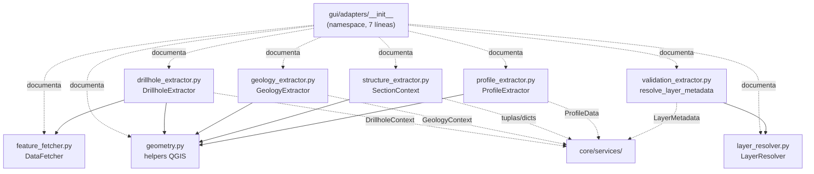
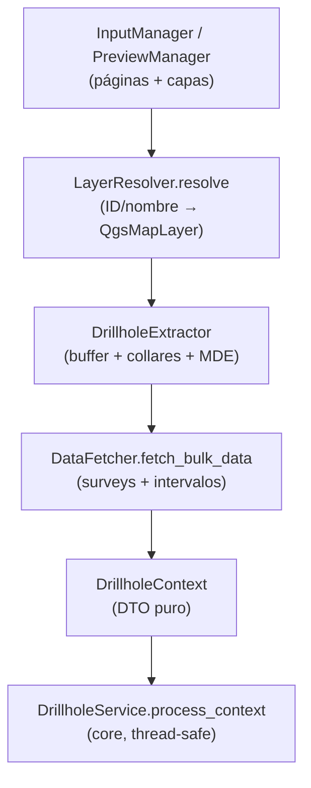

---
tags:
  - secinterp
  - code-walkthrough
  - gui
  - adapters
aliases:
  - gui/adapters/
  - DrillholeExtractor
  - GeologyExtractor
  - StructureExtractor
  - ProfileExtractor
  - DataFetcher
  - LayerResolver
  - SectionContext
cssclass: secinterp-note
---

# `gui/adapters/` — Extractores de la fase Extract (QGIS → DTOs)

> [!abstract] Resumen en una línea
> Package `gui/adapters/` (1 file): namespace de la fase Extract cuyo `__init__.py` de 7 líneas declara el contrato del paquete (puente entre objetos QGIS vivos y el core agnóstico), mientras los 8 módulos extractores hermanos viven documentados en sus notas propias y se enlazan desde aquí.

**Ruta**: `gui/adapters/` (namespace; 1 archivo agrupado, 7 líneas + 8 módulos hermanos con nota propia)
**Símbolos principales**: ninguno en el `__init__` (namespace puro); `DrillholeExtractor`, `GeologyExtractor`, `SectionContext`, `ProfileExtractor`, `DataFetcher`, `LayerResolver`, `resolve_layer_metadata` en los hermanos
**Capa**: GUI · Adapter Extract (la única capa autorizada a tocar `QgsVectorLayer`, `QgsRasterLayer`, `QgsProject`)
**Tags**: #secinterp #gui #adapters

---

## 🎯 ¿Por qué existe este paquete?

El core tiene prohibido importar `qgis.*` (ver `tests/core/test_architecture_boundary.py`).
Alguien debe, por tanto, leer capas, features, CRS y rasters, y convertirlos en
primitivas. Ese "alguien" es este paquete:

| Problema | Solución |
|----------|----------|
| El core no puede tocar objetos QGIS vivos | Los extractores hacen todo el trabajo con `Qgs*` y devuelven DTOs (`DrillholeContext`, `GeologyContext`, tuplas, dicts) |
| Cada servicio necesita el mismo preámbulo (resolver capa, pedir features, transformar CRS, buffer) | Un extractor por dominio (`drillhole_`, `geology_`, `structure_`, `profile_`) más utilidades compartidas (`geometry`, `layer_resolver`, `feature_fetcher`) |
| La validación del core necesita metadatos sin capas vivas | `validation_extractor` convierte `QgsMapLayer` en `LayerMetadata` desacoplado |

> [!important] Nota arquitectónica
> Adapter **Extract** del patrón Extract-then-Compute. Todo lo que necesite un
> objeto QGIS vivo ocurre aquí o en `tasks/` (solo con DTOs ya extraídos); el
> core solo ve WKT, tuplas, dicts y dataclasses de dominio. El `__init__.py`
> no re-exporta nada: es documentación del contrato, no fachada.

---

## 🧬 Diagrama de relaciones



> [!tip] Cómo leer
> Flecha sólida = importa; punteada gruesa = documenta/agrupa (namespace) o
> entrega DTOs al core. `geometry.py` es el módulo más reutilizado: cuatro
> extractores lo importan.

---

## 📦 Imports — lectura arquitectónica

```python
# gui/adapters/__init__.py (íntegro: 7 líneas, cero imports)
"""GUI adapters (Extract phase).

Adapters bridge the QGIS object world and the QGIS-agnostic core layer.
They perform the "Extract" step of the Extract-then-Compute pattern: resolving
layers, reading features, transforming CRS, and buffering — everything that
needs live QGIS objects — so the core never has to.
"""
```

| # | Observación |
|---|-------------|
| ① | **Cero imports**: un namespace que no importa nada no puede crear ciclos; los 8 módulos se importan por ruta completa (`sec_interp.gui.adapters.geometry`). |
| ② | El docstring enumera las 4 operaciones Extract canónicas: resolver capas, leer features, transformar CRS y buffering. Es el checklist del paquete. |
| ③ | La última cláusula ("so the core never has to") es la invariante arquitectónica: si un extractor devuelve un objeto QGIS vivo, viola su propio contrato. |
| ④ | Contraste con `gui/__init__.py` (fachada con re-exports): aquí **no hay `__all__`** porque no hay superficie pública que estabilizar; cada extractor es independiente. |
| ⑤ | Los hermanos sí importan `qgis.core` masivamente (`QgsFeatureRequest`, `QgsDistanceArea`, `QgsRaster…`): la autorización QGIS vive en los módulos, no en el namespace. |

---

## 🏗️ Inventario de estructura

**Archivo agrupado en esta nota:**

- `__init__.py` — 7 líneas: solo docstring de paquete, sin símbolos

**Módulos hermanos (cada uno con nota propia; no se duplican aquí):**

| Módulo | Líneas | Símbolo clave | Produce (hacia el core) |
|--------|-------:|---------------|-------------------------|
| `drillhole_extractor.py` | 369 | `DrillholeExtractor` | `DrillholeContext` desacoplado |
| `geology_extractor.py` | 235 | `GeologyExtractor` | `GeologyContext` + `OutcropSegments` |
| `structure_extractor.py` | 226 | `SectionContext` | `line_points`, `line_azimuth`, estructuras como dicts |
| `geometry.py` | 226 | `create_distance_area`, `extract_all_vertices`, … | Primitivas geométricas (vértices, buffers, muestreos) |
| `validation_extractor.py` | 176 | `resolve_layer_metadata` | `LayerMetadata` |
| `layer_resolver.py` | 113 | `LayerResolver`, `resolve_layer` | `QgsMapLayer` resuelta (uso interno GUI) |
| `profile_extractor.py` | 86 | `ProfileExtractor` | `ProfileData` (distancia, elevación) |
| `feature_fetcher.py` | 84 | `DataFetcher` | Tuplas planas de surveys/intervalos |

---

## 📁 Archivos del paquete

| Archivo | Líneas | Rol |
|---|--:|---|
| [[#__init__\|__init__.py]] | 7 | Namespace Extract: docstring-contrato del paquete, sin re-exports ni símbolos |

> [!note] Dónde está el resto
> Los 8 extractores tienen nota individual ([[drillhole_extractor]],
> [[geology_extractor]], [[structure_extractor]], [[profile_extractor]],
> [[feature_fetcher]], [[layer_resolver]], [[geometry]],
> [[validation_extractor]]). Esta nota documenta el **rol del paquete** y los
> enlaza; sus símbolos se resumen abajo sin duplicar sus notas.

---

## 📖 Recorrido: el namespace y sus hermanos

### `__init__`

```python
"""GUI adapters (Extract phase).

Adapters bridge the QGIS object world and the QGIS-agnostic core layer.
They perform the "Extract" step of the Extract-then-Compute pattern: resolving
layers, reading features, transforming CRS, and buffering — everything that
needs live QGIS objects — so the core never has to.
"""
```

El archivo completo es este docstring. No hay nada que "recorrer" en el
sentido de métodos — y esa es exactamente la información honesta que esta
nota debe dar: el `__init__` es un **marcador de paquete con contrato
documentado**. Las decisiones que encarna:

| Decisión | Efecto |
|----------|--------|
| Sin re-exports | Importar `sec_interp.gui.adapters` no carga QGIS; los tests pueden importar el namespace sin mocks |
| Sin `__all__` | Nada que estabilizar como API pública |
| Docstring imperativo | Cada extractor nuevo debe poder marcar sus casillas (resolver, leer, transformar, buffer) |

### Extractores de dominio (4)

Cada uno convierte un dominio geológico en DTOs puros. Detalle completo en su
nota; aquí el contrato que cumplen:

**`DrillholeExtractor`** (369 líneas, ver [[drillhole_extractor]]). Lee la
línea de sección y la capa de collares, aplica buffer (`DEFAULT_BUFFER_SEGMENTS = 8`),
separa collares, pre-muestrea elevaciones desde el MDE y delega surveys/intervalos
a `DataFetcher`. Recibe un `data_fetcher` opcional por constructor (inyección
para tests). Devuelve `DrillholeContext`.

**`GeologyExtractor`** (235 líneas, ver [[geology_extractor]]). Lee línea de
sección y afloramientos, densifica y muestrea el perfil maestro e intersecta
la sección con polígonos. Expone `tr()` vía `QCoreApplication.translate`
(convención i18n de la capa GUI). Devuelve `GeologyContext`.

**`SectionContext` / extractor estructural** (226 líneas, ver
[[structure_extractor]]). Buffer sobre la línea, filtrado de medidas dentro
del buffer y muestreo de elevaciones desde el raster. Produce primitivas:
`line_points: list[tuple[float, float]]`, `line_start`, `line_azimuth` y
estructuras como `{"point": (x, y), "attributes": {...}}`.

**`ProfileExtractor`** (86 líneas, ver [[profile_extractor]]). Lee la línea de
sección y muestrea el MDE para devolver `ProfileData` (`(distancia, elevación)`).
Aporta `calculate_lod_interval(line_lyr, canvas_width)`: intervalo de muestreo
según la longitud de línea y el ancho del canvas (LOD del preview).

### Infraestructura Extract (4)

**`geometry.py`** (226 líneas, ver [[geometry]]). Helpers QGIS extraídos de
`core/utils`: `create_distance_area(crs)`, `extract_all_vertices(geometry)`,
densificado, buffers y muestreo de raster. Es la base compartida: cuatro
extractores lo importan (`from sec_interp.gui.adapters import geometry`).

**`LayerResolver` + `resolve_layer`** (113 líneas, ver [[layer_resolver]]).
Resuelve referencias (ID, nombre u objeto) a `QgsMapLayer` vía `QgsProject`
con caché dict interna (`_cache`, `clear_cache()`). `resolve_layer()` es el
atajo retrocompatible que delega en la clase.

**`DataFetcher`** (84 líneas, ver [[feature_fetcher]]). `fetch_bulk_data(layer,
hole_ids, fields)` lee surveys e intervalos en una sola pasada con
`QgsFeatureRequest` filtrado por `IN (…)`, ordenando surveys por profundidad.
Distingue survey vs. intervalo por la presencia del campo `depth`.

**`resolve_layer_metadata`** (176 líneas, ver [[validation_extractor]]).
Convierte `QgsVectorLayer`/`QgsRasterLayer` en `LayerMetadata` mediante
`_GEOMETRY_MAP` (`PointGeometry` → punto, etc.) y constantes
`KIND_VECTOR`/`KIND_RASTER`/`GEOMETRY_*`. Es el puente hacia
`core/validation/`.

---

## 🔄 Flujo de datos

| Fase | Entrada | Transformación | Salida |
|------|---------|----------------|--------|
| Resolución | ref de capa (ID, nombre, objeto) | `LayerResolver.resolve` + caché | `QgsMapLayer` viva (uso interno GUI) |
| Lectura | capa + línea de sección | `QgsFeatureRequest`, buffer, filtro espacial | `QgsFeature`/`QgsGeometry` en memoria |
| Desacople | objetos QGIS | vértices→tuplas, atributos→dicts, raster→elevaciones | `DrillholeContext`, `GeologyContext`, `ProfileData`, `LayerMetadata` |
| Cómputo | DTOs puros | servicios de `core/` (ver [[controller]]) | `GeologyData`, `StructureData`, segmentos |

> [!important] La frontera es el DTO
> Ningún objeto QGIS cruza hacia `core/`: ni capas, ni features, ni
> geometrías. Los `QgsTask` de [[gui_tasks]] reciben los contextos ya
> desacoplados, lo que los hace thread-safe por construcción.

---

## 🧪 Secuencia típica de un Extract (ejemplo sondajes)



| Paso | Responsable | Objetos vivos QGIS |
|------|-------------|--------------------|
| 1. Resolver capas | `LayerResolver` | Sí (`QgsProject`, `QgsMapLayer`) |
| 2. Buffer + filtro espacial | `DrillholeExtractor` + `geometry.py` | Sí (`QgsGeometry`, `QgsFeatureRequest`) |
| 3. Muestreo de raster | extractor + `geometry.py` | Sí (`QgsRasterLayer`) |
| 4. Hijos (survey/intervalo) | `DataFetcher` | Sí, en una sola pasada bulk |
| 5. Empaquetado | extractor | No: a partir de aquí solo tuplas/dicts/DTOs |
| 6. Cómputo | `core/services` o `QgsTask` | Nunca |

---

## 📏 Reglas para añadir un extractor nuevo

| Regla | Justificación |
|-------|---------------|
| Vivir en `gui/adapters/` y documentarse en su propia nota | La frontera Extract debe ser descubrible en un solo directorio |
| Devolver solo primitivas, tuplas, dicts o DTOs de `core/domain` | Cualquier `Qgs*` en la salida rompe [[gui_tasks]] (threads) y el boundary test |
| Reutilizar `geometry.py` y `LayerResolver` antes de escribir helpers propios | Evita la duplicación que motivó extraer `geometry.py` de `core/utils` |
| Exponer `tr()` si produce mensajes de error propios | Convención i18n del paquete (`GeologyExtractor`, `ProfileExtractor` ya lo hacen) |
| Lanzar `DataMissingError` / `GeometryError` / `ValidationError` | La jerarquía de `core/exceptions.py` es el único idioma de error que entiende el core |
| Añadir caso en `tests/integration/` + caso opcional en `tests/core/` | Patrón existente: workflow real + tolerancia a capa ausente |

---

## 🏛️ Patrones de diseño presentes

| Patrón | Dónde | Propósito |
|--------|-------|-----------|
| **Adapter (Port/Adapter)** | todo el paquete | Traducir el mundo QGIS al mundo del core |
| **Extract-then-Compute** | extractores → `core/services` | Separar lectura QGIS de cómputo puro |
| **Singleton con caché** | `LayerResolver._cache` | Evitar `project.mapLayer()` repetidos en la misma transacción |
| **Inyección por constructor** | `DrillholeExtractor(data_fetcher=…)` | Sustituir `DataFetcher` por mocks en tests |
| **Bulk fetch** | `DataFetcher.fetch_bulk_data` | Una pasada por capa en vez de N consultas por sondaje |
| **DTO fronterizo** | `DrillholeContext`, `GeologyContext`, `LayerMetadata` | Contrato tipado entre GUI y core |

---

## 🧾 Resumen de la API

| Símbolo | Firma | Uso típico |
|---------|-------|------------|
| `DrillholeExtractor(data_fetcher=None)` | `-> DrillholeContext` | Extract de sondajes (ver [[drillhole_extractor]]) |
| `GeologyExtractor` | `-> GeologyContext` (+ `tr()`) | Extract geológico (ver [[geology_extractor]]) |
| `SectionContext` | `@dataclass` | Puntos, azimut y estructuras (ver [[structure_extractor]]) |
| `ProfileExtractor` | `calculate_lod_interval(...)`, `-> ProfileData` | Perfil topográfico (ver [[profile_extractor]]) |
| `DataFetcher.fetch_bulk_data` | `(layer, hole_ids, fields) -> dict` | Surveys/intervalos en una pasada (ver [[feature_fetcher]]) |
| `LayerResolver.resolve` | `(layer_ref, use_cache=True) -> QgsMapLayer \| None` | Resolver capas (ver [[layer_resolver]]) |
| `resolve_layer` | `(layer_ref) -> QgsMapLayer \| None` | Atajo retrocompatible |
| `create_distance_area` / `extract_all_vertices` | helpers de `geometry.py` | Base geométrica compartida (ver [[geometry]]) |
| `resolve_layer_metadata` | `(layer_ref) -> LayerMetadata \| None` | Metadatos para validación (ver [[validation_extractor]]) |

---

## 🛡️ Manejo de errores

El namespace no puede fallar (sin código ejecutable). Los extractores, en
cambio, usan la jerarquía de `core/exceptions.py`:

| Error | Quién lo lanza | Cuándo |
|-------|----------------|--------|
| `DataMissingError` | `DrillholeExtractor`, `GeologyExtractor`, `ProfileExtractor` | Capa ausente o sin features (collares opcionales tolerados: ver tests `*_optional.py`) |
| `GeometryError` | `GeologyExtractor`, `ProfileExtractor`, `geometry.py` | Geometría nula o inválida |
| `ValidationError` | Extractores (nº de banda, campo inexistente, capa inválida) | Parámetros/entradas incorrectas |

Los errores viajan como excepciones hasta los managers/`QgsTask`, que los
convierten en mensajes vía `show_user_message` (nunca `iface.messageBar`
fuera de `gui/`).

---

## 🧪 Tests asociados

Sin símbolos en el `__init__`, no hay test del namespace; la cobertura vive en
los extractores, en tres niveles:

- `tests/integration/test_geology_structure_workflow.py` — `TestGeologyExtractorContext`: Extract + intersección de extremo a extremo.
- `tests/integration/test_async_orchestrators.py` — `TestDrillholeExtractor` con `DataFetcher` real.
- `tests/integration/test_3d_integration_advanced.py` — `DrillholeExtractor` en flujo 3D.
- `tests/core/test_geology_service_optional.py` y `tests/core/test_drillhole_service_optional.py` — tolerancia a capas opcionales ausentes.
- `tests/core/validation/test_service_validation.py` — `GeologyExtractor` rechaza banda inválida, campo inexistente y capa inválida.
- `tests/gui/test_preview_task_orchestrator.py` — lado GUI: el orquestador consume un extractor mockeado (`extract_context`), probando el cableado Extract → Task sin QGIS real.
- `tests/base_test.py` — resetea `LayerResolver.clear_cache()` entre tests para aislar la caché del resolver.

---

## 🌐 i18n y notas de migración

- `GeologyExtractor.tr()` y `ProfileExtractor.tr()` usan
  `QCoreApplication.translate("Clase", message)`: los mensajes de error del
  Extract son traducibles (ver skill i18n-standards).
- `structure_extractor.py`, `geometry.py` y `feature_fetcher.py` no exponen
  `tr()`: sus fallos se envuelven en excepciones que traducen los managers.
- Todo el paquete importa desde `qgis.core` / `qgis.PyQt` (nunca `PyQt5`
  directo): ruta agnóstica lista para QGIS 4.x (ver skill qgis-migration-4x).
- Los DTOs que cruzan la frontera (`DrillholeContext`, `GeologyContext`,
  `ProfileData`) no contienen texto traducible: el i18n vive solo del lado GUI.

---

## 👀 Observaciones y notas

> [!success] Fortalezas
> - Frontera honesta: el core nunca importa `qgis.*` y los tests lo verifican (`test_architecture_boundary.py`).
> - Un extractor por dominio con DTO de salida propio: fácil de mockear (`extract_context` en el test del orquestador).
> - `geometry.py` elimina la duplicación que antes vivía en `core/utils`.
> - `LayerResolver` con caché evita N lookups en `QgsProject` durante un Extract.

> [!warning] Puntos de atención
> - `LayerResolver._cache` es estado global de clase: olvidar `clear_cache()` contamina tests (ya mitigado en `tests/base_test.py`).
> - `DataFetcher` construye el filtro `IN (…)` por interpolación de strings: IDs con comillas podrían romper la expresión.
> - El `__init__` no re-exporta: cada consumidor debe conocer la ruta completa del extractor (decisión consciente, pero añade fricción al descubrir la API).

> [!question] Preguntas abiertas
> - ¿Unificar `tr()` en un mixin para que todos los extractores traduzcan igual?
> - ¿Parametrizar `QgsFeatureRequest` con placeholders en vez de interpolar IDs?

---

## 🔗 Notas relacionadas

- [[Index]] — índice de la bóveda
- [[drillhole_extractor]] — Extract de sondajes → `DrillholeContext`
- [[geology_extractor]] — Extract geológico → `GeologyContext`
- [[structure_extractor]] — `SectionContext` y medidas estructurales
- [[profile_extractor]] — perfil topográfico → `ProfileData`
- [[feature_fetcher]] — `DataFetcher` bulk para surveys/intervalos
- [[layer_resolver]] — resolución y caché de capas
- [[geometry]] — helpers geométricos QGIS compartidos
- [[validation_extractor]] — `LayerMetadata` hacia `core/validation`
- [[controller]] — orquestador que consume los DTOs extraídos
- [[drillhole_service]] / [[geology_service]] / [[structure_service]] — cómputo puro sobre los DTOs
- [[gui_tasks]] — `QgsTask` que reciben los contextos desacoplados
- [[preview_task_orchestrator]] — cablea Extract → Task en el preview

---

*Nota de la bóveda SecInterp Code Walkthrough v2 — v3.9.0*
