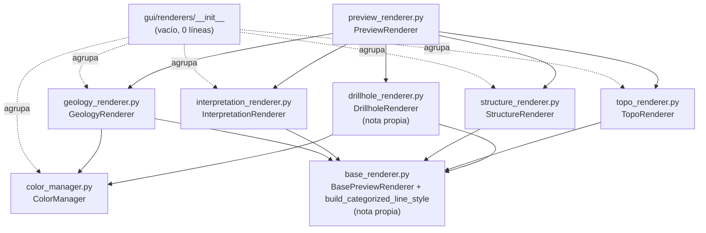

---
tags:
  - secinterp
  - code-walkthrough
  - gui
  - renderers
aliases:
  - gui/renderers/
  - ColorManager
  - GeologyRenderer
  - InterpretationRenderer
  - StructureRenderer
  - TopoRenderer
cssclass: secinterp-note
---

# `gui/renderers/` — Familia de renderers del preview (lado Present)

> [!abstract] Resumen en una línea
> Package `gui/renderers/` (6 files): namespace vacío (`__init__.py` de 0 líneas) más cinco piezas del lado Present — `ColorManager` (color estable por unidad), `GeologyRenderer`, `InterpretationRenderer`, `StructureRenderer` y `TopoRenderer` — que aplican simbología QGIS sobre capas ya extraídas; `base_renderer` y `drillhole_renderer` tienen nota propia y se enlazan como familia.

**Ruta**: `gui/renderers/` (6 archivos agrupados, 170 líneas en total)
**Símbolos principales**: `ColorManager`, `GeologyRenderer`, `InterpretationRenderer`, `StructureRenderer`, `TopoRenderer`
**Capa**: GUI · Present (solo simbología sobre `QgsVectorLayer`; ningún cálculo geológico)
**Tags**: #secinterp #gui #renderers

---

## 🎯 ¿Por qué existe este paquete?

Tras la fase Extract (ver [[gui_adapters]]) y el cómputo del core, el preview
necesita capas de memoria con estilo: cada unidad geológica con su color, el
relieve con rampa hipsométrica, las estructuras en rojo, los polígonos
interpretados semitransparentes. Sin una familia de renderers, ese estilo
viviría esparcido por `preview_renderer.py`:

| Problema | Solución |
|----------|----------|
| El estilo de cada capa mezclado con la creación de capas | Un renderer por dominio con un único método `apply_style(layer, **kwargs)` |
| Colores inconsistentes entre preview, leyenda y sesiones | `ColorManager`: mismo nombre de unidad → mismo `QColor`, siempre |
| Lógica compartida (categorizado por unidad) duplicada | `build_categorized_line_style` en [[base_renderer]], reutilizado por geología y sondajes |

> [!important] Nota arquitectónica
> Lado **Present** del patrón Extract-then-Compute. Los renderers reciben una
> `QgsVectorLayer` ya poblada y solo mutan su simbología (`setRenderer`,
> `setLabeling`). No leen configuraciones, no calculan intersecciones y no
> lanzan tareas: son el último eslabón antes del canvas.

---

## 🧬 Diagrama de relaciones



> [!tip] Cómo leer
> Flecha sólida = importa/hereda; punteada = agrupa por namespace o delega
> (`PreviewRenderer` elige renderer según la capa). `ColorManager` es el único
> módulo sin dependencia QGIS de renderizado: solo `QColor`.

---

## 📦 Imports — lectura arquitectónica

```python
# gui/renderers/__init__.py (íntegro: archivo vacío, 0 líneas)
```

```python
# gui/renderers/color_manager.py
from __future__ import annotations

from typing import ClassVar

from qgis.PyQt.QtGui import QColor
```

```python
# gui/renderers/geology_renderer.py
from __future__ import annotations

from qgis.core import QgsVectorLayer

from sec_interp.gui.renderers.base_renderer import (
    BasePreviewRenderer,
    build_categorized_line_style,
)
from sec_interp.gui.renderers.color_manager import ColorManager
```

```python
# gui/renderers/interpretation_renderer.py
from __future__ import annotations

from qgis.core import (
    QgsCategorizedSymbolRenderer,
    QgsFillSymbol,
    QgsRendererCategory,
    QgsVectorLayer,
)
from qgis.PyQt.QtGui import QColor

from sec_interp.gui.renderers.base_renderer import BasePreviewRenderer
```

```python
# gui/renderers/structure_renderer.py
from __future__ import annotations

from qgis.core import QgsLineSymbol, QgsSingleSymbolRenderer, QgsVectorLayer

from sec_interp.gui.renderers.base_renderer import BasePreviewRenderer
```

```python
# gui/renderers/topo_renderer.py
from __future__ import annotations

from qgis.core import (
    QgsClassificationFixedInterval,
    QgsGraduatedSymbolRenderer,
    QgsLineSymbol,
    QgsStyle,
    QgsVectorLayer,
)

from sec_interp.gui.renderers.base_renderer import BasePreviewRenderer
```

| # | Observación |
|---|-------------|
| ① | `__init__.py` vacío (0 líneas): namespace puro sin ni siquiera docstring; el paquete existe solo para agrupar. |
| ② | Los cinco módulos heredan de `BasePreviewRenderer` e implementan `apply_style(layer, **kwargs)`: el contrato de familia vive en [[base_renderer]]. |
| ③ | Solo `geology_renderer` importa `ColorManager` + `build_categorized_line_style` juntos: categorizado por nombre de unidad con color estable. |
| ④ | `interpretation_renderer` es el único que usa símbolos de **relleno** (`QgsFillSymbol`): trabaja con polígonos, el resto con líneas. |
| ⑤ | `topo_renderer` es el único que toca `QgsStyle.defaultStyle()` (rampas del sistema): depende de que el perfil de QGIS aporte `Spectral` o `RdYlGn`. |
| ⑥ | `structure_renderer` tiene el import más pequeño: un símbolo simple, sin categorías ni rampas. Complejidad proporcional a la necesidad. |
| ⑦ | `color_manager` importa `QColor` desde `qgis.PyQt` (ruta agnóstica Qt5/Qt6), nunca `PyQt5` directo. |

---

## 🏗️ Inventario de estructura

**Clases (una por módulo, más el helper compartido del hermano):**

- `class ColorManager` — 16 colores fijos + caché `_active_units`, 2 métodos
- `class GeologyRenderer(BasePreviewRenderer)` — 1 método público + constructor con `ColorManager`
- `class InterpretationRenderer(BasePreviewRenderer)` — 1 método público, sin estado
- `class StructureRenderer(BasePreviewRenderer)` — 1 método público, sin estado
- `class TopoRenderer(BasePreviewRenderer)` — 1 método público, sin estado
- Familia completa en [[base_renderer]] (`BasePreviewRenderer`, `build_categorized_line_style`) y [[drillhole_renderer]] (`DrillholeRenderer`, rol trace/interval + etiquetas)

---

## 📁 Archivos del paquete

| Archivo | Líneas | Rol |
|---|--:|---|
| [[#__init__\|__init__.py]] | 0 | Namespace vacío: agrupa sin código ni docstring |
| [[#ColorManager\|color_manager.py]] | 48 | `ColorManager`: paleta de 16 + color estable por nombre de unidad |
| [[#GeologyRenderer\|geology_renderer.py]] | 29 | Categorizado por unidad vía `ColorManager` |
| [[#InterpretationRenderer\|interpretation_renderer.py]] | 43 | Relleno semitransparente por polígono interpretado |
| [[#StructureRenderer\|structure_renderer.py]] | 18 | Línea roja simple para buzamientos |
| [[#TopoRenderer\|topo_renderer.py]] | 32 | Graduado hipsométrico en 8 clases sobre `elev` |

> [!note] Hermanos con nota propia
> `base_renderer.py` (60 líneas: contrato `BasePreviewRenderer` + helper
> `build_categorized_line_style`) → [[base_renderer]];
> `drillhole_renderer.py` (71 líneas: trazas + intervalos + etiquetas) →
> [[drillhole_renderer]]. Esta nota cubre honestamente los 6 archivos
> agrupados; de los hermanos solo se resume el contrato que usan.

---

## 📖 Recorrido módulo por módulo

### `__init__`

Archivo vacío, 0 líneas. No hay imports, ni `__all__`, ni docstring. Existe
porque Python necesita el marcador para tratar `renderers/` como paquete
regular. Decisión consciente frente a la alternativa (namespace sin
`__init__`): el repo mantiene paquetes regulares en toda la capa GUI.

### `ColorManager`

```python
class ColorManager:
    """Manages consistent color assignment for geological units."""

    GEOLOGY_COLORS: ClassVar[list[QColor]] = [
        QColor(231, 76, 60),  # Red
        QColor(52, 152, 219),  # Blue
        QColor(46, 204, 113),  # Green
        ...  # 16 entradas en total
    ]

    def __init__(self) -> None:
        """Initialize the color manager."""
        self._active_units: dict[str, QColor] = {}
```

```python
def get_color(self, name: str) -> QColor:
    """Get a consistent color for a geological unit."""
    if not name:
        return QColor(100, 100, 100)

    if name in self._active_units:
        return self._active_units[name]

    hash_val = sum(ord(c) for c in str(name))
    index = hash_val % len(self.GEOLOGY_COLORS)
    color = self.GEOLOGY_COLORS[index]
    self._active_units[name] = color
    return color
```

| Aspecto | Detalle |
|---------|---------|
| Paleta | 16 `QColor` fijos (rojo, azul, verde, púrpura, amarillo, naranja, turquesa, …) declarados como `ClassVar`: compartidos, no por instancia |
| Estabilidad | Hash determinista `sum(ord(c)) % 16`: la unidad `"Lutita"` siempre cae en el mismo índice, en cualquier sesión |
| Caché | `_active_units` memoriza lo ya asignado: la segunda llamada es O(1) y devuelve el **mismo** objeto |
| Guarda | Nombre vacío → gris neutro `QColor(100, 100, 100)` sin tocar la caché |

> [!warning] Colisiones por diseño
> Con 16 colores y más de 16 unidades, dos unidades comparten color (mismo
> `hash % 16`). Es aceptable para preview/leyenda pero no para cartografía
> final: la nota [[drillhole_renderer]] documenta el mismo compromiso en
> intervalos.

### `GeologyRenderer`

```python
class GeologyRenderer(BasePreviewRenderer):
    """Renderer for geological units in section."""

    def __init__(self, color_manager: ColorManager) -> None:
        self.color_manager = color_manager

    def apply_style(self, layer: QgsVectorLayer, **kwargs) -> None:
        """Apply categorized styling based on unit names."""
        unique_units = kwargs.get("unique_units", set())
        layer.setRenderer(build_categorized_line_style(self.color_manager, unique_units))
```

El renderer más delgado: delega todo en `build_categorized_line_style`
(ver [[base_renderer]]), que construye un `QgsCategorizedSymbolRenderer`
sobre el campo `unit` con líneas de 0.7 y extremos redondos. El `ColorManager`
se inyecta por constructor (no se crea dentro): tests y `PreviewRenderer`
pueden compartir una instancia y mantener colores consistentes entre capas.

### `InterpretationRenderer`

```python
def apply_style(self, layer: QgsVectorLayer, **kwargs) -> None:
    interp_data = kwargs.get("interp_data", [])
    categories = []

    for interp in interp_data:
        hex_color = interp.color if interp.color else "#FF0000"
        color = QColor(hex_color)

        fill_color = QColor(hex_color)
        fill_color.setAlpha(180)

        symbol = QgsFillSymbol.createSimple(
            {
                "color": hex_color,
                "alpha": "0.7",  # 70% opacity
                "outline_color": f"{color.darker(160).red()},{color.darker(160).green()},{color.darker(160).blue()}",
                "outline_width": "0.5",
            }
        )
        categories.append(QgsRendererCategory(interp.id, symbol, interp.name))

    layer.setRenderer(QgsCategorizedSymbolRenderer("id", categories))
```

| Aspecto | Detalle |
|---------|---------|
| Entrada | `interp_data`: lista de objetos con `.id`, `.name`, `.color` (polígonos de interpretación del dominio) |
| Color | Se respeta el color propio de cada interpretación (`interp.color`); fallback rojo `#FF0000` |
| Relleno | `alpha 0.7` + `setAlpha(180)`: semitransparente para ver la geología subyacente |
| Borde | Mismo tono oscurecido (`darker(160)`), 0.5 pt: el polígono se distingue sin tapar |
| Clave | Categorizado por campo `id`, etiqueta `interp.name` |

### `StructureRenderer`

```python
def apply_style(self, layer: QgsVectorLayer, **kwargs) -> None:
    """Apply a simple red line style for structural dips."""
    symbol = QgsLineSymbol.createSimple(
        {"color": "204,0,0", "width": "0.5", "capstyle": "round"}
    )
    layer.setRenderer(QgsSingleSymbolRenderer(symbol))
```

El módulo más pequeño (18 líneas): un único símbolo rojo (`204,0,0`), 0.5 pt,
extremos redondos, aplicado a toda la capa (`QgsSingleSymbolRenderer`, sin
categorías). Los buzamientos se distinguen por geometría (trazos de
proyección), no por color: el estilo no necesita saber nada del dato.

### `TopoRenderer`

```python
def apply_style(self, layer: QgsVectorLayer, **kwargs) -> None:
    """Apply polychromatic elevation styling."""
    renderer = QgsGraduatedSymbolRenderer("elev")
    renderer.setSourceSymbol(QgsLineSymbol.createSimple({"width": "0.8", "capstyle": "round"}))

    style = QgsStyle.defaultStyle()
    color_ramp = style.colorRamp("Spectral") or style.colorRamp("RdYlGn")
    if color_ramp:
        renderer.updateColorRamp(color_ramp)

    renderer.setClassificationMethod(QgsClassificationFixedInterval())
    renderer.updateClasses(layer, 8)
    layer.setRenderer(renderer)
```

| Aspecto | Detalle |
|---------|---------|
| Campo | Graduado sobre `elev`: la capa del perfil debe exponer esa columna |
| Rampa | `Spectral`, con fallback a `RdYlGn`; si no existe ninguna, se queda el símbolo fuente (guarda `if color_ramp`) |
| Clases | 8 intervalos fijos (`QgsClassificationFixedInterval` + `updateClasses(layer, 8)`): hipsometría legible sin calibrar |
| Trazo | Línea 0.8 pt, algo más gruesa que geología (0.7) y estructuras (0.5): jerarquía visual |

---

## 🧩 Contrato de la familia (con los hermanos)

Todos los renderers cumplen `BasePreviewRenderer.apply_style(layer, **kwargs)`:

| Renderer | `kwargs` que lee | Estrategia QGIS | Nota |
|----------|------------------|-----------------|------|
| `GeologyRenderer` | `unique_units: set` | Categorizado por `unit` | Esta nota |
| `DrillholeRenderer` | `role`, `unique_units` | Simple (traza) / categorizado (intervalo) + etiquetas | [[drillhole_renderer]] |
| `InterpretationRenderer` | `interp_data: list` | Categorizado por `id` con relleno | Esta nota |
| `StructureRenderer` | ninguno | Símbolo único | Esta nota |
| `TopoRenderer` | ninguno | Graduado por `elev` | Esta nota |

---

## 🔄 Flujo de datos

| Fase | Entrada | Transformación | Salida |
|------|---------|----------------|--------|
| Selección | Capa de memoria + tipo de dominio | `PreviewRenderer` elige renderer | Renderer concreto |
| Estilo | `QgsVectorLayer` + `kwargs` (`unique_units`, `interp_data`) | `apply_style` construye símbolos | `layer.setRenderer(...)` |
| Color | Nombre de unidad | `ColorManager.get_color` (hash + caché) | `QColor` estable |
| Canvas | Capas con renderer | Refresh del preview | Sección coloreada + leyenda |

---

## 🏛️ Patrones de diseño presentes

| Patrón | Dónde | Propósito |
|--------|-------|-----------|
| **Template Method** | `BasePreviewRenderer.apply_style` (abstracto) | Fijar el punto de extensión de la familia |
| **Strategy** | Un renderer por dominio | `PreviewRenderer` delega sin `if` encadenados de estilo |
| **Flyweight / caché** | `ColorManager._active_units` | Un `QColor` por unidad, compartido entre capas |
| **Dependency Injection** | `GeologyRenderer(color_manager)` | Color consistente e testeable |
| **Guarda con fallback** | `Spectral or RdYlGn`, `"#FF0000"`, gris `100,100,100` | Degradar con gracia si falta un recurso |

---

## 🧾 Resumen de la API

| Símbolo | Firma / Hereda | Uso típico |
|---------|----------------|------------|
| `ColorManager` | `get_color(name: str) -> QColor` | Instancia compartida entre renderers y leyenda |
| `ColorManager.GEOLOGY_COLORS` | `ClassVar[list[QColor]]` (16) | Paleta fija del plugin |
| `GeologyRenderer(color_manager)` | `BasePreviewRenderer` | `apply_style(layer, unique_units={...})` |
| `InterpretationRenderer()` | `BasePreviewRenderer` | `apply_style(layer, interp_data=[...])` |
| `StructureRenderer()` | `BasePreviewRenderer` | `apply_style(layer)` |
| `TopoRenderer()` | `BasePreviewRenderer` | `apply_style(layer)` sobre capa con campo `elev` |

---

## 🛡️ Manejo de errores

Los renderers **no lanzan ni capturan**: aplican estilo de forma best-effort.

| Situación | Comportamiento |
|-----------|----------------|
| `unique_units` vacío / ausente | Categorizado vacío: la capa queda sin categorías pero válida |
| `interp_data` vacío | `QgsCategorizedSymbolRenderer("id", [])`: sin categorías, sin fallo |
| Sin rampa `Spectral` ni `RdYlGn` | Se conserva el símbolo fuente (`if color_ramp`); el perfil se ve monocolor |
| `interp.color` ausente | Fallback `#FF0000` |
| Nombre de unidad vacío | Gris `100,100,100` desde `ColorManager` |

---

## 🧪 Tests asociados

Cobertura real en `tests/gui/renderers/test_renderers.py` (Mock-first, sin QGIS):

- `TestDrillholeRenderer.test_apply_trace_style` — verifica `setRenderer` + `setLabeling` + `setLabelsEnabled(True)` con capa mockeada.
- `TestDrillholeRenderer.test_apply_interval_style` — verifica `setRenderer` y que `get_color` se llama una vez por unidad (`{"LithA", "LithB"}` → 2 llamadas).
- `TestTopoRenderer.test_apply_style` — verifica `setRenderer` con capa mockeada.

| Módulo de esta nota | Cobertura | Evidencia |
|---------------------|-----------|-----------|
| `TopoRenderer` | Directa | `TestTopoRenderer` en `test_renderers.py` |
| `ColorManager` | Indirecta (doble con `spec`) | `MagicMock(spec=ColorManager)` fija la interfaz usada por `DrillholeRenderer` |
| `GeologyRenderer` | Vía helper compartido | Usa `build_categorized_line_style`, el mismo camino que ejercita el test de intervalos |
| `InterpretationRenderer` | Sin test dedicado | Riesgo registrado abajo |
| `StructureRenderer` | Sin test dedicado | Un símbolo estático; coste de regresión bajo |

---

## 🌐 i18n y notas de migración

- Ningún renderer contiene cadenas visibles: las etiquetas de leyenda vienen
  de los datos (`interp.name`, nombre de unidad). Nada que traducir aquí.
- Todos los imports Qt pasan por `qgis.PyQt` (`QColor`) o `qgis.core`:
  agnósticos a Qt5/Qt6 y a QGIS 4.x.
- `QgsStyle.defaultStyle()` depende del perfil de QGIS del usuario: si un
  perfil personalizado elimina `Spectral` y `RdYlGn`, el topo cae al símbolo
  fuente (comportamiento degradado pero válido).

---

## 👀 Observaciones y notas

> [!success] Fortalezas
> - Un método por renderer: la familia más simple posible que cumple el contrato base.
> - `ColorManager` determinista + cacheado: mismo color en preview, leyenda y sesiones.
> - Fallbacks en todas las entradas opcionales: ningún renderer rompe con datos vacíos.
> - Imports mínimos por módulo: cada renderer solo conoce las clases QGIS que usa.

> [!warning] Puntos de atención
> - `InterpretationRenderer` y `StructureRenderer` sin test dedicado: un cambio de firma QGIS los rompería en silencio hasta el test manual.
> - Colisión de color con >16 unidades (hash módulo 16): documentado, pero sin advertencia al usuario.
> - `updateClasses(layer, 8)` con capa vacía puede producir 0 clases: el topo aparece sin estilo hasta tener datos.
> - `__init__.py` sin docstring: único paquete GUI sin contrato documentado (contrasta con [[gui_adapters]] y [[gui_services]]).

> [!question] Preguntas abiertas
> - ¿Añadir tests de `apply_style` para geología/interpretación/estructuras siguiendo el patrón de `test_renderers.py`?
> - ¿Exponer la paleta de `ColorManager` en ajustes para cartografía con >16 unidades?

---

## 🔗 Notas relacionadas

- [[Index]] — índice de la bóveda
- [[base_renderer]] — contrato `BasePreviewRenderer` + `build_categorized_line_style`
- [[drillhole_renderer]] — trazas, intervalos y etiquetas (hermano con nota propia)
- [[preview_renderer]] — `PreviewRenderer`, quien elige cada renderer
- [[preview_legend_renderer]] — leyenda que reutiliza los mismos colores
- [[gui]] — fachada del paquete raíz que re-exporta `PreviewRenderer`
- [[gui_adapters]] — fase Extract que produce las capas a estilizar
- [[controller]] — orquestador cuyo resultado se presenta aquí

---

*Nota de la bóveda SecInterp Code Walkthrough v2 — v3.9.1*
