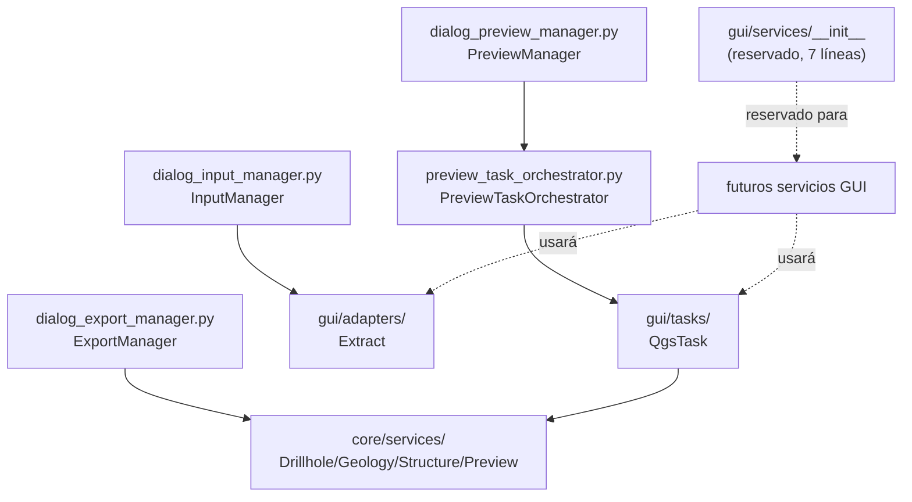

---
tags:
  - secinterp
  - code-walkthrough
  - gui
  - services
aliases:
  - gui/services/
cssclass: secinterp-note
---

# `gui/services/` — Namespace reservado para servicios GUI

> [!abstract] Resumen en una línea
> Package `gui/services/` (1 file): namespace actualmente vacío cuyo `__init__.py` de 7 líneas declara la intención del paquete (servicios GUI con componentes UI, p. ej. procesado paralelo con QThreads) mientras la orquestación real vive hoy en los `dialog_*_manager`, el `PreviewTaskOrchestrator` y `core/services`; esta nota documenta el rol, las convenciones y el contrato que deberá cumplir cualquier servicio futuro.

**Ruta**: `gui/services/` (namespace; 1 archivo agrupado, 7 líneas, cero símbolos)
**Símbolos principales**: ninguno (paquete sin código ejecutable)
**Capa**: GUI · Services (reservado; orquestación efectiva en managers + `core/`)
**Tags**: #secinterp #gui #services

---

## 🎯 ¿Por qué existe este paquete?

El plugin distingue tres clases de lógica del lado GUI: managers de diálogo,
extractores y **servicios** (orquestación con estado, paralelismo, cachés de
UI). El directorio reserva el hogar de esa tercera clase antes de que el
código la necesite:

| Problema | Solución |
|----------|----------|
| La orquestación con estado (preview, export, tareas) necesita un hogar distinto de los managers de diálogo | `gui/services/` reservado como namespace con intención documentada |
| Un servicio futuro no debe redescubrir las reglas de la capa GUI | El `__init__.py` declara el ámbito: "servicios que interactúan con componentes UI, como procesado paralelo con QThreads" |
| Crear el directorio el día que haga falta rompería imports y empaquetado | Existe desde ya como paquete regular importable (aunque vacío) |

> [!important] Nota arquitectónica
> Namespace **reservado, no fachada**: no re-exporta nada porque no hay nada
> que exportar. Su valor hoy es documental (intención + convenciones) y
> estructural (la ruta `sec_interp.gui.services` ya es importable). La
> orquestación GUI real se describe abajo con sus ubicaciones verdaderas.

---

## 🧬 Diagrama de relaciones



> [!tip] Cómo leer
> Flecha sólida = delegación real hoy; punteada = intención reservada. El
> namespace no participa en ningún flujo actual: el diagrama muestra dónde
> vive la orquestación efectiva para que el futuro servicio la reutilice.

---

## 📦 Imports — lectura arquitectónica

```python
# gui/services/__init__.py (íntegro: 7 líneas)
from __future__ import annotations

"""GUI-specific services for SecInterp.

This package contains services that interact with UI components,
such as parallel processing using QThreads.
"""
```

| # | Observación |
|---|-------------|
| ① | `from __future__ import annotations` como primera sentencia: convención global del repo, incluso en archivos sin anotaciones (uniformidad para `ruff`). |
| ② | El literal de documentación va **después** del import `__future__` (obligatorio por sintaxis), de modo que técnicamente no es el `__doc__` del paquete sino una expresión literal sin efecto; el valor es igualmente documental para el lector. |
| ③ | Cero imports de `qgis`, Qt o `core`: el namespace no carga nada y no puede crear ciclos de importación. |
| ④ | La mención a "parallel processing using QThreads" fija la expectativa: los servicios de este paquete orquestarán concurrencia del lado UI, no cómputo geológico (que vive en `core/services/`). |
| ⑤ | Sin `__all__`, sin símbolos, sin efectos laterales: importar `sec_interp.gui.services` es inocuo en cualquier contexto, incluidos tests con QGIS mockeado. |

---

## 🏗️ Inventario de estructura

**Archivo agrupado en esta nota:**

- `__init__.py` — 7 líneas: import `__future__` + literal de intención, sin símbolos

**Dónde vive hoy la orquestación GUI (con nota propia):**

| Responsabilidad | Ubicación real | Nota |
|-----------------|----------------|------|
| Lectura y validación de inputs del diálogo | `gui/dialog_input_manager.py` (`InputManager`) | [[dialog_input_manager]] |
| Preview, canvas y reportes | `gui/dialog_preview_manager.py` (`PreviewManager`) + `preview_reporter.py` | [[dialog_preview_manager]] |
| Exportación (DXF, shapefile, 3D) | `gui/dialog_export_manager.py` (`ExportManager`) | [[dialog_export_manager]] |
| Lanzamiento de `QgsTask` en segundo plano | `gui/preview_task_orchestrator.py` (`PreviewTaskOrchestrator`) | [[preview_task_orchestrator]] |
| Cómputo puro reutilizable | `core/services/*.py` | [[drillhole_service]], [[geology_service]] |

---

## 📁 Archivos del paquete

| Archivo | Líneas | Rol |
|---|--:|---|
| [[#__init__\|__init__.py]] | 7 | Namespace reservado: declara la intención (servicios GUI + QThreads), sin símbolos |

---

## 📖 Recorrido: el namespace y su intención

### `__init__`

```python
from __future__ import annotations

"""GUI-specific services for SecInterp.

This package contains services that interact with UI components,
such as parallel processing using QThreads.
"""
```

El archivo completo son estas 7 líneas. Su lectura honesta tiene tres niveles:

**Nivel 1 — lo que dice.** El paquete contendrá servicios GUI: objetos con
estado o ciclo de vida que interactúan con componentes de UI (a diferencia de
los extractores, sin estado, y de los renderers, puramente presentacionales).
El ejemplo canónico es el procesado paralelo con QThreads.

**Nivel 2 — lo que implica.** "Interactúan con componentes UI" traza la
frontera con `core/services/`: un servicio de este paquete **puede** conocer
widgets, canvas y `QgsTask`; un servicio del core **nunca** puede. La mención
a QThreads (no a `QgsTask`) sugiere hilos Qt de grano fino para trabajo UI,
complementando las tareas pesadas que ya gestiona [[preview_task_orchestrator]].

**Nivel 3 — lo que falta.** No hay criterio de cuándo extraer un manager a
servicio (¿tamaño? ¿reutilización entre diálogos? ¿estado propio?). Esa laguna
se cubre abajo en "Contrato para futuros servicios" para que el primer
servicio real nazca con reglas en vez de improvisarlas.

| Propiedad verificada | Evidencia |
|----------------------|-----------|
| Paquete importable y vacío | `__init__.py` existe; ningún módulo lo importa hoy (búsqueda en `gui/`, `core/`, `tests/`, `exporters/` sin referencias a `gui.services`) |
| Sin carga QGIS | Cero imports más allá de `__future__` |
| Sin superficie pública | Sin `__all__` ni clases/funciones |

---

## 🧩 Dónde vive hoy la orquestación GUI

Hasta que el namespace se pueble, estas son las piezas que un futuro servicio
debe reutilizar en vez de reimplementar:

| Pieza | Qué orquesta | Por qué no es un "servicio" aún |
|-------|--------------|----------------------------------|
| `InputManager` | Lee páginas (`Pages`), valida y produce parámetros | Acoplado al ciclo de vida del diálogo |
| `PreviewManager` | Canvas, capas de memoria, leyenda, reportes | Delega estilo en [[gui_renderers]] y fondo en el orquestador |
| `ExportManager` | Tuberías DXF/shapefile/3D hacia `exporters/` | Orquestación puntual por formato, sin estado propio |
| `PreviewTaskOrchestrator` | `DrillholeGenerationTask` + `GeologyGenerationTask` | Dueño del ciclo lanzar → progreso → `finished()` |
| `core/services/*` | Cómputo puro thread-safe | Prohibido tocar UI: no pueden subir a esta capa |

> [!note] Candidatos naturales a migrar aquí
> Si `PreviewTaskOrchestrator` crece (reintentos, colas, prioridades) o si el
> procesado paralelo con QThreads se materializa, ese código pertenece a
> `gui/services/` con su propia nota, y esta nota pasará de "reservado" a
> "índice del paquete".

---

## 🔬 Radiografía del orquestador actual (lo que un servicio reutilizará)

`gui/preview_task_orchestrator.py` es hoy la pieza más parecida a un servicio
GUI. Su cabecera verificada muestra el cableado que cualquier servicio futuro
debe imitar:

```python
# gui/preview_task_orchestrator.py (cabecera verificada)
"""Orchestrator for background preview generation tasks."""

from __future__ import annotations

from typing import TYPE_CHECKING, Any

from qgis.core import QgsApplication

from sec_interp.gui.adapters.layer_resolver import resolve_layer
from sec_interp.logger_config import get_logger

logger = get_logger(__name__)

from .tasks.drillhole_task import DrillholeGenerationTask  # noqa: E402
from .tasks.geology_task import GeologyGenerationTask  # noqa: E402

if TYPE_CHECKING:
    from .dialog_preview_manager import PreviewManager


class PreviewTaskOrchestrator:
    """Manages asynchronous geology and drillhole generation tasks."""

    def __init__(self, manager: PreviewManager) -> None:
        ...
```

| # | Observación |
|---|-------------|
| ① | Importa el Extract (`resolve_layer`) y las tareas (`tasks.*`), pero **no** los servicios del core directamente: respeta las capas. |
| ② | `PreviewManager` solo bajo `TYPE_CHECKING`: el orquestador recibe al manager sin acoplamiento en runtime (el mismo truco que `Pages` con `Any`). |
| ③ | Logger por módulo (`get_logger(__name__)`): convención que heredará cualquier servicio nuevo. |
| ④ | Los imports de tareas van tras el logger con `noqa: E402`: orden pragmático documentado, no descuido. |

| Decisión del orquestador | Lección para `gui/services/` |
|--------------------------|------------------------------|
| Recibe el manager, no lo busca | Inyección por constructor, como `Pages` |
| Conoce tareas + extractores, no widgets | Un servicio orquesta datos; la UI la tocan los managers |
| Una clase, una responsabilidad (lanzar y seguir tareas) | Tamaño de referencia: si un servicio supera ~200 líneas, dividir |

---

## 🔁 Ciclo de vida propuesto de un servicio futuro

| Fase | Qué ocurre | Ejemplo análogo hoy |
|------|------------|---------------------|
| Construcción | El composition-root (`main_dialog.py`) lo crea con `Pages`/managers | `pages = Pages(...)` en [[gui]] |
| Inyección | Recibe colaboradores por constructor, nunca vía `QgsProject` global salvo `LayerResolver` | `PreviewTaskOrchestrator(manager)`, `DrillholeExtractor(data_fetcher)` |
| Ejecución | Delega cómputo a `core/` con DTOs; fondo vía `QgsTask`/QThread | [[gui_tasks]] con `feedback=self` |
| Resultado | Emite señales Qt o retorna DTOs; el manager presenta | `finished_with_results` en las tareas actuales |
| Limpieza | Desconecta señales y libera hilos al cerrar el diálogo | `disconnect_signals()` exigido por `gui/AGENTS.md` |

---

## 📏 Contrato para futuros servicios

Reglas que deberá cumplir cualquier módulo nuevo bajo `gui/services/`:

| Regla | Justificación |
|-------|---------------|
| Puede importar `qgis.*`, `qgis.PyQt` y widgets; nunca `core/` que importe GUI | La frontera Core/GUI es unidireccional (ver `test_architecture_boundary.py`) |
| Recibe DTOs/primitivas de `adapters/`, nunca capas vivas en hilos | Objetos QGIS vivos en background = crash (ver `gui/AGENTS.md` y [[gui_tasks]]) |
| Operaciones > 100 ms van a `QgsTask`/QThread con progreso y cancelación | Norma de la capa GUI; el servicio orquesta, el hilo ejecuta |
| Errores de dominio como excepciones `SecInterpError`; mensajes al usuario solo vía managers | `iface.messageBar()` prohibido fuera de `gui/` y solo en mixins de mensaje |
| Cadenas visibles con `QCoreApplication.translate` | Convención i18n de la capa (ver [[gui_adapters]]) |
| Nota propia en la bóveda + enlace desde la tabla de esta nota | Trazabilidad del vault (esta nota actúa como índice) |
| Checklist verificable en la revisión | Cada regla debe marcarse con la línea o test que la cumple, como los extractores en [[gui_adapters]] |

---

## 🧭 Brújula: qué lógica va dónde (lado GUI)

| Lógica | Hogar correcto | Por qué no en `services/` (hoy) / por qué sí (futuro) |
|--------|----------------|--------------------------------------------------------|
| Leer widgets y validar inputs | `dialog_input_manager.py` | Acoplada al diálogo; extraerla a servicio solo si otro diálogo la reutiliza |
| Crear capas de memoria y ejes | `preview_layer_factory.py`, `preview_axes_manager.py` | Fábricas sin estado: no necesitan ciclo de vida de servicio |
| Leer capas QGIS → DTOs | `adapters/` | Sin estado y sin UI: son adaptadores, no servicios |
| Pintar capas | `renderers/` + `preview_renderer.py` | Presentación pura de un solo método |
| Lanzar y seguir `QgsTask` | `preview_task_orchestrator.py` | Hoy basta como orquestador; si añade colas/reintentos, migra aquí |
| QThreads de grano fino UI | `gui/services/` (futuro) | Es el caso de uso literal del docstring del paquete |
| Caché de preview con clave | Futuro servicio sobre `preview_param_hasher.py` | Estado + invalidación: recomienda servicio con ciclo de vida |

---

## 🔄 Flujo de datos

| Fase | Entrada | Transformación | Salida |
|------|---------|----------------|--------|
| Reserva (hoy) | — | El namespace existe sin participar en flujos | Ruta importable |
| Orquestación (hoy) | Parámetros validados | Managers → extractores → `core/` → renderers | Preview / export |
| Fondo (hoy) | DTOs extraídos | `QgsTask` + servicios puros | Resultados vía señales |
| Servicio futuro | Estado UI + DTOs | Lógica con ciclo de vida bajo este namespace | Señales hacia managers |

---

## 🏛️ Patrones de diseño presentes

| Patrón | Dónde | Propósito |
|--------|-------|-----------|
| **Namespace reservado** | `__init__.py` | Declarar intención arquitectónica antes del código |
| **Composition Root** (hoy en diálogo) | `main_dialog.py` + `Pages` | Los futuros servicios se inyectarán igual (ver [[gui]]) |
| **Orquestador** (candidato a migrar) | `PreviewTaskOrchestrator` | Ciclo de vida de tareas en segundo plano |
| **Manager** (candidatos a adelgazar) | `InputManager`, `PreviewManager`, `ExportManager` | Lógica que podría independizarse del diálogo |

---

## 🧾 Resumen de la API

| Símbolo | Firma / Hereda | Uso típico |
|---------|----------------|------------|
| *(ninguno)* | — | El paquete no expone API; la tabla documenta su ausencia honestamente |
| `InputManager` | manager del diálogo | Lectura de inputs (ver [[dialog_input_manager]]) |
| `PreviewManager` | manager del diálogo | Preview y reportes (ver [[dialog_preview_manager]]) |
| `ExportManager` | manager del diálogo | Exportaciones (ver [[dialog_export_manager]]) |
| `PreviewTaskOrchestrator` | orquestador de `QgsTask` | Fondo con DTOs (ver [[preview_task_orchestrator]]) |

---

## 🛡️ Manejo de errores

El namespace no ejecuta código: no maneja errores. Las reglas para futuros
servicios derivan de la capa:

- Propagar excepciones de dominio (`SecInterpError` y subtipos) sin
  convertirlas en códigos de retorno; los managers las traducen a mensajes.
- Cancelación cooperativa vía `isCanceled()` en hilos, nunca excepciones de
  control de flujo (patrón de [[gui_tasks]] y `feedback` del core).
- No crear `QgsMessageLog` por servicio: usar `logger_config.get_logger(__name__)`
  como el resto de la capa GUI.

---

## 🧪 Tests asociados

Sin código no hay tests del paquete; la orquestación efectiva se cubre en
`tests/gui/`:

- `tests/gui/test_preview_task_orchestrator.py` — el orquestador consume un
  extractor mockeado (`extract_context`) y lanza tareas: el test GUI más
  cercano a un "servicio" hoy.
- `tests/gui/test_dialog_input_manager.py` — `InputManager` con `Pages`
  mockeadas (orquestación de inputs sin diálogo real).
- `tests/gui/test_dialog_preview_manager.py` — preview con dependencias
  mockeadas.
- `tests/gui/test_dialog_export_manager.py` — tuberías de exportación.

| Test en `tests/gui/` | Qué orquestación cubre | Patrón reutilizable por futuros servicios |
|----------------------|------------------------|--------------------------------------------|
| `test_preview_task_orchestrator.py` | Extractor mockeado → tareas | Mockear el Extract (`extract_context`) y verificar el cableado |
| `test_dialog_input_manager.py` | `Pages` mockeadas → parámetros | Inyectar dependencias estrechas en vez del diálogo |
| `test_dialog_preview_manager.py` | Preview con dobles | Aislar canvas y capas con mocks |
| `test_dialog_export_manager.py` | Export por formato | Una prueba por tubería de salida |

| Expectativa | Estado |
|-------------|--------|
| Test de `gui/services/__init__.py` | Innecesario: sin símbolos que ejercitar |
| Tests de futuros servicios | Deberán seguir el patrón Mock-first de `tests/gui/` (ver skill qa-docker) |

---

## 🌐 i18n y notas de migración

- El namespace no contiene cadenas: nada que traducir hoy.
- Cualquier servicio futuro con texto visible deberá usar
  `QCoreApplication.translate` (convención verificada en [[gui_adapters]]).
- Imports futuros desde `qgis.PyQt` (agnóstico), nunca `PyQt5` directo:
  requisito para QGIS 4.x (ver skill qgis-migration-4x).
- Los mensajes de progreso de hilos (`setProgress`, `%`) también son cadenas
  visibles: deberán pasar por `translate` igual que los errores.

---

## 👀 Observaciones y notas

> [!success] Fortalezas
> - Reserva explícita con intención documentada: mejor que un directorio sorpresa o lógica huérfana en managers.
> - Cero coste: sin imports, sin ciclos, sin carga QGIS al importar.
> - La mención a QThreads orienta el diseño futuro (hilos UI de grano fino vs. `QgsTask` pesadas).

> [!warning] Puntos de atención
> - Riesgo de paquete fantasma: si nada lo puebla en varias fases, conviene reevaluar si la orquestación en managers es suficiente.
> - El literal tras el import `__future__` no es `__doc__` formal: herramientas que lean `package.__doc__` verán `None`.
> - Sin criterio de extracción manager → servicio: el primer refactor puede hacerse en el lugar equivocado.

> [!question] Preguntas abiertas
> - ¿Migrar `PreviewTaskOrchestrator` a `gui/services/` cuando necesite reintentos o colas?
> - ¿Un servicio de caché de preview (clave en `preview_param_hasher.py`) sería el primer habitante natural?

---

## 🔗 Notas relacionadas

- [[Index]] — índice de la bóveda
- [[gui]] — paquete raíz y composición con `Pages`
- [[main_dialog]] — diálogo que hoy compone managers y orquestador
- [[dialog_input_manager]] — orquestación de inputs (candidata a servicio)
- [[dialog_preview_manager]] — orquestación de preview
- [[dialog_export_manager]] — orquestación de exportación
- [[preview_task_orchestrator]] — orquestador de fondo (candidato a migrar aquí)
- [[preview_renderer]] — render nativo que consumen los managers
- [[controller]] — orquestador del dominio en el core
- [[drillhole_service]] / [[geology_service]] — cómputo puro invocable desde futuros servicios
- [[gui_adapters]] — Extract que alimentará a los servicios
- [[gui_tasks]] — tareas que los servicios orquestarán

---

*Nota de la bóveda SecInterp Code Walkthrough v2 — v3.9.1*
