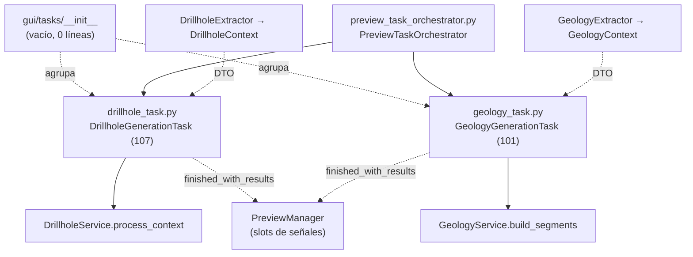

---
tags:
  - secinterp
  - code-walkthrough
  - gui
  - tasks
aliases:
  - gui/tasks/
  - DrillholeGenerationTask
  - GeologyGenerationTask
cssclass: secinterp-note
---

# `gui/tasks/` — Tareas `QgsTask` en segundo plano (DTOs, nunca QGIS vivo)

> [!abstract] Resumen en una línea
> Package `gui/tasks/` (1 file): namespace vacío (`__init__.py` de 0 líneas) cuyo rol es agrupar las dos tareas de fondo con nota propia — `DrillholeGenerationTask` y `GeologyGenerationTask` — que ejecutan los servicios puros del core en hilos `QgsTask` recibiendo solo DTOs desacoplados y devolviendo resultados por señales Qt; esta nota documenta el namespace, el contrato común de ambas tareas y su seguridad en hilos.

**Ruta**: `gui/tasks/` (namespace; 1 archivo agrupado, 0 líneas + 2 tareas hermanas: 107 + 101 líneas)
**Símbolos principales**: ninguno en el `__init__`; `DrillholeGenerationTask`, `GeologyGenerationTask` en las hermanas
**Capa**: GUI · Background (`QgsTask` cancelables; cómputo delegado a `core/`)
**Tags**: #secinterp #gui #tasks

---

## 🎯 ¿Por qué existe este paquete?

Interpolar una sección (intersecciones geológicas, proyección de sondajes)
supera los 100 ms que `gui/AGENTS.md` fija como umbral: hacerlo en el hilo
principal congelaría QGIS. Pero los hilos Qt no pueden tocar objetos QGIS
vivos. El paquete resuelve ambas tensiones a la vez:

| Problema | Solución |
|----------|----------|
| El cómputo pesado bloquea la UI | Dos `QgsTask` cancelables (`drillhole_task.py`, `geology_task.py`) ejecutan en segundo plano |
| `QgsTask.run()` con capas/features vivas = crash | Las tareas reciben **solo DTOs** (`DrillholeContext`, `GeologyContext`) producidos por [[gui_adapters]] |
| El core no debe conocer Qt ni hilos | El servicio recibe la tarea como `feedback` (`isCanceled`/`setProgress` por duck typing) |
| El resultado debe volver al hilo principal | Señales `finished_with_results` / `error_occurred` / `progress_changed` + `finished()` con emisión diferida |

> [!important] Nota arquitectónica
> Las tareas son el **único código autorizado a vivir en un hilo** y, a la
> vez, el código con **más restricciones**: `run()` solo habla con el servicio
> puro; `finished()` solo habla con la UI. Todo lo visual y todo lo QGIS-vivo
> ocurre antes (Extract) o después (Present) de la tarea, nunca dentro.

---

## 🧬 Diagrama de relaciones



> [!tip] Cómo leer
> Flecha sólida = crea/invoca; punteada = entrega DTOs o emite señales.
> Los servicios del core nunca saben que los llama un hilo: solo ven un
> `feedback` con `isCanceled` y `setProgress`.

---

## 📦 Imports — lectura arquitectónica

```python
# gui/tasks/__init__.py (íntegro: archivo vacío, 0 líneas)
```

```python
# gui/tasks/drillhole_task.py (cabecera)
from __future__ import annotations

from typing import TYPE_CHECKING, Any

from qgis.core import Qgis, QgsMessageLog, QgsTask
from qgis.PyQt.QtCore import QTimer, pyqtSignal

from sec_interp.core.domain import DrillholeContext
from sec_interp.logger_config import get_logger

if TYPE_CHECKING:
    from sec_interp.core.services.drillhole_service import DrillholeService
```

```python
# gui/tasks/geology_task.py (cabecera)
from __future__ import annotations

from typing import TYPE_CHECKING, Any

from qgis.core import Qgis, QgsMessageLog, QgsTask
from qgis.PyQt.QtCore import QTimer, pyqtSignal

from sec_interp.core.domain import GeologyContext, GeologyData
from sec_interp.logger_config import get_logger

if TYPE_CHECKING:
    from sec_interp.core.services.geology_service import GeologyService
```

| # | Observación |
|---|-------------|
| ① | `__init__.py` vacío como en [[gui_renderers]]: el paquete agrupa, no publica API (las tareas se importan por ruta: `from .tasks.drillhole_task import …`, verificado en el orquestador). |
| ② | Ambas cabeceras son **idénticas salvo el dominio** (`DrillholeContext` vs `GeologyContext`/`GeologyData`): las tareas son gemelas por diseño, no por copia accidental. |
| ③ | El servicio se importa solo bajo `TYPE_CHECKING` y se tipa en el constructor: en runtime la tarea acepta cualquier objeto con `process_context`/`build_segments` (mockeable sin importar el core). |
| ④ | `QTimer` + `pyqtSignal` son los únicos imports Qt: señales y diferido al event loop, nada de widgets. |
| ⑤ | `Qgis` + `QgsMessageLog` solo se usan en la rama de error de `finished()`: el logging feliz pasa por `logger_config`. |
| ⑥ | `QgsTask.Flag.CanCancel` (verificado en ambos `__init__`): la cancelación es parte del contrato, no un añadido. |

---

## 🏗️ Inventario de estructura

**Archivo agrupado en esta nota:**

- `__init__.py` — 0 líneas: namespace vacío sin símbolos

**Tareas hermanas (con nota propia; contrato común resumido aquí):**

| Módulo | Líneas | Clase | Servicio invocado | Resultado |
|--------|-------:|-------|-------------------|-----------|
| `drillhole_task.py` | 107 | `DrillholeGenerationTask` | `DrillholeService.process_context` | tupla `(geol_data, drillhole_data)` |
| `geology_task.py` | 101 | `GeologyGenerationTask` | `GeologyService.build_segments` | `GeologyData` (lista de segmentos) |

---

## 📁 Archivos del paquete

| Archivo | Líneas | Rol |
|---|--:|---|
| [[#__init__\|__init__.py]] | 0 | Namespace vacío: agrupa las dos tareas sin código ni docstring |

> [!note] Hermanas con nota propia
> [[drillhole_task]] (`DrillholeGenerationTask`, 107 líneas) y
> [[geology_task]] (`GeologyGenerationTask`, 101 líneas). Esta nota cubre
> honestamente el único archivo agrupado y resume el **contrato común** de
> ambas tareas sin duplicar sus notas.

---

## 📖 Recorrido: el namespace y el contrato común

### `__init__`

Archivo vacío, 0 líneas: sin imports, sin `__all__`, sin docstring. Igual que
el namespace de [[gui_renderers]] y a diferencia de [[gui_adapters]] (que
documenta su contrato) y [[gui_services]] (que declara intención): aquí el
contrato vive en las propias tareas gemelas, y el `__init__` es puro marcador
de paquete regular.

### Contrato común: señales

Ambas tareas declaran exactamente las mismas tres señales de clase:

```python
# Señales idénticas en DrillholeGenerationTask y GeologyGenerationTask
finished_with_results = pyqtSignal(object)
error_occurred = pyqtSignal(str)
progress_changed = pyqtSignal(float)
```

| Señal | Cuándo se emite | Quién la escucha |
|-------|-----------------|------------------|
| `finished_with_results` | `finished()` con éxito, diferida con `QTimer.singleShot(0, …)` | Slots del `PreviewManager` vía [[preview_task_orchestrator]] |
| `error_occurred` | `finished()` con `self.exception` fijada | UI de errores (`show_user_message`) |
| `progress_changed` | `setProgress()` invocado por el servicio vía `feedback` | Barra de progreso del diálogo |

### Contrato común: constructor

```python
def __init__(
    self,
    description: str,
    context,      # DrillholeContext | GeologyContext (DTO desacoplado)
    service,      # DrillholeService | GeologyService (solo bajo TYPE_CHECKING)
    params: Any,  # params originales (compatibilidad hacia atrás)
) -> None:
    super().__init__(description, QgsTask.Flag.CanCancel)
    self.service = service
    self.context = context
    self.params = params
    self.result = None       # (geol, holes) | GeologyData, según la tarea
    self.exception: Exception | None = None
```

| Parámetro | Rol |
|-----------|-----|
| `description` | Nombre visible en el gestor de tareas de QGIS |
| `context` | El DTO ya extraído: lo único que cruza al hilo |
| `service` | Lógica pura sin estado; mockeable por duck typing |
| `params` | Contexto original para compatibilidad (no se usa en `run()`) |

### Contrato común: `run()` (hilo de fondo)

```python
# drillhole_task.py
self.result = self.service.process_context(self.context, feedback=self)
# geology_task.py
self.result = self.service.build_segments(self.context, feedback=self)
```

- `run()` hace **una sola llamada** al servicio pasándose a sí mismo como
  `feedback`: el core reporta progreso (`setProgress`) y consulta cancelación
  (`isCanceled`) sin importar Qt (ver [[controller]] y servicios).
- Éxito → `return True`; cualquier excepción → se guarda en
  `self.exception`, se loguea con `exc_info=True` y `return False`.
- La tarea de sondajes cuenta `len(self.result[1])` (nº de sondajes) para el
  log; la de geología, `len(self.result)` (nº de segmentos).

### Contrato común: `finished()` (hilo principal)

```python
def finished(self, is_successful: bool) -> None:
    if is_successful:
        if self.result is None:
            self.result = ([], [])   # sondajes | [] geología
        QTimer.singleShot(0, lambda: self.finished_with_results.emit(self.result))
    elif self.exception:
        QgsMessageLog.logMessage(f"... Task Failed: {error_msg}",  # no-i18n: developer log tag
                                 "SecInterp", Qgis.MessageLevel.Critical)
        self.error_occurred.emit(error_msg)
```

| Detalle | Propósito |
|---------|-----------|
| Normalizar `None` → `([], [])` / `[]` | Los slots siempre reciben una estructura iterable, nunca `None` |
| `QTimer.singleShot(0, …)` | Emisión diferida al siguiente ciclo del event loop: evita carreras con el render de geología (comentario verificado en el fuente) |
| `QgsMessageLog` + tag `no-i18n` | El log de fallo es para desarrolladores (no traducible); el mensaje de usuario lo compone el slot |
| `try/except` alrededor de todo | `finished()` nunca debe lanzar: un error aquí sería silencioso en el task manager |

### Contrato común: `setProgress()`

```python
def setProgress(self, progress: float) -> None:
    super().setProgress(progress)
    self.progress_changed.emit(progress)
```

Puente entre el `feedback` del core y la barra de progreso: el servicio llama
`feedback.setProgress(x)` en el hilo de fondo y la UI recibe
`progress_changed` en el principal.

---

## 🧵 Seguridad en hilos (reglas verificadas en el fuente)

| Regla | Evidencia |
|-------|-----------|
| `run()` no toca widgets ni `iface` | Solo `self.service.*`, `logger` y atributos propios |
| `run()` no toca capas/features | Solo el `context` DTO recibido por constructor |
| La UI solo se toca en `finished()` | Emisión de señales; el render ocurre en los slots |
| Cancelación cooperativa | `QgsTask.Flag.CanCancel` + `feedback` con `isCanceled` |
| Sin estado compartido mutable | `result`/`exception` los escribe `run()` y los lee `finished()` (handoff del framework, no acceso concurrente) |

> [!warning] Lo que rompería el modelo
> Pasar una `QgsVectorLayer` en `params` y leerla desde `run()`: compila y a
> veces funciona, pero es un crash eventual. `params` viaja con la tarea pero
> `run()` no debe desreferenciar nada QGIS de él.

---

## 🔄 Flujo de datos

| Fase | Entrada | Transformación | Salida |
|------|---------|----------------|--------|
| Extract | Capas QGIS | Extractores → DTOs | `DrillholeContext`, `GeologyContext` |
| Lanzamiento | DTO + servicio | `PreviewTaskOrchestrator` crea la tarea y la encola en `QgsApplication.taskManager()` | Tarea encolada cancelable |
| Fondo | `context`, `service` | `run()`: servicio puro con `feedback=self` | `result` / `exception` + `True`/`False` |
| Retorno | `is_successful` | `finished()`: normaliza, loguea, emite diferido | Señales hacia el hilo principal |
| Present | Resultado por señal | Slots → capas de memoria + [[gui_renderers]] | Preview actualizado |

---

## 🏛️ Patrones de diseño presentes

| Patrón | Dónde | Propósito |
|--------|-------|-----------|
| **Active Object / Task** | `QgsTask` + `run()`/`finished()` | Separar ejecución en fondo de finalización en UI |
| **Feedback (duck typing)** | `feedback=self` | Progreso/cancelación sin acoplar el core a Qt |
| **Señales Qt** | `finished_with_results`, `error_occurred`, `progress_changed` | Retorno thread-safe al hilo principal |
| **Emisión diferida** | `QTimer.singleShot(0, …)` | Evitar carreras con el render |
| **Gemelas por diseño** | Ambas tareas | Mismo ciclo de vida; solo cambia dominio + servicio |

---

## 🧾 Resumen de la API

| Símbolo | Firma / Hereda | Uso típico |
|---------|----------------|------------|
| `DrillholeGenerationTask` | `QgsTask`; `(description, context: DrillholeContext, service, params)` | Fondo de sondajes (ver [[drillhole_task]]) |
| `GeologyGenerationTask` | `QgsTask`; `(description, context: GeologyContext, service, params)` | Fondo geológico (ver [[geology_task]]) |
| `run()` | `-> bool` (hilo de fondo) | Una llamada al servicio con `feedback=self` |
| `finished(is_successful)` | `-> None` (hilo principal) | Normaliza + emite diferido o reporta error |
| `setProgress(progress)` | `-> None` | Puente `feedback` → `progress_changed` |
| `result` / `exception` | atributos | Handoff fondo → principal |

---

## 🛡️ Manejo de errores

| Nivel | Mecanismo |
|-------|-----------|
| Servicio (fondo) | Excepción → capturada en `run()`, `self.exception = e`, `return False` |
| Tarea (principal) | `finished()` → `QgsMessageLog` crítico + `error_occurred.emit(str)` |
| UI | Slot convierte `error_occurred` en mensaje al usuario |
| `finished()` roto | `try/except` + `logger.exception`: nunca propaga |

---

## 🧪 Tests asociados

Sin símbolos en el `__init__`, la cobertura es la de las hermanas, Mock-first:

- `tests/gui/tasks/test_drillhole_task.py` — `TestDrillholeGenerationTask`:
  inicialización (`result`/`exception` en `None`), `run` con éxito
  (`process_context` llamado con `feedback=self.task`), `run` con error
  (`ValueError` → `False` + `exception` guardada), `finished` con éxito.
- `tests/gui/tasks/test_geology_task.py` — `TestGeologyGenerationTask`:
  inicialización, `run` con éxito (`build_segments` con `feedback=self.task`).
- `tests/gui/test_geology_task.py` — variante con `MagicMock(spec=GeologyContext)`
  como contexto y parcheo de `QCoreApplication`: verifica el handoff
  `build_segments(mock_input, feedback=task)`.
- `tests/gui/test_preview_task_orchestrator.py` — cableado: el orquestador
  lanza tareas con extractor mockeado (`extract_context`).

| Aspecto del contrato | Test que lo fija |
|----------------------|------------------|
| `feedback=self` en `run()` | `test_run_success` (ambas tareas) |
| `exception` guardada + `False` | `test_run_error` (drillhole) |
| Señal diferida en `finished()` | `test_finished_success` (drillhole) |

---

## 🌐 i18n y notas de migración

- Los tags de log llevan `# no-i18n: developer log tag`: los mensajes de
  `QgsMessageLog` son para desarrolladores y no se traducen; el texto de
  usuario lo compone el slot con `translate` (ver [[gui_adapters]]).
- `description` de la tarea aparece en el gestor de tareas de QGIS: si se
  vuelve visible al usuario, deberá traducirse en el orquestador, no en la tarea.
- `tuple | list` en `isinstance` exige Python ≥ 3.10: consistente con
  `.python-version` del repo; no usar sintaxis anterior por compatibilidad.
- Sin widgets ni `qgis.gui`: las tareas son inmunes a la migración Qt5→Qt6
  salvo cambios en la API de `QgsTask` en QGIS 4.x.

---

## 👀 Observaciones y notas

> [!success] Fortalezas
> - Gemelas disciplinadas: mismo ciclo de vida, señales y manejo de error; aprender una es aprender ambas.
> - `feedback=self` mantiene al core agnóstico a Qt sin perder progreso ni cancelación.
> - Emisión diferida documentada contra carreras de render: sutileza real capturada en comentario.
> - `finished()` nunca lanza: el eslabón más silencioso del framework es el más protegido.

> [!warning] Puntos de atención
> - `params` viaja al hilo pero `run()` no lo usa: lastre de compatibilidad que invita a desreferenciar QGIS por accidente.
- `result` sin tipo declarado (`Any` implícito): cada lector debe inferir la forma desde el servicio invocado.
> - `__init__.py` sin docstring: único namespace junto al de renderers sin contrato documentado.
> - El `lambda` en `singleShot` captura `self`: si el diálogo se destruye antes del ciclo, la emisión cae en objeto muerto (mitigado porque el task manager retiene la tarea).

> [!question] Preguntas abiertas
> - ¿Extraer una `BaseGenerationTask` con señales + `finished()` + `setProgress()` para eliminar la duplicación (~40 líneas idénticas)?
> - ¿Tipar `result` con genéricos (`QgsTask` parametrizada por dominio) en vez de `Any`?

---

## 🔗 Notas relacionadas

- [[Index]] — índice de la bóveda
- [[drillhole_task]] — `DrillholeGenerationTask` en detalle
- [[geology_task]] — `GeologyGenerationTask` en detalle
- [[preview_task_orchestrator]] — quien crea, encola y conecta ambas tareas
- [[gui_adapters]] — Extract que produce los DTOs de entrada
- [[drillhole_service]] / [[geology_service]] — servicios puros invocados en `run()`
- [[controller]] — orquestación del dominio y convención `feedback`
- [[dialog_preview_manager]] — dueño de los slots de resultado
- [[gui]] — paquete raíz de la capa GUI

---

*Nota de la bóveda SecInterp Code Walkthrough v2 — v3.9.0*
