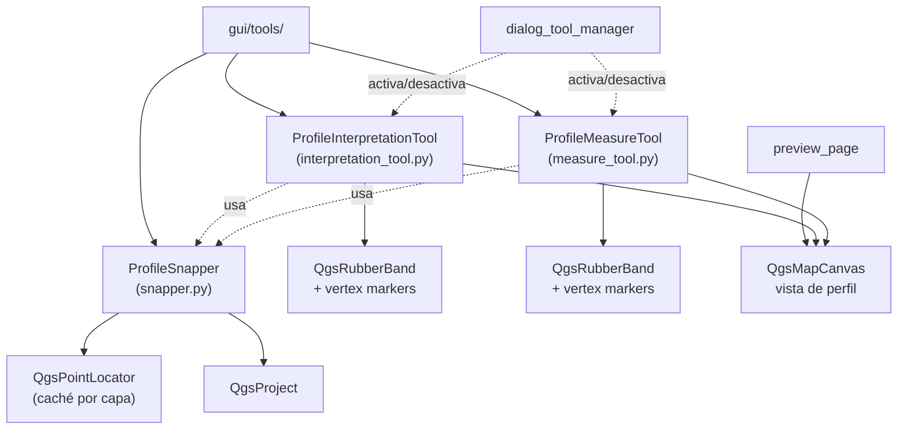

---
tags:
  - secinterp
  - code-walkthrough
  - gui
  - tools
aliases:
  - gui/tools/
  - ProfileInterpretationTool
  - ProfileMeasureTool
  - ProfileSnapper
cssclass: secinterp-note
---

# `gui/tools/` — Herramientas de mapa de la vista de perfil

> [!abstract] Resumen en una línea
> Package `gui/tools/` (4 files): herramientas interactivas `QgsMapTool` de la vista de perfil — dibujo de polígonos de interpretación, medición de distancias y el ayudante compartido de snapping — sin lógica geológica, solo interacción con el canvas.

**Ruta**: `gui/tools/` (4 archivos, ~714 líneas)
**Clases principales**: `ProfileInterpretationTool`, `ProfileMeasureTool`, `ProfileSnapper`
**Capa**: GUI (QGIS · herramientas de mapa)
**Tags**: #secinterp #gui #tools

---

## 🎯 ¿Por qué existe este paquete?

La vista previa del perfil necesita interacción directa sobre el canvas: dibujar
interpretaciones y medir distancias sobre la sección proyectada. Estas herramientas
encapsulan los eventos del canvas para que el diálogo no gestione píxeles:

| Problema | Solución |
|----------|----------|
| Dibujar polígonos de interpretación sobre el perfil | `ProfileInterpretationTool` con rubber band y marcadores de vértice |
| Medir distancia, desnivel y pendiente sobre la sección | `ProfileMeasureTool` con finalización explícita de la medición |
| Ambas herramientas necesitan "imán" a vértices de capas | `ProfileSnapper` compartido, con caché de `QgsPointLocator` por capa |
| Activar/desactivar herramientas sin fugas de señales | Protocolo `activate` / `deactivate` / `disconnect_signals` en cada tool |

> [!important] Nota arquitectónica
> Paquete GUI puro: importa `qgis.core` y `qgis.gui` libremente (está permitido fuera
> de `/core`). No calcula geología; solo captura geometría que luego consumen los
> managers del diálogo. El ciclo de vida lo orquesta [[dialog_tool_manager]].

---

## 🧬 Diagrama de relaciones



> [!tip] Cómo leer
> Flecha sólida = importa/delega; punteada = usainyecta o gestiona el ciclo de vida.
> `ProfileSnapper` es el único acoplamiento entre ambas herramientas.

---

## 📦 Imports — lectura arquitectónica

```python
# gui/tools/__init__.py (completo, 3 líneas)
from __future__ import annotations

"""Map tools for user interaction and data measurement."""
```

```python
# gui/tools/interpretation_tool.py (cabecera)
import contextlib
import datetime
import random
import uuid
from qgis.core import QgsPointXY, QgsWkbTypes
from qgis.gui import QgsMapCanvas, ...

# gui/tools/measure_tool.py (cabecera)
import contextlib
from qgis.core import QgsPointXY, QgsWkbTypes
from qgis.gui import QgsMapCanvas, QgsMapToolEmitPoint, QgsMapToolPan, ...

# gui/tools/snapper.py (cabecera)
from qgis.core import QgsMapLayer, QgsPointLocator, QgsPointXY, QgsProject, QgsVectorLayer
from qgis.gui import QgsMapCanvas
from qgis.PyQt.QtCore import QPoint
```

| # | Observación |
|---|-------------|
| ① | `__init__.py` solo declara docstring: el paquete es **namespace**, sin re-exports. |
| ② | `QgsWkbTypes` en ambas tools: discriminan geometría de punto/línea/polígono del clic. |
| ③ | `QgsMapToolEmitPoint` / `QgsMapToolPan` (solo medida): la herramienta extiende el contrato de emisión de puntos de QGIS. |
| ④ | `snapper.py` importa `QgsProject` + `QgsPointLocator`: resuelve capas y construye localizadores cacheados. |
| ⑤ | `contextlib` en ambas tools: `suppress` al desconectar señales ya desconectadas. |
| ⑥ | `datetime` + `uuid` + `random` (solo interpretación): identifican cada polígono dibujado. |

> [!note] Sin imports de `core`
> Ningún módulo importa `sec_interp.core`: las tools no validan ni computan, solo
> capturan puntos del canvas. La frontera Extract-then-Compute empieza aguas arriba.

---

## 🏗️ Inventario de estructura

**Clases:**

- `class ProfileInterpretationTool` — dibujo de polígonos de interpretación (269 líneas)
- `class ProfileMeasureTool` — medición de distancia/desnivel/pendiente (330 líneas)
- `class ProfileSnapper` — snapping compartido con caché de localizadores (112 líneas)

**Funciones de módulo:**

- `_points_to_xy(...)` — (`measure_tool.py`) conversión de puntos a `QgsPointXY`

**Métodos (contrato común de ciclo de vida):**

- `activate()`, `deactivate()`, `disconnect_signals()`, `reset()` — presentes en ambas tools
- Handlers de canvas: `canvasReleaseEvent`, `canvasMoveEvent`, `canvasDoubleClickEvent`, `keyPressEvent`

---

## 📁 Archivos del paquete

| Archivo | Líneas | Rol |
|---|--:|---|
| `__init__.py` | 3 | Docstring del paquete; sin re-exports |
| [[#ProfileInterpretationTool\|interpretation_tool.py]] | 269 | Dibujo de polígonos de interpretación sobre el perfil |
| [[#ProfileMeasureTool\|measure_tool.py]] | 330 | Medición de distancia, desnivel y pendiente |
| [[#ProfileSnapper\|snapper.py]] | 112 | Snapping compartido con caché de `QgsPointLocator` |

---

## 📖 Recorrido clase por clase

### ProfileInterpretationTool

```python
class ProfileInterpretationTool(...):
    def __init__(self, ...): ...
    def activate(self): ...
    def deactivate(self): ...
    def disconnect_signals(self): ...
    def reset(self): ...
    def canvasReleaseEvent(self, event): ...
    def canvasMoveEvent(self, event): ...
    def canvasDoubleClickEvent(self, event): ...
    def keyPressEvent(self, event): ...
    def _add_point(self, point): ...
    def _remove_last_point(self): ...
    def _add_vertex_marker(self, point): ...
    def _ensure_rubber_band(self): ...
    def _update_rubber_band(self): ...
```

Herramienta de dibujo de polígonos de interpretación sobre la vista de perfil.
Cada clic añade un vértice (`_add_point` + `_add_vertex_marker`); el doble clic
cierra el polígono y la tecla de retroceso elimina el último vértice
(`_remove_last_point`). `_ensure_rubber_band` crea la banda elástica bajo demanda y
`_update_rubber_band` la refresca en cada movimiento del ratón (`canvasMoveEvent`).

> [!tip] Identidad de cada polígono
> Los imports `datetime` + `uuid` (+ `random`) generan identificador y marca temporal
> por polígono, de modo que la interpretación dibujada puede persistirse y heredarse
> (ver [[interpretation_page]] y [[dialog_interpretation_manager]]).

| Método | Disparador | Efecto |
|--------|------------|--------|
| `canvasReleaseEvent` | clic | Añade vértice (con snapping vía `ProfileSnapper`) |
| `canvasMoveEvent` | movimiento | Previsualiza la banda elástica |
| `canvasDoubleClickEvent` | doble clic | Cierra el polígono y emite el resultado |
| `keyPressEvent` | teclado | Deshace vértice o cancela el dibujo |
| `reset` | manager | Limpia vértices, banda y marcadores |

### ProfileMeasureTool

```python
def _points_to_xy(points) -> list[QgsPointXY]: ...

class ProfileMeasureTool(QgsMapToolEmitPoint):
    def __init__(self, ...): ...
    def activate(self): ...
    def deactivate(self): ...
    def disconnect_signals(self): ...
    def cleanup_finalized(self): ...
    def reset(self): ...
    def canvasReleaseEvent(self, event): ...
    def canvasMoveEvent(self, event): ...
    def keyPressEvent(self, event): ...
    def _add_point(self, point): ...
    def finalize_measurement(self): ...
    def _add_vertex_marker(self, point): ...
    def _ensure_rubber_band(self): ...
```

Herramienta de medición sobre el perfil: acumula puntos y, al finalizar
(`finalize_measurement`), reporta distancia, diferencia de elevación y pendiente.
Hereda de `QgsMapToolEmitPoint` (contrato de emisión de puntos) y conoce
`QgsMapToolPan` para convivir con el paneo. `cleanup_finalized` retira la medición
consolidada sin tocar la edición en curso; `reset` lo limpia todo.

| Método | Rol |
|--------|-----|
| `_points_to_xy` | Normaliza puntos heterogéneos a `list[QgsPointXY]` |
| `finalize_measurement` | Consolida la medición y calcula distancia/desnivel/pendiente |
| `cleanup_finalized` | Retira solo la medición consolidada |
| `reset` | Limpia medición en curso + consolidada + marcadores |

> [!note] Medición vs interpretación
> Ambas tools comparten el esqueleto (rubber band, marcadores, snapping, ciclo de
> vida) pero difieren en el cierre: la interpretación produce un **polígono**
> persistible; la medición produce un **reporte efímero** de distancia/desnivel.

### ProfileSnapper

```python
class ProfileSnapper:
    def __init__(self, canvas): ...
    def snap(self, point: QPoint) -> QgsPointXY: ...
    def _find_best_match_in_locator(self, locator, point): ...
    def _cleanup_locators(self): ...
    def _is_snappable(self, layer) -> bool: ...
    def _get_locator(self, layer) -> QgsPointLocator: ...
```

Ayudante compartido de snapping: dada una posición de pantalla (`QPoint`), devuelve
el `QgsPointXY` "imantado" al vértice más cercano de las capas visibles.
`_get_locator` construye (y cachea) un `QgsPointLocator` por capa; `_is_snappable`
filtra capas no vectoriales o no aptas; `_cleanup_locators` libera la caché cuando
cambian las capas; `_find_best_match_in_locator` elige el mejor candidato dentro de
un localizador.

| Método | Rol |
|--------|-----|
| `snap` | Punto de entrada: pantalla → punto imantado |
| `_get_locator` | Localizador cacheado por capa |
| `_is_snappable` | Filtro de capas aptas para snapping |
| `_find_best_match_in_locator` | Mejor candidato dentro de un localizador |
| `_cleanup_locators` | Invalida la caché ante cambios de capas |

> [!important] La caché de localizadores es el detalle de rendimiento
> Construir un `QgsPointLocator` por cada movimiento de ratón sería prohibitivo;
> cachearlo por capa (`_get_locator`) y limpiarlo ante cambios (`_cleanup_locators`)
> mantiene el snapping fluido durante `canvasMoveEvent`.

---

## 🔄 Flujo de datos

| Fase | Entrada | Transformación | Salida |
|------|---------|----------------|--------|
| Activación | `dialog_tool_manager` activa la tool | `activate()` registra la tool en el canvas | Tool receptiva a eventos |
| Captura | Evento de canvas (`QMouseEvent`) | `canvasReleaseEvent` + `snap()` | `QgsPointXY` (imantado) |
| Previsualización | Movimiento del ratón | `_update_rubber_band` | Banda elástica + marcadores |
| Cierre (interpretación) | Doble clic | Construcción del polígono + `uuid` | Polígono persistible |
| Cierre (medición) | `finalize_measurement` | Cálculo distancia/desnivel/pendiente | Reporte de medida |
| Desactivación | Cambio de modo | `deactivate()` + `disconnect_signals()` | Canvas limpio, sin señales colgadas |

---

## 🏛️ Patrones de diseño presentes

| Patrón | Dónde | Propósito |
|--------|-------|-----------|
| **Strategy (MapTool)** | Ambas tools sobre `QgsMapTool` | Intercambiar comportamiento del canvas sin tocar el diálogo |
| **Helper compartido** | `ProfileSnapper` | Un solo motor de snapping para N herramientas |
| **Lazy init** | `_ensure_rubber_band`, `_get_locator` | Crear objetos caros solo cuando se necesitan |
| **Cache-aside** | Caché de `QgsPointLocator` | Evitar reconstruir localizadores por evento |
| **Defensive disconnect** | `disconnect_signals` + `contextlib.suppress` | Desconectar sin fallar si ya estaba desconectado |

---

## 🧾 Resumen de la API

| Símbolo | Firma / Hereda | Uso típico |
|---------|----------------|------------|
| `ProfileInterpretationTool` | `QgsMapTool` (dibujo) | `tool = ProfileInterpretationTool(canvas)`; activar desde el manager |
| `ProfileMeasureTool` | `QgsMapToolEmitPoint` | Medir sobre el perfil; `finalize_measurement()` consolida |
| `ProfileSnapper` | `(canvas)` | `snapper.snap(qpoint) -> QgsPointXY` |
| `_points_to_xy` | `(points) -> list[QgsPointXY]` | Normalizar puntos antes de medir |
| `activate` / `deactivate` | `() -> None` | Ciclo de vida gestionado por [[dialog_tool_manager]] |
| `disconnect_signals` | `() -> None` | Limpieza anti-fugas al cambiar de modo |

---

## 🛡️ Manejo de errores

Las tools son interactivas: el error típico es un evento sin geometría válida o una
capa que desaparece a mitad del dibujo.

- **Desconexión defensiva**: `disconnect_signals` usa `contextlib.suppress` para no
  elevar si la señal ya estaba desconectada (doble desactivación segura).
- **`_is_snappable` como guarda**: filtra capas no vectoriales antes de pedir un
  localizador, evitando `None` inesperados en `snap()`.
- **Sin excepciones de dominio**: no lanzan `SecInterpError`; ante un punto inválido
  simplemente ignoran el evento y mantienen el estado anterior.

---

## 🧪 Tests asociados

Cobertura real bajo `tests/gui/` (ver con `ls tests/gui`):

- `tests/gui/test_interpretation_tool.py` — ciclo de vida y dibujo de
  `ProfileInterpretationTool` (activar, añadir vértices, cerrar polígono, reset).
- `tests/gui/test_measure_tool.py` — `ProfileMeasureTool` (acumulación de puntos,
  `finalize_measurement`, `cleanup_finalized`, `reset`).
- `tests/gui/test_main_dialog_tools.py` — cableado del `dialog_tool_manager` que
  activa/desactiva estas tools desde el diálogo principal.

```bash
PYTHONPATH=.. uv run python3 -m unittest tests.gui.test_interpretation_tool -v
PYTHONPATH=.. uv run python3 -m unittest tests.gui.test_measure_tool -v
```

> [!tip] Mock-first
> Los tests inyectan canvas y capas simuladas (`tests/base_test.py`): verifican el
> protocolo de eventos sin necesidad de un QGIS real con ventana abierta.

---

## 🧩 Propiedad y ciclo de vida

Ninguna tool se auto-gestiona: el propietario es el `dialog_tool_manager`, que las
crea una vez y las alterna según el modo activo (dibujar, medir, paneo).

| Momento | Quién | Qué hace |
|---------|-------|----------|
| Apertura del diálogo | `dialog_tool_manager` | Instancia `ProfileSnapper(canvas)` + ambas tools |
| Clic en "interpretar" | manager | `measure.deactivate()` → `interpret.activate()` |
| Clic en "medir" | manager | `interpret.deactivate()` → `measure.activate()` |
| Cierre del diálogo | manager | `disconnect_signals()` en cada tool + `reset()` |
| Cambio de capas | canvas / proyecto | `snapper._cleanup_locators()` invalida la caché |

> [!warning] Una sola tool activa cada vez
> El canvas de QGIS admite un único `QgsMapTool` activo. Activar la segunda sin
> desactivar la primera deja eventos huérfanos: por eso el manager siempre desactiva
> antes de activar, y `disconnect_signals` es idempotente por diseño.

---

## 🌐 i18n y mensajes al usuario

- Las tools apenas muestran texto propio (el reporte de medida se presenta desde el
  manager/diálogo), por lo que no definen `tr()` local: la traducibilidad vive en
  las páginas (`self.tr()`) y no en la captura de puntos.
- Cualquier etiqueta futura debe pasar por `QCoreApplication.translate` siguiendo el
  patrón de [[collar_tab]] / [[advanced_tab]].

---

## 👀 Observaciones y notas

> [!success] Fortalezas
> - Contrato de ciclo de vida uniforme (`activate`/`deactivate`/`disconnect_signals`/`reset`).
> - `ProfileSnapper` evita duplicar la lógica de imán en cada herramienta.
> - Caché de localizadores con invalidación explícita: snapping fluido.

> [!warning] Puntos de atención
> - `__init__.py` no re-exporta nada: los consumidores importan el submódulo
>   (`from sec_interp.gui.tools.measure_tool import ...`); documentado, pero frágil si crece.
> - Esqueleto duplicado entre ambas tools (rubber band, marcadores, ciclo de vida):
>   candidato a una base común si aparece una tercera herramienta.

> [!question] Preguntas abiertas
> - ¿Extraer una `ProfileBaseTool` con rubber band + marcadores + snapping compartidos?
> - ¿Re-exportar las tres clases en `__init__.py` para un punto de entrada estable?

---

## 🔗 Notas relacionadas

- [[Index]] — índice de la bóveda
- [[interpretation_tool]] — nota individual de `ProfileInterpretationTool`
- [[measure_tool]] — nota individual de `ProfileMeasureTool`
- [[snapper]] — nota individual de `ProfileSnapper`
- [[dialog_tool_manager]] — orquesta la activación/desactivación de estas tools
- [[main_dialog]] — diálogo que aloja la vista de perfil
- [[preview_page]] — página que contiene el canvas del perfil
- [[gui]] — nota del paquete padre `gui/`

---

*Nota de la bóveda SecInterp Code Walkthrough v2 — v3.8.0*
