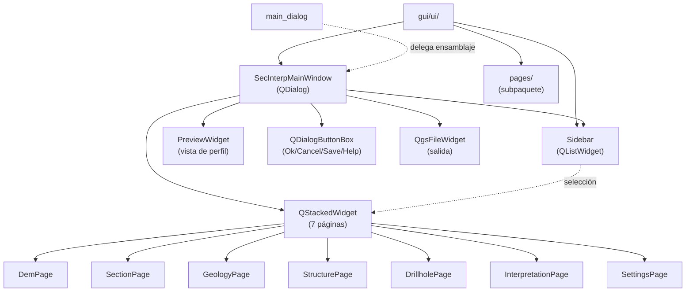

---
tags:
  - secinterp
  - code-walkthrough
  - gui
  - ui
aliases:
  - gui/ui/
  - SecInterpMainWindow
  - Sidebar
cssclass: secinterp-note
---

# `gui/ui/` — Ventana principal y navegación lateral

> [!abstract] Resumen en una línea
> Package `gui/ui/` (3 files + subpaquete `pages/`): ensamblaje programático de la ventana principal — `SecInterpMainWindow` (diálogo con `QSplitter` + `QStackedWidget`) y `Sidebar` (navegación por lista) — sobre las páginas de `pages/`.

**Ruta**: `gui/ui/` (3 archivos, ~228 líneas + subpaquete `pages/`)
**Clases principales**: `SecInterpMainWindow`, `Sidebar`
**Capa**: GUI (QGIS · Qt programático, sin `.ui` compilados)
**Tags**: #secinterp #gui #ui

---

## 🎯 ¿Por qué existe este paquete?

El plugin construye su interfaz por código (sin Qt Designer): este paquete es el
"cascarón" que aloja las páginas de configuración y la vista previa del perfil.

| Problema | Solución |
|----------|----------|
| Siete páginas de configuración deben convivir en un diálogo | `SecInterpMainWindow`: `QSplitter` [sidebar \| páginas \| preview] + `QStackedWidget` |
| Navegar entre páginas sin pestañas superiores | `Sidebar`: `QListWidget` con iconos de 32px y ancho fijo de 140px |
| El módulo debe leerse como namespace | `__init__.py` de 7 líneas con docstring (sin re-exports) |
| Las páginas viven en un subpaquete con protocolo propio | `pages/` + `BasePage` documentados en [[gui_ui_pages]] |

> [!important] Nota arquitectónica
> UI 100 % programática: `QDialog` + layouts + `QSplitter` + `QStackedWidget`, sin
> archivos `.ui`. El patrón es **Shell + páginas**: este paquete es el shell, cada
> `BasePage` es un contenido intercambiable (ver [[base_page]]).

---

## 🧬 Diagrama de relaciones



> [!tip] Cómo leer
> Flecha sólida = importa/instancia; punteada = selecciona o delega. El `Sidebar`
> no conoce las páginas: solo emite la fila seleccionada y la ventana conmuta el stack.

---

## 📦 Imports — lectura arquitectónica

```python
# gui/ui/__init__.py (completo, 7 líneas)
from __future__ import annotations

"""
UI module for SecInterp plugin.

Contains compiled UI files.
"""
```

```python
# gui/ui/main_window.py (cabecera)
import contextlib
from typing import Any
from qgis.gui import QgsFileWidget
from qgis.PyQt.QtCore import Qt
from qgis.PyQt.QtWidgets import (
    QDialog, QDialogButtonBox, QHBoxLayout, QLabel,
    QSplitter, QStackedWidget, QVBoxLayout, QWidget,
)
from .pages.dem_page import DemPage
from .pages.drillhole_page import DrillholePage
from .pages.geology_page import GeologyPage
from .pages.interpretation_page import InterpretationPage
from .pages.preview_page import PreviewWidget
from .pages.section_page import SectionPage
from .pages.settings_page import SettingsPage
from .pages.structure_page import StructurePage
from .sidebar import Sidebar

# gui/ui/sidebar.py (cabecera)
from qgis.core import QgsApplication
from qgis.PyQt.QtCore import QSize, Qt
from qgis.PyQt.QtWidgets import QListWidget, QListWidgetItem
```

| # | Observación |
|---|-------------|
| ① | El docstring del `__init__` menciona "compiled UI files" pero la UI es programática: resto histórico, la fuente manda. |
| ② | `main_window.py` importa las **8 páginas/widgets** por nombre: acoplamiento de ensamblaje, inevitable en un shell. |
| ③ | `QSplitter` horizontal + `QStackedWidget`: layout re-dimensionable con páginas conmutables. |
| ④ | `QgsFileWidget` (selector de salida) y `PreviewWidget` viven en el shell, no en una página. |
| ⑤ | `sidebar.py` importa `QgsApplication` (iconos del tema QGIS) — `QListWidget` puro, sin páginas. |
| ⑥ | `contextlib` en la ventana: desconexión defensiva de señales al cerrar. |

---

## 🏗️ Inventario de estructura

**Clases:**

- `class SecInterpMainWindow(QDialog)` — ventana principal programática (158 líneas)
- `class Sidebar(QListWidget)` — navegación lateral por iconos (63 líneas)

**Métodos de `SecInterpMainWindow`:**

- `__init__(iface=None, parent=None)` — título `self.tr("Sec Interp")`, tamaño 1200×700
- `_setup_ui()` — splitter, stack, preview, file widget, button box
- `_connect_signals()` / `disconnect_signals()` — cableado y limpieza

**Métodos de `Sidebar`:**

- `__init__(parent=None)` — iconos de 32px, ancho fijo 140px
- `add_item(...)` — alta de entradas de navegación

---

## 📁 Archivos del paquete

| Archivo | Líneas | Rol |
|---|--:|---|
| `__init__.py` | 7 | Docstring del paquete; sin re-exports |
| [[#SecInterpMainWindow\|main_window.py]] | 158 | Diálogo principal: splitter + stack de 7 páginas + preview |
| [[#Sidebar\|sidebar.py]] | 63 | Navegación lateral (`QListWidget` con iconos) |
| [[#Subpaquete-pages\|pages/]] | — | Subpaquete de páginas (ver [[gui_ui_pages]]) |

---

## 📖 Recorrido clase por clase

### SecInterpMainWindow

```python
class SecInterpMainWindow(QDialog):
    def __init__(self, iface: Any | None = None, parent: QWidget | None = None) -> None:
        super().__init__(parent)
        self.setWindowTitle(self.tr("Sec Interp"))
        self.resize(1200, 700)
        self.sidebar = Sidebar()
        self.stacked_widget = QStackedWidget()
        self.preview_widget = PreviewWidget()
        self.output_widget = QgsFileWidget()
        flags = QDialogButtonBox.StandardButton.Ok | QDialogButtonBox.StandardButton.Cancel
        flags |= QDialogButtonBox.StandardButton.Save | QDialogButtonBox.StandardButton.Help
        self.button_box = QDialogButtonBox(flags)
        self.page_dem = DemPage(iface)
        ...
        self._setup_ui()
        self._connect_signals()
```

El diálogo crea **todos** sus componentes en `__init__` (sidebar, stack, preview,
selector de salida, botonera Ok/Cancel/Save/Help y las 7 páginas) y luego ensambla
(`_setup_ui`) y cablea (`_connect_signals`). Solo `DemPage` recibe `iface`; el resto
de páginas se construyen sin dependencias QGIS directas en su constructor.

| Atributo | Widget | Rol |
|----------|--------|-----|
| `sidebar` | `Sidebar` | Navegación entre páginas |
| `stacked_widget` | `QStackedWidget` | Contenedor conmutable de las 7 páginas |
| `preview_widget` | `PreviewWidget` | Vista previa del perfil (tercer panel) |
| `output_widget` | `QgsFileWidget` | Selector de ruta de salida |
| `button_box` | `QDialogButtonBox` | Ok / Cancel / Save / Help |
| `page_dem` … `page_settings` | `BasePage` | Una instancia por página de configuración |

> [!tip] Tres paneles, un splitter
> `_setup_ui` monta `QSplitter(Qt.Orientation.Horizontal)` con
> `[Sidebar | páginas | Preview]`, handle de 6px e hijos colapsables: el usuario
> redimensiona cada zona sin diálogos modales adicionales.

### Sidebar

```python
class Sidebar(QListWidget):
    def __init__(self, parent: Any = None) -> None:
        super().__init__(parent)
        self.setIconSize(QSize(32, 32))
        self.setFixedWidth(140)

    def add_item(self, ...): ...
```

Lista de navegación mínima: hereda `QListWidget`, fija iconos de 32×32 y ancho de
140px para que el texto quepa, y expone `add_item` para registrar entradas (icono
del tema vía `QgsApplication` + etiqueta traducible). No importa ninguna página:
la ventana conecta la señal de selección con el índice del `QStackedWidget`.

| Decisión | Valor | Motivo |
|----------|-------|--------|
| Iconos | 32×32 | Legibilidad en pantallas HiDPI sin robar ancho |
| Ancho fijo | 140px | Texto de 7 entradas sin elipsis |
| Sin referencia a páginas | — | Desacoplamiento shell ↔ contenido |

### Subpaquete pages

```python
# gui/ui/pages/ — contenido intercambiable del shell
from .settings_page import SettingsPage  # (en __init__.py)

__all__ = ["BasePage", "SettingsPage"]
```

El subpaquete `pages/` aporta las 7 páginas (`DemPage`, `SectionPage`,
`GeologyPage`, `StructurePage`, `DrillholePage`, `InterpretationPage`,
`SettingsPage`) más `PreviewWidget`, todas bajo el protocolo `BasePage`
(`get_data` / `dump` / `load` / `reset` / `validate` / señales). Detalle honesto:
`__all__` anuncia `BasePage` pero el `__init__` solo importa `SettingsPage`, de
modo que `BasePage` **no** queda re-exportado en la práctica.

> [!note] El registro real de páginas está en la ventana
> No hay factoría ni auto-descubrimiento: `SecInterpMainWindow.__init__` instancia
> cada página explícitamente. Añadir una página = importarla + instanciarla +
> apilarla + añadir su entrada al `Sidebar`.

---

## 🔄 Flujo de datos

| Fase | Entrada | Transformación | Salida |
|------|---------|----------------|--------|
| Construcción | `iface` (solo `DemPage`) | Instancia de las 7 páginas + shell | Diálogo 1200×700 sin mostrar |
| Ensamblaje | Componentes sueltos | `_setup_ui`: splitter + stack + preview | Tres paneles re-dimensionables |
| Navegación | Clic en `Sidebar` | Índice → `stacked_widget.setCurrentIndex` | Página visible conmutada |
| Recogida | Usuario pulsa Ok/Save | `page.get_data()` por página | Dicts agregados hacia el core |
| Cierre | Cancel / cierre | `disconnect_signals()` defensivo | Sin señales colgadas ni fugas |

---

## 🏛️ Patrones de diseño presentes

| Patrón | Dónde | Propósito |
|--------|-------|-----------|
| **Shell + páginas** | Ventana vs `pages/` | El cascarón no sabe de geología; las páginas no saben de navegación |
| **Stacked navigation** | `QStackedWidget` + `Sidebar` | N páginas, una visible, conmutación por índice |
| **Programmatic UI** | Todo el paquete | Sin `.ui`: layouts y widgets creados por código |
| **Defensive disconnect** | `disconnect_signals` + `contextlib` | Cierre limpio aunque falten conexiones |
| **Facade parcial** | Botonera Ok/Cancel/Save/Help | Un solo punto de decisión para el flujo del diálogo |

---

## 🧾 Resumen de la API

| Símbolo | Firma / Hereda | Uso típico |
|---------|----------------|------------|
| `SecInterpMainWindow` | `QDialog` | `win = SecInterpMainWindow(iface)`; `win.exec()` |
| `Sidebar` | `QListWidget` | `sidebar.add_item(icon, label)` por página |
| `_setup_ui` | `() -> None` | Ensambla splitter + stack + preview (interno) |
| `_connect_signals` | `() -> None` | Sidebar→stack, botonera→aceptar/cancelar |
| `disconnect_signals` | `() -> None` | Limpieza al cerrar |
| `pages/` | subpaquete | Contenido del stack (ver [[gui_ui_pages]]) |

---

## 🛡️ Manejo de errores

- **Construcción total en `__init__`**: si una página falla al crearse, el diálogo no
  llega a mostrarse; el error sube al `main_dialog`/punto de entrada, que lo registra.
- **Desconexión defensiva**: `disconnect_signals` tolera señales ya desconectadas
  (doble cierre seguro).
- **Sin validación aquí**: `validate()` vive en cada `BasePage`; el shell solo agrega
  resultados (ver [[base_page]] y [[main_dialog]]).

---

## 🔍 Mapa de páginas apiladas

Contenido del `QStackedWidget`, en orden de instanciación en `__init__`:

| Página | Módulo | Nota | Responsabilidad |
|--------|--------|------|-----------------|
| DEM | `pages/dem_page.py` | [[dem_page]] | Ráster de elevación y capa base |
| Section | `pages/section_page.py` | [[section_page]] | Línea de sección y parámetros del corte |
| Geology | `pages/geology_page.py` | [[geology_page]] | Capas y campos geológicos |
| Structure | `pages/structure_page.py` | [[structure_page]] | Mediciones estructurales |
| Drillhole | `pages/drillhole_page.py` | [[drillhole_page]] | Sondajes (coordina 3 tabs) |
| Interpretation | `pages/interpretation_page.py` | [[interpretation_page]] | Polígonos dibujados en el perfil |
| Settings | `pages/settings_page.py` | [[settings_page]] | Exportación, 3D e información |
| Preview (fijo) | `pages/preview_page.py` | [[preview_page]] | Vista del perfil (fuera del stack) |

> [!note] El preview no rota
> `PreviewWidget` vive en el tercer panel del splitter, siempre visible: cambiar de
> página nunca oculta la sección. Solo las 7 páginas de configuración rotan.

---

## 🧩 Añadir una página al shell (guía)

Alta de una octava página, paso a paso, sin tocar las existentes:

| Paso | Archivo | Acción |
|------|---------|--------|
| 1 | `gui/ui/pages/my_page.py` | Crear `MyPage(BasePage)` con `get_data` + `_setup_ui` (ver [[base_page]]) |
| 2 | `gui/ui/main_window.py` (imports) | `from .pages.my_page import MyPage` |
| 3 | `SecInterpMainWindow.__init__` | `self.page_my = MyPage()` junto al resto |
| 4 | `_setup_ui` | `stacked_widget.addWidget(self.page_my)` |
| 5 | `Sidebar` | `add_item(icono, self.tr("Mi página"))` en la posición deseada |
| 6 | `_connect_signals` | Conectar `dataChanged` si la página la emite |

> [!tip] Orden Sidebar ↔ stack
> La fila N del `Sidebar` debe corresponder al índice N del `QStackedWidget`:
> el cableado es posicional, no por nombre. Insertar en medio exige mover ambos.

---

## 🧪 Tests asociados

No hay test unitario dedicado a `SecInterpMainWindow` o `Sidebar` (son cascarones
Qt finos); la cobertura llega por vía indirecta desde `tests/gui/`:

- `tests/gui/test_main_dialog_core.py` — construcción y ciclo básico del diálogo
  principal que aloja esta ventana.
- `tests/gui/test_dem_page.py` / `test_drillhole_page.py` / `test_settings_page.py`
  — páginas que el stack instancia (si una página rompe su constructor, la ventana cae).
- `tests/gui/test_main_dialog_tools.py` — cableado de herramientas sobre la ventana.

```bash
PYTHONPATH=.. uv run python3 -m unittest tests.gui.test_main_dialog_core -v
PYTHONPATH=.. uv run python3 -m unittest tests.gui.test_settings_page -v
```

> [!tip] Por qué no se testea el splitter
> Geometría de layouts e iconos se verifican por inspección; los tests cubren lo
> frágil (construcción de páginas y cableado), no lo declarativo.

---

## 🌐 i18n y mensajes al usuario

- Título vía `self.tr("Sec Interp")`: traducible por `QCoreApplication.translate`
  con el contexto de la clase.
- Las etiquetas del `Sidebar` y de cada página pasan por `self.tr()` en su módulo;
  el shell no re-etiqueta (ver [[base_page]] para el protocolo `tr`).
- Ancho fijo de 140px: margen para que las traducciones largas no queden con elipsis
  en la mayoría de idiomas (revisar en `/i18n-maintenance` si una locale desborda).

---

## 👀 Observaciones y notas

> [!success] Fortalezas
> - Shell mínimo y predecible: ensamblar, cablear, limpiar.
> - `Sidebar` desacoplado de las páginas (solo índices).
> - UI programática: sin `.ui` que compilar ni desincronizar.

> [!warning] Puntos de atención
> - `__init__.py` dice "compiled UI files" cuando la UI es programática: docstring desactualizado.
> - `__all__` de `pages/` anuncia `BasePage` sin importarlo: re-export roto en la práctica.
> - Solo `DemPage` recibe `iface`: asimetría a documentar si otra página lo necesita.

> [!question] Preguntas abiertas
> - ¿Registrar páginas en una lista declarativa (clase + etiqueta + icono) en vez de 7 bloques imperativos?
> - ¿Corregir el docstring del `__init__` y el `__all__` de `pages/`?

---

## 🔗 Notas relacionadas

- [[Index]] — índice de la bóveda
- [[main_window]] — nota individual de `SecInterpMainWindow`
- [[sidebar]] — nota individual de `Sidebar`
- [[gui_ui_pages]] — nota del subpaquete `pages/`
- [[base_page]] — protocolo `BasePage` de todas las páginas
- [[main_dialog]] — diálogo/managers que usan esta ventana
- [[dem_page]] / [[drillhole_page]] / [[settings_page]] — páginas apiladas
- [[gui]] — nota del paquete padre `gui/`

---

*Nota de la bóveda SecInterp Code Walkthrough v2 — v3.9.0*
