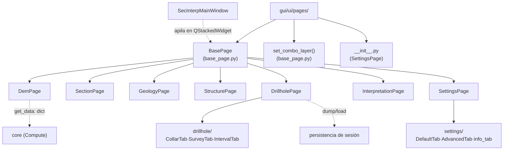

---
tags:
  - secinterp
  - code-walkthrough
  - gui
  - pages
aliases:
  - gui/ui/pages/
  - BasePage
  - SettingsPage
  - set_combo_layer
cssclass: secinterp-note
---

# `gui/ui/pages/` — Registro de páginas y protocolo `BasePage`

> [!abstract] Resumen en una línea
> Package `gui/ui/pages/` (10 files + subpaquetes `drillhole/` y `settings/`): registro-namespace de las páginas de configuración programáticas y hogar del protocolo compartido `BasePage` (`get_data` / `dump` / `load` / `reset` / `validate` + señales) que todas las páginas implementan.

**Ruta**: `gui/ui/pages/` (10 archivos, ~1346 líneas + 2 subpaquetes)
**Clases principales**: `BasePage`, `set_combo_layer`, `DemPage`, `DrillholePage`, `SettingsPage`
**Capa**: GUI (QGIS · Qt programático, patrón Extract en `get_data`)
**Tags**: #secinterp #gui #pages

---

## 🎯 ¿Por qué existe este paquete?

Cada pantalla de configuración del plugin (DEM, sección, geología, estructuras,
sondajes, interpretación, ajustes, preview) es una "página" intercambiable dentro
del `QStackedWidget` de [[main_window]]. El paquete resuelve dos necesidades:

| Problema | Solución |
|----------|----------|
| Nueve páginas deben exponer el mismo contrato al diálogo | `BasePage(QWidget)` con `get_data`/`dump`/`load`/`reset`/`validate`/señales |
| Fijar un combo de capa sin disparar sus señales | `set_combo_layer()` (bloquea señales durante `setLayer`) |
| Reunir las páginas bajo un namespace importable | `__init__.py` con `SettingsPage` y `__all__` declarado |
| Formularios complejos (sondajes, ajustes) con sub-tabs | Subpaquetes `drillhole/` y `settings/` con coordinadores finos |

> [!important] Nota arquitectónica
> Este paquete es el lado **Extract** del patrón Extract-then-Compute: cada
> `get_data()` convierte widgets QGIS en dicts de primitivos que el core consume
> sin tocar Qt. `dump`/`load` sostienen la persistencia de sesión.

---

## 🧬 Diagrama de relaciones



> [!tip] Cómo leer
> Flecha sólida = hereda/importa; punteada = consume el protocolo (`get_data`,
> persistencia) o apila en la ventana. `PreviewWidget` también vive aquí aunque no
> rote en el stack (panel fijo del splitter).

---

## 📦 Imports — lectura arquitectónica

```python
# gui/ui/pages/__init__.py (completo, 7 líneas)
"""UI Configuration Pages."""

from __future__ import annotations

from .settings_page import SettingsPage

__all__ = ["BasePage", "SettingsPage"]
```

```python
# gui/ui/pages/base_page.py (cabecera)
"""Base class for configuration pages."""

from __future__ import annotations

from typing import Any

from qgis.PyQt.QtWidgets import QGroupBox, QVBoxLayout, QWidget
```

```python
# Cabeceras típicas de páginas (drillhole_page.py / settings_page.py)
import contextlib
from typing import Any
from qgis.PyQt.QtCore import QCoreApplication, pyqtSignal
from qgis.PyQt.QtWidgets import QTabWidget, QVBoxLayout, QWidget
from sec_interp.core.validation.project_validator import ProjectValidator, ValidationParams
from sec_interp.gui.adapters.validation_extractor import resolve_layer_metadata
from .base_page import BasePage
from .drillhole import CollarTab, IntervalTab, SurveyTab
```

| # | Observación |
|---|-------------|
| ① | `__init__.py` importa **solo** `SettingsPage` pero `__all__` anuncia también `BasePage`: re-export incompleto (ver observaciones). |
| ② | `base_page.py` solo depende de `QtWidgets` básicos: el protocolo no arrastra `qgis.core`. |
| ③ | Las páginas importan validadores del core (`ProjectValidator`) y adapters (`resolve_layer_metadata`): Extract con validación local. |
| ④ | `QCoreApplication` + `pyqtSignal` en cada página: `tr()` local e i18n por contexto de clase. |
| ⑤ | `contextlib`: desconexión defensiva de señales en `disconnect_signals`. |
| ⑥ | Los coordinadores (`DrillholePage`, `SettingsPage`) importan sus tabs del subpaquete, nunca al revés. |

---

## 🏗️ Inventario de estructura

**Símbolos de `base_page.py` (105 líneas):**

- `def set_combo_layer(combo, layer)` — fija capa sin emitir señales
- `class BasePage(QWidget)` — `__init__(title, parent)`, `_setup_ui`, `get_data` (abstracta),
  `dump`, `load`, `reset`, `validate`, `connect_signals`, `disconnect_signals`

**Páginas (una clase por módulo, todas heredan `BasePage` salvo `PreviewWidget`):**

- `DemPage` (271 líneas) — ráster de elevación y capa base
- `SectionPage` (117 líneas) — línea de sección y parámetros del corte
- `GeologyPage` (120 líneas) — capas y campos geológicos
- `StructurePage` (166 líneas) — mediciones estructurales
- `DrillholePage` (130 líneas) — coordina `CollarTab` + `SurveyTab` + `IntervalTab`
- `InterpretationPage` (230 líneas) — polígonos dibujados sobre el perfil
- `SettingsPage` (124 líneas) — coordina `DefaultTab` + `AdvancedTab` + `build_info_tab`
- `PreviewWidget` (`preview_page.py`, 262 líneas) — vista del perfil, panel fijo

---

## 📁 Archivos del paquete

| Archivo | Líneas | Rol |
|---|--:|---|
| `__init__.py` | 7 | Namespace; importa `SettingsPage` (ver nota sobre `__all__`) |
| [[#BasePage\|base_page.py]] | 105 | Protocolo `BasePage` + ayudante `set_combo_layer` |
| [[#DemPage\|dem_page.py]] | 271 | Página de DEM y capa de elevación |
| [[#SectionPage\|section_page.py]] | 117 | Página de línea de sección |
| [[#GeologyPage\|geology_page.py]] | 120 | Página de capas geológicas |
| [[#StructurePage\|structure_page.py]] | 166 | Página de estructuras |
| [[#DrillholePage\|drillhole_page.py]] | 130 | Coordinador fino de los 3 tabs de sondaje |
| [[#InterpretationPage\|interpretation_page.py]] | 230 | Página de interpretaciones dibujadas |
| [[#SettingsPage\|settings_page.py]] | 124 | Coordinador fino de los 3 tabs de ajustes |
| [[#PreviewWidget\|preview_page.py]] | 262 | Vista previa del perfil (panel fijo) |
| [[#Subpaquete-drillhole\|drillhole/]] | — | Tabs collar/survey/interval (ver [[gui_ui_pages_drillhole]]) |
| [[#Subpaquete-settings\|settings/]] | — | Tabs default/advanced/info (ver [[gui_ui_pages_settings]]) |

---

## 📖 Recorrido símbolo por símbolo

### BasePage

```python
class BasePage(QWidget):
    def __init__(self, title: str, parent: QWidget | None = None) -> None:
        super().__init__(parent)
        self.title = title
        self._setup_ui()

    def _setup_ui(self) -> None:
        self.main_layout = QVBoxLayout(self)
        self.main_layout.setContentsMargins(0, 0, 0, 0)
        self.group_box = QGroupBox(self.title)
        self.group_layout = None  # To be set by subclasses
        self.main_layout.addWidget(self.group_box)
        self.main_layout.addStretch()

    def get_data(self) -> dict[str, Any]:
        raise NotImplementedError("Subclasses must implement get_data()")

    def dump(self) -> dict[str, Any]: return {}
    def load(self, data: dict[str, Any]) -> None: pass
    def reset(self) -> None: pass
    def validate(self) -> tuple[bool, str]: return True, ""
    def connect_signals(self) -> None: pass
    def disconnect_signals(self) -> None: pass
```

El contrato que toda página cumple. `get_data` es el **único método abstracto
real** (eleva `NotImplementedError`); el resto ofrece defaults no-op para que una
página simple solo implemente lo que necesite. `_setup_ui` monta el esqueleto
común: layout sin márgenes + `QGroupBox` titulada + stretch inferior que empuja el
contenido hacia arriba. Las subclases rellenan `group_box` (o su layout) con sus
widgets.

| Miembro | Obligatorio | Rol en el protocolo |
|---------|-------------|---------------------|
| `get_data` | Sí | **Extract**: widgets → dict de primitivos para el core |
| `validate` | Recomendado | `(is_valid, error)`; default `True, ""` |
| `dump` / `load` | Si persiste | Estado serializable (capas como objetos ya resueltos) |
| `reset` | Si es configurable | Valores por defecto |
| `connect/disconnect_signals` | Si conecta | Cableado interno + limpieza anti-fugas |
| `group_box` | Estructural | Contenedor titulado común a todas las páginas |

### set_combo_layer

```python
def set_combo_layer(combo: Any, layer: Any) -> None:
    combo.blockSignals(True)
    combo.setLayer(layer)
    combo.blockSignals(False)
```

Fija una capa en un `QgsMapLayerComboBox` (o mock compatible) sin emitir señales
intermedias. Imprescindible en `load()` y `reset()`: restaurar estado no debe
disparar validaciones ni cascadas de `dataChanged`. Los tabs de sondaje
(`CollarTab`, `IntervalTab`, `SurveyTab`) la importan desde aquí.

> [!tip] Acepta `None`
> Pasar `layer=None` limpia la selección: el mismo camino sirve para "sin capa",
> evitando ramas especiales en los callers.

### DemPage

Página del modelo digital de elevación (271 líneas, la mayor del paquete): selector
de ráster DEM, capa de elevación y parámetros de muestreo. Su `get_data` entrega el
contexto topográfico que el core usa para proyectar la sección sobre el relieve.
Ver nota individual [[dem_page]].

### SectionPage

Página de la línea de sección (117 líneas): capa/identificador de la línea de
corte y parámetros geométricos (tolerancia, resolución). Define *dónde* se corta
el perfil que todo lo demás proyecta. Ver [[section_page]].

### GeologyPage

Página geológica (120 líneas): capa de geología y mapeo de campos (litología,
contactos). Su `get_data` alimenta `GeologyContext` del core. Ver [[geology_page]].

### StructurePage

Página estructural (166 líneas): capa de mediciones y campos de rumbo/buzamiento
para la proyección estereográfica sobre la sección. Ver [[structure_page]].

### DrillholePage

```python
class DrillholePage(BasePage):
    dataChanged = pyqtSignal()
    layer_keys = frozenset({"dh_collar_layer", "dh_survey_layer", "dh_interval_layer"})

    def _setup_ui(self): ...   # QTabWidget con CollarTab + SurveyTab + IntervalTab
    def get_data(self): ...    # fusiona los dicts de los 3 tabs
    def dump / load / reset: ...  # delegan a cada tab
    def is_complete(self): ... # ProjectValidator.is_drillhole_complete(params)
    def connect_signals / disconnect_signals: ...  # re-emite dataChanged
```

Coordinador fino: posee el `QTabWidget`, delega formularios a `drillhole/` y
fusiona resultados. `is_complete` construye `ValidationParams` (resolviendo capas
con `resolve_layer_metadata`) y delega en `ProjectValidator`. Los `layer_keys`
identifican sus capas ante el gestor de notificaciones. Ver [[drillhole_page]] y
[[gui_ui_pages_drillhole]].

### InterpretationPage

Página de interpretaciones (230 líneas): lista y gestiona los polígonos dibujados
con `ProfileInterpretationTool`, incluyendo herencia de atributos entre sesiones.
Ver [[interpretation_page]] y [[gui_tools]].

### SettingsPage

```python
class SettingsPage(BasePage):
    def _setup_ui(self): ...          # QTabWidget: DefaultTab + AdvancedTab + build_info_tab(self.tr)
    def _expose_tab_widgets(self): ...# alias chk_exp_*/chk_3d_* para compatibilidad
    def _load_settings(self): ...     # load_settings(self.settings, default_tab, advanced_tab)
    def _on_settings_changed(self): ...# save_settings(config_service, default_tab, advanced_tab)
    def get_data(self): ...           # fusiona default + advanced
```

Coordinador fino de ajustes: tres tabs (exportación, 3D, información) más
persistencia vía `settings_persistence.py`. `_expose_tab_widgets` re-expone los
checkboxes como atributos propios para no romper consumidores antiguos. Ver
[[settings_page]] y [[gui_ui_pages_settings]].

### PreviewWidget

Widget de vista previa del perfil (`preview_page.py`, 262 líneas): aloja el
`QgsMapCanvas` del perfil donde actúan las tools de [[gui_tools]] y donde se
renderiza el resultado. No rota en el stack: es el tercer panel fijo del splitter.
Ver [[preview_page]].

### Subpaquete drillhole

Tabs `CollarTab`, `SurveyTab`, `IntervalTab` (ver [[gui_ui_pages_drillhole]]):
formularios de collar (identificador, X/Y o geometría, profundidad), survey
(azimut, inclinación, profundidad) e intervalos (desde/hasta, litología). Cada tab
expone el mismo mini-protocolo (`get_data`/`dump`/`load`/`reset`/señales) que
`DrillholePage` agrega.

### Subpaquete settings

Tabs `DefaultTab`, `AdvancedTab` y función `build_info_tab` (ver
[[gui_ui_pages_settings]]): selección de exports, toggles 3D y pestaña informativa
de solo lectura construida con `read_plugin_metadata()`.

---

## 🔄 Flujo de datos

| Fase | Entrada | Transformación | Salida |
|------|---------|----------------|--------|
| Construcción | `__init__(title)` | `_setup_ui` monta `group_box` | Página vacía titulada |
| Edición | Interacción del usuario | Widgets + señales (`dataChanged`/`changed`) | Estado interno Qt |
| Extract | `get_data()` | Widgets → primitivos (`resolve_layer_metadata` para capas) | `dict` hacia core/managers |
| Validación | `validate()` / `is_complete()` | `ProjectValidator` + `ValidationParams` | `(bool, mensaje)` |
| Persistencia | `dump()` / `load(dict)` | Estado ↔ dict (capas como objetos resueltos) | Sesión restaurable |
| Limpieza | Cierre del diálogo | `disconnect_signals()` defensivo | Sin conexiones colgadas |

---

## 🏛️ Patrones de diseño presentes

| Patrón | Dónde | Propósito |
|--------|-------|-----------|
| **Template Method** | `BasePage._setup_ui` + overrides | Esqueleto común, contenido por subclase |
| **Coordinador fino** | `DrillholePage`, `SettingsPage` | Poseen el `QTabWidget`, delegan formularios |
| **Extract Adapter** | `get_data` en cada página | QGIS → primitivos para el core |
| **Memento parcial** | `dump` / `load` | Estado persistible sin exponer widgets |
| **Signal re-emit** | `DrillholePage.dataChanged` | Agrega `dataChanged` de 3 tabs en una señal |
| **Guard de señales** | `set_combo_layer` | Mutar combos sin efectos colaterales |

---

## 🧾 Resumen de la API

| Símbolo | Firma / Hereda | Uso típico |
|---------|----------------|------------|
| `BasePage` | `QWidget` | Heredar; implementar `get_data` como mínimo |
| `set_combo_layer` | `(combo, layer) -> None` | `set_combo_layer(self.cmb, layer)` en `load`/`reset` |
| `get_data` | `() -> dict[str, Any]` | Extract hacia core o managers |
| `dump` / `load` | `() -> dict` / `(dict) -> None` | Persistencia de sesión |
| `validate` | `() -> tuple[bool, str]` | Puerta antes de computar/exportar |
| `DrillholePage.is_complete` | `() -> bool` | Sondaje mínimo válido según `ProjectValidator` |
| `SettingsPage.get_data` | `() -> dict` | Fusión default + advanced |

---

## 🛡️ Manejo de errores

- **`get_data` no valida**: extrae; la validación es `validate()`/`is_complete()`,
  de modo que un formulario a medio rellenar nunca eleva al recoger datos.
- **`resolve_layer_metadata`** convierte capas en metadatos seguros antes de
  construir `ValidationParams` (capas borradas → metadato nulo, no crash).
- **`set_combo_layer` con `None`**: limpiar selección es un camino normal, no una
  excepción.
- **Desconexión defensiva** con `contextlib.suppress(TypeError, RuntimeError)` en
  los coordinadores: el doble cierre no eleva.

---

## 🧪 Tests asociados

Cobertura real bajo `tests/gui/`:

- `tests/gui/test_drillhole_page.py` — `get_data`/`dump`/`load`/`reset` e
  `is_complete` del coordinador de sondajes.
- `tests/gui/test_dem_page.py` — Extract y validación de la página DEM.
- `tests/gui/test_settings_page.py` — fusión default+advanced y persistencia.
- `tests/gui/test_dialog_settings_persistence.py` — `load_settings`/`save_settings`
  usados por `SettingsPage`.
- `tests/gui/test_multi_session_persistence.py` — `dump`/`load` entre sesiones.

```bash
PYTHONPATH=.. uv run python3 -m unittest tests.gui.test_drillhole_page -v
PYTHONPATH=.. uv run python3 -m unittest tests.gui.test_settings_page -v
```

---

## 🌐 i18n y mensajes al usuario

- Cada página define `tr()` con `QCoreApplication.translate("<Clase>", mensaje)`:
  el contexto es el nombre de la clase (p. ej. `"CollarTab"`, `"AdvancedTab"`).
- `BasePage` recibe `title` ya traducido desde el caller
  (`QCoreApplication.translate("DrillholePage", "Drillhole Data")` en
  `DrillholePage.__init__`): el título viaja traducido, no se traduce dentro.
- `SettingsPage` inyecta `self.tr` en `build_info_tab(self.tr)`: la tab funcional
  traduce con el contexto de la página anfitriona.
- Excepción honesta: `build_info_tab` traduce el **nombre del plugin** leído de
  `metadata.txt` (`translate(f"{name} v{version}")`), que es un valor de datos y no
  un literal extraíble por `pylupdate` (ver [[gui_ui_pages_settings]]).

---

## 👀 Observaciones y notas

> [!success] Fortalezas
> - Un solo protocolo para 9 pantallas: el diálogo trata todas igual.
> - `get_data` separa Extract del Compute del core de forma sistemática.
> - `set_combo_layer` elimina una clase entera de bugs de señales en cascada.

> [!warning] Puntos de atención
> - `__all__` anuncia `BasePage` sin importarlo: `from .pages import BasePage` falla
>   hoy; importar desde `.base_page` hasta corregirlo.
> - `PreviewWidget` no hereda `BasePage`: el stack lo trata como caso especial.
> - `SettingsPage._expose_tab_widgets` duplica referencias (compatibilidad): deuda
>   a retirar cuando los consumidores antiguos migren.

> [!question] Preguntas abiertas
> - ¿Importar `BasePage` en `__init__.py` para honrar `__all__`?
> - ¿Unificar `changed`/`dataChanged` en una sola señal del protocolo base?

---

## 🔗 Notas relacionadas

- [[Index]] — índice de la bóveda
- [[base_page]] — nota individual de `BasePage` + `set_combo_layer`
- [[dem_page]] / [[section_page]] / [[geology_page]] / [[structure_page]] — páginas simples
- [[drillhole_page]] — coordinador de sondajes
- [[interpretation_page]] — interpretaciones dibujadas
- [[settings_page]] — coordinador de ajustes
- [[preview_page]] — vista previa del perfil
- [[gui_ui_pages_drillhole]] / [[gui_ui_pages_settings]] — subpaquetes de tabs
- [[main_window]] — shell que apila estas páginas
- [[gui]] — nota del paquete padre `gui/`

---

*Nota de la bóveda SecInterp Code Walkthrough v2 — v3.9.0*
