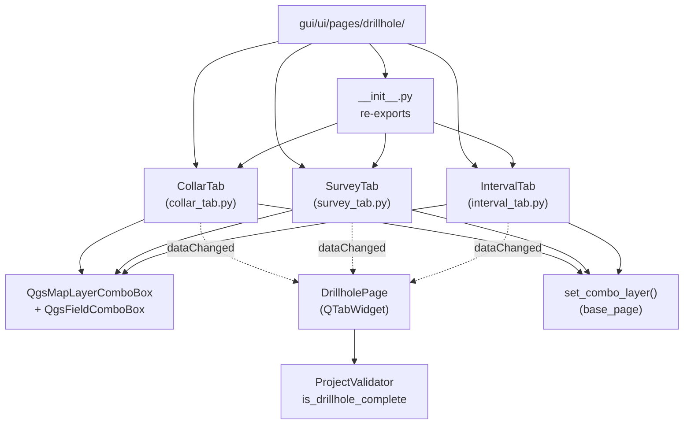

---
tags:
  - secinterp
  - code-walkthrough
  - gui
  - pages
aliases:
  - gui/ui/pages/drillhole/
  - CollarTab
  - IntervalTab
  - SurveyTab
cssclass: secinterp-note
---

# `gui/ui/pages/drillhole/` — Tabs de sondajes (collar, survey, intervalos)

> [!abstract] Resumen en una línea
> Package `gui/ui/pages/drillhole/` (4 files): namespace de los tres formularios de sondaje — `CollarTab` (boca de pozo), `SurveyTab` (desviaciones) e `IntervalTab` (tramos litológicos) — con mini-protocolo común (`get_data`/`dump`/`load`/`reset` + `dataChanged`) que `DrillholePage` agrega en un `QTabWidget`.

**Ruta**: `gui/ui/pages/drillhole/` (4 archivos, ~477 líneas)
**Clases principales**: `CollarTab`, `SurveyTab`, `IntervalTab`
**Capa**: GUI (QGIS · formularios con `QgsMapLayerComboBox` + `QgsFieldComboBox`)
**Tags**: #secinterp #gui #pages

---

## 🎯 ¿Por qué existe este paquete?

Configurar sondajes exige tres formularios distintos pero coherentes: dónde empieza
el pozo (collar), cómo se desvía en profundidad (survey) y qué litología atraviesa
(intervalos). El paquete los aísla para que el coordinador no conozca widgets:

| Problema | Solución |
|----------|----------|
| Tres formularios con el mismo ciclo (extraer/persistir/resetear) | Mini-protocolo común en cada tab + señal `dataChanged` |
| Elegir capa y después sus campos sin inconsistencias | Cascada capa→campos: `layerChanged` → `field.setLayer(...)` |
| El collar puede usar geometría o columnas X/Y | `chk_use_geom` + `_toggle_xy_fields` habilitan/inhabilitan X/Y |
| `DrillholePage` no debe importar 3 módulos sueltos | `__init__.py` re-exporta las 3 clases con `__all__` explícito |

> [!important] Nota arquitectónica
> Patrón **tab-hosting**: el paquete aporta los tabs (contenido), `DrillholePage`
> aporta el `QTabWidget` (continente) y fusiona los dicts. Ningún tab importa a la
> página: la dependencia apunta siempre hacia dentro del paquete.

---

## 🧬 Diagrama de relaciones



> [!tip] Cómo leer
> Flecha sólida = importa/hereda; punteada = emite señal o delega validación. Los
> tres tabs comparten widgets QGIS y el ayudante `set_combo_layer`, pero nunca se
> importan entre sí.

---

## 📦 Imports — lectura arquitectónica

```python
# gui/ui/pages/drillhole/__init__.py (completo, 9 líneas)
"""Drillhole page sub-widgets (collar, survey, interval tabs)."""

from __future__ import annotations

from .collar_tab import CollarTab
from .interval_tab import IntervalTab
from .survey_tab import SurveyTab

__all__ = ["CollarTab", "IntervalTab", "SurveyTab"]
```

```python
# Cabecera común de los tres tabs (collar_tab.py / survey_tab.py / interval_tab.py)
from __future__ import annotations

import contextlib
from typing import Any

from qgis.core import Qgis
from qgis.gui import QgsFieldComboBox, QgsMapLayerComboBox
from qgis.PyQt.QtCore import QCoreApplication, pyqtSignal
from qgis.PyQt.QtWidgets import QCheckBox, QGridLayout, QLabel, QWidget

from sec_interp.gui.ui.pages.base_page import set_combo_layer
from sec_interp.logger_config import get_logger
```

| # | Observación |
|---|-------------|
| ① | El `__init__` **sí** re-exporta (a diferencia de `pages/__init__.py`): `__all__` honrado. |
| ② | Los tabs heredan `QWidget` directamente, **no** `BasePage`: el protocolo es por convención (duck typing), no por herencia. |
| ③ | `QgsMapLayerComboBox` + `QgsFieldComboBox` en los tres: selector de capa + mapeo de campos, el binomio Extract. |
| ④ | `Qgis` (solo collar/survey/interval con proxy): filtra el combo a capas vectoriales. |
| ⑤ | `set_combo_layer` importado del módulo padre: restauración silenciosa en `load`/`reset`. |
| ⑥ | `QCoreApplication` + `pyqtSignal`: `tr()` por tab y señal `dataChanged` propia. |

> [!note] Tabs sin `BasePage`
> Decisión consciente: los tabs son demasiado ligeros para el esqueleto `group_box`
> de `BasePage` (la página anfitriona ya aporta el marco). El contrato se cumple por
> forma: mismos métodos, misma señal, mismos dicts.

---

## 🏗️ Inventario de estructura

**Clases (una por módulo, todas `QWidget` con señal `dataChanged`):**

- `class CollarTab(QWidget)` — capa, identificador, X/Y/Z o geometría, profundidad (180 líneas)
- `class SurveyTab(QWidget)` — capa, identificador, profundidad, azimut, inclinación (144 líneas)
- `class IntervalTab(QWidget)` — capa, identificador, desde/hasta, litología (144 líneas)

**Métodos (idénticos en los tres tabs):**

- `__init__(parent=None)` → `_setup_ui()`
- `tr(message)` — `QCoreApplication.translate("<Tab>", message)`
- `_setup_ui()` — `QGridLayout` de etiquetas + combos
- `get_data()` / `dump()` / `load(data)` / `reset()`
- `connect_signals()` / `disconnect_signals()`
- Solo collar: `_toggle_xy_fields(checked)` — conmuta campos X/Y según `chk_use_geom`

---

## 📁 Archivos del paquete

| Archivo | Líneas | Rol |
|---|--:|---|
| `__init__.py` | 9 | Re-exporta `CollarTab`, `IntervalTab`, `SurveyTab` |
| [[#CollarTab\|collar_tab.py]] | 180 | Boca de pozo: capa, id, X/Y/Z o geometría, profundidad |
| [[#SurveyTab\|survey_tab.py]] | 144 | Desviaciones: id, profundidad, azimut, inclinación |
| [[#IntervalTab\|interval_tab.py]] | 144 | Tramos: id, desde/hasta, litología |

---

## 📖 Recorrido tab por tab

### CollarTab

```python
class CollarTab(QWidget):
    dataChanged = pyqtSignal()

    # Widgets (prefijo c_):
    # c_layer: QgsMapLayerComboBox — capa de collares
    # c_id:    QgsFieldComboBox — identificador del pozo
    # c_x, c_y, c_z: QgsFieldComboBox — coordenadas (si no se usa geometría)
    # c_depth: QgsFieldComboBox — profundidad total / EOH
    # chk_use_geom: QCheckBox — usar la geometría del punto en vez de X/Y

    def _toggle_xy_fields(self, checked: bool): ...
    def get_data(self): ...  # collar_layer, collar_id, use_geometry, collar_x/y/z...
    def dump / load / reset: ...
```

El tab de boca de pozo. `chk_use_geom.toggled` → `_toggle_xy_fields`: si el usuario
usa la geometría del punto, los combos `c_x`/`c_y` se deshabilitan (no tiene sentido
mapear columnas); si usa columnas, se habilitan. Al cambiar `c_layer`, cada field
combo se re-ancla con `setLayer` para listar solo los campos de esa capa.

| Widget | Tipo | Dato extraído |
|--------|------|---------------|
| `c_layer` | `QgsMapLayerComboBox` | Capa de collares |
| `c_id` | `QgsFieldComboBox` | Identificador del sondaje |
| `c_x` / `c_y` | `QgsFieldComboBox` | Este / Norte (si `use_geometry` es falso) |
| `c_z` | `QgsFieldComboBox` | Elevación del collar |
| `c_depth` | `QgsFieldComboBox` | Profundidad final del pozo |
| `chk_use_geom` | `QCheckBox` | Geometría del punto vs columnas X/Y |

### SurveyTab

```python
class SurveyTab(QWidget):
    dataChanged = pyqtSignal()

    # Widgets (prefijo s_):
    # s_layer: QgsMapLayerComboBox — capa de desviaciones
    # s_id:    QgsFieldComboBox — identificador del pozo (join con collar)
    # s_depth: QgsFieldComboBox — profundidad de la medición
    # s_azim:  QgsFieldComboBox — azimut
    # s_incl:  QgsFieldComboBox — inclinación
```

El tab de desviaciones direccionales. Sin toggles: cinco combos en cascada
capa→campos. `s_id` es la clave de unión con `c_id` del collar; `s_azim`/`s_incl`
alimentan el motor de trayectoria (`trajectory_engine`) del core con datos ya
desacoplados en `get_data`.

| Widget | Tipo | Dato extraído |
|--------|------|---------------|
| `s_layer` | `QgsMapLayerComboBox` | Capa de survey |
| `s_id` | `QgsFieldComboBox` | Id del pozo (join con collar) |
| `s_depth` | `QgsFieldComboBox` | Profundidad medida |
| `s_azim` | `QgsFieldComboBox` | Azimut del tramo |
| `s_incl` | `QgsFieldComboBox` | Inclinación del tramo |

### IntervalTab

```python
class IntervalTab(QWidget):
    dataChanged = pyqtSignal()

    # Widgets (prefijo i_):
    # i_layer: QgsMapLayerComboBox — capa de intervalos
    # i_id:    QgsFieldComboBox — identificador del pozo (join con collar)
    # i_from:  QgsFieldComboBox — inicio del tramo
    # i_to:    QgsFieldComboBox — fin del tramo
    # i_lith:  QgsFieldComboBox — código litológico
```

El tab de tramos litológicos. Misma cascada capa→campos; `i_from`/`i_to` definen
el intervalo en profundidad e `i_lith` el código que el core cruza con la geología
de la sección. Ver [[interval_tab]] para el detalle campo por campo.

| Widget | Tipo | Dato extraído |
|--------|------|---------------|
| `i_layer` | `QgsMapLayerComboBox` | Capa de intervalos |
| `i_id` | `QgsFieldComboBox` | Id del pozo (join con collar) |
| `i_from` / `i_to` | `QgsFieldComboBox` | Techo / muro del tramo |
| `i_lith` | `QgsFieldComboBox` | Litología del tramo |

### Patrón de cascada capa → campos

Los tres tabs repiten el mismo cableado en `connect_signals`:

```python
# Esquema (nombres según tab: c_* / s_* / i_*)
self.<x>_layer.layerChanged.connect(self.<x>_id.setLayer)
self.<x>_layer.layerChanged.connect(self.<x>_depth.setLayer)
# ... un connect por cada field combo ...
self.<x>_layer.layerChanged.connect(self.dataChanged.emit)
```

Cambiar la capa re-ancla **todos** los field combos (muestran los campos de la
nueva capa) y emite `dataChanged` para que `DrillholePage` re-emita hacia el
diálogo. `disconnect_signals` revierte cada conexión con `contextlib.suppress`
ante dobles cierres.

---

## 🗝️ Diccionario fusionado (`get_data`)

`DrillholePage.get_data()` fusiona los tres dicts con `dict.update` en orden
collar → survey → interval. Claves reales consumidas por `is_complete` y el core:

| Clave | Origen | Significado |
|-------|--------|-------------|
| `collar_layer` | `CollarTab` | Capa de collares (objeto, resuelta luego a metadatos) |
| `collar_id` | `CollarTab` | Campo identificador del pozo |
| `use_geometry` | `CollarTab` | `True` si usa geometría (`chk_use_geom`), `False` si columnas |
| `collar_x` / `collar_y` | `CollarTab` | Campos Este/Norte (solo si `use_geometry` es falso) |
| `survey_layer` | `SurveyTab` | Capa de desviaciones |
| `survey_id` / `survey_depth` | `SurveyTab` | Join con collar + profundidad medida |
| `survey_azim` / `survey_incl` | `SurveyTab` | Azimut / inclinación del tramo |
| `interval_layer` | `IntervalTab` | Capa de intervalos |
| `interval_id` | `IntervalTab` | Join con collar |
| `interval_from` / `interval_to` | `IntervalTab` | Techo / muro del tramo |
| `interval_lith` | `IntervalTab` | Código litológico |

> [!tip] Prefijos como namespaces
> `collar_*`, `survey_*`, `interval_*` evitan colisiones en la fusión: tres tabs
> pueden tener cada uno su `layer`/`id` sin pisarse. Mantén el prefijo al añadir campos.

---

## 🔄 Flujo de datos

| Fase | Entrada | Transformación | Salida |
|------|---------|----------------|--------|
| Selección de capa | `layerChanged` en `*_layer` | Re-anclaje `setLayer` de cada field combo | Campos de la nueva capa |
| Edición | Cambio de campo / toggle | `dataChanged.emit()` por tab | `DrillholePage` re-emite |
| Extract | `tab.get_data()` × 3 | Combos → nombres de campo + flags | Dict fusionado (`collar_*`, `survey_*`, `interval_*`) |
| Completitud | Dict fusionado | `resolve_layer_metadata` + `ValidationParams` | `ProjectValidator.is_drillhole_complete` |
| Persistencia | `dump()` / `load(dict)` | Vía `set_combo_layer` (silenciosa) | Sesión restaurable sin cascadas |
| Reset | `reset()` | Valores por defecto + `set_combo_layer(None)` donde aplica | Formulario limpio |

---

## 🏛️ Patrones de diseño presentes

| Patrón | Dónde | Propósito |
|--------|-------|-----------|
| **Tab-hosting** | Tabs vs `DrillholePage` | Contenido intercambiable bajo un `QTabWidget` |
| **Cascada capa→campos** | `layerChanged` → `setLayer` | Campos siempre coherentes con la capa elegida |
| **Guard de señales** | `set_combo_layer`, `blockSignals` | Restaurar estado sin efectos colaterales |
| **Signal re-emit** | `dataChanged` por tab → página | Un cambio en cualquier tab invalida el conjunto |
| **Convención sobre herencia** | Mini-protocolo sin `BasePage` | Mismos métodos por forma, sin esqueleto heredado |

---

## 🧾 Resumen de la API

| Símbolo | Firma / Hereda | Uso típico |
|---------|----------------|------------|
| `CollarTab` | `QWidget` + `dataChanged` | `CollarTab()`; `tab.get_data()["collar_id"]` |
| `SurveyTab` | `QWidget` + `dataChanged` | `SurveyTab()`; azimut/inclinación por pozo |
| `IntervalTab` | `QWidget` + `dataChanged` | `IntervalTab()`; tramos desde/hasta + litología |
| `get_data` | `() -> dict[str, Any]` | Extract con claves `collar_*` / `survey_*` / `interval_*` |
| `dump` / `load` | `() -> dict` / `(dict) -> None` | Persistencia silenciosa vía `set_combo_layer` |
| `reset` | `() -> None` | Limpia combos y toggles |
| `_toggle_xy_fields` | `(checked: bool) -> None` | Solo collar: X/Y vs geometría |

---

## 🛡️ Manejo de errores

- **Capa eliminada**: si la capa referenciada desaparece del proyecto, el combo
  queda vacío y `get_data` devuelve `None`/cadena vacía; la puerta es
  `DrillholePage.is_complete()`, no una excepción en el tab.
- **`load` con claves ausentes**: `load(data)` usa valores por defecto ante dicts
  parciales (sesiones antiguas), sin elevar `KeyError`.
- **Desconexión defensiva**: `disconnect_signals` tolera conexiones ya retiradas.
- **Sin `SecInterpError` aquí**: los tabs no validan dominio; informan estado y la
  página/coordinador decide (ver [[drillhole_page]]).

---

## 🧪 Tests asociados

Cobertura real bajo `tests/gui/`:

- `tests/gui/test_drillhole_page.py` — agrega los 3 tabs: `get_data` fusionado,
  `dump`/`load`/`reset` e `is_complete` con capas simuladas.
- `tests/gui/test_main_dialog_validation_manager.py` — la completitud del sondaje
  como puerta de validación del diálogo.
- `tests/gui/test_multi_session_persistence.py` — `dump`/`load` de sondajes entre
  sesiones (los tabs restauran vía `set_combo_layer`).

```bash
PYTHONPATH=.. uv run python3 -m unittest tests.gui.test_drillhole_page -v
PYTHONPATH=.. uv run python3 -m unittest tests.gui.test_multi_session_persistence -v
```

> [!tip] Sin tests por tab
> No hay `test_collar_tab.py` aislado: los tabs se prueban a través del
> coordinador, que es su único consumidor real (Mock-first, `tests/base_test.py`).

---

## 🌐 i18n y mensajes al usuario

- Cada tab define `tr()` con su propio contexto (`"CollarTab"`, `"SurveyTab"`,
  `"IntervalTab"`): `QCoreApplication.translate("CollarTab", "Collars")`.
- Etiquetas de `QGridLayout` (`QLabel`) + toggles pasan por `self.tr()` en
  `_setup_ui`: todo texto visible es extraíble por `pylupdate`.
- Los nombres de capa/campo provienen del proyecto (datos, no literales): nunca se
  traducen, solo se muestran.

---

## 👀 Observaciones y notas

> [!success] Fortalezas
> - `__init__.py` honra `__all__`: punto de entrada único y estable.
> - Prefijos `c_`/`s_`/`i_` evitan colisiones al fusionar dicts.
> - Cascada capa→campos + `set_combo_layer`: imposible un campo de otra capa.

> [!warning] Puntos de atención
> - Tabs sin heredar `BasePage`: el contrato es por convención; un linter no lo verifica.
> - Lógica de `_toggle_xy_fields` solo en collar: si otro tab necesita toggles, duplicará el patrón.
> - `QGridLayout` manual en 3 archivos: cambios de estilo se repiten 3 veces.

> [!question] Preguntas abiertas
> - ¿Un `DrillholeTabBase(QWidget)` con `dataChanged` + cascada genérica capa→campos?
> - ¿Mover los prefijos de claves (`collar_*`, …) a constantes compartidas con el core?

---

## 🔗 Notas relacionadas

- [[Index]] — índice de la bóveda
- [[collar_tab]] — nota individual de `CollarTab`
- [[survey_tab]] — nota individual de `SurveyTab`
- [[interval_tab]] — nota individual de `IntervalTab`
- [[drillhole_page]] — coordinador que hospeda estos tabs
- [[base_page]] — `set_combo_layer` y protocolo `BasePage`
- [[gui_ui_pages]] — nota del paquete padre `pages/`
- [[trajectory_engine]] — core que consume survey (trayectoria del pozo)
- [[gui]] — nota raíz del árbol GUI

---

*Nota de la bóveda SecInterp Code Walkthrough v2 — v3.9.0*
