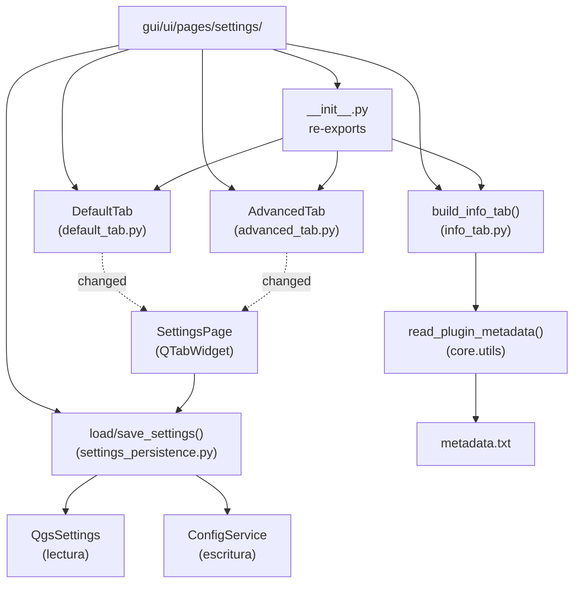

---
tags:
  - secinterp
  - code-walkthrough
  - gui
  - pages
aliases:
  - gui/ui/pages/settings/
  - AdvancedTab
  - DefaultTab
  - build_info_tab
  - load_settings
  - save_settings
cssclass: secinterp-note
---

# `gui/ui/pages/settings/` — Tabs de ajustes (default, advanced, info)

> [!abstract] Resumen en una línea
> Package `gui/ui/pages/settings/` (5 files): namespace de los ajustes — `DefaultTab` (qué se exporta), `AdvancedTab` (toggles 3D), `build_info_tab` (metadatos de solo lectura vía `read_plugin_metadata`) y `settings_persistence` (`load_settings`/`save_settings`) — que `SettingsPage` agrega en un `QTabWidget`.

**Ruta**: `gui/ui/pages/settings/` (5 archivos, ~416 líneas)
**Símbolos principales**: `DefaultTab`, `AdvancedTab`, `build_info_tab`, `load_settings`, `save_settings`
**Capa**: GUI (QGIS · formularios + persistencia en `QgsSettings`/`ConfigService`)
**Tags**: #secinterp #gui #pages

---

## 🎯 ¿Por qué existe este paquete?

Los ajustes del plugin mezclan tres preocupaciones distintas: selección de
exports, funciones 3D restringidas e información del plugin. El paquete las separa
en tabs independientes con persistencia desacoplada:

| Problema | Solución |
|----------|----------|
| Elegir qué capas exportar + formato + plantilla de nombres | `DefaultTab`: 5 checkboxes + `combo_format` + `txt_naming` + reset |
| Activar funciones 3D / trazas de sondaje sin mezclar con exports | `AdvancedTab`: `chk_enable_3d` + 4 toggles `chk_3d_*` |
| Mostrar versión, autor y documentación sin permitir edición | `build_info_tab()`: función que construye un `QWidget` de solo lectura |
| Leer/escribir ajustes sin acoplar los tabs al store | `settings_persistence`: `load_settings` / `save_settings` funcionales |
| `SettingsPage` no debe importar 4 módulos sueltos | `__init__.py` re-exporta las 3 piezas con `__all__` explícito |

> [!important] Nota arquitectónica
> Mismo patrón **tab-hosting** que `drillhole/`: el paquete aporta contenido,
> `SettingsPage` aporta el `QTabWidget` y fusiona. La persistencia vive en
> funciones puras que reciben los tabs como parámetros (inyección, no import).

---

## 🧬 Diagrama de relaciones



> [!tip] Cómo leer
> Flecha sólida = importa/define; punteada = emite señal o lee. `info_tab` es una
> **función**, no una clase: no emite señales ni persiste nada.

---

## 📦 Imports — lectura arquitectónica

```python
# gui/ui/pages/settings/__init__.py (completo, 9 líneas)
"""Settings page sub-widgets (default, advanced, info tabs)."""

from __future__ import annotations

from .advanced_tab import AdvancedTab
from .default_tab import DefaultTab
from .info_tab import build_info_tab

__all__ = ["AdvancedTab", "DefaultTab", "build_info_tab"]
```

```python
# default_tab.py / advanced_tab.py (cabecera común)
from __future__ import annotations

import contextlib
from typing import Any

from qgis.PyQt.QtCore import QCoreApplication, pyqtSignal
from qgis.PyQt.QtWidgets import QCheckBox, QLabel, QVBoxLayout, QWidget, ...

# info_tab.py (cabecera completa)
"""Plugin information (read-only) settings tab."""

from __future__ import annotations

from collections.abc import Callable

from qgis.PyQt.QtWidgets import QLabel, QVBoxLayout, QWidget

from sec_interp.core.utils.metadata_reader import read_plugin_metadata
from sec_interp.logger_config import get_logger

# settings_persistence.py (cabecera completa)
"""Persistence helpers for the settings page tabs."""

from __future__ import annotations

from typing import Any

from sec_interp.logger_config import get_logger
```

| # | Observación |
|---|-------------|
| ① | El `__init__` re-exporta clases **y** una función (`build_info_tab`): el tab info no necesita clase. |
| ② | `info_tab.py` es el único que importa del core (`read_plugin_metadata`): lectura de `metadata.txt` con caché. |
| ③ | `settings_persistence.py` **no** importa `QgsSettings` ni `ConfigService`: los recibe como `Any` (inversión de dependencias). |
| ④ | `collections.abc.Callable` en `info_tab`: el traductor se inyecta (`translate: Callable[[str], str]`). |
| ⑤ | `contextlib` en default/advanced: des-norma defensiva de checkboxes y formato. |
| ⑥ | `_EXPORT_CHECKBOXES` (tupla en `default_tab.py`): los 5 nombres de checkbox como dato, no repetidos. |

---

## 🏗️ Inventario de estructura

**Clases:**

- `class DefaultTab(QWidget)` — 5 `chk_exp_*` + `combo_format` + `txt_naming` + `btn_reset_export` (178 líneas)
- `class AdvancedTab(QWidget)` — `chk_enable_3d` + 4 `chk_3d_*` (106 líneas)

**Funciones:**

- `def build_info_tab(translate, parent=None) -> QWidget` — tab informativa de solo lectura (48 líneas)
- `def load_settings(settings, default_tab, advanced_tab)` — `QgsSettings` → widgets (75 líneas, mitad)
- `def save_settings(config_service, default_tab, advanced_tab)` — widgets → `ConfigService`

**Señales y helpers:**

- `changed = pyqtSignal()` en `DefaultTab` y `AdvancedTab` (el info tab no emite)
- `_EXPORT_CHECKBOXES` — tupla con los 5 nombres de checkbox de exportación
- `_disconnect_checkboxes` / `_disconnect_format_settings` — limpieza fina en `DefaultTab`

---

## 📁 Archivos del paquete

| Archivo | Líneas | Rol |
|---|--:|---|
| `__init__.py` | 9 | Re-exporta `AdvancedTab`, `DefaultTab`, `build_info_tab` |
| [[#DefaultTab\|default_tab.py]] | 178 | Selección de exports + formato + plantilla de nombres |
| [[#AdvancedTab\|advanced_tab.py]] | 106 | Toggles 3D y de trazas de sondaje |
| [[#build_info_tab\|info_tab.py]] | 48 | Función que construye el tab informativo de solo lectura |
| [[#Persistencia\|settings_persistence.py]] | 75 | `load_settings` / `save_settings` funcionales |

---

## 📖 Recorrido símbolo por símbolo

### DefaultTab

```python
_EXPORT_CHECKBOXES = (
    "chk_exp_topo",
    "chk_exp_geol",
    "chk_exp_struct",
    "chk_exp_drill",
    "chk_exp_interp",
)

class DefaultTab(QWidget):
    changed = pyqtSignal()

    # chk_exp_topo/geol/struct/drill/interp: QCheckBox — qué se exporta
    # combo_format: QComboBox — formato (p. ej. Shapefile)
    # txt_naming: QLineEdit — plantilla (p. ej. "{filename}_{profile}")
    # btn_reset_export: QPushButton — restaurar valores por defecto

    def get_data(self): ...
    def reset_to_defaults(self): ...
    def connect_signals / disconnect_signals: ...
    def _disconnect_checkboxes(self): ...
    def _disconnect_format_settings(self): ...
```

El tab de exportación por defecto. Los 5 checkboxes deciden qué capas genera el
export (`topo`, `geol`, `struct`, `drill`, `interp`); `combo_format` el formato de
archivo; `txt_naming` la plantilla de nombres; `btn_reset_export` restaura los
defaults vía `reset_to_defaults`. Cada cambio emite `changed` para que
`SettingsPage._on_settings_changed` persista al momento.

| Widget | Rol |
|--------|-----|
| `chk_exp_topo` / `chk_exp_geol` / `chk_exp_struct` | Exportar topo / geología / estructuras |
| `chk_exp_drill` / `chk_exp_interp` | Exportar sondajes / interpretaciones |
| `combo_format` | Formato de archivo de salida |
| `txt_naming` | Plantilla de nombres de archivo |
| `btn_reset_export` | Restaura los valores por defecto |

### AdvancedTab

```python
class AdvancedTab(QWidget):
    changed = pyqtSignal()

    # chk_enable_3d:   QCheckBox — master switch de funciones 3D
    # chk_3d_traces:   QCheckBox — trazas 3D de sondajes
    # chk_3d_intervals: QCheckBox — intervalos 3D
    # chk_3d_original:  QCheckBox — geometría original
    # chk_3d_projected: QCheckBox — geometría proyectada

    def get_data(self): ...
    def reset_to_defaults(self): ...
    def connect_signals / disconnect_signals: ...
```

El tab de funciones avanzadas/3D. `chk_enable_3d` es el interruptor maestro;
los cuatro `chk_3d_*` afinan qué se genera en 3D (trazas, intervalos, original,
proyectada). Nótese que `chk_3d_projected` persiste con default `False` mientras
el resto defaultea a `True` (ver persistencia): la geometría proyectada es opt-in.

### build_info_tab

Recorrido honesto del fuente completo (`info_tab.py`, 48 líneas):

```python
def build_info_tab(translate: Callable[[str], str], parent: QWidget | None = None) -> QWidget:
    widget = QWidget(parent)
    layout = QVBoxLayout(widget)

    try:
        metadata = read_plugin_metadata()
        layout.addWidget(QLabel(translate("<b>Plugin Information</b>")))
        layout.addWidget(QLabel(translate(f"{metadata['name']} v{metadata['version']}")))
        layout.addWidget(QLabel(translate(f"Developed by {metadata['author']}")))
        layout.addWidget(QLabel(translate(f"Contact: {metadata['email']}")))

        if metadata.get("homepage"):
            doc_label = QLabel(f"<a href='{metadata['homepage']}'>{translate('Documentation')}</a>")
            doc_label.setOpenExternalLinks(True)
            layout.addWidget(doc_label)

    except (FileNotFoundError, ValueError) as e:
        logger.warning(f"Metadata read error: {e}")
        layout.addWidget(QLabel(translate("<b>Plugin Information</b>")))
        layout.addWidget(QLabel(translate("Sec Interp (version unavailable)")))
        layout.addWidget(QLabel(translate("Metadata missing")))

    layout.addStretch()
    return widget
```

| Aspecto | Detalle fiel al fuente |
|---------|------------------------|
| Firma | `translate` inyectado + `parent` opcional; devuelve `QWidget` montado |
| Camino feliz | 4 `QLabel`: título en negrita, `nombre vversión`, autor, contacto |
| Enlace | Solo si hay `homepage`: `QLabel` con anchor HTML + `setOpenExternalLinks(True)` |
| Camino de fallo | Captura `FileNotFoundError`/`ValueError` (las que eleva `read_plugin_metadata`), `logger.warning`, 3 etiquetas de degradación |
| Cierre | `addStretch()` empuja el contenido arriba, como en `BasePage` |

> [!note] Función, no clase
> El tab info no tiene estado ni señales: construirlo es una función pura de
> `(translate, parent)`. `SettingsPage` lo invoca como
> `build_info_tab(self.tr)`, de modo que traduce con el contexto de la página.

### Persistencia

```python
def load_settings(settings: Any, default_tab: Any, advanced_tab: Any) -> None:
    enabled_3d = settings.value("SecInterp/enable_3d", True, type=bool)
    advanced_tab.chk_enable_3d.setChecked(enabled_3d)
    default_tab.chk_exp_topo.setChecked(settings.value("SecInterp/exp_topo", True, type=bool))
    # ... exp_geol / exp_struct / exp_drill / exp_interp (default True) ...
    default_fmt = settings.value("SecInterp/export_format", "Shapefile", type=str)
    # ... combo_format.setCurrentIndex(findText(default_fmt)) ...
    default_tab.txt_naming.setText(
        settings.value("SecInterp/export_naming", "{filename}_{profile}", type=str))
    advanced_tab.chk_3d_traces.setChecked(settings.value("SecInterp/drill_3d_traces", True, type=bool))
    advanced_tab.chk_3d_intervals.setChecked(settings.value("SecInterp/drill_3d_intervals", True, type=bool))
    advanced_tab.chk_3d_original.setChecked(settings.value("SecInterp/drill_3d_original", True, type=bool))
    advanced_tab.chk_3d_projected.setChecked(settings.value("SecInterp/drill_3d_projected", False, type=bool))

def save_settings(config_service: Any, default_tab: Any, advanced_tab: Any) -> None:
    config_service.set("enable_3d", advanced_tab.chk_enable_3d.isChecked())
    config_service.set("exp_topo", default_tab.chk_exp_topo.isChecked())
    # ... resto de flags + formato + naming ...
```

Asimetría deliberada: **lee** de `QgsSettings` (claves `SecInterp/*` con defaults)
y **escribe** vía `ConfigService` (`config_service.set(...)`). Los tabs no conocen
ningún store: reciben widgets ya construidos y los mutan/leen. `SettingsPage`
orquesta: `_load_settings` al construir, `_on_settings_changed` ante `changed`.

| Clave | Widget | Default |
|-------|--------|---------|
| `SecInterp/enable_3d` | `chk_enable_3d` | `True` |
| `SecInterp/exp_topo` / `exp_geol` / `exp_struct` | `chk_exp_*` | `True` |
| `SecInterp/exp_drill` / `exp_interp` | `chk_exp_*` | `True` |
| `SecInterp/export_format` | `combo_format` | `"Shapefile"` |
| `SecInterp/export_naming` | `txt_naming` | `"{filename}_{profile}"` |
| `SecInterp/drill_3d_traces` / `intervals` / `original` | `chk_3d_*` | `True` |
| `SecInterp/drill_3d_projected` | `chk_3d_projected` | `False` (opt-in) |

---

## 🔄 Flujo de datos

| Fase | Entrada | Transformación | Salida |
|------|---------|----------------|--------|
| Construcción | `SettingsPage._setup_ui` | `DefaultTab()` + `AdvancedTab()` + `build_info_tab(self.tr)` | 3 tabs en el `QTabWidget` |
| Carga | `_load_settings` | `load_settings(QgsSettings, default_tab, advanced_tab)` | Widgets con valores persistidos |
| Edición | Toggle / texto / formato | `changed.emit()` por tab | `_on_settings_changed` → `save_settings` |
| Extract | `get_data()` | default + advanced fusionados | Dict de ajustes hacia export/core |
| Reset | `btn_reset_export` | `reset_to_defaults()` en ambos tabs | Valores de fábrica (y persistidos) |
| Info | `read_plugin_metadata()` | `metadata.txt` (cacheado) → `QLabel`s | Tab de solo lectura o degradado |

---

## 🏛️ Patrones de diseño presentes

| Patrón | Dónde | Propósito |
|--------|-------|-----------|
| **Tab-hosting** | Tabs vs `SettingsPage` | Contenido intercambiable bajo un `QTabWidget` |
| **Builder funcional** | `build_info_tab` | Construir un tab sin estado como función pura |
| **Inyección de traductor** | `translate: Callable[[str], str]` | i18n sin heredar `QWidget` ni acoplar contexto |
| **Persistencia funcional** | `load/save_settings` con tabs como params | Stores intercambiables (`QgsSettings`, `ConfigService`, mocks) |
| **Degradación elegante** | `except (FileNotFoundError, ValueError)` | Sin `metadata.txt` hay tab informativo, no crash |

---

## 🧾 Resumen de la API

| Símbolo | Firma / Hereda | Uso típico |
|---------|----------------|------------|
| `DefaultTab` | `QWidget` + `changed` | `DefaultTab()`; `get_data()` → flags `exp_*` + formato |
| `AdvancedTab` | `QWidget` + `changed` | `AdvancedTab()`; `get_data()` → flags `enable_3d` + `3d_*` |
| `build_info_tab` | `(translate, parent=None) -> QWidget` | `build_info_tab(self.tr)` en `SettingsPage` |
| `load_settings` | `(settings, default_tab, advanced_tab) -> None` | Restaurar desde `QgsSettings` |
| `save_settings` | `(config_service, default_tab, advanced_tab) -> None` | Persistir vía `ConfigService` |
| `reset_to_defaults` | `() -> None` | Ambos tabs; invocado por `btn_reset_export` |

---

## 🛡️ Manejo de errores

- **Sin `metadata.txt`**: `read_plugin_metadata` eleva `FileNotFoundError`;
  `build_info_tab` lo captura junto a `ValueError` (campos requeridos ausentes) y
  muestra etiquetas de degradación + `logger.warning`. El tab nunca queda vacío.
- **Formato desconocido**: si `export_format` persistido no existe en el combo,
  `findText` devuelve `-1` y el índice no se toca (guarda `index >= 0`).
- **`homepage` ausente**: el enlace a documentación simplemente no se añade
  (`metadata.get("homepage")` falsy → se omite).
- **Desconexión defensiva**: `_disconnect_checkboxes` / `_disconnect_format_settings`
  toleran conexiones ya retiradas.

---

## 🧪 Tests asociados

Cobertura real bajo `tests/gui/`:

- `tests/gui/test_settings_page.py` — fusión default+advanced, `get_data` y ciclo
  de `SettingsPage` sobre estos tabs.
- `tests/gui/test_dialog_settings_persistence.py` — `load_settings`/`save_settings`
  con stores simulados (claves `SecInterp/*`, defaults, opt-in de `projected`).
- `tests/gui/test_main_dialog_settings.py` — ajustes como parte del diálogo principal.
- `tests/gui/test_multi_session_persistence.py` — valores que sobreviven entre sesiones.

```bash
PYTHONPATH=.. uv run python3 -m unittest tests.gui.test_settings_page -v
PYTHONPATH=.. uv run python3 -m unittest tests.gui.test_dialog_settings_persistence -v
```

---

## 🌐 i18n y mensajes al usuario

- `DefaultTab.tr` / `AdvancedTab.tr`: `QCoreApplication.translate("<Clase>", msg)`.
- `build_info_tab` **no** tiene `tr` propio: usa el `translate` inyectado, de modo
  que sus cadenas pertenecen al contexto de `SettingsPage`.
- Matiz documentado: `translate(f"{metadata['name']} v{metadata['version']}")`
  traduce un valor de datos (nombre/versión de `metadata.txt`), no un literal del
  código: `pylupdate` no lo extrae como cadena fuente. Los literales sí extraíbles
  son `"Plugin Information"`, `"Documentation"`, `"Metadata missing"`, etc.
- Enlace `"Documentation"` con anchor HTML: el texto visible se traduce, la URL no.

---

## 👀 Observaciones y notas

> [!success] Fortalezas
> - Persistencia desacoplada: los tabs no importan ningún store.
> - `build_info_tab` funcional y degradable: 48 líneas sin estado ni señales.
> - `_EXPORT_CHECKBOXES` como tupla: iteración en vez de 5 bloques repetidos.

> [!warning] Puntos de atención
> - Asimetría `QgsSettings` (lee) vs `ConfigService` (escribe): dos namespaces que
>   deben mantenerse sincronizados a mano.
> - `chk_3d_projected` defaultea `False` frente a `True` del resto: excepción fácil
>   de pasar por alto al añadir toggles.
> - Traducir `f"{name} v{version}"` (dato) sugiere cobertura i18n que `pylupdate` no da.

> [!question] Preguntas abiertas
> - ¿Unificar lectura y escritura en `ConfigService` para un solo namespace?
> - ¿Convertir `build_info_tab` en clase si el tab info necesita algún día estado?

---

## 🔗 Notas relacionadas

- [[Index]] — índice de la bóveda
- [[advanced_tab]] — nota individual de `AdvancedTab`
- [[default_tab]] — nota individual de `DefaultTab`
- [[settings_persistence]] — nota individual de `load/save_settings`
- [[settings_page]] — coordinador que hospeda estos tabs
- [[metadata_reader]] — `read_plugin_metadata` usado por el tab info
- [[gui_ui_pages]] — nota del paquete padre `pages/`
- [[dialog_settings_persistence]] — persistencia a nivel de diálogo
- [[gui]] — nota raíz del árbol GUI

---

*Nota de la bóveda SecInterp Code Walkthrough v2 — v3.8.0*
