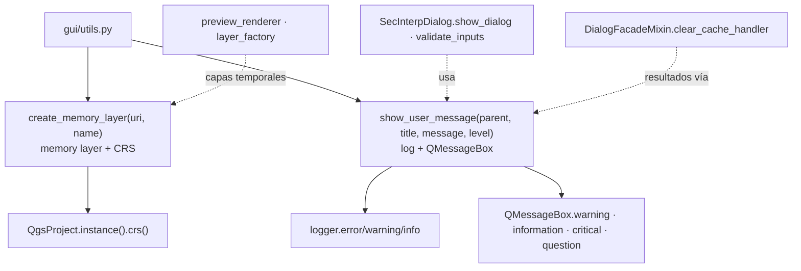

---
tags:
  - secinterp
  - code-walkthrough
  - gui
  - utils
aliases:
  - utils.py
  - create_memory_layer
  - show_user_message
cssclass: secinterp-note
---

# `gui/utils.py`

> [!abstract] Resumen en una línea
> Dos helpers transversales de GUI: `create_memory_layer` (capas temporales con CRS del proyecto) y `show_user_message` (`QMessageBox` con logging automático por nivel).

**Ruta**: `gui/utils.py` (76 líneas)
**Funciones principales**: `create_memory_layer(uri, name)`, `show_user_message(parent, title, message, level="warning")`
**Capa**: GUI (utilidades Present · QGIS-dependiente, `core/`-agnóstica)
**Tags**: #secinterp #gui #utils

---

## 🎯 ¿Por qué existe este archivo?

Crear capas temporales y mostrar avisos son las dos operaciones GUI más repetidas del plugin. Sin este módulo, cada manager reinventaría el `QgsVectorLayer("memory")` y el `QMessageBox` con su propio logging:

| Problema | Solución |
|----------|----------|
| Capas de memoria sin CRS o sin validar | `create_memory_layer` asigna el CRS del proyecto y devuelve `None` si falla |
| Avisos que no quedan en el log | `show_user_message` registra cada mensaje antes de mostrarlo |
| `QMessageBox` distinto en cada manager | Un dispatch por `level` con estilo consistente |
| Preguntas sí/no con botones ad hoc | Nivel `"question"` con `Yes\|No` y retorno del botón pulsado |

> [!important] Nota arquitectónica
> Módulo de funciones puras de presentación: no importa managers, páginas ni nada de `core/`. Es hoja del grafo de dependencias — [[main_dialog]] y los managers lo llaman; él no llama a nadie del plugin salvo `logger_config`.

---

## 🧬 Diagrama de relaciones



> [!tip] Cómo leer
> Flecha sólida = define/llama; punteada = consumidores (diálogo, managers, renderers). El módulo no conoce a sus llamantes.

---

## 📦 Imports — lectura arquitectónica

```python
# gui/utils.py
from __future__ import annotations

from typing import Any

from qgis.core import QgsProject, QgsVectorLayer
from qgis.PyQt.QtWidgets import QMessageBox

from sec_interp.logger_config import get_logger
```

| # | Observación |
|---|-------------|
| ① | `QgsVectorLayer` + `QgsProject`: lo mínimo para fabricar capas de memoria con CRS real. |
| ② | `QMessageBox` es el único widget importado: el módulo muestra, no construye diálogos complejos. |
| ③ | `logger = get_logger(__name__)` a nivel de módulo: el logging es parte del contrato, no un añadido. |
| ④ | `Any` en `parent` y retorno: acepta cualquier widget padre y devuelve botón o `None` según el nivel. |

---

## 🏗️ Inventario de estructura

**Funciones (2, ambas a nivel de módulo, sin clases):**

| Función | Firma | Retorno |
|---|---|---|
| `create_memory_layer` | `(uri: str, name: str)` | `QgsVectorLayer \| None` |
| `show_user_message` | `(parent: Any, title: str, message: str, level: str = "warning")` | `Any` (botón en `"question"`, `None` en el resto) |

Sin clases, sin estado, sin `__init__`: el módulo más funcional de `gui/`.

---

## 📁 Dónde vive dentro de `gui/`

| Vecino | Relación con este módulo |
|---|---|
| [[main_dialog]] | `show_dialog` y `validate_inputs` delegan en `show_user_message` |
| [[dialog_message_mixin]] | `handle_error` usa `show_dialog` (no modal dual como `push_message`) |
| [[preview_layer_factory]] | Crea capas de preview; misma familia de fabricación que `create_memory_layer` |
| [[preview_renderer]] | Registra capas temporales en el proyecto (las que el lifecycle limpia) |
| [[main_dialog_utils]] | Otro módulo de helpers, pero de entidades; este es de presentación |

---

## 📖 Recorrido función por función

### `create_memory_layer` — memoria con CRS

```python
def create_memory_layer(uri: str, name: str) -> QgsVectorLayer | None:
    """Create a memory layer and assign the current project CRS.

    Args:
        uri: Memory provider URI (e.g. "LineString" or "Point?field=...").
        name: Display name for the layer.

    Returns:
        The created layer, or None if creation failed.

    """
    layer = QgsVectorLayer(uri, name, "memory")
    if not layer.isValid():
        logger.error(f"Failed to create memory layer: {name}")
        return None

    project_crs = QgsProject.instance().crs()
    if project_crs.isValid():
        layer.setCrs(project_crs)

    return layer
```

| Paso | Detalle |
|---|---|
| Construcción | `QgsVectorLayer(uri, name, "memory")`: el `uri` describe geometría y campos (`"Point?field=id:int"`) |
| Validación | `isValid()` + `logger.error` + `None`: el llamante decide (reintentar, avisar, abortar) |
| CRS | Solo se asigna si el CRS del proyecto es válido: sin proyecto, la capa queda con CRS nulo en vez de fallar |

> [!note] `None` como contrato, no excepción
> Devolver `None` en vez de lanzar obliga al llamante a comprobar, pero evita que un fallo de capa temporal (operativo, recuperable) se convierta en crash. Los tests mockean `layer.isValid()` a `True` para el camino feliz (ver convención en `tests/base_test.py`).

### `show_user_message` — aviso con log

```python
def show_user_message(parent: Any, title: str, message: str, level: str = "warning") -> Any:
    # Log the message
    if level in {"error", "critical"}:
        logger.error(f"{title}: {message}")
    elif level == "warning":
        logger.warning(f"{title}: {message}")
    else:
        logger.info(f"{title}: {message}")

    # Show message box
    if level == "warning":
        return QMessageBox.warning(parent, title, message)
    elif level == "info":
        return QMessageBox.information(parent, title, message)
    elif level in {"error", "critical"}:
        return QMessageBox.critical(parent, title, message)
    elif level == "question":
        return QMessageBox.question(
            parent,
            title,
            message,
            QMessageBox.StandardButton.Yes | QMessageBox.StandardButton.No,
        )
    return None
```

Doble dispatch deliberado: primero el nivel de log, luego el tipo de caja. Niveles desconocidos caen en `logger.info` + `return None` (sin caja): degradación silenciosa documentada por el `return None` final.

| `level` | Log | Caja | Retorno |
|---|---|---|---|
| `"warning"` (defecto) | `warning` | `QMessageBox.warning` | valor de la caja |
| `"info"` | `info` | `QMessageBox.information` | valor de la caja |
| `"error"` / `"critical"` | `error` | `QMessageBox.critical` | valor de la caja |
| `"question"` | `info` | `Yes \| No` | `StandardButton` pulsado |
| otro | `info` | ninguna | `None` |

> [!warning] Dos defaults distintos
> `show_user_message` usa `level="warning"` por defecto; `SecInterpDialog.show_dialog` lo envuelve con `level="info"`. Quien llame directo al helper obtiene un aviso; quien pase por el diálogo, un informativo. No es bug, pero exige leer la firma en cada llamada.

---

## ⚖️ `show_user_message` frente a `push_message`

| Aspecto | `show_user_message` (este módulo) | `push_message` ([[dialog_message_mixin]]) |
|---|---|---|
| Modalidad | Modal (`QMessageBox` bloquea) | No modal (barra + panel) |
| Destinos | Una caja + log | Message bar de QGIS + `results_text` |
| Niveles | `warning/info/error/critical/question` (`str`) | `Qgis.MessageLevel` (enum) |
| Retorno útil | Botón pulsado en `"question"` | `None` siempre |
| Sin `iface` | Funciona (solo necesita `parent`) | Degrada a `_NoOpMessageBar` + panel |
| Uso típico | `validate_inputs`, `handle_error` | Progreso, avisos no bloqueantes |

## 🧪 Ejemplo de test (mock-first)

```python
# tests/gui/test_gui_utils.py — forma de los tests reales
def test_unknown_level_returns_none_without_box(self):
    with patch("sec_interp.gui.utils.QMessageBox") as box:
        assert show_user_message(None, "T", "M", level="nope") is None
        box.warning.assert_not_called()
```

Nivel desconocido: sin caja, sin excepción, con log. El test congela ese contrato para que nadie lo "arregle" mostrando una caja por defecto.

---

## 🔄 Flujo de datos

| Fase | Entrada | Transformación | Salida |
|---|---|---|---|
| Capa temporal | `uri` + `name` | `QgsVectorLayer("memory")` + CRS del proyecto | Capa válida o `None` logueado |
| Aviso | `(parent, title, message, level)` | Log por severidad + `QMessageBox` por nivel | Botón pulsado o `None` |
| Pregunta | `level="question"` | Caja `Yes\|No` | `StandardButton` para ramificar |
| Nivel raro | `level` desconocido | Solo log, sin caja | `None` silencioso |

---

## 🏛️ Patrones de diseño presentes

| Patrón | Dónde | Propósito |
|---|---|---|
| **Helper module (funciones puras)** | Todo el módulo | Reutilizar sin estado ni herencia |
| **Null return** | `create_memory_layer` | Fallo recuperable sin excepciones |
| **Level dispatch** | `show_user_message` | Un entry point para 4 cajas + log |
| **Log-then-show** | Orden interno | Todo aviso visible queda en el log |

---

## 🧾 Resumen de la API

| Símbolo | Firma | Uso típico |
|---|---|---|
| `create_memory_layer` | `(uri: str, name: str) -> QgsVectorLayer \| None` | `create_memory_layer("LineString", self.tr("Section"))` |
| `show_user_message` | `(parent, title, message, level="warning") -> Any` | `show_user_message(self, t, m, level="critical")` |

---

## 🛡️ Manejo de errores

`create_memory_layer` valida y retorna `None` con `logger.error`; nunca lanza. `show_user_message` no valida `parent` (Qt falla en voz alta si es inválido) y tolera niveles desconocidos con `None`. La regla de la casa: lo operativo y recuperable (capa temporal) se señala con `None`; lo que requiere decisión del usuario (pregunta) se ramifica con el botón devuelto.

---

## 🧪 Tests asociados

Cobertura real y directa en `tests/gui/test_gui_utils.py`:

- Creación de capa válida (mock con `isValid() → True`) y asignación de CRS del proyecto.
- Fallo de creación (`isValid() → False`) → `None` más `logger.error`.
- Dispatch de `show_user_message` por nivel: `warning`/`information`/`critical`/`question`.
- Nivel desconocido → `None` sin caja.

Es el único de los siete módulos con test dedicado propio: la prueba de que 76 líneas puras se testean sin QGIS real.

---

## 👀 Observaciones y notas

> [!success] Fortalezas
> - Dos funciones, cero estado, cero dependencias del plugin: el módulo más testeable de `gui/`.
> - Log-then-show garantiza trazabilidad de todo aviso visible.
> - `None` en capas evita crashes por recursos temporales.
> - Con test dedicado (`test_gui_utils.py`), raro en la capa GUI.

> [!warning] Puntos de atención
> - Defaults de nivel divergentes entre helper (`"warning"`) y `show_dialog` (`"info"`): trampa de lectura.
> - Nivel desconocido silencioso (`None` sin caja): un typo en `level=` hace desaparecer el aviso.
> - `f"{title}: {message}"` en logs sin `%s` perezoso: coste de formateo aunque el nivel esté apagado.
> - Sin `parent=None` por defecto: toda llamada debe pasar padre explícito.

> [!question] Preguntas abiertas
> - ¿Unificar el default en `"warning"` también en `show_dialog`, o documentar la diferencia?
> - ¿Validar `level` con `Literal["warning","info","error","critical","question"]` para cazar typos en tipado?

---

## 🔗 Notas relacionadas

- [[Index]] — índice de la bóveda
- [[main_dialog]] — `show_dialog` y `validate_inputs` sobre este helper
- [[dialog_message_mixin]] — `handle_error` vía `show_dialog`; `push_message` como alternativa no modal
- [[dialog_facade_mixin]] — `clear_cache_handler` y resultados visibles
- [[preview_layer_factory]] — fabricación de capas de preview (misma familia)
- [[preview_renderer]] — capas temporales registradas en el proyecto
- [[dialog_lifecycle_mixin]] — limpieza de esas capas (fix scratch layers)
- [[main_dialog_utils]] — el otro módulo de helpers (entidades frente a presentación)
- [[core_utils___init___py]] — fachada de utilidades del core (contraste con utilidades GUI)

---

*Nota de la bóveda SecInterp Code Walkthrough v2 — v3.8.0*
