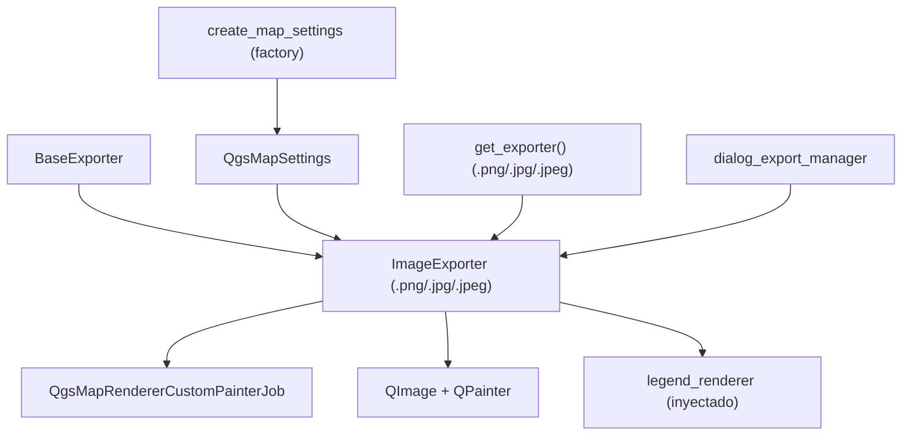

---
tags:
  - secinterp
  - code-walkthrough
  - exporters
  - raster
aliases:
  - image_exporter.py
  - ImageExporter
cssclass: secinterp-note
---

# `exporters/image_exporter.py`

> [!abstract] Resumen en una línea
> Exporter de imagen raster (PNG/JPG): renderiza un `QgsMapSettings` con `QgsMapRendererCustomPainterJob` sobre un `QImage` con antialiasing, dibuja la leyenda opcional y guarda con `QImage.save()`.

**Ruta**: `exporters/image_exporter.py` (72 líneas)
**Clase principal**: `ImageExporter(BaseExporter)`
**Capa**: Exporters (acoplado a `qgis.core` + `QtGui`: render real de mapa)
**Tags**: #secinterp #exporters #raster

---

## 🎯 ¿Por qué existe este archivo?

La vista previa del perfil vive en el canvas de QGIS. Para informes, presentaciones y
smoke tests hace falta **congelar** esa vista en un archivo raster:

| Problema | Solución |
|----------|----------|
| Congelar el render del canvas en un archivo | `QgsMapRendererCustomPainterJob` sobre `QImage` |
| PNG para calidad, JPG para peso | `get_supported_extensions` + `QImage.save()` por extensión |
| Render dentado en líneas del perfil | `Antialiasing` + `SmoothPixmapTransform` |
| Leyenda huérfana del mapa | `legend_renderer.draw_legend()` inyectado vía settings |
| Qt5 vs Qt6 (`QImage.Format` movido) | `getattr(QImage, "Format", QImage).Format_ARGB32` compatible |

> [!important] Nota arquitectónica
> Pertenece a la familia de **render** (`image`/`pdf`/`svg`): su `data` no son DTOs
> sino un `QgsMapSettings` ya configurado (capas, extent, DPI), construido aguas arriba
> por `create_map_settings` (ver [[orchestrator]]) o el `dialog_export_manager`.

---

## 🧬 Diagrama de relaciones



> [!tip] Cómo leer
> El `QgsMapSettings` entra ya cocinado (capas + extent + fondo). `ImageExporter` solo
> pinta: render del mapa, leyenda opcional y `save()`. La leyenda llega inyectada,
> nunca se construye aquí.

---

## 📦 Imports — lectura arquitectónica

```python
# exporters/image_exporter.py
from __future__ import annotations

from pathlib import Path

from qgis.core import QgsMapRendererCustomPainterJob, QgsMapSettings
from qgis.PyQt.QtCore import QRectF, QSize
from qgis.PyQt.QtGui import QColor, QImage, QPainter

from sec_interp.logger_config import get_logger

from .base_exporter import BaseExporter
```

| # | Observación |
|---|-------------|
| ① | `QgsMapRendererCustomPainterJob`: render **síncrono** (`start()` + `waitForFinished()`) sobre un painter propio, no sobre el canvas. |
| ② | `QtGui` (`QColor`, `QImage`, `QPainter`): el único exporter de datos que pinta píxeles; el resto escribe geometrías o texto. |
| ③ | Sin `typing.Any`: las firmas usan tipos Qt/QGIS reales (`QgsMapSettings`, `Path`). |
| ④ | `QRectF`/`QSize` dimensionan imagen y caja de leyenda con el mismo `(width, height)`. |
| ⑤ | `get_logger`: cualquier excepción de render se registra y devuelve `False`. |

---

## 🏗️ Inventario de estructura

**Clases:** `class ImageExporter(BaseExporter)` — 1 clase, 2 métodos.

**Métodos:**

- `get_supported_extensions() -> list[str]` — `[".png", ".jpg", ".jpeg"]`
- `export(output_path: Path, map_settings: QgsMapSettings) -> bool` — render + leyenda + `save()`

**Settings consumidos:**

| Clave | Defecto | Rol |
|-------|---------|-----|
| `width` | `800` | Ancho en píxeles |
| `height` | `600` | Alto en píxeles |
| `background_color` | `QColor(255, 255, 255)` | Fondo antes de pintar |
| `show_legend` | `True` | Interruptor de leyenda |
| `legend_renderer` | `None` | Objeto con `draw_legend(painter, rect)` |

---

## 📁 Archivos del paquete

| Archivo | Líneas | Rol |
|---|--:|---|
| `__init__.py` | 81 | `get_exporter()`: `.png`/`.jpg`/`.jpeg` → `ImageExporter` |
| `base_exporter.py` | 137 | Contrato heredado (ver [[base_exporter]]) |
| `image_exporter.py` | 72 | `ImageExporter` (esta nota) |
| `pdf_exporter.py` | 79 | Gemelo vectorial-imprimible (misma secuencia render+leyenda) |
| `svg_exporter.py` | 85 | Gemelo vectorial-escalable (misma secuencia render+leyenda) |
| `vector_exporter.py` | 122 | Datos geoespaciales (la imagen no conserva georreferencia) |
| `csv_exporter.py` | 58 | Datos tabulares exactos tras la imagen |

> [!note] Tríptico de render
> `image`/`pdf`/`svg` comparten la **misma coreografía**: settings de tamaño →
> painter + `QgsMapRendererCustomPainterJob` → leyenda opcional → guardar. Solo cambia
> el dispositivo (QImage, QPdfWriter, QSvgGenerator).

---

## 📖 Recorrido método por método

### `get_supported_extensions`

```python
def get_supported_extensions(self) -> list[str]:
    """Get supported image extensions."""
    return [".png", ".jpg", ".jpeg"]
```

El formato final lo decide la extensión del `output_path` en `QImage.save()`: `.png`
sin pérdida (recomendado para líneas finas del perfil), `.jpg`/`.jpeg` con compresión
para peso. `validate_path()` heredado acepta mayúsculas (`.PNG`).

### `export` — render completo

```python
def export(self, output_path: Path, map_settings: QgsMapSettings) -> bool:
    """Export map to raster image.

    Args:
        output_path: Output file path
        map_settings: QgsMapSettings instance configured for rendering

    Returns:
        True if export successful, False otherwise

    """
    try:
        width = self.get_setting("width", 800)
        height = self.get_setting("height", 600)
        background_color = self.get_setting("background_color", QColor(255, 255, 255))

        # Create image (Qt5/Qt6 compatibility for enum)
        img_format = getattr(QImage, "Format", QImage).Format_ARGB32
        image = QImage(QSize(width, height), img_format)
        image.fill(background_color)

        # Setup painter
        painter = QPainter(image)
        painter.setRenderHint(QPainter.RenderHint.Antialiasing)
        painter.setRenderHint(QPainter.RenderHint.SmoothPixmapTransform)

        # Render map
        job = QgsMapRendererCustomPainterJob(map_settings, painter)
        job.start()
        job.waitForFinished()

        # Draw legend if available
        show_legend = self.get_setting("show_legend", True)
        legend_renderer = self.get_setting("legend_renderer")
        if legend_renderer and show_legend:
            legend_renderer.draw_legend(painter, QRectF(0, 0, width, height))

        painter.end()

        # Save image

        return image.save(str(output_path))

    except Exception:
        logger.exception(f"Image export failed for {output_path}")
        return False
```

| Paso | Detalle |
|------|---------|
| Tamaño y fondo | `width`/`height`/`background_color` desde settings; el fondo se rellena **antes** de pintar para no dejar basura de memoria |
| Formato Qt5/Qt6 | `getattr(QImage, "Format", QImage)` resuelve el enum en ambas versiones de Qt (ver nota de migración) |
| Hints | `Antialiasing` suaviza líneas del perfil; `SmoothPixmapTransform` suaviza rásteres reescalados |
| Render | `job.start()` + `waitForFinished()`: bloquea hasta terminar (llamado desde `QgsTask`, nunca del hilo GUI) |
| Leyenda | Solo si hay renderer **y** `show_legend`: `draw_legend(painter, QRectF(0, 0, width, height))` |
| Guardado | `image.save(str(path))` devuelve `bool`: ese es el retorno (fallo de códec → `False`) |
| Fallo | Cualquier excepción → log con traceback + `False` |

> [!important] Render síncrono en background
> `waitForFinished()` bloquea el hilo llamador. Es correcto porque la GUI lo invoca
> dentro de un `QgsTask` (ver [[dialog_export_manager]]); llamarlo desde el hilo GUI
> congelaría la interfaz.

> [!note] Compatibilidad Qt5/Qt6
> En Qt5 el enum vive en `QImage.Format_ARGB32`; en Qt6, en `QImage.Format.Format_ARGB32`.
> El `getattr` con defecto `QImage` cubre ambas (ver la skill de migración QGIS 4.x).

---

## 🔄 Flujo de datos

| Fase | Entrada | Transformación | Salida |
|------|---------|----------------|--------|
| Settings | `width`, `height`, `background_color` | `QImage(w, h, ARGB32)` + `fill()` | lienzo en blanco |
| Render | `QgsMapSettings` (capas + extent) | `QgsMapRendererCustomPainterJob` síncrono | mapa pintado |
| Leyenda | `legend_renderer` inyectado | `draw_legend(painter, rect)` | overlay de leyenda |
| Guardado | `QImage` completa | `save(str(path))` según extensión | `.png`/`.jpg` + `bool` |

---

## 🧩 PNG vs JPG: cuándo usar cada uno

| Formato | Ventaja | Coste | Uso recomendado |
|---------|---------|-------|-----------------|
| `.png` | Sin pérdida: líneas finas y texto nítidos | Archivo mayor | Informes y archivo |
| `.jpg` | Peso bajo | Artefactos en bordes y texto | Vista rápida / correo |

> [!warning] La imagen no es geoespacial
> Un PNG/JPG no guarda CRS ni georreferencia: sirve para **ver**, no para medir. Los
> datos medibles viajan en el SHP/GPKG + CSV hermanos.

---

## 🏛️ Patrones de diseño presentes

| Patrón | Dónde | Propósito |
|--------|-------|-----------|
| **Template Method** | `export()` sobre [[base_exporter]] | Render con retorno `bool` |
| **Dependency Injection** | `map_settings` + `legend_renderer` por parámetros/settings | El exporter no construye escena ni leyenda |
| **Strategy (dispositivo)** | `QImage` vs `QPdfWriter` vs `QSvgGenerator` | Misma coreografía, tres salidas |
| **Compat shim** | `getattr(QImage, "Format", QImage)` | Soportar Qt5 y Qt6 sin bifurcar |

---

## 🧾 Resumen de la API

| Símbolo | Firma / Hereda | Uso típico |
|---------|----------------|------------|
| `ImageExporter` | `(BaseExporter)` | `ImageExporter({"width": 1920, "height": 1080})` |
| `export` | `(output_path: Path, map_settings: QgsMapSettings) -> bool` | `export(path, map_settings)` |
| `get_supported_extensions` | `() -> list[str]` | `[".png", ".jpg", ".jpeg"]` |

---

## 🛡️ Manejo de errores

| Situación | Comportamiento |
|-----------|----------------|
| `map_settings` sin capas o extent inválido | El job renderiza vacío; `save()` aún puede dar `True` (imagen en blanco) |
| Códec no disponible | `image.save()` devuelve `False` sin excepción |
| Excepción en render/guardado | `logger.exception` + `False` |
| `painter.end()` no alcanzado por excepción | El `QPainter` se destruye con el stack; Qt lo desactiva (sin `finally` explícito aquí, a diferencia de pdf/svg) |

---

## 🧪 Tests asociados

Mock-first en `tests/exporters/test_image_exporter.py` (painter, job y `save` mockeados):

- `test_get_supported_extensions` — las tres extensiones raster.
- `test_export_success` — job + `save() == True` → `True`.
- `test_export_with_custom_settings` — `width`/`height`/`background_color` propios.
- `test_export_exception_handling` — fallo del job → `False`.

Integración:

- `tests/exporters/test_exporters.py` — contrato `BaseExporter`.
- `tests/integration/test_export_workflow.py` — corrida completa con salidas raster.
- `tests/integration/test_qgis_smoke.py` — humo con QGIS real (render disponible).

---

## 👀 Observaciones y notas

> [!success] Fortalezas
> - Tríptico coherente con pdf/svg: aprender uno es aprender los tres.
> - Leyenda inyectada y conmutable: sin acoplo a su construcción.
> - Compat Qt5/Qt6 explícita en una línea.
> - `save()` como retorno: el éxito lo decide el códec, no una suposición.

> [!warning] Puntos de atención
> - Sin `try/finally` para `painter.end()`: si el job lanza, el painter queda sin `end()` explícito (Qt lo tolera, pero pdf/svg sí blindan).
> - Una imagen en blanco (settings vacíos) puede devolver `True`: éxito de escritura, no de contenido.
> - `width`/`height` gigantes → `QImage` enorme en memoria sin validación previa.
> - Sin georreferencia: no sustituye al vectorial para medir.

> [!question] Preguntas abiertas
> - ¿Añadir `finally: painter.end()` por simetría con pdf/svg?
> - ¿Validar tamaño máximo (p. ej. 8000 px) antes de reservar el `QImage`?
> - ¿Comprobar `image.isNull()` tras crearla para fallar pronto?

---

## 🔗 Notas relacionadas

- [[Index]] — índice de la bóveda
- [[base_exporter]] — contrato heredado
- [[pdf_exporter]] / [[svg_exporter]] — gemelos de render (misma coreografía)
- [[exporters]] — nota de capa del paquete
- [[orchestrator]] — `get_map_settings` / `create_map_settings` que cocina el `QgsMapSettings`
- [[dialog_export_manager]] — GUI que configura tamaño y leyenda
- [[preview_renderer]] — render de la vista previa que se congela
- [[dtos]] — `PreviewResult` cuyos datos se visualizan
- [[exceptions]] — `ExportError` aguas arriba

---

*Nota de la bóveda SecInterp Code Walkthrough v2 — v3.9.1*
