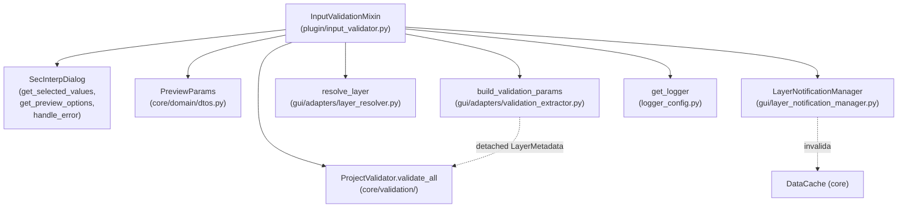

---
tags:
  - secinterp
  - code-walkthrough
  - plugin
aliases:
  - input_validator.py
  - InputValidationMixin
cssclass: secinterp-note
---

# `plugin/input_validator.py`

> [!abstract] Resumen en una línea
> Mixin de frontera del plugin que extrae los valores del diálogo, construye y valida un `PreviewParams`, lo somete al `ProjectValidator` del core y arma las notificaciones de cambio de capa.

**Ruta**: `plugin/input_validator.py` (106 líneas)
**Clase principal**: `InputValidationMixin`
**Capa**: Plugin / GUI (depende de QGIS vía `QgsMapLayer` solo en tipos)
**Tags**: #secinterp #plugin

---

## 🎯 ¿Por qué existe este archivo?

El plugin necesita un único punto donde los widgets del diálogo se convierten en
parámetros validados antes de que corra cualquier cálculo. Sin esta frontera, cada
llamada al preview repetiría la extracción y validaría a medias:

| Problema | Solución |
|----------|----------|
| El diálogo expone widgets, no parámetros tipados | `_get_and_validate_inputs` lee `get_selected_values()` + `get_preview_options()` y construye un `PreviewParams` |
| La validación mezcla primitivas (banda, buffer) con estado del proyecto (capas) | Dos niveles: `params.validate()` para primitivas y `ProjectValidator.validate_all()` para capas vía `LayerMetadata` desacoplado |
| Un error de entrada no debe tumbar el plugin | Cuatro cláusulas `except` que convierten cada familia de error en `handle_error` + `None` |
| El caché debe invalidarse si una capa cambia tras validar | Al validar con éxito se conecta el `layer_notification_manager` con las capas activas |

> [!important] Nota arquitectónica
> Es un **Adapter de frontera (Extract + Guard)**: vive en la capa plugin/GUI porque
> lee widgets QGIS, pero delega toda la decisión al core (`PreviewParams.validate` y
> `ProjectValidator`). El core nunca ve el diálogo; solo recibe el DTO ya validado.

---

## 🧬 Diagrama de relaciones



> [!tip] Cómo leer
> Flecha sólida = importa/delega; punteada = dato desacoplado que cruza la frontera
> GUI → core (`ValidationParams` con `LayerMetadata`, invalidación de caché).

---

## 📦 Imports — lectura arquitectónica

```python
# plugin/input_validator.py
from __future__ import annotations

import contextlib

from qgis.core import QgsMapLayer

from sec_interp.core.domain import PreviewParams
from sec_interp.core.exceptions import SecInterpError
from sec_interp.gui.adapters.layer_resolver import resolve_layer
from sec_interp.logger_config import get_logger
```

| # | Observación |
|---|-------------|
| ① | `contextlib` solo se usa en `disconnect_layer_notifications` para suprimir errores de desconexión. Import de stdlib sin coste. |
| ② | `QgsMapLayer` aparece **solo como anotación** de retorno en `_collect_active_layers`; ninguna lógica QGIS vive aquí. La resolución real está en `resolve_layer`. |
| ③ | `PreviewParams` es el DTO del dominio: el mixin lo construye pero no lo procesa. Frontera Extract limpia. |
| ④ | `SecInterpError` es la única excepción de dominio capturada de forma específica: distingue "configuración inválida" de errores de programación. |
| ⑤ | `resolve_layer` (adapter GUI) convierte ids de capa en objetos `QgsMapLayer` para el monitoreo, no para el cómputo. |
| ⑥ | `get_logger(__name__)` sigue el estándar del proyecto: un logger por módulo. |
| ⑦ | `ProjectValidator` y `build_validation_params` se importan **dentro del método** (líneas 60-61), no arriba: import diferido que evita ciclos entre plugin, core.validation y gui.adapters. |

> [!note] Import diferido intencional
> `from sec_interp.core.validation.project_validator import ProjectValidator` y
> `from sec_interp.gui.adapters.validation_extractor import build_validation_params`
> viven dentro de `_get_and_validate_inputs` para no crear una dependencia de módulo
> entre la capa plugin y los adapters en tiempo de importación.

---

## 🏗️ Inventario de estructura

**Clases:** `class InputValidationMixin` — 3 métodos, sin `__init__` ni estado propio.

**Funciones/Métodos:**

- `_get_and_validate_inputs(self) -> PreviewParams | None` — extracción + doble validación + armado de notificaciones.
- `disconnect_layer_notifications(self) -> None` — desconexión defensiva del monitor de capas.
- `_collect_active_layers(self, params: PreviewParams) -> dict[str, QgsMapLayer]` — mapa bucket → capa viva para monitoreo.

> [!tip] Mixin sin estado
> La clase no declara atributos: opera sobre `self.dlg` y
> `self.layer_notification_manager`, que provee la clase huésped `SecInterp`
> (ver [[sec_interp_plugin]]). Es composición por herencia, documentada en [[plugin]].

---

## 📁 Archivos del paquete

Este módulo es uno de los tres mixins documentados en la nota de grupo [[plugin]].
Ver la tabla de archivos del paquete allí; aquí solo el recorrido de este archivo.

---

## 📖 Recorrido método por método

### `_get_and_validate_inputs` — extracción y doble validación

```python
def _get_and_validate_inputs(self) -> PreviewParams | None:
    """Retrieve and validate dialog inputs, then arm layer notifications."""
    values = self.dlg.get_selected_values()
    preview_options = self.dlg.get_preview_options()
```

La lectura ocurre en dos llamadas al diálogo (ver [[main_dialog]] y la fachada
`DialogFacadeMixin`):

| Llamada | Origen | Contenido |
|---------|--------|-----------|
| `self.dlg.get_selected_values()` | páginas del diálogo (DEM, sección, geología, estructuras, sondajes) | ids de capa, campos, banda, buffer, factor de escala |
| `self.dlg.get_preview_options()` | página de preview | `max_points`, `auto_lod` y banderas de visibilidad |

```python
    try:
        params = PreviewParams(
            raster_layer=values.get("raster_layer"),
            line_layer=values.get("crossline_layer"),
            band_num=values.get("selected_band", 1),
            buffer_dist=values.get("buffer_distance", 100.0),
            outcrop_layer=values.get("outcrop_layer"),
            outcrop_name_field=values.get("outcrop_name_field"),
            struct_layer=values.get("structural_layer"),
            dip_field=values.get("dip_field"),
            strike_field=values.get("strike_field"),
            dip_scale_factor=values.get("dip_scale_factor", 1.0),
            collar_layer=values.get("collar_layer_obj"),
            collar_id_field=values.get("collar_id_field"),
            collar_use_geometry=values.get("collar_use_geometry", True),
            collar_x_field=values.get("collar_x_field"),
            collar_y_field=values.get("collar_y_field"),
            collar_z_field=values.get("collar_z_field"),
            collar_depth_field=values.get("collar_depth_field"),
            survey_layer=values.get("survey_layer_obj"),
            survey_id_field=values.get("survey_id_field"),
            survey_depth_field=values.get("survey_depth_field"),
            survey_azim_field=values.get("survey_azim_field"),
            survey_incl_field=values.get("survey_incl_field"),
            interval_layer=values.get("interval_layer_obj"),
            interval_id_field=values.get("interval_id_field"),
            interval_from_field=values.get("interval_from_field"),
            interval_to_field=values.get("interval_to_field"),
            interval_lith_field=values.get("interval_lith_field"),
            max_points=preview_options.get("max_points", 1000),
            auto_lod=preview_options.get("auto_lod", True),
            canvas_width=self.dlg.preview_widget.canvas.width(),
        )
        params.validate()
```

Tres decisiones de diseño visibles en este bloque:

1. **Defaults defensivos**: `selected_band → 1`, `buffer_distance → 100.0`,
   `dip_scale_factor → 1.0`, `max_points → 1000`, `auto_lod → True`. Si una página
   aún no publicó su valor, el DTO nace con un valor operativo en vez de `None`.
2. **Nombres de clave como contrato implícito**: `crossline_layer`,
   `structural_layer`, `collar_layer_obj` son las claves que produce
   `get_selected_values()`; cambiar una clave allí rompe este constructor. Es el
   acoplamiento más frágil del módulo.
3. **`canvas_width` sale del canvas vivo** (`self.dlg.preview_widget.canvas.width()`):
   alimenta el LOD automático del preview (ver [[preview_task_orchestrator]]).

```python
        from sec_interp.core.validation.project_validator import ProjectValidator
        from sec_interp.gui.adapters.validation_extractor import build_validation_params

        ProjectValidator.validate_all(build_validation_params(params))
```

Segundo nivel de validación: `build_validation_params(params)` convierte cada
referencia de capa del `PreviewParams` en `LayerMetadata` desacoplado (ver
[[validation_extractor]]), y `ProjectValidator.validate_all()` ejecuta el pipeline
de validadores (sección, DEM, geología, estructuras, sondajes, salida). Ver
[[project_validator]]. El core valida **metadatos**, nunca widgets ni capas vivas.

```python
    except SecInterpError as e:
        self.dlg.handle_error(e, self.tr("Configuration Error"))
        return None
    except (ValueError, TypeError, KeyError, AttributeError) as e:
        self.dlg.handle_error(e, self.tr("Input Processing Error"))
        return None
    except (MemoryError, SystemError, KeyboardInterrupt):
        raise
    except Exception as e:
        logger.exception("Unexpected error during input processing")
        self.dlg.handle_error(e, self.tr("Unexpected Error"))
        return None

    self.layer_notification_manager.connect(self._collect_active_layers(params))
    return params
```

> [!important] Escalera de excepciones
> El orden es deliberado: primero el error de dominio esperado (`SecInterpError`,
> que incluye `ValidationError`), luego los errores de programación/contrato
> (`ValueError`, `TypeError`, `KeyError`, `AttributeError`), después los fatales que
> **siempre se re-lanzan** (`MemoryError`, `SystemError`, `KeyboardInterrupt`) y al
> final el paraguas `Exception` con `logger.exception` (traza completa). Solo si
> todo pasa se arma el monitoreo de capas y se devuelve `params`; cualquier fallo
> devuelve `None`, que los llamadores interpretan como "no hay preview".

### `disconnect_layer_notifications` — desconexión defensiva

```python
def disconnect_layer_notifications(self) -> None:
    """Disconnect the layer-change notification manager."""
    if getattr(self, "layer_notification_manager", None):
        with contextlib.suppress(Exception):
            self.layer_notification_manager.disconnect()
```

Doble defensa: `getattr(..., None)` cubre el caso de un huésped parcialmente
inicializado (el manager se crea con `SafeLoader.lazy_load` en `SecInterp.__init__`
y podría faltar), y `contextlib.suppress(Exception)` cubre señales ya
desconectadas o capas eliminadas. Se invoca desde el ciclo de apagado (ver
[[lifecycle]], `disconnect_signals`), por lo que nunca debe lanzar.

### `_collect_active_layers` — mapa bucket → capa

```python
def _collect_active_layers(self, params: PreviewParams) -> dict[str, QgsMapLayer]:
    """Collect all active layer objects from parameter IDs for monitoring."""
    mapping = {
        "topo": params.raster_layer,
        "section": params.line_layer,
        "geol": params.outcrop_layer,
        "struct": params.struct_layer,
        "drill_collar": params.collar_layer,
        "drill_survey": params.survey_layer,
        "drill_interval": params.interval_layer,
    }

    active_layers = {}
    for bucket, lid in mapping.items():
        if not lid:
            continue
        lyr = resolve_layer(lid)
        if lyr:
            active_layers[bucket] = lyr

    return active_layers
```

| Detalle | Razón |
|---------|-------|
| Buckets `topo`, `section`, `geol`, `struct`, `drill_collar/survey/interval` | Espejan los namespaces del caché del core; `LayerNotificationManager` mapea los tres de sondaje al bucket `drill` |
| `if not lid: continue` | Capas opcionales (geología, estructuras, sondajes) simplemente no se monitorean |
| `resolve_layer(lid)` + `if lyr` | Un id huérfano (capa eliminada del proyecto) se ignora en vez de fallar |
| Retorna dict vacío si no hay capas | `connect({})` tras `disconnect()` interno deja el manager limpio |

---

## 🔄 Flujo de datos

| Fase | Entrada | Transformación | Salida |
|------|---------|----------------|--------|
| Extract | widgets del diálogo | `get_selected_values()` + `get_preview_options()` | `values`, `preview_options` (dicts) |
| Build | dicts + ancho del canvas | constructor `PreviewParams(...)` con defaults | DTO sin validar |
| Guard 1 (primitivas) | DTO | `params.validate()` (buffer ≥ 0, banda ≥ 1) | lanza `ValueError` si falla |
| Adapt | DTO con refs de capa | `build_validation_params(params)` | `ValidationParams` con `LayerMetadata` |
| Guard 2 (proyecto) | metadatos | `ProjectValidator.validate_all(...)` | lanza `SecInterpError` si falla |
| Arm | `PreviewParams` válido | `_collect_active_layers` + `connect` | monitoreo activo, retorna `params` |
| Fallo | cualquier excepción | `handle_error` + `return None` | el llamador aborta el preview |

---

## 🏛️ Patrones de diseño presentes

| Patrón | Dónde | Propósito |
|--------|-------|-----------|
| **Guard / Boundary validation** | `_get_and_validate_inputs` | Nada sin validar cruza hacia el cómputo |
| **Adapter (Extract)** | `build_validation_params` + `resolve_layer` | Convertir mundo QGIS en tipos del core |
| **Mixin** | clase sin estado sobre `SecInterp` | Componer comportamiento sin herencia profunda |
| **Fail-soft (`None`)** | todos los `except` con `return None` | Un input malo cancela la operación, no el plugin |
| **Observer (armado)** | `layer_notification_manager.connect` | Invalidar caché cuando una capa cambia |

---

## 🧾 Resumen de la API

| Símbolo | Firma | Uso típico |
|---------|-------|------------|
| `InputValidationMixin` | mixin sin `__init__` | heredado por `SecInterp` |
| `_get_and_validate_inputs` | `(self) -> PreviewParams \| None` | antes de cada preview o cómputo |
| `disconnect_layer_notifications` | `(self) -> None` | en `unload` / `disconnect_signals` |
| `_collect_active_layers` | `(params) -> dict[str, QgsMapLayer]` | construir el mapa de monitoreo |

---

## 🛡️ Manejo de errores

| Excepción | Título mostrado | Origen típico |
|-----------|-----------------|---------------|
| `SecInterpError` (incl. `ValidationError`) | "Configuration Error" | `params.validate()` no; `ProjectValidator` sí, más `ValueError` del DTO (ver nota) |
| `ValueError`, `TypeError`, `KeyError`, `AttributeError` | "Input Processing Error" | `params.validate()` (`ValueError`), claves ausentes, canvas nulo |
| `MemoryError`, `SystemError`, `KeyboardInterrupt` | — (se re-lanza) | fatales: nunca se tragan |
| `Exception` | "Unexpected Error" + traza en log | cualquier otro fallo |

> [!warning] Solape `ValueError` entre niveles
> `PreviewParams.validate()` (ver [[dtos]]) lanza `ValueError`, no
> `ValidationError`, así que un buffer negativo cae en "Input Processing Error" y no
> en "Configuration Error". El comportamiento es correcto (retorna `None` en ambos),
> pero el título mostrado difiere según el nivel que falle.

---

## 🧪 Tests asociados

No existe un módulo dedicado `tests/plugin/test_input_validator.py`; la cobertura es
indirecta a través de los colaboradores:

- `tests/core/test_project_validator.py` — el validador que este mixin invoca.
- `tests/core/test_validation.py` y `tests/core/validation/test_validators.py` — validadores por dominio (DEM, sección, geología, estructuras, sondajes).
- `tests/gui/test_dialog_input_manager.py` — lectura de valores del diálogo (`get_selected_values`).
- `tests/gui/test_main_dialog_validation_manager.py` — cableado de validación en el diálogo.
- `tests/gui/test_dialog_preview_manager.py` — el consumidor que aborta cuando la validación retorna `None`.

> [!note] Hueco de cobertura honesto
> El mapeo bucket → capa (`_collect_active_layers`) y la escalera de `except` no
> tienen tests directos. Un test con `unittest.mock` del diálogo y del manager
> sería barato de escribir porque el mixin no toca QGIS salvo tipos.

---

## 👀 Observaciones y notas

> [!success] Fortalezas
> - Frontera clara: el core solo recibe DTOs y metadatos desacoplados.
> - Escalera de excepciones bien ordenada con re-lanzado de fatales.
> - Desconexión defensiva apta para el apagado (`unload` nunca falla por aquí).
> - Buckets de monitoreo alineados con los namespaces del caché.

> [!warning] Puntos de atención
> - Las claves de `values` (`crossline_layer`, `structural_layer`, `*_obj`) son un contrato implícito con la fachada del diálogo; un renombre silencioso rompe la construcción.
> - `canvas_width` asume `self.dlg.preview_widget.canvas` vivo; si el diálogo aún no se mostró, `AttributeError` cae en "Input Processing Error".
> - `ValueError` del nivel 1 y `ValidationError` del nivel 2 se reportan con títulos distintos aunque ambos son "input inválido".

> [!question] Preguntas abiertas
> - ¿Tipar las claves de `values` con un `TypedDict` para que el contrato con la fachada sea explícito?
> - ¿Unificar `params.validate()` a `ValidationError` para un solo título de error de configuración?

---

## 🔗 Notas relacionadas

- [[Index]] — índice de la bóveda
- [[plugin]] — nota de grupo del paquete `plugin/`
- [[sec_interp_plugin]] — clase huésped `SecInterp` que hereda este mixin
- [[lifecycle]] — ciclo `init → dialog → cleanup` que usa la desconexión
- [[render_pipeline]] — el siguiente paso tras validar: dibujar el preview
- [[main_dialog]] — `get_selected_values`, `get_preview_options`, `handle_error`
- [[controller]] — `ProfileController.generate_profile_data`, consumidor del `PreviewParams`
- [[project_validator]] — `ProjectValidator.validate_all` (nivel 2)
- [[validation_extractor]] — `build_validation_params` y `LayerMetadata`
- [[layer_resolver]] — `resolve_layer`
- [[layer_notification_manager]] — monitoreo e invalidación de caché
- [[preview_task_orchestrator]] — LOD y `max_points`/`canvas_width`
- [[dtos]] — `PreviewParams.validate()`
- [[logger_config]] — `get_logger`

---

*Nota de la bóveda SecInterp Code Walkthrough v2 — v3.8.0*
