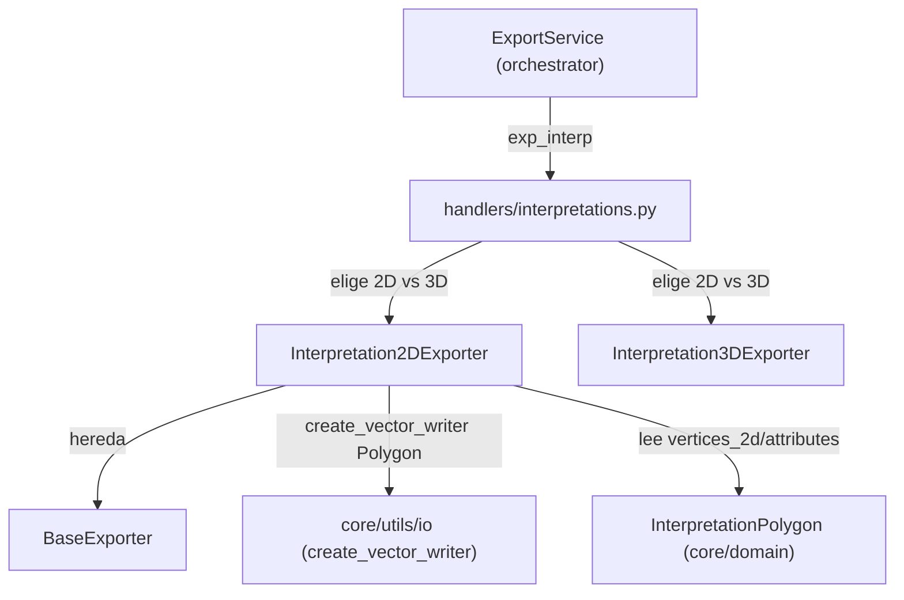

---
tags:
  - secinterp
  - code-walkthrough
  - exporters
  - interpretations
aliases:
  - interpretation_exporters.py
  - Interpretation2DExporter
cssclass: secinterp-note
---

# `exporters/interpretation_exporters.py`

> [!abstract] Resumen en una línea
> Exporta los polígonos de interpretación en coordenadas 2D del perfil (`distancia, elevación`) como `Polygon` con 5 campos fijos más una columna por cada atributo custom.

**Ruta**: `exporters/interpretation_exporters.py` (146 líneas)
**Clase principal**: `Interpretation2DExporter(BaseExporter)`
**Capa**: Exporters (GUI · QGIS-dependiente, hereda de `BaseExporter`)
**Tags**: #secinterp #exporters #interpretations

---

## 🎯 ¿Por qué existe este archivo?

Las interpretaciones se digitalizan sobre el perfil (ver [[interpretation_tool]] y la
página de interpretación [[interpretation_page]]). El producto 2D es el SHP que se
superpone exactamente a topografía, geología y estructuras porque comparte su sistema
`(dist, elev)`:

| Problema | Solución |
|----------|----------|
| Persistir los polígonos dibujados sobre la sección | `export`: un feature `Polygon` por `InterpretationPolygon` |
| Los atributos custom varían por polígono | `_prepare_fields`: unión ordenada de claves → columnas `QString(255)` |
| Anillos sin cerrar rompen el polígono SHP | `_create_feature` añade el punto inicial al final si falta |
| Reutilizar el exporter dentro de un GPKG | Parámetro `layer_name` propagado al writer |

> [!important] Nota arquitectónica — gemelo 2D deliberadamente simple
> Frente a [[interpretation_3d_exporter]] (465 líneas, proyección azimutal + QML),
> este módulo no transforma nada: escribe `vertices_2d` tal cual. Es el path por defecto
> de `exp_interp` cuando el handler elige 2D (ver [[interpretations]] y [[orchestrator]]).

---

## 🧬 Diagrama de relaciones



> [!tip] Cómo leer
> El handler `interpretations` (ver [[interpretations]]) instancia este exporter o el 3D
> según las opciones. Ambos comparten esquema de campos: los SHP 2D y 3D son unibles
> por atributo.

---

## 📦 Imports — lectura arquitectónica

```python
# exporters/interpretation_exporters.py
from __future__ import annotations

from pathlib import Path  # noqa: E402
from typing import Any  # noqa: E402

from qgis.core import (  # noqa: E402
    QgsFeature,
    QgsField,
    QgsFields,
    QgsGeometry,
    QgsPointXY,
    QgsVectorFileWriter,
    QgsWkbTypes,
)
from qgis.PyQt.QtCore import QMetaType  # noqa: E402

import sec_interp.core.utils.io as scu_io  # noqa: E402
from sec_interp.exporters.base_exporter import BaseExporter  # noqa: E402
from sec_interp.logger_config import get_logger  # noqa: E402
```

| # | Observación |
|---|-------------|
| ① | Doble docstring de módulo (líneas 1 y 5–8): fachada + descripción; los `# noqa: E402` revelan que hubo imports tras código. |
| ② | `QgsVectorFileWriter` importado **solo** para comparar `WriterError.NoError` (el writer real lo crea `scu_io`). |
| ③ | `QgsWkbTypes.Type.Polygon` explícito (2D plano), frente a `PolygonZ` del gemelo 3D. |
| ④ | Sin `QCoreApplication`, sin `QColor`, sin `math`: no hay proyección ni estilo aquí. |
| ⑤ | `Path` tipa `output_path` (más estricto que el `Any`/`str` de otros exporters). |

---

## 🏗️ Inventario de estructura

**Clase:** `Interpretation2DExporter(BaseExporter)` — 4 métodos + constructor.

**Métodos:**
- `__init__(settings: dict[str, Any]) -> None` — delega en `BaseExporter.__init__`
- `export(output_path: Path, data: dict[str, Any], layer_name: str | None = None) -> bool`
- `_prepare_fields(interpretations: list[Any]) -> tuple[QgsFields, list[str]]`
- `_create_feature(interp: Any, fields: QgsFields, sorted_keys: list[str]) -> QgsFeature`
- `get_supported_extensions() -> list[str]`

> [!note] Sin constantes de validación
> Este es el único exporter de la fase que no define constantes de módulo: el cierre del
> anillo se comprueba inline (`points[0] != points[-1]`) y no hay umbral de vértices
> mínimos (un polígono de 2 puntos produce un `Polygon` degenerado en vez de omitirse).

---

## 📁 Archivos del paquete `exporters/`

| Archivo | Rol respecto a esta nota |
|---|---|
| `interpretation_exporters.py` | Esta nota: `Polygon` 2D del perfil |
| [[interpretation_3d_exporter]] | Gemelo 3D: `PolygonZ` + proyección azimutal + QML |
| [[drillhole_exporters]] | Patrón hermano: trazas/intervalos 2D con `fromPolylineXY` |
| [[base_exporter]] | `BaseExporter`: `settings`, `validate_path`, `get_setting` |
| [[exporters]] | Fachada del paquete + `get_exporter()` por extensión |

---

## 📖 Recorrido método por método

### `__init__`

```python
def __init__(self, settings: dict[str, Any]) -> None:
    """Initialize with settings.

    Args:
        settings: Dictionary of configuration settings.

    """
    super().__init__(settings)
```

Constructor passthrough: guarda `settings` vía la base. La mayoría de exporters del
paquete ni siquiera lo declaran (heredan el de `BaseExporter`); aquí está explícito
con docstring Google-style.

### `export` — escritura directa sin transformación

```python
def export(
    self,
    output_path: Path,
    data: dict[str, Any],
    layer_name: str | None = None,
) -> bool:
    interpretations = data.get("interpretations", [])
    if not interpretations:
        logger.warning("No interpretations to export.")
        return False

    try:
        crs = data.get("crs")

        fields, sorted_keys = self._prepare_fields(interpretations)
        writer = scu_io.create_vector_writer(
            str(output_path),
            crs,
            fields,
            geometry_type=QgsWkbTypes.Type.Polygon,
            layer_name=layer_name,
        )

        if writer.hasError() != QgsVectorFileWriter.WriterError.NoError:
            logger.error(f"Failed to create writer for {output_path}: {writer.errorMessage()}")
            return False

        for interp in interpretations:
            feat = self._create_feature(interp, fields, sorted_keys)
            if feat:
                writer.addFeature(feat)

        del writer  # Flushes and closes the file
        logger.info(f"Successfully exported to {output_path}")
        return True

    except Exception:
        logger.exception(f"Failed to export interpretations to {output_path}")
        return False
```

| Paso | Comportamiento |
|------|----------------|
| 1. Guarda | Lista vacía → `warning` + `False` (mismo mensaje que el gemelo 3D en 2D) |
| 2. Writer | Nótese `geometry_type=` como **keyword** (los exporters de sondajes lo pasan posicional o lo omiten) |
| 3. Chequeo | `hasError()` aquí retorna `False` con `logger.error` — contrasta con el 3D, que **lanza** `ExportError` |
| 4. Bucle | Cada feature pasa por `if feat:` defensivo aunque `_create_feature` nunca retorna `None` hoy |
| 5. Cierre | `del writer` + `info` de éxito; excepción → `exception` + `False` |

> [!tip] `crs` puede ser `None`
> A diferencia de los exporters de sondajes (que exigen `crs`), aquí no hay guarda
> `not crs`: el writer recibe lo que haya. Si el handler siempre pasa CRS, el SHP sale
> georreferenciado; si no, el writer decide el default.

### `_prepare_fields` — esquema fijo + custom ordenados

```python
def _prepare_fields(self, interpretations: list[Any]) -> tuple[QgsFields, list[str]]:
    """Identify custom attributes and create fields."""
    all_attr_keys = set()
    for interp in interpretations:
        if interp.attributes:
            all_attr_keys.update(interp.attributes.keys())

    sorted_keys = sorted(all_attr_keys)
    fields = QgsFields()
    fields.append(QgsField("id", QMetaType.Type.QString, len=50))
    fields.append(QgsField("name", QMetaType.Type.QString, len=100))
    fields.append(QgsField("type", QMetaType.Type.QString, len=50))
    fields.append(QgsField("color", QMetaType.Type.QString, len=10))
    fields.append(QgsField("created_at", QMetaType.Type.QString, len=30))

    for key in sorted_keys:
        fields.append(QgsField(key, QMetaType.Type.QString, len=255))
    return fields, sorted_keys
```

Idéntico al `_prepare_fields` del exporter 3D salvo el contenedor (`QgsFields` directo
aquí, lista + `_make_fields_obj` allí): 5 fijos con longitudes SHP + custom
`QString(255)` ordenados. Los polígonos sin `attributes` (`None` o `{}`) simplemente
no aportan claves.

### `_create_feature` — anillo, cierre y atributos posicionales

```python
def _create_feature(self, interp: Any, fields: QgsFields, sorted_keys: list[str]) -> QgsFeature:
    """Create a QgsFeature with geometry and attributes."""
    # Create polygon geometry from 2D vertices
    points = [QgsPointXY(x, y) for x, y in interp.vertices_2d]

    # Ensure polygon is closed
    if points and points[0] != points[-1]:
        points.append(points[0])

    geom = QgsGeometry.fromPolygonXY([points])

    feature = QgsFeature(fields)
    feature.setGeometry(geom)

    # Set attributes
    attrs = [
        interp.id,
        interp.name,
        interp.type,
        interp.color,
        interp.created_at,
    ]

    for key in sorted_keys:
        val = interp.attributes.get(key, "")
        attrs.append(str(val))

    feature.setAttributes(attrs)
    return feature
```

Tres decisiones a notar: (1) el cierre compara `QgsPointXY` con `!=` (igualdad exacta,
sin tolerancia); (2) los atributos se fijan **posicionalmente** con `setAttributes`
(orden = orden de creación de campos: los 5 fijos primero, luego custom en
`sorted_keys`); (3) los custom se normalizan con `str(val)` y default `""`, así que un
valor numérico o `None` nunca rompe el `QString`.

> [!warning] Acoplamiento posicional
> `setAttributes(attrs)` exige que el orden de `attrs` coincida exactamente con el de
> `fields`. Si alguien reordena `_prepare_fields` sin tocar `_create_feature`, los
> valores caen en columnas equivocadas sin error. El gemelo 3D evita esto con
> `setAttribute("name", ...)` por nombre.

### `get_supported_extensions`

```python
def get_supported_extensions(self) -> list[str]:
    """Get supported file extensions."""
    return [".shp", ".gpkg", ".dxf"]
```

Cierra el contrato `BaseExporter`. Las tres salidas vectoriales, igual que todos los
writers de la fase.

---

## 🔄 Flujo de datos

| Fase | Entrada | Transformación | Salida |
|------|---------|----------------|--------|
| Guarda | `data["interpretations"]` | vacía → `warning` + `False` | Nada |
| Campos | `attributes` de cada polígono | unión ordenada | `QgsFields` + `sorted_keys` |
| Writer | `output_path`, `crs`, `Polygon` | `create_vector_writer` + `hasError` | Writer o `False` |
| Features | `vertices_2d` por polígono | cierre + `fromPolygonXY` + `setAttributes` | 1 `Polygon` por interpretación |
| Cierre | writer con features | `del writer` | `True` + `info` |

---

## 🏛️ Patrones de diseño presentes

| Patrón | Dónde | Propósito |
|--------|-------|-----------|
| **Template Method** | `BaseExporter` → `export` | Contrato común de la fase |
| **Schema union** | `_prepare_fields` | Columnas = unión de claves custom |
| **Defensive copy (cierre)** | `_create_feature` | `points.append(points[0])` sobre lista local, no sobre `vertices_2d` |
| **String normalization** | `str(val)` + `""` | Todo custom cabe en `QString` |
| **Boolean status** | `export -> bool` | El handler decide el mensaje sin excepciones |

---

## 🧾 Resumen de la API

| Símbolo | Firma / Hereda | Uso típico |
|---------|----------------|------------|
| `Interpretation2DExporter` | `(BaseExporter)` | Polígonos de sección → SHP `Polygon` |
| `__init__` | `(settings: dict[str, Any]) -> None` | Passthrough a `BaseExporter` |
| `export` | `(output_path: Path, data, layer_name=None) -> bool` | `data = {"interpretations": [...], "crs": ...}` |
| `_prepare_fields` | `(interpretations) -> tuple[QgsFields, list[str]]` | 5 fijos + custom ordenados |
| `_create_feature` | `(interp, fields, sorted_keys) -> QgsFeature` | Cierre + `fromPolygonXY` + `setAttributes` |
| `get_supported_extensions` | `() -> list[str]` | `[".shp", ".gpkg", ".dxf"]` |

---

## 🛡️ Manejo de errores

| Situación | Comportamiento |
|-----------|----------------|
| `interpretations` vacía | `warning` + `False` |
| Writer con error (`hasError`) | `logger.error` con `errorMessage()` + `False` (no lanza) |
| Excepción en `export` | `logger.exception` + `False` |
| Anillo sin cerrar | Se cierra automáticamente |
| Custom ausente en un polígono | `""` (celda vacía, no NULL) |
| `crs = None` | Se propaga al writer (sin guarda propia) |

> [!note] Contraste de severidad con el gemelo 3D
> Misma condición (writer roto), distinta respuesta: 2D → `False` + log; 3D →
> `ExportError`. La razón es histórica: el path 2D es el legacy y sus handlers ya
> tratan `False` como fallo reportable (ver [[orchestrator]] y [[exceptions]]).

---

## 🧪 Tests asociados

**Unit (mock-first)** en `tests/exporters/test_interpretation_exporters.py`:

- `test_get_supported_extensions` — las tres extensiones vectoriales.
- `test_export_empty_data` — lista vacía → `False`.
- `test_export_success` — features escritas con writer mockeado (`mock_writer_factory`).
- `test_export_writer_error` — `hasError()` simulado → `False`.
- `test_export_exception` — excepción en escritura → `False`.

**Integración** en `tests/integration/test_export_service_e2e.py`:

- `test_export_interpretations_creates_2d_shp` — SHP 2D real de punta a punta.
- `test_export_interpretations_skips_when_empty` — skip benigno sin datos.
- `test_export_nothing_when_all_options_disabled` — guardia de opciones.

**Workflow** en `tests/integration/test_interpretation_workflow.py` — ciclo de vida de
interpretaciones (digitalización → datos → exportación).

---

## 👀 Observaciones y notas

> [!success] Fortalezas
> - El módulo más simple de la fase: 146 líneas, sin trigonometría ni estilo.
> - Esquema de campos idéntico al 3D: SHP 2D y 3D combinables por atributo.
> - `str(val)` + `""` hace imposible un fallo de tipos en columnas custom.
> - Cobertura unitaria completa de las ramas (`empty/success/writer_error/exception`).

> [!warning] Puntos de atención
> - `setAttributes` posicional: frágil ante reordenamientos de `_prepare_fields`.
> - Sin umbral de vértices mínimos: un polígono degenerado se escribe igual.
> - `crs=None` no se valida aquí (los exporters de sondajes sí lo exigen).
> - `if feat:` defensivo pero `_create_feature` nunca retorna `None` (código muerto parcial).
> - Doble docstring de módulo + `noqa: E402` generalizados: higiene de imports mejorable.

> [!question] Preguntas abiertas
> - ¿Migrar a `setAttribute` por nombre como el gemelo 3D para romper el acople posicional?
> - ¿Añadir guarda `not crs → False` por simetría con los exporters de sondajes?
> - ¿Omitir polígonos con < 3 vértices únicos como hace el 3D (`MIN_VALID_POLYGON_VERTICES`)?

---

## 🔗 Notas relacionadas

- [[Index]] — índice de la bóveda
- [[exporters]] — fachada del paquete `exporters/`
- [[base_exporter]] — `BaseExporter`, clase base
- [[interpretation_3d_exporter]] — gemelo 3D (`PolygonZ`, azimut, QML)
- [[interpretations]] — handler `exp_interp` (dispatch 2D/3D)
- [[orchestrator]] — `ExportService`, orquestación general
- [[domain]] — `InterpretationPolygon` (`vertices_2d`, `attributes`, `color`)
- [[interpretation_tool]] — digitalización de los polígonos que aquí se escriben
- [[dialog_export_manager]] — GUI que inicia la exportación

---

*Nota de la bóveda SecInterp Code Walkthrough v2 — v3.9.0*
