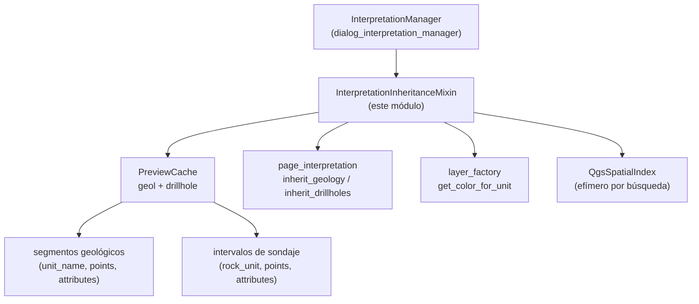

---
tags:
  - secinterp
  - code-walkthrough
  - gui
  - mixins
aliases:
  - interpretation_inheritance_mixin.py
  - InterpretationInheritanceMixin
cssclass: secinterp-note
---

# `gui/interpretation_inheritance_mixin.py`

> [!abstract] Resumen en una línea
> Mixin que hereda atributos a un polígono de interpretación recién digitalizado desde el segmento geológico o intervalo de sondaje geométricamente más cercano, usando `QgsSpatialIndex` sobre el caché de preview compartido.

**Ruta**: `gui/interpretation_inheritance_mixin.py` (190 líneas)
**Clase principal**: `InterpretationInheritanceMixin`
**Capa**: GUI (mixin de presentación · geometría QGIS sobre caché Extract)
**Tags**: #secinterp #gui #mixins

---

## 🎯 ¿Por qué existe este archivo?

Cuando el usuario digitaliza una interpretación sobre el perfil, lo natural es que
herede el nombre de la unidad geológica o del intervalo de sondaje que tiene
debajo, en vez de exigirle teclearlo. Buscar "lo más cercano" ingenuamente es
O(n) por vértice y mezcla dos formatos de datos distintos:

| Problema | Solución |
|----------|----------|
| El polígono nace sin nombre/tipo/atributos y pedirlos siempre rompe el flujo de digitalización | `apply_attribute_inheritance` rellena `name`, `type`, `attributes` y `color` desde el vecino más cercano |
| Comparar distancias contra cada segmento/intervalo no escala | `QgsSpatialIndex` por búsqueda (`nearestNeighbor(ref_point, 1)`) en cada eje |
| Sondajes y geología tienen formas distintas (tuplas heredadas, objetos con `intervals`, campos `rock_unit` vs `unit_name`) | `_extract_intervals_from_dh_data` normaliza los formatos; `_check_*` unifica el resultado en dict `best_match` |

> [!important] Nota arquitectónica
> **Extract ya hecho, Compute espacial en GUI**: el mixin no lee capas — consume
> `self._preview_cache.get("geol")` / `.get("drillhole")`, es decir, datos ya
> extraídos por el preview. La única dependencia QGIS es geometría en memoria
> (`QgsGeometry`, `QgsSpatialIndex`), nunca `QgsVectorLayer`.

---

## 🧬 Diagrama de relaciones



> [!tip] Cómo leer
> El índice espacial es efímero (se construye por búsqueda y se descarta); el
> caché es persistente y compartido con el preview. Flecha = "lee de".

---

## 📦 Imports — lectura arquitectónica

```python
# gui/interpretation_inheritance_mixin.py
from __future__ import annotations
from collections.abc import Iterator
from typing import Any
from qgis.core import QgsGeometry, QgsPointXY
from sec_interp.core.domain import InterpretationPolygon
from sec_interp.logger_config import get_logger

logger = get_logger(__name__)
```

| # | Observación |
|---|-------------|
| ① | `QgsGeometry`/`QgsPointXY` a nivel de módulo (no lazy): la geometría en memoria es el corazón del mixin; no hay ciclo de imports que lo impida. |
| ② | En cambio `QgsFeature`, `QgsSpatialIndex` se importan **dentro** de `_check_*` (lazy): solo se pagan cuando la herencia está activa y hay datos. |
| ③ | `Iterator` de `collections.abc` para `_iter_drillhole_interval_geoms`: generador perezoso que alimenta el índice sin listas intermedias. |
| ④ | `InterpretationPolygon` (DTO del dominio) como tipo de entrada: el mixin muta el DTO (`name`, `type`, `attributes`, `color`) antes de que se persista. |
| ⑤ | Un único `logger.info` en el camino feliz ("Inherited attributes from …"); sin datos en caché hay silencio total (no es un error). |

---

## 🏗️ Inventario de estructura

**Clases:** 1 — `InterpretationInheritanceMixin` (1 método público + 4 privados).

| Método | Rol |
|--------|-----|
| `apply_attribute_inheritance(interpretation, config)` | Orquestador: centroide → carrera geología vs sondajes → aplicar ganador |
| `_check_geology_inheritance(ref_point, min_dist, best_match)` | Índice sobre segmentos `geol`; devuelve `(best_match, min_dist)` |
| `_check_drillhole_inheritance(ref_point, min_dist, best_match)` | Índice sobre intervalos de sondaje; mismo contrato de retorno |
| `_iter_drillhole_interval_geoms(dh_data)` | Generador `(interval, QgsGeometry)` por intervalo con puntos |
| `_extract_intervals_from_dh_data(dh)` | Normaliza tupla heredada (5 ó ≥3 elementos) u objeto con `.intervals` |

---

## 📁 Archivos del paquete

| Archivo | Rol frente a este mixin |
|---|---|
| `gui/dialog_interpretation_manager.py` | `InterpretationManager` hereda el mixin; invoca `apply_attribute_inheritance` solo si algún flag está activo |
| `gui/interpretation_persistence_mixin.py` | Base hermana: persiste el polígono ya enriquecido |
| `gui/preview_state.py` | `PreviewCache.get("geol"/"drillhole")` — fuente de candidatos |
| `gui/preview_layer_factory.py` | `layer_factory.get_color_for_unit(name).name()` — color coherente con la leyenda |
| `core/domain/` | `InterpretationPolygon`, segmentos (`unit_name`, `points`) e intervalos (`rock_unit`, `points`) |

---

## 📖 Recorrido método por método

### `apply_attribute_inheritance`

```python
def apply_attribute_inheritance(self, interpretation, config):
    ring = [QgsPointXY(x, y) for x, y in interpretation.vertices_2d]
    poly_geom = QgsGeometry.fromPolygonXY([ring])
    ref_point = poly_geom.centroid().asPoint()
    best_match, min_dist = None, float("inf")
    if config.get("inherit_geology"):
        best_match, min_dist = self._check_geology_inheritance(ref_point, min_dist, best_match)
    if config.get("inherit_drillholes"):
        best_match, min_dist = self._check_drillhole_inheritance(ref_point, min_dist, best_match)
    if best_match:
        interpretation.name = best_match["name"]
        interpretation.type = best_match["type"]
        if best_match["attrs"]:
            interpretation.attributes.update(best_match["attrs"])
        interpretation.color = self.dialog.layer_factory.get_color_for_unit(best_match["name"]).name()
```

El punto de referencia es el **centroide** del polígono (no el primer vértice):
representa "dónde está" la interpretación. La carrera entre ejes comparte
`min_dist`, así que gana el vecino globalmente más cercano, sea geología o
sondaje. El color se unifica con la leyenda vía `layer_factory`, de modo que la
interpretación heredada pinta igual que la unidad origen. Si no hay ganador
(caché vacío o flags apagados), el polígono queda intacto.

### `_check_geology_inheritance`

```python
def _check_geology_inheritance(self, ref_point, min_dist, best_match):
    geol_data = self._preview_cache.get("geol")
    if not geol_data:
        return best_match, min_dist
    from qgis.core import QgsFeature, QgsGeometry, QgsPointXY, QgsSpatialIndex
    index = QgsSpatialIndex()
    feature_dict = {}
    for i, segment in enumerate(geol_data):
        if not segment.points:
            continue
        feat = QgsFeature(i)
        pts = [QgsPointXY(x, y) for x, y in segment.points]
        geom = QgsGeometry.fromPointXY(pts[0]) if len(pts) == 1 else QgsGeometry.fromPolylineXY(pts)
        feat.setGeometry(geom)
        index.addFeature(feat)
        feature_dict[i] = (segment, geom)
    nearest_ids = index.nearestNeighbor(ref_point, 1)
    if nearest_ids:
        segment, geom = feature_dict[nearest_ids[0]]
        d = geom.distance(QgsGeometry.fromPointXY(ref_point))
        if d < min_dist:
            best_match = {"name": segment.unit_name, "type": "geology", "attrs": segment.attributes}
            min_dist = d
    return best_match, min_dist
```

Índice efímero sobre los segmentos del caché: los de 1 punto van como punto, el
resto como polilínea; los segmentos sin puntos se saltan. Tras
`nearestNeighbor(ref_point, 1)` se mide la distancia exacta con `geom.distance`
(el índice da cercanía por bbox, no distancia real) y solo se acepta si mejora
`min_dist`. El dict ganador normaliza la forma: `name/type/attrs`.

### `_check_drillhole_inheritance`

```python
def _check_drillhole_inheritance(self, ref_point, min_dist, best_match):
    dh_data = self._preview_cache.get("drillhole")
    if not dh_data:
        return best_match, min_dist
    from qgis.core import QgsFeature, QgsSpatialIndex
    index = QgsSpatialIndex()
    feature_dict = {}
    for feat_id, (interval, geom) in enumerate(self._iter_drillhole_interval_geoms(dh_data)):
        feat = QgsFeature(feat_id)
        feat.setGeometry(geom)
        index.addFeature(feat)
        feature_dict[feat_id] = (interval, geom)
    nearest_ids = index.nearestNeighbor(ref_point, 1)
    if nearest_ids:
        interval, geom = feature_dict[nearest_ids[0]]
        d = geom.distance(QgsGeometry.fromPointXY(ref_point))
        if d < min_dist:
            best_match = {"name": getattr(interval, "rock_unit",
                getattr(interval, "unit_name", "Unknown")),
                "type": "drillhole", "attrs": interval.attributes}
            min_dist = d
    return best_match, min_dist
```

Simétrico al geológico, pero iterando el generador de intervalos. El nombre
tolera dos esquemas de campo (`rock_unit` moderno, `unit_name` heredado) con
fallback `"Unknown"`; `attrs` es `interval.attributes` directamente.

### `_iter_drillhole_interval_geoms`

```python
def _iter_drillhole_interval_geoms(self, dh_data):
    for dh in dh_data:
        for interval in self._extract_intervals_from_dh_data(dh):
            points = getattr(interval, "points", None)
            if not points:
                continue
            pts = [QgsPointXY(x, y) for x, y in points]
            geom = QgsGeometry.fromPointXY(pts[0]) if len(pts) == 1 else QgsGeometry.fromPolylineXY(pts)
            yield interval, geom
```

Generador perezoso: convierte cada intervalo con puntos a geometría QGIS al
vuelo, sin materializar listas. Los intervalos sin `points` se omiten (un tramo
sin proyección no puede ser vecino de nada).

### `_extract_intervals_from_dh_data`

```python
def _extract_intervals_from_dh_data(self, dh):
    if isinstance(dh, tuple):
        LEGACY_HOLE_SIZE = 5
        INTERVALS_INDEX_LEGACY = 4
        if len(dh) == LEGACY_HOLE_SIZE:
            return dh[INTERVALS_INDEX_LEGACY]
        MIN_COMPONENTS = 3
        if len(dh) >= MIN_COMPONENTS:
            return dh[2]
    return getattr(dh, "intervals", [])
```

Normaliza tres formatos históricos: tupla de 5 (intervalos en índice 4), tupla
de ≥3 (intervalos en índice 2) y objeto con `.intervals`. Las constantes locales
nombradas (`LEGACY_HOLE_SIZE`, `INTERVALS_INDEX_LEGACY`, `MIN_COMPONENTS`)
documentan la arqueología del formato. Un `dh` desconocido devuelve `[]` (sin
herencia, sin error).

---

## 🔄 Flujo de datos

| Fase | Entrada | Transformación | Salida |
|------|---------|----------------|--------|
| Referencia | `vertices_2d` del polígono | `fromPolygonXY` → `centroid()` | `QgsPointXY` de referencia |
| Carrera | punto + flags de config | índice geológico y/o de sondajes + distancia exacta | `best_match` ganador (`name/type/attrs`) o `None` |
| Aplicación | ganador | `name`, `type`, `attributes.update`, `color` desde `layer_factory` | polígono enriquecido listo para el diálogo de propiedades |
| Sin datos | caché vacío / flags apagados | retorno temprano | polígono intacto, sin log de error |

---

## 🏛️ Patrones de diseño presentes

| Patrón | Dónde | Propósito |
|--------|-------|-----------|
| **Mixin** | la clase | Capacidad de herencia compuesta en el mánager |
| **Strategy (índice espacial)** | `_check_*` | Búsqueda de vecino más cercano sin O(n) manual |
| **Normalizer** | `_extract_intervals_from_dh_data` | Unificar formatos de sondaje históricos |
| **Accumulator** | `(best_match, min_dist)` | Carrera entre ejes con estado mínimo |
| **Lazy import** | `QgsSpatialIndex` en `_check_*` | Pagar el import solo cuando hay trabajo |

---

## 🧾 Resumen de la API

| Símbolo | Firma | Uso típico |
|---------|-------|------------|
| `InterpretationInheritanceMixin` | `class …:` (sin bases) | segunda base de `InterpretationManager` |
| `apply_attribute_inheritance` | `(interpretation, config: dict) -> None` | muta el polígono in-place |
| `_check_geology_inheritance` | `(ref_point, min_dist, best_match) -> tuple` | candidatos `geol` del caché |
| `_check_drillhole_inheritance` | `(ref_point, min_dist, best_match) -> tuple` | intervalos de sondaje del caché |
| `_iter_drillhole_interval_geoms` | `(dh_data) -> Iterator[(interval, geom)]` | alimenta el índice perezosamente |
| `_extract_intervals_from_dh_data` | `(dh) -> list` | normaliza tupla/objeto |
| `best_match` | `{"name", "type", "attrs"}` | contrato interno entre `_check_*` y el aplicador |

---

## 🛡️ Manejo de errores

- **Sin datos no es error**: caché vacío → retorno `(best_match, min_dist)` sin cambios y sin log; el polígono se edita manualmente.
- **Segmentos/intervalos sin puntos**: se saltan (`continue`), nunca geometrías nulas en el índice.
- **Formatos desconocidos**: `_extract_*` devuelve `[]`; la herencia degrada a no-op en vez de `TypeError`.
- **Sin `try/except`**: las operaciones son geometría en memoria sobre datos ya validados por el preview; un fallo sería bug, no caso runtime.

---

## 🧪 Tests asociados

- `tests/gui/test_dialog_interpretation_manager.py` — `TestDialogInterpretationManager`:
  - `test_apply_attribute_inheritance_geology` / `..._drillholes` — ganador por eje con caché simulado.
  - `test_inheritance_no_cached_data` — sin datos no hereda (retorno intacto).
- `tests/gui/test_main_dialog_interpretation.py` — `TestInterpretationManager::test_apply_attribute_inheritance_geology`.
- `tests/gui/test_attribute_inheritance.py` — `TestAttributeInheritance::test_inheritance_midpoint_bias` (sesgo del punto de referencia).
- Sin tests dedicados para `_extract_intervals_from_dh_data` con tuplas de 5/≥3 (hueco honesto: los formatos heredados solo se cubren indirectamente).

---

## 📐 Decisiones geométricas documentadas

| Decisión | Alternativa descartada | Por qué |
|----------|------------------------|---------|
| Centroide como referencia | Primer vértice / punto de cierre | El centroide representa "dónde está" el polígono, robusto a formas alargadas |
| `nearestNeighbor(k=1)` + `distance` exacta | Solo bbox del índice | El índice aproxima por rectángulos; la distancia real decide empates ajustados |
| Índice efímero por llamada | Índice persistente en el mánager | El caché cambia en cada preview; un índice cacheado se desincronizaría |
| Punto vs polilínea según nº de puntos | Siempre polilínea | `fromPolylineXY` con 1 punto es geometría degenerada; el punto evita distancias NaN |
| `attributes.update` (fusión) | Sustitución | Conserva atributos ya fijados (p. ej. por defecto) y añade los heredados |

---

## 🧪 Recorrido ilustrativo (ejemplo)

Polígono digitalizado con `vertices_2d = [(0, 0), (10, 0), (10, 5), (0, 5)]`,
config `{"inherit_geology": True, "inherit_drillholes": True}` y caché con un
segmento `granito` a distancia 2 y un intervalo `arenisca` a distancia 7:

| Paso | Qué ocurre | Estado |
|------|------------|--------|
| 1. Centroide | `fromPolygonXY` → centroide `(5, 2.5)` | `ref_point = (5, 2.5)` |
| 2. Geología | índice sobre `geol`; `nearestNeighbor` → segmento `granito`, `distance = 2` | `best_match = {granito/geology}`, `min_dist = 2` |
| 3. Sondajes | índice sobre intervalos; vecino `arenisca`, `distance = 7` | `7 < 2` falso → se conserva `granito` |
| 4. Aplicación | `name/type/attributes/color` desde `granito` | polígono `granito` con color de `layer_factory` |
| 5. Siguiente | el diálogo de propiedades muestra `granito` precargado | el usuario solo confirma o ajusta |

> [!tip] Por qué gana la geología aquí
> Ambos ejes comparten `min_dist`: no hay prioridad de eje, solo distancia real.
> Si el intervalo estuviera a 1, ganaría el sondaje aunque la geología se
> evaluara primero.

---

## 🌐 i18n del mixin

El mixin no traduce nada: no muestra UI. Nombres de unidad (`unit_name`,
`rock_unit`) y atributos viajan en el idioma de los datos, como es correcto —
traducir datos sería un bug. El único texto es el log `"Inherited attributes
from {type}: {name}"`, en inglés por convención de logs.

---

## 📐 Contrato de atributos (qué debe aportar el huésped)

El mixin no define `__init__`; `InterpretationManager` le provee todo vía `self`:

| Atributo | Proveedor | Consumido por |
|----------|-----------|---------------|
| `self.dialog` | `InterpretationManager.__init__` | `page_interpretation` no (la lee el mánager), `layer_factory` en `apply_*` |
| `self.dialog.layer_factory` | `SecInterpDialog._init_managers` | color heredado vía `get_color_for_unit` |
| `self._preview_cache` | `InterpretationManager.__init__` (inyectado por el diálogo) | `_check_geology/drillhole_inheritance` |
| `self.interpretations` | `InterpretationManager` | no lo toca este mixin (solo persistencia) |

> [!note] Acoplamiento honesto
> `self.dialog.layer_factory` es la única salida hacia el diálogo en este mixin;
> el resto son lecturas del caché. Un test unitario puede montar el mixin con un
> `dialog` stub que solo exponga `layer_factory` y un `_preview_cache` real.

---

## 👀 Observaciones y notas

> [!success] Fortalezas
> - Carrera entre ejes con acumulador mínimo: el ganador global es realmente el más cercano.
> - Normalización de formatos históricos aislada en un solo método testeable.
> - Sin lectura de capas: trabaja sobre el caché Extract, respeta la frontera GUI/core.

> [!warning] Puntos de atención
> - Reconstruir el índice en cada polígono es O(n) de construcción; con miles de segmentos y digitalización intensiva puede notarse (medir antes de optimizar).
> - `attributes.update` puede sobrescribir claves del polígono si colisionan con las heredadas; no hay prefijo ni aviso.
> - `"Unknown"` como nombre fallback viaja hasta el diálogo de propiedades y puede persistir si el usuario no lo corrige.

> [!question] Preguntas abiertas
> - ¿Cachear el índice por versión del caché (`PreviewCache` + contador) para digitalización intensiva?
> - ¿Prefijar atributos heredados (`src_geology_*`) para evitar colisiones silenciosas?

---

## 🔗 Notas relacionadas

- [[Index]] — índice de la bóveda
- [[dialog_interpretation_manager]] — orquestador que invoca `apply_attribute_inheritance`
- [[interpretation_persistence_mixin]] — base hermana (persiste lo heredado)
- [[dialog_facade_mixin]] — `on_interpretation_finished`, entrada del flujo
- [[interpretation_properties_dialog]] — edición posterior a la herencia
- [[interpretation_page]] — flags `inherit_geology`/`inherit_drillholes`
- [[preview_state]] — `PreviewCache` fuente de candidatos
- [[preview_layer_factory]] — `get_color_for_unit` para el color heredado
- [[geology_service]] / [[drillhole_service]] — producen los datos cacheados
- [[domain]] — DTOs (`InterpretationPolygon`, segmentos, intervalos)

---

*Nota de la bóveda SecInterp Code Walkthrough v2 — v3.9.1*
